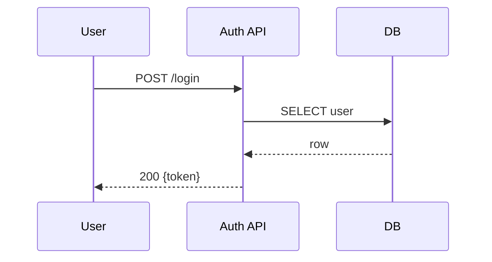
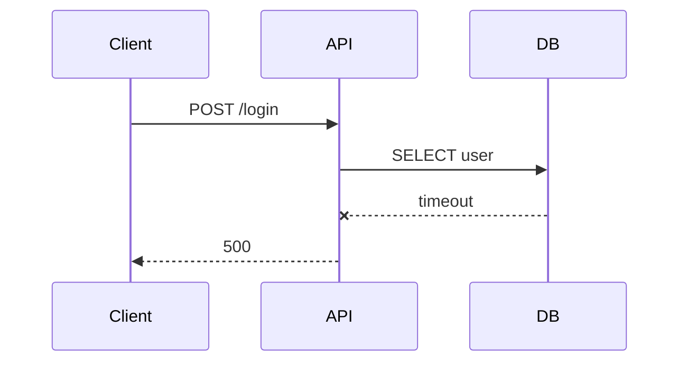
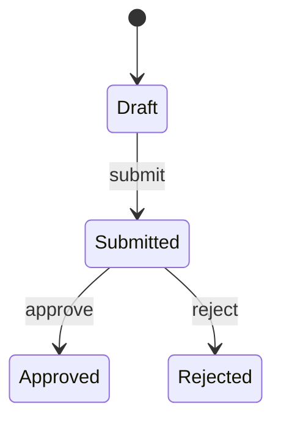

# Agent Instructions

> **Precedence**: Project-level `AGENTS.md` overrides any rule here on conflict. Otherwise these rules apply.
> **Style**: [RFC 2119](https://www.rfc-editor.org/rfc/rfc2119) keywords — **MUST**, **MUST NOT**, **SHOULD**, **SHOULD NOT**.

## Contents

1. [Branch Naming](#branch-naming)
2. [Commit Messages](#commit-messages)
3. [Pull Requests / Merge Requests](#pull-requests--merge-requests)
4. [Issues / Tasks](#issues--tasks)
5. [CI/CD Pipeline Monitoring](#cicd-pipeline-monitoring)
6. [Destructive / Bypass Operations](#destructive--bypass-operations)
7. [Secrets](#secrets)
8. [Figma](#figma)
9. [Interactive / Long-Running Processes](#interactive--long-running-processes)
10. [Rebase](#rebase)
11. [Scripting Runtime](#scripting-runtime)
12. [JavaScript Package Managers](#javascript-package-managers)

## Branch Naming

**MUST NOT** keep, commit on, or push any auto-generated branch name. Rename in place with `git branch -m` **before the first commit** — renaming after commits/pushes leaks the name to history and remote.

**Forbidden patterns** (rename, never re-create):

- OpenCode: `opencode/<adjective>-<noun>`
- Codex: `codex/<adjective>-<noun>`
- GitLab issue button / `glab issue develop`: `<N>-<issue-slug>` (e.g. `13-feat-requester-rebuild-...`)
- GitHub *Development → Create a branch* / `gh issue develop`: `<N>-<slug>`
- Any other tool-generated placeholder

```bash
git branch --show-current                                  # check
git branch -m opencode/playful-engine feature/add-auth     # ✅ rename in place
git branch -m codex/dapper-otter      bugfix/login-500     # ✅ rename in place
git checkout -b feature/add-auth                           # ❌ leaves the old branch orphaned
```

**Naming convention** (Git Flow, unless the project defines its own):

| Prefix | Use for | Matching commit type |
|---|---|---|
| `feature/` | New features | `feat` |
| `bugfix/` | Bug fixes | `fix` |
| `hotfix/` | Urgent production fixes | `fix` |
| `refactor/` | Code restructuring | `refactor` |
| `docs/` | Documentation | `docs` |
| `chore/` | Maintenance / config | `chore` |
| `release/` | Release preparation | n/a |

Slug **MUST** be a 3–6 word human-authored summary — not the full issue title, not the issue number.

**One task = one branch.** Name needs changing → rename it. **MUST NOT** create a sibling branch for the same work.

## Commit Messages

**MUST** follow [Conventional Commits](https://www.conventionalcommits.org/): `<type>(<scope>)<!>: <description>`.

| Type | Use for |
|---|---|
| `feat` | New feature |
| `fix` | Bug fix |
| `docs` | Documentation only |
| `style` | Formatting, whitespace (no logic change) |
| `refactor` | Restructure (no feature/fix) |
| `perf` | Performance improvement |
| `test` | Tests |
| `build` | Build system / dependencies |
| `ci` | CI/CD configuration |
| `chore` | Maintenance |
| `revert` | Reverting a previous commit |

- **Subject**: lowercase, imperative, no period, ≤50 chars (≤72 max).
- **Scope** (optional): module/area — `feat(auth): add JWT refresh`.
- **Body** (optional): explain *why*, not *what*. Wrap at 72 chars.
- **Breaking change**: `!` after type/scope **and** `BREAKING CHANGE:` footer.
- **Trailers**: `Closes #N` / `Fixes #N` (auto-close on merge), `Refs #N` / `Refs !N` (link only), `Co-authored-by: Name <email>`.

```
feat(auth): add JWT refresh token rotation
feat(api)!: remove deprecated v1 endpoints

BREAKING CHANGE: v1 API endpoints have been removed. Migrate to v2.
```

**MUST NOT**: emojis, sentence case, trailing periods, vague subjects (`update stuff`, `fix things`, `wip`), AI-tool branding (no "Generated with Claude", no `🤖`, no `Co-authored-by:` trailers naming an AI).

## Pull Requests / Merge Requests

**Required ordering** — open a **draft** PR/MR up-front, then work against it, then promote to ready. Issue linking happens **after** the PR/MR exists, never before:

1. Create the branch **manually** with a Git Flow name (see [Branch Naming](#branch-naming)). **MUST NOT** start from any issue-linked branch flow.
2. Make the **first real commit** on the branch and push it. The commit **MUST** carry actual work — a real code/doc/config change tied to the task. **MUST NOT** use `git commit --allow-empty` or fabricate a scaffolding/placeholder commit just to open the draft. If there is nothing concrete to commit yet, the draft is premature: do the first slice of work, commit that, then open the draft.
3. **Immediately after the first commit lands on the remote**, open the PR/MR as a draft with `gh pr create --draft` / `glab mr create --draft`. **MUST** pin the source branch explicitly (see [trap](#source-branch-substitution-trap)). Do not accumulate multiple local commits before opening the draft — the draft is the working surface, and reviewers/automation should see it as soon as there is one real commit to show. Drafts signal work-in-progress, block accidental merges on most hosts, and give the agent a stable surface to push to.
4. Link the issue via a closing keyword in the draft body — at creation time, or post-creation with `gh pr edit <num> --body ...` / `glab mr update <num> --description ...`. Mirror the issue's checklist into the draft body so reviewers can watch progress in one place (see [Tracking checkbox progress](#tracking-checkbox-progress-on-an-issue-or-prmr)).
5. Do the work. Commit and push frequently to the draft. **MUST** tick the issue's checkboxes (and the mirrored boxes in the PR/MR body) as each item lands — never batch checkbox updates at the end.
6. When the work is complete, verified, and the pipeline is green (see [CI/CD Pipeline Monitoring](#cicd-pipeline-monitoring)), **promote the draft to ready** with `gh pr ready <num>` / `glab mr update <num> --ready`. **MUST NOT** promote a draft whose checklist still has unchecked items unless those items are explicitly out of scope and noted as such in the body.

**Forbidden flows** (all fabricate branch names and bypass the rules above):

- GitHub: *Development → Create a branch*, *Linked issues* picker on the PR-creation form, `gh issue develop`, `gh pr create --issue <N>`.
- GitLab: *Create merge request* button on an issue, *Linked issues* picker, `glab issue develop`, `glab mr create --related-issue <N>`.

### Source-branch substitution trap

`--related-issue` (glab), `--issue` (gh), and the *Linked issues* UI picker do **not** use your currently pushed branch. They look up — or auto-create — a host-fabricated `<N>-<slug>` branch and use **that** as `source_branch`. The real branch is silently ignored: the MR/PR opens with `commits: []` and `head_sha == base_sha`. The create call **does not fail**.

**Mitigations**:

- **MUST NOT** pass `--related-issue` to `glab mr create` or `--issue` to `gh pr create`.
- **MUST NOT** use the *Linked issues* UI picker on the PR/MR creation form.
- **MUST** pin the source branch on every create call:

```bash
# GitLab
glab mr create \
  --source-branch "$(git branch --show-current)" \
  --target-branch main \
  ...

# GitHub
gh pr create \
  --head "$(git branch --show-current)" \
  --base main \
  ...
```

**MUST** verify immediately after creation — the create call does not fail when the source branch is wrong:

```bash
# GitLab — source_branch MUST match the pushed branch; head_sha MUST differ from base_sha
MR_IID=<iid>
PROJECT=$(glab repo view -F json | jq -r '.path_with_namespace' | sed 's|/|%2F|g')
glab api "projects/$PROJECT/merge_requests/$MR_IID" \
  | jq '{source_branch, head_sha: .diff_refs.head_sha, base_sha: .diff_refs.base_sha}'
glab api "projects/$PROJECT/merge_requests/$MR_IID/commits" | jq 'length'   # MUST be > 0

# GitHub — headRefName MUST match the pushed branch; commit count MUST be > 0
gh pr view <num> --json headRefName,commits \
  | jq '{headRefName, commit_count: (.commits | length)}'
```

If `source_branch` / `headRefName` matches `^[0-9]+-` instead of the pushed Git Flow name, or commit count is `0`: the PR/MR is **broken**. Close it, delete the stray remote branch (`git push origin --delete <N>-<slug>`), recreate.

A `<N>-<slug>` ref on the remote is the trap's bait — host-auto-created the moment an issue is referenced, points at the target branch's HEAD, zero commits. Never legitimate. Delete before retrying.

### Issue-linking keywords

Use in the PR/MR **body** (and, where supported, commit messages). Bare `#N` autolinks but does **not** auto-close.

| Host | Auto-close on merge | Link without closing | Cross-repo / cross-project |
|---|---|---|---|
| **GitHub** | `Close[s\|d] #N`, `Fix[es\|ed] #N`, `Resolve[s\|d] #N` — body + commit messages, default branch only | bare `#N` autolinks | `owner/repo#N` |
| **GitLab** | `Close[s\|d\|ing] #N`, `Fix[es\|ed\|ing] #N`, `Resolve[s\|d\|ing] #N`, `Implement[s\|ed\|ing] #N` — description + commit messages, default branch only | `Related to #N` / `Ref #N` | `group/project#N` (issue); `group/project!N` is an **MR** ref, not an issue-closer |

Docs: GitHub — <https://docs.github.com/en/github/managing-your-work-on-github/linking-a-pull-request-to-an-issue>; GitLab — <https://docs.gitlab.com/user/project/issues/managing_issues/#closing-issues-automatically>.

### Pre-create gates

**MUST** run the project's verification commands (test / lint / typecheck / build — whichever it defines) on the current HEAD. **MUST NOT** submit with known-failing checks unless documented in the body and user-approved.

**MUST** commit and push all changes. Both gates pass:

```bash
git status                                              # MUST be clean
git rev-parse --abbrev-ref @{u} >/dev/null 2>&1 \
  && git log @{u}..                                     # if upstream exists, MUST be empty
                                                        # else: `git push -u origin <branch>` first
```

### Create rules

- **Title MUST** follow Conventional Commits — a squash merge then produces a clean single commit on the default branch.
- **Body SHOULD** include: problem summary, what changed, how it was verified. Link related work via trailers (`Closes #123`, `Refs !456`). When the linked issue has a tracking checklist, **MUST** mirror that checklist into the PR/MR body so reviewers and merge automation see the same state on both surfaces.
- **MUST** assign the PR/MR to the authenticated user.
- **MUST** open as a draft (`--draft`) on initial creation, per [Required ordering](#pull-requests--merge-requests). Promote to ready only after the work is complete, verified, and the pipeline is green — see [Tracking checkbox progress](#tracking-checkbox-progress-on-an-issue-or-prmr) for the readiness gate.

| Host | Assign-to-self | Additional flags |
|---|---|---|
| GitHub | `gh pr create --assignee @me` | — |
| GitLab | `glab mr create --assignee "$(glab api user \| jq -r '.username')"` | `--remove-source-branch` (cleanup after merge) |

## Issues / Tasks

### Host: `git.jpi.app` (GitLab, self-managed)

#### Reading an issue or work item

**MUST** use `glab issue view` to read issues and work items. **MUST NOT** hit `glab api projects/.../issues/...` for read access — `glab issue view` already wraps the API, handles host resolution from the URL, renders the body cleanly, and accepts `--comments` for the discussion thread and `-F json` for machine-readable output.

**Work items vs. issues — URL gotcha**: GitLab is migrating issues to the unified *work items* system. The web UI now serves the same IID under **both** `/-/issues/<iid>` and `/-/work_items/<iid>`. `glab issue view` accepts the `/-/issues/<iid>` form but **rejects** `/-/work_items/<iid>` with `Invalid issue format`. **MUST** rewrite any `/-/work_items/<iid>` URL the user pastes to `/-/issues/<iid>` before passing it to `glab issue view`. (`glab work-items` exists but is EXPERIMENTAL and has no `view` subcommand — list/create/update/delete only.)

**Issues vs. tasks — choose the right GitLab type**: GitLab exposes both as work items, but they are not interchangeable. An **issue** is the externally visible problem, feature, or bug that owns the branch/MR, review, and closing keyword. A **task** is a smaller implementation unit under or alongside an issue. **MUST NOT** create every unit of work as an issue by default. Before creating anything, decide whether it needs independent triage/release notes/customer visibility (issue) or is only a breakdown item for execution (task).

Use the task-specific `glab work-items` commands for task work items — **MUST NOT** fake tasks as checkbox-only prose when the project expects GitLab task objects:

```bash
# List existing tasks before creating duplicates.
glab work-items list --type task -R <group>/<project> --per-page 100 --output json

# Create a task work item. Include the parent issue reference in the description when
# the CLI cannot express the hierarchy directly.
cat > /tmp/task-body.md <<'EOF'
Parent: #42

Acceptance:
- [ ] Reject addresses without @
EOF

glab work-items create \
  --type task \
  -R <group>/<project> \
  --title "Implement validateEmail()" \
  --description "$(cat /tmp/task-body.md)" \
  --output json

# Update task state fields through the work-item surface.
glab work-items update <task-iid> \
  -R <group>/<project> \
  --assignee "$(glab api user | jq -r '.username')" \
  --startdate "$(date +%F)" \
  --duedate "2026-05-29" \
  --weight 1
```

`glab work-items` is marked EXPERIMENTAL by GitLab, but it is the CLI surface that can create and update work item types such as `task`. Use it for task objects. Use `glab issue ...` for issue-specific operations such as comments, close/reopen, issue boards, issue time tracking, and issue descriptions.

#### Starting work: start date and estimate

When starting implementation for a GitLab issue or task, **MUST** set or update the planning metadata before opening the branch/MR:

- **Start date**: set to the day work actually starts (`$(date +%F)`), not the day the issue was created.
- **Estimate**: set or update the expected effort using GitLab's time-tracking duration format (`30m`, `2h`, `1d`, `1w`, etc.) when the work is issue-sized. For tiny tasks where the project uses weights instead of time, set a task weight instead.
- **Due date**: set only when the issue, milestone, or user supplied a deadline. **MUST NOT** invent a deadline just to fill the field.

Prefer direct CLI flags where they exist. `glab work-items update` supports `--startdate`, `--duedate`, `--weight`, and `--assignee`; `glab issue create` supports `--time-estimate`, `--time-spent`, `--due-date`, and `--weight`. `glab issue update` does **not** expose start-date or time-estimate flags, so use `glab work-items update` for the start date and the GitLab issue time-tracking API through `glab api` for an estimate on an existing issue:

```bash
# Existing issue: mark the actual start date through the work-item surface.
glab work-items update <issue-iid> \
  -R <group>/<project> \
  --startdate "$(date +%F)" \
  --assignee "$(glab api user | jq -r '.username')"

# Existing issue: set or replace the GitLab time estimate.
glab api --method POST \
  projects/:fullpath/issues/<issue-iid>/time_estimate \
  -f "duration=4h"

# New issue: set the estimate at creation time when known.
glab issue create \
  -R <group>/<project> \
  --title "fix(auth): reject expired sessions" \
  --description "$(cat /tmp/issue-body.md)" \
  --time-estimate 4h \
  --due-date 2026-05-29
```

**MUST** record the estimate source in the issue/MR body when it is non-obvious (for example, “Estimate: 4h based on two UI screens plus API validation”). If the user explicitly provided an estimate, preserve it exactly unless new evidence makes it wrong; then update it and leave a brief issue comment explaining the change.

**Self-managed host resolution**: `glab` resolves the host in this order: (1) the current repo's git remote, (2) the host embedded in a URL argument, (3) `GITLAB_HOST` env var, (4) the global default (`gitlab.com`). When the cwd is a clone of a self-managed project (e.g. anything under `git.jpi.app`), bare `glab issue view <iid>` works — no env var, no `-R`, no URL. The env var is **only** required when none of the higher-priority sources point at the right host (e.g. running from an unrelated repo, or — like this dotfiles repo — a GitHub-hosted clone) **and** you don't want to pass the full URL:

```bash
# Inside a clone of the target project — host auto-detected from the git remote.
glab issue view 22 --comments

# From an unrelated cwd — full URL form (host extracted from the URL). Preferred for one-off reads.
glab issue view "https://git.jpi.app/products/examvue-duo/examvue-apps/-/issues/22" --comments

# From an unrelated cwd, scripting multiple calls against the same host — GITLAB_HOST + -R + IID.
GITLAB_HOST=git.jpi.app glab issue view 22 -R products/examvue-duo/examvue-apps --comments

# JSON for downstream processing.
glab issue view 22 -F json | jq .
```

`glab api` is the fallback **only** when `glab issue view` cannot express the call (custom fields, batch queries, GraphQL work-item queries). State the reason inline when reaching for `glab api`.

#### Creating an issue or work item

When creating an issue or work item (task) on `git.jpi.app`:

- **MUST** assign labels (tags) yourself. Choose labels that accurately reflect the work — type (`bug`, `feature`, `chore`, `docs`, `refactor`, etc.), area/component, priority, and any other dimension already in use on the project.
- **MUST** inspect the project's existing label set first (`glab label list -R <project> --per-page 100`) and reuse existing labels rather than inventing parallel names.
- **MUST NOT** open an issue/task with zero labels. Unlabelled items rot in triage.
- **SHOULD** apply multiple labels when the work spans multiple dimensions (e.g. `bug` + `area::auth` + `priority::high`).
- **MUST** assign the issue/task to the authenticated user on creation. Use `--assignee "$(glab api user | jq -r '.username')"` on `glab issue create` — resolve the username dynamically every time, do **not** hard-code a username. The same rule applies when re-assigning later via `glab issue update <iid> --assignee "$(glab api user | jq -r '.username')"`. **MUST NOT** substitute a literal username (yours, the user's, or anyone else's) — the authenticated session is the only source of truth, and hard-coded usernames break the moment the script runs under a different account or against a different host.

##### Required workflow (list → match → create-if-missing → apply)

The rule is "**reuse first, create when missing — never skip**". A dimension that has no good existing label is **not** an excuse to omit that dimension; it is a signal to create the label. The list-and-skip pattern (search the existing set, find nothing matching, then create the issue with zero labels or only the labels that happened to exist) is the primary failure mode this section forbids.

1. **List** the project's label set (and the parent group's, since group labels are inherited by child projects):

   ```bash
   glab label list -R <group>/<project> --per-page 100 -F json | jq -r '.[].name'
   glab label list -g <group> --per-page 100 -F json | jq -r '.[].name'   # inherited group labels
   ```

2. **Match** the work across every dimension already in use on the project: type, area/component, priority, status, plus any other axis you see in the listed labels. If a dimension has an existing label that fits, reuse it.

3. **Create-if-missing** — for every dimension where no existing label fits, **MUST** create the missing label *before* opening the issue, not after. Creating a label is cheap, reversible, and the only way to avoid silently dropping a dimension.

   ```bash
   # Create at project scope (visible only on this project).
   glab label create -R <group>/<project> \
     --name "area::reporting" \
     --color "#1F75CB" \
     --description "Reporting and analytics surface"

   # Create at group scope (inherited by every child project — prefer this for cross-project taxonomies
   # like type/priority labels).
   glab label create -g <group> \
     --name "priority::high" \
     --color "#D9534F" \
     --description "Should be picked up in the current iteration"
   ```

   Every newly-created label **MUST** carry: `--name`, `--color` (HEX), `--description`. A label without a description rots in triage just like an unlabelled issue. Scoped labels (`scope::value`) auto-replace siblings within their scope — prefer scoped labels for any mutually-exclusive dimension (priority, status, area, severity).

4. **Apply** — pass the full set on `glab issue create`. The `--label` value is a comma-separated list and accepts both pre-existing and just-created label names:

   ```bash
   glab issue create -R <group>/<project> \
     --title "..." \
     --description "$(cat /tmp/issue-body.md)" \
     --label "bug,area::reporting,priority::high"
   ```

##### When uncertain

If the right label genuinely cannot be determined from existing context (e.g. priority is ambiguous, area boundary is unclear), pick the closest existing label, note the uncertainty in the issue body, and ask the user in the same turn. **MUST NOT** silently downgrade to fewer labels or omit the uncertain dimension.

#### Rich content in issue/task descriptions

Plain-text walls of bullet points are hard to triage. **MUST** use the host's full markdown surface to make descriptions scannable. Both GitHub and GitLab render the same primitives natively — no extension, no plugin.

**Required when applicable**:

- **MUST** embed at least one of: a diagram (mermaid), a screenshot/image (bug reports, UI work), a state/flow table, or a comparison table — whenever the issue describes a flow, a system interaction, a UI surface, or a before/after change. A bug report without a reproduction screenshot or trace, or a feature with a non-trivial flow described only in prose, is incomplete.
- **MUST** prefer mermaid over ASCII art for any diagram. Mermaid renders inline on both hosts; ASCII art breaks on mobile and in copy-paste.
- **MUST** use fenced code blocks with a language tag for every code snippet, log excerpt, config sample, or command. Bare indented blocks lose syntax highlighting and break copy-paste.
- **SHOULD** use task lists (`- [ ]`) for acceptance criteria and subtask breakdowns — both hosts render them as interactive checkboxes that contributors can tick without editing the description.
- **SHOULD** use collapsible `<details><summary>…</summary>…</details>` blocks for long logs, full stack traces, and reproduction transcripts that would otherwise bury the description.

**Mermaid** — fence with `mermaid`. Both hosts render natively:

````markdown

````

Supported diagram types include `flowchart`, `sequenceDiagram`, `stateDiagram-v2`, `erDiagram`, `classDiagram`, `gantt`, and `gitGraph`. Pick the one that matches the artifact being described — sequence diagrams for request flows, state diagrams for lifecycles, flowcharts for decision trees, ER diagrams for data models.

**Images and screenshots** — host them on the platform, not on third-party image hosts:

- GitHub: drag-and-drop into the web editor uploads to `user-images.githubusercontent.com` and inlines the `` markdown. From the CLI, attach via the web UI after `gh issue create`, or reference an asset already committed in the repo (``).
- GitLab: drag-and-drop uploads to `/uploads/<hash>/<filename>` on the project and inlines the markdown. From the CLI, **MUST** upload via `glab api` (see [GitLab image uploads from the CLI](#gitlab-image-uploads-from-the-cli) below).
- **MUST NOT** hotlink to Slack, Notion, Google Drive, Dropbox, or any host requiring auth — the image will 403 for anyone outside the original session.
- **MUST** provide alt text in every `` — screen readers, and the alt is what surfaces when the image 404s later.

#### GitLab image uploads from the CLI

**MUST** upload through `glab api`. `glab api` is GitLab's authenticated HTTP wrapper — it reuses the session stored by `glab auth login` and injects credentials internally. The agent never sees, reads, parses, or passes a token.

**MUST NOT** read or pass GitLab tokens by any other means. Forbidden, all of these:

- `curl -H "PRIVATE-TOKEN: $TOKEN" ...` / `curl -H "Authorization: Bearer ..."` against the GitLab API.
- `wget --header="PRIVATE-TOKEN: ..."`, `httpie` with a manual token header, or any other raw HTTP client carrying a GitLab credential.
- Reading the token out of `glab auth status -t`, `~/.config/glab-cli/config.yml`, the macOS Keychain, libsecret, environment variables (`GITLAB_TOKEN`, `GITLAB_API_TOKEN`, `CI_JOB_TOKEN`, etc.), or any `.env` / `op://` reference, then handing it to a non-glab tool.
- Asking the user to paste a token. The token already lives in glab's session; ask the user to run `glab auth login` if `glab api user` fails, never to surface the secret.

**Flag — `--form`, not `--field`**: `glab api` has two distinct flags:

- `-F` / `--field` builds a JSON body. **Wrong for files.**
- `--form` builds a `multipart/form-data` body and supports `@<path>` for file uploads. **Required for `/uploads`.**

There is no short alias for `--form`; spell it out.

**Endpoint**: `POST /projects/:id/uploads`. Returns:

```json
{
  "id": 123,
  "alt": "screenshot",
  "url": "/uploads/abc123def456/screenshot.png",
  "full_path": "/-/project/42/uploads/abc123def456/screenshot.png",
  "markdown": ""
}
```

Use the returned `markdown` field verbatim in the issue/MR/comment body — it is already a project-relative path GitLab renders correctly anywhere inside that project. **MUST NOT** hand-build the markdown from `url` or `full_path` — `full_path` is a numeric project-id internal route (`/-/project/<id>/uploads/...`), not a human-readable group/project path; only the `markdown` field's `/uploads/<hash>/<name>` form is the stable, project-relative reference that survives copy-paste across issues, comments, and MRs in the same project.

**Filenames with spaces or non-ASCII characters** work — pass the path unquoted-but-inside-the-`--form`-value-string (e.g. `--form "file=@/path/with spaces/판독문.png"`). GitLab rewrites spaces to underscores in the returned `alt` and `markdown` (e.g. `판독문 최종확인.png` → `판독문_최종확인`). Don't try to pre-rename — the rewrite is server-side and consistent.

**Worked example — create an issue with an inline screenshot**:

```bash
# 1. Upload the file. Use :fullpath (URL-encoded namespace/project) or :id; both work.
#    Capture the response into a variable so the markdown snippet survives for the next step.
UPLOAD_JSON=$(glab api --method POST projects/:fullpath/uploads \
  --form "file=@./screenshot.png")

IMAGE_MD=$(echo "$UPLOAD_JSON" | jq -r '.markdown')

# 2. Build the description body in a file (per the rule on shell-quoting markdown).
cat > /tmp/issue-body.md <<EOF
## Summary
Login form returns 500 on stale session.

## Screenshot
$IMAGE_MD
EOF

# 3. Create the issue, referencing the description file.
glab issue create \
  --title "fix(auth): login 500 on stale session" \
  --description "$(cat /tmp/issue-body.md)" \
  --label "bug,area::auth,priority::high"
```

**Attaching to an existing issue** — same upload step, then either edit the description or post a comment:

```bash
# Edit description in place. Fetch current body, append the new markdown, push back.
CURRENT=$(glab issue view <iid> -F json | jq -r '.description')
printf '%s\n\n%s\n' "$CURRENT" "$IMAGE_MD" > /tmp/issue-body.md
glab issue update <iid> --description "$(cat /tmp/issue-body.md)"

# Or attach via a comment (preferred when adding evidence to an in-flight discussion).
glab issue note <iid> -m "Reproduction screenshot:

$IMAGE_MD"
```

**Self-managed hosts** — same rules. `glab api` honours the host resolution order from [Reading an issue or work item](#reading-an-issue-or-work-item): repo remote → URL → `GITLAB_HOST` → `gitlab.com`. From an unrelated cwd, pin the host: `GITLAB_HOST=git.jpi.app glab api --method POST projects/products%2Fexamvue-duo%2Fexamvue-apps/uploads --form "file=@./screenshot.png"`.

**Verification** — if `glab api user` returns `401`, the glab session is missing or expired. **STOP** and ask the user to run `glab auth login --hostname <host>`. **MUST NOT** work around it by reaching for a raw token.

**Tables** for comparisons, state matrices, and option breakdowns. Headers required (GitHub/GitLab both reject header-less tables).

**Math** (when genuinely needed for algorithm/perf/statistics issues): both hosts render LaTeX inside `$…$` (inline) and `$$…$$` (block).

**Bug-report description template** (adapt freely; the headings are the floor, not the ceiling):

```markdown
## Summary
One-sentence description of the defect.

## Steps to reproduce
1. …
2. …
3. …

## Expected vs. actual
| | Expected | Actual |
|---|---|---|
| Outcome | … | … |
| HTTP status | 200 | 500 |

## Screenshot / video


## Flow



## Logs

<details><summary>API stderr (excerpt)</summary>

```
2026-05-21T09:14:02Z ERROR pg: connection timed out after 5s
…
```

</details>

## Environment
- Host: …
- Browser / client: …
- Commit / version: …
```

**Feature-request description template**:

```markdown
## Problem
What the user can't do today, and why it hurts.

## Proposed solution
What we'll build, at a level a reviewer can sanity-check.

## Acceptance criteria
- [ ] …
- [ ] …
- [ ] …

## Flow / state



## Out of scope
- …
```

When piping a description from a file (recommended for anything non-trivial — shell quoting mangles mermaid backticks and nested code fences):

```bash
glab issue create -R <group>/<project> \
  --title "fix(auth): login 500 on stale session" \
  --description "$(cat ./issue-body.md)" \
  --label "bug,area::auth,priority::high"

gh issue create \
  --title "fix(auth): login 500 on stale session" \
  --body-file ./issue-body.md \
  --label "bug,area/auth,priority/high"
```

### Tracking checkbox progress on an issue or PR/MR

GitHub and GitLab both render `- [ ]` / `- [x]` lines in issue and PR/MR bodies as interactive checkboxes. They are the canonical, host-rendered progress surface — reviewers, dashboards, and merge automation all read them. **MUST** keep them in sync with reality as work happens, not after the fact.

**Required behaviour**:

- **MUST** tick each checkbox **at the moment** the corresponding item lands (commit pushed, file written, sub-task verified) — never batch ticks at the end of a session, never tick speculatively before the work is done.
- **MUST** keep the issue's checklist and the PR/MR body's mirrored checklist in lock-step. Update both in the same turn; a mismatch between the two surfaces is a defect.
- **MUST NOT** edit checkbox text or reorder items as a side effect of ticking. Tick state changes only — copy, ordering, and indentation stay byte-identical so diff history is readable.
- **MUST NOT** delete unchecked items to "make progress visible". Out-of-scope items get an explicit `~~strikethrough~~` and an inline note (`- [ ] ~~Item Z~~ — deferred, see #N`), not deletion.
- **MUST NOT** promote a draft PR/MR to ready while its checklist still has unchecked items unless every remaining item is explicitly marked out of scope in the same body.
- **SHOULD** post a brief comment summarising progress when a meaningful batch of checkboxes flips (e.g. all items in one section), so watchers get a notification — silent in-place edits do not trigger notifications on either host.

**Updating from the CLI** — both hosts require a full-body replacement; there is no per-checkbox API. Fetch the current body, flip the exact `- [ ]` → `- [x]` lines, push the whole body back. Preserve every other byte:

```bash
# GitLab — issue
CURRENT=$(glab issue view <iid> -F json | jq -r '.description')
# Flip a specific line. MUST match the full line to avoid touching look-alikes.
UPDATED=$(printf '%s' "$CURRENT" | sed 's|^- \[ \] Implement validateEmail()$|- [x] Implement validateEmail()|')
printf '%s' "$UPDATED" > /tmp/issue-body.md
glab issue update <iid> --description "$(cat /tmp/issue-body.md)"

# GitLab — MR body (same pattern)
CURRENT=$(glab mr view <iid> -F json | jq -r '.description')
# ... edit ...
glab mr update <iid> --description "$(cat /tmp/mr-body.md)"

# GitHub — issue
CURRENT=$(gh issue view <num> --json body -q '.body')
# ... edit ...
gh issue edit <num> --body-file /tmp/issue-body.md

# GitHub — PR body
CURRENT=$(gh pr view <num> --json body -q '.body')
# ... edit ...
gh pr edit <num> --body-file /tmp/pr-body.md
```

**MUST NOT** hand-edit by passing a fresh body that omits sections you did not regenerate — that silently deletes prose, comments, or other checklists. Always start from the live `description` / `body` and apply targeted line flips.

**Promotion to ready** — once every required checkbox is ticked, the verification gates have passed, and the pipeline is green:

```bash
gh pr ready <num>                              # GitHub: flip draft → ready
glab mr update <iid> --ready                   # GitLab: flip draft → ready
```

Verify the flip landed (`gh pr view <num> --json isDraft` should return `false`; `glab mr view <iid> -F json | jq .draft` should return `false`). A draft that won't promote usually means a required check is still pending — finish the check, do not work around it by editing the draft state through the API.

## CI/CD Pipeline Monitoring

The pipeline (GitHub Actions / GitLab CI/CD / configured equivalent) is the canonical verification surface. Local runs are necessary but not sufficient — the pipeline runs in a clean environment with additional jobs (integration tests, security scans, matrix builds, deploy previews) and is the gate reviewers and merge automation actually trust.

**MUST monitor the pipeline to completion on every push that opens or updates a PR/MR.** "Push and walk away" is forbidden. The task is done when the pipeline lands green, not when the push succeeds.

**MUST poll until a terminal state**: `success`, `failure`, `cancelled`, `timed_out`, `action_required`. `pending` / `queued` / `running` / `in-progress` are NOT terminal — keep polling.

```bash
# GitHub
gh pr checks <num> --watch                                  # blocks until all checks finish
gh run list --branch "$(git branch --show-current)" --limit 5
gh run watch <run-id>                                       # tail a specific run
gh run view <run-id> --log-failed                           # failed-job logs only

# GitLab
glab ci status                                              # current branch's pipeline summary
glab ci view                                                # interactive pipeline view
glab ci trace <job-id>                                      # stream a job's log
glab api "projects/$PROJECT/merge_requests/$MR_IID/pipelines" \
  | jq '.[0] | {id, status, sha, web_url}'
```

**If the pipeline fails, MUST fix it until green.** A red pipeline is an open defect on the PR/MR — in-scope regardless of whether the failing job tests code the agent touched directly:

1. Read the failing job's log (`gh run view --log-failed`, `glab ci trace`). Identify the actual error, not just the exit code.
2. Diagnose root cause — real regression, flake, env drift, missing secret, dependency cooldown, lint trip, etc.
3. Fix at the source. For genuinely flaky tests outside the change, **surface the flake to the user** before retrying — do not mask flakes by re-running.
4. Commit, push, resume monitoring on the new run.
5. Repeat until `success`.

**MUST NOT** declare ready, hand off, or mark complete while the pipeline is failing, cancelled, or still running.

**MUST NOT "fix" a red pipeline by**:

- Disabling, skipping, or deleting the failing job/check.
- Marking the failing test as skipped/expected-failure without explicit user approval.
- Re-running failed jobs hoping for a different result (more than once, only for genuinely flaky unrelated jobs, and only after surfacing the flake).
- Pushing `[skip ci]` / `[ci skip]` / `--ci-skip` on a change-bearing commit.
- Force-pushing to hide failed pipeline history.

**Exception — pre-existing failures**: if the failing job was already red on the default branch (verify by checking the latest default-branch pipeline), document in the PR/MR body, surface to the user, do not block on it. **MUST NOT** assume "pre-existing" without verifying — "looks unrelated" is not verification.

**Auto-merge** (GitHub auto-merge, GitLab "Merge when pipeline succeeds") does not absolve monitoring. It merges on green; it does not fix red.

## Destructive / Bypass Operations

**MUST NOT** run without an explicit user request in the same turn:

- `git commit --no-verify`, `git push --no-verify` — bypasses pre-commit / pre-push hooks (including secret scanners).
- `git push --force` / `git push --force-with-lease` to a shared branch (`main`, `master`, `develop`, or any branch someone else may have pulled).
- `git reset --hard`, `git clean -fdx` on a tree with uncommitted work.
- `git commit --amend` on an already-pushed commit.
- `git rebase --interactive` (or any other history rewrite) on already-pushed commits.
- `rm -rf` outside the repo's ignored / build directories.

When genuinely required: **MUST** confirm with the user first — name the exact command and what it destroys or rewrites.

### Git config — NEVER touch

**MUST NOT** modify any git configuration under any circumstances. The user's git config is sacred — it encodes identity, signing keys, aliases, hooks, credential helpers, merge/diff drivers, and machine-specific behaviour the agent has no business changing.

Forbidden, all of these:

- `git config ...` at any scope (`--system`, `--global`, `--worktree`, or repo-local — including `--local`, which is the default).
- Editing `~/.gitconfig`, `~/.config/git/config`, `/etc/gitconfig`, `.git/config`, or any included config file directly.
- Setting `user.name`, `user.email`, `user.signingkey`, `commit.gpgsign`, `tag.gpgsign`, `core.editor`, `core.autocrlf`, `init.defaultBranch`, `pull.rebase`, `push.default`, `credential.helper`, `gpg.format`, `gpg.ssh.allowedSignersFile`, or anything else — neither to "fix" a problem nor to "match the project's convention" nor to silence a warning.
- Setting `GIT_AUTHOR_*` / `GIT_COMMITTER_*` env vars to override identity for a commit.
- Running `git commit --author "..."` to forge a different author.
- Adding includes (`include.path`, `includeIf.*.path`) or rewriting URL rewrites (`url.*.insteadOf`).

If a commit fails because git identity is missing/wrong, signing fails, a hook misbehaves, or any other config-driven issue: **STOP** and ask the user to fix their config. **MUST NOT** work around it by mutating config, exporting env overrides, or passing `--author`/`-c user.email=...` to a single command. The only acceptable response is to surface the problem and wait.

This rule has no exceptions and applies even when the user gives a general instruction to "fix the git setup" — confirm the exact `git config` invocation with the user first, then run only that one command.

## Secrets

**MUST NOT** commit, even briefly, even in a fixup commit slated for squash:

- `.env`, `.env.*` (except `.env.example`, `.env.sample`, and other clearly-templated variants).
- Private keys (`*.pem`, `id_*` without `.pub`, `*.age`, GPG private keyrings, SSH host keys).
- API tokens, OAuth client secrets, webhook signing secrets, deploy keys.
- Cloud credentials (`~/.aws/credentials`, kubeconfigs with embedded tokens, service-account JSON).
- Database connection strings with embedded passwords.

Accidental commit: **STOP**, notify the user, treat the secret as compromised, rotate it. **MUST NOT** silently rewrite history (`git rebase` / `git filter-repo` / `git filter-branch`) without explicit user instruction — published commits propagate to forks, clones, mirrors, and CI caches.

## Figma

- **MUST** use the `figma` MCP for any Figma URL.
- **MUST NOT** fetch Figma via web fetch, browser automation, screenshot tools, or any other surface.
- MCP unavailable / errors → **STOP** and ask the user to fix the MCP. **MUST NOT** improvise an alternative.
- **MUST re-fetch the latest node every time a node ID is mentioned** — never act on stale memory, even within the same session. Designers update frames between turns, commits, and MR review rounds; layout, copy, components, variants, sizes, and colors silently drift. Call `figma_get_design_context` (and `figma_get_screenshot` when visual layout matters) at the **start** of every task referencing a node, and again **before** refreshing screenshots that claim Figma parity. Cache only within the current turn.
- **MUST diff the fresh Figma response against the current implementation** before declaring Figma alignment work complete. State any gap (missing components, copy, buttons — either direction) explicitly. Out-of-scope is the user's decision, not the agent's.

## Interactive / Long-Running Processes

**MUST** use the `tmux` tool (`mcp_interactive_bash`) for: dev servers, watch modes, TUI apps, REPLs, build watchers — anything that does not terminate. Regular shell execution **WILL BLOCK** the agent session and is **forbidden** for non-terminating commands.

## Rebase

Resolve conflicts by **intent, not reflex**:

- **Regenerated / generated artifacts** (lockfiles, build outputs, sequence-numbered migrations, generated configs): take `main`'s version, then re-run the generator on top so your additions reproduce on the new base.
- **Hand-written code**: review both sides and merge intentionally. **MUST NOT** blindly pick `--ours` or `--theirs` — that silently drops one side's work.

**Note**: during a rebase, Git's `--ours` / `--theirs` are **reversed** vs. merge. `--ours` is `main` (the rebase target being replayed onto); `--theirs` is the feature commit being applied.

Wrong side / wrong direction: `git rebase --abort` and restart. **MUST NOT** continue.

## Scripting Runtime

- **MUST NOT** use Python for any new scripting, tooling, or codegen task.
- **MUST** use Node.js, Deno, or Bun (TypeScript preferred).
- **Shell** (`bash` for POSIX, PowerShell for Windows) is acceptable for system bootstrap, OS-level glue, single-purpose installer scripts. **MUST NOT** use shell for application logic, codegen, or anything that benefits from types and tests.
- **Exception**: established Python project with existing Python tooling — match the project, do not fork the runtime. State the exception explicitly when applying it.

## JavaScript Package Managers

User-global config hardens **npm, pnpm, Yarn, and Bun** against supply-chain attacks via three switches. **MUST** preserve all three:

| Switch | npm | pnpm | Yarn Berry | Bun |
|---|---|---|---|---|
| Lifecycle scripts disabled | `ignore-scripts` | `ignore-scripts` | `enableScripts: false` | `ignoreScripts` |
| Exact version pinning | `save-exact` | `save-exact` | `defaultSemverRangePrefix: ""` | `[install] exact` |
| 1-week cooldown | `min-release-age=7` (days) | `minimumReleaseAge: 10080` (min) | `npmMinimalAgeGate: 10080` (min) | `minimumReleaseAge = 604800` (sec) |

**MUST NOT** edit user-global configs (`~/.npmrc`, `~/.yarnrc.yml`, `~/.bunfig.toml`, `~/.config/pnpm/config.yaml`, or per-OS equivalents) to relax any switch. Per-project escape hatches below are the supported override.

### Overriding the lifecycle-script block

Opt in at the **narrowest possible scope**:

| Manager | Scope | Mechanism |
|---|---|---|
| **Yarn Berry** *(preferred — primary manager in this dotfiles policy)* | **per-package** | `dependenciesMeta.<pkg>.built: true` in project `package.json`. Only that package's install/build scripts run; everything else stays blocked. |
| **npm** | **per-repository** | `ignore-scripts=false` in a committed project `.npmrc`. npm has no per-package override; `dependenciesMeta` is not recognised. |
| **pnpm** | **per-repository** | Add to `allowBuilds` (pnpm v11+) or `onlyBuiltDependencies` (v10 and earlier) in `pnpm-workspace.yaml`. **MUST NOT** rely on `dependenciesMeta.<pkg>.built` — pnpm silently ignores it. |
| **Bun** | **per-repository** | Add the package name to `trustedDependencies` in project `package.json`. |

**MUST** name the specific install-time behaviour being unblocked (native binding, codegen, asset fetch, etc.) in the PR/MR description or as a code comment next to the override. "It failed without this" is not sufficient justification.

### Exact version pinning

- Every dependency in every `package.json` **MUST** be pinned to an exact version — no `^`, `~`, `>=`, `latest`, `*`, `x`.
- The user-global config produces exact specs automatically via `yarn add` / `npm install` / `pnpm add` / `bun add` — agents **SHOULD NOT** pass any range flag.
- **MUST** correct any existing range specifier to an exact version when modifying a `package.json` for any reason.
- **MUST NOT** introduce a new range specifier.
- **MUST NOT** edit a lockfile by hand to dodge the rule.
- **Exception**: a project-level `AGENTS.md` may permit ranges where genuinely required (peer-dep flexibility, library `package.json` authored for downstream consumers, etc.) — state the exception explicitly when applying it.

### Cooldown gate (1 week)

A version must be **at least one week old** before any manager resolves it. "Does not meet the minimumReleaseAge constraint" (or equivalent) means the version is too fresh and **MUST NOT** be installed.

- **MUST** pin to the most recent version that already satisfies the gate.
- **MUST NOT** add the package to a preapproved/exclude list (`npmPreapprovedPackages` in Yarn, `minimumReleaseAgeExclude` in pnpm, `minimumReleaseAgeExcludes` in Bun) without explicit per-package user approval — bypassing the gate defeats the supply-chain protection it provides.
- **MUST NOT** lower the cooldown value in any user-global or project-level config to work around a fresh-version failure.
