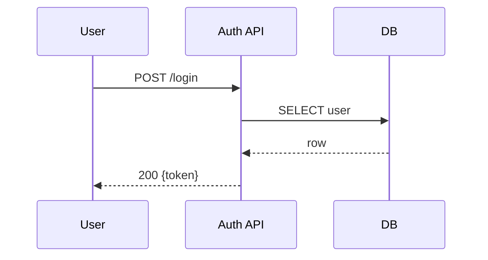

# Rich content in descriptions — reference

Plain-text walls of bullet points are hard to triage. **MUST** use the host's full markdown
surface. Both GitHub and GitLab render the same primitives natively — no extension, no plugin.

**Required when applicable**:

- **MUST** embed at least one of: a diagram (mermaid), a screenshot/image (bug reports, UI
  work), a state/flow table, or a comparison table — whenever the issue describes a flow, a
  system interaction, a UI surface, or a before/after change. A bug report without a
  reproduction screenshot or trace, or a feature with a non-trivial flow described only in
  prose, is incomplete.
- **MUST** prefer mermaid over ASCII art. Mermaid renders inline on both hosts; ASCII breaks
  on mobile and copy-paste.
- **MUST** use fenced code blocks with a language tag for every code snippet, log excerpt,
  config sample, or command.
- **SHOULD** use task lists (`- [ ]`) for acceptance criteria and subtask breakdowns — both
  hosts render interactive checkboxes.
- **SHOULD** use collapsible `<details><summary>…</summary>…</details>` blocks for long logs
  and stack traces that would otherwise bury the description.

**Mermaid** — fence with `mermaid`. Both hosts render natively:

````markdown

````

Supported types: `flowchart`, `sequenceDiagram`, `stateDiagram-v2`, `erDiagram`,
`classDiagram`, `gantt`, `gitGraph`. Pick the one that matches the artifact — sequence for
request flows, state for lifecycles, flowchart for decision trees, ER for data models.

**Images and screenshots** — host them on the platform:

- GitHub: drag-and-drop in the web editor uploads to `user-images.githubusercontent.com`.
  From the CLI, attach via the web UI after `gh issue create`, or reference an asset
  committed in the repo (``).
- GitLab: drag-and-drop uploads to `/uploads/<hash>/<filename>`. From the CLI, **MUST**
  upload via `glab api` (see [`image-uploads.md`](image-uploads.md)).
- **MUST NOT** hotlink Slack, Notion, Google Drive, Dropbox, or any auth-requiring host —
  the image will 403 outside the original session.
- **MUST** provide alt text in every ``.

**Tables** for comparisons, state matrices, and option breakdowns. Headers required (both
hosts reject header-less tables).

**Math** (when genuinely needed for algorithm/perf/statistics issues): both hosts render
LaTeX inside `$…$` (inline) and `$$…$$` (block).
