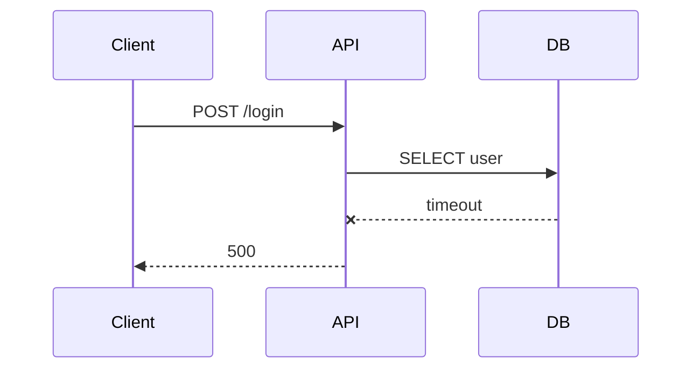
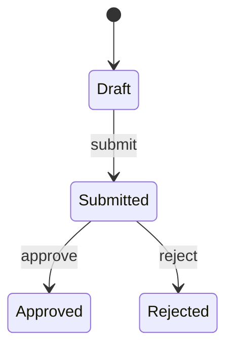

# Description templates — reference

## Bug report

(headings are the floor, not the ceiling)

```markdown
## Summary
One-sentence description of the defect.

## Steps to reproduce
1. …
2. …
3. …

## Expected vs. actual
| | Expected | Actual |
|---|---|---|
| Outcome | … | … |
| HTTP status | 200 | 500 |

## Screenshot / video


## Flow



## Logs

<details><summary>API stderr (excerpt)</summary>

```
2026-05-21T09:14:02Z ERROR pg: connection timed out after 5s
…
```

</details>

## Environment
- Host: …
- Browser / client: …
- Commit / version: …
```

## Feature request

```markdown
## Problem
What the user can't do today, and why it hurts.

## Proposed solution
What we'll build, at a level a reviewer can sanity-check.

## Acceptance criteria
- [ ] …
- [ ] …
- [ ] …

## Flow / state



## Out of scope
- …
```

## Pipe the description from a file

Pipe descriptions from a file for anything non-trivial — shell quoting mangles mermaid
backticks and nested code fences:

```bash
glab issue create -R <group>/<project> \
  --title "fix(auth): login 500 on stale session" \
  --description "$(cat ./issue-body.md)" \
  --label "bug,area::auth,priority::high"

gh issue create --title "fix(auth): login 500 on stale session" \
  --body-file ./issue-body.md \
  --label "bug,area/auth,priority/high"
```
