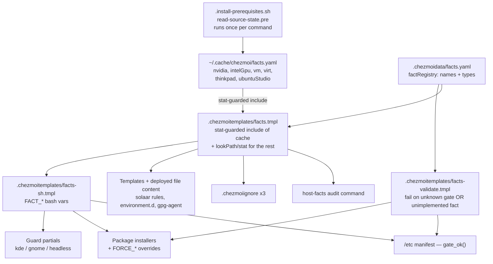

# Named Host Facts and Data-Driven Branching - Plan

> **Status:** Implemented (commit `d0f0eba`, merged via PR #44).

## Goal Capsule

- **Objective:** Make every host-identity condition in this repo resolve to a named fact declared in one place, move desktop settings out of scripts into data, and unify the `.chezmoidata/` schema — so that changing a value and tracing why a host got something each have exactly one place to look.
- **Product authority:** Repo maintainer (single maintainer, trunk-based on `main`).
- **Execution profile:** Additive first, then migrate consumers one surface at a time. U1 lands the registry with zero consumers and zero behavior change; every later unit swaps one probe site onto it.
- **Minimum viable slice:** U1, U4, U5, U9, U7. Those five kill both halves of the stated pain — editing and tracing. U2, U3, U6, U8, U10 are consistency work that can land later without stranding either half.
- **Stop conditions:** Stop and ask if a fact cannot be resolved from the pre-hook cache without a template `output` call, or if the CI `render-dotfiles` per-desktop assertion cannot be kept green.
- **Open blockers:** None.

**Product Contract preservation:** changed — R1, R10, R11, R15, and R19/R20 (removed). R10/R11: research found no GNOME script is a pure settings list, so the manifest-driven runner applies to KDE only. R1: narrowed from "every host-varying condition" to "every host-identity condition", because tool-presence probes (`command -v kwriteconfig6`) are not facts. R15: made falsifiable. R19/R20: deleted — the pre-hook cache removes the re-init requirement they existed to document. Each change was confirmed with the maintainer.

---

## Product Contract

### Summary

Introduce a named-fact registry as the spine of the repo: one declaration per host condition, consumed by templates, `.chezmoiignore`, guard partials, the package installers, and the `/etc` manifest alike. On top of it, collapse the KDE settings-only scripts into one manifest-driven runner, lift every hardcoded desktop value into data, unify the schema across the `.chezmoidata/` files, and ship an audit command that answers "what is this host, and what does it therefore get or skip."

### Problem Frame

Changing one value means reading many files, and tracing one outcome means reading different ones.

Fonts are the clearest case. `.chezmoidata/fonts.yaml` is real data — `.chezmoiexternals/fonts.toml` ranges over it to build the download URLs — but it has no field for a font *family*. Its keys are archive paths and its values are release tags. So the families `Pretendard` and `JetBrainsMono Nerd Font` are hardcoded in four places: `.chezmoiscripts/50-linux-kde/run_onchange_after_config-kde-fonts.sh.tmpl`, `.chezmoiscripts/50-linux-gnome/run_onchange_after_config-gnome-fonts.sh.tmpl`, `dot_config/fcitx5/conf/classicui.conf`, and `dot_config/VSCodium/User/settings.json`. Changing the sans font means editing four files, and not the file that advertises itself as the answer.

Tracing is worse, because the same condition is implemented several times over. Whether a host gets NVIDIA packages is decided by three things that nothing binds together: a PCI-vendor probe in the Fedora installer, a separate probe in the Ubuntu installer, and the *key name* `nvidiaPackages` in `packages.yaml` — there is not one `gate:` field in that file. The desktop fact is computed four independent ways: `lookPath` at render time (5 sites), `command -v` at runtime in the `kde-guard` / `gnome-guard` partials (21 include sites), `HAS_KDE` / `HAS_GNOME` in the two installers, and bespoke probes in the two KDE scripts that use no guard partial at all — `config-kde-wallpaper-breeze` (`XDG_CURRENT_DESKTOP` plus `pgrep plasmashell`) and `config-kde-fonts` (its own inline `command -v plasmashell`).

Two conditions have already drifted apart while nobody was watching. `systemd-detect-virt` is called with `--vm` by the `/etc` manifest's `vm` gate but bare — matching containers too — by both installers' `IS_VIRT`. And the `thinkpad` gate greps all of `dmidecode -t system`, which matches the DMI *Version* and *Family* fields, not the vendor.

The repo already states the principle it is failing to hold: *"the structure is code… the leaf value is the data knob."* `.chezmoidata/system.yaml` already implements the answer for `/etc` files — data declares a gate *name*, one script owns the probe, and an unknown name aborts the apply loudly. That pattern exists in exactly one place, and there is no `kde.yaml` at all.

### Requirements

**Fact registry**

- R1. Every host-*identity* condition resolves to a fact declared by name in exactly one place. Host identity is what the host *is* — its OS, distro, desktop, hardware, virtualization, and the presence of the platform features the `/etc` manifest gates on. It is not what happens to be installed at the moment a script runs.
- R2. The fact set covers at minimum: `os`, `distro`, `desktop` (`kde` / `gnome` / `none`), `container`, `nvidia`, `intelGpu`, `thinkpad`, `vm`, `virt`, `ubuntuStudio`, `sddmBreeze`, `gdm`, `fprintdPam`, `headless`.
- R3. A gate that names an undeclared fact fails the apply loudly, naming the valid facts. So does a fact declared in the registry with no probe behind it. Neither ever silently evaluates false.
- R4. A fact is implemented once and consumed from both template-render time (templates, `.chezmoiignore`, deployed file content) and script runtime (bash). No fact has two implementations.
- R5. Facts resolve from a cache the existing `read-source-state.pre` hook refreshes once per chezmoi command. No fact is probed with a template `output` call.
- R6. Fact values are correct under the `AGENTS.md` stub-`op` verification recipe and in the CI `render-internals` job, both of which render with an empty `--config`.

**Gate declarations**

- R7. `packages.yaml` names the fact that gates each conditional package group, instead of encoding it in the key name.
- R8. `system.yaml`'s existing `gate:` entries migrate onto the shared registry with no change in which files each host installs.
- R9. The `kde-guard`, `gnome-guard`, and `headless-guard` partials read the shared fact instead of re-probing it.
- R10. The `lookPath`-based desktop conditions in the `.chezmoiignore` files read the shared fact.

**Desktop settings as data**

- R11. KDE scripts that contain only a guard and a list of `kwriteconfig6` calls collapse into one generic, manifest-driven runner. That is 8 of 16 (`autotheme`, `dimscreen`, `dolphin`, `edges`, `emptysession`, `killrunner`, `krunner`, `spectacle`). GNOME gets no such runner — no GNOME script is a pure settings list.
- R12. Every remaining desktop script reads its literal setting values from data and keeps its own structure. On KDE that is the four applet-discovery scripts (`calendar`, `digitalclock`, `kickoff`, `panel`), the font script, `virtualkeyboard`, and the two that write no `kwriteconfig6` at all (`touchpad`, `wallpaper-breeze`). On GNOME it is all seven: each carries irreducible logic — GVariant list merges, Ptyxis profile-UUID seeding, reset-not-set semantics, or a network extension install.
- R13. Font families live in `fonts.yaml`, and every file that renders a family reads it from there — including the two deployed config files that are not scripts.
- R14. An invalid entry in a settings manifest fails the apply loudly, the way an unknown haptic waveform name already does.

**Schema unification**

- R15. All `.chezmoidata/` files follow one naming convention.
- R16. Every `packages.yaml` category key without a counterpart in the other distro carries a one-line comment naming the distro mechanism that makes it unshared, or is renamed to align with its counterpart.
- R17. `AGENTS.md` describes the post-registry repo. The "Single source of truth" list gains the KDE settings manifest and the fact registry; the `.chezmoitemplates` partials table, the OS-gating and desktop-detection section, the GNOME-tunables entry, and the Fonts entry are corrected where the registry makes them false.

**Audit surface**

- R18. One command prints this host's resolved facts.
- R19. That output extends to every gated surface — the `packages.yaml` groups, the `system.yaml` `/etc` paths, the guard-gated scripts, and the `.chezmoiignore` skip blocks — naming the fact that decided each, and naming any `FORCE_*` override in effect.

### Acceptance Examples

- AE1. Undeclared fact name.
  - **Covers R3.**
  - **Given** a data file names a gate that no declaration provides,
  - **When** any chezmoi command reads the source state,
  - **Then** the command exits non-zero naming the unknown fact and the valid names — matching the existing unknown-gate abort in the `/etc` installer.

- AE2. Declared fact with no probe.
  - **Covers R3.**
  - **Given** a fact name added to the registry but not to the probe set,
  - **When** any chezmoi command reads the source state,
  - **Then** the command exits non-zero naming the unimplemented fact. It does not silently resolve false.

- AE3. Changing a font family.
  - **Covers R13.**
  - **Given** the maintainer wants a different monospace font,
  - **When** they edit `fonts.yaml`,
  - **Then** the two font scripts, the fcitx5 config, and the VSCodium settings all pick it up, and no deployed file contains the family as a literal.

- AE4. Tracing a skipped package group.
  - **Covers R18, R19.**
  - **Given** a host with no NVIDIA GPU,
  - **When** the maintainer runs the audit command,
  - **Then** the output shows `nvidia: false` and shows that the NVIDIA package group was skipped because of it.

- AE5. Facts are correct where the maintainer actually looks.
  - **Covers R5, R6.**
  - **Given** this host, which has an NVIDIA GPU behind a PCIe bridge,
  - **When** the source state is rendered under the stub-`op` recipe's empty `--config`,
  - **Then** `nvidia` resolves `true`. A template-only PCI probe reports `false` here; the cache does not.

- AE6. A GPU-less container can still exercise the NVIDIA path.
  - **Covers R7.**
  - **Given** `FORCE_NVIDIA=1` in the environment of a host whose `nvidia` fact is false,
  - **When** the Ubuntu installer runs,
  - **Then** the NVIDIA repos and package set install, exactly as they do today, and the audit command reports the override.

- AE7. Virtualization is not one condition.
  - **Covers R2, R8.**
  - **Given** a distrobox host (a container that this repo provisions in full),
  - **When** the installers and the `/etc` manifest resolve their gates,
  - **Then** `bareMetalPackages` is skipped (as today, on `virt`) and the password-less-sudo drop-in is skipped (as today, on `vm`).

### Scope Boundaries

- Tool-presence probes stay in bash: `command -v kwriteconfig6`, `gsettings`, `mise`, `codium`, `solaar`, and the other ~80 of them. They describe what is installed at the moment a script executes, not what the host is. Datafying them would put the repo's own install order into the fact set.
- Guards whose semantics are irreducibly runtime stay in bash: `sudo -n` credential caching, `[[ -t 0 ]]` TTY checks, and the presence of a live user session bus.
- The logic-bearing desktop scripts named in R12 keep their script structure. Only their literal values move. Collapsing an applet-discovery loop, a GVariant list merge, or a stamp guard into manifest fields would turn the data into a DSL and cost the comments that carry this repo's design record.
- The KDE manifest row gains no conditional or precondition field, ever. A script that needs a precondition stays a script — which is why `virtualkeyboard` is not collapsed.
- Managing Plasma's rc files directly as chezmoi targets stays out. Plasma rewrites those files live and would fight a managed target.
- Converting a headless host into a desktop host is not a supported path. The two are separate provisioning targets that diverge below the desktop — netplan most of all.

#### Deferred to Follow-Up Work

- Using the desktop fact to stop *deploying* KDE scripts on a GNOME host via `.chezmoiignore`. It would remove ~14 no-op scripts per host, but it drops the "same script deploys everywhere and self-selects" property `kde-guard.sh.tmpl` documents, and it changes what CI renders. Worth revisiting once the registry has settled.

### Dependencies / Assumptions

chezmoi v2.71.0 behaviors, verified empirically against a throwaway source and destination. Each of the first four killed an earlier draft of this plan:

- `output` propagates a non-zero exit as a template error that **aborts the render**. `systemd-detect-virt --vm` exits 1 on a bare-metal host, so a template-side probe would hard-fail `chezmoi init` here.
- `include` **hard-errors on a missing file**; `stat` returns nil. Every absolute-path `include` must be `stat`-guarded, or a host without `/sys/class/dmi/` (macOS, Windows) aborts the render.
- `glob` accepts an absolute pattern but **does not traverse symlinks**. `/sys/bus/pci/devices/*` is entirely symlinks, and globbing the real device paths misses a GPU behind a PCIe bridge — it reports `nvidia=false` on this host, which has one.
- `chezmoi diff` against the throwaway `--destination` of the stub-`op` recipe emits the **entire target state as additions** (168,101 lines here). It cannot serve as a "nothing changed" gate. `chezmoi archive` renders the target state without touching `$HOME` and without running scripts, so a before/after archive comparison is the gate that works.
- The `read-source-state.pre` hook runs **once per chezmoi command**, before the source state is read. A cache it writes is fresh for the render that follows.
- `include` accepts an absolute path outside the source directory, so a cache under `~/.cache/` is readable from any template — **including under an empty `--config`, where the hook itself does not run**. Verified: the cache written by a normal command is read correctly by a later empty-config render.
- `chezmoi ignored` prints the entries chezmoi would skip, so `.chezmoiignore` logic is testable without an apply.
- `snakecase` is a real template function: `{{ "intelGpu" | snakecase | upper }}` yields `INTEL_GPU`.

Assumptions:

- A host is provisioned headless or as a desktop and is never converted from one to the other. The maintainer rules the conversion out because the two differ in more than a desktop — the network stack, netplan in particular, diverges.
- `ubuntuStudio` reduces to a `stat` on the dpkg `.md5sums` marker for `ubuntustudio-default-settings`. The package is `Architecture: all`, so its dpkg info files are unqualified by architecture. Verified by mechanism, not on a Studio host — confirm on one, and fall back to `dpkg -s` in the hook if the marker does not ship.
- No `/etc` gate depends on a package this repo itself installs. All six resolve on ISO-shipped or firmware-level state, so probing them in the pre-hook — which runs before the before-phase installers — does not regress. A future gate that violates this must be probed at runtime instead.

### Outstanding Questions

Nothing blocks implementation.

**Deferred to implementation**

- Where the `gates:` map lives in `packages.yaml`: one map per distro, or one global map. Fedora has no `intelPackages` or `studioPackages` key, so a global map would reference keys that exist for only one distro.
- Whether `intelHweKernel` (a scalar under the same Intel gate) gets its own `gates:` entry so the audit can report it.

---

## Planning Contract

### Key Technical Decisions

- **KTD1. Facts come from a cache the existing pre-hook writes, not from template probes.** `.chezmoi.toml.tmpl` already registers `.install-prerequisites.sh` as a `[hooks.read-source-state.pre]` script, so it runs once per chezmoi command, before the source state is read. It gains a block that probes the expensive facts in plain bash and writes `~/.cache/chezmoi/facts.yaml`. Templates read that file with a `stat`-guarded `include`. Cost is a handful of subprocesses per *command*, not per template. This replaces an earlier design that baked hardware facts into the chezmoi config at `chezmoi init`, and it dissolves four problems that design carried: the config-vs-partial split, the re-init requirement, the silent loss of facts on every existing host at migration, and the wrong values every empty-config render would have produced.

- **KTD2. The probes are bash, because the template functions cannot do this job.** `output` aborts the render on a non-zero exit, and `glob` cannot see through the symlinks that `/sys/bus/pci/devices/*` is made of — a template-only PCI walk reports `nvidia=false` on a machine with an NVIDIA GPU behind a bridge. Bash in the pre-hook has neither limitation.

- **KTD3. The cache is correct under an empty `--config`, which is where the maintainer actually looks.** The `AGENTS.md` stub-`op` recipe and the CI `render-internals` job both render with an empty config, so the hook does not run — but the cache file persists on the host from the last real command, and an absolute-path `include` reads it anyway. Verified. A host that has never run chezmoi has no cache; the merged entry point then resolves every cached fact to `false`, which is the conservative direction for all of them (skip NVIDIA, skip Intel, skip bare-metal, skip ThinkPad ACPI).

- **KTD4. Every absolute-path `include` is `stat`-guarded.** `include` hard-errors on a missing file. The DMI and cache reads must degrade to `false` on a host that lacks them, or the merged entry point takes down `apply-macos` and `apply-windows` in CI along with every Linux render.

- **KTD5. Probe implementations stay in code; `.chezmoidata` carries the name registry.** `.chezmoidata/facts.yaml` declares the fact names, their value type, and what each probes; the pre-hook and `.chezmoitemplates/facts.tmpl` own the expressions. This mirrors `system.yaml`, where data declares a gate *name* and the installer owns `gate_ok()`. Gate *assignment* becomes data; gate *resolution* stays code. That is a partial answer to "move the branches into `.chezmoidata`", and it is the right boundary — a shell probe expressed as a YAML value is code in data.

- **KTD6. The gate grammar is defined, not left to the implementer.** Four reviewers independently found this gap. `desktop` is a string fact emitting `FACT_DESKTOP=kde|gnome|none`; every other fact is a boolean emitting `FACT_<NAME>=1|0`. A gate expression is one of `<fact>` (boolean true), `!<fact>` (negation), or `<fact>.<value>` (string equality). `facts-validate.tmpl` validates the fact half of a negated or dotted expression against the registry. `bareMetalPackages` gates on `!virt`.

- **KTD7. `vm` and `virt` are two facts, because the repo already treats them as two conditions.** `system.yaml`'s `vm` gate — which controls the password-less-sudo drop-in — probes `systemd-detect-virt --vm` (VMs only). Both installers' `IS_VIRT` — which gates `bareMetalPackages` — probes bare `systemd-detect-virt` (containers too). Collapsing them onto one fact would flip one consumer: either bare-metal packages land inside a distrobox, or a password-less sudo drop-in lands where it does not today.

- **KTD8. `fprintdPam` keeps its conjunction, and `thinkpad` reads the right DMI field.** `fprintdPam` is `pam_fprintd.so` present **AND** a Debian-shaped `/etc/pam.d/common-auth` — the second half is what keeps the repo's Debian PAM stack off Fedora, whose rpm-owned `polkit-1` includes `system-auth`. Dropping it would overwrite Fedora's polkit PAM stack and break every polkit prompt. `thinkpad` reads `product_version` and `product_family`, not `sys_vendor`: the vendor field holds `LENOVO` on every Lenovo consumer laptop and never the string `ThinkPad`.

- **KTD9. `FORCE_*` overrides layer in the installers only, never in the shared partial.** `FORCE_NVIDIA`, `FORCE_INTEL`, and `FORCE_UBUNTU_STUDIO` exist so a GPU-less container can validate the driver and Studio package sets. They stay where they are: `HAS_NVIDIA="$FACT_NVIDIA"; [[ "${FORCE_NVIDIA:-0}" == 1 ]] && HAS_NVIDIA=1`. They must **not** move into `facts-sh.tmpl`, because `install-system-10-files` shares that partial and `FORCE_UBUNTU_STUDIO=1` would then install the realtime-limits drop-in (`@audio rtprio 95`, `memlock unlimited`) on a plain Ubuntu Desktop — an escalation today's split deliberately blocks.

- **KTD10. The KDE manifest follows the solaar precedent, with the row shape the settings actually need.** `config-solaar` renders `.chezmoidata/solaar.yaml` into a colon-delimited bash array and hands it to one interpreter. The KDE runner does the same with `<file>:<group>[/<subgroup>…]:<key>:<type>:<value>`. The subgroup path is required — `config-kde-dimscreen` writes `--group AC --group Display` and `config-kde-killrunner` writes `--group Runners --group krunner_kill`. The runner always emits `--` before the value so a negative int (`dimscreen`'s `--type int -- -1`) is not parsed as a flag, quotes every field, and rejects a value containing a colon or a shell metacharacter at render time.

- **KTD11. The regression gate is an archive comparison, not `chezmoi diff`.** Against the stub-`op` recipe's empty throwaway `--destination`, `chezmoi diff` reports the whole target state as additions — 168,101 lines here — so "shows nothing" was never achievable. `chezmoi archive` writes the target state to a tar without touching `$HOME` and without running scripts; archiving on `main` and on the branch and diffing the two gives the byte-identical proof this refactor rests on.

- **KTD12. Guard partials keep the deploy-everywhere shape.** The guards now read the baked fact instead of running `command -v`, but they still exit 0 on a non-matching host rather than causing the script not to deploy. Changing that is deferred (see Scope Boundaries).

### High-Level Technical Design

One declaration fans out to every surface that currently re-implements it. The pre-hook probes once per command; every consumer imports one merged map.

Facts split by *where the probe can run*, not by cost — everything is live:

| Probe kind | Runs in | Facts |
|---|---|---|
| Shell (needs a subprocess or a symlink walk) | the pre-hook, once per command | `nvidia`, `intelGpu`, `vm`, `virt`, `ubuntuStudio`, `headless` |
| In-process file/DMI read | `facts.tmpl`, `stat`-guarded | `thinkpad`, `sddmBreeze`, `gdm`, `fprintdPam`, `container` |
| chezmoi built-in | `facts.tmpl` | `os`, `distro`, `desktop` |

`thinkpad` could live in either; it sits in `facts.tmpl` because a `stat`-guarded DMI read needs no subprocess. `headless` cannot: `systemctl get-default` is a subprocess, so it belongs to the hook.

### Sequencing

U1 is additive and lands alone: the registry exists, nothing consumes it, no rendered output changes. U4, U5, and U9 follow — they are the minimum viable slice that kills both halves of the maintainer's pain. U2 and U3 then migrate the remaining probe surfaces. U6 depends on U1 and U2. U7 depends only on U1. U8 renames data keys and runs after every new data file exists. U10 closes it out.

**U2 through U8 must land as one PR and be applied once.** U2 changes the rendered content of 24 scripts, U4 re-renders both package installers, and U5 and U8 re-render the `/etc` set — so splitting them across applies pays the churn repeatedly. See U2's execution note for what that apply actually does.

---

## Implementation Units

| U | Title | Key files | Depends on |
|---|---|---|---|
| U1 | Fact registry core | `.install-prerequisites.sh`, `.chezmoidata/facts.yaml`, `.chezmoitemplates/facts*.tmpl` | — |
| U4 | Package installers read facts | `.chezmoidata/packages.yaml`, both distro installers | U1 |
| U5 | `/etc` manifest gates read facts | `.chezmoidata/system.yaml`, `install-system-10-files` | U1 |
| U9 | Audit command | `dot_local/bin/executable_host-facts.tmpl` | U1, U4, U5 |
| U2 | Guard partials read facts | `.chezmoitemplates/{kde,gnome,headless}-guard.sh.tmpl`, `config-kde-fonts` | U1 |
| U3 | Render-time consumers read facts | 3 `.chezmoiignore`, `solaar/rules.yaml.tmpl`, `environment.d/70-desktop.conf.tmpl`, `.gpg-agent.linux.conf` | U1 |
| U6 | KDE settings manifest + generic runner | `.chezmoidata/kde.yaml`, new `config-kde-settings`, delete 8 scripts | U1, U2 |
| U7 | Desktop literals move to data | `.chezmoidata/{gnome,fonts}.yaml`, 2 font scripts, 4 GNOME scripts, fcitx5 + VSCodium configs | U1 |
| U8 | Schema unification | all 12 `.chezmoidata/*.yaml` + consumers | U4, U5, U6, U7 |
| U10 | Documentation | `AGENTS.md`, `CLAUDE.md` | U1–U9 |

### U1. Fact registry core

- **Goal:** The registry exists and resolves correctly, with no consumer yet. Rendered output for every existing target is byte-identical.
- **Requirements:** R1, R2, R3, R4, R5, R6.
- **Dependencies:** none.
- **Files:**
  - `.install-prerequisites.sh` — add a block that probes the shell-only facts and writes `~/.cache/chezmoi/facts.yaml`. It already runs as the `read-source-state.pre` hook, so this is where the probes belong. Keep its container fast-path intact; a container writes the cache too, with container-appropriate values. The `.ps1` counterpart writes an empty cache on Windows.
  - `.chezmoidata/facts.yaml` (new) — top key `factRegistry`. Each fact declares its name, value type (`bool` or `string`), which probe layer owns it, and what it gates. Mirror the documentation density of `system.yaml`'s header. For every fact, record what a `false`/absent value skips, so a future fact's fail-safe direction is checkable — naming `vm` explicitly, since it is the one fact gating a privilege grant (`etc/sudoers.d/*`, `%wheel NOPASSWD`).
  - `.chezmoitemplates/facts.tmpl` (new) — the merged entry point. `stat`-guarded `include` of the cache, plus the in-process probes. Emits a YAML map.
  - `.chezmoitemplates/facts-sh.tmpl` (new) — emits `FACT_DESKTOP=kde|gnome|none` and `FACT_<NAME>=1|0` per KTD6. Carries no `FORCE_*` logic (KTD9).
  - `.chezmoitemplates/facts-validate.tmpl` (new) — takes a list of gate expressions from its caller and `fail`s on an unknown fact name; separately `fail`s when a registry name has no probe behind it.
- **Approach:** Consumers call `{{ $f := includeTemplate "facts.tmpl" . | fromYaml }}`; scripts inline `{{ includeTemplate "facts-sh.tmpl" . }}`. The validator's contract is *caller passes the names, partial checks membership* — it does not discover references itself, because `system.yaml` uses a per-path `gate:` scalar while `packages.yaml` uses a `gates:` map and one partial must serve both.
- **Patterns to follow:** `system.yaml`'s gate-name documentation header; the `fail`-on-unknown-name validator in `dot_local/share/claude-plugins/mxm4-haptic/hooks/hooks.json.tmpl`.
- **Test scenarios:**
  - Covers AE5. Render `facts.tmpl` under the stub-`op` recipe's empty `--config` after a normal chezmoi command has run: `nvidia` is `true` on this host, which has an NVIDIA GPU behind a PCIe bridge.
  - Render with the cache file deleted: no error; every cached fact resolves `false`; the in-process facts still resolve.
  - Render on a path with no `/sys/class/dmi/`: no error (the `stat` guard holds), `thinkpad` is `false`.
  - `thinkpad` matches `ThinkPad` in `product_version`/`product_family`, not `sys_vendor`. Assert against a fixture DMI string, not just this host — this host is not a Lenovo, so a same-verdict-as-today check passes vacuously.
  - Covers AE1. A gate naming an undeclared fact aborts the apply, naming the unknown fact and the valid set.
  - Covers AE2. A registry name with no probe aborts the apply, naming it.
  - Covers AE7. `vm` and `virt` resolve independently: `--vm` and bare `systemd-detect-virt` disagree inside a container.
  - Covers KTD11. `chezmoi archive` on `main` and on this branch produce byte-identical tars (this unit is additive).
- **Verification:** Facts resolve correctly under both a real and an empty config, a bad or unimplemented fact name aborts, and the archive comparison is byte-identical.

### U4. Package installers read facts

- **Goal:** `packages.yaml` declares which fact gates each conditional group, and both installers stop probing.
- **Requirements:** R4, R7.
- **Dependencies:** U1.
- **Files:** `.chezmoidata/packages.yaml`, `.chezmoiscripts/20-linux-fedora/run_onchange_before_fedora.sh.tmpl`, `.chezmoiscripts/40-linux-ubuntu/run_onchange_before_ubuntu.sh.tmpl`.
- **Approach:** Add a `gates:` map to `packages.yaml` binding each conditional key to a gate expression (KTD6): `nvidiaPackages: nvidia`, `intelPackages: intelGpu`, `kdePackages: desktop.kde`, `gnomePackages: desktop.gnome`, `studioPackages: ubuntuStudio`, `bareMetalPackages: !virt`. Replace each installer's probe block with `facts-sh.tmpl`, seed the `HAS_*` / `IS_*` variables from the facts, and let `FORCE_*` override them (KTD9). Inline `facts-validate.tmpl` with the gate expressions this file uses. Seed the *variables*, not the template `range` blocks — gating the ranges would make the package arrays vanish from the rendered script, and the CI `shellcheck` job, which lints only rendered output, would silently stop covering them.
- **Test scenarios:**
  - Covers AE6. Grep the rendered Ubuntu installer for the `HAS_NVIDIA="$FACT_NVIDIA"` seed followed by the `FORCE_NVIDIA` override line. Same for `FORCE_INTEL` and `FORCE_UBUNTU_STUDIO`.
  - Render both installers with no desktop on PATH: neither `kdePackages` nor `gnomePackages` is selected.
  - Covers AE7. `bareMetalPackages` gates on `!virt`, so it is skipped in a container as it is today — not selected, which a `!vm` gate would have done.
  - Covers AE1. A typo in the `gates:` map aborts the render with the valid fact names listed.
  - The rendered installers still carry every package array (the `range` blocks are not gated), so shellcheck still covers them.
- **Verification:** Both installers render, the `FORCE_*` escape hatches still work, and the selected package set for each host shape is identical to today's.

### U5. `/etc` manifest gates read facts

- **Goal:** `system.yaml`'s six gates resolve through the registry instead of `gate_ok()`'s private probes.
- **Requirements:** R4, R8, and the `system.yaml` half of R15.
- **Dependencies:** U1.
- **Files:** `.chezmoidata/system.yaml`, `.chezmoiscripts/30-linux/run_onchange_after_install-system-10-files.sh.tmpl`.
- **Approach:** Rename the three kebab-case gate names to the registry's convention **in this unit** (`ubuntu-studio` → `ubuntuStudio`, `sddm-breeze` → `sddmBreeze`, `fprintd-pam` → `fprintdPam`). Deferring the rename to U8 would leave every one of them an undeclared name for the whole U5–U8 window, and `facts-validate.tmpl` aborts on exactly that. `gate_ok()` becomes a lookup into the `FACT_*` variables; `gate_reason()` keeps its human-readable messages. Delete the private probes: `thinkpad` drops a `sudo dmidecode` call, and `ubuntuStudio` drops a `dpkg -s` that returns 0 for a removed-but-not-purged package. Keep the unknown-gate abort — it now delegates to `facts-validate.tmpl`.
- **Test scenarios:**
  - Each of the six gates resolves to the same verdict as today on this host.
  - `fprintdPam` resolves **false** on Fedora even when `pam_fprintd.so` is present, because the `common-auth` conjunct holds. Assert this against a Fedora fixture — dropping it would overwrite Fedora's rpm-owned `polkit-1` with a Debian-shaped stack and break every polkit prompt.
  - `thinkpad` resolves true for a ThinkPad DMI fixture and false for a Lenovo IdeaPad fixture.
  - Covers AE7. `vm` still probes `--vm`, so the password-less-sudo drop-in lands only in a VM, not in a container.
  - `FORCE_UBUNTU_STUDIO=1` does **not** install `95-ubuntustudio-audio.conf` on a non-Studio host (KTD9).
  - The `visudo` `check:` mechanism and the `bluetooth_changed` `cmp -s` restart gate are untouched.
- **Verification:** The set of `/etc` files installed on this host is identical before and after, the Fedora and ThinkPad fixtures resolve correctly, and the `sudo dmidecode` call is gone.

### U9. Audit command

- **Goal:** One command answers "what is this host, and what does it therefore get or skip." This is the entire answer to the tracing half of the maintainer's pain, so it lands early — not after the settings work.
- **Requirements:** R18, R19.
- **Dependencies:** U1, U4, U5.
- **Files:** `dot_local/bin/executable_host-facts.tmpl` (new).
- **Approach:** Print the resolved facts, then every gated surface — the `packages.yaml` groups, the `system.yaml` `/etc` paths, the guard-gated scripts, and the `.chezmoiignore` skip blocks — each naming the fact that decided it. Report any `FORCE_*` override in effect, since a fact alone cannot explain a host that took the NVIDIA path without an NVIDIA GPU. Render **only** the merged fact map and the gate declarations — never the raw template context, which carries the config's `[data]` table and therefore `luksPassphraseCipher` and `mokPasswordCipher`.
- **Execution note:** The guard-gated-script and `.chezmoiignore` sections need U2 and U3 to be meaningful. Land U9 with the two surfaces U4 and U5 provide, and extend it when U2 and U3 land — a partial audit that works beats a complete one that never ships.
- **Test scenarios:**
  - On this host: `desktop: gnome`, `nvidia: true`, `intelGpu: false`, `vm: false`, `virt: false`, `thinkpad: false`. (`intelGpu` is false: the only display controller here is the NVIDIA card. The probe requires PCI vendor `0x8086` **and** class `0x03xx` — vendor alone would trip on the Intel NIC and chipset parts.)
  - Covers AE4. The NVIDIA package group shows as received, naming `nvidia`; `kdePackages` shows as skipped, naming `desktop`.
  - With `FORCE_NVIDIA=1` set on a host whose `nvidia` fact is false, the output says the group is received **by override**, not by fact.
  - The `/etc` paths gated on `thinkpad` show as skipped, naming `thinkpad`.
  - The rendered script contains no cipher string from the chezmoi config.
  - Exit code 0 on a healthy host; it is a report, not a check.
- **Verification:** Running `host-facts` on this host reproduces, by hand, the answer to "why did this host get the NVIDIA packages."

### U2. Guard partials read facts

- **Goal:** `kde-guard`, `gnome-guard`, and `headless-guard` stop probing and read the baked fact — and the two KDE scripts that bypass the partials stop bypassing them.
- **Requirements:** R4, R9.
- **Dependencies:** U1.
- **Files:** `.chezmoitemplates/kde-guard.sh.tmpl` (14 include sites), `.chezmoitemplates/gnome-guard.sh.tmpl` (7), `.chezmoitemplates/headless-guard.sh.tmpl` (3), and `.chezmoiscripts/50-linux-kde/run_onchange_after_config-kde-fonts.sh.tmpl`, which includes no guard partial at all and carries its own inline `command -v plasmashell`.
- **Approach:** Each guard inlines `facts-sh.tmpl` and tests `FACT_DESKTOP` / `FACT_HEADLESS` instead of running `command -v` or `systemctl get-default`. Keep the exit-0 soft-skip and the existing skip messages verbatim (KTD12). `headless-guard`'s `INSTALL_SYSTEM_CONFIG_FORCE=1` override stays. Give `config-kde-fonts` the `kde-guard` include so it reads the fact like every other KDE script. (`config-kde-wallpaper-breeze`'s desktop test moves in U7, where that script is already being edited.)
- **Execution note:** This changes the rendered content of 24 scripts, so all 24 re-run on the next apply. They are idempotent, but they are **not** side-effect-free: `install-system-30-network` restarts `systemd-resolved`, `NetworkManager`, and `tailscaled` — its whole reason for existing as a separate script is to keep those restarts off unrelated changes. Run the first apply from a local console, not over SSH or Tailscale. This is also why U2–U8 land as one PR and one apply.
- **Test scenarios:**
  - Render a KDE script with `plasmashell` stubbed on PATH: the guard's fact resolves to KDE and the body renders. With no desktop on PATH: the exit-0 skip path renders.
  - `config-kde-fonts` now includes `kde-guard` and contains no `command -v plasmashell`.
  - `INSTALL_SYSTEM_CONFIG_FORCE=1` still wins over a true `headless` fact.
  - Rendered guards pass `shellcheck` — the CI job lints rendered output and fails on findings.
- **Verification:** All 24 consuming scripts render, the desktop-stub renders select the right branch, and shellcheck is clean.

### U3. Render-time consumers read facts

- **Goal:** Every `lookPath` desktop probe and the `stat` container probe outside the registry is gone.
- **Requirements:** R4, R10.
- **Dependencies:** U1.
- **Files:** `.chezmoiignore` (container block), `dot_config/.chezmoiignore` (GNOME-only fcitx5 block), `dot_config/autostart/.chezmoiignore` (GNOME-only `kleopatra.desktop`), `dot_config/solaar/rules.yaml.tmpl`, `dot_config/environment.d/70-desktop.conf.tmpl`, `private_dot_gnupg/.gpg-agent.linux.conf`.
- **Approach:** Replace each `and (lookPath "gnome-shell") (not (lookPath "plasmashell"))` triple and the container `stat` chain with a read of the merged fact map. Preserve the no-desktop fallback exactly: with neither desktop on PATH, the KDE variant renders — this is what keeps CI artifacts deterministic and inert.
- **Test scenarios:**
  - Covers the CI per-desktop assertion. Render `dot_config/solaar/rules.yaml.tmpl` with an empty config and only `kde-bin` on PATH, then only `gnome-bin`: the KDE render carries `qdbus-qt6` actions and no `gdbus`; the GNOME render carries `gdbus` and no `qdbus-qt6`. These are the exact greps in `.github/workflows/render-dotfiles.yml`.
  - `chezmoi ignored` under the stub-`op` recipe with only `gnome-bin` on PATH lists `fcitx5` and `environment.d/50-input-method.conf`; with only `kde-bin` it does not. (Not `apply --init` — that executes the provisioning scripts against the live host.)
  - With the container marker present, the container-skipped script globs are ignored, exactly as today.
- **Verification:** The CI per-desktop assertion greps still pass, and `chezmoi ignored` returns the same set as today for each host shape.

### U6. KDE settings manifest and generic runner

- **Goal:** The eight settings-only KDE scripts become one manifest-driven runner.
- **Requirements:** R11, R14.
- **Dependencies:** U1, U2.
- **Files:** `.chezmoidata/kde.yaml` (new), `.chezmoiscripts/50-linux-kde/run_onchange_after_config-kde-settings.sh.tmpl` (new). Delete: `config-kde-autotheme`, `config-kde-dimscreen`, `config-kde-dolphin`, `config-kde-edges`, `config-kde-emptysession`, `config-kde-killrunner`, `config-kde-krunner`, `config-kde-spectacle`.
- **Approach:** Per KTD10 — row shape `<file>:<group>[/<subgroup>…]:<key>:<type>:<value>`, subgroup path split into repeated `--group` arguments, `--` always emitted before the value. `config-kde-dolphin` writes `HomeUrl "$HOME"`: render that from `.chezmoi.homeDir` at template time so the manifest holds no shell expansion. Carry each collapsed script's rationale comments into the YAML header, the way `solaar.yaml` does. Validate every row at render time with `fail` (R14): reject an unknown `--type`, an empty file/group/key, a value that does not parse for its type, and a value containing a colon or a shell metacharacter.
- **Execution note:** `virtualkeyboard` is **not** collapsed: it carries a file-existence precondition, and the manifest gains no conditional field (see Scope Boundaries).
- **Patterns to follow:** `.chezmoiscripts/30-linux/run_onchange_after_config-solaar.sh.tmpl` (the TARGETS array shape and the fingerprint block); `hooks.json.tmpl` (the `fail` validator).
- **Test scenarios:**
  - The rendered runner writes exactly the same `(file, group-path, key, value)` set the eight deleted scripts wrote. Diff the two lists mechanically before deleting anything.
  - `dimscreen`'s nested `AC/Display` groups and its `--type int -- -1` round-trip correctly.
  - `dolphin`'s `HomeUrl` renders the maintainer's home directory, with no `$HOME` left in the manifest or the rendered script.
  - A row with an unknown `--type`, an unparseable value, or a colon in the value fails the apply with a message naming the problem.
  - The runner soft-skips when `kwriteconfig6` is absent, matching the deleted scripts.
  - The rendered runner passes `shellcheck`.
- **Verification:** The written-settings set is identical to the eight scripts', bad manifest rows abort, and shellcheck is clean.

### U7. Desktop literals move to data

- **Goal:** No deployed file contains a literal desktop setting value or font family.
- **Requirements:** R12, R13.
- **Dependencies:** U1.
- **Files:**
  - `.chezmoidata/fonts.yaml` — add the family names. Do not restructure: `.chezmoiexternals/fonts.toml` ranges over the existing archive-path keys.
  - `.chezmoidata/gnome.yaml` — grow beyond its current two keys to hold the 1Password shortcut triple, the ibus input source, and the app-grid reset intent.
  - The two font scripts, plus **`dot_config/fcitx5/conf/classicui.conf`** and **`dot_config/VSCodium/User/settings.json`** — both hardcode font families today and neither is a script. Both become `.tmpl`.
  - The four GNOME scripts that hardcode values: `config-gnome-1password-shortcut`, `config-gnome-inputmethod`, `config-gnome-app-grid-order`, `install-gnome-solaar-extension`. (`config-gnome-mouse` and `config-gnome-terminal-palette` already read `gnome.yaml`.)
  - The KDE logic-bearing scripts that hardcode values: `config-kde-calendar`, `config-kde-digitalclock`, `config-kde-kickoff`, `config-kde-panel`, `config-kde-touchpad`, `config-kde-virtualkeyboard`, `config-kde-wallpaper-breeze`.
- **Approach:** Values move; structure stays. Every GVariant list merge, applet-discovery loop, UUID seed, and stamp guard keeps its script. In `config-kde-wallpaper-breeze`, replace the `XDG_CURRENT_DESKTOP != *KDE*` host-desktop test with `FACT_DESKTOP` while keeping the D-Bus-session and `pgrep plasmashell` live-session checks — the first is host identity, the second two are runtime state. Each touched script's fingerprint block gains the data file it now depends on.
- **Test scenarios:**
  - Covers AE3. Change the mono family in `fonts.yaml`: the two font scripts, the fcitx5 config, and the VSCodium settings all change, and no deployed file contains the family as a literal.
  - Each touched script's fingerprint lists the data file it reads, so a data-only edit re-triggers it.
  - The 1Password shortcut's GVariant merge produces the same `custom-keybindings` list given the same starting state; the Ptyxis UUID seeding still fires where no profile exists.
  - Rendered scripts pass `shellcheck`.
- **Verification:** `grep -rn 'Pretendard\|JetBrainsMono Nerd Font'` over the deployed tree returns hits only in `.chezmoidata/fonts.yaml`.

### U8. Schema unification

- **Goal:** One naming convention across all twelve `.chezmoidata/` files (the ten today plus `facts.yaml` from U1 and `kde.yaml` from U6), and the `packages.yaml` asymmetry resolved or documented.
- **Requirements:** R15, R16.
- **Dependencies:** U4, U5, U6, U7 — the pass must cover the `gates:` map, the renamed `system.yaml` gates, and both new data files.
- **Files:** all of `.chezmoidata/*.yaml` and every template or script that reads them.
- **Approach:** Settle on camelCase — already the majority (`corePackages`, `accelProfile`, `ohMyOpenagent`) — and migrate the holdouts. `solaar.yaml`'s `path` values are upstream Solaar setting names (`smart-shift`, `hires-smooth-resolution`) and stay verbatim; document that as the exception rather than "fixing" it. For R16, walk every unshared `packages.yaml` category key and either align it or write the one-line comment naming the distro mechanism behind it.
- **Execution note:** A wide mechanical rename with one landmine: `.github/workflows/render-dotfiles.yml` asserts on `SUBTLE COLLISION`, the literal value of `solaar.yaml`'s `gestureConfirmWaveform`. Before starting, `grep -rn` `.github/` for every `.chezmoidata` key name to confirm that is the only CI coupling. Land U8 as its own commit series at the tail of the PR, after U1–U7 are green, so a regression stays attributable by bisect.
- **Test scenarios:**
  - Covers KTD11. `chezmoi archive` before and after the rename produces byte-identical tars. A rename that alters output is a bug.
  - The CI per-desktop assertion still greps `SUBTLE COLLISION` successfully.
  - `grep -rn` for the old key names across `.chezmoiscripts/`, `.chezmoitemplates/`, `dot_*`, `.install-prerequisites.sh`, and `.github/` returns nothing.
- **Verification:** The archive comparison is byte-identical, and no old key name survives anywhere in the repo.

### U10. Documentation

- **Goal:** `AGENTS.md` describes the post-registry repo, and its `CLAUDE.md` sibling stays a one-line import.
- **Requirements:** R17.
- **Dependencies:** U1–U9.
- **Files:** `AGENTS.md`, `CLAUDE.md`.
- **Approach:** Additive edits are not enough — four existing passages become false and must be corrected: the `.chezmoitemplates` partials table calls the guards "runtime `plasmashell`/`gnome-shell` desktop guards" (U2 ends that); the OS-gating section documents `command -v` desktop detection (U2 ends that); the GNOME-tunables entry says `gnome.yaml` has "Two keys" (U7 grows it); and the Fonts entry describes `fonts.yaml` as release tags with no families (U7 adds them). Then add the fact registry and the KDE settings manifest to the "Single source of truth" list, which today has no KDE entry. Document the add-a-fact recipe: which file declares the name, which layer owns the probe, and how to pick the layer — otherwise adding fact fifteen recreates the "look everywhere" pain the registry exists to end. Verify `CLAUDE.md` is still nothing but `@AGENTS.md`.
- **Test scenarios:** none — documentation. **Test expectation: none — no runtime surface.**
- **Verification:** No passage in `AGENTS.md` describes a mechanism the registry replaced; the add-a-fact recipe is present; `CLAUDE.md` is the single-line import.

---

## Verification Contract

All verification is render-only. Never run a real `chezmoi apply` against the live `$HOME` — that is a deploy, not a check — and never `apply --init` into a throwaway destination either, because `chezmoi apply` executes `run_` scripts regardless of where `--destination` points.

| Gate | Command | Applies to |
|---|---|---|
| Template renders | `chezmoi execute-template` under the stub-`op` + throwaway-`--destination` recipe in `AGENTS.md` | U1–U9 |
| No unintended target change | `chezmoi archive` on `main` and on the branch under the same recipe, then `diff` the two tars — byte-identical is the pass condition. **Not `chezmoi diff`**, which emits the whole target state as additions against an empty destination. | U1, U8 |
| Ignore-set unchanged | `chezmoi ignored` under the same recipe, with each desktop stubbed on PATH in turn | U3 |
| Unknown or unimplemented fact aborts | Add a bogus gate expression, or a registry name with no probe; the command must exit non-zero | U1, U4, U5 |
| Invalid manifest row aborts | Add a KDE manifest row with an unknown `--type` or a colon in its value; the command must exit non-zero | U6 |
| Per-desktop render | `env PATH="<kde-bin>:$PATH" chezmoi --config <empty.toml> execute-template < dot_config/solaar/rules.yaml.tmpl`, and the `gnome-bin` twin | U3, U8 |
| Rendered-script lint | The CI `shellcheck` job — it lints the *rendered* Fedora and Ubuntu output, the only way these `.tmpl` files get linted | U2, U4, U5, U6, U7 |
| Full CI | The PR-triggered `render-dotfiles` workflow: `apply --init` in `fedora:latest` and `ubuntu:latest`, `render-internals`, `shellcheck` | every unit |

The `FORCE_*` paths, the KDE runner's soft-skip, and `host-facts` are executions, not renders. Assert their *rendered* shape in the gates above, and exercise them for real only in a throwaway container — the `.ci/smoke-ubuntu-studio-audio.sh` shape is the repo's existing precedent.

Run chezmoi through the zsh wrapper (`zsh -ic 'chezmoi …'`) or inject `GITHUB_TOKEN="$(gh auth token)"`, because the externals render against the GitHub API and an anonymous call rate-limits at 60/h.

The repo has no local shellcheck gate — the CI job is PR-only — so open a PR rather than pushing to `main`.

---

## Definition of Done

Global:

- Every fact in R2 resolves from the registry: with the cache present, with it absent, and under an empty `--config`.
- `grep -rn 'lookPath "plasmashell"\|lookPath "gnome-shell"\|command -v plasmashell\|command -v gnome-shell\|XDG_CURRENT_DESKTOP\|pgrep .*plasmashell'` finds hits only inside `.chezmoitemplates/facts.tmpl` and `.install-prerequisites.sh`.
- No template anywhere calls `output` to probe a host fact.
- `grep -rn 'Pretendard\|JetBrainsMono Nerd Font'` over the deployed tree returns hits only in `.chezmoidata/fonts.yaml`.
- No `50-linux-*` script contains a literal setting value.
- `chezmoi archive` before and after produces byte-identical tars, apart from the intended additions.
- The `render-dotfiles` CI workflow is green, including the per-desktop solaar assertion and `shellcheck`.
- `host-facts` on this host explains why it received the NVIDIA packages, and reports a `FORCE_*` override when one is set.
- `AGENTS.md` describes the post-registry repo, including the add-a-fact recipe; `CLAUDE.md` is still the one-line `@AGENTS.md` import.
- Dead-end code from abandoned approaches is removed, not left in the diff.

Per-unit: each unit's **Verification** line is its done signal.

---

## Sources / Research

- `.chezmoi.toml.tmpl` — registers `.install-prerequisites.sh` as the `[hooks.read-source-state.pre]` script. That hook is the whole basis of KTD1, and it already exists.
- `.chezmoidata/system.yaml` and `.chezmoiscripts/30-linux/run_onchange_after_install-system-10-files.sh.tmpl` — the gate-name manifest and its `gate_ok()` / `gate_reason()` dispatch with a loud abort on an unknown name. The pattern this work generalizes. `gate_ok()`'s `fprintd-pam` line is the `common-auth` conjunct KTD8 preserves.
- `.chezmoiscripts/30-linux/run_onchange_after_config-solaar.sh.tmpl` and `.chezmoidata/solaar.yaml` — a fully data-driven settings script: a colon-delimited spec rendered into a bash array, handed to one interpreter, with its reference documentation in the YAML header. The shape U6 copies.
- `dot_local/share/claude-plugins/mxm4-haptic/hooks/hooks.json.tmpl` — the template-time `fail` validator over a name allowlist. The shape R3 and R14 copy.
- `.chezmoiexternals/fonts.toml` — the real consumer of `fonts.yaml`, ranging over its archive-path keys. This is why U7 adds a family field rather than restructuring the file.
- `.github/workflows/render-dotfiles.yml` — the `op` stub, the `plasmashell` / `gnome-shell` PATH stubs, the per-desktop assertions, the empty-`--config` renders that KTD3 must survive, and the `SUBTLE COLLISION` coupling U8 must not break.
- `.chezmoitemplates/kde-guard.sh.tmpl` — states the deploy-everywhere-and-self-select property KTD12 preserves.
- `.chezmoiscripts/30-linux/run_onchange_after_install-system-30-network.sh.tmpl` — its header explains why the `/etc` installer was split three ways: to keep the `systemd-resolved` / `NetworkManager` / `tailscaled` restarts off unrelated changes. U2's execution note exists because this unit re-triggers them.
- `AGENTS.md`, "Single source of truth — edit the data, not the generated script" — the rule this work completes, and the list that has no KDE entry.
