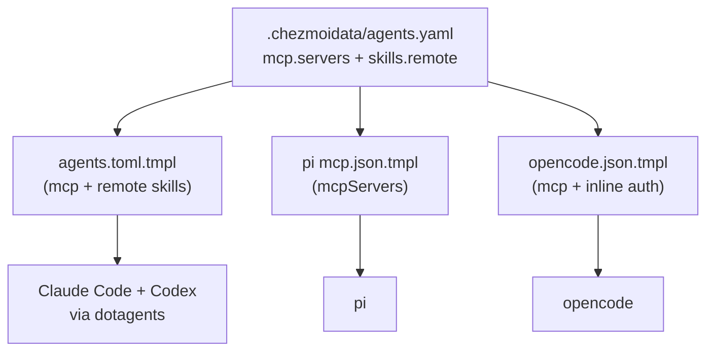

# Centralize MCP + Remote Skill Config into .chezmoidata - Plan

## Goal Capsule

- **Objective:** Make one `.chezmoidata` data file the single source of truth for MCP server definitions and dotagents remote-skill definitions, consumed by the three agent-config templates.
- **Product authority:** Repo maintainer (chezmoi source state).
- **Open blockers:** None. All framing decisions resolved in dialogue; planning-time questions resolved as KTDs below.
- **Product Contract preservation:** unchanged. Planning adds the HOW (data schema, implementation units, verification) on top of the unchanged R1–R9.

## Product Contract

### Summary

One new `.chezmoidata` data file holds the MCP server definitions and the dotagents remote-skill definitions, and the three agent-config templates (`agents.toml.tmpl`, pi `mcp.json.tmpl`, opencode `opencode.json.tmpl`) render their MCP blocks by ranging over it. Adding or removing an MCP server becomes a single edit that propagates to all four agents, and opencode's `{file:./secrets/...}` indirection is removed entirely.

### Problem Frame

The same three MCP servers (codegraph, context7, websearch) are defined across three chezmoi templates with two secret-injection mechanisms: inline `onepasswordRead` in `dot_agents/private_readonly_agents.toml.tmpl` and `dot_pi/agent/private_readonly_mcp.json.tmpl`, and file-indirection (`{file:./secrets/...}`) in `dot_config/opencode/readonly_opencode.json.tmpl` backed by `dot_config/opencode/exact_private_secrets/`. `AGENTS.md` carries the standing warning "add an MCP server to both or pi silently falls behind," and in practice three files must stay in lockstep. A new server or a rotated op-item reference is a multi-file edit with no single source to verify against, and the remote-skill refs are hand-listed alongside the MCP blocks in the dotagents template.

### Key Decisions

- **Secrets are op-ref strings in data, resolved by templates.** `.chezmoidata/*.yaml` is static data, not a template, so `onepasswordRead` cannot execute there. The data file stores the `op://...` item reference; each consumer template wraps it in `onepasswordRead` at render. This preserves the existing property that secrets never enter the onchange fingerprint or `chezmoi diff`/state.
- **Data is transport-neutral; templates own their format.** The data holds a neutral transport kind plus shared fields. Each consumer maps it to its native shape — dotagents TOML (`command`/`args` vs `url` + headers), pi (`transport` + `lifecycle`), opencode (`type` + command-array). Fields with no cross-agent meaning (pi's `lifecycle: "eager"`, opencode's `type` names) stay template-side.
- **Remote skills go in data; local path skills stay in the template.** Skills have a single consumer (the dotagents template), so data-ifying them yields no dedup. Remote skills earn their place because their release-tracking refs are the part that changes; the twelve local path skills are slated for future removal, so leaving them in the template avoids churning data that is about to disappear.
- **opencode file indirection is fully removed.** The `{file:./secrets/...}` pattern existed for JSON-editor compatibility, which is no longer used. All four references inline directly.

### Requirements

**Single source of truth**

- R1. MCP server definitions — transport kind, URL or command/args, and header op-item references — live in one new `.chezmoidata` data file.
- R2. The dotagents remote-skill definitions (name, source, ref) live in the same data file. Local path skills remain in the `agents.toml.tmpl` template, pending future removal.

**Template consumers**

- R3. The dotagents template renders both its `[[mcp]]` blocks and its remote `[[skills]]` blocks by ranging over the data file.
- R4. The pi and opencode templates render their MCP blocks by ranging over the data file, mapping the neutral data into each agent's own config format.
- R5. Per-agent format specifics with no cross-agent meaning (pi `lifecycle`, opencode `type`/transport names, dotagents TOML shape) stay in the consuming template, not the data file.

**Secrets and cleanup**

- R6. Secret values are stored as 1Password item-reference strings in the data file; each consumer template wraps the reference in `onepasswordRead` at render.
- R7. All four opencode `{file:./secrets/...}` references — the two MCP headers (context7, exa) and the two provider-auth `apiKey` values (opencode, openrouter) — become inline `onepasswordRead` calls in the opencode template.
- R8. The `dot_config/opencode/exact_private_secrets/` directory is removed once nothing references it.

**Propagation**

- R9. The `install-dotagents-skills` onchange fingerprint includes the new data file, so adding or removing an MCP server or remote skill in data re-triggers the dotagents install — the raw `agents.toml.tmpl` text no longer changes on a data edit.

### Scope Boundaries

- opencode provider-auth secrets (opencode, openrouter `apiKey`) are inlined in the opencode template but are not moved into the MCP data file; they are provider auth, not MCP, and have a single consumer.
- Per-server, per-agent enable/disable (opting a server out of one agent) is not introduced. All servers go to all agents as today.
- Local path skills are not data-ified; they remain in the dotagents template until a later removal.
- compound-engineering plugin installs, pi packages, and model defaults are unchanged — separate mechanisms already sourced in `pi.yaml` and `models.yaml`.

---

## Planning Contract

The brainstorm's deferred questions (data-file name and key structure; neutral transport field naming) are resolved here.

### Key Technical Decisions

- **KTD1. Data file is `.chezmoidata/agents.yaml` with two top-level keys.** `agents.mcp.servers` (the three servers) and `agents.skills.remote` (the three remote skills). One file matches the repo's per-concern convention — `packages.yaml` already holds dnf + apt + flatpak under one roof — and `agents.yaml` names the broader concern (agent-resource provisioning) more accurately than `mcp.yaml`, which would under-describe the skills half.
- **KTD2. MCP neutral schema is `transport` + shared fields.** Each server carries `transport: stdio` (with `command` + `args` list) or `transport: http` (with `url` + `headers` map of header-name → op-ref string). The `transport` kind is the discriminator each template switches on; op-refs are plain strings so they never execute in the data file.
- **KTD3. Remote-skill schema is `name` + `source` + optional `ref`.** Absent `ref` → the template resolves `(gitHubLatestRelease .source).TagName` (playwright-cli, dotagents). Present `ref` → literal (improve → `main`, a branch head). This keeps release-tracking as a template-time concern, since a static data file cannot call template functions.
- **KTD4. Per-consumer format mapping stays in the consuming template.** pi always emits `lifecycle: "eager"` (load-bearing per the pi MCP section of `AGENTS.md`); opencode emits `type: "local"`/`"remote"` with a command-array for local; dotagents emits TOML `[mcp.headers]` tables. None of these have cross-agent meaning, so they do not belong in the neutral data.
- **KTD5. Secret resolution: op-ref strings in data, `onepasswordRead` in every template.** Carried from the brainstorm. Same exposure level and fingerprint property as today.
- **KTD6. The `install-dotagents-skills` fingerprint adds `.chezmoidata/agents.yaml`.** Today it hashes only the raw `agents.toml.tmpl`; once MCP and remote skills move to data, a data edit no longer changes that raw text, so the install would not re-trigger. Adding the data file to the `fingerprint.tmpl` globs (alongside the template) restores propagation — the `config-solaar` dual-hash pattern (data file + template).

### Assumptions

- The two opencode provider-auth op-item references, currently resolved inside the to-be-deleted secret files, are `op://Private/Opencode/API Key` and `op://Private/OpenRouter/API Key` (verified from `dot_config/opencode/exact_private_secrets/create_private_readonly_*.tmpl`). They move verbatim into the opencode template.
- Go-template `range` over a YAML **sequence** (list) is order-stable, so the rendered server/skill order is deterministic across the three consumers. The data must use lists, not maps, for `servers` and `remote`.

### Risks

- **Silent propagation miss.** Forgetting the fingerprint extension (KTD6) means a new MCP server lands in the rendered configs but never triggers the dotagents install that wires it into Claude Code/Codex. Mitigated by U2 and asserted by DoD4.
- **opencode auth-ref transcription.** Moving the two provider-auth op-refs as literals is the one place a typo silently breaks a provider. Mitigated by carrying the exact strings (Assumptions) and the archive render check.
- **JSON generation from ranged lists.** Producing JSON object entries (pi `mcpServers`, opencode `mcp`) from a ranged YAML list needs index-aware comma handling and, for opencode, collapsing `command` + `args` into one array. Mitigated by the behavior-preserving invariant in U4 and V1/V3 checks that validate JSON parseability, not just template exit code.

---

## Implementation Units

### U1. Add the agent-provisioning data file

- **Goal:** Create the single source of truth for MCP servers and remote skills.
- **Requirements:** R1, R2
- **Dependencies:** none
- **Files:** `.chezmoidata/agents.yaml` (new)
- **Approach:** Two top-level keys. `agents.mcp.servers` is a list: codegraph (`transport: stdio`, `command: codegraph`, `args: [serve, --mcp]`), context7 (`transport: http`, `url`, `headers.CONTEXT7_API_KEY` → context7 op-ref), websearch (`transport: http`, `url`, `headers."x-api-key"` → exa op-ref). `agents.skills.remote` is a list: playwright-cli (no `ref`), improve (`ref: main`), dotagents (no `ref`). Header comment names the file's role, the transport grammar, the ref rule, and the three consumers.
- **Patterns to follow:** `.chezmoidata/pi.yaml` and `.chezmoidata/solaar.yaml` headers (purpose statement + per-key rationale).
- **Test expectation:** none — pure data; correctness is proven by the render checks in U2–U4.
- **Verification:** the file is valid YAML reachable as chezmoi data (`.agents.mcp.servers` and `.agents.skills.remote` resolve).

### U2. Render dotagents agents.toml from data + extend onchange fingerprint

- **Goal:** The dotagents template derives MCP and remote skills from data, and the install re-triggers on data edits.
- **Requirements:** R3, R9
- **Dependencies:** U1
- **Files:** `dot_agents/private_readonly_agents.toml.tmpl`; `.chezmoiscripts/70-agents/run_onchange_after_install-dotagents-skills.sh.tmpl`
- **Approach:** Replace the three `[[mcp]]` blocks with `{{ range .agents.mcp.servers }}` emitting dotagents TOML — `command`/`args` for `stdio`, `url` + a `[mcp.headers]` table whose values are `onepasswordRead` of the data op-ref for `http`. Replace the three remote `[[skills]]` with `{{ range .agents.skills.remote }}` emitting `name`/`source` and `ref` (resolved via `gitHubLatestRelease` when absent, literal when present). Keep the twelve local-path `[[skills]]` literal. In the install script, extend the `fingerprint.tmpl` globs to `(list "dot_agents/private_readonly_agents.toml.tmpl" ".chezmoidata/agents.yaml")`; rewrite the resolved-refs comment block to range over `.agents.skills.remote` (it currently hardcodes two lines and omits improve — emit improve's literal `main` and the resolved tags for the other two).
- **Patterns to follow:** `config-solaar` dual-hash (data file + template in the fingerprint); the existing resolved-refs comment pattern in the install script.
- **Test scenarios:**
  - Render produces exactly 3 `[[mcp]]`, 3 remote `[[skills]]`, and 12 local `[[skills]]`, matching the pre-refactor rendered output.
  - Adding a 4th server to the data changes the rendered `agents.toml` (propagation).
  - `improve` renders `ref = "main"` literal; playwright-cli and dotagents render resolved tags.
- **Verification:** `chezmoi execute-template` on the template exits 0; the rendered fingerprint comment names both globs.

### U3. Render pi mcp.json from data

- **Goal:** pi MCP config derives from the shared data.
- **Requirements:** R4, R5, R6
- **Dependencies:** U1
- **Files:** `dot_pi/agent/private_readonly_mcp.json.tmpl`
- **Approach:** `{{ range .agents.mcp.servers }}` emitting `mcpServers` entries — `transport: "stdio"` + `command`/`args` for stdio; `transport: "streamable-http"` + `url` + `headers` (value `onepasswordRead` of the op-ref) for http. `lifecycle: "eager"` hardcoded for every entry (pi-concern, per KTD4). Emit object entries with no trailing comma (index-aware range over the list); output stays valid JSON.
- **Patterns to follow:** existing `mcp.json.tmpl` structure.
- **Test scenarios:**
  - Renders 3 servers, each carrying `lifecycle: "eager"`.
  - codegraph renders stdio + command/args; context7 and websearch render streamable-http + url + an `onepasswordRead` header.
- **Verification:** `chezmoi execute-template` exits 0; output is valid JSON.

### U4. Render opencode mcp from data + inline all secrets + drop secret files

- **Goal:** opencode MCP derives from data, every `{file:...}` is inlined, and the secret directory is gone.
- **Requirements:** R4, R6, R7, R8
- **Dependencies:** U1
- **Files:** `dot_config/opencode/readonly_opencode.json.tmpl` (modified); `dot_config/opencode/exact_private_secrets/` (removed, all four `.tmpl` files)
- **Approach:** The `mcp` block becomes `{{ range .agents.mcp.servers }}` and is **behavior-preserving** — the rendered per-server fields must match the current output exactly. For stdio: `type: "local"` with `command` = `[command] + args` as a single array (opencode local servers take one command array, no separate `args`). For http: `type: "remote"` + `"enabled": true` + `url` + `headers` (value `onepasswordRead` of the data op-ref). Emit object entries with no trailing comma. The two provider-auth `apiKey` values replace `{file:./secrets/opencode-api-key}` / `{file:./secrets/openrouter-api-key}` with inline `{{ onepasswordRead "op://Private/Opencode/API Key" }}` / `{{ onepasswordRead "op://Private/OpenRouter/API Key" }}`. Delete `exact_private_secrets/` and its four templates (context7, exa, opencode, openrouter).
- **Patterns to follow:** existing `opencode.json.tmpl` `mcp` block shape.
- **Test scenarios:**
  - Renders 3 mcp servers byte-identical to the current output: codegraph `local` with `command: ["codegraph","serve","--mcp"]`; context7/websearch `remote` with `"enabled": true`, url, and inline header keys.
  - No `{file:` token appears anywhere in the rendered `opencode.json`.
  - The two provider `apiKey` values render as inline `onepasswordRead` (stub value under the stub-op recipe).
  - `exact_private_secrets/` is absent from the rendered archive.
- **Verification:** archive tar contains no `secrets/*-api-key` files; `grep '{file:'` on the rendered opencode.json returns nothing.

### U5. Update AGENTS.md documentation

- **Goal:** Docs reflect the new single source and the removed indirection.
- **Requirements:** documentation tracing R1–R9
- **Dependencies:** U1–U4
- **Files:** `AGENTS.md`
- **Approach:** Add a bullet to the "Single source of truth" section for `.chezmoidata/agents.yaml` (header + consumers + onchange behavior, in the existing per-data-file style). Revise the dotagents MCP paragraph (servers now sourced from data via the `agents.toml` range). Revise the pi MCP paragraph so the "add an MCP server to both" warning becomes "edit `.chezmoidata/agents.yaml`; all agents pick it up." Note the opencode `{file:...}` removal and the inline `onepasswordRead`. Note the `install-dotagents-skills` fingerprint extension.
- **Patterns to follow:** existing `AGENTS.md` per-data-file bullet style.
- **Test expectation:** none — prose.
- **Verification:** the "Single source of truth" section lists the new file; no uncorrected "add to both" phrasing remains.

---

## Verification Contract

The repo has no unit-test suite — verification is render-time, through the stub-`op` + throwaway-destination recipe in `AGENTS.md` ("Verify edits"). Because the `gitHubLatestRelease` renders need a token and the recipe controls PATH, prefix renders with `GITHUB_TOKEN="$(gh auth token)"`.

- **V1 (renders clean).** `chezmoi execute-template` renders each modified template — `dot_agents/private_readonly_agents.toml.tmpl`, `dot_pi/agent/private_readonly_mcp.json.tmpl`, `dot_config/opencode/readonly_opencode.json.tmpl` — exit 0 under the stub-op recipe, and the pi/opencode outputs parse as valid JSON.
- **V2 (single source, no indirection).** `chezmoi archive --exclude=encrypted,externals,scripts`, branch vs base: the three MCP consumers render the same set of servers; no `{file:` tokens; no `exact_private_secrets/` entries.
- **V3 (no drift).** Each rendered config enumerates exactly codegraph + context7 + websearch.
- **V4 (CI).** The `render-dotfiles` `apply` + `render-internals` jobs stay green on PR.

---

## Definition of Done

- DoD1. `.chezmoidata/agents.yaml` is the only place MCP servers are defined; all three consumer templates range over it.
- DoD2. The three remote skills range from the same data file; the twelve local path skills are unchanged in `agents.toml.tmpl`.
- DoD3. Zero `{file:./secrets/...}` references remain; `dot_config/opencode/exact_private_secrets/` is deleted.
- DoD4. The `install-dotagents-skills` fingerprint globs include `.chezmoidata/agents.yaml`.
- DoD5. `AGENTS.md` documents the new source and the removed indirection.
- DoD6. The stub-op archive diff is clean and all three templates render under the recipe.
