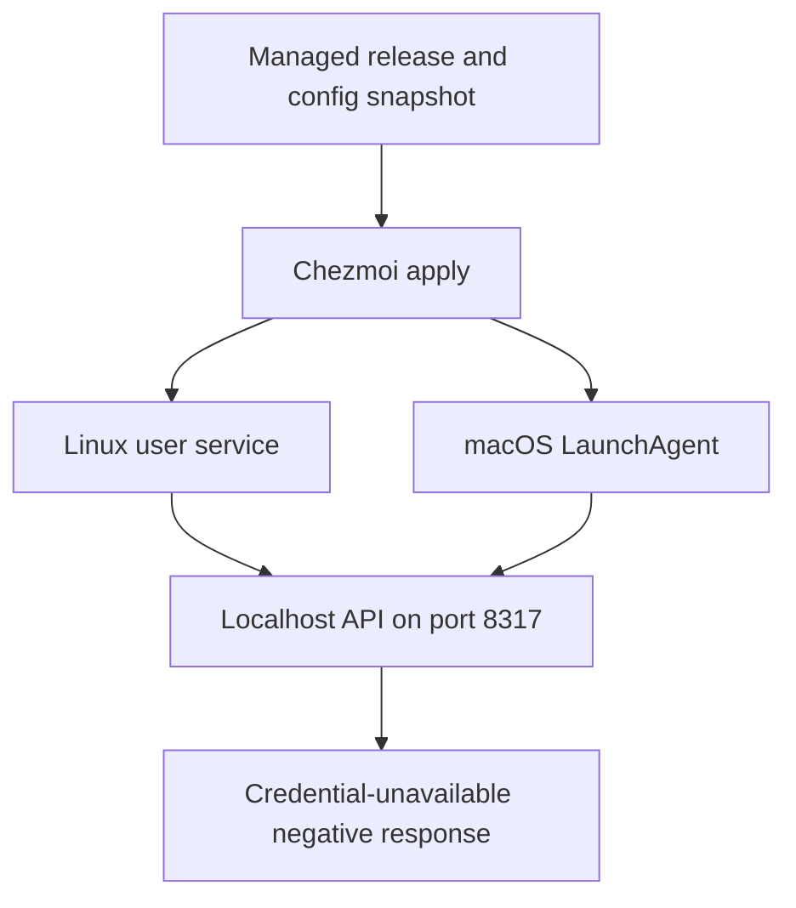
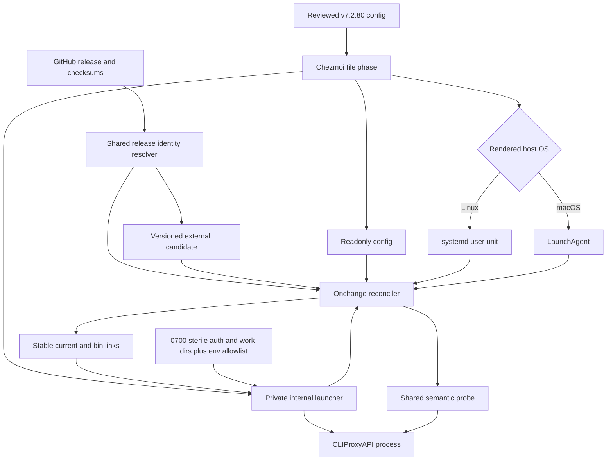
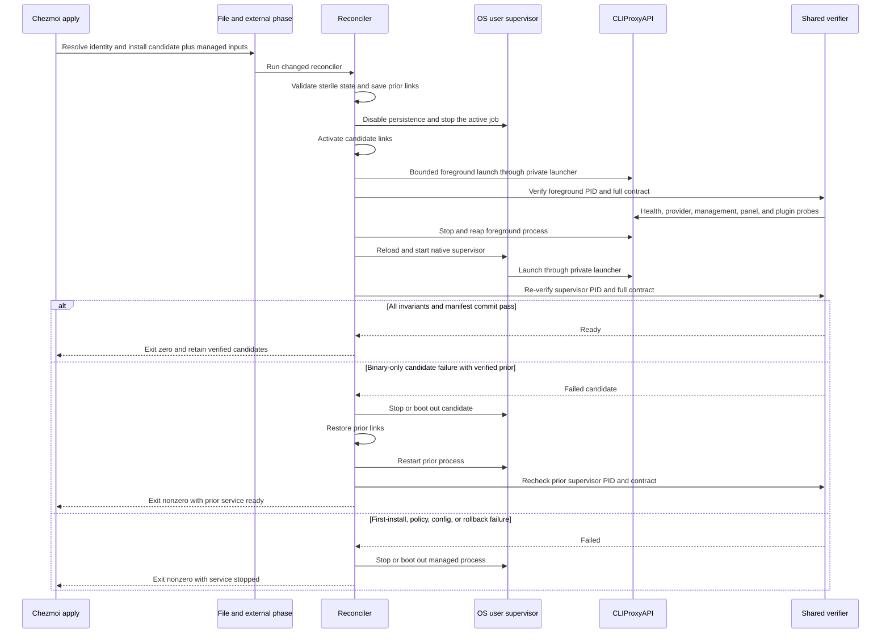

# CLIProxyAPI Infrastructure - Plan

## Goal Capsule

- **Objective:** Restore CLIProxyAPI as a managed localhost service on Linux and macOS, with no credentials or agent consumers, and prove that requests reach the running API.
- **Authority:** The Product Contract controls behavior and scope; session-settled Key Technical Decisions control implementation posture; repository instructions control packaging, secrets, verification, and landing.
- **Stop conditions:** Stop if the current release cannot run against the reviewed configuration snapshot, if credential-free startup cannot produce the required negative response, or if implementation would require a tracked secret or agent-routing change.
- **Execution profile:** Configuration and service integration with smoke-first proof on native Linux and macOS runners.
- **Tail ownership:** LFG owns implementation, review fixes, the follow-up issue, the repository-required direct trunk commit/push, and CI-to-green monitoring.

---

## Product Contract

### Summary

Restore the former cross-platform CLIProxyAPI infrastructure around a reviewed upstream configuration snapshot. The service runs locally without credentials or consumers, and a separate GitHub issue records the later Management API enablement work.

### Problem Frame

The previous CLIProxyAPI integration was removed when agent routing moved elsewhere. Pi and OpenCode now use direct providers, but there is no local API substrate on which to build unified usage views or desktop integrations.

The renewed need is infrastructural rather than an immediate model-routing change. A running proxy creates a stable base for later work such as CPA Usage Keeper and GNOME/KDE applets, while keeping those consumers and the security design for Management API access out of this change.

### Key Decisions

- **Restore infrastructure without consumers.** (session-settled: user-directed — chosen over OpenCode or Pi routing: establish the proxy substrate before attaching consumers.) Existing agent provider configuration remains direct.
- **Manage the full current upstream example.** (session-settled: user-directed — chosen over a minimal config, runtime-owned config, and the deleted snapshot: retain current option discoverability without reviving stale schema.) The initial source snapshot is CLIProxyAPI `v7.2.80`'s `config.example.yaml` with documented project safety overrides.
- **Keep all authentication and Management API disabled.** (session-settled: user-directed — chosen over host-generated or 1Password-backed management credentials: keep this change secret-free and defer management access to a separate issue.) No client API keys, provider credentials, management secret, management environment password, or runtime local password are configured.
- **Keep configuration declarative.** (session-settled: user-approved — chosen over automatic upstream synchronization: keep source changes reviewable and avoid unreviewed configuration churn.) New upstream options are adopted through explicit source updates.
- **Support workstation hosts only.** Linux and macOS receive equivalent managed services. Real containers and Windows are outside this integration.
- **Restore no operator helpers.** Provider login commands and the management-page opener remain absent until a concrete consumer requires them.

### Requirements

**Distribution and configuration**

- R1. CLIProxyAPI must be installed through the repository's managed external-tool mechanism for supported Linux and macOS architectures with an exact release identity and SHA-256.
- R2. The managed configuration must start from the complete upstream `v7.2.80` example rather than the deleted historical snapshot.
- R3. The configuration must bind only to `127.0.0.1` on port `8317` and must not expose the service on other interfaces.
- R4. Every service start must enforce sterile auth state, a controlled working directory, an allowlisted process environment, and request-logging suppression so client keys, provider credentials, plugins, Management API credentials, ambient secrets, historical auth state, and request bodies cannot activate capability or persist unexpectedly.
- R5. The deployed configuration must remain source-managed and must not auto-synchronize with upstream or become runtime-owned.

**Service lifecycle**

- R6. Linux must run CLIProxyAPI as an automatically enabled user service using the managed binary and configuration.
- R7. macOS must run CLIProxyAPI as an automatically loaded user LaunchAgent with the same launch, isolation, readiness, and fail-closed contract as Linux; platform-native restart policy may differ when launchd cannot bound retries.
- R8. Applying a changed release identity, configuration, active platform's service definition, internal launcher, or readiness probe must reconcile the active service, rerun readiness, and stop or roll back an unsafe process.
- R9. The binary, configuration, internal launcher, service artifacts, and reconciler must be excluded from real containers and Windows.

**Readiness and regression safety**

- R10. Verification must issue a valid provider-routable unauthenticated request to `/v1beta/interactions` and require CLIProxyAPI's HTTP 503 credential-unavailable JSON response, not merely any HTTP failure.
- R11. A refused connection, timeout, wrong PID, non-loopback listener, malformed response, client-auth rejection, enabled optional route, unsafe auth state, config mutation, or configuration-load failure must fail readiness and leave no unsafe managed process running.
- R12. Automated checks must cover release identity and selector fixtures, config provenance and safety overrides, sterile launch invariants, both host service definitions, reconciler behavior, platform exclusions, direct-provider preservation, and native Linux/macOS negative API smoke tests.
- R13. Pi and OpenCode provider settings must remain unchanged and continue to route directly.

**Follow-up issue**

- R14. Delivery must create and link a separate GitHub issue for enabling the localhost Management API with a non-committed credential strategy.
- R15. The follow-up issue must name CPA Usage Keeper and GNOME/KDE applets as motivating consumers while excluding their implementation from that issue.
- R16. The follow-up issue must prohibit plaintext management credentials in tracked files and must account for the managed configuration remaining read-only.

### Key Flow

- F1. Local service readiness
  - **Trigger:** Chezmoi applies the CLIProxyAPI external, configuration, and host service definition.
  - **Steps:** The host service starts the proxy with sterile auth state, the verifier sends an unauthenticated `agent` request to `/v1beta/interactions` (which forces the built-in `gemini-interactions` provider path), and CLIProxyAPI evaluates it with no available provider credentials.
  - **Outcome:** The verifier receives the expected server-generated credential-unavailable error rather than a transport or client-auth failure.
  - **Covered by:** R1-R12.

### Acceptance Examples

- AE1. **Covers R3, R6, R7, R10, R11.** **Given** a supported Linux or macOS host has applied the source state, **when** a valid unauthenticated `agent` request reaches `/v1beta/interactions`, **then** the managed PID returns HTTP 503 with a JSON server error whose message identifies unavailable auth from a listener owned only on `127.0.0.1:8317`.
- AE2. **Covers R4.** **Given** contaminated parent environment variables, a hostile working-directory `.env`, historical credentials, and an empty managed auth directory, **when** the internal launcher starts CLIProxyAPI, **then** startup rejects unsafe filesystem state or only its allowlisted environment reaches the child, and no provider credential becomes eligible.
- AE3. **Covers R4, R11.** **Given** Management API, control-panel, plugin, and request-logging surfaces are disabled, **when** representative routes and a canary provider-routable request are issued, **then** optional routes return HTTP 404 and no panel, plugin, request body, or error-log artifact is created.
- AE4. **Covers R8, R11.** **Given** a changed release identity or tracked service input is applied, **when** reconciliation cannot satisfy the readiness contract, **then** it stops the failed process, restores and rechecks the prior verified binary for a manifest-proven binary-only failure when available, otherwise disables activation across future logins, and returns nonzero.
- AE5. **Covers R13.** **Given** the proxy infrastructure is restored, **when** Pi or OpenCode loads its managed settings, **then** its provider and model routing is unchanged and does not target the loopback proxy.
- AE6. **Covers R14-R16.** **Given** the infrastructure change is delivered, **when** the linked follow-up issue is opened, **then** it scopes only safe Management API enablement and treats visualizers and desktop applets as motivating future consumers.

### Scope Boundaries

#### Deferred to Follow-Up Work

- Enable and secure the localhost Management API through the dedicated issue required by R14-R16.
- Add CPA Usage Keeper after Management API access exists.
- Build GNOME and KDE applets as separate consumer work after Management API access exists.

#### Outside This Delivery

- Route Pi, OpenCode, Claude Code, Codex, or another client through CLIProxyAPI.
- Add provider OAuth, provider API keys, local client keys, Management API credentials, or management UI access.
- Restore provider login helpers or a management-page opener.
- Deploy any CLIProxyAPI artifact to real containers or Windows.
- Migrate or delete historical `~/.cli-proxy-api` credentials.

### Dependencies / Assumptions

- CLIProxyAPI releases publish native Linux and macOS full assets for amd64 and arm64 plus a SHA-256 `checksums.txt` sidecar; macOS has no no-plugin asset, so the full binary is the cross-platform parity choice.
- With no access provider registered, current upstream middleware allows normal API requests to reach model handlers.
- Management routes remain disabled only while `remote-management.secret-key` is empty and neither `MANAGEMENT_PASSWORD` nor a runtime local-management password is supplied; the control panel and plugin resources require independent disablement.
- A launcher-enforced empty auth directory and allowlisted environment prevent surviving historical or ambient credentials from changing the readiness result.
- The full configuration is a reviewed `v7.2.80` snapshot. Later binary releases may add settings that use upstream defaults until the source snapshot is deliberately refreshed.
- A user-level service is sufficient; system-wide and pre-login availability are not required.

### Sources / Research

- Historical integration commits: `7426be2`, `794bee6`, `f8468cc`, and removal commit `451c14e`.
- Prior removal record: `docs/plans/2026-07-15-002-chore-remove-meridian-proxy-plan.md` and commit `c4748b5`.
- Current packaging and service patterns: `.chezmoiexternals/ai-agents.toml`, `.chezmoiscripts/60-build/run_onchange_after_build-mxm4-haptic.sh.tmpl`, `dot_config/systemd/user/mxm4-hapticd.service.tmpl`, and `Library/LaunchAgents/dev.h82.mxm4-hapticd.plist`.
- Current agent configuration: `.chezmoidata/agents.yaml`, `dot_pi/agent/private_readonly_settings.json.tmpl`, and `dot_config/opencode/readonly_opencode.json.tmpl`.
- Upstream release: [CLIProxyAPI v7.2.80](https://github.com/router-for-me/CLIProxyAPI/releases/tag/v7.2.80).
- Upstream configuration baseline: [CLIProxyAPI v7.2.80 `config.example.yaml`](https://github.com/router-for-me/CLIProxyAPI/blob/v7.2.80/config.example.yaml).
- Upstream access behavior: [`internal/access/config_access/provider.go`](https://github.com/router-for-me/CLIProxyAPI/blob/v7.2.80/internal/access/config_access/provider.go), [`sdk/access/manager.go`](https://github.com/router-for-me/CLIProxyAPI/blob/v7.2.80/sdk/access/manager.go), [`sdk/cliproxy/auth/selector.go`](https://github.com/router-for-me/CLIProxyAPI/blob/v7.2.80/sdk/cliproxy/auth/selector.go), and [`sdk/api/handlers/handlers.go`](https://github.com/router-for-me/CLIProxyAPI/blob/v7.2.80/sdk/api/handlers/handlers.go).
- Upstream Management API routing: [`internal/api/server.go`](https://github.com/router-for-me/CLIProxyAPI/blob/v7.2.80/internal/api/server.go).
- Management API activation follow-up: [issue #48 — `feat(cli-proxy-api): activate localhost management api securely`](https://github.com/hyperlapse122/dotfiles/issues/48).

---

## Planning Contract

**Product Contract preservation:** changed: R4, R8, R10-R12 and AE1-AE4 were tightened with sterile launch invariants, release-identity activation, optional-surface checks, and fail-safe reconciliation. The settled product scope is unchanged.

### Key Technical Decisions

**Trust boundary:** Network peers outside the host must be unable to connect. Local users and processes may reach the intentionally unauthenticated model API, but this delivery gives them no provider, Management API, control-panel, or plugin authority. Service-manager environment, historical CLIProxyAPI state, and same-tag asset replacement are untrusted inputs. User-owned modes and byte checks detect drift but do not defend against same-UID malicious code.

- **KTD1 — Shared latest-release identity with fail-loud artifact integrity.** Add a reusable release resolver consumed by both `.chezmoiexternals/ai-agents.toml` and the reconciler. It resolves the latest tag, exact full-archive filename, and exact SHA-256 from `checksums.txt`; missing, duplicate, or malformed matches abort rendering. The full asset preserves Linux/macOS parity because macOS publishes no no-plugin variant, while config and smoke keep plugins disabled. Store each identity under a version-and-digest directory instead of overwriting the active binary. The sidecar proves artifact consistency, not publisher authenticity; dynamic latest remains the repository's standalone-CLI policy.
- **KTD2 — Full reviewed config snapshot.** (session-settled: user-directed — chosen over a minimal config, runtime-owned config, and the deleted snapshot: preserve current option discoverability while avoiding stale schema.) Track the complete `v7.2.80` example as `dot_config/cli-proxy-api/readonly_config.yaml` → `~/.config/cli-proxy-api/config.yaml`. The exhaustive permitted diff is provenance annotation, loopback host, isolated auth directory, empty client keys, disabled control panel, enabled panel-update disablement, and `commercial-mode: true` to remove forced request-error logging; the already-empty Management secret and already-disabled global plugins remain upstream-identical and are asserted separately. The 0444 target is the sole runtime config authority and a mutation detector, not a same-UID security boundary.
- **KTD3 — Sterile auth and process boundary.** (session-settled: user-directed — chosen over host-generated or 1Password-backed credentials: keep the restored substrate secret-free.) Both supervisors call one private internal launcher, not an operator helper. Their service definitions clear loader/startup variables before the shell starts. On every start the launcher creates or validates owner-controlled 0700 auth and working directories, rejects symlinks, auth entries, or a working-directory `.env` without deleting them, changes into that controlled directory, sets umask 077, and execs the binary with `-local-model` plus a minimal environment allowlist that excludes management, provider, 1Password, and proxy credentials. Config keeps client keys and Management secret empty, disables the control panel and plugins, and never reads or logs historical `~/.cli-proxy-api` state.
- **KTD4 — Native supervisors with reversible activation.** (session-settled: user-directed — chosen over Linux-only or current-host-only support: restore equivalent Linux and macOS operation.) Use bounded failure-only systemd supervision, a fail-closed `RunAtLoad` LaunchAgent without unbounded `KeepAlive`, and one POSIX `run_onchange_after_` reconciler. It validates candidate and link ownership, compares a 0600 last-known-good manifest of release identity, the post-readiness extracted-binary digest, and non-binary input digests, disables persistence, commits stable links, and proves the candidate in a bounded foreground launch. Only then does it start the native supervisor, re-probe its reported PID, and atomically commit the manifest. On failure it stops or boots out the candidate; for a binary-only failure it restores and rechecks the prior link when available, but still returns nonzero. A preflight-integrity failure removes launchable stable links, while config or policy drift leaves the service disabled across future logins.
- **KTD5 — Complete release identity and platform-relevant source inputs drive onchange.** Render tag, asset filename, and SHA-256 into the reconciler. Fingerprint shared config, internal launcher, semantic probe, and only the active platform's service definition so an irrelevant plist edit does not restart Linux and an irrelevant unit edit does not restart macOS.
- **KTD6 — One semantic probe authority.** `.ci/smoke-cli-proxy-api.sh` owns listener and HTTP semantics for both host reconciliation and native CI. Given an expected PID, it requires that PID alone to listen on `127.0.0.1:8317`, validates `/healthz`, sends an `agent` request through the built-in `gemini-interactions` provider path, requires its HTTP 503 JSON shape and `no auth available` diagnostic, and requires 404 for Management API, control-panel, and plugin-resource routes. It rejects redirects, client-auth errors, wildcard/non-loopback listeners, unrelated owners, config mutation, unexpected artifacts, and canary persistence, then repeats PID/executable/listener proof after all HTTP checks to reject a port handoff.
- **KTD7 — Layered verification instead of overstated supervisor coverage.** Deterministic resolver fixtures cover all four OS/architecture mappings and checksum failures. Native Ubuntu/macOS foreground smoke proves the real binary/config/listener contract. Static unit/plist validation proves service syntax and environment policy. Reconciler tests with command adapters or stubs prove first start, update, rollback, PID handoff, and nonzero failure behavior. CI claims actual supervised activation only if the runner proves a usable user manager.
- **KTD8 — No agent adapter.** (session-settled: user-directed — chosen over Pi or OpenCode proxy routing: keep the change infrastructure-only.) The localhost HTTP API is the future integration surface; no MCP, plugin, provider override, operator helper, or change to `.chezmoidata/agents.yaml` is added.
- **KTD9 — Manual config refresh.** (session-settled: user-approved — chosen over automatic upstream synchronization: keep every config change reviewable.) Binary releases continue following the repository's latest-release convention, while the full config snapshot advances only through an explicit source diff and native compatibility smoke.
- **KTD10 — One bounded management follow-up.** (session-settled: user-directed — chosen over tracking the current re-add, CPA Usage Keeper, or desktop applets in the new issue: isolate credential design and Management API activation.) [Issue #48](https://github.com/hyperlapse122/dotfiles/issues/48) is the one `enhancement` issue titled `feat(cli-proxy-api): activate localhost management api securely`; visualizers and applets are motivation only.

### High-Level Technical Design

**Component topology**

**Apply and readiness sequence**

**Reconciliation and runtime lifecycle**

```mermaid
stateDiagram-v2
  [*] --> Reconcile: Supported workstation apply
  Reconcile --> Foreground: Persistence disabled and candidate linked
  Foreground --> Starting: Foreground contract passes
  Foreground --> Rollback: Binary-only failure with verified prior
  Foreground --> SafeFailure: First-install, policy, or config failure
  Starting --> Probing: Supervisor reports expected PID
  Starting --> SafeFailure: Manager or process failure
  Probing --> Ready: Every invariant and manifest commit passes
  Probing --> Rollback: Binary-only failure with verified prior
  Probing --> SafeFailure: First-install, policy, config, or commit failure
  Rollback --> PriorReady: Prior links and process pass recheck
  Rollback --> SafeFailure: Prior restart or recheck fails
  SafeFailure --> Stopped: Managed process is stopped
  Stopped --> Reconcile: Next apply retries unchanged inputs
  PriorReady --> Reconcile: Later apply retries candidate
  Ready --> Reconcile: Release identity or active-platform input changes
  Ready --> LinuxBackoff: Linux process exits unexpectedly
  LinuxBackoff --> Ready: Bounded systemd restart passes launcher preflight
  LinuxBackoff --> Stopped: Preflight or restart limit fails
  Ready --> Stopped: macOS process exits; launchd does not loop
```

### Assumptions

These pipeline-mode choices were not separately confirmed by the user and remain review targets:

- Treat the hosts as single-user workstations for confidentiality. Any local process can call `127.0.0.1:8317`; this is accepted only while provider, Management API, control-panel, and plugin authority remain absent. Local denial of service is residual risk.
- Treat 0444/0700 modes and byte checks as drift and accidental-access controls, not protection from same-UID malicious code.
- Use `~/.local/share/cli-proxy-api/auth` as a persistent 0700 auth directory that must be a non-symlink, owner-controlled, and empty before every supervisor start; use a sibling 0700 working directory that must be a non-symlink and contain no `.env`.
- Allow the child only the managed config, actual HOME needed for managed paths, dedicated writable state/auth paths, runtime/temp paths, PATH, and minimal locale values; any additional environment name needs a documented reason.
- Pass `-local-model` to disable both mutable remote model-catalog updaters. Upstream `v7.2.80` still performs a credential-free Antigravity version-manifest fetch; accept and document that metadata egress rather than claiming network isolation the launcher cannot enforce.
- Use a 10-second bounded startup deadline. Retry connection refusal only while the expected PID is starting; unsafe state, an unrelated listener, or a wrong semantic response fails immediately.
- Treat an unavailable user systemd bus or macOS GUI launch domain as a failed supported-host reconciliation rather than a successful soft skip.
- Retain the repository's dynamic latest-release policy. The tag/asset/SHA tuple and sidecar protect artifact consistency but do not provide independent publisher authentication; each later host apply remains capable of observing a release not exercised by the original delivery CI.
- Use deterministic supervisor stubs and static validation in CI unless a runner proves a usable native user manager; native foreground smoke does not claim supervised activation.
- The repository's trunk policy overrides the requested PR delivery path: record the Management API issue in this plan and the direct commit body, push immediately to `origin/main`, and run the full render workflow on that push.

### System-Wide Impact

- **External rendering:** CLIProxyAPI's external and reconciler templates each consume the same GitHub release/checksum resolver; network resolution therefore occurs during full source-state reads.
- **Local caller surface:** Every host-local process can call port 8317 without client authentication, but the current surface has no provider or management authority.
- **Host lifecycle:** Supported workstations gain a persistent loopback user service and private internal launcher; no root service or system-wide listener is introduced.
- **Process environment:** The third-party process receives an allowlisted environment, a controlled `.env`-free working directory, and dedicated writable state rather than ambient agent, provider, proxy, or 1Password inputs.
- **Credential boundary:** Historical credential files remain untouched, are never inspected or logged, and are not consulted by the managed service.
- **Writable state and logs:** Runtime writes stay under 0700 state with umask 077. Commercial mode removes request-logging middleware; debug, pprof, file logging, control-panel downloads, and plugin downloads remain disabled; supervisor output and state must not contain request or environment canaries.
- **Agent routing:** Pi, OpenCode, Claude Code, Codex, MCP configuration, and agent model defaults remain unchanged.
- **Runtime egress:** `-local-model` disables mutable model-catalog fetches. The upstream Antigravity version updater still performs a credential-free metadata request; no provider credential or model request data is available to it.
- **CI:** Native Ubuntu and macOS runners execute the resolved third-party binary with isolated state; selector fixtures cover all architecture branches; container and Windows jobs assert exclusion only.

### Risks & Dependencies

- **Moving binary versus static config:** A later apply may select a release never seen by delivery CI. The full release identity retriggers reconciliation; failure stops the candidate and restores the prior binary for binary-only incompatibility. This is a compatibility control, not publisher authentication.
- **Persistent auth-state reactivation:** A merely new directory becomes unsafe if later populated or replaced by a symlink. The internal launcher enforces type, owner, mode, and emptiness on every restart and fails without deleting or printing contents.
- **Ambient credential exposure:** Service-manager environments and CLIProxyAPI's unconditional working-directory dotenv loader may contain management, store, provider, proxy, or 1Password values. The launcher uses a minimal allowlist, enters a dedicated directory, rejects `.env`, and tests canary names without logging values.
- **Independent optional surfaces:** Empty Management secret alone does not disable `/management.html`, plugin resources, or forced error-only request logging. Config and native smoke disable and test each surface separately.
- **Port collision:** Another process may own 8317. Supervisor PID plus listener inspection fails clearly instead of treating another HTTP server as ready.
- **Localhost is not local authentication:** Other local users/processes can consume CPU or trigger crash-loop behavior. The accepted risk is bounded by absent provider and management authority.
- **Background metadata egress:** `-local-model` removes remote model-catalog updates but does not disable the upstream Antigravity version updater. This accepted credential-free fetch may still leak host timing/IP metadata; a future upstream switch to disable it would tighten the boundary without changing product scope.
- **Error-contract churn:** Upstream may change the 503 body. The smoke pins parsed fields and one diagnostic phrase so a changed release forces review.
- **Service-manager availability:** Headless SSH or a missing GUI/user bus can prevent activation. The reconciler returns nonzero and remains retryable on an unchanged later apply.
- **Full-example drift:** The 522-line snapshot is costly to review. A byte-comparable expected diff permits only documented safety overrides.
- **External availability:** GitHub release or checksum fetch failure blocks rendering; no unverified fallback binary is accepted.

### Sequencing

U1 and U2 establish the versioned candidate and sterile configuration. U3 depends on both and adds the internal launcher, stable activation links, native supervisors, rollback, and shared probe. U4 validates U1-U3 through deterministic resolver and reconciler fixtures, native foreground smoke, static service checks, and platform fences. U5 reconciles documentation after the final shape is known. U6 creates and links the independent Management API issue after its acceptance wording is stable.

---

## Implementation Units

### U1. Add the shared release resolver and versioned external

- **Goal:** Resolve one authoritative CLIProxyAPI release identity and install its candidate binary for supported workstations.
- **Requirements:** R1, R8, R9, R12; KTD1, KTD5, KTD9.
- **Dependencies:** None.
- **Files:** `.chezmoitemplates/cli-proxy-api-ref.tmpl`, `.chezmoiexternals/ai-agents.toml`, `.github/workflows/render-dotfiles.yml`.
- **Approach:** Add a reusable resolver with production defaults and deterministic test inputs for OS, architecture, tag, and checksum text. Return tag, full-archive filename, SHA-256, and identity. The external gates on Linux/macOS workstation facts, extracts the binary under a version-and-digest directory, and never updates active links itself. Use the full asset on both platforms because macOS publishes no no-plugin variant; later checks prove plugins remain inactive.
- **Patterns to follow:** `.chezmoitemplates/compound-engineering-ref.tmpl`, the Pi exact checksum-sidecar parser, and versioned Pi/Claude external targets.
- **Test scenarios:**
  - Deterministic fixtures resolve Linux amd64/aarch64 and macOS amd64/arm64 to the exact full asset and digest.
  - No-plugin assets are never selected.
  - Missing, duplicate, malformed, or wrong-filename checksum entries fail rendering.
  - A same-tag digest change produces a different release identity and target directory.
  - Windows and real-container production renders contain no CLIProxyAPI external.
- **Verification:** The real external and fixture renders consume the same resolver; CLIProxyAPI-specific render failures are fatal rather than warnings.

### U2. Add the sterile full configuration snapshot

- **Goal:** Deploy the complete upstream configuration surface with an auditable safety delta for a credential-free localhost process.
- **Requirements:** R2-R5, R9, R12; KTD2, KTD3, KTD9.
- **Dependencies:** None.
- **Files:** `dot_config/cli-proxy-api/readonly_config.yaml`, `.ci/fixtures/cli-proxy-api-config-v7.2.80.diff`, `dot_config/.chezmoiignore`, `.chezmoiignore`, `.github/workflows/render-dotfiles.yml`.
- **Approach:** Copy the tagged `v7.2.80` example wholesale and change only the exhaustive KTD2 delta, including commercial mode solely to suppress forced request-error logs. Store the expected upstream-to-source diff as a fixture so CI compares provenance and semantic overrides byte-for-byte. Keep the tracked config plain, readonly, and non-secret. Exclude it on Windows and real containers; runtime state and launch behavior belong to U3-U4.
- **Patterns to follow:** Managed readonly configuration targets, root fact-driven container exclusions, and source-versus-render assertions in `.github/workflows/render-dotfiles.yml`.
- **Test scenarios:**
  - The generated upstream diff exactly matches the checked fixture and rejects any undeclared semantic change.
  - Static checks find `127.0.0.1:8317`, isolated auth path, empty client keys and Management secret, `commercial-mode: true`, and disabled control panel, panel updates, plugins, debug, pprof, and file logging.
  - The deployed target is a regular non-symlink file at mode 0444.
  - Windows and real-container target/ignored views contain no config target.
- **Verification:** The tagged snapshot comparison and parsed/static safety assertions pass before any binary starts.

### U3. Add sterile launch, reversible activation, and native supervisors

- **Goal:** Run CLIProxyAPI through equivalent-security native user supervisors while preserving a prior verified binary on failed updates.
- **Requirements:** R3-R8, R10-R12; F1; AE1-AE4; KTD3-KTD7.
- **Dependencies:** U1, U2.
- **Files:** `dot_local/libexec/private_executable_cli-proxy-api-launch`, `dot_config/systemd/user/readonly_cli-proxy-api.service`, `Library/LaunchAgents/readonly_dev.h82.cli-proxy-api.plist.tmpl`, `.chezmoiscripts/90-services/run_onchange_after_cli-proxy-api-service.sh.tmpl`, `.ci/smoke-cli-proxy-api.sh`, `.ci/test-cli-proxy-api-service.sh`, `.chezmoidata/packages.yaml`, `.chezmoiignore`.
- **Approach:** Add one private internal launcher used by both supervisors. Service definitions clear loader/startup variables before shell execution; the launcher validates sterile 0700 auth and working directories on every start, rejects `.env`, changes into the controlled working directory, sets umask 077, and execs the active symlink with `-local-model`, an allowlisted environment, and managed config. Add `lsof` through package data where needed for mandatory PID/listener proof. The reconciler consumes the shared release identity, fingerprints only shared plus active-platform inputs, maintains a 0600 last-known-good manifest of that identity, the post-readiness extracted-binary digest, and every non-binary input digest, and validates owner-controlled stable-link directories. It disables persistence, commits `current` and `~/.local/bin/cli-proxy-api`, proves the candidate in a trap-cleaned foreground process, then starts and re-probes the native supervisor before committing the manifest. Any later attestation or manifest failure runs rollback. Binary-only failure restores and checks prior links; preflight-integrity failure removes launchable links; config/policy failure leaves the service disabled across future logins. Every failure returns nonzero.
- **Execution note:** This is service/config glue; use direct binary smoke and deterministic supervisor-adapter tests rather than introducing an application unit-test framework.
- **Patterns to follow:** The haptic reconciler's source fingerprints and platform supervisors, versioned CLI linkers under `.chezmoiscripts/00-tools/`, and package ownership in `.chezmoidata/packages.yaml`.
- **Test scenarios:**
  - Launcher accepts regular owner-controlled 0700 auth and working directories, and rejects non-empty auth, symlink, wrong-mode, wrong-owner, or working-directory `.env` fixtures before exec without printing contents.
  - A contaminated parent environment and `.env` fixture cannot reach the child; seeded management/store/provider/OP/proxy values never appear in child environment or logs, and startup records local-model mode.
  - First Linux and macOS fixture runs activate candidate links, call the correct supervisor adapter, pass its PID to the probe, and finish ready.
  - Tag-only, asset-only, and digest-only identity changes retrigger reconciliation; only active-platform service edits affect its rendered fingerprint.
  - Start failure, crash, deadline expiry, config mutation, wrong response, unrelated listener, wrong PID, and interruption during foreground or supervised activation stop the candidate, remove managed links, and return nonzero.
  - A manifest-proven binary-only failed update rehashes, restores, probes, and rehashes the prior binary; a first-install failure, missing/corrupt manifest, changed non-binary input, or config/policy failure leaves the managed service disabled across future logins.
  - Unexpected regular-file collisions at stable paths are preserved, while manager stop failure can still terminate only a manifest-attested managed executable.
  - Linux restart bounds and `reset-failed` recovery are encoded in systemd; macOS deliberately omits `KeepAlive`, so a runtime or permanent launcher failure stays stopped until login or reconciliation instead of looping.
- **Verification:** Together, launcher/reconciler tests and the real-binary shared probe satisfy AE1-AE4 at the layered evidence levels defined by KTD7; rendered shell passes Bash syntax and ShellCheck, and unit/plist pass native static validation.

### U4. Add layered cross-platform and failure-path coverage

- **Goal:** Make CI prove resolver correctness, config safety, sterile process behavior, native binary semantics, reconciler rollback, platform fences, and direct-provider preservation without overstating supervisor activation.
- **Requirements:** R1-R13; F1; AE1-AE5; KTD6-KTD9.
- **Dependencies:** U1-U3.
- **Files:** `.ci/smoke-cli-proxy-api.sh`, `.ci/test-cli-proxy-api-service.sh`, `.github/workflows/render-dotfiles.yml`.
- **Approach:** Extend rendered-internals and ignored/target assertions, add a `main` push trigger so the repository's direct-trunk landing path runs the full gate, and add both source-owned helpers to repo-meta ShellCheck. Test the shared resolver with deterministic four-platform and failure fixtures. On native Ubuntu and macOS, install the resolved external into an isolated destination, run through the internal launcher with canary contamination and a readonly config, and call the same probe used by reconciliation. Separately run reconciler state tests with explicit systemd/launchd adapters or stubs, plus native static service validation. Container and Windows paths assert complete absence. Rendered Pi/OpenCode configs must contain no loopback proxy target.
- **Test scenarios:**
  - Native Ubuntu and macOS install the actual managed external (and managed jq on macOS), then pass health plus provider-routable 503/no-auth, Management 404, control-panel 404, plugin-resource 404, initial and final listener/PID ownership, clean auth state, config immutability, historical-state non-interference, environment-canary absence, and request-canary absence from output and isolated home state.
  - No listener, wildcard/non-loopback bind, different PID, HTML, redirect, client-auth 401, arbitrary route error, malformed JSON, or unexpected optional artifact fails the shared probe.
  - Resolver fixtures cover all four OS/architecture mappings and missing/duplicate/malformed checksums independent of runner architecture.
  - Reconciler fixtures prove success, stop-on-failure, binary rollback, no-prior safe stop, and failed-rollback nonzero behavior for both supervisor branches.
  - Fedora/Ubuntu real-container and Windows renders exclude the external, config, launcher, unit/plist, and reconciler; native POSIX renders include only its active-platform service definition.
  - Existing Pi/OpenCode render assertions remain green and show direct providers without `127.0.0.1:8317`.
- **Verification:** Native foreground smoke, selector/reconciler tests, static service validation, all existing workflow jobs, and the aggregate gate reach success; the plan and delivery record state that CI does not claim actual user-manager activation unless executed.

### U5. Document the restored infrastructure contract

- **Goal:** Keep repository guidance aligned with the new external, config ownership, service lifecycle, container exclusion, and future boundary.
- **Requirements:** R1-R16; KTD1-KTD10.
- **Dependencies:** U1-U4.
- **Files:** `AGENTS.md`, `README.md`.
- **Approach:** Add CLIProxyAPI to the grouped external and script-tree descriptions, document the versioned activation and full-snapshot/manual-refresh policies, distinguish the private internal launcher from excluded operator helpers, explain sterile auth/environment and direct-provider boundaries, describe rollback plus Linux/macOS service behavior, and state that containers/Windows and Management consumers are excluded. Keep `CLAUDE.md` as the one-line `@AGENTS.md` pointer.
- **Patterns to follow:** Existing sections for grouped externals, script ordering, container behavior, and single-source ownership.
- **Test expectation:** None — documentation-only reconciliation; review for consistency against the implemented paths and CI contract.
- **Verification:** Paths, script ordering, container behavior, and scope statements match the final implementation with no stale Meridian-era claims.

### U6. Create and link the Management API activation issue

- **Goal:** Preserve the next separable piece of work without pulling credentials or consumers into this delivery.
- **Requirements:** R14-R16; AE6; KTD10.
- **Dependencies:** U1-U5.
- **Files:** `docs/plans/2026-07-16-002-feat-cli-proxy-api-infrastructure-plan.md` (issue link under Sources / Research); GitHub issue tracker and direct commit body (external artifacts).
- **Approach:** Create one `enhancement` issue titled `feat(cli-proxy-api): activate localhost management api securely`. Require loopback-only access, a non-committed credential strategy compatible with readonly config and non-interactive local consumers, rotation, authenticated-success and unauthenticated-rejection tests, and no plaintext in tracked or rendered artifacts. Name CPA Usage Keeper and GNOME/KDE applets as motivations only. Link the issue from this plan and the direct trunk commit body without a closing keyword.
- **Patterns to follow:** Issue #46's goal/constraints/checklist shape and the repository rule that one issue maps to one MR.
- **Test expectation:** None — tracker artifact creation; validate title, label, scope, acceptance criteria, and links.
- **Verification:** The issue URL exists, carries the `enhancement` label, excludes consumer implementation, and is linked from the plan and direct commit.

---

## Verification Contract

| Gate                          | Scope  | Required outcome                                                                                                                                                                                                                                                  |
| ----------------------------- | ------ | ----------------------------------------------------------------------------------------------------------------------------------------------------------------------------------------------------------------------------------------------------------------- |
| Isolated template rendering   | U1-U5  | The stub-`op` and throwaway-destination recipe renders resolver, external, ignore rules, launcher, active-platform service, reconciler, and targets without touching live HOME.                                                                                   |
| Release identity fixtures     | U1, U4 | One resolver proves four OS/architecture mappings, exact full-asset selection, same-tag digest identity changes, and fail-loud missing/duplicate/malformed checksums.                                                                                             |
| Upstream snapshot comparison  | U2     | The generated diff from tagged `v7.2.80/config.example.yaml` byte-matches the committed exhaustive safety-delta fixture.                                                                                                                                          |
| Launcher and reconciler tests | U3-U4  | Sterile-state/environment fixtures, both supervisor adapters, PID handoff, active-platform fingerprints, stop-on-failure, prior-binary rollback, and no-prior safe stop all pass.                                                                                 |
| Source and service lint       | U3-U5  | `bash -n`, ShellCheck, `systemd-analyze verify`, and `plutil -lint` accept source/rendered shell and service definitions.                                                                                                                                         |
| Native binary smoke           | U1-U4  | Native Ubuntu and macOS run the actual resolved release through the launcher with readonly config, expected-PID loopback listener, health success, provider-routable HTTP 503/no-auth JSON, 404 optional surfaces, clean auth/environment state, and no mutation. |
| Platform exclusions           | U1-U4  | Real-container and Windows renders contain no external, config, launcher, unit/plist, or reconciler; native Linux/macOS render only their applicable service artifact.                                                                                            |
| Agent-routing regression      | U4     | Rendered Pi and OpenCode settings remain valid and contain no CLIProxyAPI loopback provider target.                                                                                                                                                               |
| Target and internals review   | U1-U5  | Archive diff covers managed targets; rendered-internals diff separately covers external and `run_onchange_` behavior, with restart/rollback side effects called out in the plan and commit.                                                                       |
| GitHub workflow gate          | U1-U6  | The main-push render workflow, including native smoke, resolver/reconciler tests, and aggregate gate, reaches success on the direct trunk commit.                                                                                                                 |
| Follow-up issue audit         | U6     | The linked issue is open, labeled, credential-safe, and limited to Management API activation.                                                                                                                                                                     |

A real `chezmoi apply` to the maintainer's HOME is deployment and is not part of source verification. CI must describe actual evidence accurately: native foreground process semantics plus deterministic supervisor transitions unless a runner genuinely activates the user manager. After the direct trunk push, host activation uses the same launcher, reconciler, and probe; unsafe or unproven state returns nonzero and leaves no candidate running.

---

## Definition of Done

- U1 resolves one tag/asset/SHA identity, installs the latest full CLIProxyAPI candidate into a versioned directory for Linux/macOS amd64/arm64, and renders nothing on excluded platforms.
- U2 carries the complete `v7.2.80` config snapshot with an exhaustive reviewed diff, immutable target, commercial-mode request-log suppression, and no secret or optional authority.
- U3 provisions a private sterile launcher with controlled working directory, environment allowlist, and local-model mode, plus equivalent failure-only supervisors, atomic stable links, expected-PID readiness, safe stop, and prior-binary rollback.
- U4 proves every selector branch, launcher/reconciler failure path, native credential-free process contract, full container/Windows exclusion, and unchanged direct agent routing at the claimed evidence layer.
- U5 leaves `AGENTS.md`, `README.md`, ignore comments, dependency rationale, and script/external inventories consistent with implementation and residual risks.
- U6 creates and links the bounded Management API activation issue without implementing credentials or consumers.
- All Product Contract requirements and acceptance examples are traced to implemented units and verification evidence.
- The delivery diff contains no plaintext secret, provider credential, local client key, Management API key, generated auth state, or canary value in logs/artifacts.
- The conventional commit is pushed directly to `origin/main`, every required workflow is green, and automated review findings worth fixing now are resolved.
- No failed candidate remains running, and no abandoned experiments, duplicate semantic helpers, stale proxy-routing edits, or temporary artifacts remain in the diff.
