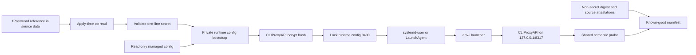
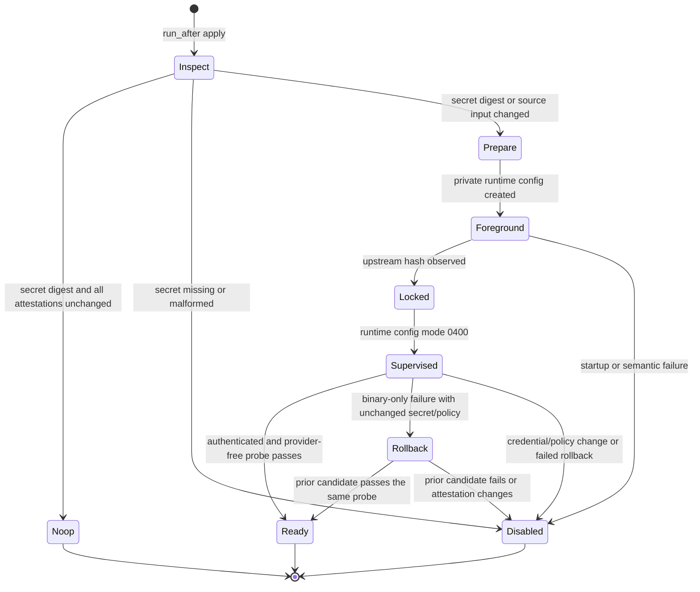
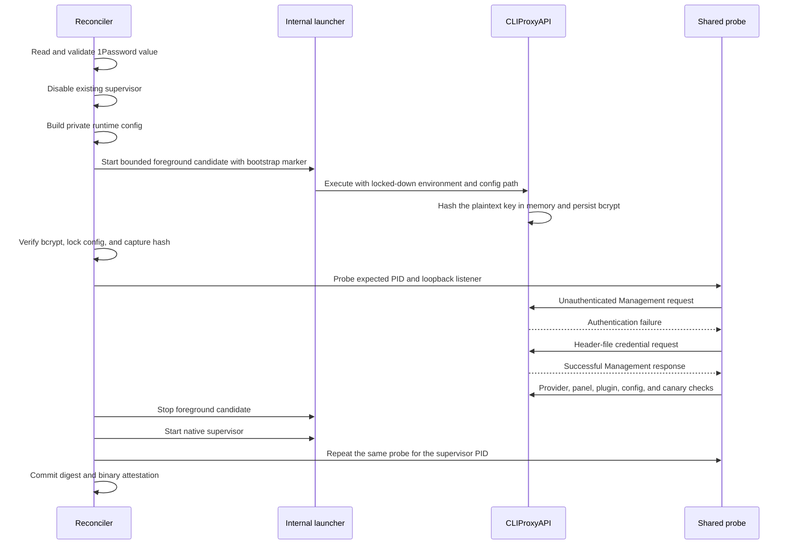

# CLIProxyAPI Management API - Plan

## Goal Capsule

- **Objective:** Activate CLIProxyAPI's localhost Management API with a 1Password-sourced credential while preserving loopback-only binding, the sterile process boundary, the managed read-only configuration contract, and the existing provider-free service behavior.
- **Authority:** GitHub issue #48 defines the product scope and acceptance contract; the repository instructions define secret handling, source ownership, cross-platform parity, and verification; the session-settled delivery decision requires the complete issue outcome in one mergeable pull request.
- **Stop conditions:** Stop activation if the credential cannot be read and validated, if the runtime configuration cannot be locked after bootstrap, if the upstream credential mechanism would enable remote management, or if a failed rotation could leave an unauthenticated or stale candidate running.
- **Execution profile:** Security-sensitive service integration with native Linux/macOS smoke proof, deterministic supervisor fixtures, and rendered-source verification.
- **Tail ownership:** The downstream implementation workflow owns review fixes, the single pull request, and CI-to-green monitoring.

---

## Product Contract

### Summary

Enable authenticated Management API access only through CLIProxyAPI's existing loopback listener. The credential is read from 1Password at apply time, used to bootstrap a private runtime configuration, and never placed in tracked source, service arguments, supervisor environment, or logs.

### Problem Frame

The managed CLIProxyAPI service currently keeps Management API routes disabled because its read-only source configuration has an empty management secret. Issue #48 needs those routes for future local usage and desktop consumers, but upstream offers multiple credential paths with different security consequences: the environment-based password also enables remote-management behavior, while the command-line password would expose the credential in process arguments. The change must therefore fit the existing two-supervisor reconciler without weakening its loopback, rollback, provider-free, and artifact-hygiene guarantees.

The current source configuration is intentionally read-only and is used as a reviewed upstream snapshot. Enabling the API by making that target writable would allow authenticated Management requests to persist configuration changes outside chezmoi's source-of-truth model. The implementation needs a separate private runtime configuration that can authenticate requests while remaining immutable after startup.

### Requirements

#### Credential and configuration boundary

- R1. The Management API credential must be sourced from a named 1Password reference stored in repository data; no plaintext credential may be committed.
- R2. The managed source configuration must remain the reviewed read-only file with an empty `remote-management.secret-key`; it must not be converted into runtime-owned or writable state.
- R3. A private runtime configuration may carry only the upstream-generated bcrypt form of the credential after bootstrap, must be owner-controlled, and must be locked mode 0400 before the service is considered ready; this prevents persistence to the managed runtime file but does not remove upstream Management authority from authenticated callers.
- R4. The service must not use upstream `MANAGEMENT_PASSWORD`, because upstream documents that variable as an additional secret that forces remote-management access even when `allow-remote` is false.
- R5. The service and its supervisors must not receive the credential through inherited ambient environment variables or command-line arguments.

#### Loopback Management API behavior

- R6. The listener must remain exactly `127.0.0.1:8317`, and `remote-management.allow-remote` must remain false in the source and runtime configurations.
- R7. An unauthenticated Management request must receive the upstream authentication failure response, while a request carrying the configured credential must succeed over the loopback listener.
- R8. A malformed, empty, missing, unreadable, or rotated-invalid credential must fail closed: the managed service must be stopped or left stopped, launchable links and private runtime configuration must not preserve an unauthenticated API, and reconciliation must return nonzero.
- R9. Credential rotation must be detected during apply without exposing the credential in a rendered fingerprint; a successful rotation must replace the runtime configuration and re-prove the service before recording it as known-good.

#### Existing service and capability boundaries

- R10. The provider-routable `agent` readiness request must continue to return the existing HTTP 503 JSON `no auth available` response; enabling Management API access must not add provider credentials, client API keys, providers, plugins, or agent consumers.
- R11. The control-panel route and provider-plugin resource routes must remain HTTP 404, and the control-panel artifact and plugin state must remain absent.
- R12. The sterile 0700 provider-auth directory, controlled working directory, `env -i` child boundary, `-local-model` flag, request-log suppression, and historical-state isolation must remain enforced.
- R13. Linux systemd-user and macOS LaunchAgent behavior must satisfy the same credential, listener, readiness, rotation, and fail-closed contract; only native supervisor mechanics may differ.
- R14. Binary-only rollback may restore a manifest-proven prior candidate only when the credential, source configuration, launcher, probe, and active platform policy are unchanged; a credential or policy change must never roll back to an old Management API configuration automatically.

#### Verification and delivery

- R15. Native Linux and macOS smoke tests must prove unauthenticated rejection, authenticated success, loopback ownership, provider-free 503 behavior, optional-route 404 behavior, runtime-config immutability, and absence of credential leakage.
- R16. Deterministic fixtures must cover secret validation, runtime-config bootstrap and locking, rotation, missing/invalid secret failure, supervisor transitions, rollback eligibility, and service-definition policy on both platforms.
- R17. Rendered source, ShellCheck, service-definition validation, platform exclusions, and the full render workflow must pass without placing the credential in tracked files, CI artifacts, process arguments, supervisor output, request logs, or retained scratch state.
- R18. The complete issue #48 scope must ship as one mergeable pull request; CPA Usage Keeper, GNOME/KDE applets, and any other consumer remain outside this delivery.

### Key Flows

- F1. **Apply and bootstrap.** Chezmoi's after-phase reconciler reads the configured 1Password value, validates its shape without printing it, disables any prior service, derives a private runtime copy from the reviewed source configuration, starts a bounded foreground candidate, waits for upstream to hash the secret, locks the runtime copy, and runs the shared semantic probe before enabling either native supervisor.
- F2. **Authenticated local access.** The shared probe first sends a Management request without credentials and expects upstream authentication failure, then sends the same request with a header sourced through a temporary file rather than a command argument and expects a successful Management response. Listener ownership is rechecked after both requests.
- F3. **Rotation and failure.** A changed 1Password value changes the apply-time secret digest. The reconciler disables the current service, removes the old launchable runtime state, proves the replacement, and records the new digest only after supervisor readiness. Any missing, malformed, unreadable, or failed replacement leaves the service disabled; only a binary-only failure with unchanged non-binary inputs may restore a prior verified binary.

### Acceptance Examples

- AE1. **Configured credential.** Given a supported Linux or macOS workstation with a valid 1Password credential, when an unauthenticated request reaches a Management route and then the same route is requested with the configured bearer credential, then the first request is rejected and the second succeeds through `127.0.0.1:8317`.
- AE2. **Loopback-only boundary.** Given the configured source and runtime files, when listener ownership and route behavior are inspected, then only the expected process owns `127.0.0.1:8317`, `allow-remote` remains false, and no Management route is reachable through another bound interface.
- AE3. **Read-only persistence boundary.** Given a successful authenticated Management request, when the raw managed configuration and runtime configuration are inspected or a Management config write is attempted, then the source file remains unchanged and mode 0400 prevents persistence to the managed runtime file. Authenticated holders retain full upstream Management authority: unsupported write routes may transiently mutate in-memory state until restart even when persistence fails; consumers use read endpoints only.
- AE4. **Fail-closed credential.** Given an absent, empty, malformed, unreadable, or invalid 1Password result, when reconciliation or a native supervisor start occurs, then the service does not expose Management routes and no unauthenticated replacement process remains running.
- AE5. **Capability preservation.** Given an activated Management API, when the provider-routable `agent` request and representative control-panel and plugin-resource routes are exercised, then the provider request remains HTTP 503 JSON with `no auth available` and the optional routes remain HTTP 404 without artifacts.
- AE6. **Rotation and rollback.** Given a known-good service, when a valid credential rotates, then the new credential succeeds and the old one fails after a complete re-probe; when a candidate fails with unchanged non-binary inputs, the prior binary may be restored, but when the credential or policy changed, automatic restoration is forbidden.
- AE7. **Leakage resistance.** Given a synthetic high-entropy test credential and request canaries, when native smoke and rendered CI jobs complete, then neither the credential nor canaries occur in process arguments, supervisor output, request logs, tracked source, uploaded artifacts, or retained scratch files.

### Scope Boundaries

#### Deferred to Follow-Up Work

- CPA Usage Keeper and its usage-database or dashboard behavior.
- GNOME and KDE applets or other desktop consumers of the Management API.
- Any API-client library, MCP server, plugin, provider override, or agent integration.
- Fine-grained Management API authorization or a read-only gateway beyond the upstream single-key model.

#### Outside This Delivery

- Provider OAuth, provider API keys, client API keys, provider configuration, plugin installation, plugin credentials, or agent routing.
- The web control panel, panel downloads, panel updates, and provider-plugin resources.
- Remote Management API access, non-loopback listeners, firewall exposure, or a system-wide service.
- Upstream CLIProxyAPI source changes or a fork of the upstream binary.
- Credentials in shell history, command arguments, ambient service environments, logs, test artifacts, or plaintext tracked files.

### Sources / Research

- GitHub issue #48: <https://github.com/hyperlapse122/dotfiles/issues/48>.
- Existing service contract and rollback design: `docs/plans/2026-07-16-002-feat-cli-proxy-api-infrastructure-plan.md`.
- Current managed configuration: `dot_config/cli-proxy-api/readonly_config.yaml`.
- Current launcher, reconciler, probe, and tests: `dot_local/libexec/private_executable_cli-proxy-api-launch`, `.chezmoiscripts/90-services/run_after_cli-proxy-api-service.sh.tmpl`, `.ci/smoke-cli-proxy-api.sh`, `.ci/run-cli-proxy-api-native-smoke.sh`, `.ci/test-cli-proxy-api-service.sh`, and `.ci/test-cli-proxy-api-infrastructure.sh`.
- Upstream Management API documentation: <https://help.router-for.me/management/api>. It documents bearer and `X-Management-Key` authentication, the local-only `--password`/`WithLocalManagementPassword` path, and the fact that `MANAGEMENT_PASSWORD` forces remote-management access.
- Upstream v7.2.80 implementation: `internal/api/server.go`, `internal/api/handlers/management/handler.go`, `internal/api/handlers/management/config_basic.go`, `internal/config/parse.go`, and `cmd/server/main.go` in <https://github.com/router-for-me/CLIProxyAPI/tree/v7.2.80>. The source confirms that plaintext config keys are bcrypt-hashed at load, the hash is normally persisted, Management routes are registered only when a secret exists, and config writes use the configured config path.
- Repository secret patterns: `.chezmoidata/agents.yaml`, `.chezmoitemplates/resolve-op-refs-json.tmpl`, and `.chezmoiscripts/10-auth/run_onchange_after_auth-gitlab.sh.tmpl`.

---

## Planning Contract

### Key Technical Decisions

- **KTD1 — Use a private runtime config instead of upstream environment or CLI injection.** Generate a runtime copy from the reviewed read-only config, insert the 1Password value only during a private bootstrap, let CLIProxyAPI convert it to bcrypt, and lock the resulting file before readiness. Reject `MANAGEMENT_PASSWORD` because upstream makes it an additional remote-capable secret; reject `-password` because the value would be visible in process arguments; reject making the managed source config writable because Management API writes would escape chezmoi ownership.
- **KTD2 — Store only the reference in source data and resolve the secret at apply time.** Add a dedicated CLIProxyAPI data record containing `op://Private/CLIProxyAPI/Management API Key`, not the value. The after-phase reconciler obtains the value through the official `op` CLI, validates it as a single-line high-entropy secret, and keeps it in shell memory only long enough to construct and prove the runtime configuration. A generic one-line generated credential is the supported item contract so YAML escaping and control-character ambiguity cannot become a secret-handling bug.
- **KTD3 — Keep the managed source and runtime configuration distinct.** The source snapshot remains `~/.config/cli-proxy-api/config.yaml` with mode 0444 and an empty secret. The runtime copy lives under the owner-only CLIProxyAPI state directory, carries the bcrypt hash, uses mode 0600 only during bootstrap and 0400 after the hash is observed, and is never treated as a user-editable source. Mode 0400 prevents persistence to the managed runtime file, but authenticated holders retain full upstream Management authority: unsupported write routes may transiently mutate in-memory state until restart even when persistence fails. This delivery supports read endpoints only; a future fine-grained read-only gateway is out of scope.
- **KTD4 — Make secret rotation an apply-time external-state check with an internal no-op gate.** Rename the service reconciler to the repository's bare `run_after_` form because a 1Password value cannot be fingerprinted without exposing it. The script reads and hashes the value on each apply, compares only the non-secret digest and source-input attestations to the known-good manifest, and exits without restarting when nothing changed. A digest mismatch triggers the complete existing disable, foreground proof, supervisor proof, and manifest transaction.
- **KTD5 — Extend the one shared semantic probe for both auth outcomes.** Keep `.ci/smoke-cli-proxy-api.sh` as the sole HTTP authority. It sends an unauthenticated Management request and a credential-bearing request whose header is read from a short-lived mode-0600 file, never from a command argument. It asserts the authenticated response without requesting raw YAML that could expose the stored bcrypt hash, then preserves the provider 503, panel/plugin 404, listener, config, state, and canary checks.
- **KTD6 — Lock before supervisor activation and attest every restart.** The reconciler must observe the upstream bcrypt conversion, verify that the runtime file contains no plaintext credential, change it to mode 0400, and include the locked runtime file and secret digest in the non-binary attestation. Native supervisors receive only managed path variables; they never receive the secret or a bootstrap marker. A later restart therefore consumes only the locked hash.
- **KTD7 — Preserve binary-only rollback semantics across credential changes.** A candidate failure may restore a manifest-proven prior binary only when the management-secret digest and every other non-binary input match the prior manifest. A changed or unreadable credential removes launchable runtime state and leaves the service stopped even if an older binary is available; otherwise a failed binary-only update follows the existing prior-binary readiness proof.
- **KTD8 — Keep capability and platform parity narrow.** The same secret/config/probe contract applies to Linux systemd-user and macOS LaunchAgent paths. The service remains provider-free, client-free, panel-free, and plugin-free; no agent configuration or consumer is modified. Platform differences remain limited to native supervisor commands, path syntax, and static validation.
- **KTD9 — Deliver the complete issue as one mergeable PR.** (session-settled: user-directed — chosen over stopping at analysis, partial implementation, or follow-up PRs: the user explicitly requested resolving issue #48 and creating a mergeable PR.) All credential, service, probe, test, CI, and documentation changes required by this contract belong to this delivery rather than being split into sequential implementation PRs.

### High-Level Technical Design

The following diagrams describe the authoritative runtime shape and failure transitions; implementation may choose equivalent helper names while preserving these boundaries.

#### Credential and process topology

The 1Password value is not passed to the supervisor. The only persistent credential-derived value after bootstrap is the private runtime bcrypt hash and its owner-only attestation digest; the source configuration remains uncredentialed.

#### Apply, rotation, and failure lifecycle

A missing or invalid credential takes the disable path before any new process is considered ready. A changed credential is a non-binary policy change, so the old authenticated runtime is not automatically restored after a replacement failure.

#### Readiness sequence

### Assumptions

- The maintainer will create or maintain the 1Password item `op://Private/CLIProxyAPI/Management API Key`, containing a generated single-line credential with at least 32 printable ASCII characters and no newline, carriage return, or YAML control character. A missing item is a fail-closed runtime condition, not a reason to substitute another secret.
- CLIProxyAPI v7.2.80 and compatible later releases continue to hash a plaintext `remote-management.secret-key` during config load and accept the bcrypt result for bearer authentication. Native smoke remains the authority when a release changes this behavior.
- Mode 0400 prevents the upstream Management API's config-write endpoints from persisting to the managed runtime file, but authenticated holders retain full upstream Management authority and writes may transiently mutate in-memory state until restart. This issue supports read endpoints only; write routes are unsupported and a future fine-grained read-only gateway remains out of scope.
- A same-user process that can read the 1Password-derived runtime hash or obtain the Management credential can use the full upstream Management API. The accepted boundary is loopback plus a high-entropy secret; OS-level same-user compromise is outside this repository's threat model.
- A 1Password read failure during apply must be handled by the reconciler's fail-closed path. The implementation must not silently retain an old authenticated service when the current credential input is unreadable or invalid.
- The existing dynamic latest CLIProxyAPI release policy, user supervisors, and candidate retention remain unchanged unless required to carry the Management credential attestation.

### System-Wide Impact

- **Chezmoi source state:** A new data record contains only an `op://` URI. No rendered secret is included in source fingerprints, plans, tracked fixtures, or repository documentation.
- **Apply lifecycle:** The 90-services reconciler reads 1Password on every apply but performs a no-op when the private digest and all source attestations are unchanged. A secret rotation intentionally retriggers service reconciliation without storing the secret in a rendered script hash.
- **Filesystem state:** The existing reviewed source config stays at its current path and mode. A new runtime config and secret-derived manifest fields live under the owner-only CLIProxyAPI state directory; bootstrap files are cleaned on every failure.
- **Process boundary:** systemd and launchd receive path-only variables. The launcher continues to clear ambient environment, validates all managed paths, and starts the binary with no Management credential in `argv` or inherited environment.
- **HTTP surface:** Management routes gain bearer-key authority only on the loopback listener. Authenticated holders retain full upstream Management authority; this delivery supports read endpoints only and does not filter unsupported write routes. Mode 0400 prevents persistence to the managed runtime file, while an unsupported write may transiently mutate in-memory state until restart. Provider routes remain credential-free and fail with the existing no-auth response. Panel and plugin resources remain absent and return 404.
- **Cross-platform behavior:** Linux and macOS use the same runtime-config and probe contract. Linux keeps bounded failure-only restarts; macOS keeps `RunAtLoad` without unbounded `KeepAlive`.
- **CI artifacts:** Render jobs must verify the secret-bearing apply target before redacting it from uploaded rendered-files artifacts. Native smoke scratch directories and temporary auth-header files must be deleted before artifact collection or process exit.

### Risks & Dependencies

- **Upstream environment semantics:** Using `MANAGEMENT_PASSWORD` appears convenient but upstream explicitly turns on remote-management override for that path. The plan avoids it and asserts its absence in service definitions, launcher tests, and rendered child environments.
- **Secret exposure during bootstrap:** The runtime copy briefly contains the plaintext key so upstream can hash it. The copy is created under the owner-only state directory, never logged or passed in `argv`, is removed on any pre-lock failure, and is accepted only after the file contains bcrypt and is mode 0400.
- **Config write authority:** Upstream Management handlers retain their full authority for authenticated callers and may mutate in-memory state before persistence is attempted. The runtime path is locked after bootstrap, so persistence fails; consumers must use read endpoints only, and tests must prove the managed source and runtime bytes do not change after supported authenticated reads.
- **Rotation rollback:** Restoring an old runtime config after a new credential failure would leave a credential that no longer matches the current 1Password source. The manifest therefore treats secret digest changes as policy changes and disables rather than auto-restores.
- **Credential validation:** Too-short, multiline, control-character, or whitespace-only values can break YAML or create ambiguous header behavior. The 1Password item contract and shell validation reject them without printing the value.
- **Probe leakage:** Supplying an Authorization header directly in a curl command would expose the secret in process inspection. The shared probe must use a mode-0600 temporary header file and remove it before canary and scratch scans.
- **Supervisor startup race:** Locking the runtime config before upstream has hashed it would either retain plaintext or prevent startup conversion. The reconciler waits for the bcrypt marker, checks the resulting file, then changes mode before starting the native supervisor.
- **Bcrypt cost and startup time:** Upstream's password hashing adds startup latency. The existing bounded foreground and supervisor readiness deadlines must include this conversion without becoming unbounded; a timeout is a failed activation.
- **1Password availability:** Apply-time reads require the existing `op` integration. An unreadable item must produce a visible nonzero apply result and a stopped Management API, not a fallback to an ambient environment or an old credential.
- **Local authority:** Any local process with the credential can invoke all upstream Management routes, including auth/config operations. Fine-grained authorization and consumer-specific credentials are deferred rather than implied by this issue.

### Sequencing

U1 defines the source reference, runtime-config contract, and static platform boundaries. U2 extends the launcher, supervisors, and reconciler with apply-time secret handling, hash locking, digest-aware rotation, and rollback rules. U3 extends the shared probe and deterministic/native test harnesses for both authentication outcomes and leakage proof. U4 updates CI artifact handling, render fences, ShellCheck/service validation, and repository documentation. U1 precedes U2; U2 precedes U3; U4 integrates the complete contract and must land in the same pull request.

---

## Implementation Units

### U1. Add the 1Password reference and immutable runtime-config contract

- **Goal:** Define the secret source and separate the credential-bearing runtime configuration from the reviewed read-only source snapshot.
- **Requirements:** R1-R5, R6, R10-R12; F1; AE2, AE3, AE7; KTD1-KTD3.
- **Dependencies:** None.
- **Files:** `.chezmoidata/cli-proxy-api.yaml`, `dot_config/cli-proxy-api/readonly_config.yaml`, `.chezmoiignore`, `dot_config/.chezmoiignore`, `.ci/test-cli-proxy-api-infrastructure.sh`, `.ci/fixtures/cli-proxy-api-config-v7.2.80.diff` only if the source snapshot's comments or safety assertions need adjustment.
- **Approach:** Add a dedicated data record containing the 1Password URI and document the one-line generated-secret contract. Keep the source `secret-key` empty and `allow-remote` false. Define the private runtime path, bootstrap mode, bcrypt-only postcondition, and 0400 locked mode as infrastructure contracts rather than changing the managed target's mode or content. Keep the new data and any credential-bearing rendered target out of Windows, real-container, and uploaded artifact paths.
- **Patterns to follow:** The op-reference data pattern in `.chezmoidata/agents.yaml`, source-only data ownership, `private_`/`readonly_` source attributes, and existing container/Windows CLIProxyAPI fences.
- **Test scenarios:**
  - A rendered data/source configuration contains the op reference and no plaintext or environment-based Management secret.
  - Static config checks find loopback host, port 8317, `allow-remote: false`, empty source secret, disabled panel and updates, disabled plugins, and commercial mode.
  - Runtime-path and mode assertions reject a symlink, wrong owner, writable post-bootstrap config, plaintext post-bootstrap key, or a config outside the private CLIProxyAPI state directory.
  - Windows and real-container rendered target/ignore views contain no Management secret input, runtime config, launcher, service, or reconciler.
  - A synthetic valid secret is accepted only as a single-line high-entropy value; empty, short, multiline, control-character, and unreadable values are rejected without printing their contents.
- **Verification:** The source snapshot remains byte-identical to its existing provenance fixture except for explicitly documented non-secret comments, and static render tests prove that no secret value or `MANAGEMENT_PASSWORD` path enters tracked source or managed supervisor inputs.

### U2. Extend launcher, supervisors, and reconciler for secure activation and rotation

- **Goal:** Make apply-time credential bootstrap, locked runtime configuration, service start, rotation, and rollback obey one fail-closed transaction on Linux and macOS.
- **Requirements:** R2-R9, R12-R14; F1, F3; AE1-AE4, AE6, AE7; KTD1-KTD4, KTD6-KTD8.
- **Dependencies:** U1.
- **Files:** `dot_local/libexec/private_executable_cli-proxy-api-launch`, `dot_config/systemd/user/readonly_cli-proxy-api.service`, `Library/LaunchAgents/readonly_dev.h82.cli-proxy-api.plist.tmpl`, `.chezmoiscripts/90-services/run_after_cli-proxy-api-service.sh.tmpl` (renamed from the current run-on-change path), `.ci/test-cli-proxy-api-service.sh`.
- **Approach:** Keep supervisor environments path-only and extend the launcher to accept only the locked runtime config after bootstrap. Move the reconciler to a bare after-phase because safe secret rotation requires reading live 1Password state; gate the expensive transaction internally using a non-secret digest and existing source attestations. Validate the secret without logging it, disable the current service before any replacement, create the runtime config under the owner-only state directory, start the candidate through a narrowly scoped bootstrap marker, wait for upstream bcrypt conversion, lock the file to 0400, and run the full probe. Record the secret digest, runtime/config/launcher/service/probe attestations, and candidate binary digest only after the supervised probe passes. Treat changed secret/policy as non-rollbackable; retain the existing binary-only prior-candidate path for unchanged non-binary inputs.
- **Patterns to follow:** The current reconciler's transaction trap, path ownership checks, manifest-proven binary termination, `cpa_compute_nonbinary_hash`, platform-specific supervisor adapters, and the launcher `env -i` boundary.
- **Test scenarios:**
  - The launcher rejects a missing, symlinked, writable, plaintext, wrong-owner, wrong-mode, or wrong-path runtime config; it accepts only a locked bcrypt runtime config during normal supervisor starts.
  - Bootstrap creates a private temporary config, the fake or real binary observes the plaintext only during config load, the reconciler locks the resulting bcrypt file, and any failed bootstrap removes the temporary file and active links.
  - Parent `MANAGEMENT_PASSWORD`, provider, proxy, 1Password, and test-canary variables never reach the CLIProxyAPI child; the child `argv` contains no credential and only the managed config path and `-local-model` arguments.
  - First Linux and macOS activations start through the correct native supervisor adapter, pass the same authenticated/unauthenticated probe, and write a mode-0600 manifest containing only non-secret digests and release/binary identity.
  - A changed valid secret disables the old service before replacement, accepts the new secret after a complete probe, rejects the old secret, and records the new digest; an empty, unreadable, malformed, or failed read leaves no active Management service or launchable runtime config.
  - An unchanged-secret binary-only candidate failure restores and re-probes the manifest-proven prior binary; a changed-secret candidate failure, changed source policy, corrupt manifest, failed config lock, or failed rollback leaves the service stopped and returns nonzero.
  - Supervisor stop/start failures, PID handoff, port collision, interruption, config mutation, runtime hash mutation, and wrong executable ownership preserve the existing safe-stop behavior and never signal an unrelated process.
  - A repeated apply with unchanged secret and source attestations exits without restarting the healthy service, while a changed reconciler, probe, service definition, source config, or secret digest triggers one complete transaction.
- **Verification:** Rendered Linux and macOS reconcilers pass `bash -n` and ShellCheck; systemd and launchd files contain no secret value or `MANAGEMENT_PASSWORD`, point to the locked runtime path, and pass their native static validators. Deterministic service fixtures prove all state transitions without claiming a real user-manager activation.

### U3. Extend shared semantic readiness and native security smoke

- **Goal:** Prove both Management authentication outcomes and preserve every existing provider-free, optional-route, process, and artifact invariant through one shared probe.
- **Requirements:** R6-R13, R15-R17; F2; AE1, AE2, AE5, AE7; KTD5-KTD6, KTD8.
- **Dependencies:** U2.
- **Files:** `.ci/smoke-cli-proxy-api.sh`, `.ci/run-cli-proxy-api-native-smoke.sh`, `.ci/test-cli-proxy-api-service.sh`, `.ci/test-cli-proxy-api-infrastructure.sh`.
- **Approach:** Add a probe-only credential input that is never passed to the service child. Send the authenticated header through a short-lived owner-only file referenced by curl, then remove it before scanning managed state and scratch. Assert upstream's unauthenticated Management failure and successful authenticated read endpoint response without requesting raw YAML or exercising unsupported write routes; retain the existing health, provider-routable 503, panel/plugin 404, listener/PID/executable, source and runtime persistence immutability, empty auth state, canary, and final handoff checks. Update native smoke to exercise runtime-config bootstrap and lock before the real binary is treated as ready, and assert no credential in process args, supervisor output, request logs, or the isolated home after cleanup.
- **Patterns to follow:** The shared `cpa_smoke` authority, expected-PID listener checks, request-canary cleanup, native binary smoke isolation, and deterministic curl/lsof manager adapters.
- **Test scenarios:**
  - A valid local process returns the expected auth failure for a Management request without a header and success for a request using the configured credential; the response body contains no credential.
  - A missing, malformed, wrong, or stale credential returns the expected authentication failure and never changes the service readiness result to success.
  - The provider-routable `agent` request remains HTTP 503 with the parsed `no auth available` JSON, while `/v0/management/config`, `/management.html`, and `/v0/resource/plugins/example` follow their intended authenticated/404 contracts.
  - A non-loopback or multiple listener, wrong PID, wrong executable, health redirect/malformed response, provider 401/malformed response, optional route enabled, config mutation, auth residue, plugin/panel artifact, or listener handoff fails the probe.
  - Header-file cleanup occurs after each request; request and credential canaries do not occur in supervisor output, request logs, managed state, runtime config, test artifacts, or retained scratch files.
  - Native Ubuntu and macOS runs use the actual resolved release through the sterile launcher, validate runtime bcrypt locking, exercise both auth outcomes, and prove the same final PID/executable/listener identity.
- **Verification:** `.ci/smoke-cli-proxy-api.sh` remains the only semantic authority used by the reconciler and native CI. Native smoke exits nonzero on any leakage, route, lock, or listener violation and removes all probe-owned files before completion.

### U4. Update render workflow, platform fences, and repository contract

- **Goal:** Make CI and documentation prove the new secret boundary without publishing synthetic or real credentials and keep the repository guidance consistent with the activated service.
- **Requirements:** R1-R5, R10-R18; AE2, AE5, AE7; KTD8-KTD9.
- **Dependencies:** U1-U3.
- **Files:** `.github/workflows/render-dotfiles.yml`, `.chezmoiignore`, `dot_config/.chezmoiignore`, `README.md`, `AGENTS.md`, `CLAUDE.md` (verify unchanged one-line import only).
- **Approach:** Update dummy `op` responses to a valid synthetic high-entropy value for render-only paths, render and assert the private credential boundary before redacting credential-bearing targets from uploaded artifacts, and add Linux/macOS assertions for runtime path/mode and absent secret in service files. Extend Windows/container fences and the native job to run the revised reconciler/probe contract, while retaining the full resolver, service, ShellCheck, and aggregate gates. Document that Management API access is loopback-only, the credential comes from 1Password at apply time, mode 0400 blocks persistence to the runtime file, authenticated holders retain full upstream authority, write routes are unsupported, consumers use read endpoints only, and a future route-filtering gateway remains out of scope. Update script-prefix and CLIProxyAPI lifecycle descriptions for the `run_after_` rotation exception; leave `CLAUDE.md` as exactly `@AGENTS.md`.
- **Patterns to follow:** Existing render-dotfiles artifacts and redaction boundaries, the native Linux/macOS matrix, Windows/container absence assertions, rendered ShellCheck gate, and repository single-source-of-truth documentation sections.
- **Test scenarios:**
  - Fedora/Ubuntu/macOS render jobs resolve a synthetic credential, verify its mode and runtime use in the isolated destination, then remove or redact the credential-bearing target before artifact upload and assert the synthetic value is absent from all uploaded evidence paths.
  - Windows and real-container apply, internals, and ignore assertions contain no CLIProxyAPI credential input, runtime config, launcher, service, or reconciler.
  - Rendered Linux and macOS service definitions pass `systemd-analyze verify` and `plutil -lint`; rendered scripts pass `bash -n` and the existing rendered ShellCheck gate.
  - The workflow runs resolver fixtures, both supervisor transition fixtures, native auth smoke, artifact leakage checks, and the existing direct-provider regression without adding an agent or provider route.
  - README and AGENTS descriptions match the final paths, modes, rotation behavior, loopback boundary, disabled optional surfaces, and container/Windows exclusions; `CLAUDE.md` remains a one-line import.
- **Verification:** The full render workflow reaches green, uploaded artifacts contain no credential or request canary, and documentation review states the persistence boundary, full upstream authority, read-endpoint-only consumer contract, and route-filtering gateway deferral accurately.

---

## Verification Contract

| Gate | Scope | Required outcome |
| --- | --- | --- |
| Isolated template rendering | U1-U4 | The stub-`op` and throwaway-destination recipe renders the data, source targets, both service definitions, launcher, reconciler, probe, and ignore branches without touching live HOME or requiring real 1Password. |
| Secret source and validation fixtures | U1-U2 | A valid synthetic one-line secret is accepted; missing, empty, unreadable, malformed, and unsafe path inputs fail closed without printing the value. |
| Runtime configuration attestation | U1-U3 | Bootstrap briefly permits private conversion, upstream bcrypt is observed, the runtime file becomes owner-read-only, no plaintext remains, source config remains unchanged, and unsupported Management config writes cannot persist to the runtime file while authenticated upstream authority remains documented. |
| Shared semantic probe | U3 | Unauthenticated Management access fails, authenticated local read access succeeds, provider-routable `agent` remains HTTP 503 JSON with `no auth available`, optional routes remain 404, and PID/executable/listener identity is re-proven after all checks. |
| Rotation and rollback fixtures | U2-U3 | Unchanged inputs no-op; valid secret rotation re-proves with the new key; invalid rotation disables; binary-only failure restores only when the secret and all policy inputs are unchanged; failed rollback leaves stopped state. |
| Native Linux smoke | U2-U3 | The actual resolved Linux release passes runtime bootstrap, loopback listener, both Management auth outcomes, provider-free 503, optional 404, config lock, process isolation, and no-leakage checks. |
| Native macOS smoke | U2-U3 | The actual resolved macOS release passes the same security contract through the LaunchAgent-compatible launcher and path/mode rules. |
| Service-definition validation | U2, U4 | `systemd-analyze verify` and `plutil -lint` accept the rendered active-platform definitions; neither contains `MANAGEMENT_PASSWORD` or a credential literal. |
| Shell validation | U2-U4 | `bash -n` and the repository's rendered ShellCheck gate pass for Linux and macOS variants, including the renamed after-phase reconciler and shared probe. |
| Platform fences | U1, U4 | Windows and real-container rendered files and internals contain no credential input, runtime config, CLIProxyAPI service artifacts, or reconciler. |
| Artifact hygiene | U3-U4 | Uploaded render/native evidence and all task-scoped scratch directories contain no synthetic credential, request canary, or header-file copy after cleanup. |
| Agent/provider regression | U3-U4 | Rendered Pi/OpenCode/Codex/Claude configuration remains unchanged in routing terms and contains no CLIProxyAPI consumer or provider credential. |
| Full workflow | U1-U4 | The repository's render workflow, including native smoke, service fixtures, rendered ShellCheck, Windows fences, and aggregate gate, reaches success on the pull request. |

A real `chezmoi apply` to the maintainer's HOME is deployment, not source verification. Native smoke and deterministic supervisor adapters must describe their evidence accurately: they prove the service contract and state transitions, while only a runner with a usable user manager may claim actual supervised activation.

---

## Definition of Done

- The 1Password URI is the only tracked credential reference; no plaintext secret, `MANAGEMENT_PASSWORD`, provider credential, client key, plugin credential, or agent route is added.
- The reviewed source config remains read-only, loopback-only, provider-free, panel-free, plugin-free, and unchanged in its security delta.
- A private runtime configuration is generated only during apply-time activation, is bcrypt-only and mode 0400 after bootstrap, prevents Management API persistence to the runtime file, and is removed on failed activation or invalid credential input; authenticated holders retain full upstream authority and consumers use read endpoints only.
- Linux systemd-user and macOS LaunchAgent starts use the same locked runtime config and sterile launcher without passing the Management credential in `argv` or inherited environment.
- The shared probe proves unauthenticated rejection, authenticated loopback read access, provider-routable no-auth 503, optional-route 404, source/runtime persistence immutability, listener ownership, and final PID handoff.
- Secret rotation is re-proven end to end, old credentials fail after success, invalid rotations fail closed, and automatic rollback remains limited to unchanged binary-only failures.
- Native Linux/macOS smoke, deterministic service tests, resolver/infrastructure tests, rendered ShellCheck, service validation, platform exclusions, artifact redaction, and the full render workflow pass.
- README and AGENTS document the active Management API boundary, apply-time 1Password source, locked runtime persistence boundary, full upstream authority and read-only consumer contract, rotation/failure behavior, and deferred consumers; `CLAUDE.md` remains the exact one-line `@AGENTS.md` pointer.
- The complete issue scope is represented in one mergeable PR, with no split follow-up implementation and no abandoned experiments, temporary credential files, canary values, or dead service paths left in the diff.
