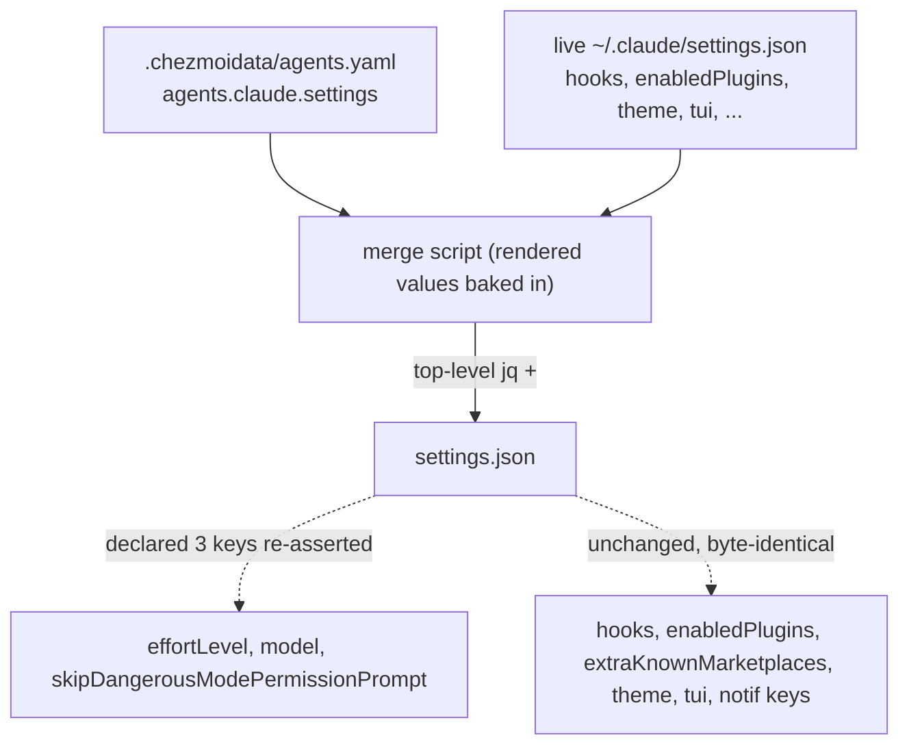

# Manage Claude Code settings values - Plan

## Goal Capsule

- **Objective:** Declaratively manage three Claude Code settings values — `effortLevel`, `model`, `skipDangerousModePermissionPrompt` — from chezmoi, without turning `~/.claude/settings.json` into a managed target.
- **Authority:** repo owner (single-user host). The Product Contract below is the source of truth for scope; this plan adds the HOW.
- **Execution profile:** two-unit change (script + data, then docs). No runtime service, no migration. Verification is render + fixture smoke + CI, not a live `chezmoi apply` (that is a deploy, done only if the user asks).
- **Stop conditions:** stop and ask if the merge would need to touch any key other than the three declared, if `jq` handling would hard-fail rather than soft-skip, or if the AGENTS.md carve-out cannot be written without contradicting the "never a managed target" rule.

---

## Product Contract

**Product Contract preservation:** unchanged. The two items previously deferred to planning (container/OS gating, data key + script naming) are resolved below in the Planning Contract (KTD1, KTD3) and struck from Outstanding Questions.

### Summary

Add a `70-agents/` after-phase provisioning script that read-merge-writes only the declared Claude settings values into the live `~/.claude/settings.json`, mirroring `config-pi-auth`. The declared values are data in `.chezmoidata/agents.yaml`; the merge re-asserts them on install and whenever a declared value changes, and leaves every other key untouched.

### Problem Frame

`~/.claude/settings.json` cannot be a chezmoi-managed target: Claude Code live-writes it (`theme`, `effortLevel`, `tui`), `aoe` injects session-tracking hooks into its `hooks` key, and `claude plugin install` writes `enabledPlugins`/`extraKnownMarketplaces`. A managed file would fight all three. The repo's standing answer — "add capabilities as a plugin, not settings" — does not cover this case, because a plugin can register hooks and commands but cannot set a settings *value* like `effortLevel`. So there is currently no declarative way to pin these values across machines: they drift per host and are only ever set by hand in the UI.

The read-merge-write script pattern (`config-pi-auth` for pi's live-written `auth.json`) is the sanctioned way to touch a live-written file without owning it, and it fits these three values exactly.

### Key Decisions

- **Declared value wins, via `run_onchange_` (no stamp).** The values are re-asserted on first install and whenever a declared value changes in `agents.yaml` — the rendered `DECLARED` JSON is the script's onchange trigger, exactly like `config-pi-auth`. Chosen over the assert-once value-signature stamp used by `config-gnome-fonts`. Onchange trade-off (mirroring `config-pi-auth`, whose header documents the same): a `/effort` or `/model` UI change to a value whose `agents.yaml` data is unchanged is **not** reverted by a routine `chezmoi apply` — the script re-runs only when its rendered content changes, so the UI edit persists until the next data edit or `chezmoi apply --force`. The dotfile stays canonical for the install and every data-driven change; it does not fight every unrelated apply.
- **Top-level `jq +` merge.** All three managed keys are top-level scalars in the live file today (`effortLevel` string, `model` string, `skipDangerousModePermissionPrompt` bool; no `permissions` object). A whole-entry top-level overlay (`. + $declared`) sets exactly those keys and preserves `hooks`, `enabledPlugins`, `extraKnownMarketplaces`, `theme`, `tui`, and the notification keys byte-identical. No nested or deep merge is needed.
- **Data-driven in `.chezmoidata/agents.yaml`.** The declared values live under a new `agents.claude.settings` map; the script carries no hardcoded values and bakes the rendered values into its body as the onchange trigger. No 1Password refs and no secrets, so no fingerprint block is required — simpler than `config-pi-auth`.
- **Sanctioned carve-out to "plugins, not settings".** AGENTS.md's Claude Code plugins section states everything ships as a plugin rather than settings. Managing setting *values* (not capabilities) via a merge script is a justified exception; AGENTS.md is updated to document the carve-out so the rule and the script don't contradict each other.



### Requirements

**Merge behavior**

- R1. A new after-phase `70-agents/` script read-merge-writes the declared Claude settings values into `~/.claude/settings.json`, in the shape of `config-pi-auth`.
- R2. Only the declared keys are (re)written; every other existing top-level key is preserved unchanged.
- R3. The managed keys are exactly `effortLevel`, `model`, and `skipDangerousModePermissionPrompt`.
- R4. The declared values are re-asserted on first install and on any change to the declared value in `agents.yaml` (the rendered value is the onchange trigger); there is no assert-once / value-signature stamp. A UI change to a value whose data is unchanged persists until the next data edit or `chezmoi apply --force`.

**Data source and trigger**

- R5. Declared values are data in `.chezmoidata/agents.yaml`; the script has no hardcoded settings values.
- R6. The rendered declared values are the onchange trigger — editing a value in the data file re-runs the merge on the next apply.

**Robustness and gating**

- R7. An absent or corrupt `settings.json` is handled: a corrupt file is backed up before being rewritten from the declared set; an absent file is created carrying the declared keys.
- R8. A missing `jq` soft-skips (exit 0 with a diagnostic), same as `config-pi-auth`.
- R9. The written file does not become owner-read-only — `settings.json` stays writable so Claude Code and `aoe` can keep updating it.

### Acceptance Examples

- AE1. **Covers R2.** **Given** a `settings.json` carrying `aoe` `hooks`, `enabledPlugins`, and `theme`, **when** the merge runs, **then** those keys are byte-identical afterward and only the three declared keys are (re)written.
- AE2. **Covers R4.** **Given** the declared `effortLevel` value is changed in `agents.yaml`, **when** `chezmoi apply` next runs, **then** the script re-runs and `~/.claude/settings.json` `effortLevel` equals the new declared value. A `/effort` UI change to an *unchanged* declared value does not re-trigger the script — it persists until the next data edit or `chezmoi apply --force`.
- AE3. **Covers R7.** **Given** `settings.json` is not valid JSON, **when** the merge runs, **then** the file is copied to a `.bak` sibling and rewritten from the declared set.

### Scope Boundaries

- Not making `settings.json` a chezmoi target (managed or `readonly_`) — forbidden by repo policy and would fight `aoe`, Claude Code, and plugin installs.
- Not touching `hooks`, plugin registration, `theme`, `tui`, notification keys, or any `permissions` object.
- No assert-once / value-signature stamp — the `config-gnome-fonts` model was considered and rejected in favor of the declared-value-wins (`run_onchange_`) approach.
- Not switching to the documented `permissions.*` keys — the live file has top-level `skipDangerousModePermissionPrompt` and no `permissions` object, so top-level is the correct shape here.
- Windows is not covered — the merge is a bash+`jq` script (`ne windows`), consistent with every other agent-config script here having no `.ps1` counterpart (see KTD3).

### Dependencies / Assumptions

- `jq` is available before after-phase scripts run (declared in `.chezmoidata/packages.yaml` for both distros); the script soft-skips otherwise.
- `~/.claude/` exists by the after phase (the file phase deploys `dot_claude/readonly_CLAUDE.md.tmpl`, creating the directory).
- **Assumption:** `skipDangerousModePermissionPrompt` is a real Claude Code key (present in the live file as top-level `true`) but is undocumented in Claude's public settings schema. A future Claude version could rename or drop it, silently no-opping the pin. Revisit if that key disappears.
- **Assumption:** pinning `skipDangerousModePermissionPrompt: true` is a deliberate choice to auto-skip the bypass/dangerous-mode confirmation. It is data, so it renders on **every** host and is re-asserted whenever the declared value changes (or under `--force`) — a host that wants the confirmation back must change the declared value, not merely toggle it in the UI. Scope this one key per-host if any host should retain the guardrail.

### Outstanding Questions

None blocking. The two items previously deferred to planning — container/OS gating and the data key/script naming — are resolved in the Planning Contract (KTD1, KTD3).

### Sources / Research

- `.chezmoiscripts/70-agents/run_onchange_after_config-pi-auth.sh.tmpl` — the read-merge-write precedent this mirrors (top-level `jq +`, corrupt-file backup, soft-skip on missing `jq`, rendered values as onchange trigger, `PI_AGENT_AUTH` test override).
- `.chezmoiscripts/50-linux-gnome/run_onchange_after_config-gnome-fonts.sh.tmpl` — the value-signature stamp precedent (the rejected always-assert alternative).
- `.chezmoidata/agents.yaml` — `agents:` holds `mcp`/`skills`/`pi`/`opencode`; the new `claude` key slots in as a sibling. `agents.pi.auth.providers` (lines ~171-178) is the header-comment style to mirror.
- `.chezmoidata/packages.yaml` — `jq` declared for both distros (Fedora ~line 184, Ubuntu ~line 481) with a comment naming its `config-pi`/`config-pi-auth` consumers.
- Root `.chezmoiignore` — the container block skips only `.chezmoiscripts/70-agents/*claude-plugins.sh`, so a new `config-claude-settings.sh` is kept in containers alongside `config-pi-auth`.
- AGENTS.md, "Claude Code plugins" section — the "plugins, not settings" rule this carves an exception to.
- Live `~/.claude/settings.json` — confirmed all three keys are top-level scalars and there is no `permissions` object.

---

## Planning Contract

### Key Technical Decisions

- KTD1. **Data key and script name.** Data lives at `agents.claude.settings` (a map keyed by the settings.json key names); the script is `.chezmoiscripts/70-agents/run_onchange_after_config-claude-settings.sh.tmpl`. Both names mirror the `config-pi-auth` precedent so the pair reads as a sibling of the pi merge. (Resolves the deferred naming question.)
- KTD2. **Merge without 1Password resolution.** The three values are non-secret, so the declared JSON is `{{ .agents.claude.settings | toJson }}` directly — not `config-pi-auth`'s per-provider `resolve-op-refs-json.tmpl` loop. Go's `toJson` marshals the YAML map with sorted keys and native types (bool stays bool), giving deterministic output so the baked-in JSON is a stable onchange trigger. A future *secret-valued* Claude setting would have to route through `resolve-op-refs-json.tmpl` instead; that is a boundary, not today's shape.
- KTD3. **Gating: `ne windows`, kept in containers.** Mirrors `config-pi-auth`. Claude Code is a first-class CLI wanted in a devbox, and the container block skips only `*claude-plugins.sh`, so the new script runs in real containers. Windows gets no merge (bash+`jq`), consistent with every other agent-config script having no `.ps1` counterpart. (Resolves the deferred gating question.)
- KTD4. **File mode 0644.** The three values are non-secret and the file is co-written by Claude/`aoe`, so the script writes 0644 (owner-writable) — not `config-pi-auth`'s 0600 secret mode. Satisfies R9.
- KTD5. **`CLAUDE_SETTINGS` env override.** `SETTINGS="${CLAUDE_SETTINGS:-$HOME/.claude/settings.json}"`, mirroring `config-pi-auth`'s `PI_AGENT_AUTH`, so the merge can be exercised against a temp fixture without touching the real `$HOME` (see Verification Contract).
- KTD6. **No ordering dependency with the other `70-agents` settings writers.** `config-claude-settings` and `install-claude-plugins`/`install-compound-engineering` all overlay `settings.json` with a top-level merge that preserves each other's keys, and chezmoi runs scripts serially — so relative order does not matter and none is imposed.

### Sequencing

U1 (data + script) then U2 (docs). Both land in one PR; U2 documents what U1 built.

---

## Implementation Units

### U1. Add the Claude settings merge script and its data

- **Goal:** Merge the three declared Claude settings values into the live `~/.claude/settings.json` on apply, preserving all other keys.
- **Requirements:** R1, R2, R3, R4, R5, R6, R7, R8, R9.
- **Dependencies:** none.
- **Files:**
  - `.chezmoidata/agents.yaml` (modify — add the `agents.claude.settings` map as a sibling of `pi`/`opencode`, with a header comment in the style of the `agents.pi` block).
  - `.chezmoiscripts/70-agents/run_onchange_after_config-claude-settings.sh.tmpl` (create).
  - No in-repo test file: the repo has no unit-test harness for chezmoi scripts; automated coverage is CI's render-internals + shellcheck, plus the manual fixture runs in Test scenarios.
- **Approach:**
  - Data:
    ```yaml
    claude:
      settings:
        effortLevel: xhigh
        model: "opus[1m]"
        skipDangerousModePermissionPrompt: true
    ```
    Seed the three values from the current host values (they are what the user runs today and wants pinned). Quote `"opus[1m]"` to avoid YAML flow-scalar ambiguity. Header comment: these render into a read-merge-write of the live settings.json (NOT a managed target — see AGENTS.md carve-out), always-assert, no secrets.
  - Script mirrors `run_onchange_after_config-pi-auth.sh.tmpl`: `{{ if ne .chezmoi.os "windows" -}}` gate, `set -euo pipefail`, `SETTINGS="${CLAUDE_SETTINGS:-$HOME/.claude/settings.json}"`, soft-skip (`exit 0` + stderr diagnostic) when `jq` is absent, `mkdir -p "$(dirname "$SETTINGS")"`, `DECLARED='{{ .agents.claude.settings | toJson }}'`, then read-merge-write: if the file exists and is valid JSON, `jq --argjson declared "$DECLARED" '. + $declared'`; else back up a non-empty-but-corrupt file to `<path>.bak` and write `$DECLARED`; `chmod 644` the temp file; atomic `mv`.
  - No `resolve-op-refs-json.tmpl`, no fingerprint block — the rendered `DECLARED` JSON is the onchange trigger (per KTD2).
- **Patterns to follow:** `.chezmoiscripts/70-agents/run_onchange_after_config-pi-auth.sh.tmpl` (whole shape and header-comment density); `.chezmoidata/agents.yaml` `agents.pi` block (data + comment style).
- **Test scenarios:**
  - Covers AE1 / R2. Fixture with `hooks`, `theme`, `enabledPlugins`, `tui` → run rendered script with `CLAUDE_SETTINGS` pointing at it → those four keys are byte-identical and the three declared keys equal the declared values.
  - Covers AE2 / R4. Fixture with `effortLevel: "low"` → run → `effortLevel` becomes the declared `xhigh`.
  - Covers AE3 / R7 (corrupt). Fixture containing non-JSON text → run → `<fixture>.bak` holds the original bytes and the fixture is rewritten to the valid declared set.
  - Covers R7 (absent). No file at the `CLAUDE_SETTINGS` path → run → file created with exactly the three declared keys.
  - Covers R8. `jq` not on PATH → run → exit 0 with a diagnostic and the file untouched.
  - Type fidelity. Rendered `DECLARED` parses as JSON where `skipDangerousModePermissionPrompt` is a boolean (not the string `"true"`) and `effortLevel`/`model` are strings.
  - Covers R9. After a run, the written file is mode 0644.
- **Verification:** rendered script is valid bash (`chezmoi execute-template` exit 0 under the stub-`op` recipe) with a valid-JSON `DECLARED`; the fixture scenarios above pass when the rendered script runs against temp files in a per-user scratch dir; `shellcheck` clean.

### U2. Document the settings-value carve-out

- **Goal:** Reconcile AGENTS.md's "plugins, not settings" rule with the new merge script and register the new data source, so the docs and the code stop contradicting each other.
- **Requirements:** advances Key Decision "sanctioned carve-out" (Product Contract Key Decisions).
- **Dependencies:** U1.
- **Files:**
  - `AGENTS.md` (modify — three touches: a carve-out paragraph in the "Claude Code plugins" section; a new bullet in "Single source of truth"; a phrase in the `70-agents` dir table row).
  - `.chezmoidata/packages.yaml` (modify — extend the two `jq` comments to name `config-claude-settings` alongside `config-pi`/`config-pi-auth`).
  - No `CLAUDE.md` change — root already imports `@AGENTS.md`.
- **Approach:**
  - Claude Code plugins section: add a paragraph stating `settings.json` stays un-managed and un-owned, **but** declarative management of specific setting *values* (not capabilities) is done via a read-merge-write script (`config-claude-settings`), the same sanctioned pattern as `config-pi-auth` — because a plugin registers hooks/commands but cannot set a value like `effortLevel`. Name the three managed keys, the always-assert semantics, and that the top-level `+` preserves `hooks`/`enabledPlugins`/`theme`.
  - Single source of truth: add a bullet — **Claude Code settings values** live in `.chezmoidata/agents.yaml` `agents.claude.settings`, rendered into `run_onchange_after_config-claude-settings.sh.tmpl` as the onchange trigger; edit the data, not the script.
  - `70-agents` dir table row: append a phrase noting the script merges Claude settings values into the live `settings.json`.
  - packages.yaml: update both `jq` comments to enumerate `config-claude-settings` as a consumer.
- **Test scenarios:** `Test expectation: none — documentation + comment-only edits, no behavioral change.` Consistency check: the AGENTS.md "must never become a managed target" line now explicitly excepts value-merge scripts and no longer contradicts U1.
- **Verification:** AGENTS.md reads coherently in one pass with no internal contradiction; the packages.yaml comment names the new consumer. (The `packages.yaml` comment edit has no onchange side effect — the installers render from parsed data, not the raw file; see System-Wide Impact.)

---

## System-Wide Impact

- **`settings.json` co-writers.** The merge shares the file with Claude Code (live writes), `aoe` (hooks), and `install-claude-plugins`/`install-compound-engineering` (plugin registration). The top-level `+` overlay only ever sets the three declared keys, so every co-writer's keys survive; no ordering guarantee is needed (KTD6).
- **The `packages.yaml` comment edit is side-effect-free.** The Fedora/Ubuntu installers render package names from parsed `.packages` data (no raw-file fingerprint) and YAML comments are stripped at parse time, so a comment-only edit produces byte-identical rendered installer content and does not re-trigger the installer's onchange.
- **First apply after this lands** runs the new script on every host (its rendered content is new), overwriting whatever `effortLevel`/`model`/`skipDangerousModePermissionPrompt` those hosts currently carry with the declared values. Thereafter it re-runs only when a declared value changes in `agents.yaml` or under `chezmoi apply --force`.

---

## Verification Contract

- **Render (stub-`op` recipe):** `chezmoi execute-template < .chezmoiscripts/70-agents/run_onchange_after_config-claude-settings.sh.tmpl` exits 0 and emits valid bash; the rendered `DECLARED` is valid JSON with `skipDangerousModePermissionPrompt` boolean and `effortLevel`/`model` strings. Use the stub-`op` + throwaway-destination recipe from AGENTS.md — never a real `chezmoi apply` (that is a deploy).
- **Fixture smoke:** run the rendered script with `CLAUDE_SETTINGS` pointed at temp fixtures in a per-user scratch dir to prove the U1 Test scenarios (preserve other keys, re-assert changed value, corrupt→`.bak`, absent→create, missing-`jq` soft-skip, mode 0644).
- **shellcheck:** the `render-dotfiles.yml` shellcheck job lints the real rendered script; must be clean.
- **CI to green (both required after push):**
  - `render-dotfiles.yml` — `apply --init` (fedora/ubuntu containers), `render internals` (renders the new `70-agents` script via `execute-template`), and the shellcheck gate. Runs on PR and push to main.
  - `ci.yml` — the rest (TS/Rust/Studio smoke), unaffected but must stay green.
- **Archive no-op gate does NOT cover this change** — `.chezmoiscripts/**` are not file targets, so a byte-identical archive says nothing about the new script. Rely on render-internals + shellcheck + the fixture smoke instead, per the AGENTS.md archive blind-spot note.

---

## Definition of Done

- `agents.claude.settings` exists in `.chezmoidata/agents.yaml` with `effortLevel`, `model` (quoted), and `skipDangerousModePermissionPrompt` at correct YAML types.
- `run_onchange_after_config-claude-settings.sh.tmpl` created; renders clean; shellcheck clean; all U1 Test scenarios pass against fixtures.
- `AGENTS.md` carve-out written (Claude Code plugins section no longer contradicts the script), Single source of truth bullet added, `70-agents` table row updated; `packages.yaml` `jq` comments name the new consumer.
- No abandoned or experimental code left in the diff.
- `render-dotfiles.yml` and `ci.yml` both green on the PR.
- Deploying to land the change on this host (`chezmoi apply`) is the user's call and is not part of DoD unless requested.
