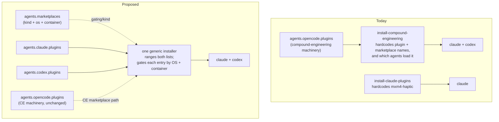
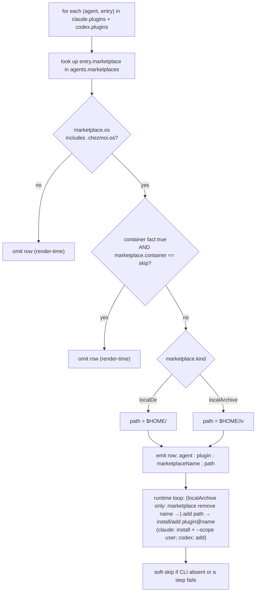

# Agent Plugins in agents.yaml - Plan

## Goal Capsule

- **Objective:** Bring Claude Code and Codex plugin declarations under `.chezmoidata/agents.yaml` as data, so adding or removing a Claude/Codex plugin is a data edit — matching how `agents.pi.settings.packages` and `agents.opencode.plugins` already work — and collapse the two current install scripts into one generic, data-driven runner.
- **Product authority:** the dotfiles maintainer (iam@h82.dev).
- **Stop conditions:** the archive no-change gate is not byte-identical for `opencode.json` / pi / dotagents targets (SC1 breaks); the rendered generic script fails shellcheck; a render aborts on the new data. Surface and stop.
- **Execution profile:** chezmoi template + bash refactor. No runtime service. Verify by render + archive gate + rendered-script diff + shellcheck + the `render-dotfiles` CI, then a real Linux apply for the live `plugin list` check.
- **Open blockers:** none. The four questions the requirements doc deferred to planning are resolved in the Planning Contract's Key Technical Decisions.
- **Product Contract preservation:** unchanged except AE3, whose mechanism note is refined from "runtime container guard" to render-time gating (KTD3) — its asserted behavior (mxm4-haptic absent in containers, compound-engineering kept) is preserved.

---

## Product Contract

### Summary

Add `agents.claude.plugins` and `agents.codex.plugins` to `.chezmoidata/agents.yaml` as per-agent lists, and replace the two current install scripts with a single generic, data-driven installer that ranges over them. compound-engineering's version machinery stays under `agents.opencode.plugins`; MCP is already data-driven and stays out of scope.

### Problem Frame

For Claude Code and Codex, MCP servers are already single-sourced in `agents.mcp.servers` and rendered into both agents by dotagents. Plugins are not — they are hardcoded across two shell scripts:

- `run_onchange_after_install-claude-plugins` hardcodes `PLUGINS=("mxm4-haptic")` and the local `dotfiles` marketplace.
- `run_onchange_after_install-compound-engineering` hardcodes the `compound-engineering` plugin name and its `compound-engineering-plugin` marketplace name, and which agents load it.

So changing what Claude or Codex registers means editing a shell script, not the single-source-of-truth data file — the opposite of the pi/opencode ergonomics this repo standardizes on. The version machinery under `agents.opencode.plugins` is not the problem and is kept; the problem is the hardcoded plugin lists.

### Key Decisions

- **Per-agent lists, not a shared registry.** Mirror the pi/opencode pattern. MCP uses a shared `agents.mcp.servers` list because every server applies to every agent; that does not hold for plugins (`mxm4-haptic` is Claude-only), and `compound-engineering` simply appears in both per-agent lists by marketplace name.
- **compound-engineering machinery stays under `agents.opencode.plugins`.** The Claude/Codex entries reference the marketplace by name (`compound-engineering-plugin`, matching its `marketplace.json`); the installer resolves the versioned localArchive path from the existing `agents.opencode.plugins` entry through `compound-engineering-ref.tmpl`. No version or path literal is copied into the per-agent entries. Re-homing that machinery was the rejected larger approach — it would ripple into `opencode.json`, the external, `opencode-plugins-json.tmpl`, and CI.
- **One generic installer replaces the two scripts.** A single data-driven runner ranges over both per-agent lists (the move `config-kde-settings` made for the 8 KDE scripts). This requires each plugin's gating to become data, since one script must decide per entry rather than relying on a whole-script gate.
- **Gating is data.** Each plugin's OS applicability (linux vs linux+darwin) and container behavior (skip vs keep) is expressed in the data so the single installer can gate each entry.
- **MCP untouched.** Already single-sourced via `agents.mcp.servers` → dotagents; not part of this work.

### Requirements

**Data schema**

- R1. `.chezmoidata/agents.yaml` gains `agents.claude.plugins` and `agents.codex.plugins`, per-agent lists mirroring the nesting of `agents.pi.settings.packages` and `agents.opencode.plugins`.
- R2. Each entry names its plugin and the marketplace it comes from by that marketplace's registered name (`dotfiles`, `compound-engineering-plugin`), matching each marketplace's `marketplace.json` `name`.
- R3. compound-engineering appears in both the Claude and Codex lists as a name reference. Its version and localArchive path machinery stays under `agents.opencode.plugins`, resolved through `compound-engineering-ref.tmpl`; no version or path literal enters the per-agent entries.
- R4. Each plugin's gating is data — OS applicability and container behavior — so a single installer can gate each entry (mxm4-haptic: linux, container-skip; compound-engineering: linux+darwin, container-keep).

**Script consolidation**

- R5. A single generic installer replaces `run_onchange_after_install-claude-plugins` and `run_onchange_after_install-compound-engineering`. It ranges over `agents.claude.plugins` and `agents.codex.plugins` and, per entry, registers the marketplace and installs the plugin with the matching agent CLI (`claude` / `codex`).
- R6. The installer applies each entry's OS + container gate, rather than relying on a whole-script OS gate plus a `.chezmoiignore` container exclusion. It stays soft-skip throughout and keeps an onchange trigger that re-runs on a plugin-list change or a resolved-version change.

**Behavior invariants**

- R7. What each host registers is unchanged: Claude → compound-engineering + mxm4-haptic; Codex → compound-engineering. Net OS + container behavior is identical to today — mxm4-haptic still absent on darwin and in containers; compound-engineering still present on both.
- R8. `agents.mcp.servers` and the dotagents MCP path, the `[trust]` allowlist, and `agents = ["claude", "codex"]` are untouched.
- R9. opencode and pi consumption of compound-engineering is untouched; `opencode.json`, the pi settings/mcp targets, and the dotagents `agents.toml` render byte-identical.

### Acceptance Examples

- AE1. **Covers R5, R6, R7.** On a Linux workstation apply, the generic installer registers compound-engineering with both `claude` and `codex`, and mxm4-haptic with `claude`.
- AE2. **Covers R4, R6, R7.** On a macOS apply, compound-engineering is registered with `claude` and `codex`; the mxm4-haptic entry is absent because its marketplace's `os` list excludes darwin — same as today.
- AE3. **Covers R4, R6, R7.** On an apply inside a real container, compound-engineering is registered (container-keep); the mxm4-haptic entry is absent because its marketplace is `container: skip` and the `container` fact filters it out at render time. Net-identical to today's whole-script `.chezmoiignore` exclusion; the merged script still deploys in containers so compound-engineering keeps running.

### Source-of-truth fan-out



### Scope Boundaries

- MCP stays on dotagents (already single-sourced); the `[trust]` allowlist and `agents = [...]` list stay in the dotagents template.
- compound-engineering's version/path machinery stays under `agents.opencode.plugins` — not re-homed. `opencode.json`, the external, `opencode-plugins-json.tmpl`, pi's `git:` source, and the compound-engineering CI provenance are untouched.
- Agent skills under `~/.agents/skills` (chezmoi externals) are a separate mechanism, out of scope.

#### Deferred to Follow-Up Work

- Supporting a brand-new marketplace *kind* (beyond `localDir` and `localArchive`) still needs script plumbing, not just a data line. Not in scope until a third kind is actually needed.

### Dependencies / Assumptions

- Assumes the two current scripts' install behavior is correct and complete (verified against their source at authoring time).
- Assumes no third Claude/Codex plugin of a *new* marketplace kind is pending; the schema covers adding more plugins of the two existing kinds.

---

## Planning Contract

### Key Technical Decisions

- KTD1. **Marketplace definitions live in a shared `agents.marketplaces` map, keyed by marketplace name.** Per-agent entries stay `{name, marketplace}` (the chosen brainstorm preview). The map carries each marketplace's `kind`, `os`, and `container`. compound-engineering appears in two per-agent lists, and gating/kind belong to the marketplace, not the plugin, so defining them once avoids duplication. Resolves the deferred "where gating lives" question.
- KTD2. **compound-engineering's path resolves from `agents.opencode.plugins` + `compound-engineering-ref.tmpl`, not from `agents.marketplaces`.** The `agents.marketplaces.compound-engineering-plugin` entry carries only `kind: localArchive` + `os` + `container`, no path or version — the installer reaches into the existing `agents.opencode.plugins` localArchive entry for `externalPath` and resolves the version through the shared ref template, exactly as `install-compound-engineering` does today. Keeps `externalPath`/version single-sourced (faithful to Approach A; no re-home, no duplication).
- KTD3. **Gating is render-time row filtering, not a runtime guard.** The generic script emits a plugin row only when the marketplace's `os` list includes `.chezmoi.os` and — for a `container: skip` marketplace — the `container` fact (`{{ $f := includeTemplate "facts.tmpl" . | fromYaml }}`, `$f.container`) is false. This matches the repo's "facts baked at render time → re-render re-runs the onchange script" model and the `config-kde-settings` precedent, and refines Product Contract AE3's "runtime guard" wording. `FACT_CONTAINER` from `facts-sh.tmpl` is available if a runtime assertion is wanted as belt-and-braces, but the row simply not being rendered is the primary mechanism.
- KTD4. **New script `run_onchange_after_install-agent-plugins.sh.tmpl`; the two old scripts are deleted.** One generic runner (config-kde-settings precedent). The new basename must not match the container `.chezmoiignore` glob `*claude-plugins.sh`, so the merged script is container-*kept* for compound-engineering while the mxm4-haptic row is render-filtered out in containers (KTD3). Cost: the new target path re-runs the onchange script once per host (chezmoi keys onchange state on target path) — expected, not churn.
- KTD5. **Onchange trigger = union of both former triggers.** The rendered plugin rows + the resolved compound-engineering version (baked into the script body) cover data and version changes; a `fingerprint.tmpl` block over `dot_local/share/claude-plugins/**` and `.chezmoidata/haptic.yaml` preserves `install-claude-plugins`' current coverage of a plugin-tree/hooks retune whose raw template text is byte-identical. Keeping both avoids silently narrowing the trigger.
- KTD6. **Render-time validation aborts the apply on bad data.** Mirror `config-kde-settings`: an entry whose `marketplace` is not defined in `agents.marketplaces`, a marketplace with an unknown `kind`, a bad `os`/`container` value, or a plugin/marketplace name outside a bare-identifier allowlist each `fail` with a message naming the offending entry. A `kind: localArchive` marketplace whose `agents.opencode.plugins` source entry cannot be resolved (removed or renamed) also `fail`s naming both keys, rather than rendering a malformed `$HOME//v…` path or silently dropping the registration — the cross-key coupling from KTD2 must be validated, not assumed. The names are interpolated into bash, so the allowlist is the injection guard. Matches the repo's "unknown name aborts loudly" convention.

### High-Level Technical Design

Per-entry logic the generic runner renders (render-time gate → path resolution → per-agent CLI dispatch):



Directional data shape (final key names/nesting are the implementer's call):

```yaml
agents:
  marketplaces:
    dotfiles:
      kind: localDir
      path: .local/share/claude-plugins   # relative to $HOME
      os: [linux]
      container: skip
    compound-engineering-plugin:
      kind: localArchive                    # path from opencode CE entry + ref
      os: [linux, darwin]
      container: keep
  claude:
    plugins:
    - { name: mxm4-haptic, marketplace: dotfiles }
    - { name: compound-engineering, marketplace: compound-engineering-plugin }
  codex:
    plugins:
    - { name: compound-engineering, marketplace: compound-engineering-plugin }
```

### Assumptions

- The runtime loop mirrors each marketplace's *current* sequence rather than applying one uniformly: a path-changing `localArchive` marketplace does `marketplace remove → add → install` (the `install-compound-engineering` shape the version bump needs), while a constant-path `localDir` marketplace does `add → install` with no `remove` (the `install-claude-plugins` shape). This preserves R7 — the pre-`remove` is never issued against `dotfiles`, so mxm4-haptic's existing registration cannot be torn down and left unrestored.
- Codex's CLI verbs mirror what `install-compound-engineering` uses today (`codex plugin marketplace add/remove`, `codex plugin add`, no `--scope`); Claude uses `claude plugin marketplace add/remove --scope user` and `claude plugin install …@… --scope user`. The generic loop branches on agent for these two verb sets.

### Sequencing

U1 (data) → U2 (generic script + delete old) → U3 (`.chezmoiignore`) → U4 (docs). U2 depends on U1's schema; U3 depends on U2's new basename; U4 documents the settled result.

---

## Implementation Units

### U1. Plugin data model in `agents.yaml`

- **Goal:** Add the schema the generic installer ranges over.
- **Requirements:** R1, R2, R3, R4.
- **Dependencies:** none.
- **Files:** `.chezmoidata/agents.yaml`.
- **Approach:** Add a top-level `agents.marketplaces` map (KTD1) with `dotfiles` (`kind: localDir`, `path: .local/share/claude-plugins`, `os: [linux]`, `container: skip`) and `compound-engineering-plugin` (`kind: localArchive`, `os: [linux, darwin]`, `container: keep`, no path/version — KTD2). Add `agents.claude.plugins` (`mxm4-haptic`→`dotfiles`, `compound-engineering`→`compound-engineering-plugin`) and `agents.codex.plugins` (`compound-engineering`→`compound-engineering-plugin`). Add a header comment block in the file's consumer-map style pointing at the new consumer. Do not touch `agents.opencode.plugins`, `agents.mcp`, `agents.pi`.
- **Patterns to follow:** the per-agent nesting and header-comment style already in `.chezmoidata/agents.yaml`; marketplace names must match `dot_local/share/claude-plugins/.claude-plugin/marketplace.json` (`dotfiles`) and the extracted `compound-engineering-plugin` marketplace.
- **Test scenarios:**
  - Covers R1–R4. `chezmoi execute-template` on a consumer that reads the new keys renders without error and the names match the two `marketplace.json` files.
  - Covers R9. The archive no-change gate stays byte-identical for `opencode.json`, pi, and dotagents targets after this edit (adding keys must not perturb existing consumers).
- **Verification:** the new keys parse; no existing rendered target changes.

### U2. Generic installer `run_onchange_after_install-agent-plugins.sh.tmpl`

- **Goal:** One data-driven runner that registers every Claude/Codex plugin, replacing both current scripts.
- **Requirements:** R5, R6, R7.
- **Dependencies:** U1.
- **Files:** create `.chezmoiscripts/70-agents/run_onchange_after_install-agent-plugins.sh.tmpl`; delete `.chezmoiscripts/70-agents/run_onchange_after_install-claude-plugins.sh.tmpl` and `.chezmoiscripts/70-agents/run_onchange_after_install-compound-engineering.sh.tmpl`.
- **Approach:** Gate the template `{{ if or (eq .chezmoi.os "linux") (eq .chezmoi.os "darwin") -}}`. Resolve `$f := includeTemplate "facts.tmpl" . | fromYaml`. Range over `agents.claude.plugins` then `agents.codex.plugins`; for each entry look up its marketplace in `agents.marketplaces`, validate (KTD6), apply the render-time OS + container gate (KTD3), resolve the path by `kind` (KTD2 for localArchive — reuse the `agents.opencode.plugins` lookup + `compound-engineering-ref.tmpl` from the old CE script), and emit a validated `agent:plugin:marketplaceName:kind:path` row into a bash array. The runtime loop mirrors each marketplace's current sequence: a `localArchive` (path-changing) marketplace does `marketplace remove <name>` → `marketplace add <path>` → install; a `localDir` (constant-path) marketplace does `marketplace add <path>` → install only, with no `remove` (matching current `install-claude-plugins`, so mxm4-haptic's registration is never torn down — R7). Install verbs branch on agent (`claude plugin install <plugin>@<name> --scope user` / `codex plugin add <plugin>@<name>`), each soft-skipping (`warn`; `return 0`/`exit 0`) on an absent CLI or a failed step, with `mkdir -p ~/.claude ~/.codex` first (the first-apply ENOENT guard both old scripts carry). Append the KTD5 fingerprint block over `dot_local/share/claude-plugins/**` + `.chezmoidata/haptic.yaml`.
- **Execution note:** start from the two current scripts as the behavior reference — preserve their soft-skip diagnostics, the `mkdir -p` guard, and the CE path resolution verbatim; the new work is the render-time validation/gating loop and the array shape.
- **Technical design:** see the Planning Contract HTD flowchart (directional).
- **Patterns to follow:** `run_onchange_after_config-kde-settings.sh.tmpl` for the validated-array + runtime-loop shape and the render-time `fail` guards; `fingerprint.tmpl` include form; the CE-path resolution in the deleted `install-compound-engineering`.
- **Test scenarios:**
  - Covers R5, R7 / AE1. Linux render (`chezmoi execute-template` via the AGENTS.md stub-`op` recipe) emits rows for claude→{mxm4-haptic, compound-engineering} and codex→{compound-engineering}, with the CE rows carrying the versioned localArchive path.
  - Covers R6 / AE2. A darwin render (via `render-dotfiles` macOS render-internals artifact) emits CE rows for claude+codex and no mxm4-haptic row.
  - Covers R6 / AE3. A container render (via `render-dotfiles` fedora/ubuntu `apply --init`) emits CE rows and no mxm4-haptic row, and the script is present (not `.chezmoiignore`'d).
  - Covers R5. Bad data aborts the render with a message naming the entry (KTD6): an entry naming an undefined marketplace, a name with a shell metacharacter, or a `localArchive` marketplace with no matching `agents.opencode.plugins` entry.
  - The rendered script passes shellcheck (the CI shellcheck job lints rendered scripts).
- **Verification:** rendered script is valid bash, gates correctly per OS/container, and the two old script files no longer exist.

### U3. Container `.chezmoiignore` update

- **Goal:** Make the merged script container-kept and drop the now-dead skip.
- **Requirements:** R6, R7.
- **Dependencies:** U2.
- **Files:** `.chezmoiignore`.
- **Approach:** In the `{{- if $f.container }}` block, remove the `.chezmoiscripts/70-agents/*claude-plugins.sh` line (its target no longer exists; the new basename intentionally does not match it, so the merged script deploys and runs in containers for compound-engineering). Keep the `.local/share/claude-plugins` tree skip (both the non-linux and container occurrences). Update the adjacent comment to describe render-time filtering of the mxm4-haptic row rather than a whole-script skip.
- **Patterns to follow:** the existing container block structure and comment style in `.chezmoiignore`.
- **Test scenarios:**
  - Covers R7 / AE3. `chezmoi ignored` with the `container` fact true lists the plugin tree but NOT the new `install-agent-plugins` script; the fedora/ubuntu `apply --init` CI jobs (real containers) confirm the CE registration runs and no mxm4 tree deploys.
  - Covers R7. `chezmoi ignored` on a normal linux host (no container) is unchanged for these paths.
- **Verification:** the new script is not ignored in a container; the mxm4 tree still is.

### U4. Documentation update in `AGENTS.md`

- **Goal:** Keep the repo's authoritative docs matching the new mechanism.
- **Requirements:** R5 (doc-consistency; no functional requirement).
- **Dependencies:** U1, U2, U3.
- **Files:** `AGENTS.md`.
- **Approach:** Update the `.chezmoiscripts/` `70-agents/` table row, the "Claude Code plugins" section, the "compound-engineering" section, and the container `.chezmoiignore` description to describe: `agents.claude.plugins` / `agents.codex.plugins` + `agents.marketplaces` as the data source, the single `run_onchange_after_install-agent-plugins` runner, and render-time OS/container gating. Remove references to the two deleted script names. Add `agents.marketplaces` / `agents.claude` / `agents.codex` to the "Single source of truth" list. Leave `CLAUDE.md` as the one-line `@AGENTS.md` import (unchanged).
- **Patterns to follow:** the existing AGENTS.md section structure and the "edit the data, not the script" phrasing.
- **Test scenarios:** `Test expectation: none -- documentation-only; verified by grep that neither `install-claude-plugins` nor `install-compound-engineering` remains referenced anywhere except as historical context, and that the new script name and data keys are documented.`
- **Verification:** no stale script-name references remain; the new mechanism is documented.

---

## Verification Contract

Run all render/gate checks through the AGENTS.md "Verify edits" stub-`op` + throwaway-destination recipe (never against the real `$HOME`), injecting `GITHUB_TOKEN="$(gh auth token)"` for the GitHub-API renders.

- **Render (U2):** `chezmoi execute-template < .chezmoiscripts/70-agents/run_onchange_after_install-agent-plugins.sh.tmpl` exits 0 on this Linux host and emits the mxm4-haptic + compound-engineering rows; a deliberately-broken data entry aborts with a naming message (KTD6).
- **Rendered ShellCheck (U2):** the rendered generic script is clean (the CI `shellcheck (rendered scripts + repo-meta)` job is the authority; reproduce locally with `shellcheck` on the rendered output).
- **Archive no-change gate (SC1, R9):** archive `origin/main` and this branch with `--exclude=encrypted,externals,scripts`, extract both, `LC_ALL=C diff -r` — byte-identical for `opencode.json`, the pi settings/mcp targets, and the dotagents `agents.toml`. Only `.chezmoidata/agents.yaml`, the scripts, `.chezmoiignore`, and `AGENTS.md` change.
- **Rendered-script diff (SC2):** the archive gate is script-blind, so diff the rendered script text between the two sides (`execute-template` per side, or the `rendered-internals-<os>` CI artifacts) to confirm one generic runner ranges over `agents.*.plugins` and neither old script remains.
- **Ignore-set (U3):** `chezmoi ignored` with and without the `container` fact confirms the new script is kept in containers and the mxm4 tree is skipped.
- **CI:** `render-dotfiles.yml` — the fedora/ubuntu `apply --init` jobs (real containers) prove AE3; the macOS render-internals artifact proves AE2; `render internals` + `shellcheck` cover the rendered script on both distros.
- **Live (SC3):** on a real Linux `chezmoi apply`, `claude plugin list` shows compound-engineering + mxm4-haptic and `codex plugin list` shows compound-engineering.

---

## Definition of Done

**Global**

- R1–R9 satisfied; AE1–AE3 hold.
- SC1 (archive gate byte-identical for opencode/pi/dotagents), SC2 (rendered-script diff shows one generic runner, no hardcoded names), SC3 (live `plugin list` unchanged) all pass.
- Rendered generic script passes ShellCheck; `render-dotfiles.yml` and `ci.yml` land green.
- No reference to `install-claude-plugins` or `install-compound-engineering` remains anywhere (scripts, `.chezmoiignore`, `AGENTS.md`) except as intentional historical context — verified by grep. No abandoned/experimental code left in the diff.

**Per unit**

- U1: new data keys parse; existing rendered targets byte-identical.
- U2: generic script renders and gates correctly on linux / darwin / container; both old scripts deleted.
- U3: `.chezmoiignore` keeps the new script in containers and still skips the mxm4 tree.
- U4: `AGENTS.md` documents the new data-driven mechanism; no stale script names.
