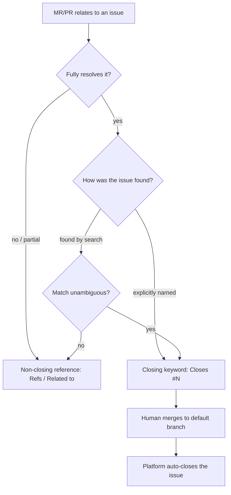

# Issue Lifecycle Rules for Agents - Plan

## Goal Capsule

- **Objective:** Add a rule block to the shared instruction core that tells every agent how to handle a GitLab/GitHub issue across a task: link it, keep progress visible, and close it on merge when the work fully resolves it.
- **Product authority:** Joosung Park (`iam@h82.dev`).
- **Open blockers:** None. The two wording details deferred to planning (RFC-2119 keyword strength per rule; the non-closing reference token) are resolved in Key Technical Decisions below.

## Product Contract

### Summary

Agents currently have no shared rule for working an issue tracker: the *Branches, commits, issues, blockers* section of `dot_agents/readonly_AGENTS.md` links, tracks, and closes nothing. This adds a tool-neutral rule block so an agent links the issue in play (named explicitly or found by a quick search), ticks the issue's task-list checkboxes as sub-tasks complete, comments only at key events, and auto-closes the issue at merge via a `Closes #N` keyword whenever an MR/PR fully resolves it.

### Problem Frame

The shared core governs branches, commits, CI, and blockers but says nothing about the issue an agent is working. Two gaps bite in practice. First, work merges without ever touching the originating issue, so issues that are done stay open and get manually reconciled later. Second, long-running work leaves the issue silent — no one can see progress without reading the branch. The one-task/one-MR rule was removed in #68, so an issue can now legitimately span several MRs, which makes both "when does it finally close" and "how is progress tracked across MRs" real questions the core does not answer.

### Key Decisions

- **Close via a merge keyword, never a direct close command.** The agent places `Closes #N` in the MR/PR body; the platform closes the issue when a human merges to the default branch. The merging human stays the gate, no separate outward action is taken, and a mistaken close is reversible by reopening. This works identically on GitHub and GitLab.
- **Writes are autonomous; only closure is gated.** Ticking checkboxes and posting event comments are low-stakes and reversible, so the agent does them without asking — consistent with the repo's autonomous-execution posture. The merge gate covers the one consequential action.
- **Checkboxes for progress, comments for events only.** Progress rides existing task-list items; comments are reserved for MR/PR opened, a blocker, and closure. This keeps the issue readable and avoids comment spam on shared trackers.
- **Link existing issues only.** The agent may search at task start and link an obvious open match, but it never creates issues and never manages labels, milestones, or assignees. Proactively helpful without taking ownership of tracker hygiene.
- **One closing gate for both named and discovered issues, guarded.** A searched match is closed on merge just like a named one — but only when the match is unambiguous and the MR fully resolves it. The guard is what prevents an over-eager search from auto-closing the wrong issue.

### Requirements

**Linking and discovery**

- R1. The workflow activates when an issue is in play: named by the user or the task prompt, carried in a plan's `origin`/issue field, or returned as an obvious open match by a quick issue search the agent runs at task start.
- R2. The agent links existing issues only. It MUST NOT create issues and MUST NOT manage labels, milestones, or assignees.

**Progress tracking**

- R3. When the linked issue has a task list, the agent ticks its checkbox items as the corresponding sub-tasks complete. It MUST NOT fabricate a checklist where the issue has none.
- R4. The agent comments on the linked issue only at key events — MR/PR opened, a blocker is hit, and closure — not on routine steps or individual pushes.

**Closing**

- R5. Closure happens only through a platform closing keyword (`Closes #N`) in the MR/PR description. The agent MUST NOT run a direct issue close or reopen command.
- R6. The agent adds the closing keyword only when the MR/PR fully resolves the issue (every acceptance criterion). For an issue found by search rather than named explicitly, it does so only when the match is unambiguous. Otherwise it uses a non-closing reference (`Refs`/`Related to`).
- R7. When an issue spans multiple MRs, only the MR that finally and fully resolves it carries the closing keyword; earlier MRs use a non-closing reference.

**Cross-platform and placement**

- R8. The rule text is tool-neutral — valid for both GitHub (`gh`) and GitLab (`glab`) — using `Closes #N` for closing and a non-closing reference form for links.
- R9. The rule lives in the existing *Branches, commits, issues, blockers* section of `dot_agents/readonly_AGENTS.md`, in the file's compact RFC-2119 prose. The four wrapper templates inherit it unchanged as verbatim includes.

#### Closing decision boundary

The gate for R5–R7 — whether a given MR/PR carries `Closes #N` or a non-closing reference:



### Key Flows

- F1. Lifecycle of a named issue.
  - **Trigger:** Task references an issue explicitly (user, prompt, or plan `origin`).
  - **Steps:** Agent links it; ticks task-list items as sub-tasks land; comments when the MR/PR opens; adds `Closes #N` to the MR/PR body once the work fully resolves it.
  - **Outcome:** Human merges to the default branch; the platform closes the issue.
  - **Covered by:** R1, R3, R4, R5, R6.
- F2. Discovered issue.
  - **Trigger:** No issue named; the agent's task-start search returns an obvious open match.
  - **Steps:** Agent links the match. If the MR fully resolves it and the match is unambiguous, it adds `Closes #N`; otherwise it adds a non-closing reference and leaves closing to a human.
  - **Outcome:** Issue closes on merge only in the unambiguous, fully-resolved case.
  - **Covered by:** R1, R6.

### Acceptance Examples

- AE1. **Named issue, fully resolved.** Task fixes `#42`; the MR resolves every criterion → MR body carries `Closes #42` → on merge, `#42` closes.
- AE2. **Discovered issue, unambiguous, fully resolved.** Search finds `#77` as an obvious match; the MR fully resolves it → `Closes #77` → on merge, `#77` closes.
- AE3. **Discovered issue, ambiguous.** Search surfaces a plausible-but-uncertain match `#80` → MR body uses `Refs #80` only → `#80` stays open for a human to close.
- AE4. **Partial fix.** The MR addresses only part of `#42` → `Refs #42` only → no auto-close.
- AE5. **Multi-MR issue.** `#42` spans two MRs → the first MR references (`Refs #42`); the second, fully-resolving MR carries `Closes #42`.
- AE6. **No direct close.** The agent never runs `gh issue close` / `glab issue close` (or reopen) — closure is always the platform acting on the merged keyword.
- AE7. **Progress ticks.** The issue has a task list and a sub-task completes → the agent ticks that checkbox with no accompanying comment.

### Scope Boundaries

- Creating an issue when none exists — the agent links only.
- Managing issue labels, milestones, or assignees.
- Verbose or per-push commenting, and any comment outside the named key events.
- Direct issue close/reopen commands, and auto-closing an ambiguous search match.
- GitLab MR discussion-thread *resolve* (a different meaning of "resolve" from closing an issue).
- Stricter local rules in the project supplement `AGENTS.md` — this change targets the shared common core.

### Dependencies / Assumptions

- Closing keywords auto-close an issue only when the MR/PR merges into the repository's **default branch**; work here targets default-branch MRs, so the behavior holds. An MR targeting a non-default branch will not auto-close, by design.
- Both GitHub and GitLab honor `Closes #N` in the PR/MR description and close the issue on merge to the default branch.
- The four wrapper templates (`dot_claude/readonly_CLAUDE.md.tmpl`, `dot_codex/readonly_AGENTS.md.tmpl`, `dot_config/opencode/readonly_AGENTS.md.tmpl`, `dot_pi/agent/private_readonly_AGENTS.md.tmpl`) are verbatim includes of the core, so editing the core propagates to every agent surface.

### Outstanding Questions

- Deferred to planning: the exact RFC-2119 keyword strength per rule (e.g. event-commenting as SHOULD vs MUST; the close mechanism as MUST plus the direct-close prohibition as MUST NOT). **Resolved in KTD1.**
- Deferred to planning: the precise non-closing reference token to standardize on (`Refs #N` reads as a plain cross-reference on both platforms; GitLab also offers `Related to #N`). **Resolved in KTD2.**

### Sources / Research

- `dot_agents/readonly_AGENTS.md` — target file; the *Branches, commits, issues, blockers* section (lines 36–42) and the adjacent completion rule "A task is complete only when every criterion is implemented and verified," which anchors R6's "fully resolves" test.
- `docs/plans/2026-07-21-003-refactor-remove-single-pr-rule-plan.md` and commit #68 — removed the one-task/one-MR rule, which is why an issue can now span multiple MRs (R7).
- `AGENTS.md` — isolated verification protocol (stub `op`, `--source "$PWD"`, throwaway destination) and the requirement that the four wrappers remain bare verbatim includes.

---

## Product Contract preservation

Product Contract unchanged. Planning added only the Planning Contract below (KTDs, Implementation Unit, Verification Contract, Definition of Done, Assumptions); it did not alter any R/A/F/AE ID or its text. The two Outstanding Questions were planning-owned wording details, now resolved in KTD1/KTD2 without changing product scope.

---

## Key Technical Decisions

- **KTD1 — RFC-2119 keyword strength (resolves Outstanding Question 1).** Use `SHOULD` for the proactive, reversible, low-stakes behaviors (linking an in-play issue, ticking existing checkboxes, commenting at key events) and `MUST NOT` for the prohibitions (creating issues; managing labels/milestones/assignees; fabricating a checklist; running a direct close/reopen; commenting on routine steps or per push). The closing keyword is expressed as an **only-when** guard — the agent adds `Closes #N` *only when* the MR/PR fully resolves the issue and (for a discovered issue) the match is unambiguous. **Rationale:** mirrors the section's existing register, where consequential/irreversible actions carry MUST/MUST NOT and helpful defaults carry SHOULD; matches the Product Contract's "writes are autonomous, only closure is gated" decision. The file header mandates literal RFC-2119 use, so SHOULD is the correct strength for a recommended-but-not-mandatory default rather than softening it into prose.

- **KTD2 — Non-closing reference token (resolves Outstanding Question 2).** Standardize on `Refs #N`. **Rationale:** it is tool-neutral (R8) — on both GitHub and GitLab `Refs` is not a closing keyword, so it creates a plain cross-reference mention without triggering auto-close on either platform. GitLab's `Related to #N` is platform-specific and is rejected to keep the rule text valid for both `gh` and `glab`. This resolves the `Refs`/`Related to` choice the Product Contract deliberately left open (R6, R7, and the closing-decision diagram's non-closing branch) down to the single tool-neutral `Refs #N` token; the Acceptance Examples (AE3–AE5) already use `Refs #N`, so the resolved rule text and the examples line up.

- **KTD3 — Placement as a dedicated paragraph, matching section-title order.** Insert the rule as one new paragraph in the *Branches, commits, issues, blockers* section between the commits paragraph (`dot_agents/readonly_AGENTS.md:40`) and the CI/completion/blockers paragraph (`dot_agents/readonly_AGENTS.md:42`). **Rationale:** the section title orders the topics *branches, commits, issues, blockers*, so issues belong after commits and before the blockers/CI paragraph; this preserves the existing prose flow and adds no new heading (R9 keeps the rule inside the existing section's compact prose).

- **KTD4 — Single tool-neutral prose block, no per-tool branching.** Author one compact RFC-2119 paragraph covering R1–R8; do not fork the text into `gh` vs `glab` variants. **Rationale:** `Closes #N` and `Refs #N` are byte-identical tokens on both platforms (R8), so a single block satisfies every requirement without platform conditionals, matching the file's tool-neutral style.

---

## Implementation Units

### U1. Add the issue-lifecycle rule block to the shared instruction core

- **Goal:** Give every agent surface a tool-neutral rule for linking, progress-tracking, and merge-closing an issue across a task, by adding one paragraph to the shared core. Because the four wrappers are verbatim includes, this single edit propagates to Claude, Codex, OpenCode, and Pi with no wrapper change.
- **Requirements:** R1, R2, R3, R4, R5, R6, R7, R8, R9 (advances all; enforces F1, F2 and AE1–AE7).
- **Dependencies:** None (KTD1–KTD4 settle the wording).
- **Files:**
  - `dot_agents/readonly_AGENTS.md` — modify: insert the issue-lifecycle paragraph into the *Branches, commits, issues, blockers* section, between the commits paragraph and the CI/blockers paragraph (per KTD3).
  - No wrapper edits — `dot_claude/readonly_CLAUDE.md.tmpl`, `dot_codex/readonly_AGENTS.md.tmpl`, `dot_config/opencode/readonly_AGENTS.md.tmpl`, `dot_pi/agent/private_readonly_AGENTS.md.tmpl` inherit the change via their existing `{{ include "dot_agents/readonly_AGENTS.md" }}` (verify only, do not touch).
- **Approach:** Append a single compact RFC-2119 paragraph. Cover, in order: activation when an issue is in play (named, or plan `origin`/issue field, or an obvious open search match) with link-only scope (R1, R2); progress via existing task-list checkboxes with the no-fabrication prohibition (R3); event-only commenting with the no-routine-spam prohibition (R4); platform-driven closure via `Closes #N` with the no-direct-close/reopen prohibition (R5); the fully-resolves + unambiguous-for-discovered gate falling back to `Refs #N` (R6); the multi-MR rule where only the final MR carries `Closes #N` (R7); and a closing note that `Closes #N`/`Refs #N` are valid on both `gh` and `glab` (R8). Keep SHOULD/MUST NOT strengths per KTD1 and the `Refs #N` token per KTD2. Do not add a new heading; keep the file's compact prose register.
- **Execution note:** This is a prose instruction change with no runtime behavior; the right proof is an isolated render of the four wrapper surfaces plus a scoped diff, not unit tests.
- **Technical design (directional — final wording is the implementer's, provided so a reviewer can validate coverage):**

  > When an issue is in play — named by the user or the task prompt, carried in a plan's `origin`/issue field, or returned as an obvious open match by a quick issue search at task start — the agent SHOULD link it and track it, but MUST NOT create issues or manage labels, milestones, or assignees. When the linked issue has a task list, the agent SHOULD tick its checkbox items as the matching sub-tasks land, but MUST NOT fabricate a checklist where the issue has none. It SHOULD comment on the issue only at key events — MR/PR opened, a blocker, and closure — never on routine steps or individual pushes. Closure is platform-driven: place a closing keyword (`Closes #N`) in the MR/PR description so the platform closes the issue when a human merges to the default branch; MUST NOT run a direct issue close or reopen. Add `Closes #N` only when the MR/PR fully resolves the issue (every acceptance criterion), and for a search-discovered issue only when the match is unambiguous; otherwise use a non-closing reference (`Refs #N`). When an issue spans multiple MRs, only the final, fully-resolving MR carries `Closes #N`; earlier MRs use `Refs #N`. `Closes #N`/`Refs #N` are valid on both GitHub (`gh`) and GitLab (`glab`).

- **Patterns to follow:** Match the register and density of the surrounding paragraphs in the *Branches, commits, issues, blockers* section (`dot_agents/readonly_AGENTS.md:38`, `:40`, `:42`) — compact, imperative, RFC-2119, inline code for literal tokens, no bullet list.
- **Test scenarios:** `Test expectation: none — prose instruction change with no executable behavior.` Coverage is proven by the Verification Contract below (isolated render of the four wrapper surfaces showing the block verbatim, plus scoped diff and attribute checks). Requirement-to-text mapping for reviewer confirmation:
  - Covers R1, R2 — the activation-and-link-only clause; link SHOULD, create/labels/milestones/assignees MUST NOT.
  - Covers R3 — checkbox-ticking clause with the no-fabrication MUST NOT.
  - Covers R4 — event-only commenting with the routine/per-push MUST NOT.
  - Covers R5 / AE6 — `Closes #N` in the MR/PR body as the only closure path; direct close/reopen MUST NOT.
  - Covers R6 / AE1–AE4 — fully-resolves gate, unambiguous-for-discovered gate, `Refs #N` fallback.
  - Covers R7 / AE5 — multi-MR clause: only the final fully-resolving MR carries `Closes #N`.
  - Covers R8 — closing note that both tokens are valid on `gh` and `glab`.
- **Verification:** The paragraph is present in `dot_agents/readonly_AGENTS.md` within the correct section and position; each of the four wrapper templates renders the paragraph verbatim in an isolated `chezmoi execute-template` run; `git diff --check` is clean; the diff is limited to `dot_agents/readonly_AGENTS.md` and this plan doc.

---

## Verification Contract

Isolated verification only — never render into the live `$HOME`. Use the project's per-user scratch protocol (stub `op`, empty config, throwaway destination, `--source "$PWD"`), per `AGENTS.md`.

- **VC1 — Wrapper propagation (primary proof).** Render each of the four wrapper templates in isolation and confirm the new issue-lifecycle paragraph appears verbatim in every one:
  - `dot_claude/readonly_CLAUDE.md.tmpl`
  - `dot_codex/readonly_AGENTS.md.tmpl`
  - `dot_config/opencode/readonly_AGENTS.md.tmpl`
  - `dot_pi/agent/private_readonly_AGENTS.md.tmpl`

  Use the isolated render harness from `AGENTS.md`:

  ```sh
  scratch="$HOME/.cache/agent-scratch/chezmoi-op-stub"
  mkdir -p "$scratch/bin" "$scratch/target"
  : > "$scratch/empty.toml"
  printf '#!/usr/bin/env bash\ncase "${1-}" in whoami) printf dummy@example.invalid;; *) printf dummy-secret;; esac\n' > "$scratch/bin/op"
  chmod 700 "$scratch/bin/op"
  env PATH="$scratch/bin:$PATH" chezmoi --config "$scratch/empty.toml" --source "$PWD" --destination "$scratch/target" execute-template < dot_claude/readonly_CLAUDE.md.tmpl
  # repeat for the other three wrapper templates
  ```

  Expected: each render includes the paragraph, and the render exits without a template error (proves the include still resolves).
- **VC2 — No side edits.** Confirm no wrapper template was modified (the four `.tmpl` files are byte-identical to their committed form) and that `dot_agents/readonly_AGENTS.md` keeps its `readonly_` source prefix (0444 target attribute unchanged).
- **VC3 — Repo mirror invariant.** `CLAUDE.md` remains exactly `@AGENTS.md`; the root wrappers remain bare one-line includes (this change does not touch them — confirm, don't edit).
- **VC4 — Clean, scoped diff.** `git diff --check` reports no whitespace errors; `git status` and the diff are limited to `dot_agents/readonly_AGENTS.md` and this plan doc (`docs/plans/2026-07-21-004-docs-issue-lifecycle-rules-plan.md`).
- **VC5 — CI.** After the push opens the MR/PR, both `render-dotfiles.yml` and `ci.yml` reach terminal green via a single native blocking watcher.

---

## Definition of Done

- The issue-lifecycle paragraph is present in the *Branches, commits, issues, blockers* section of `dot_agents/readonly_AGENTS.md`, positioned per KTD3, covering R1–R8 with the KTD1 keyword strengths and the KTD2 `Refs #N` token.
- VC1 passes: all four wrapper renders include the paragraph verbatim with no template error.
- VC2–VC4 pass: no wrapper or mirror drift, attributes intact, `git diff --check` clean, diff scoped to the target file and this plan doc.
- This plan doc and the target-file edit ship together in a **single MR** (per the "include all current changes into MR as well" directive) — no separate branches or stacked MRs.
- VC5: CI (`render-dotfiles.yml` and `ci.yml`) is terminal green before the task is considered complete.

---

## Assumptions

- **Headless resolution of deferred wording (KTD1/KTD2).** In pipeline mode there is no user to confirm the two Outstanding Questions, so they are resolved to the recommended defaults recorded in KTD1 (SHOULD/MUST NOT split) and KTD2 (`Refs #N`). Both defaults align with the Product Contract's existing diagram and Acceptance Examples; if the product authority prefers a stronger register (e.g. link/tick as MUST) or a different token, that is a one-line wording change to U1's paragraph.
- **Default-branch closure holds (carried from Product Contract).** `Closes #N` auto-closes only on merge to the default branch; the repo's MRs target the default branch, so the rule's closure behavior is valid as written. Non-default-branch MRs will not auto-close, by design — the rule does not need to special-case them.
- **Single-MR shipping.** The "include all current changes into MR as well" directive means the untracked plan doc and the target-file edit are committed and shipped in one MR; there are no other pending working-tree changes to fold in (confirmed: `git status` showed only the plan doc untracked at plan time).
