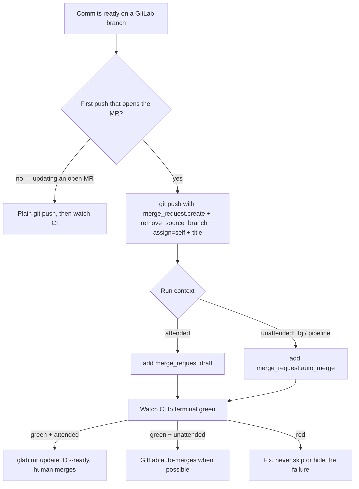

# GitLab Push-Option MR Creation - Plan

## Goal Capsule

- **Objective:** Update `dot_agents/readonly_AGENTS.md` so agents open a GitLab merge request in a single push — branch push and MR creation together via GitLab merge-request push options — replacing the current `git push` → `glab mr create` two-step. Attended runs open a draft and flip to ready after CI; unattended runs auto-merge. Self-assignment to the authenticated user is unified across the MR and the linked issue.
- **Product authority:** repo owner (iam@h82.dev).
- **Open blockers:** None. Placement and wording resolved in this plan (see Resolved Outstanding Questions).

## Product Contract

### Summary

Add a GitLab rule to the common agent instructions: when opening a new MR on a GitLab remote, create it in the same `git push` using merge-request push options instead of a separate `glab mr create` call. The push always self-assigns the authenticated user and removes the source branch on merge. Attended work opens a draft and marks it ready once CI is green; unattended work (the `lfg` skill and other pipeline contexts) opens with auto-merge so GitLab merges on green when possible. The same self-assignment applies to the linked issue, which narrows — but does not remove — the existing prohibition on managing issue assignees.

### Problem Frame

Today the workflow to ship a GitLab branch is two discrete steps: push the branch, then run `glab mr create` (or `gh pr create` on GitHub). GitLab supports collapsing those into one `git push -o merge_request.create ...`, but the agent instructions don't tell agents to use it, so they default to the slower two-step path and hand-drive MR metadata (assignee, source-branch cleanup, draft state) inconsistently. GitLab merge-request push options can set all of that at push time, and the draft / auto-merge options let one rule express both the human-reviewed and the fully-unattended completion paths.

### Key Decisions

- **Draft for attended, auto-merge for unattended.** Human-in-the-loop runs open the MR as a draft and flip to ready only after CI is green, keeping a human as the merger. Unattended runs (e.g. `lfg`) instead set `merge_request.auto_merge`, so the MR merges itself on green without waiting for a person. The two modes are mutually exclusive — draft MRs can't auto-merge.
- **Push options preferred, `glab mr create` retained as fallback.** The one-step push is the default for the *opening* push. `glab mr create` stays for the cases push options can't express: a rich / multi-line MR body, or any update to an already-open MR.
- **Self-assignment unified across MR and linked issue.** The authenticated user is assigned to both the MR and, when an issue is in play, the issue. This deliberately carves a self-only exception into the issue-lifecycle rule's "MUST NOT manage assignees" clause.
- **GitLab-only.** Push options are a GitLab feature; GitHub has no equivalent, so the GitHub `gh pr create` two-step is untouched.

### Requirements

**One-step MR creation on GitLab**

- R1. On a GitLab remote, the branch's first push that opens a merge request MUST create the MR in that same push via merge-request push options, replacing the separate `push` → `glab mr create` two-step. This applies only to the opening push; later updating pushes to an existing MR do not re-create it.
- R2. Every push-created MR MUST include `-o merge_request.create`, `-o merge_request.remove_source_branch`, `-o merge_request.assign=<authenticated user>`, and `-o merge_request.title=...`. Set `-o merge_request.target=<branch>` only when the target is not the project's default branch. Set `-o merge_request.description=...` (including any `Closes #N` / `Refs #N` keyword the issue-lifecycle rule requires) when the body fits a single push-option value.

**Attended vs unattended completion**

- R3. Attended (human-in-the-loop) runs MUST open the MR as a draft (`-o merge_request.draft`) and, after the CI-watch obligation reports terminal green, mark it ready with `glab mr update <id> --ready`. A human performs the merge.
- R4. Unattended runs — the `lfg` skill or any `disable-model-invocation` pipeline context — MUST open the MR with `-o merge_request.auto_merge` instead of draft, so GitLab merges it once the pipeline succeeds and merge is possible. When auto-merge is not possible (no pipeline, required approvals, conflicts), the MR is left open for resolution; the agent MUST NOT force a merge.
- R5. The existing CI-watch obligation is unchanged and gates completion: after the opening push, wait for terminal green CI with one native blocking watcher before flipping a draft to ready (R3) or treating an unattended auto-merge (R4) as done. A red pipeline is fixed, never skipped or hidden.

**Self-assignment (MR and linked issue)**

- R6. Self-assignment to the authenticated user MUST apply to both the MR (R2) and, when an issue is in play, the linked issue — assigned additively via `glab issue update <id> --assignee +<authenticated user>` so any existing assignees are preserved.
- R7. R6 narrows the issue-lifecycle assignee prohibition to a self-only exception: self-assigning the linked issue to the authenticated user is now required; managing other people's assignees, managing labels and milestones, and creating issues remain prohibited.
- R8. The authenticated username MUST be resolved before assignment (e.g. `glab api user` → `.username`). `@me` is documented only for `glab ... list --assignee` filters and MUST NOT be assumed to work in push options or `--assignee` writes.

**Fallback and platform scope**

- R9. `glab mr create` remains the fallback when push options cannot express the need — a multi-line or otherwise rich MR body, or any update to an already-open MR. Prefer push options for the opening push and fall back only when they don't fit.
- R10. GitHub is unchanged: it has no push-option equivalent, so `gh pr create` (optionally `--draft`) stays a separate step after `git push`. This change is GitLab-only.

### Flow

### Acceptance Examples

- AE1. Attended run, issue in play.
  - **Given:** an authenticated agent on a GitLab branch with commits, working an issue `#42`, running interactively.
  - **When:** it opens the MR.
  - **Then:** one `git push -o merge_request.create -o merge_request.remove_source_branch -o merge_request.assign=<user> -o merge_request.title=... -o merge_request.draft` creates a draft MR assigned to the authenticated user; issue `#42` is self-assigned additively; the agent watches CI to green, then runs `glab mr update <id> --ready`; a human merges. Covers R1–R3, R5–R8.
- AE2. Unattended `lfg` run.
  - **Given:** the same branch under the `lfg` skill (unattended).
  - **When:** it opens the MR.
  - **Then:** the push uses `-o merge_request.auto_merge` instead of `-o merge_request.draft`; after CI passes GitLab auto-merges when possible, and if auto-merge is not possible the MR is left open without a forced merge. Covers R1, R2, R4, R5.
- AE3. Rich body needed.
  - **Given:** a multi-line MR body containing `Closes #N` and additional context that a single push-option value can't cleanly carry.
  - **When:** the agent opens the MR.
  - **Then:** it falls back to `glab mr create` for that MR rather than forcing the body through `-o merge_request.description`. Covers R9.

### Scope Boundaries

- **Outside this change's identity:** the GitHub flow. `gh pr create` (optionally `--draft`) stays a separate post-push step; GitHub has no push-option equivalent.
- **Not extended:** the auto-merge path is unattended-only. Attended runs keep the draft → human-merge model; this change does not auto-merge human-driven work.
- **Unchanged rules:** branch naming / rename, the CI-watch watcher itself, and issue closure via `Closes #N` in the MR description are untouched except for the two explicit interactions noted (assignee carve-out; auto-merge relaxing "a human merges" for unattended runs).

### Deferred to Follow-Up Work

- None. The change is fully contained in the two edits below; no adjacent cleanup is pulled in.

### Dependencies / Assumptions

- Assumes the target GitLab project has merge-request push options available (creation, draft, auto_merge, assign, remove_source_branch are all current GitLab push options).
- Assumes `glab` is authenticated via its native store, so `glab api user` and `glab mr/issue update` succeed without passing credentials to a non-native tool.
- Assumes the remote is detected as GitLab (by remote host) before the rule applies; non-GitLab remotes fall through to their existing flow.
- The edit lands in `dot_agents/readonly_AGENTS.md` (the common instruction core). Its `CLAUDE.md` mirror stays exactly `@AGENTS.md` and needs no change.

### Sources / Research

- GitLab merge-request push options reference: `https://gitlab.com/gitlab-org/gitlab/-/raw/master/doc/topics/git/commit.md` — confirms `merge_request.create`, `target`, `title`, `description`, `draft`, `assign`, `remove_source_branch`, `squash`, `auto_merge` (and that `merge_when_pipeline_succeeds` is deprecated in favor of `auto_merge`).
- Verified `glab` commands: `glab mr update <id> --ready` / `--draft` flip draft state; `glab mr create` supports `--assignee`, `--remove-source-branch`, `--target-branch`, `--draft`, `--push`; `glab issue update <id> --assignee +<user>` adds an assignee without replacing existing ones; `@me` is documented only for `--assignee` list filters.
- Interacting instruction rules in `dot_agents/readonly_AGENTS.md`: the issue-lifecycle paragraph ("MUST NOT ... manage ... assignees"; `Closes #N` in the MR description; human merges) and the CI-watch paragraph (native blocking watcher after every push).

---

## Planning Contract

### Product Contract preservation

Product Contract unchanged. Enrichment adds the Planning Contract, Implementation Units, Verification Contract, and Definition of Done below; it preserves every R-ID and AE-ID and their text verbatim, and resolves the two planning-deferred Outstanding Questions in place (placement and root-supplement scope) without altering product scope.

### Key Technical Decisions

- **KTD1 — Split placement across the two interacting sections.** The self-assignment carve-out edits the issue-lifecycle paragraph inside `## Branches, commits, issues, blockers` (the paragraph that literally says "MUST NOT create issues or manage labels, milestones, or assignees"); the GitLab push-option mechanics are added to `## JavaScript, mise, and GitLab` (which already owns `glab` mechanics). Rationale: each rule lives next to the rule it modifies, so the carve-out physically narrows the prohibition sentence it interacts with, and the mechanics sit with existing `glab` guidance. *Alternative considered:* one consolidated block in the GitLab section. Rejected — the assignee carve-out has to modify the prohibition sentence anyway to avoid a self-contradiction between two sections, so consolidation would still leave a split or would duplicate the prohibition.
- **KTD2 — No root `AGENTS.md` supplement change (resolves Outstanding Question 2).** The dotfiles repo's own remote is GitHub (`origin` → `github.com/hyperlapse122/dotfiles`), and the root supplement's "Repository delivery" rules are GitHub-based (watch `ci.yml` and `render-dotfiles.yml`). The new rule is GitLab-only, so it does not govern this repo's own delivery and the common core alone carries it. The supplement stays untouched.
- **KTD3 — Resolve the authenticated username before assignment; `@me` is list-filter-only (R8).** The rule must instruct agents to resolve the username (e.g. `glab api user` → `.username`) before writing `merge_request.assign=` or `--assignee`, and must explicitly note `@me` only works in `list --assignee` filters. This prevents a silently-failing assignment write.
- **KTD4 — Verification is RFC-2119 prose review + CI, not a unit-test suite.** The target is a non-templated instruction file (`readonly_AGENTS.md`, copied verbatim at 0444) with no executable behavior. Correctness = internal consistency with the existing issue-closure, CI-watch, and branch rules, plus green `ci.yml` / `render-dotfiles.yml`. There is no code path to unit-test.

### Resolved Outstanding Questions

- **Placement (was "deferred to planning").** Resolved to KTD1: split — carve-out in `## Branches, commits, issues, blockers`, mechanics in `## JavaScript, mise, and GitLab`.
- **Root `AGENTS.md` supplement adjustment (was "deferred to planning").** Resolved to KTD2: no change; the common core alone carries the GitLab-only rule, and this repo delivers via GitHub.

### Assumptions

Resolved in headless/pipeline mode without a confirmation gate (recorded here per the planning contract):

- Split placement (KTD1) was chosen without user confirmation; a single-section consolidation is the fallback if the owner prefers it.
- The root `AGENTS.md` supplement is left untouched (KTD2).
- Per the run instruction "include all current changes to PR as well," this enriched plan document is committed into the same PR as the instruction-file edit.
- The current branch `sicilians` is a non-descriptive, worktree-derived name and is absent from the remote; it is renamed in place to a work-descriptive `docs/` Git-Flow slug before the first push (see Delivery Notes).

---

## Implementation Units

### U1. Narrow the issue-lifecycle assignee prohibition (self-assign carve-out)

- **Goal:** Carve a self-only exception into the issue-lifecycle assignee prohibition so self-assigning the authenticated user to the MR and (when an issue is in play) additively to the linked issue is required, while every other assignee/label/milestone/creation prohibition stays intact.
- **Requirements:** R6, R7, R8.
- **Dependencies:** None (edit is independent of U2, but the two are a single coherent change and may land in one commit).
- **Files:** `dot_agents/readonly_AGENTS.md` — the issue-lifecycle paragraph in `## Branches, commits, issues, blockers` (the sentence "MUST NOT create issues or manage labels, milestones, or assignees").
- **Approach:** Rewrite the prohibition clause to read as a self-only carve-out: the agent MUST self-assign the authenticated user to the MR/PR and, when an issue is in play, additively self-assign that user to the linked issue via `glab issue update <id> --assignee +<user>` (the `+` preserves existing assignees); creating issues and managing labels, milestones, and *other people's* assignees remain prohibited. State that the authenticated username MUST be resolved first (e.g. `glab api user` → `.username`) and that `@me` is only valid in `list --assignee` filters, never in `--assignee` writes or push options (R8). Keep the surrounding closure/`Closes #N` and task-list-ticking sentences unchanged. Use RFC-2119 terms literally to match the file's register.
- **Execution note:** Prose edit to a shared instruction contract — read the full paragraph first and preserve the existing clause order; the carve-out must not weaken the closure-keyword or "comment only at key events" rules.
- **Patterns to follow:** The existing RFC-2119 clause style in the same paragraph (line-42 issue-lifecycle prose) and the "self-only exception" framing already used in the Product Contract's Key Decisions.
- **Test scenarios:** `Test expectation: none — prose edit to a non-executable instruction file.` Verified by the Verification Contract's prose-consistency review (no contradiction with the closure/CI-watch/branch clauses) and CI, not by unit tests.
- **Verification:** The edited paragraph still prohibits creating issues and managing labels/milestones/other assignees; it now requires self-assignment of the MR and linked issue additively; it names the username-resolution step and the `@me` limitation; it reads as one coherent RFC-2119 paragraph.

### U2. Add the GitLab merge-request push-option rule

- **Goal:** Add the one-step GitLab MR-creation rule to the GitLab section: opening push creates the MR via push options with the required metadata, attended draft vs unattended auto-merge, CI-watch gating, `glab mr create` fallback, and GitHub left unchanged.
- **Requirements:** R1, R2, R3, R4, R5, R8, R9, R10.
- **Dependencies:** Conceptually pairs with U1 (self-assign carve-out); no ordering constraint.
- **Files:** `dot_agents/readonly_AGENTS.md` — append to `## JavaScript, mise, and GitLab`, after the existing `glab` guidance sentence ("Pass GitLab paths to `glab` with slashes intact; prefer `:fullpath`.").
- **Approach:** Add a GitLab MR paragraph stating: on a GitLab remote, the *opening* push that creates an MR MUST use merge-request push options in the same `git push` instead of `push` → `glab mr create` (R1). Required options: `-o merge_request.create -o merge_request.remove_source_branch -o merge_request.assign=<authenticated user> -o merge_request.title=...`; add `-o merge_request.target=<branch>` only when the target is not the default branch; add `-o merge_request.description=...` (carrying any `Closes #N` / `Refs #N`) when the body fits one push-option value (R2). Attended runs add `-o merge_request.draft` and, after the existing CI-watch reports terminal green, run `glab mr update <id> --ready`; a human merges (R3). Unattended runs — `lfg` or any `disable-model-invocation` pipeline — add `-o merge_request.auto_merge` instead of draft (mutually exclusive with draft); GitLab merges on green when possible, and when it can't (no pipeline, required approvals, conflicts) the MR is left open and the agent MUST NOT force a merge (R4). Cross-reference the existing CI-watch obligation as the completion gate rather than restating it (R5). `glab mr create` stays the fallback for a rich/multi-line body or any update to an already-open MR; later updating pushes to an open MR are plain `git push` (R9). Close with: GitHub is unchanged — `gh pr create` (optionally `--draft`) stays a separate post-push step (R10). Reference the resolved-username / `@me` caveat once (R8) or defer to U1's statement of it.
- **Execution note:** Keep the mechanics paragraph tight and reference — don't duplicate — the CI-watch rule (in `## Branches, commits, issues, blockers`) and the self-assign carve-out (U1), so the file has one source of truth per obligation.
- **Patterns to follow:** The existing terse `glab` sentence in the same section and the RFC-2119 command-option style used elsewhere in the file (e.g. the git-flag prohibitions in `## Secrets, destructive actions, and runtime`).
- **Test scenarios:** `Test expectation: none — prose edit to a non-executable instruction file.` The behavioral shape is already captured by the Flow mermaid and Acceptance Examples AE1–AE3; verification is prose-consistency review + CI.
- **Verification:** The new paragraph expresses R1–R5, R8–R10; draft and auto-merge are mutually exclusive and correctly split attended vs unattended; the required `-o` options and conditional `target`/`description` options are listed; the CI-watch gate and self-assign carve-out are referenced (not duplicated); GitHub is explicitly untouched. Every Acceptance Example (AE1–AE3) is satisfiable by following the paragraph plus U1.

---

## Verification Contract

- **Prose / RFC-2119 consistency review.** Confirm the two edits use MUST/SHOULD/MUST NOT literally and do not contradict the existing rules they touch — issue closure (`Closes #N`, no direct close), the CI-watch watcher, branch naming/rename, and the "comment only at key events" rule. Confirm draft and auto-merge are never both applied to one MR.
- **Requirements trace.** Confirm R1–R10 are each reflected: R1/R2/R9/R10 and R3–R5 in U2; R6/R7 in U1; R8 in U1 (and referenced by U2). Confirm AE1–AE3 are satisfiable by following the edited file.
- **Non-template integrity.** `dot_agents/readonly_AGENTS.md` is a verbatim-copied file (no `.tmpl`); confirm no Go-template syntax was introduced and the markdown stays well-formed.
- **Mirror / ignore unchanged.** Confirm the `@AGENTS.md` CLAUDE.md mirror needs no change (only prose content changed, no AGENTS.md file added/moved) and that `.chezmoiignore` still ignores only the root `./AGENTS.md`, not this target.
- **Isolated chezmoi check (per repo AGENTS.md).** Run a source-scoped diff limited to this file — since the target is not a template, `chezmoi diff --source "$PWD"` (or `git diff --check` on the source) is sufficient; no `chezmoi execute-template` render is needed. Disclose that the file is copied verbatim, so there are no onchange side effects for this edit.
- **CI.** After the push, watch both `ci.yml` and `render-dotfiles.yml` to terminal green with one native blocking watcher; a red run is fixed, never skipped.

---

## Definition of Done

- Both edits are present in `dot_agents/readonly_AGENTS.md`: the self-assign carve-out (U1) in `## Branches, commits, issues, blockers`, and the GitLab MR push-option rule (U2) in `## JavaScript, mise, and GitLab`.
- Requirements R1–R10 are all reflected, and AE1–AE3 are satisfiable by following the edited file.
- The root `AGENTS.md` supplement is unchanged (KTD2); the `@AGENTS.md` mirror and `.chezmoiignore` are unchanged.
- `git diff --check` is clean and the change is scoped to `dot_agents/readonly_AGENTS.md` plus this plan document.
- Per "include all current changes to PR as well," this enriched plan doc is committed into the same PR.
- The branch is renamed from the non-descriptive `sicilians` to a work-descriptive `docs/` Git-Flow slug before the first push (it is absent from the remote, so in-place rename is allowed and required).
- The PR is opened on GitHub, and `ci.yml` + `render-dotfiles.yml` are terminal green.

---

## Delivery Notes

- **Repo delivers via GitHub.** `origin` is `github.com/hyperlapse122/dotfiles`, so this PR uses `gh`; the new GitLab-only rule does not apply to this repo's own delivery. Watch `ci.yml` and `render-dotfiles.yml` (root supplement rule).
- **Branch rename before first push.** `sicilians` is a worktree/session-derived placeholder that does not describe the work and is absent from the remote. Per the common branch rule, rename it in place to a descriptive `docs/` slug (e.g. `docs/gitlab-push-option-mr-rule`) before the first push; do not push the non-descriptive name.
- **Plan doc in the PR.** The only pre-existing working-tree change was this (previously untracked) plan file; committing it satisfies the "include all current changes" instruction. No other tracked changes exist on the branch.
