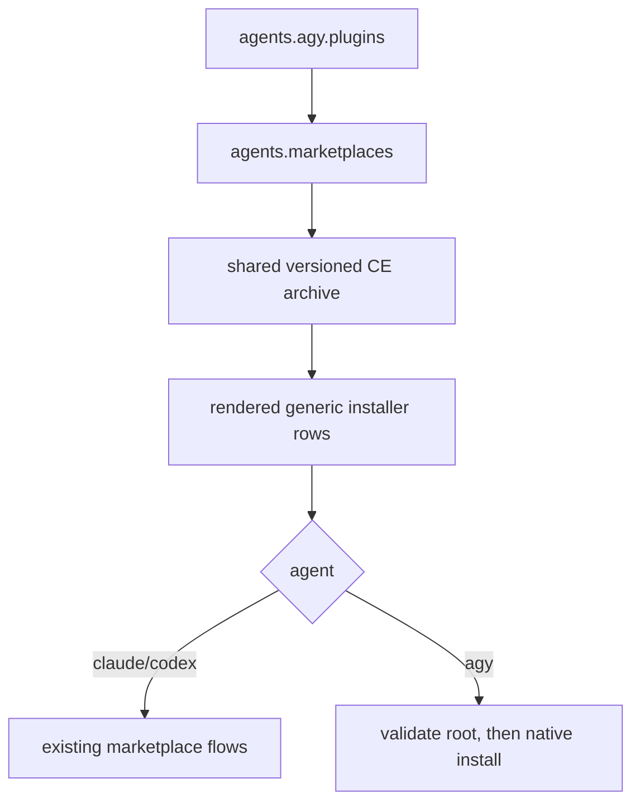

# Manage AGY Plugins from agents.yaml - Plan

## Goal Capsule

- **Objective:** Make Antigravity CLI (`agy`) plugins data-driven from `.chezmoidata/agents.yaml`, matching the repository's other agent surfaces, and install Compound Engineering as AGY's first managed native plugin.
- **Authority:** The user's request and upstream Compound Engineering `.agy/INSTALL.md`, constrained by this repository's single-source and chezmoi lifecycle rules.
- **Stop conditions:** Stop shipping if isolated verification cannot install the extracted release root, if the pinned upstream release artifact itself lacks root `plugin.json` or `skills/`, or if Claude/Codex/Pi/OpenCode behavior changes unexpectedly. At apply time, missing or invalid extracted state remains a per-row warning and continue.
- **Execution profile:** Data and rendered-shell changes only; verify in isolated scratch destinations without applying to live `$HOME`.
- **Open blockers:** None. AGY plugin management remains POSIX-only because the existing Compound Engineering archive lifecycle is POSIX-only; Windows expansion is outside this change.

---

## Product Contract

### Summary

Add an `agents.agy.plugins` list to `.chezmoidata/agents.yaml`, extend the shared agent-plugin installer to consume it, and install Compound Engineering's repository root through `agy plugin install`. The AGY consumer reuses the same pinned, versioned local archive already shared by Claude, Codex, and OpenCode.

### Problem Frame

The repository already provisions the `agy` executable, but AGY has no managed plugin surface. Claude, Codex, Pi, and OpenCode plugin/package declarations are owned by `.chezmoidata/agents.yaml`; leaving AGY manual would create a configuration exception and let Compound Engineering drift from the shared release used by the other pinned consumers.

### Requirements

- R1. `.chezmoidata/agents.yaml` owns AGY plugin membership under `agents.agy.plugins`, using the existing `{name, marketplace}` declaration shape.
- R2. AGY includes `compound-engineering`, referencing `agents.marketplaces.compound-engineering-plugin` without copying a repository URL, version, or local path.
- R3. The generic agent-plugin installer renders and processes AGY rows in addition to Claude and Codex rows.
- R4. AGY installs the resolved Compound Engineering archive root with `agy plugin install <path>`; it does not use the compatibility `.agy/` entry point or the unpinned remote URL.
- R5. AGY operational failures are soft per row: a missing CLI, absent or invalid archive, validation failure, or install failure warns and continues without blocking other agents. Recovery is an explicit `chezmoi apply --force` after correcting the runtime condition because a clean onchange skip is not automatically retried.
- R6. Existing render-time name/source/gate validation and Linux/macOS/container behavior remain intact; Compound Engineering remains available in real containers.
- R7. Claude, Codex, Pi, and OpenCode configuration and installation behavior remain unchanged.
- R8. Repository and CI documentation describe AGY as a managed Compound Engineering consumer and prove the rendered AGY row/command.

### Acceptance Examples

- AE1. On Linux, the rendered installer contains the existing Claude/Codex rows plus an AGY Compound Engineering row pointing at the same `~/.local/share/compound-engineering/v<release>` root.
- AE2. On macOS, the AGY Compound Engineering row is rendered; on Windows, this POSIX installer remains absent.
- AE3. In a real container, the AGY Compound Engineering row remains while the Linux-only haptic plugin remains filtered out.
- AE4. With a stub `agy`, the installer calls `agy plugin install <archive-root>` and then `agy plugin validate <archive-root>`; a failure warns and does not prevent later rows from running.
- AE5. An invalid AGY entry fails at render time with the same clear validation contract as invalid Claude/Codex entries.

### Scope Boundaries

- Do not add AGY settings, global context files, MCP configuration, or authentication.
- Do not use the upstream remote-URL install path because it follows upstream rather than this repository's shared release pin.
- Do not expand the Compound Engineering external/archive lifecycle to Windows.
- Do not change Pi's deliberate native `git:` package or OpenCode's local-archive configuration.

### Source

- Upstream contract: `https://raw.githubusercontent.com/EveryInc/compound-engineering-plugin/refs/heads/main/.agy/INSTALL.md` (fetched 2026-07-21). The repository root is the native bundle; local checkout installation is the documented pinned-release path; `.agy/` is compatibility-only.

---

## Planning Contract

### Key Technical Decisions

- KTD1. **Reuse the existing per-agent plugin declaration.** Add `agents.agy.plugins` rather than inventing a second AGY-only registry. The `marketplace` field acts as a shared source reference; AGY does not register a marketplace at runtime.
- KTD2. **Install the shared pinned archive root.** Resolve `localArchive` through the existing `agents.opencode.plugins` Compound Engineering entry and `compound-engineering-ref.tmpl`, then pass that root to AGY. This is the upstream-documented local-checkout path and keeps pinned consumers aligned.
- KTD3. **Dispatch native verbs per agent.** Preserve Claude/Codex marketplace flows exactly; AGY uses the upstream-documented `plugin install` on the path and then `plugin validate` on that same path, and never receives a `plugin@marketplace` identifier. The actual pinned CLI must prove this order in an isolated HOME before it becomes installer behavior.
- KTD4. **Keep AGY failures soft after render-time validation.** Invalid source data aborts rendering; missing runtime state only warns inside the per-row path, including failed root-manifest checks. This preserves the current non-blocking onchange installer contract. A skipped install retries only after a content/ref change or explicit `chezmoi apply --force`; automatic convergence after transient failure is not promised by this repository's existing agent-plugin lifecycle.
- KTD5. **Keep the feature POSIX-scoped.** The shared extracted Compound Engineering archive and installer are currently Linux/macOS-only. Windows plugin lifecycle work is a separate cross-platform expansion.

### High-Level Design

### Assumptions

- The extracted release root contains `plugin.json` and `skills/`, as produced by the existing external's one-component strip.
- Reinstalling the same local bundle is safe and installing a distinguishable newer bundle replaces the staged plugin content. Verification must exercise both same-version repetition and an A-to-B upgrade in an isolated HOME before shipping; if native install does not update, implementation must stop and choose a non-destructive update strategy rather than adding uninstall-first behavior speculatively.

### Sequencing

U1 data ownership precedes U2 installer support. U3 adds durable CI assertions and documentation after the runtime shape is known.

---

## Implementation Units

### U1. Declare AGY plugin membership

- **Goal:** Make AGY plugin membership part of the agents data source.
- **Requirements:** R1, R2, R6.
- **Files:** `.chezmoidata/agents.yaml`.
- **Approach:** Update the consumer/schema comments to include AGY and add `agents.agy.plugins` with Compound Engineering referencing the existing marketplace/source entry. Preserve all other agent keys.
- **Patterns:** `agents.claude.plugins`, `agents.codex.plugins`, and the shared `agents.marketplaces` map in the same file.
- **Test scenarios:** The YAML parses; the installer render discovers exactly one AGY row; malformed AGY names or marketplace references fail with an entry-specific message.

### U2. Extend the generic plugin installer for AGY

- **Goal:** Install AGY's declared plugins through its native CLI without altering existing agent behavior.
- **Requirements:** R3-R7.
- **Files:** `.chezmoiscripts/70-agents/run_onchange_after_install-agent-plugins.sh.tmpl`, `.chezmoitemplates/compound-engineering-ref.tmpl`, `.chezmoiexternals/ai-agents.toml` (consumer comments only where needed).
- **Approach:** Include `agy` in the validated agent iteration; keep shared path resolution and host gating; add AGY-specific runtime dispatch that checks the archive root has `plugin.json` and `skills/` inside per-row soft-skip logic, installs the root, and validates it through the installed CLI. Preserve row isolation, warnings, and Claude/Codex commands byte-for-byte where practical.
- **Test scenarios:** Linux, macOS, and container renders emit the expected AGY row; a stub records install/validate arguments in order; missing CLI/path/manifest and nonzero commands warn and continue; a repeated isolated install succeeds without uninstall; installing distinguishable bundle A then B proves the staged content and plugin listing reflect B; rendered Bash passes `bash -n` and ShellCheck.

### U3. Add regression assertions and update ownership documentation

- **Goal:** Make AGY plugin management durable and discoverable.
- **Requirements:** R8 and regression protection for R6-R7.
- **Files:** `.github/workflows/render-dotfiles.yml`, `AGENTS.md`.
- **Approach:** Add focused assertions against rendered installer content for the AGY Compound Engineering row and native path command while retaining existing cross-platform render coverage. Update the agent/plugin ownership, Compound Engineering consumer, container, and single-source sections. Keep `CLAUDE.md` exactly `@AGENTS.md`.
- **Test scenarios:** CI assertions pass on supported POSIX matrices and do not expect an AGY plugin installer on Windows; searches find no stale Claude/Codex-only ownership claims; unrelated rendered agent targets remain unchanged.

---

## Verification Contract

- Render every changed template/script with a stub `op`, empty config, throwaway destination, and `--source "$PWD"`; never deploy live `$HOME`.
- Run focused stubbed installer scenarios for success, command order, missing AGY, missing/invalid archive, validation failure, and install failure; use the actual pinned AGY binary with isolated HOME for same-version repetition and a distinguishable A-to-B upgrade.
- Run `bash -n` and ShellCheck on the rendered installer.
- Compare unaffected rendered OpenCode, Pi, and dotagents targets against the base branch; disclose that `chezmoi archive --exclude=encrypted,externals,scripts` omits scripts and compare rendered scripts separately.
- Run the repository's CI-equivalent checks, `git diff --check`, scoped `git diff`, `git status`, and verify `CLAUDE.md` is exactly `@AGENTS.md`.
- After push, watch both `render-dotfiles.yml` and `ci.yml` to terminal success.

---

## Definition of Done

- `agents.agy.plugins` is the sole AGY plugin membership source and contains Compound Engineering.
- AGY installs the same pinned Compound Engineering release root used by the existing local-archive consumers.
- Linux, macOS, and container renders satisfy AE1-AE3; stubbed runtime scenarios satisfy AE4; invalid data satisfies AE5.
- Claude, Codex, Pi, and OpenCode behavior is unchanged, and no live-home apply occurred.
- Documentation, focused CI assertions, repository checks, PR review, and both required workflows are green.
