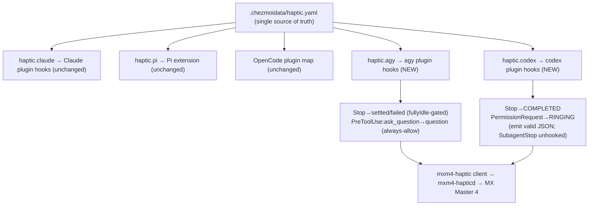

# mxm4-haptic for agy and codex - Plan

## Goal Capsule

- **Objective:** Extend the existing `mxm4-haptic` system to Antigravity CLI (`agy`) and OpenAI Codex (`codex`) so the MX Master 4 buzzes on their lifecycle events, mirroring the Claude Code / Pi / OpenCode integrations and reusing the same daemon, waveform vocabulary, and `haptic.yaml` data model.
- **Authority:** The user's request and the confirmed brainstorm scope, as corrected during planning (see preservation note), constrained by this repository's single-source (`haptic.yaml`), chezmoi lifecycle, agent-surface ownership, and the verified capabilities of the installed `agy` 1.1.5 and `codex` 0.144.6.
- **Product Contract preservation:** Changed **R8 → R10** (codex). The brainstorm capped codex at "settled-only via `notify`" on the false premise that `notify` (turn-complete) was its only event surface. Planning verified codex has a full Claude-style hooks system (`Stop`, `PermissionRequest`, `SubagentStop`, …); the user confirmed expanding codex to **settled + question**. All other Product Contract IDs are preserved in intent.
- **Execution profile:** Data plus rendered-template/script changes; verify in isolated scratch destinations, never against live `$HOME`. The decision-protocol hooks (agy `PreToolUse`, codex `Stop`/`PermissionRequest`) additionally need an isolated proof that they never block a turn or deny a permission.
- **Open blockers:** None. The one product blocker (codex scope) was surfaced and resolved with the user before this enrichment.

---

## Product Contract

### Summary

Extend `mxm4-haptic` to `agy` and `codex` by shipping each a plugin that carries a `hooks` component, installed through the existing `agents.{codex,agy}.plugins` + generic installer, exactly as the Claude plugin already is. `agy` gets the full set — settled, failed, question. `codex` gets settled + question (its `Stop` payload carries no error, so failed is unavailable). New event→waveform maps live in `.chezmoidata/haptic.yaml`, reusing the shared waveform vocabulary so the same event feels identical across all agents.

### Problem Frame

The repository already buzzes the MX Master 4 for three agents through one shared daemon and one data model: `haptic.claude` and `haptic.pi` in `haptic.yaml`, the OpenCode plugin's mirror map, and a fire-and-forget client. `agy` and `codex` are provisioned here but have no haptic feedback, so finishing a turn, erroring, or waiting on the user is silent for them alone — both a feedback gap and a consistency exception.

Two verified facts about the surfaces shape the work:

- **`agy`** exposes a Claude-like hook system. Its `Stop` hook carries `terminationReason` (`model_stop` / `max_steps_exceeded` / `error`), an optional `error`, and `fullyIdle`, so one hook yields settled + failed and gates out background/sub-agent noise for free. Its built-in `ask_question` tool is matchable by a `PreToolUse` hook for the waiting-on-you buzz. `agy plugin validate` confirms `hooks` is a first-class plugin component alongside `skills`, `agents`, `commands`, `mcpServers`.
- **`codex`** also exposes a full Claude-style hook system (shipped v0.114, enabled by default, POSIX-only): events include `Stop`, `PermissionRequest`, `PostToolUse`, `SubagentStop`, `SessionStart`. `Stop` → settled, `PermissionRequest` → waiting-on-you, and `SubagentStop` being separate means `Stop` fires for the root turn only (free sub-agent gating). The `Stop` payload carries no error/status field, so failed is not reachable. Plugins can bundle hooks via `hooks/hooks.json`, and multiple hook sources **merge** — so the haptic hooks coexist with the aoe-managed `~/.codex/hooks.json` rather than clobbering it.

This corrects the brainstorm, which (on outdated research) treated codex as `notify`-only and therefore settled-only. The user confirmed expanding codex to settled + question.

### Key Decisions

- **One delivery pattern for all three plugin-hooks agents (Claude, agy, codex): a plugin with a `hooks` component.** Claude already ships this way; `agy` and `codex` now do too, through the same `agents.{claude,codex,agy}.plugins` data and the same generic installer. Plugin hooks **merge** with each agent's live/aoe-managed hooks, so nothing is overwritten — the same reason the repo chose a Claude plugin over editing `settings.json`. This uniformity is **contingent on U0**: it holds only if plugin-bundled hooks load and merge on the installed `codex` 0.144.6 and `agy` 1.1.5. If either cannot, that agent falls back to a merge-safe managed hooks file — a deliberate, recorded exception to the plugin-only rule (R5), not an invisible escape hatch.
- **`agy`'s `Stop` hook is the workhorse — one hook yields settled and failed.** `terminationReason`/`error` distinguish a clean finish from an error; `fullyIdle` gates sub-agents with no `parentID` inspection (OpenCode) or `hasUI` proxy (Pi).
- **Decision-protocol hooks are the only risky surface and are held to a fail-open, isolation-proven bar.** `agy`'s `PreToolUse` speaks an allow/deny protocol — a malformed response denies the tool and breaks `agy`; codex's `Stop`/`PermissionRequest` require valid JSON on stdout. Every such hook always emits a non-blocking response (`{"decision":"allow"}` for agy; minimal `{"continue": true}` for codex) and fails open. The settled/failed buzzes ride events that cannot block.
- **codex gets settled + question, not failed.** `Stop` → COMPLETED, `PermissionRequest` → RINGING; `SubagentStop` deliberately unhooked. failed stays out because the codex `Stop` payload exposes no error signal.
- **Linux-only, container-filtered — matching the existing three.** The daemon owns Linux hidraw; gating is the marketplace `os`/`container` render-time row filter plus `.chezmoiignore` file gating. macOS is a possible later extension, not this change.



### Requirements

**Shared model and consistency**

- R1. Both integrations reuse the existing `mxm4-hapticd` daemon and `mxm4-haptic` client. No new device I/O, socket, binary, or waveform.
- R2. `.chezmoidata/haptic.yaml` gains `haptic.agy` and `haptic.codex` maps, mirroring `haptic.claude`/`haptic.pi`. Waveforms are tuned there, never in a rendered target.
- R3. The same semantic event uses the same waveform across every agent: settled → `COMPLETED`, failed → `MAD`, question → `RINGING`.
- R4. An unknown/typo'd waveform name fails the apply loudly, matching the existing fail-guard (the 16 names in `crates/mxm4-haptic/src/lib.rs` `WAVEFORMS`).

**Unified delivery mechanism**

- R5. `agy` and `codex` haptics ship as plugins carrying a `hooks` component, installed through the existing `agents.{codex,agy}.plugins` lists and the generic `install-agent-plugins` runner, mirroring the Claude plugin. No new install mechanism is introduced.
- R6. Plugin-provided hooks merge with each agent's existing hooks — notably codex's aoe-managed `~/.codex/hooks.json` and any `agy` global/project hooks — and never overwrite another tool's hooks.

**agy coverage**

- R7. `agy` buzzes settled (`COMPLETED`) on a clean finish and failed (`MAD`) on error, both derived from the single `Stop` hook via `terminationReason`/`error`.
- R8. `agy` buzzes question (`RINGING`) when the agent invokes `ask_question`, via a `PreToolUse` hook matching that tool.
- R9. The `agy` `Stop` buzz fires only when `fullyIdle` is true, so a fan-out or background tasks never buzz once per child.

**codex coverage** *(corrected from the brainstorm)*

- R10. `codex` buzzes settled (`COMPLETED`) on the `Stop` hook and question (`RINGING`) on the `PermissionRequest` hook. failed is not delivered — codex's `Stop` payload carries no error/status field. `SubagentStop` is left unhooked so only the root turn buzzes.

**Non-interference (hard floor)**

- R11. Every buzz is fire-and-forget. An undeliverable buzz (daemon stopped, mouse asleep/unpaired, binary not built, headless run) is a silent no-op that never blocks, slows, errors, or alters agent behavior.
- R12. Every decision-protocol hook resolves non-blocking. The `agy` `PreToolUse` hook always returns the agy-specified always-allow response (expected `{"decision":"allow"}`, confirmed against the installed `agy` in U0) and fails open on any error, malformed input, or timeout; the codex `Stop`/`PermissionRequest` hooks always emit minimal valid JSON (expected `{"continue": true}`, confirmed in U0) that neither blocks the turn nor alters the permission decision. The exact literals are pinned by U0 before they are baked into the hooks, so a wrong-shape "allow" cannot itself deny. Proven in isolation before shipping.

**Platform and documentation**

- R13. New plugins deploy Linux-only and are container-filtered — via the marketplace `os`/`container` render-time row filter plus `.chezmoiignore` file gating — matching the existing haptic integrations.
- R14. Ownership documentation (`AGENTS.md`, `haptic.yaml` comments, and the "mxm4-haptic is Claude-only" comment in `.chezmoidata/agents.yaml`) is corrected to describe `agy` and `codex` as haptic consumers, and CI render coverage proves the new rows.
- R15. The existing Claude, Pi, and OpenCode integrations, the daemon, the client, and the waveform set remain unchanged.

### Acceptance Examples

- AE1. **Covers R7, R9.** agy `Stop` with `terminationReason` `model_stop` (or `max_steps_exceeded`) and `fullyIdle` true → one `COMPLETED` buzz.
- AE2. **Covers R7.** agy `Stop` with `terminationReason` `error` (or non-empty `error`) and `fullyIdle` true → one `MAD` buzz.
- AE3. **Covers R9.** agy `Stop` with `fullyIdle` false → no buzz; the hook still returns a valid non-blocking response.
- AE4. **Covers R8, R12.** agy `PreToolUse` on `ask_question` → one `RINGING` buzz AND the hook returns the U0-verified always-allow response so the tool proceeds. On any hook error, the tool still proceeds with no buzz and no denial.
- AE5. **Covers R10, R12.** codex `Stop` → one `COMPLETED` buzz and valid `{"continue": true}`; codex `PermissionRequest` → one `RINGING` buzz and valid non-blocking JSON that does not alter the permission decision; `SubagentStop` produces no buzz.
- AE6. **Covers R6.** Installing the codex haptic plugin leaves the aoe-managed `~/.codex/hooks.json` intact; both aoe's status hooks and the haptic hooks fire on `Stop`.
- AE7. **Covers R11.** With the daemon stopped or the mouse unplugged during any of the above, the turn completes normally, no error is surfaced, and no buzz fires.
- AE8. **Covers R10, U0.** A codex sub-agent running to completion triggers the root `Stop` hook exactly once (not once per child) — verified against the installed codex in U0, since root-only gating rests on `Stop`/`SubagentStop` being distinct events rather than a runtime idle check.

### Scope Boundaries

**Deferred for later**

- codex failed buzzes — blocked by codex's `Stop` payload (no error field), not by this design. Revisit if codex adds a failure signal.
- macOS/Windows haptics for agy and codex — the client runs on macOS, but this change matches the existing Linux-only gating.

**Outside this change**

- Any change to the existing Claude/Pi/OpenCode integrations, the daemon, the client, or the waveform catalog.
- Turning agy or codex into anything beyond a haptic consumer (no new settings, MCP, or auth surface).

### Sources / Research

Existing pattern to mirror:

- `.chezmoidata/haptic.yaml` — event→waveform maps, fail-guard, single-source rules.
- `dot_local/share/claude-plugins/` — the Claude plugin: `dot_claude-plugin/marketplace.json`, `mxm4-haptic/dot_claude-plugin/plugin.json`, `mxm4-haptic/hooks/hooks.json.tmpl`, `mxm4-haptic/bin/executable_pulse` (always exit 0).
- `dot_pi/agent/extensions/mxm4-haptic.ts.tmpl` — settled-vs-failed inference and sub-agent gating.
- `packages/opencode-mxm4-haptic/src/index.ts` — parent/child gating and the question-tool hook.
- `.chezmoiscripts/70-agents/run_onchange_after_install-agent-plugins.sh.tmpl` — the generic installer, its render-time gating/validation, and the agy native-bundle branch (currently requires `skills/`).
- `.chezmoiignore` — the Linux-only, container-filtered gating block for `.local/share/claude-plugins`.

Verified surface capability (2026-07-21, against installed CLIs + official docs):

- codex hooks: events, plugin-bundled `hooks/hooks.json`, source merge, enabled-by-default, `Stop` minimal `{"continue": true}` (`learn.chatgpt.com/docs/hooks`); live `~/.codex/hooks.json` is aoe-managed with the Claude-shape manifest.
- agy hooks: `Stop` payload (`terminationReason`/`error`/`fullyIdle`), `ask_question` tool, allow/deny stdout contract (`antigravity.google/docs/hooks`); `agy plugin validate` lists `hooks` as a plugin component.

---

## Planning Contract

### Key Technical Decisions

- KTD1. **Separate plugin tree per new agent, not a shared one.** codex and agy hook manifests use different event names and output contracts than Claude, so each gets its own bundle: `dot_local/share/codex-plugins/` (Claude-schema marketplace + plugin, codex event names) and `dot_local/share/agy-plugins/mxm4-haptic/` (antigravity-schema native bundle). Sharing one `hooks.json` across agents risks mis-firing on differing event/matcher semantics.
- KTD2. **codex hooks carry the Claude `bin/pulse` guards, inline or wrapped.** U0 checks whether codex exposes a stable plugin-root variable (`CODEX_PLUGIN_ROOT`): if it does, reuse a `bin/pulse`-shaped wrapper for parity with Claude; if not, the hook command is an `sh -c` (the shape aoe uses). Either way it must port the wrapper's robustness contract verbatim — executable-check with PATH fallback, swallow unknown-waveform (`mxm4-haptic` exit 2) and daemon-unreachable errors, best-effort-fire `mxm4-haptic <wave>`, print minimal valid JSON (`{"continue": true}`), and always exit 0. A bare `$HOME/.local/bin/mxm4-haptic` call that drops those guards is not acceptable.
- KTD3. **agy hooks parse stdin and emit the protocol response.** The `Stop` hook reads the stdin JSON to pick settled vs failed and to honor `fullyIdle`; the `PreToolUse` hook fires then returns `{"decision":"allow"}`. Both fail open. Confirm agy's minimal non-blocking `Stop` response shape and its command-path expectation (absolute path vs inline) against the installed `agy` before finalizing.
- KTD4. **Relax the installer's agy validation to accept a hooks-only bundle.** The agy branch currently requires `plugin.json` + `skills/`; change it to require `plugin.json` + at least one component directory that has a consumer in this repo (`hooks/` or `skills/`), preserving the manifest-name check and soft-skip behavior. Do not widen to `agents/`/`commands/`, which no bundle here ships. Claude/codex branches are unchanged.
- KTD5. **Waveforms stay data.** `haptic.agy` and `haptic.codex` render into each plugin's `hooks.json.tmpl`; the 16-name fail-guard and the single-source rule carry over verbatim from the Claude/Pi templates.
- KTD6. **Gate by marketplace + `.chezmoiignore`, like today.** New `os: [linux]`, `container: skip` marketplace entries drive render-time row filtering; the plugin file trees are added to the existing `.chezmoiignore` haptic block for non-Linux and container hosts.

### High-Level Technical Design

Delivery is uniform: data in `haptic.yaml` → per-agent plugin `hooks.json.tmpl` → generic installer registers/install the plugin with the matching CLI → the CLI merges the plugin's hooks with any existing hooks → hook fires the `mxm4-haptic` client on the relevant lifecycle event. The only per-agent variation is event names and the hook's response contract, captured in each plugin's `hooks.json.tmpl` and pulse logic. See the Key Decisions diagram for the fan-out.

### Assumptions

Both plugin-hook-loading assumptions below are **verified in U0 before any tree shape or data commits**, and each carries a symmetric fallback so a "no" answer re-routes rather than strands the integration:

- codex plugins load a bundled `hooks/hooks.json` and merge it with `~/.codex/hooks.json` (documented). If U0 shows they do not, fall back to a merge-safe managed entry that provably coexists with — and never overwrites — the aoe-owned `~/.codex/hooks.json`, and record the switch (a recorded R5 exception).
- agy plugins load a bundled `hooks/` component and merge with global/project hooks. If U0 shows they do not, fall back to a merge-safe managed `hooks.json` under `~/.gemini/config/` that never overwrites existing agy hooks, and record the switch (a recorded R5 exception).
- The `mxm4-haptic` client is already built and on `~/.local/bin` on Linux (existing build script); no daemon/client change is needed.
- codex hooks remain enabled by default; no `[features] hooks` toggle is written by this change.

### Sequencing

U0 (capability spike) runs first and gates the integration boundary and the exact hook response literals; nothing downstream is finalized until it lands. Then U1 (data) precedes the plugin templates (U2, U3) that render from it. U4 (agents.yaml membership + marketplaces) and U5 (installer relaxation + fingerprint) enable installation of U2/U3. U6 (`.chezmoiignore`) can land alongside U4. U7 (docs + CI) lands last, once the rendered shape is known.

---

## Output Structure

```text
dot_local/share/codex-plugins/
  dot_claude-plugin/
    marketplace.json                 # name: dotfiles-codex; lists mxm4-haptic
  mxm4-haptic/
    dot_claude-plugin/plugin.json    # name: mxm4-haptic
    hooks/hooks.json.tmpl            # Stop→settled, PermissionRequest→question
dot_local/share/agy-plugins/
  mxm4-haptic/
    plugin.json                      # antigravity schema; name: mxm4-haptic
    hooks/hooks.json.tmpl            # Stop→settled/failed, PreToolUse:ask_question→question
```

The per-unit `**Files:**` lists remain authoritative; the tree is a scope declaration. Whether the pulse logic lives inline in `hooks.json.tmpl` or in a sibling `bin/` wrapper is resolved per KTD2/KTD3 during implementation.

---

## Implementation Units

### U0. Surface-capability verification spike

- **Goal:** Prove the load-bearing framework facts on the installed CLIs and pin the exact hook contracts before any tree shape or data commits, so the integration boundary is chosen on evidence rather than patched by fallback.
- **Requirements:** R5, R6, R12 (de-risks R7–R10).
- **Dependencies:** none.
- **Files:** none (investigation; findings recorded back into this plan's Assumptions/KTDs and, if a fallback is taken, the affected units).
- **Approach:** On the installed `codex` 0.144.6 and `agy` 1.1.5, in isolated `CODEX_HOME`/`~/.gemini` scratch dirs, confirm: (a) a plugin-bundled `hooks/hooks.json` (codex) and `hooks/` component (agy) is loaded and **merges** with an existing aoe-style hooks file rather than overwriting it; (b) the exact minimal non-blocking response for each hook — codex `Stop`/`PermissionRequest` (expected `{"continue": true}`), agy `Stop` and `PreToolUse` (expected `{"decision":"allow"}`); (c) whether codex exposes a stable plugin-root variable (`CODEX_PLUGIN_ROOT`); (d) that a codex sub-agent completing triggers the root `Stop` hook exactly once (root-only gating). If (a) is false for an agent, select and record its merge-safe managed-hooks fallback (Assumptions) before proceeding.
- **Execution note:** This is a verification spike; its output is decisions recorded into this plan, not shipped code. Downstream units consume its confirmed literals and boundary choice.
- **Test scenarios:** `Test expectation: none -- investigation spike; its findings are validated by the isolated-install and non-interference scenarios in U2/U3 and the Verification Contract.`

### U1. Add haptic.agy and haptic.codex data

- **Goal:** Make agy/codex event→waveform maps part of the single source of truth.
- **Requirements:** R1, R2, R3, R4.
- **Dependencies:** U0.
- **Files:** `.chezmoidata/haptic.yaml`.
- **Approach:** Add `haptic.agy: {settled: COMPLETED, failed: MAD, question: RINGING}` and `haptic.codex: {settled: COMPLETED, question: RINGING}`. Extend the header comment block to document both maps, the codex `Stop`/`PermissionRequest` + JSON-output contract, the agy `Stop` (`terminationReason`/`fullyIdle`) + `PreToolUse:ask_question` always-allow contract, and each agent's sub-agent gating (agy `fullyIdle`, codex `SubagentStop` unhooked). Do not alter `haptic.claude`/`haptic.pi`.
- **Patterns:** the existing `haptic.claude`/`haptic.pi` maps and comment style in the same file.
- **Test scenarios:** `Covers AE1, AE2, AE4, AE5.` `chezmoi execute-template` on the two consuming `hooks.json.tmpl` files renders the expected waveform names; a deliberately typo'd `haptic.agy`/`haptic.codex` waveform fails the render with the 16-name guard message.

### U2. codex mxm4-haptic plugin

- **Goal:** Ship a codex plugin that buzzes on `Stop` (settled) and `PermissionRequest` (question), merging with existing codex hooks.
- **Requirements:** R5, R6, R10, R11, R12, R13.
- **Dependencies:** U0, U1.
- **Files:** `dot_local/share/codex-plugins/dot_claude-plugin/marketplace.json`, `dot_local/share/codex-plugins/mxm4-haptic/dot_claude-plugin/plugin.json`, `dot_local/share/codex-plugins/mxm4-haptic/hooks/hooks.json.tmpl` (+ optional `bin/executable_pulse` per KTD2).
- **Approach:** Mirror the Claude plugin structure. `marketplace.json` name `dotfiles-codex` listing `mxm4-haptic`. `hooks.json.tmpl` renders `Stop` → fire `haptic.codex.settled` and `PermissionRequest` → fire `haptic.codex.question`; each command carries the Claude `bin/pulse` guards per KTD2 (executable-check + PATH fallback, swallow exit-2/daemon errors, best-effort-fire `mxm4-haptic <wave>`, print the U0-confirmed minimal JSON, always exit 0). Leave `SubagentStop` unhooked. Carry the 16-name fail-guard from the Claude template. **If U0 found codex does not load/merge plugin-bundled hooks**, take the recorded merge-safe fallback instead: manage the codex hook entries in a way that provably coexists with the aoe-owned `~/.codex/hooks.json` (never overwriting it), and adjust the U4 codex marketplace row accordingly.
- **Patterns:** `dot_local/share/claude-plugins/mxm4-haptic/hooks/hooks.json.tmpl`, `.../bin/executable_pulse`, `.../dot_claude-plugin/plugin.json`.
- **Execution note:** Consume U0's confirmed plugin-hook-loading result, response literals, plugin-root-variable answer, and root-only `Stop` gating; do not re-derive them here.
- **Test scenarios:** `Covers AE5, AE6, AE7, AE8.` Rendered `hooks.json` is valid JSON with `Stop` and `PermissionRequest` and no `SubagentStop`; the pulse command prints valid JSON and exits 0 when `mxm4-haptic` is present, absent, unknown-waveform, or the daemon is down; installing into an isolated `CODEX_HOME` containing an aoe-style `hooks.json` leaves that file intact and both hook sets fire on `Stop`; a sub-agent completing fires the root `Stop` hook exactly once; `bash -n`/ShellCheck pass on any rendered shell.

### U3. agy mxm4-haptic plugin

- **Goal:** Ship an agy plugin that buzzes settled/failed on `Stop` and question on `ask_question`, never blocking a tool call.
- **Requirements:** R5, R6, R7, R8, R9, R11, R12, R13.
- **Dependencies:** U0, U1.
- **Files:** `dot_local/share/agy-plugins/mxm4-haptic/plugin.json`, `dot_local/share/agy-plugins/mxm4-haptic/hooks/hooks.json.tmpl` (+ optional `bin/` helper per KTD3).
- **Approach:** `plugin.json` uses the antigravity schema, name `mxm4-haptic`. `hooks.json.tmpl` renders a `Stop` hook whose command reads stdin JSON: if `fullyIdle` is false, emit the minimal non-blocking `Stop` response and do not buzz; else fire `haptic.agy.failed` when `terminationReason == "error"` or `error` is non-empty, otherwise `haptic.agy.settled`. Render a `PreToolUse` hook matched to `ask_question` that fires `haptic.agy.question`, then always emits `{"decision":"allow"}` and exits 0; on any error, still emit `{"decision":"allow"}`. Carry the 16-name fail-guard.
- **Patterns:** `dot_pi/agent/extensions/mxm4-haptic.ts.tmpl` (settled-vs-failed inference, gating) for logic shape; the Claude `hooks.json.tmpl` for the fail-guard.
- **Execution note:** Consume U0's confirmed results — plugin-hook loading/merge, the exact minimal non-blocking `Stop` response, the `PreToolUse` always-allow literal, and the command-path expectation. The `PreToolUse` always-allow response must be the U0-verified literal, never an unconfirmed guess (a wrong shape would itself deny `ask_question`). If U0 found plugin-bundled hooks do not load, take the recorded merge-safe managed `~/.gemini/config/` hooks fallback.
- **Test scenarios:** `Covers AE1, AE2, AE3, AE4, AE7.` `Stop` stdin with `fullyIdle` true + `terminationReason` `model_stop` → settled; with `terminationReason` `error` (or non-empty `error`) → failed; with `fullyIdle` false → no buzz, valid response; `PreToolUse:ask_question` fires question and returns `{"decision":"allow"}`; a forced internal error in the `PreToolUse` path still returns `{"decision":"allow"}` (never denies); daemon-absent path is a silent no-op; `bash -n`/ShellCheck pass on rendered shell.

### U4. Register marketplaces and plugin membership

- **Goal:** Make the new plugins installable through the data-driven installer.
- **Requirements:** R5, R13, R14.
- **Dependencies:** U2, U3.
- **Files:** `.chezmoidata/agents.yaml`.
- **Approach:** Add `agents.marketplaces.dotfiles-codex` (`kind: localDir`, `path: .local/share/codex-plugins`, `os: [linux]`, `container: skip`) and `agents.marketplaces.dotfiles-agy` (`kind: localDir`, `path: .local/share/agy-plugins/mxm4-haptic`, `os: [linux]`, `container: skip`). Append `{name: mxm4-haptic, marketplace: dotfiles-codex}` to `agents.codex.plugins` and `{name: mxm4-haptic, marketplace: dotfiles-agy}` to `agents.agy.plugins`. Correct the "mxm4-haptic is Claude-only" comment.
- **Patterns:** `agents.marketplaces.dotfiles`, `agents.claude.plugins`.
- **Test scenarios:** `Covers AE5.` The installer render (`chezmoi execute-template`) emits exactly one codex mxm4-haptic row and one agy mxm4-haptic row on Linux; none on Windows; the agy/codex compound-engineering rows are unchanged; an invalid new entry fails render with the existing entry-specific message.

### U5. Extend the generic installer for hooks-only agy bundles

- **Goal:** Install the agy haptic bundle without a `skills/` dir, and re-trigger on hook retunes.
- **Requirements:** R5, R6.
- **Dependencies:** U3, U4.
- **Files:** `.chezmoiscripts/70-agents/run_onchange_after_install-agent-plugins.sh.tmpl`.
- **Approach:** In the agy branch, replace the `! -d "$path/skills"` hard requirement with a check that `plugin.json` exists and at least one component directory that has a consumer in this repo is present (`hooks` or `skills`); keep the manifest-name check, the `agy plugin install` + `validate` order, and soft-skip-per-row behavior. Extend the fingerprint `globs` to include `dot_local/share/codex-plugins/**` and `dot_local/share/agy-plugins/**` so a hooks/waveform retune re-triggers install. Leave the claude/codex branches byte-identical where practical.
- **Patterns:** the existing agy branch and `includeTemplate "fingerprint.tmpl"` call in the same file.
- **Test scenarios:** With a stub `agy`, a bundle with `plugin.json` + `hooks/` (no `skills/`) installs and validates; a bundle with neither `hooks/` nor `skills/` soft-skips with a warning; a failed install/validate warns and does not block other rows; the fingerprint block changes when a new plugin tree changes; rendered bash passes `bash -n` and ShellCheck.

### U6. Gate the new plugin trees Linux-only and container-filtered

- **Goal:** Deploy the plugin files only where they can drive the daemon.
- **Requirements:** R13, R15.
- **Dependencies:** U2, U3.
- **Files:** `.chezmoiignore`.
- **Approach:** Add `.local/share/codex-plugins` and `.local/share/agy-plugins` to the existing haptic gating blocks (the non-Linux exclusion and the container exclusion), mirroring the `.local/share/claude-plugins` entries and comments.
- **Patterns:** the existing `.local/share/claude-plugins` lines in `.chezmoiignore`.
- **Test scenarios:** `Test expectation: none -- exclusion-list edit; covered by U4's per-OS/container render assertions and the whole-repo apply verification.`

### U7. Documentation and CI regression coverage

- **Goal:** Make agy/codex haptic ownership durable and prove the rendered rows.
- **Requirements:** R14, R15.
- **Dependencies:** U4, U5.
- **Files:** `AGENTS.md`, `.github/workflows/render-dotfiles.yml`.
- **Approach:** Update the agent-surface/ownership sections to describe agy and codex as haptic consumers via plugin hooks and correct the codex-surface facts. Add focused render assertions for the codex and agy mxm4-haptic rows/commands alongside the existing plugin-render coverage. Keep `CLAUDE.md` exactly `@AGENTS.md`.
- **Patterns:** the existing agy-plugin CI assertions and ownership prose added by `docs/plans/2026-07-21-005-feat-manage-agy-plugins-plan.md`.
- **Test scenarios:** `Covers AE5.` CI assertions pass on the POSIX matrix and do not expect the plugins on Windows; searches find no stale "mxm4-haptic is Claude-only" claims; unrelated rendered agent targets are unchanged.

---

## Verification Contract

- U0 first: on the installed `codex` 0.144.6 and `agy` 1.1.5 in isolated scratch homes, confirm plugin-bundled hooks load and merge (not overwrite an aoe-style hooks file), capture each hook's minimal non-blocking response literal, resolve the codex plugin-root-variable question, and confirm a codex sub-agent completing fires the root `Stop` hook exactly once. Record results (and any fallback taken) back into the plan before finalizing U1–U3.
- Render every changed template/script with a stub `op`, empty config, throwaway destination, and `--source "$PWD"`; never deploy live `$HOME`.
- Render `haptic.agy`/`haptic.codex` through both new `hooks.json.tmpl` files and confirm valid JSON, correct events, and the 16-name fail-guard on a typo.
- Run stubbed installer scenarios: codex + agy mxm4-haptic rows present on Linux and absent on Windows/container; agy hooks-only bundle installs; missing-component bundle soft-skips; install/validate failure warns and continues.
- Prove non-interference in isolation: the agy `PreToolUse` hook always returns `{"decision":"allow"}` (including on forced error); the codex hooks emit valid non-blocking JSON; installing the codex plugin into an isolated `CODEX_HOME` with an aoe-style `hooks.json` leaves it intact and both hook sets fire.
- Run `bash -n` and ShellCheck on all rendered shell.
- Compare unaffected rendered Claude/Pi/OpenCode targets against the base branch; disclose that `chezmoi archive --exclude=encrypted,externals,scripts` omits scripts and compare rendered scripts separately.
- `git diff --check`, scoped `git diff`, `git status`; verify `CLAUDE.md` is exactly `@AGENTS.md`.
- After push, watch both `render-dotfiles.yml` and `ci.yml` to terminal success.

---

## Definition of Done

- `haptic.agy` (settled/failed/question) and `haptic.codex` (settled/question) are the sole source for the new maps, and both plugins render their hooks from them.
- codex buzzes settled + question and agy buzzes settled + failed + question, each via a plugin whose hooks merge with existing hooks and never block a turn or deny a permission.
- New plugins install through the existing installer, deploy Linux-only + container-filtered, and satisfy AE1–AE7 under isolated verification.
- Claude, Pi, and OpenCode behavior, the daemon, client, and waveform set are unchanged; no live-home apply occurred.
- Documentation is corrected, CI assertions and both required workflows are green, and `CLAUDE.md` remains `@AGENTS.md`.
