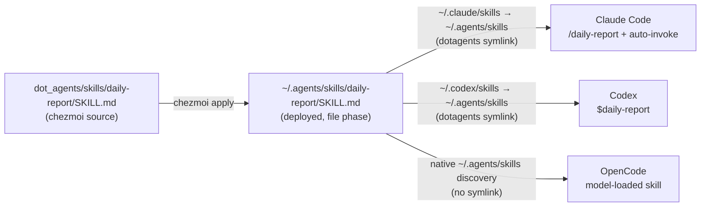

# refactor: Migrate `daily-report` OpenCode command to a cross-agent skill

## Goal Capsule

- **Objective:** Convert `.opencode/commands/daily-report.md` into an Agent Skills `SKILL.md` deployed to `~/.agents/skills/daily-report/`, so Claude Code and Codex can use it as well as OpenCode — from one source, with no per-agent duplication.
- **Product authority:** Repo owner (dotfiles maintainer). Direct-planning bootstrap; decisions below are the confirmed baseline.
- **Open blockers:** None. Two non-blocking trade-offs are recorded in Open Questions.
- **Product Contract preservation:** N/A — no upstream requirements doc; this is a `ce-plan-bootstrap` contract.

---

## Product Contract

### Summary

`daily-report` today exists only as a project-scoped OpenCode command inside the chezmoi checkout (`.opencode/commands/daily-report.md`), so it is invocable only when running OpenCode from `~/.local/share/chezmoi`. Re-author it as a single `SKILL.md` under `dot_agents/skills/daily-report/`, which chezmoi deploys to `~/.agents/skills/daily-report/`. That one location is discovered by all three agents this repo runs: Claude Code (via the dotagents `~/.claude/skills` → `~/.agents/skills` symlink), Codex (via `~/.codex/skills` → `~/.agents/skills`), and OpenCode (native `~/.agents/skills/` discovery, no symlink needed). Delete the superseded OpenCode command, and reconcile the repo comments that currently assert "there are no local skills any more."

This resurrects the exact path removed in commit `44a6774` (`docs/plans/2026-07-15-001-chore-remove-local-agent-skills-plan.md`), but by a **different, cleaner mechanism**: a plain chezmoi-managed file, not a dotagents `[[skills]]` `path:` registration. dotagents stays MCP-only.

### Problem Frame

- The `~/src`-wide daily work-log sweep is a personal, cross-project workflow, yet it lives as a chezmoi-repo-scoped OpenCode command — the wrong scope for a "sweep everything under `~/src`" tool, and unavailable to Claude Code and Codex.
- The repo's current convention (stated in three source comments) is "every user-scoped skill is a chezmoi external." `daily-report` is personal and unpublished, so it cannot be a GitHub external. It is a genuinely new category: a locally-authored user-scoped skill.
- The removal in `44a6774` deleted the dotagents-`path:` variant of this skill but deliberately kept the OpenCode command (see that plan's Out-of-scope). This migration is the inverse: promote the command to the shared skill location.
- Zero-drift standard: several comments/docs assert "no local skills"; shipping one makes those statements false and must be reconciled in the same change.

### Key Decisions

- **One `SKILL.md`, one canonical location.** Author at `dot_agents/skills/daily-report/SKILL.md` → deploys to `~/.agents/skills/daily-report/`. No per-agent copy; all three agents read that path.
- **chezmoi-managed local file, not dotagents `path:`.** The deprecated dotagents `[[skills]]`/`path:` mechanism stays removed. chezmoi deploys the file directly during its file phase, exactly as the external skills already land in the same parent dir. dotagents remains MCP-only.
- **Not a GitHub external.** `daily-report` is personal (Korean output, `~/src` layout assumptions); publishing a repo to consume it as `agents.skills.external` is rejected as heavyweight and unnecessary.
- **Delete the OpenCode command.** OpenCode discovers the skill natively, so the command is redundant as a *definition*. Deletion gives up one thing: OpenCode's deterministic `/daily-report` slash — there the skill becomes model-loaded (the model loads it from the description's trigger phrases), while Claude Code keeps a typeable `/daily-report` and Codex exposes `$daily-report`. A thin OpenCode pointer command (*"load and follow the daily-report skill"*) could preserve the slash without duplicating the body; it is rejected only to avoid maintaining a second file, accepting the deterministic-invocation loss as a minor cost (see Open Questions).
- **Reconcile the "no local skills" comments.** Update only the statements that become false, and keep "no dotagents `path:` skills" true.

### Requirements

**Skill authoring & deployment**

- **R1.** A single `SKILL.md` exists at `dot_agents/skills/daily-report/SKILL.md`, deploying verbatim to `~/.agents/skills/daily-report/SKILL.md`.
- **R2.** Its body preserves the current command's operational content unchanged: the per-OS (`Linux` / `macOS-BSD` / `Windows PowerShell`) `~/src` bare-repo sweep with the mandatory author filter and landed-vs-`진행 중` split, the business-perspective grouping rules, the single-`plaintext`-fence group→repository→detail output shape, and the Korean tone/volume rules with good/bad examples.
- **R3.** Frontmatter uses the portable common denominator — `name: daily-report` (required by OpenCode; must equal the directory name) and a `description`. No Claude-only fields are required.
- **R4.** The `description` drops the two trailing sentences that point at the removed `git-workflow` and `pr-mr` skills (deleted in `44a6774`), and stays comfortably under Claude Code's 1,536-character `description`+`when_to_use` listing cap, key use case and trigger phrases first.

**Supersession**

- **R5.** `.opencode/commands/daily-report.md` is deleted. `.opencode/commands/sync-omo-models.md` is untouched.

**Convention reconciliation (zero-drift)**

- **R6.** The comments asserting "no local skills / every user-scoped skill is a chezmoi external" are corrected to reflect one chezmoi-managed local skill, without implying the dotagents `path:` mechanism returned: `.chezmoidata/agents.yaml` (skills block comment), `dot_agents/private_readonly_agents.toml.tmpl` (header comment), `.chezmoiremove` (the "no chezmoi-managed local skills" note), and `.chezmoiexternals/ai-agents.toml` (the agent-skills block comment that still says dotagents runs "the twelve path: skills" — stale since `44a6774`; comment-only, no fetch-behavior change).
- **R7.** `AGENTS.md` (Agent surfaces & ownership) documents the local-skill mechanism alongside externals; `README.md`'s skills description is updated where it implies externals are the only inhabitants of `~/.agents/skills/`. The `CLAUDE.md` mirror stays exactly `@AGENTS.md` (no edit).

### Scope Boundaries

**In scope:** authoring the `daily-report` `SKILL.md`, deleting the OpenCode command, and reconciling the affected convention comments/docs.

**Out of scope:**
- `.opencode/commands/sync-omo-models.md` — a distinct, chezmoi-repo-specific command that relies on live `!`command`` injection; not migrated.
- The `agents.skills.external` list and the `.chezmoiexternals/ai-agents.toml` external-fetch machinery — data and fetch behavior unchanged (this skill is local, not an external). Its stale agent-skills block *comment* ("twelve path: skills") is corrected under U3 as part of the same zero-drift reconciliation.
- dotagents scaffolding (`agents.toml`, the install script, the symlink) — unchanged; no new agent added to the `agents = ["claude", "codex"]` list (see KTD3).
- Re-introducing any of the other eleven skills removed in `44a6774`.
- OpenCode config (`dot_config/opencode/`) — unchanged.

#### Deferred to Follow-Up Work

- A generalized "local skills" data list (mirroring `agents.skills.external`) if a second personal skill is ever added. One skill does not warrant the abstraction yet.

### Success Criteria

- After an isolated `chezmoi apply`, the throwaway destination contains `.agents/skills/daily-report/SKILL.md` with the ported body and cleaned frontmatter, and no `.opencode/commands/daily-report.md`.
- Grepping the source tree for the now-false absolutes ("no local skills", "every user-scoped skill is a chezmoi external") returns only historical `docs/plans/` hits — no live comment or doc.
- `.chezmoiremove` still targets only `.agents/skills/ce-*` and `.agents/skills/lfg`; `daily-report` is neither removed nor in conflict.
- `git diff --check` clean; `render-dotfiles.yml` and `ci.yml` green after push.

---

## Planning Contract

### Key Technical Decisions

- **KTD1 — Deploy via `dot_agents/skills/<name>/SKILL.md`.** `dot_agents/` maps to `~/.agents/`; a plain (non-`.tmpl`) `SKILL.md` copies verbatim to `~/.agents/skills/daily-report/SKILL.md`. This is the canonical cross-agent skills home, the same parent the external skills populate. Rationale: reuses existing, proven deployment; no dotagents change; no template rendering to get wrong. Alternative — publish a GitHub repo and add to `agents.skills.external` — rejected (personal/unpublished content, heavyweight). **External-vs-local criterion (replaces the retired "externals only" absolute):** a personal skill that should not be published lives here as chezmoi source under `dot_agents/skills/<name>/`; a skill worth sharing is published to a GitHub repo and consumed as an `agents.skills.external`.
- **KTD2 — Plain file mode (no `readonly_` prefix).** Deploy as `SKILL.md` (0644), matching how externally-fetched skills live under `~/.agents/skills/` (writable), rather than the `readonly_` used for `~/.agents/AGENTS.md`/`CLAUDE.md`. Editing the source, not the deployed copy, remains the rule (AGENTS.md). Minor call — revisit only if the maintainer wants hand-edit protection.
- **KTD3 — Do not add `opencode` to the dotagents `agents` list.** OpenCode discovers `~/.agents/skills/` natively; adding `opencode` would instead point dotagents at OpenCode's *config file* (`~/.config/opencode/opencode.jsonc`), colliding with the chezmoi-managed `dot_config/opencode/readonly_opencode.json.tmpl` and the AGENTS.md rule that OpenCode config "is managed separately." So the skill reaches OpenCode with zero dotagents change.
- **KTD4 — Single `SKILL.md`, no `references/` split.** The body is ~140 lines, under Claude Code's 500-line SKILL.md guidance; splitting adds indirection for no benefit.

### High-Level Technical Design

One source file fans out to three agents through three different discovery mechanisms; the diagram makes the "no per-agent copy" claim legible.



Directional; the prose above is authoritative where they disagree.

### Output Structure

```text
dot_agents/
└── skills/
    └── daily-report/
        └── SKILL.md        # new; the only file this plan creates
```

### Implementation Units

#### U1. Author `dot_agents/skills/daily-report/SKILL.md`

- **Goal:** Create the one skill file all three agents consume.
- **Requirements:** R1, R2, R3, R4.
- **Dependencies:** none.
- **Files:** `dot_agents/skills/daily-report/SKILL.md` (create).
- **Approach:** Port the body of `.opencode/commands/daily-report.md` **verbatim** — it is the *sole authority* for the body (workflow steps, the three per-OS code blocks, the grouping Rules, the single-`plaintext`-fence output shape, good/bad examples). Keep frontmatter to `name: daily-report` + `description`. Rewrite the `description` to lead with the generator's purpose and the trigger phrases (`"daily report"`, `"work log"`, `"일일 업무 로그"`, …) and **drop** the trailing `Do NOT load it for … (use git-workflow) … (use pr-mr)` sentences — both skills no longer exist. **Do not copy the body from the removed `SKILL.md`:** `git show 44a6774~1:dot_agents/skills/daily-report/SKILL.md` predates the output-format revision — it mandates two-space indentation inside the fence, which the current command reversed to column-1 / no-leading-space — so reuse it only for frontmatter *shape*, never for the Workflow/Rules/output body.
- **Patterns to follow:** external skills keep `SKILL.md` at the directory root. The removed `dot_agents/skills/daily-report/SKILL.md` (commit `8e4236e`) is a *structural* reference only — its output-format body is stale (see Approach).
- **Test scenarios:** `Test expectation: none -- content/instruction file, no behavioral code.` Correctness is proven by the Verification Contract's isolated deploy + discovery checks, not unit tests.
- **Verification:** isolated `chezmoi apply` lands `.agents/skills/daily-report/SKILL.md`; frontmatter has `name: daily-report` matching the directory; `description` contains no `git-workflow`/`pr-mr` reference and is under 1,536 chars; body diff vs. the OpenCode command is limited to frontmatter.

#### U2. Remove the superseded OpenCode command

- **Goal:** Delete the now-redundant project command so the definition lives in exactly one place.
- **Requirements:** R5.
- **Dependencies:** U1 (skill must exist first, so `daily-report` is never absent between steps).
- **Files:** `.opencode/commands/daily-report.md` (delete).
- **Approach:** `git rm .opencode/commands/daily-report.md`. Leave `.opencode/commands/sync-omo-models.md` untouched.
- **Execution note:** land after U1 in the same change; sequence matters only for reviewer clarity, not runtime.
- **Test scenarios:** `Test expectation: none -- file deletion.`
- **Verification:** the path is gone from the working tree; no other file references `.opencode/commands/daily-report.md` (grep).

#### U3. Reconcile the "no local skills" convention statements

- **Goal:** Remove zero-drift violations introduced by shipping a local skill, without implying the removed dotagents `path:` mechanism is back.
- **Requirements:** R6, R7.
- **Dependencies:** none (independent of U1/U2 content, but land together).
- **Files:**
  - `.chezmoidata/agents.yaml` — the `agents.skills` block comment ("There are no local `path:` skills any more — every user-scoped skill is a chezmoi external").
  - `dot_agents/private_readonly_agents.toml.tmpl` — header comment ("There are NO local path: skills any more. Every user-scoped skill is a chezmoi external …").
  - `.chezmoiremove` — the note "dot_agents/skills/ no longer ships any chezmoi-managed local skills".
  - `.chezmoiexternals/ai-agents.toml` — the agent-skills block comment asserting dotagents runs "the twelve path: skills" (stale since `44a6774`); comment-only, no change to the external-fetch data or behavior.
  - `AGENTS.md` — Agent surfaces & ownership paragraph (currently only "External skills come from `agents.skills.external` …").
  - `README.md` — skills description (~the `agents.skills.external` … `~/.agents/skills/` lines).
- **Approach:** Adopt one consistent framing across all five: *dotagents is MCP-only and manages no skills. User-scoped skills reach `~/.agents/skills/<name>/` two ways — (a) chezmoi externals fetched from GitHub (`agents.skills.external`), and (b) locally-authored personal skills managed directly as chezmoi source under `dot_agents/skills/<name>/`. Both are read by Claude Code + Codex through the dotagents skills symlink and by OpenCode via native `~/.agents/skills/` discovery.* Keep "no dotagents `path:`/`[[skills]]` skills" true. Make `AGENTS.md` the authoritative statement; `README.md` a one-line acknowledgement; the three comments concise.
- **Execution note:** doc-drift reconciliation — after editing, grep the tree for the old absolutes and confirm only `docs/plans/` history remains.
- **Test scenarios:** `Test expectation: none -- documentation/comment edits.`
- **Verification:** `grep -rniE 'every user-scoped skill is a chezmoi external|chezmoi-managed local skill|(twelve|the) +path: skills' . | grep -vE '/\.git/|docs/plans/'` returns nothing live (no `--include` filters — the extensionless `.chezmoiremove` must be in scope; the pattern targets the false-if-present *assertions*, not the correct "no path: skills any more" negations the reconciliation introduces); `CLAUDE.md` is still exactly `@AGENTS.md`.

---

## Verification Contract

Run from the source root, never against live `$HOME` (AGENTS.md isolated-verification rule). `SKILL.md` is not a template, so it deploys verbatim — verify by applying to a throwaway destination, not by `execute-template`.

1. **Isolated deploy check.** With the stub-`op` + scratch-destination recipe and `--source "$PWD"`, run `chezmoi apply` (or `chezmoi archive --exclude=encrypted,externals,scripts` and extract) into a throwaway destination and assert:
   - `.agents/skills/daily-report/SKILL.md` exists with the ported body.
   - `.opencode/commands/daily-report.md` is absent (it is chezmoi-ignored anyway; assert it is gone from the *source* tree).
2. **Frontmatter/description assertions (U1):** `name: daily-report` equals the directory name; `description` has no `git-workflow`/`pr-mr` token and is < 1,536 chars.
3. **Removal-safety (`.chezmoiremove`):** confirm the file still matches only `.agents/skills/ce-*` and `.agents/skills/lfg`, and that `chezmoi apply` raises no "managed and removed" conflict for `daily-report`.
4. **Drift grep (U3):** the old-absolute grep returns only `docs/plans/` hits.
5. **Repo hygiene:** `git diff --check`, `git status`, and a diff limited to the five touched files + the two skill/command paths.
6. **CI:** after push, watch `render-dotfiles.yml` and `ci.yml` to terminal green.

No live service is restarted and no `run_onchange_after_*` network/service side effect fires: the change is a file add, a file delete, and comment/doc edits. The install-dotagents-skills fingerprint covers the raw `agents.toml` template, which U3 does not alter (only a comment in it changes — that *does* re-fingerprint and re-run `dotagents --user install`, an idempotent, network-touching install that soft-skips on failure; disclose this as the one onchange side effect).

## Definition of Done

- `~/.agents/skills/daily-report/SKILL.md` deploys from source and is discoverable by Claude Code (`/daily-report` + auto-invoke), Codex (`$daily-report`), and OpenCode (model-loaded), verified in isolation.
- `.opencode/commands/daily-report.md` removed; `sync-omo-models.md` intact.
- All five convention comments/docs reconciled; no live drift; `CLAUDE.md` unchanged (`@AGENTS.md`).
- Verification Contract steps 1–6 pass, including terminal-green CI.

---

## Risks & Dependencies

- **Codex discovery path (low).** Research flagged that the install script's comment about a `~/.codex/skills` symlink may be stale vs. current dotagents (which may use native discovery for Codex). Either way Codex reaches `~/.agents/skills/`, so `daily-report` is discoverable; no action, but do not rely on the symlink specifically in wording.
- **Description truncation (low).** If the `description` ever grows past 1,536 chars, Claude Code silently truncates it in the skill listing, weakening auto-invocation. Mitigated by R4's trim (~1,000 chars).
- **onchange re-run (low, disclosed).** The U3 comment edit in `private_readonly_agents.toml.tmpl` re-fingerprints `install-dotagents-skills`, re-running `dotagents --user install`. Idempotent and soft-skipping; no manual step.
- **Dependency:** U2 depends on U1 (never leave `daily-report` undefined mid-change). U3 is independent.

## Open Questions

- **Keep a thin OpenCode `/daily-report` pointer command for explicit slash invocation?** Default **no** — a one-line pointer would restore OpenCode's deterministic slash *without* duplicating the body, but it is one more file to maintain, and the description's trigger phrases make model-loading reliable enough. Revisit if the maintainer misses the deterministic OpenCode slash.
- **`readonly_` prefix on the deployed skill?** Default **no** (KTD2). Flip to `readonly_SKILL.md` only if hand-edit protection of the deployed copy is wanted.

## Assumptions

The user's request — *"migrate … so claude code and codex can use it as well"* — explicitly requires cross-agent (Claude Code + Codex) availability, which is inherently user-scoped. That is a **stated requirement, not an inferred bet**, and it settles the do-nothing baseline: leaving `daily-report` as an OpenCode-only command would not satisfy the request. Migration success is therefore realized value, not merely "the files moved."

Genuinely inferred bets, resolved to defaults in pipeline mode and recorded here:

- Deploy as a **chezmoi-managed local skill**, not a republished GitHub external (personal/unpublished content) — see KTD1's external-vs-local criterion.
- **Delete** the OpenCode command rather than keep a thin pointer — see the honest trade-off in Key Decisions and Open Questions.

## Sources & Research

- Current command: `.opencode/commands/daily-report.md` (frontmatter + body being ported).
- Prior skill (template): `git show 44a6774~1:dot_agents/skills/daily-report/SKILL.md`; removed in `44a6774` per `docs/plans/2026-07-15-001-chore-remove-local-agent-skills-plan.md` (which kept the OpenCode command out of scope).
- Deployment mechanics: `.chezmoiexternals/ai-agents.toml` (agent-skills external block → `~/.agents/skills/<name>/`), `.chezmoiscripts/70-agents/run_onchange_after_install-dotagents-skills.sh.tmpl` (dotagents symlink), `dot_agents/private_readonly_agents.toml.tmpl` (`agents = ["claude", "codex"]`, MCP-only), `.chezmoiremove` (removes `ce-*`, `lfg`; not `daily-report`).
- Claude Code skills — locations, `SKILL.md` frontmatter fields, and the 1,536-char `description`+`when_to_use` listing cap: https://code.claude.com/docs/en/skills.md
- Codex skills/plugins overview (invoked with `$name`): https://learn.chatgpt.com/docs/skills-and-plugins
- OpenCode skills — native discovery of `~/.agents/skills/` and `~/.claude/skills/` (plural `skills/`), `name`+`description` frontmatter required, model-loaded via the `skill` tool: https://opencode.ai/docs/skills.md ; commands (`~/.config/opencode/commands/`, `.opencode/commands/`): https://opencode.ai/docs/commands.md
- `@sentry/dotagents` supported agents (`claude`, `cursor`, `codex`, `vscode`, `opencode`) and skills-symlink behavior (Claude/Cursor get a `skills` symlink; Codex/OpenCode/Pi use native `.agents/skills/` discovery): https://github.com/getsentry/dotagents
