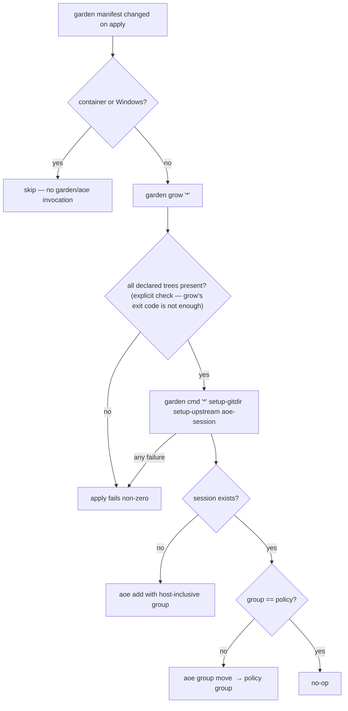
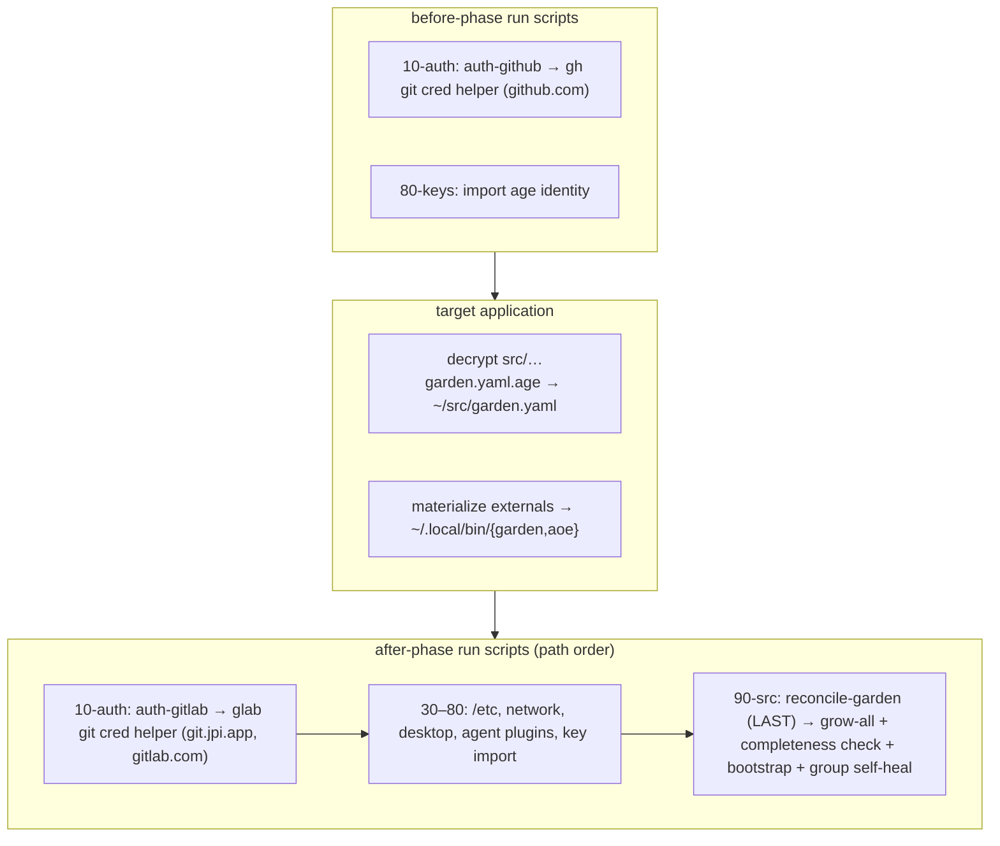

# Garden Apply Reconcile - Plan

## Goal Capsule

- **Objective:** Make `chezmoi apply` provision and reconcile the `~/src` garden automatically — grow declared trees, run the three bootstrap commands, and enforce a host-inclusive aoe group policy — replacing today's manual bootstrap.
- **Product authority:** The user's brainstorm decisions govern scope; `dot_agents/readonly_AGENTS.md` garden/aoe policy governs behavior (additive only, aoe owns worktree lifecycle, container/Windows skip); `AGENTS.md` governs the encrypted-manifest edit flow.
- **Execution profile:** Deep, cross-cutting infra change touching an age-encrypted manifest, a new apply-phase reconcile script, and the shared instruction docs. Verified by `chezmoi execute-template` rendering plus extracted-stanza harnesses under per-user scratch — the repo has no unit-test suite for shell/chezmoi source.
- **Open blockers:** None. The four requirements-only Outstanding Questions are resolved in the Planning Contract below.
- **Tail ownership:** The LFG pipeline owns commit, push, PR creation, and CI watch.

## Product Contract

**Product Contract preservation:** changed — R9 reframed. During planning, `aoe` was found to already be a managed external in `.chezmoiexternals/ai-agents.toml` (with checksum verification), so R9's intent (apply guarantees `aoe` is present) is already satisfied and requires no new externals work; the brainstorm-time belief that `aoe` was unmanaged was incorrect. No other requirement, acceptance example, or scope boundary changed.

### Summary

Turn garden provisioning into an active step of `chezmoi apply`. When the garden manifest changes, apply runs `garden grow '*'` then `garden cmd '*' setup-gitdir setup-upstream aoe-session`, and enforces aoe session groups as the tree's full `~/src` path including the host segment (e.g. `github.com/hyperlapse122/dotfiles`). Provisioning failure fails apply.

### Problem Frame

Today `chezmoi apply` deploys `~/src/garden.yaml` but does not act on it. Growing trees and running the bootstrap commands (`setup-gitdir`, `setup-upstream`, `aoe-session`) is a manual two-line ritual the user runs by hand per new tree and per new host. `dot_local/bin/executable_src-audit` only reports drift; nothing closes it.

Two frictions follow. First, a new host or a new manifest entry stays un-provisioned until the user remembers the ritual — there is no apply-driven convergence. Second, the aoe group is derived host-stripped (`hyperlapse122/dotfiles`), so the session grouping does not mirror the on-disk `~/src/<host>/<group>/<project>` layout the user reasons about.

The manifest is a union across hosts, and the current design leans on manual selective grow precisely because of that. Automating grow-all only holds because every host configured by this repo reaches every tree over HTTPS — public self-hosted GitLab plus GitHub, with 1Password-sourced credentials and no VPN. That access uniformity is what makes an unconditional, fail-hard reconcile safe.

### Key Decisions

- **Reconcile is active on apply, additive-convergent, and manifest-change-triggered.** Apply grows and bootstraps declared trees when the manifest changes; it never removes, relocates, or unlocks a tree, clone, or aoe worktree. Removed or moved entries remain `src-audit`'s report, honoring the "aoe owns worktree lifecycle" policy.
- **Grow-all is unconditional; provisioning failure is a hard apply failure.** `grow '*'` runs across the full union. Because every configured host can reach every tree, a failed grow or bootstrap is a real problem and fails `chezmoi apply` rather than being swallowed — provisioning is a first-class apply obligation.
- **Group enforcement lives inside `aoe-session` as self-heal (single source of truth).** The group formula exists in exactly one place. `aoe-session` derives the host-inclusive group, creates missing sessions with it, and re-designates an existing session whose group drifted — so there is no second copy of the formula to keep in lockstep. The reconcile wrapper stays thin: the two garden invocations plus gating.
- **`aoe` is already a managed external — the reconcile relies on it, it does not add it.** `.chezmoiexternals/ai-agents.toml` already provisions `aoe` (GitHub release, `aoe-{os}-{arch}.tar.gz`, Windows-guarded, checksum-verified), so apply already guarantees its presence and `aoe update` is already not the install path. The new coupling this plan introduces is that hard-fail apply now depends on `aoe`'s CLI contract (`list --json` group field, `group move` args), and `aoe` floats to the latest release like every other external — see Risks.
- **Group policy is the full path under `~/src`, host included.** `aoe-session` changes from stripping the host to using the whole relative path.



### Requirements

**Provisioning automation**

- R1. When the garden manifest changes, `chezmoi apply` runs `garden grow '*'` then `garden cmd '*' setup-gitdir setup-upstream aoe-session`, replacing the manual bootstrap.
- R2. Reconcile is additive-convergent: it grows missing trees and bootstraps them, and never removes, relocates, or unlocks any tree, clone, or aoe worktree. Drift from removed or moved manifest entries is left to `src-audit` to report.
- R3. Reconcile runs across the full declared union (`grow '*'`), assuming every configured host can reach every tree.

**Failure semantics**

- R4. Any failure in grow or in the bootstrap commands fails `chezmoi apply` with a non-zero exit — provisioning is not best-effort. Because `garden grow '*'` exits 0 even when trees fail to clone (verified), the script enforces this with an explicit completeness check, not `garden`'s exit code alone.
- R5. Reconcile runs non-interactively: an unreachable tree surfaces as a failure per R4, never as an interactive credential or host prompt that hangs apply.

**Group-naming policy**

- R6. The aoe group derived by `aoe-session` is the tree's full path under `~/src` including the host segment (e.g. `github.com/hyperlapse122/dotfiles`), replacing the current host-stripped form.
- R7. `aoe-session` continuously self-heals an existing session's group: when the current group differs from the derived policy value it re-designates via `aoe group move`; when they match it is a no-op. Missing sessions are created with the policy group.
- R8. Group self-heal changes only the group attribute — never the session's title, worktree name, or worktree path — and is idempotent across repeated reconciles.

**Prerequisite and gating**

- R9. Apply guarantees `aoe` is present before `aoe-session` runs. Already satisfied: `aoe` is a managed external in `.chezmoiexternals/ai-agents.toml` (checksum-verified); no new externals work is required.
- R10. Reconcile is gated to where the garden layout exists: skipped in containers and on Windows (mirroring the existing `src/garden.yaml` entry in `.chezmoiignore`), executed on Linux and macOS. It runs after credential provisioning (the `10-auth` phase) and, per KTD-2, after all other after-phase provisioning so a garden failure cannot abort unrelated convergence.

### Acceptance Examples

- AE1. **Covers R1, R4.** The manifest gains a new tree. The next apply grows it, runs the three bootstrap commands, and creates its aoe session with the host-inclusive group. If any of those steps fails — including a tree that silently fails to clone — apply exits non-zero.
- AE2. **Covers R2.** A tree is removed from the manifest. The next apply leaves its clone and its aoe session untouched; `src-audit` reports the clone as unmanaged.
- AE3. **Covers R6, R7.** A session exists with the old group `hyperlapse122/dotfiles`. After reconcile its group is `github.com/hyperlapse122/dotfiles`. A second reconcile issues no `aoe group move`.
- AE4. **Covers R7, R8.** A session already at the policy group is reconciled: no group change is issued, and its title/worktree/path are unchanged.
- AE5. **Covers R10.** Apply runs inside a container. Reconcile is skipped entirely — no `garden` or `aoe` invocation — and apply succeeds.

### Scope Boundaries

**In scope:** the `aoe-session` group-derivation and self-heal change in `src/encrypted_readonly_garden.yaml.age`; a new reconcile script in a late `.chezmoiscripts/` phase; matching doc updates in `dot_agents/readonly_AGENTS.md` and `AGENTS.md`.

**Out of scope:**

- Adding or re-declaring the `aoe` external — it already exists in `.chezmoiexternals/ai-agents.toml`.
- Auto-removal or relocation of trees dropped or moved in the manifest — `src-audit` reports only; aoe owns worktree lifecycle.
- Per-host tree scoping or any manifest schema change (host gates on trees) — the union stays flat and every host is assumed to reach every tree.
- Teardown or revert scripts — repo policy forbids them; any reversal is manual or documented.
- Changing `src-audit` — it stays read-only.
- Reshaping tree declarations or the `setup-gitdir` / `setup-upstream` command bodies beyond the one group-derivation change in `aoe-session`.

### Dependencies / Assumptions

- Every host configured by this repo reaches all union trees over HTTPS (public self-hosted GitLab plus GitHub) using 1Password-sourced credentials via git's credential helper — no VPN, no per-host access differences.
- Git credential helpers for the manifest's hosts are configured by the `10-auth` phase before the reconcile after-script runs: `auth-github` sets `gh` for github.com; `auth-gitlab` sets `glab auth git-credential` for the GitLab hosts, including `git.jpi.app`. Reconcile depends on that ordering, not on building any credential path itself.
- `aoe group move` re-designates an existing session's group without touching its worktree, and takes the session's **unique `id`** (from `aoe list --json`), not its title — titles are non-unique across trees. `aoe list --json` exposes each session's current group and `id`; the exact field names are confirmed against the installed `aoe` at implementation (U1).
- `jq` is present — the existing `aoe-session` stanza already parses `aoe list --json` with it.
- `aoe` and `garden` externals are materialized before the reconcile after-script runs within the same apply (validated by the `10-auth` after-scripts already relying on the `gh`/`glab` externals).

## Planning Contract

### Key Technical Decisions

- KTD-1. **Trigger via a `run_onchange_after_` fingerprint over the encrypted manifest ciphertext.** The reconcile script embeds a `fingerprint.tmpl` block globbing `src/encrypted_readonly_garden.yaml.age`; chezmoi hashes the rendered script, so any manifest change re-triggers the reconcile. Hashing the ciphertext (raw source content, via `include . | sha256sum`) complies with the "never hash a rendered secret" rule. age encryption is non-deterministic, so any re-encrypt re-triggers even on identical plaintext — an accepted over-trigger, harmless because the reconcile is idempotent. Resolves requirements-only OQ "fingerprint source".
- KTD-2. **New late `.chezmoiscripts/90-src/` phase, after every other after-phase script.** A single `run_onchange_after_reconcile-garden.sh.tmpl`. It must run after the `10-auth` after-scripts (which set the GitLab git credential helper) and after target application (garden.yaml decrypted, externals materialized) — all satisfied at any phase >10. It is placed **last** (after `80-keys`) so that a hard-fail garden error does not abort the unrelated after-phase provisioning that would otherwise follow it: `/etc` files, host/network config, desktop configuration, agent-plugin builds, and key imports have no dependency on the garden and must still converge. Resolves requirements-only OQ "phase placement".
- KTD-3. **Group enforcement inside `aoe-session`, not a separate step.** The `aoe-session` stanza derives the host-inclusive group once, creates missing sessions with it, and issues `aoe group move <id>` only when an existing session's group differs. The reconcile script never re-derives the formula, so there is nothing to keep in lockstep and `src-audit` stays read-only.
- KTD-4. **Hard-fail via a mandatory post-grow completeness check, not `garden`'s exit code.** `garden grow '*'` exits 0 even when every declared tree fails to clone (verified against the installed `garden`), so `set -e` alone does not enforce R4. The script MUST add an explicit completeness check after grow — for each declared bare tree, verify the `*/.bare` clone is a valid git dir (reusing the shape `dot_local/bin/executable_src-audit` already tests) — and exit non-zero on any missing or broken tree. The check MUST also handle a tree left half-materialized by a mid-clone network drop: because chezmoi re-runs a failed onchange script on every subsequent apply, a corrupt bare tree would otherwise wedge apply permanently — so the check either drives a repair (re-grow) or exits non-zero with an explicit manual-cleanup message naming the tree. Resolves the reviewer's "grow exits 0 on partial failure" and "corrupt partial clone wedges apply" findings.
- KTD-5. **Non-interactive git via `GIT_TERMINAL_PROMPT=0`.** Exported before the garden invocations so an auth or host-reachability gap fails fast instead of blocking apply on a prompt (R5). Credential injection still happens through the native `gh`/`glab` helpers configured in `10-auth`.
- KTD-6. **`aoe` external is reused, not added.** `.chezmoiexternals/ai-agents.toml` already declares `[aoe]` (GitHub release via `gitHubLatestRelease`, `aoe-{os}-{arch}.tar.gz`, `targetPath = .local/bin/aoe`, Windows-guarded, with an `[aoe.checksum]` sidecar). R9 is therefore already met with checksum verification — no new stanza, and adding one to `vcs.toml` would create a duplicate `.local/bin/aoe` external and drop the checksum. Resolves requirements-only OQ "aoe pin". The residual coupling (hard-fail apply now depends on `aoe`'s floating CLI contract) is a Risk, below.

### Assumptions

- The requirements-only OQ "credential-helper configuration" is already satisfied by `10-auth`; the reconcile depends on it rather than configuring anything (see Dependencies).
- chezmoi applies `.chezmoiexternals` (to `~/.local/bin`) and decrypts encrypted targets during target application, before any `run_*_after_` script — evidenced by the `10-auth` after-scripts already invoking the `gh`/`glab` externals.
- `include` on the binary `.age` source returns its raw bytes for `sha256sum`, exactly as it does for a `.tmpl` dependency.

### Risks

- **Fleet-wide apply failure on any unreachable or unauthorized tree.** Grow-all + hard-fail + a flat union manifest means the union must remain reachable **and authorized** from every host at every apply. Because the fingerprint hashes the whole manifest, an edit made on one host re-triggers grow-all on every host on its next apply; a tree that one host cannot reach or is not authorized for fails that host's apply until the manifest or the host's access is fixed. This is the accepted consequence of the brainstorm's grow-all + hard-fail decision (per-host scoping is out of scope); it is documented, not mitigated.
- **`aoe` floats to the latest release, and hard-fail now depends on its CLI contract.** The existing external tracks `gitHubLatestRelease` like every other external. This plan newly couples a hard-fail apply to `aoe list --json`'s group field and `aoe group move`'s argument shape, so a future `aoe` release that renames either could fail apply fleet-wide with no manifest change. Pinning `aoe` would diverge from the repo's latest-tracking posture for all externals, so it is a deliberate posture decision left to the maintainer, not a change this plan makes.

### High-Level Technical Design

Apply ordering that makes the reconcile sound and keeps its hard-fail from blocking unrelated convergence (before-phase → target application → after-phase, reconcile last):



## Implementation Units

*(U1 in the requirements-only draft — "add aoe external" — was removed: `aoe` is already a managed external in `.chezmoiexternals/ai-agents.toml`. Units renumbered.)*

### U1. Host-inclusive group derivation and group self-heal in `aoe-session`

- **Goal:** `aoe-session` derives the host-inclusive group and continuously re-designates an existing session whose group drifted, changing nothing else.
- **Requirements:** R6, R7, R8.
- **Dependencies:** none (behavior consumed by U2).
- **Files:** `src/encrypted_readonly_garden.yaml.age` (edited through the decrypt → scratch-edit → re-encrypt flow).
- **Approach:** In the `aoe-session` command stanza, change the group derivation from the host-stripped `group="$(printf '%s\n' "$rel" | cut -d/ -f2-)"` to the full relative path `group="$rel"`. Extend the existing-session branch: today it prints "already has a session — skipping" and exits; instead, read that session's current group **and its `id`** from `aoe list --json` (extend the existing `jq` filter that already matches on `.path`), and when the group differs from `$group`, run `aoe group move` on that **`id`** (not the title — titles are non-unique across trees) to `$group` before exiting; when it matches, exit unchanged. The new-session branch is unchanged except that `aoe add … -g "$group"` now carries the host-inclusive value. Leave `setup-gitdir` and `setup-upstream` byte-identical. Confirm the `aoe list --json` group and `id` field names and the `aoe group move` argument shape against the installed `aoe` before finalizing. Update the manifest header comment describing the `aoe-session` group derivation.
- **Execution note:** edit only through the encrypted flow — `chezmoi decrypt --source "$PWD"` into a mode-600 scratch file under `$XDG_RUNTIME_DIR` (trap-cleaned, never printed to stdout), edit, `chezmoi encrypt` back; never commit plaintext.
- **Patterns to follow:** the existing `aoe-session` stanza (message/exit style, unbraced `${…}` garden expansion, the `jq -e … any(.[]; …)` session-match filter); `dot_local/bin/executable_src-audit` for the `*/.bare` self-skip that must stay intact.
- **Test scenarios:**
  - `Covers R6.` No session for the tree → `aoe add … -g github.com/hyperlapse122/dotfiles -t <branch> -w <branch>` (host-inclusive group), against a disposable bare fixture with an `aoe` stub recording arguments.
  - `Covers R7, AE3.` Session exists with group `hyperlapse122/dotfiles` → exactly one `aoe group move <id>` to `github.com/hyperlapse122/dotfiles`, targeting the session's unique id, no `aoe add`.
  - `Covers R7, R8, AE4.` Session exists already at `github.com/hyperlapse122/dotfiles` → no `aoe group move`, no `aoe add`, and the stub records no title/worktree/path mutation.
  - Non-bare tree (`opencode-mcp-figma`) still self-skips with exit 0 and issues no `aoe` call.
  - The decrypted scratch YAML parses (`yq`), and the decrypted diff against the deployed `~/src/garden.yaml` shows only the group-derivation, self-heal, and comment lines.
- **Verification:** on this host, a reconcile run moves any old-group session to the host-inclusive group once and is a no-op on the second run; `setup-gitdir`/`setup-upstream` behavior is unchanged.

### U2. Apply-time reconcile script in a new late phase

- **Goal:** On a manifest change, apply grows all trees and runs the bootstrap commands, hard-failing on any error (including a silently-failed clone), and skipping where the garden layout does not exist — placed so its failure cannot abort unrelated provisioning.
- **Requirements:** R1, R2, R3, R4, R5, R10.
- **Dependencies:** U1 (aoe-session self-heal). `aoe` presence is already guaranteed by the existing `.chezmoiexternals/ai-agents.toml` external.
- **Files:** `.chezmoiscripts/90-src/run_onchange_after_reconcile-garden.sh.tmpl` (new).
- **Approach:** Wrap the whole script in `{{ if ne .chezmoi.os "windows" }}` (mirroring the OS guard in `.chezmoiscripts/30-linux/run_onchange_after_config-solaar.sh.tmpl`). Include `facts-sh.tmpl` + `facts-gate.sh.tmpl` and early-exit 0 when `fact_gate "container"` holds, so the script no-ops in containers exactly where `src/garden.yaml` is chezmoiignored. Emit a `fingerprint.tmpl` block globbing `src/encrypted_readonly_garden.yaml.age` (KTD-1). Body under `set -euo pipefail` and `export GIT_TERMINAL_PROMPT=0`: require `garden` and `aoe` on `PATH` and `~/src/garden.yaml` present (missing any is a hard failure, not a soft skip — externals should have materialized); run `garden --chdir "$HOME/src" grow '*'`; then run the mandatory completeness check (KTD-4) — for each declared bare tree, assert the `*/.bare` clone is a valid git dir, exiting non-zero (with the tree named) on any missing/broken/half-cloned tree, or driving a re-grow repair; then run `garden --chdir "$HOME/src" cmd '*' setup-gitdir setup-upstream aoe-session`. The group self-heal is network-independent and rides along inside `aoe-session`; the simple grow-then-bootstrap order is retained because under hard-fail a failed grow fails the whole apply, so nothing is expected to land on a failed run anyway.
- **Execution note:** this is provisioning glue with network side effects — prefer a runtime smoke/harness with `garden` and `aoe` stubs over unit coverage; the first real apply that runs it clones over the network.
- **Patterns to follow:** `.chezmoiscripts/30-linux/run_onchange_after_config-solaar.sh.tmpl` (OS render guard, `fingerprint.tmpl` placement, `set -euo pipefail`, soft-skip idiom); `.chezmoitemplates/facts-gate.sh.tmpl` usage (`includeTemplate "facts-sh.tmpl" .` then `includeTemplate "facts-gate.sh.tmpl" .`, then `fact_gate "container"`); `dot_local/bin/executable_src-audit` for the per-tree `*/.bare` validity check.
- **Test scenarios:**
  - Render for `os=linux` and `os=darwin`: script present; invokes `garden … grow '*'`, then the completeness check, then `garden … cmd '*' setup-gitdir setup-upstream aoe-session` in that order.
  - Render for `os=windows`: script body empty/absent (render guard).
  - `Covers R10, AE5.` Render/run with the `container` fact true → early exit 0, no `garden`/`aoe` invocation (stubs record nothing).
  - `Covers R1.` With `garden`/`aoe` stubs on `PATH` and all trees present, a successful run invokes grow → completeness check → bootstrap in order and exits 0.
  - `Covers R4.` A `garden grow` stub that exits 0 but leaves a declared tree unclonable → the completeness check makes the script exit non-zero. A pre-existing half-cloned/corrupt bare tree → the check either repairs or exits non-zero with a cleanup message (never silently passes, never wedges).
  - `Covers R5.` The script exports `GIT_TERMINAL_PROMPT=0`; a stub simulating an auth prompt returns failure rather than hanging.
  - `Covers R2.` A manifest missing a previously-grown tree → the run issues no removal of that clone or its aoe session (stubs record only grow/cmd, never a delete/remove).
  - The fingerprint block lists `src/encrypted_readonly_garden.yaml.age` with a sha256 (dependency wired).
- **Verification:** on this host, editing the manifest and applying re-runs the script; an unedited apply does not; a forced garden failure (or a broken tree) fails the apply; failures in phases 30–80 are unaffected because the reconcile runs after them.

### U3. Update the instruction docs to the automated flow

- **Goal:** The shared instructions describe apply-driven reconcile and the host-inclusive group policy, so agents stop treating the manual bootstrap and host-stripped group as current.
- **Requirements:** R1, R6 (documentation halves).
- **Dependencies:** U1, U2.
- **Files:** `dot_agents/readonly_AGENTS.md`, `AGENTS.md`.
- **Approach:** In `dot_agents/readonly_AGENTS.md`, update the garden/aoe layout section: `chezmoi apply` now reconciles the garden on any manifest change (grow-all + the three bootstrap commands), the manual `garden grow` / `garden cmd` sequence becomes the fallback/debug path, and the aoe group is the full `~/src` path including the host segment (correct the "group is the project path" / host-stripped description). In `AGENTS.md`, add a `90-src` row to the `.chezmoiscripts` phase table and adjust any apply-lifecycle prose that describes garden provisioning as manual. Keep the `CLAUDE.md` mirror exactly `@AGENTS.md`.
- **Patterns to follow:** the existing phase-table rows and garden/aoe prose in `AGENTS.md` and `dot_agents/readonly_AGENTS.md`.
- **Test scenarios:** `Test expectation: none — prose-only.` No consumer parses this text; correctness is consistency with U1–U2 behavior.
- **Verification:** the rewritten sentences match implemented behavior; no remaining reference to the host-stripped group or to manual bootstrap as the only path; `CLAUDE.md` still contains only `@AGENTS.md`.

## Verification Contract

| Gate | Command / check | Proves |
|---|---|---|
| Manifest round-trip | `chezmoi decrypt` into a mode-600 `$XDG_RUNTIME_DIR` scratch (trap-cleaned, never printed); decrypted YAML parses (`yq`); diff vs deployed `~/src/garden.yaml` shows only group/self-heal/comment lines | R6, R7, R8 edit correctness (U1) |
| Command harness | Extract the `aoe-session` stanza; run under `sh` against a disposable bare fixture with an `aoe` stub for: new session, drifted-group session (asserts `group move <id>`), correct-group session, non-bare self-skip | AE3, AE4, R6, R7, R8 (U1) |
| Reconcile render | `chezmoi execute-template` on the new script for linux/darwin/windows and with the `container` fact — asserts command+completeness-check sequence, Windows absence, container early-exit | R3, R10, AE5 (U2) |
| Reconcile harness | Run the rendered script with `garden`/`aoe` stubs: success path (grow → completeness check → bootstrap order), silent-clone-failure path (completeness check exits non-zero), corrupt half-clone path (repair or non-zero + cleanup message), `GIT_TERMINAL_PROMPT=0` present | R1, R4, R5 (U2) |
| Deploy (this host) | `chezmoi apply --source "$PWD"` of the manifest, script, and docs; edit-then-apply re-runs the reconcile, unedited apply does not; an old-group session moves once and is a no-op on re-run; a forced broken tree fails apply | R1, R2, R4, R7 end-to-end |
| Hygiene | No plaintext `garden.yaml` committed (only the `.age` blob); scratch files removed; `git diff --check` clean; `CLAUDE.md` == `@AGENTS.md` | Secrets & repo policy |

## Definition of Done

- Editing the garden manifest and running `chezmoi apply` grows any new trees, runs the three bootstrap commands, and creates/enforces aoe sessions with the host-inclusive group — no manual bootstrap needed.
- A grow or bootstrap failure fails the apply (non-zero), including a tree that silently fails to clone; an unreachable tree fails fast rather than hanging; a corrupt half-clone does not wedge apply indefinitely.
- The reconcile runs after all other after-phase provisioning, so a garden failure does not block `/etc`, network, desktop, agent-plugin, or key convergence.
- An existing session with the old host-stripped group is moved (by `id`) to `github.com/…` on the next reconcile and is a no-op thereafter; title/worktree/path are never touched.
- Trees removed from the manifest are left in place (no clone or session deleted); `src-audit` still reports them.
- Reconcile is skipped in containers and on Windows; it runs on Linux and macOS after `10-auth`.
- No new `aoe` external is added; the existing checksum-verified external in `.chezmoiexternals/ai-agents.toml` is unchanged.
- `dot_agents/readonly_AGENTS.md` and `AGENTS.md` describe the automated flow and host-inclusive group; `CLAUDE.md` remains `@AGENTS.md`; no plaintext registry in git.
- Change lands on a Git-Flow branch with a PR whose CI (`render-dotfiles.yml`, `ci.yml`) reaches terminal green.

## Appendix

Current `aoe-session` group derivation (deployed manifest), for reference during U1:

```sh
proj="$(dirname "${TREE_PATH}")"                       # ~/src/<host>/<group…>/<project>
rel="$(printf '%s\n' "$proj" | sed "s|^${GARDEN_ROOT}/||")"   # <host>/<group…>/<project>
group="$(printf '%s\n' "$rel" | cut -d/ -f2-)"         # host-stripped — CHANGE to: group="$rel"
```

`aoe` is already a managed external — `.chezmoiexternals/ai-agents.toml` declares `[aoe]` (GitHub `agent-of-empires/agent-of-empires` via `gitHubLatestRelease`, asset `aoe-{os}-{arch}.tar.gz`, `targetPath = .local/bin/aoe`, `{{ if ne "windows" .chezmoi.os }}` guard, and an `[aoe.checksum]` block verifying the `.sha256` sidecar). No externals change is in scope; R9 is already satisfied.
