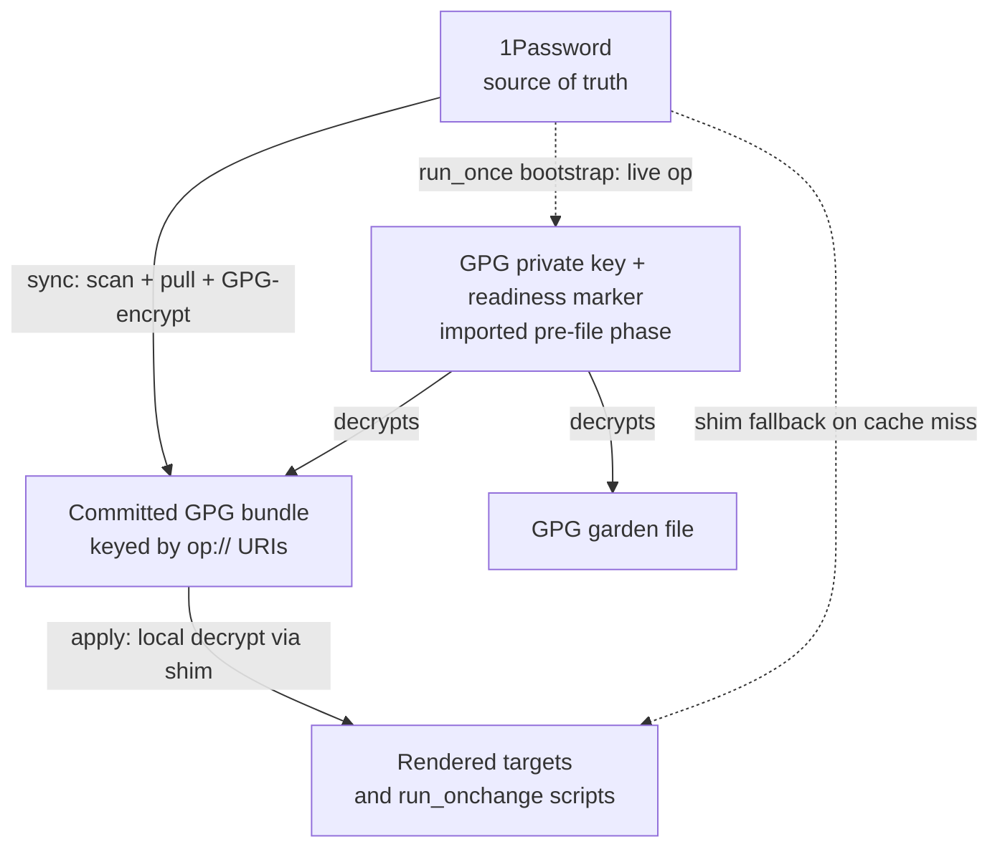
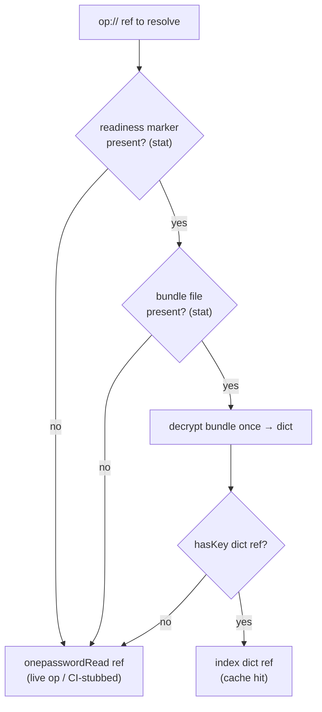

# GPG Secret Cache Migration - Plan

## Goal Capsule

- **Objective:** Take 1Password off the per-`chezmoi apply` hot path by resolving secrets from a committed GPG-encrypted cache instead of ~100 live `op` reads, cutting apply from ~1 minute to seconds while keeping 1Password as the source of truth.
- **Product authority:** the user, solo owner of `github.com/hyperlapse122/dotfiles`.
- **Execution profile:** infrastructure/template refactor — verify by isolated `chezmoi execute-template` render parity and an `apply` smoke/timing check, not by unit tests of secret values.
- **Stop conditions:** a GPG identity with no encryption-capable key (U1 pre-flight), or `gpg` prompting for a passphrase non-interactively during the file phase (breaks the fast-apply goal) — surface either rather than working around it.
- **Open blockers:** none. Planning-time forks are resolved as Key Technical Decisions below.

**Product Contract preservation:** Product Contract preserved. Changed during planning (user-directed): R2, R4, R12, R13, R14 and Success Criteria refined from "op-free / fail-loud" to the **GPG-cache-preferred with live-`op` fallback** model. No requirement added or removed; product scope unchanged.

---

## Product Contract

### Summary

Introduce a committed, GPG-encrypted secrets bundle — keyed by the existing `op://` URIs — that `chezmoi apply` decrypts locally, replacing the live `onepasswordRead` calls. A single fallback shim resolves each `op://` ref from the bundle when GPG is ready and falls back to a live `onepasswordRead` when it is not, so the cache behaves like a cache (miss → fetch from source). An explicit `sync` command re-pulls values from 1Password and re-encrypts the bundle. 1Password stays the source of truth and the bootstrap delivery channel for the GPG private key; the `.age` garden file moves onto the same GPG backend as age is retired.

### Problem Frame

`chezmoi apply` currently resolves on the order of a hundred secrets by calling `onepasswordRead` (`op read`) at render time. Each call pays 1Password CLI process start plus a network round-trip, and they run serially, so a full apply takes about a minute. The cost is entirely in the *live-read-per-apply* pattern, not in 1Password as a store — using 1Password once at bootstrap is acceptable, but paying that cost on every apply is not. The values change rarely, so re-fetching them live on each apply is wasted work.

### Key Decisions

- **1Password stays the source of truth, off the apply hot path.** Secrets are authored and rotated in 1Password; a ready host's apply never reads it. This targets the speed problem without maintaining secrets in two systems.
- **The GPG bundle is a cache, not a second source.** It is a committed, git-shared, GPG-encrypted materialization of the 1Password values. Invalidation is manual (`sync`) with no TTL, so repo values may lag 1Password until the next `sync` — an accepted trade-off.
- **Resolution is cache-preferred with live-`op` fallback.** One shim serves every `op://` site: use the bundle when the GPG key is ready, otherwise fall back to `onepasswordRead`. This removes any phase-ordering fragility (a site that renders before the key exists simply falls back) and gives true cache-miss semantics.
- **The cache is a single bundle keyed by `op://` URIs (Approach A).** The `op://` refs in data files and the central `resolve-op-refs-json.tmpl` resolver keep their shape; only the resolver's leaf and the direct-call sites change. This is the smallest, lowest-risk diff.
- **One global encryption backend; age retired.** chezmoi's `encryption` is a single global setting, so switching to `gpg` moves the garden file too (`.age` → GPG), and the age identity plus its bootstrap script are removed.
- **The `run_once` bootstraps stay on live `op`.** The GPG key import delivers the key that decrypts the cache (so it can't read the cache), and the Tailscale auth key is read via shell `op read` (out of a template shim's reach); both are one-time and off the hot path. The key import moves to the pre-file phase, and a per-apply probe keeps a readiness marker in sync with the key's actual decrypt-ability.

### Requirements

**Secret cache and resolution**
- R1. A single GPG-encrypted bundle holds every migrated secret value, keyed by its `op://` URI.
- R2. A single fallback shim replaces every template-time `onepasswordRead` `op://` call site except the GPG key import: it returns the value from the decrypted bundle when GPG is ready and falls back to a live `onepasswordRead` when it is not. (Shell `op read` calls are out of a template shim's reach — see R12.) On a GPG-ready host, no hot-path render performs a live `op` read.
- R3. The central `resolve-op-refs-json.tmpl` resolver and the `op://` refs embedded in `.chezmoidata/agents.yaml` and `.chezmoidata/networking.yaml` keep their current shape — only the resolver's resolution leaf changes from live read to shim lookup.
- R4. A cache miss — readiness marker or bundle file absent, or the requested `op://` ref not present in the decrypted bundle — falls back to a live `onepasswordRead` rather than failing or rendering empty. Because the marker attests non-interactive decrypt-ability (R11/KTD2), a locked, expired, or rotated key reads as not-ready and falls back rather than hard-failing mid-render. Only a genuinely corrupt bundle (the key can decrypt, but the content is malformed) surfaces as a hard error.

**Sync workflow**
- R5. An explicit `sync` command discovers the `op://` refs, reads their current values from 1Password, encrypts them into the bundle, and writes it to the chezmoi source tree for the user to commit.
- R6. `sync` is fully decoupled from `chezmoi apply`; apply never triggers it. Rotating a secret is: edit in 1Password → `sync` → commit → push → apply on each host.
- R7. `sync` needs only 1Password access and the GPG public key, so it runs on any authenticated host without the private key.

**Encryption backend and garden file**
- R8. chezmoi's encryption backend is `gpg` with the user's existing GPG identity as recipient; the `age` backend configuration is removed.
- R9. `src/encrypted_readonly_garden.yaml.age` is re-encrypted under the GPG backend and renamed accordingly; `chezmoi edit` of the garden file continues to work transparently under GPG, and the existing container/Windows chezmoiignore skip for it is preserved.
- R10. The age identity provisioning script and the committed age recipient are removed once nothing depends on age.

**Bootstrap and phase ordering**
- R11. The GPG private-key import runs in the pre-file (`run_once_before`) phase, and a separate per-apply `run_before` probe writes or removes the readiness marker based on a non-interactive test-decrypt — both ordered before the file phase — so cache and garden decryption have the key available and the marker reflects current decrypt-ability, not merely that an import once ran.
- R12. Two `run_once` bootstrap sites always resolve from live `op` because a template-time shim cannot intercept them: the GPG key import (`onepasswordRead`) and the Tailscale auth key read via shell `op read` in `.chezmoiscripts/10-auth/run_once_after_auth-tailscale.sh.tmpl`. Both are one-time and off the steady-state hot path. All other (template-time `onepasswordRead`) `op://` sites use the fallback shim; on a not-yet-ready host they fall back to `op` automatically.
- R13. On a fresh host, the guaranteed `op` reads are the two `run_once` bootstrap sites (GPG key import and the Tailscale shell `op read`); any template site that renders before the key import on the first apply falls back to `op` once. Every subsequent steady-state apply is `op`-free.

**CI and isolated verification**
- R14. In CI and isolated verification there is no GPG private key, so the readiness marker is absent and the shim falls back to the `op` path — the existing `op` stub covers it with no new decryption stub required. The readiness probe must read as not-ready whenever the marker is absent.

### Key Flows

- F1. Everyday apply — op-free
  - **Trigger:** `chezmoi apply` on a GPG-ready host.
  - **Steps:** The shim sees the readiness marker and the bundle, decrypts the bundle once per consuming template, and serves each `op://` lookup from it; target files and `run_onchange` scripts render. No `op` process runs.
  - **Outcome:** Apply completes in seconds; secrets match the last `sync`.
  - **Covered by:** R1, R2, R4, R13.

- F2. Secret rotation / sync
  - **Trigger:** A secret changes in 1Password, or a new `op://` ref is added.
  - **Steps:** Run `sync` → it scans the source for `op://` refs, pulls their values from 1Password, re-encrypts the bundle, and writes it to source → the user commits and pushes → each host applies.
  - **Outcome:** The cache is refreshed and other hosts pick it up via git.
  - **Covered by:** R5, R6, R7.

- F3. Fresh-host bootstrap
  - **Trigger:** First `chezmoi apply` on a new machine.
  - **Steps:** Pre-file phase imports the GPG private key from 1Password (live `op`, once) and writes the readiness marker; the file phase then decrypts the committed bundle and garden file with that key. Any site rendering before the key import falls back to `op` for that first apply.
  - **Outcome:** New host is provisioned; only the one-time key import (and at most a few pre-key sites) touched 1Password.
  - **Covered by:** R11, R12, R13.

### Visualization

Source-of-truth fan-out and the two independent paths — `sync` fills the cache, `apply` reads it, and a one-time bootstrap delivers the key that decrypts both the cache and the garden file:

### Success Criteria

- Zero live `op` reads on a steady-state (no-change) `chezmoi apply` on a GPG-ready host — except the one-time `run_once` bootstraps on a fresh host.
- Apply wall-clock drops from ~60s to a few seconds (local GPG decrypt only).
- A fresh host's only guaranteed `op` reads are the two `run_once` bootstraps (GPG key import and the Tailscale shell read), and it is `op`-free on every subsequent steady-state apply.
- No secret regresses: each migrated secret renders identically to its pre-migration live value after a `sync`.

### Scope Boundaries

**Deferred for later**
- Fully retiring 1Password — this pass keeps it as source and bootstrap.
- Re-keying secrets to human-readable names (the Approach A → B evolution).

**Outside this pass**
- Changing which secrets exist, or rotating the credentials themselves.
- Adopting a hardware token (YubiKey) or otherwise hardening GPG key storage beyond what the user already has.

### Dependencies / Assumptions

- The user's existing GPG identity has an **encryption-capable (sub)key**, not signing-only. Verified in U1; if signing-only, an encryption subkey must be added first (stop condition).
- `gpg-agent` decrypts non-interactively (cached passphrase, loopback pinentry, or an unprotected key). The per-apply decrypt-ability probe (KTD2) makes a host that cannot currently decrypt non-interactively — passphrase-protected key with a cold agent, locked or absent key — degrade to the `op` fallback (slow apply) rather than prompt or hard-fail. To keep applies fast, the key should be decryptable non-interactively (unprotected, or agent-cached / loopback pinentry).
- Accepted risk: one GPG key guards the entire bundle and its ciphertext is permanent in public git history, so a private-key compromise exposes all cached secrets at once. Key-protection hardening is out of scope for this pass.
- Solo, single-owner repo: the age → gpg backend switch needs no multi-party migration window.

### Outstanding Questions

**Deferred to Implementation**
- Exact source path for the committed bundle and the precise `include | decrypt | fromYaml` invocation. `.chezmoitemplates/` files are eager-parsed as Go templates; an armored PGP blob has no `{{` so it parses as a literal (safe), but confirm this versus chezmoi's documented root-level `.`-prefixed placement.
- Whether each host's key is decryptable non-interactively — this only determines whether that host's apply is fast (cache) or slow (`op` fallback), not correctness, since the decrypt-ability probe (KTD2) routes automatically.

**Accepted residual (out of scope for this pass)**
- The bundle is encrypted but **not signed**: the shim trusts any bundle that decrypts, so an attacker who substitutes a validly-encrypted bundle (public repo, known recipient) could inject chosen secret values into rendered config. Bounded by the plan's trusted-git-remote, solo-owner threat model; signing + verification (`gpg --sign --encrypt` plus reader-side verify) is the mitigation if that model changes.

---

## Planning Contract

### Key Technical Decisions

- **KTD1. Unified fallback shim (`secret-read.tmpl`), GPG-cache-preferred with live-`op` fallback.** One shim serves every `op://` site. Rationale: eliminates phase-ordering fragility (a pre-key render falls back), gives true cache-miss semantics, and degrades gracefully (a stale/incomplete bundle yields a slow-but-correct read, never a broken apply).
- **KTD2. Non-erroring readiness probe via a per-apply decrypt-ability marker.** chezmoi's Go templates cannot `try/catch` a failed `decrypt`, so readiness must be probed without erroring. A per-apply `run_before` probe attempts a non-interactive `gpg --batch --no-tty --decrypt` of the committed bundle: on success it writes the marker (e.g. `~/.config/chezmoi/gpg-cache-ready`), on any failure (locked, absent, or rotated key; cold agent; no bundle yet) it removes the marker. The shim treats GPG as ready only when the marker **and** the bundle file both `stat` present; absent either → fall back to `op`. Because the probe runs every apply, the marker tracks whether the key can decrypt *now* — not merely that an import once ran — so a host that loses decrypt-ability (agent-cache expiry, keyring wipe, `$HOME` restored without `~/.gnupg`) degrades to the `op` fallback instead of hard-failing every apply.
- **KTD3. Decrypt once per consuming template, not per leaf — and re-thread through the recursion.** `resolve-op-refs-json.tmpl` recurses by building a fresh `(dict "value" … "indent" …)` at every level, so there is no ambient context: the pre-decrypted secrets dict and readiness must be added as new dict keys **and re-passed at BOTH recursive `includeTemplate` calls (the map branch and the slice branch)**. Miss either and every *nested* ref — most of the ~100, e.g. `agents.yaml` provider keys and `networking.yaml` psk — sees no dict, reads not-ready, and silently falls back to `op` while render parity still passes (the fallback returns the correct value). Each consuming template decrypts once; direct sites call `secret-read.tmpl`, which decrypts once per call. Net ≈ a handful of local GPG decrypts per apply (sub-second) versus ~100 network `op` reads.
- **KTD4. Single global GPG backend; age retired.** `encryption = "gpg"` with `[gpg] recipient = <fingerprint>`; the garden file is re-encrypted `.age` → `.asc`; the `[age]` block, committed age recipient, and age-key bootstrap script are removed. The garden's container/Windows chezmoiignore skip is preserved.
- **KTD5. Bundle = one committed GPG-encrypted YAML** mapping `op://` URI → value, read via `include | decrypt | fromYaml`. It is not a chezmoi target (no `encrypted_` prefix) and not `.chezmoidata` (which loads in cleartext); it lives at a dot-prefixed / templates source path the shim `include`s as raw ciphertext. `sync` writes it by piping the assembled cleartext straight into `gpg` over stdin — a plaintext bundle file is never written to the source tree — and a `.chezmoiignore` / gitignore rule rejects any non-`.asc` `secrets-bundle*` path so a plaintext variant can never be committed.
- **KTD6. `sync` enumerates `op://` refs by scanning the source tree, with exact extraction and an explicit exclusion set.** Self-maintaining: a newly added `op://` ref is picked up on the next `sync`, and the fallback shim makes a not-yet-synced ref graceful (slow, not broken). Two hardening constraints: (a) extract each ref by exact quote/YAML-aware parsing (not a whitespace-stopping grep) because most refs contain spaces (`op://Private/WakaTime/API Key`), keying each bundle entry by the byte-identical string the shim looks up; (b) exclude refs the shim can never serve — the GPG-key-import ref (scanning and `op read`ing it would bake the **private key** into the public bundle) and shell `op read` refs (Tailscale) — so the bundle holds only render-time-resolved secrets. A hand-kept manifest was rejected as duplicative.
- **KTD7. The GPG key import moves to `run_once_before`; a per-apply `run_before` probe maintains the marker.** The import delivers the decrypting key (chicken-and-egg: an always-live-`op` bootstrap); a separate every-apply probe, ordered after the import and before the file phase, keeps the readiness marker in sync with current decrypt-ability so cache/garden decryption is only attempted when it will succeed.

### High-Level Technical Design

Shim resolution logic (`secret-read.tmpl` and the `resolve-op-refs-json.tmpl` leaf share this decision). Directional guidance, not implementation specification:

Phase ordering that makes it work (chezmoi runs `run_once_before` scripts ahead of the file phase):

On a ready host the per-apply probe re-confirms decrypt-ability and (re)writes the marker before the file phase, so the file phase hits the cache; a host that has lost decrypt-ability has its marker removed and degrades to the `op` fallback.

### Planning Assumptions

- The migration is performed on a host that has both the age identity (to decrypt the current garden file) and the GPG public key (to re-encrypt it and build the bundle).
- The bundle's committed-ciphertext-in-public-history risk (one GPG key guards it) is already accepted (Product Contract).
- `run_onchange` auth scripts (`10-auth`, `30-linux` wifi) are not a per-apply cost; with the fallback shim they use the cache when ready and `op` otherwise, requiring no special handling.

### Sequencing

U1 → U2 (age retirement; land with U1 so no host is left on a GPG garden without a pre-file key import) → U3 → U4 → U5 (then run `sync` to materialize the first bundle) → U6. U4 is behavior-preserving — every site falls back to `op` until U5's bundle is committed — so each unit boundary keeps apply working.

---

## Implementation Units

### U1. Move GPG key import to the pre-file phase; add a per-apply decrypt-ability marker

- **Goal:** Make the GPG key available before the file phase, and maintain a readiness marker that reflects whether the key can decrypt *now* — without touching age yet.
- **Requirements:** R11, R12, R13; KTD2, KTD7.
- **Dependencies:** none.
- **Files:**
  - `.chezmoiscripts/80-keys/run_once_after_import-gpg-key.sh.tmpl` → rename to `.chezmoiscripts/80-keys/run_once_before_import-gpg-key.sh.tmpl`
  - `.chezmoiscripts/80-keys/run_before_probe-gpg-cache-ready.sh.tmpl` (new) — per-apply decrypt-ability probe, ordered after the import.
- **Approach:** Rename the import to the `before` phase (renaming a `run_once_` script re-runs it once). Keep its `onepasswordRead` of the GPG private key and the `expect`-driven trust step; it no longer writes the marker. Add a separate per-apply `run_before` probe, ordered after the import and before the file phase, that attempts a non-interactive `gpg --batch --no-tty --decrypt` of the committed bundle: on success it writes the marker (`~/.config/chezmoi/gpg-cache-ready`, 0600); on any failure (locked/absent/rotated key, cold agent, or no bundle yet) it removes the marker. The marker therefore reflects current decrypt-ability, so a host that loses it degrades to the `op` fallback (R4) instead of hard-failing. Pre-flight (verification, not a code change): confirm the imported identity exposes an **encryption-capable (sub)key** (`gpg --list-keys` capability flags) and that `gpg --batch --no-tty --decrypt` runs non-interactively under the host's `gpg-agent`. Age is left fully working in this unit.
- **Execution note:** Verify by isolated render (script lands in the right phase) plus an `apply` smoke check for the real import + marker behavior.
- **Patterns to follow:** `.chezmoiscripts/80-keys/run_once_before_import-age-key.sh.tmpl` (the existing pre-file key provisioning it mirrors).
- **Test scenarios:**
  - Renamed import renders into the `before` phase (GPG-key `onepasswordRead` op-stubbed) and no longer contains a marker-write.
  - Probe with a decryptable bundle + available key writes the marker; probe with no bundle, or a simulated non-zero `gpg` (locked/absent key), removes the marker and exits 0 (never hard-errors).
  - `Test expectation: partial` — real import, real agent decrypt, and marker-on-disk are verified by an `apply` smoke check on a real host.

### U2. Retire age: switch the backend to GPG and migrate the garden file

- **Goal:** Flip chezmoi's single encryption backend to GPG and move the one existing encrypted file across, removing age entirely.
- **Requirements:** R8, R9, R10; KTD4.
- **Dependencies:** U1 (a pre-file GPG key must exist before a GPG-encrypted garden file decrypts in the file phase).
- **Files:**
  - `.chezmoi.toml.tmpl` — replace `encryption = "age"` + `[age]` block with `encryption = "gpg"` + `[gpg] recipient = <fingerprint>`; update the surrounding comment.
  - `src/encrypted_readonly_garden.yaml.age` → re-encrypt and rename to `src/encrypted_readonly_garden.yaml.asc`.
  - `.chezmoiscripts/80-keys/run_once_before_import-age-key.sh.tmpl` — delete.
  - `.chezmoiignore` — confirm the garden skip still matches the renamed `.asc` path for containers/Windows.
- **Approach:** Decrypt the current garden file with the age identity, re-encrypt to the GPG recipient, and commit the `.asc` form; delete the `.age` file and the age key script. Confirm `chezmoi edit ~/src/garden.yaml` still round-trips under GPG. Land together with U1 so no applied host encounters a GPG garden without a pre-file key import.
- **Execution note:** Smoke-first — the proof is that `chezmoi cat`/decrypt of the new `.asc` garden equals the old age plaintext, and `chezmoi edit` works.
- **Patterns to follow:** the existing `.chezmoi.toml.tmpl` `[age]` block shape; the garden-edit workflow in `AGENTS.md`.
- **Test scenarios:**
  - Decrypted `.asc` garden content is byte-identical to the pre-migration age plaintext.
  - `chezmoi execute-template` on `.chezmoi.toml.tmpl` renders a valid `[gpg]` block with the correct recipient and no `[age]` residue.
  - Container/Windows render still chezmoi-ignores the garden file (no attempt to decrypt).
  - `Covers R8, R9, R10.`

### U3. Bundle reader and readiness helpers

- **Goal:** Provide the decrypt-once bundle reader and the non-erroring readiness probe the shim depends on.
- **Requirements:** R1, R4; KTD2, KTD3, KTD5.
- **Dependencies:** U1 (marker), U2 (GPG `decrypt` backend).
- **Files:**
  - `.chezmoitemplates/secrets-bundle.tmpl` (new) — returns the decrypted secrets dict, or a not-ready sentinel.
  - `.chezmoitemplates/secrets-bundle.yaml.asc` (new, produced by U5) — the committed bundle; a small fixture is used for tests until U5 lands.
- **Approach:** `secrets-bundle.tmpl` probes readiness (marker `stat` **and** bundle-file `stat`); when ready it `include`s the bundle ciphertext, `decrypt`s and `fromYaml`s it once, and returns the dict; when not ready it returns an explicit empty/not-ready value the shim can detect. Keep the readiness/decrypt logic here so both the shim and the resolver share one implementation.
- **Execution note:** Build against a fixture bundle so render-parity tests run before U5 exists.
- **Patterns to follow:** `.chezmoitemplates/fingerprint.tmpl` (a `.chezmoitemplates` helper using `stat`/`include`); the `decryptAES`/skip-path precedent in `.chezmoiscripts/30-linux/run_onchange_after_luks-tpm2.sh.tmpl` for graceful "key unavailable" degradation.
- **Test scenarios:**
  - Marker + fixture bundle present → returns a dict with the fixture's `op://` keys.
  - Marker absent → returns the not-ready sentinel without erroring.
  - Marker present but bundle file absent → not-ready sentinel (no `include` error).
  - `Covers R4` (the not-ready and missing-bundle branches).

### U4. Fallback shim and call-site rewiring

- **Goal:** Route every `op://` site (except the GPG key import) through the cache-preferred, op-fallback shim.
- **Requirements:** R2, R3, R4; KTD1, KTD3.
- **Dependencies:** U3.
- **Files:**
  - `.chezmoitemplates/secret-read.tmpl` (new) — the shim: given a ctx + `op://` ref, return the cache value when ready+present, else `onepasswordRead`.
  - `.chezmoitemplates/resolve-op-refs-json.tmpl` — change the `op://` leaf (line ~55) from `onepasswordRead $value` to a shim lookup, and add `secrets`/`ready` keys to the dict that is **re-passed at both recursive `includeTemplate` calls** (the map branch, line ~39, and the slice branch, line ~50) so nested refs keep the pre-decrypted dict (see KTD3).
  - Resolver call sites (decrypt once, pass the dict): `dot_config/opencode/readonly_opencode.json.tmpl`, `dot_gemini/config/readonly_mcp_config.json.tmpl`, `dot_pi/agent/private_readonly_mcp.json.tmpl`, `dot_pi/agent/private_readonly_settings.json.tmpl`, `dot_agents/private_readonly_agents.toml.tmpl`, `.chezmoiscripts/70-agents/run_onchange_after_config-pi-auth.sh.tmpl`, `dot_local/bin/private_executable_import-wifi-1password.tmpl`.
  - Direct sites → `secret-read.tmpl`: `dot_wakatime.cfg.tmpl`, `dot_local/bin/private_executable_tokscale.tmpl`, `.chezmoiscripts/10-auth/run_onchange_after_auth-gitlab.sh.tmpl`, `.chezmoiscripts/10-auth/run_onchange_before_auth-github.sh.tmpl`.
  - Explicitly unchanged: `.chezmoiscripts/80-keys/run_once_before_import-gpg-key.sh.tmpl` (the always-live-`op` key import).
- **Approach:** Preserve the resolver's public contract (still returns JSON with `op://` strings replaced by values); only the resolution mechanism changes. With no bundle committed yet, the readiness probe fails and every site falls back to `op` — behavior identical to today — so this unit is safe to land before U5.
- **Execution note:** Render-parity is the gate: each rewired template must render byte-identically to the pre-change output when forced down the `op` path (fallback), and correctly when forced down the cache path (fixture bundle + fake marker).
- **Patterns to follow:** the existing `includeTemplate "resolve-op-refs-json.tmpl" (dict "value" ...)` call sites; `onepasswordRead` direct-call shape.
- **Test scenarios:**
  - Fallback path: no marker, op-stubbed → each rewired template renders identically to the current output.
  - Cache path: fake marker + fixture bundle → each rewired template renders the fixture values, no `op` invocation.
  - Cache path with a **nested** ref (a value inside a map/slice, e.g. an `agents.yaml` provider key) → served from cache with zero `op` invocation (guards the KTD3 re-threading through both recursive branches).
  - Resolver recursion still emits deterministic lexically-ordered JSON for nested maps/slices (regression of its existing behavior).
  - Missing ref in an otherwise-ready bundle → that one value falls back to `op`, rest served from cache.
  - `Covers R2, R3, R4.`

### U5. `sync` command and initial bundle materialization

- **Goal:** Produce and refresh the committed bundle from 1Password.
- **Requirements:** R5, R6, R7; KTD5, KTD6.
- **Dependencies:** U2 (GPG recipient), U3 (bundle path/format contract).
- **Files:**
  - `dot_local/bin/executable_chezmoi-secrets-sync` (new) — the sync CLI.
- **Approach:** Extract `op://` refs from the source tree by exact quote/YAML-aware parsing (refs contain spaces — key each entry byte-identically to what the shim looks up), applying the KTD6 exclusion set: skip the GPG-key-import ref (never bake the private key into the public bundle) and shell `op read` refs (Tailscale). `op read` each remaining value, assemble the `op:// → value` YAML, and pipe it over **stdin** into `gpg --encrypt --armor --recipient <fingerprint>`, capturing stdout to `.chezmoitemplates/secrets-bundle.yaml.asc` — never writing a plaintext bundle file to the source tree. Fail loudly if `op` is unauthenticated or the recipient key is missing. Decoupled from apply; documented as the rotation step. After landing, run it once to materialize the first real bundle.
- **Execution note:** Verify with a stubbed `op` in a scratch checkout — assert the emitted (pre-encryption) map contains exactly the scanned `op://` set.
- **Patterns to follow:** existing `dot_local/bin/private_executable_*` deployed CLIs; the source-scanning shape of `.chezmoitemplates/fingerprint.tmpl`.
- **Test scenarios:**
  - Scan finds every render-time `op://` ref across data files and templates (compare against a known grep of the source, minus the exclusion set).
  - The GPG-key-import ref and shell `op read` refs (Tailscale) are absent from the emitted map (exclusion set holds).
  - A space-containing ref (e.g. `op://Private/WakaTime/API Key`) is keyed byte-identically and, rendered through the shim against this real bundle, produces zero `op` spawns.
  - No plaintext bundle file is ever written to the source tree (only the `.asc`).
  - Round-trip: encrypt then `gpg --decrypt` yields the same map.
  - `op` unauthenticated → the command fails with a clear message, writing no partial bundle.
  - New `op://` ref added to source → next `sync` includes it.
  - `Covers R5, R6, R7.`

### U6. CI and isolated-verification alignment

- **Goal:** Confirm renders without a GPG key resolve via the existing `op` stub, and document the model.
- **Requirements:** R14.
- **Dependencies:** U4.
- **Files:**
  - `.github/workflows/render-dotfiles.yml` — confirm/adjust so the readiness marker is absent (shim → `op` path → existing stub); update the op-stub comments to reflect the fallback model.
  - `AGENTS.md` — update the isolated-verification note (the `op` stub still applies; no GPG key means the fallback path).
- **Approach:** No new decryption stub is needed — with no marker the shim falls back to `op`, which CI already stubs. Verify the readiness probe reads not-ready when `$HOME` has no marker, and that CI render output is unchanged from today.
- **Execution note:** Smoke — a green `render-dotfiles.yml` run is the proof.
- **Patterns to follow:** the existing `op` stub blocks in `.github/workflows/render-dotfiles.yml`.
- **Test scenarios:**
  - CI render with no marker resolves all `op://` sites via the stubbed `op` (non-empty placeholders), matching current CI behavior.
  - Readiness probe returns not-ready given an empty `$HOME`.
  - `Test expectation: none for new behavior` — this unit is verification + doc/comment alignment.

---

## Verification Contract

| Check | How | Applies to |
|---|---|---|
| Render parity (fallback) | Isolated `chezmoi execute-template` with op-stub and no marker; output byte-identical to pre-change | U4, U1 |
| Render parity (cache) | Isolated render with a fake marker + fixture bundle; values come from the bundle, `op` never invoked | U3, U4 |
| Garden migration | `gpg --decrypt` of `src/encrypted_readonly_garden.yaml.asc` equals the old age plaintext; `chezmoi edit` round-trips | U2 |
| Backend config | `.chezmoi.toml.tmpl` renders a valid `[gpg]` block, no `[age]` residue | U2 |
| Sync round-trip | Stubbed `op` in a scratch checkout; scanned `op://` set == bundle keys; encrypt→decrypt identity | U5 |
| CI render | `render-dotfiles.yml` green via the `op` fallback stub | U6 |
| Apply timing (real host) | Steady-state `chezmoi apply`: 0 `op` invocations, wall-clock in seconds (trace `op` process spawns) | DoD |
| Bootstrap (fresh host) | First apply reads `op` only for the key import; subsequent applies `op`-free | DoD |

Use the AGENTS.md isolated verification harness (per-user scratch, stub `op`, `--source "$PWD"`) for all `execute-template` checks; scripts are compared as rendered text on both sides. The first apply that re-runs `install-system-30-network` (if triggered) must be from a local console, not SSH — unchanged by this work but noted.

---

## Definition of Done

- All six units landed; age fully removed (no `[age]` config, no age-key script, no `.age` file); the garden file is GPG (`.asc`) and `chezmoi edit` works.
- The GPG key import runs in the `run_once_before` phase and a per-apply `run_before` probe maintains the decrypt-ability marker; the always-live-`op` sites are the two `run_once` bootstraps (key import and the Tailscale shell read).
- The committed GPG bundle exists (materialized by `sync`) and, on a GPG-ready host, a steady-state `chezmoi apply` performs **0 `op` reads** and completes in seconds (verified by tracing `op` spawns and timing).
- A fresh-host bootstrap reads `op` only for the two `run_once` bootstrap sites (GPG key import and the Tailscale shell read), plus at most a few pre-key template fallbacks on the first apply, and is `op`-free on subsequent steady-state applies.
- Every migrated secret renders identically to its pre-migration value after a `sync` (render parity holds on both the cache and fallback paths).
- `render-dotfiles.yml` and `ci.yml` are green; `AGENTS.md` verification notes reflect the fallback model.
- `sync` is documented as the rotation step (edit in 1Password → `sync` → commit → push → apply).
