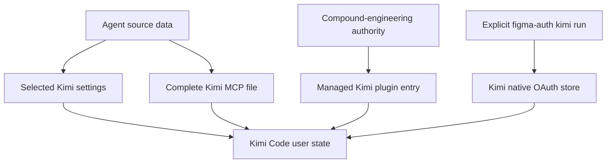
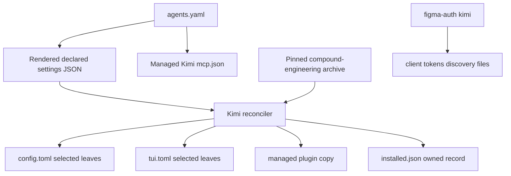
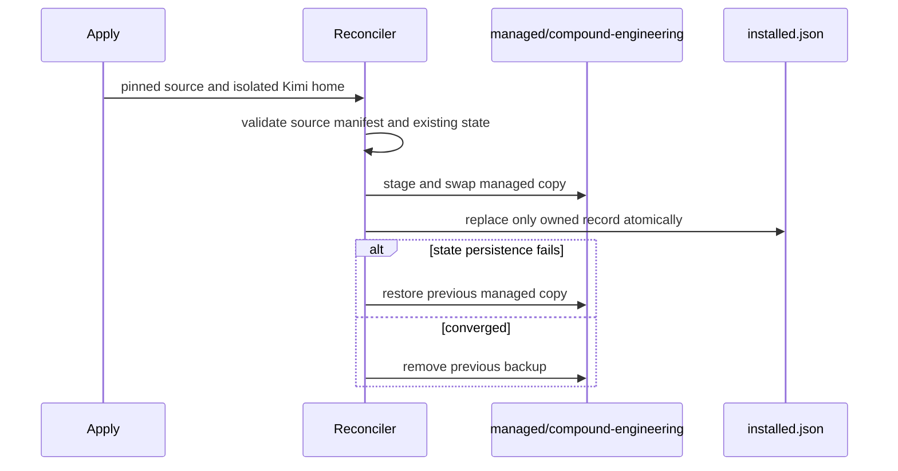

# Kimi Code Managed Integration - Plan

## Goal Capsule

- **Objective:** Complete every TODO introduced by the Kimi Code base configuration so settings, MCP servers, Figma OAuth, and compound-engineering are reproducible through the repository's established agent-management patterns.
- **Product authority:** The user's ownership decisions define managed versus user-owned state; `.chezmoidata/agents.yaml`, existing agent integrations, and the official Kimi Code and compound-engineering contracts define supported behavior.
- **Execution profile:** Cross-surface configuration work with a tested compiled reconciler, isolated Kimi homes, and render verification; do not apply to the live home directory.
- **Stop conditions:** Stop rather than replace malformed or unsafe live state, publish an invalid plugin manifest, overwrite unrelated credentials or plugins, or invent unsupported Windows plugin parity.
- **Tail ownership:** LFG owns implementation, review, commit, PR creation, and CI observation.
- **Open blockers:** None. Runtime details that remain implementation discoveries are bounded by the contracts below.

---

## Product Contract

### Summary

Kimi Code will become a fully managed agent surface by extending the repository's existing settings reconciliation, MCP rendering, on-demand Figma OAuth, and apply-owned plugin patterns. Each surface retains the ownership model appropriate to its live state instead of introducing one Kimi-specific management system.

### Problem Frame

The base Kimi configuration declares intended settings and a Figma MCP server, but it leaves five TODOs across configuration merging, shared MCP propagation, native OAuth storage, compound-engineering installation, and ownership documentation. As a result, apply cannot yet reproduce the intended Kimi state, and completing setup still depends on manual edits or commands whose ownership is not documented.

### Key Decisions

- **Treat all Kimi TODOs as one coherent outcome.** (session-settled: user-directed — chosen over separate plans per integration surface: Kimi setup is complete only when every TODO introduced by the base configuration is resolved.)
- **Reuse the closest established pattern for each surface.** (session-settled: user-directed — chosen over a Kimi-specific reconciler or Kimi CLI-centered management layer: existing agent patterns reduce duplicate behavior and carrying cost.)
- **Own selected TOML settings, not the whole file.** (session-settled: user-directed — chosen over rendering and replacing the complete Kimi configuration: managed keys must converge while unrelated user and authentication state survives.)
- **Own the complete MCP file.** (session-settled: user-directed — chosen over merging user-defined MCP entries: Kimi must consume the same shared MCP authority as Pi and Gemini.)
- **Automate compound-engineering through apply.** (session-settled: user-directed — chosen over a documented manual Kimi command: a fresh or updated host must converge without an interactive install step.)
- **Reconcile Kimi's internal plugin state.** (session-settled: user-directed — chosen over requiring Kimi's supported interactive trust flow: Kimi exposes no supported unattended plugin interface, so apply may manage only compound-engineering's installed record and managed copy while preserving every unrelated plugin.)
- **Keep Figma authorization on demand.** (session-settled: user-approved — chosen over authenticating during apply: OAuth tokens belong only in Kimi's native credential store and require an explicit user action.)
- **Preserve unrelated Kimi plugins.** (session-settled: user-approved — chosen over reconciling the full plugin inventory: apply owns compound-engineering only and must not remove user-installed plugins.)

### Managed-State Model

The settings path owns only declared keys, the MCP path owns its complete file, the plugin path owns only compound-engineering, and the OAuth path runs only on explicit user request.

### Requirements

**Settings ownership**

- R1. Apply must set every Kimi settings key declared by the agent data, replacing the live value for those keys when it differs.
- R2. Settings reconciliation must preserve the semantic values of undeclared TOML keys, authentication material, and other user-owned state without requiring byte-identical formatting or comment preservation.
- R3. Repeated apply runs against an already-converged Kimi configuration must not produce further state changes.

**MCP ownership**

- R4. Kimi's managed MCP file must render the complete shared MCP server set in Kimi's supported schema rather than carrying a Kimi-only server list.
- R5. MCP rendering must preserve shared validation and secret-resolution rules while omitting OAuth tokens and other native credential state.
- R6. Changes to the shared MCP authority must propagate to Kimi on the next apply, and user edits to the managed MCP file may be replaced.

**Figma authorization**

- R7. `figma-auth kimi` must run a fresh Figma OAuth flow and atomically store the completed session in Kimi's native credential format.
- R8. Kimi authorization must preserve unrelated native credential entries and must not write tokens into source state or rendered MCP configuration.
- R9. Apply must never initiate Figma OAuth; an unauthenticated Kimi setup remains valid until the user explicitly runs the authorization command.

**Plugin management**

- R10. Apply must install or update compound-engineering by reconciling Kimi's internal plugin record and managed copy without requiring a user to run a Kimi session command.
- R11. Plugin reconciliation must own only compound-engineering and preserve every unrelated user-installed Kimi plugin.
- R12. A completed install or update must become available through Kimi's documented reload or next-session behavior.

**Ownership clarity**

- R13. Kimi data and managed targets must explain which state is wholly managed, selectively reconciled, apply-owned, or user-authorized.
- R14. Every TODO introduced by the Kimi base-configuration commit must be removed because its behavior is implemented or its ownership is captured by the resulting source.

### Key Flows

- F1. Apply Kimi managed state
  - **Trigger:** The Kimi source data, shared MCP data, compound-engineering source, or owning apply logic changes.
  - **Actors:** Chezmoi apply and Kimi Code's supported configuration and plugin surfaces.
  - **Steps:** Reconcile selected settings, render the complete MCP file, and ensure the owned plugin entry is installed or updated without altering unrelated state.
  - **Outcome:** Kimi converges to the declared managed state without manual setup commands.
  - **Covered by:** R1-R6, R10-R14.
- F2. Authorize Figma for Kimi
  - **Trigger:** The user runs `figma-auth kimi` when Figma MCP access is needed.
  - **Actors:** The user, `figma-auth`, Figma OAuth, and Kimi's native credential store.
  - **Steps:** Complete a fresh OAuth session and atomically update only the Kimi credential entry owned by Figma authorization.
  - **Outcome:** The already-managed Figma MCP server can authenticate without exposing tokens to chezmoi source state.
  - **Covered by:** R7-R9.

### Acceptance Examples

- AE1. **Covers R1-R3.** Given a live Kimi TOML file with user-owned keys and stale values for managed keys, when apply runs, then managed values converge while undeclared state remains and a second apply is unchanged.
- AE2. **Covers R4-R6.** Given the shared MCP authority contains multiple supported servers, when Kimi's MCP target renders, then every server appears in Kimi's schema and an existing hand-edited managed file is replaced.
- AE3. **Covers R7-R9.** Given Kimi has no Figma credential, when apply runs, then no OAuth flow starts; when the user later runs `figma-auth kimi`, the Figma credential is stored atomically without changing unrelated credentials.
- AE4. **Covers R10-R12.** Given Kimi is available and compound-engineering is absent or outdated, when apply runs, then the plugin is installed or updated and becomes available after the supported reload boundary.
- AE5. **Covers R11.** Given the user has other Kimi plugins, when compound-engineering is reconciled, then those plugins remain installed and unchanged.
- AE6. **Covers R13-R14.** Given a future maintainer inspects the Kimi data and targets, when they trace ownership, then no Kimi TODO remains and each managed surface identifies its source of truth and preservation boundary.

### Scope Boundaries

- Do not change how the Kimi executable itself is installed; the standalone external is owned by the earlier CLI-management work.
- Do not manage the whole Kimi TOML file, authentication material, sessions, history, or other user-generated state.
- Do not preserve manual edits to the managed MCP file; shared MCP data is its sole authority.
- Do not authenticate Figma during apply or commit OAuth client data, access tokens, refresh tokens, or API keys.
- Do not remove, disable, or adopt ownership of Kimi plugins other than compound-engineering.
- Do not refactor the established Claude, Codex, Pi, OpenCode, AGY, or Gemini behavior except where a shared component must gain Kimi as an additional consumer.
- Do not claim Windows deployment parity for the new mutable-state utilities; MCP rendering remains cross-platform, while compiled utility installation and apply reconciliation remain POSIX-scoped until the repository has a Windows build/install lifecycle for them.

### Dependencies and Assumptions

- Kimi continues to support a user configuration TOML, a managed MCP JSON file, a native OAuth credential store, and a plugin interface suitable for compound-engineering.
- The official compound-engineering repository continues to ship a native Kimi plugin manifest and documents reload or next-session activation.
- A TOML-aware selected-key reconciliation path can preserve undeclared user state; the repository's current selected-key precedent is JSON, so the TOML mechanism is new work.
- Kimi exposes no supported unattended plugin interface, so the implementation must pin and validate the upstream internal state contract it intentionally consumes.

### Outstanding Questions

**Deferred to Implementation**

- Whether Kimi's current doctor command can validate an isolated configuration path without reading unrelated live state; the reconciler's parser and fixture tests remain the required proof if it cannot.

### Sources and Research

- `.chezmoidata/agents.yaml` — Kimi settings intent, shared MCP authority, and existing per-agent plugin ownership.
- `dot_kimi-code/private_readonly_mcp.json.tmpl` — current static Figma-only MCP target and its remaining TODOs.
- `packages/figma-auth/` — existing on-demand OAuth flow and native storage adapters to extend.
- `.chezmoiscripts/70-agents/` — existing apply-owned settings and plugin reconciliation behavior.
- [Kimi Code MCP customization](https://www.kimi.com/code/docs/en/kimi-code-cli/customization/mcp.html) — Kimi MCP configuration contract.
- [Compound Engineering Kimi Code CLI installation](https://github.com/EveryInc/compound-engineering-plugin#kimi-code-cli) — native plugin manifest, install forms, and reload behavior.

---

## Planning Contract

### Key Technical Decisions

- KTD1. **Use a tested standalone Kimi reconciler for mutable TOML and plugin state.** A compiled workspace utility will expose bounded settings and plugin operations so nested TOML merging, filesystem safety, rollback, and fixture tests live outside rendered shell. Use exact-pinned `smol-toml` `1.7.0`, the newest qualifying release older than one week, for semantic TOML parse and stringify.
- KTD2. **Split settings across Kimi's native TOML owners.** `default_model` and `thinking.*` belong in `config.toml`; `upgrade.auto_install` belongs in `tui.toml` under the current upstream contract. Both files receive the same recursive declared-leaf overlay and preserve undeclared semantic values. This implements **Own selected TOML settings, not the whole file** (session-settled: user-directed — chosen over rendering and replacing the complete Kimi configuration: managed keys must converge while unrelated user and authentication state survives.)
- KTD3. **Run mutable-state reconciliation on every apply.** A live user edit does not change a chezmoi source fingerprint, so onchange-only scripts cannot reassert managed settings or repair a missing owned plugin record or tree. Separate late `run_after_` wrappers are warranted because both operations are idempotent, live convergence is required, and malformed state must retry after the user repairs it.
- KTD4. **Render Kimi MCP from the shared data authority.** Map every declared stdio or HTTP server into Kimi's native schema, resolve declared headers through the shared secret resolver, validate transport and OAuth combinations, and emit no OAuth field or token. This implements **Own the complete MCP file** (session-settled: user-directed — chosen over merging user-defined MCP entries: Kimi must consume the same shared MCP authority as Pi and Gemini.)
- KTD5. **Write Kimi's native Figma OAuth record set as one recoverable generation.** `figma-auth kimi` will derive Kimi's store key from the exact `figma` name and canonical Figma URL, stage and validate the native client, token, and any newly supplied discovery document, then promote changed documents with rollback of every already-promoted owned file on failure. Discovery metadata is reusable server state under Kimi's native contract, so a flow that supplies no new discovery state preserves the existing discovery document and excludes it from that transaction. A later run must detect and repair an interrupted mixed generation before accepting new credentials. PKCE verifier and transient OAuth state remain memory-only. This implements **Keep Figma authorization on demand** (session-settled: user-approved — chosen over authenticating during apply: OAuth tokens belong only in Kimi's native credential store and require an explicit user action.)
- KTD6. **Install from the repository's pinned compound-engineering archive.** The Kimi plugin reconciler will validate and copy the already-managed release tree into Kimi's canonical managed root, avoiding a second release lookup and keeping every agent on the same compound-engineering release.
- KTD7. **Intentionally mirror Kimi's internal plugin transaction.** Stage and validate the new managed copy, preserve the prior owned record's enabled state, installation time, and capabilities, publish the copy, atomically replace only the compound-engineering record, and roll back content if state persistence fails. This implements **Reconcile Kimi's internal plugin state** (session-settled: user-directed — chosen over requiring Kimi's supported interactive trust flow: Kimi exposes no supported unattended plugin interface, so apply may manage only compound-engineering's installed record and managed copy while preserving every unrelated plugin.)
- KTD8. **Limit new mutable-state deployment to POSIX workstations.** The repository's compound-engineering archive, compiled-tool installers, and agent apply pipeline are currently Linux/macOS-only. MCP rendering remains cross-platform and the TypeScript logic stays portable, but Windows installation of the settings reconciler, `figma-auth`, and Kimi plugin state is not claimed in this work.
- KTD9. **Version the reconciler contract independently per operation.** Settings and plugin subcommands share only safe filesystem primitives, expose separate input contracts, and report a compiled contract version that every wrapper verifies before mutation. A preserved stale binary must fail closed instead of interpreting newer rendered data.
- KTD10. **Treat the user's Kimi home as a same-user trust boundary.** The reconciler defends against accidental symlinks, path escape, malformed state, and concurrent Kimi writes with no-follow checks and snapshot revalidation. It does not claim protection from a malicious same-UID process that can swap path components between filesystem operations; requiring platform-specific directory-handle APIs would exceed this personal dotfiles threat model.

### High-Level Technical Design

### Implementation Constraints

- New dependencies must remain exact-pinned and satisfy the repository's one-week cooldown rule; peer dependency ranges remain unchanged.
- Scratch state and tests must use `$XDG_RUNTIME_DIR` or a user cache fallback, never shared temporary directories.
- Mutable-file operations must reject symlinks and non-regular targets and must not turn malformed state into a fresh empty file.
- Mutable paths must remain beneath a canonical explicit Kimi home and reject symlinked parent components, traversal, special files, and unsafe ownership without chmodding unrelated parents.
- The plugin reconciler must preserve all unrelated plugin records and directories, plus user-controlled fields on the owned record, without reconstructing unrelated records through a narrow schema.
- Plugin source trees must reject escaping symlinks, traversal, and special files and must match the pinned compound-engineering manifest identity before publication. The pinned archive's three repository-internal compatibility links are validated to remain inside the source root and dereferenced into regular staging entries; no symlink is published into Kimi's managed tree.
- Internal plugin fixtures must cite the exact upstream revision and paths whose version-1 state, managed-copy, and manifest invariants they pin.
- A Kimi session may need `/reload` or a restart to observe plugin changes; apply does not drive a live Kimi session.
- No verification command may deploy to live `$HOME`.

### Sequencing

1. Build and test the reusable Kimi reconciler and its filesystem primitives.
2. Connect selected settings and the pinned plugin archive to separate apply wrappers.
3. Data-drive the whole MCP target and extend Figma OAuth storage independently.
4. Finish ownership documentation and run isolated end-to-end verification across the combined surfaces.

### Risks and Mitigations

- **Upstream internal plugin drift:** Pin the consumed version-1 record and managed-copy invariants in fixtures and fail closed when the live state version or source manifest differs.
- **Multi-file OAuth partial promotion:** Treat all owned documents as one recoverable generation, snapshot old presence and bytes, and restore every promoted document on failure; a retry must detect and repair interrupted mixed state before succeeding.
- **Concurrent Kimi mutation:** Revalidate mutable source bytes and owned-tree identity immediately before promotion and rollback. On mismatch, abort without overwriting the concurrent change and retain only the minimum private recovery evidence needed for a later safe retry.
- **TOML formatting loss:** The contract preserves semantic values, not comments or formatting. Tests compare parsed data and idempotent output rather than original bytes.
- **False cross-platform confidence:** Keep the plugin wrapper POSIX-gated and let CI render all platform branches without claiming a Windows plugin install.

---

## Implementation Units

### U1. Build the Kimi state reconciler

- **Goal:** Add a compiled, tested utility that safely reconciles declared TOML leaves and Kimi's owned plugin state.
- **Requirements:** R1-R3, R10-R12; KTD1-KTD3, KTD6-KTD8; AE1, AE4-AE5.
- **Dependencies:** None.
- **Files:** `packages/kimi-reconcile/package.json`, `packages/kimi-reconcile/tsconfig.json`, `packages/kimi-reconcile/vite.config.ts`, `packages/kimi-reconcile/src/`, `packages/kimi-reconcile/test/`, `packages/bun.lock`, `.chezmoiscripts/60-build/run_onchange_after_build-kimi-reconcile.sh.tmpl`.
- **Approach:** Provide independently versioned settings and plugin operations over an explicit canonical Kimi home, sharing only safe filesystem primitives. Recursively overlay only declared TOML leaves, fail on incompatible table/scalar shapes, reject malformed or unsafe destinations, and atomically promote semantic output. For plugins, validate an untrusted pinned source tree, stage the complete managed tree, surgically patch only content-derived fields on the owned raw record, publish state and content in Kimi-compatible order, and roll back only when no concurrent mutation has superseded this run.
- **Execution note:** Implement mutable-state behavior test-first with isolated fixtures; the rollback and preservation cases are the behavior contract, not optional hardening.
- **Patterns to follow:** `packages/figma-auth/src/storage/atomic.ts`, `packages/figma-auth/test/atomic-write.test.ts`, `.chezmoiscripts/70-agents/run_onchange_after_config-claude-settings.sh.tmpl`, and Kimi upstream's version-1 plugin store and managed-copy transaction.
- **Test scenarios:**
  - Covers AE1. Create absent configuration files, overlay nested stale values, preserve undeclared provider and authentication values, and produce identical output on a second run.
  - Reject malformed TOML, symlinks, non-regular targets, and a concurrent source change without mutating the original.
  - Reject duplicate TOML keys, table/scalar conflicts, symlinked parent components, path escapes, unsafe ownership, and special files without mutation.
  - Covers AE4. Install from a valid pinned manifest into an empty Kimi home and avoid rewriting timestamps or state when the same source is already converged.
  - Covers AE5. Update an existing owned plugin while preserving its enabled state, installation time, capabilities, every unrelated record, and every unrelated managed directory.
  - Reject an unsupported state version, malformed JSON, missing or mismatched manifest, and unsafe managed targets without mutation.
  - Reject duplicate plugin keys, unknown source-tree special files, traversal, and manifest/content mismatch while preserving unrelated unknown record fields.
  - Restore the previous managed tree and installed state when copy, publish, or state persistence fails; detect abandoned staging or backup state on retry.
  - Abort a conflicting concurrent record or managed-tree change without lost updates, including when the conflict appears during rollback.
- **Verification:** Package tests demonstrate semantic settings preservation, plugin isolation, idempotence, filesystem safety, and transaction rollback; the build wrapper installs an executable that exposes both bounded operations and reports the expected contracts.

### U2. Reconcile Kimi settings during apply

- **Goal:** Feed declared Kimi settings into their native TOML files on every apply without owning unrelated state.
- **Requirements:** R1-R3, R13-R14; KTD2-KTD3; F1, AE1, AE6.
- **Dependencies:** U1.
- **Files:** `.chezmoidata/agents.yaml`, `.chezmoiscripts/70-agents/run_after_config-kimi.sh.tmpl`, `packages/README.md`.
- **Approach:** Split data by native file ownership, embed only declared values in the rendered wrapper, honor `KIMI_CODE_HOME`, and invoke the installed reconciler on every apply. Verify the operation contract before mutation.
- **Patterns to follow:** `.chezmoiscripts/60-build/run_onchange_after_build-figma-auth.sh.tmpl`, `.chezmoitemplates/fingerprint.tmpl`, and the live-state ownership comments in `.chezmoidata/agents.yaml`.
- **Test scenarios:**
  - Covers F1 / AE1. Render the wrapper with isolated configuration, seed both native TOML files with user values, run twice, and observe only declared leaves converging.
  - Render an alternate `KIMI_CODE_HOME` and confirm neither source paths nor live home paths are hard-coded.
  - Make the reconciler unavailable or a target malformed and confirm apply reports the condition without replacing user state.
  - Present a stale reconciler contract version and confirm the wrapper fails before reading or mutating Kimi state.
- **Verification:** Both changed scripts render and pass shell syntax checks; isolated execution proves convergence and idempotence without a live apply.

### U3. Render the complete Kimi MCP authority

- **Goal:** Replace the static Figma-only target with Kimi-native rendering of every shared MCP server.
- **Requirements:** R4-R6, R13-R14; KTD4; F1, AE2, AE6.
- **Dependencies:** None.
- **Files:** `.chezmoidata/agents.yaml`, `dot_kimi-code/private_readonly_mcp.json.tmpl`.
- **Approach:** Map stdio and HTTP transports explicitly, validate OAuth and transport combinations, resolve optional headers through the shared secret resolver, and keep OAuth servers headerless unless shared data declares non-OAuth headers.
- **Patterns to follow:** `dot_pi/agent/private_readonly_mcp.json.tmpl`, `dot_gemini/config/private_readonly_mcp_config.json.tmpl`, and `.chezmoitemplates/resolve-op-refs-json.tmpl`.
- **Test scenarios:**
  - Covers AE2. Render all shared servers and compare their names with the data authority.
  - Assert exact stdio command/argument mapping and HTTP URL/header mapping in Kimi's schema.
  - Assert the Figma entry contains no token, header, or target-specific OAuth field.
  - Exercise template guards for unknown auth, stdio OAuth, and unknown transport through controlled fixture data where the renderer supports it.
- **Verification:** Stub-secret rendering produces valid JSON whose server set and transport fields match the source data; the managed target contains no static Kimi-only inventory.

### U4. Add Kimi to figma-auth

- **Goal:** Persist an explicit Figma OAuth session in Kimi's native MCP credential store.
- **Requirements:** R7-R9, R13-R14; KTD5; F2, AE3, AE6.
- **Dependencies:** None.
- **Files:** `packages/figma-auth/package.json`, `packages/figma-auth/src/cli.ts`, `packages/figma-auth/src/storage/types.ts`, `packages/figma-auth/src/storage/kimi.ts`, `packages/figma-auth/test/cli.test.ts`, `packages/figma-auth/test/kimi-storage.test.ts`, `packages/README.md`.
- **Approach:** Add the `kimi` CLI target, derive the exact native store key from server name and canonical URL, and persist client, tokens, and provided discovery state as separate private documents. Reuse the established atomic writer and concurrent-source revalidation for each owned file while leaving PKCE state and unrelated credentials untouched.
- **Execution note:** Add storage characterization tests before wiring the CLI target because the upstream-native filename and payload shapes are the compatibility boundary.
- **Patterns to follow:** `packages/figma-auth/src/storage/antigravity.ts`, `packages/figma-auth/src/storage/atomic.ts`, and `packages/figma-auth/test/antigravity-storage.test.ts`.
- **Test scenarios:**
  - Covers F2 / AE3. Create the exact hashed client, token, and discovery filenames with native payloads and private permissions under default and overridden Kimi homes.
  - Omit discovery state when the completed session lacks it without deleting a previously unrelated credential file.
  - Replace only the owned Figma documents while preserving unrelated MCP credentials.
  - Reject malformed, symlinked, non-regular, parent-symlinked, escaped, or concurrently changed owned documents without overwriting them.
  - Inject failure after each document promotion and prove the complete old generation is restored, rollback failures are surfaced without exposing secrets, and a subsequent run recovers.
  - Keep credential directories at 0700 and files and private staging artifacts at 0600; errors and logs contain no serialized token or client secret.
  - Accept `figma-auth kimi` in CLI routing and keep existing targets and usage errors unchanged.
- **Verification:** The figma-auth suite proves native compatibility, private atomic writes, preservation, and CLI routing; the compiled binary still builds through the existing build script.

### U5. Install compound-engineering into Kimi during apply

- **Goal:** Connect the pinned compound-engineering archive to the internal Kimi plugin reconciler on supported POSIX workstations.
- **Requirements:** R10-R14; KTD6-KTD8; F1, AE4-AE6.
- **Dependencies:** U1.
- **Files:** `.chezmoidata/agents.yaml`, `.chezmoiscripts/70-agents/run_after_install-kimi-plugins.sh.tmpl`, `.chezmoiscripts/00-tools/run_onchange_after_compound-engineering.sh.tmpl` or its existing archive inputs when needed.
- **Approach:** Declare compound-engineering as Kimi-owned plugin data, require the same pinned local archive already used by other agents to exist, validate its native manifest and source tree, and invoke the idempotent plugin operation on every apply only on supported POSIX hosts. The wrapper passes the release identity, reconciler contract, and native manifest/content identity so stale input fails closed while live drift is repaired without relying on a source fingerprint.
- **Patterns to follow:** `.chezmoiscripts/70-agents/run_onchange_after_install-agent-plugins.sh.tmpl`, `.chezmoitemplates/compound-engineering-ref.tmpl`, and `.chezmoiexternals/ai-agents.toml`'s versioned local archive.
- **Test scenarios:**
  - Covers AE4. Render the pinned source path and reconcile an isolated Kimi home from absent and stale plugin states.
  - Covers AE5. Seed unrelated plugin records and directories and confirm they remain unchanged after install and update.
  - Render unsupported or container gates and confirm they do not claim or mutate unavailable plugin state.
  - Delete or stale only the live owned record or managed tree without changing source and confirm the next isolated apply-equivalent run repairs it.
  - Present a missing archive or stale reconciler contract and confirm installed state and the managed tree remain unchanged with a clear retry path.
- **Verification:** The wrapper renders and passes shell syntax checks; isolated execution uses a fixture archive to prove install, update, preservation, and idempotence; ownership comments contain no remaining Kimi TODO.

---

## Verification Contract

| Gate | Scope | Required outcome |
|---|---|---|
| Workspace install | `packages/` | `mise -C packages exec -- vp install --frozen-lockfile` accepts the exact lockfile and package graph. |
| Package quality | `packages/kimi-reconcile/`, `packages/figma-auth/` | Workspace typecheck, test, build, lint, and format checks pass with the new package and adapter. |
| Template rendering | Changed Kimi templates and scripts | An empty config, stub `op`, `--source "$PWD"`, and isolated destination render valid JSON and shell on every changed surface. |
| Isolated behavior | Settings and plugin wrappers | An isolated `KIMI_CODE_HOME` converges twice without touching live home state; seeded unrelated TOML, credentials, plugins, and directories survive. |
| Destructive failure matrix | Mutable settings, OAuth, and plugin state | Inject parse, stage, copy, sync, rename, state-write, rollback, cleanup, and concurrency failures; original bytes, modes, trees, unrelated state, and retry convergence satisfy each unit's invariants. |
| Secret containment | `figma-auth kimi` | Tests use fake values, private temporary artifacts are scrubbed on failure, diagnostics omit payloads, and diff/log/scratch inspection contains no real token or client-secret material. |
| Upstream compatibility | Kimi native stores | Fixture assertions pin the current TOML owners, MCP schema, OAuth key/file contract, plugin state version, manifest, and rollback order. |
| Repository integrity | Full scoped diff | `git diff --check` passes, `CLAUDE.md` remains exactly `@AGENTS.md`, no Kimi TODO remains, and status contains only planned files. |
| CI | GitHub Actions | Both `render-dotfiles.yml` and `ci.yml` reach terminal success after push. |

The verification environment must use task-scoped `$XDG_RUNTIME_DIR` or `~/.cache` scratch paths. Rendered scripts are compared as rendered text because `chezmoi archive --exclude=encrypted,externals,scripts` omits scripts. No command in this contract authorizes a live apply.

---

## Definition of Done

- U1 is complete when the compiled reconciler's tests prove selected-leaf TOML convergence and narrow Kimi plugin transactions, including safety, preservation, idempotence, and rollback.
- U2 is complete when both native settings files converge from agent data on every isolated apply-equivalent run without replacing undeclared semantic state.
- U3 is complete when Kimi renders the entire shared MCP authority in native schema with no OAuth credentials in source or target.
- U4 is complete when `figma-auth kimi` writes the exact native credential documents privately and atomically while preserving unrelated credential state.
- U5 is complete when supported POSIX hosts install or update the pinned compound-engineering plugin through apply-owned internal state without pruning unrelated plugins.
- Every Kimi TODO introduced by the base configuration is removed and replaced by clear source-of-truth and ownership documentation.
- All Verification Contract gates pass, abandoned implementation attempts are removed, and the final diff contains no secrets or live-home state.
