# aoe Kimi Agent Integration - Plan

## Goal Capsule

- **Objective:** Let `aoe` launch the `kimi` agent. A thin wrapper rewrites the claude-style `--dangerously-skip-permissions` flag aoe passes into kimi's `--yolo`, and aoe's `custom_agents`/`agent_detect_as` config becomes chezmoi source data reconciled into aoe's live global `config.toml`.
- **Product authority:** repo owner.
- **Product Contract preservation:** Product Contract unchanged. Planning resolved the four Deferred-to-Planning questions into Key Technical Decisions below; no requirement was rewritten.
- **Execution profile:** small chezmoi-source change — one wrapper script, one data block, one reconciler invoker, plus Windows gating. No TypeScript/reconciler code change. Linux/macOS only.
- **Open blockers:** none.

---

## Product Contract

### Summary

Add a managed `kimi` wrapper that `aoe` launches by absolute path, translating aoe's claude-style `--dangerously-skip-permissions` flag to kimi's `--yolo` so aoe can drive kimi. Declare aoe's `custom_agents.kimi` and `agent_detect_as.kimi` in `.chezmoidata/agents.yaml`, and deep-merge them into `~/.config/agent-of-empires/config.toml` using the existing kimi-code reconciler.

### Problem Frame

`aoe` launches a configured agent with a claude-style `--dangerously-skip-permissions` flag. `kimi` rejects that flag as invalid — its equivalent yolo switch is `--yolo` — so aoe cannot drive kimi today.

Two facts constrain the fix. The real `kimi` binary is a chezmoi *external* (`[kimi]` in `.chezmoiexternals/ai-agents.toml`) that re-materializes at `~/.local/bin/kimi` on every apply, so it cannot be edited or shadowed in place. And aoe's global config at `~/.config/agent-of-empires/config.toml` is not chezmoi-managed today — only the per-profile `dot_config/agent-of-empires/profiles/main/private_config.toml.tmpl` is.

### Requirements

**Wrapper**

- R1. A `kimi` wrapper exists at `~/.local/libexec/aoe-bin/kimi`, managed as chezmoi source, marked executable, POSIX shell, gated to Linux/macOS.
- R2. The wrapper rewrites any `--dangerously-skip-permissions` argument to `--yolo` and passes every other argument through unchanged.
- R3. The wrapper `exec`s the real kimi binary by absolute path (`~/.local/bin/kimi`), so exit status, stdio, and signals pass straight through and the wrapper never re-invokes itself.

**aoe config data**

- R4. `.chezmoidata/agents.yaml` gains an `agents.aoe` block declaring the leaves to merge into aoe's `config.toml` — `custom_agents.kimi` set to the wrapper path and `agent_detect_as.kimi` set to `claude` — following the `agents.kimi.settings` per-file shape.

**Reconciler**

- R5. A reconciler deep-merges only the declared `agents.aoe` leaves into `~/.config/agent-of-empires/config.toml`, preserving every undeclared key aoe writes to that file.
- R6. An apply-time invoker (mirroring `run_after_config-kimi.sh.tmpl`) renders the declared data and runs the reconciler; it is Linux/macOS gated and fails closed when the reconciler is missing or its contract is incompatible.
- R7. The wrapper path written into aoe's config is fully expanded to an absolute path, never a literal `~`.
- R8. Reconciliation is idempotent — re-running with unchanged declared data performs no write.

### Acceptance Examples

- AE1. **Covers R2, R3.** **Given** aoe invokes `~/.local/libexec/aoe-bin/kimi --dangerously-skip-permissions -p "hi"`, **then** the wrapper execs `~/.local/bin/kimi --yolo -p "hi"`.
- AE2. **Covers R2.** **Given** an invocation with only ordinary flags (no bypass flag), **then** every argument reaches the real kimi verbatim and no `--yolo` is injected.
- AE3. **Covers R5.** **Given** an existing `config.toml` carrying user keys under `[session]`, **when** the reconciler runs, **then** `custom_agents.kimi` and `agent_detect_as.kimi` are present and the `[session]` keys are byte-preserved.
- AE4. **Covers R8.** **Given** a prior successful reconcile and unchanged data, **when** apply runs again, **then** no write occurs.

### Scope Boundaries

- The `kimi` external and `~/.local/bin/kimi` are not touched or relocated.
- The per-profile `profiles/main/config.toml` stays a plain managed template.
- No Windows support (aoe ships no Windows build).
- No change to how `aoe` or `kimi` are installed.

#### Deferred to Follow-Up Work

- Optional rename of the `kimi-reconcile` package/binary and its `kimi-settings/v1` contract to a target-neutral name now that a second consumer (aoe) shares it. Cosmetic only; deferred to avoid churning the working kimi integration and its contract string.

---

## Planning Contract

### Key Technical Decisions

- **KTD1. Wrapper at `~/.local/libexec/aoe-bin/kimi`; aoe points at it by absolute path** (session-settled: user-directed — chosen over relocating the `[kimi]` external or prepending a wrapper dir to aoe's PATH: keeps the real `kimi` external and everything resolving `kimi` on PATH untouched). Instantiates the brainstorm Key Decision of the same name. The wrapper lives off-PATH, so `exec`ing `kimi` would not find it — U1 execs `$HOME/.local/bin/kimi` by absolute path (R3).
- **KTD2. Detect kimi as `claude`** (session-settled: user-directed — chosen over `codex`: aoe then emits the claude-style `--dangerously-skip-permissions` flag, exactly the flag the wrapper translates). Resolves the "exact bypass flag" question: the wrapper targets that one flag and passes everything else through (R2), rather than carrying a defensive multi-flag superset.
- **KTD3. Reuse the existing `kimi-reconcile` binary unchanged.** Its `settings <home> config.toml <declared-json>` subcommand already accepts an arbitrary home and the `config.toml` filename (`packages/kimi-reconcile/src/cli.ts:18`), and its `overlay` deep-merge with atomic, symlink-safe write is target-neutral (`packages/kimi-reconcile/src/reconcile.ts`). aoe reconciliation is a second caller — no TypeScript change, and the `kimi-settings/v1` contract stays untouched. The binary's kimi-historical name is a documented wart (see Deferred to Follow-Up Work).
- **KTD4. Reconcile-and-preserve into the live global config, not a static managed template.** Matches the user's "like kimi code" direction and the existing `run_after_config-kimi.sh.tmpl` rationale (reassert declared leaves every apply; live edits don't move a chezmoi source fingerprint). Safe whether or not aoe live-writes the file: if aoe writes it, the overlay preserves aoe's keys; if aoe only reads it, the overlay simply maintains the declared leaves. See Assumptions.
- **KTD5. Emit the wrapper path absolute; expand `~` at render time.** `.chezmoidata/agents.yaml` is static data and cannot hold a per-host absolute path, so it stores the readable `~/.local/libexec/aoe-bin/kimi` (the value the user specified) and the invoker template expands a leading `~/` to `{{ .chezmoi.homeDir }}/` before handing the JSON to the reconciler. Absolute is strictly safer than relying on aoe to expand a tilde (R7).

### High-Level Technical Design

Two flows: the launch path aoe drives at runtime, and the config data flow chezmoi drives at apply time.

```mermaid
flowchart TB
  subgraph launch["Launch path (runtime)"]
    A["aoe"] -->|"custom_agents.kimi = abs path<br/>passes --dangerously-skip-permissions"| W["wrapper<br/>~/.local/libexec/aoe-bin/kimi"]
    W -->|"rewrite flag to --yolo,<br/>pass all other args through"| K["real kimi<br/>~/.local/bin/kimi (chezmoi external)"]
  end
  subgraph cfg["Config reconcile (apply time)"]
    Y[".chezmoidata/agents.yaml<br/>agents.aoe"] --> I["run_after_config-aoe.sh.tmpl<br/>expands ~ to home dir"]
    I --> R["kimi-reconcile settings<br/>(existing binary, unchanged)"]
    R -->|"deep-merge, preserve unmanaged keys"| C["~/.config/agent-of-empires/config.toml"]
  end
```



### Assumptions

- aoe resolves a `custom_agents` command value that is an absolute executable path and executes it, forwarding its launch flags. (User-directed config shape; the wrapper is a normal executable.)
- aoe live-writes / owns `~/.config/agent-of-empires/config.toml`. The reconcile-and-preserve approach (KTD4) is safe even if this is false, so it is recorded as an assumption rather than a blocker.
- `kimi`'s permission-bypass switch is spelled `--yolo`. Asserted by the user; the real binary is an external not exercised at plan time.

### Sequencing

U1 and U2 are independent. U3 depends on U2 (it serializes the `agents.aoe` data) and on the existing `kimi-reconcile` binary, which `.chezmoiscripts/60-build/run_onchange_after_build-kimi-reconcile.sh.tmpl` installs before the `70-agents` invoker runs. Land U1 → U2 → U3.

---

## Implementation Units

### U1. Kimi wrapper script

- **Goal:** A POSIX `kimi` wrapper that rewrites aoe's bypass flag and execs the real binary.
- **Requirements:** R1, R2, R3. Implements KTD1.
- **Dependencies:** none.
- **Files:**
  - `dot_local/libexec/aoe-bin/executable_kimi` (new; plain script, not a template — the only variable is `$HOME`, resolved at runtime, so no per-host rendering and no Windows-render shellcheck exposure).
  - `dot_local/libexec/.chezmoiignore` (new; exclude on Windows, mirroring `dot_local/bin/.chezmoiignore`'s POSIX-only pattern).
- **Approach:** Iterate the arguments; replace an argument equal to `--dangerously-skip-permissions` with `--yolo`, leave the token in its original position, and pass all others through unchanged. Finish with `exec "$HOME/.local/bin/kimi" "$@"` (rebuilt argv) so the real external binary receives the translated arguments and owns the process — stdio, exit status, and signals pass through, and because the wrapper is off-PATH there is no self-recursion. Match only the exact bare flag token; do not attempt `--flag=value` forms (this flag takes no value).
- **Patterns to follow:** `dot_local/bin/executable_*` scripts for the executable-source convention and `set -eu` POSIX style; `dot_local/bin/.chezmoiignore` for the scoped Windows gate.
- **Test scenarios** (no shell test harness exists in this repo; verify by invoking the wrapper with a stub `~/.local/bin/kimi` that echoes its argv):
  - Covers AE1. `kimi --dangerously-skip-permissions -p "hi"` → stub receives `--yolo -p hi`.
  - Covers AE2. `kimi -p "hi" --model k3` (no bypass flag) → stub receives exactly `-p hi --model k3`, no `--yolo`.
  - Bypass flag mid-list: `kimi --model k3 --dangerously-skip-permissions run` → stub receives `--model k3 --yolo run` (position preserved).
  - Exit-status passthrough: stub exits 7 → wrapper exits 7.
  - Argument with spaces (`-p "two words"`) survives as a single argv element.
- **Verification:** the stub-kimi runs above pass; `git diff --check` clean.

### U2. aoe config data block

- **Goal:** Declare aoe's `custom_agents`/`agent_detect_as` leaves as the single source of truth.
- **Requirements:** R4. Carries the values for KTD1, KTD2, KTD5.
- **Dependencies:** none.
- **Files:** `.chezmoidata/agents.yaml` (add an `agents.aoe` block).
- **Approach:** Add, alongside `agents.kimi`, an `aoe` block shaped like `agents.kimi.settings` — a per-file map keyed by `config.toml`:

  ```yaml
  aoe:
    config.toml:
      custom_agents:
        kimi: ~/.local/libexec/aoe-bin/kimi
      agent_detect_as:
        kimi: claude
  ```

  Keep the readable `~/`-prefixed path here (U3 expands it). Add a short header comment mirroring the `agents.kimi` comment: the reconciler owns only these declared leaves in aoe's native `config.toml` and preserves every undeclared value. Note the consumer in the file's top-of-file consumer map (`agents.aoe -> run_after_config-aoe.sh.tmpl`).
- **Patterns to follow:** the `kimi:` block and its comment in `.chezmoidata/agents.yaml`; the top-of-file consumer map.
- **Test scenarios:** Test expectation: none — static data. Correctness is proven by U3's render and reconcile checks (AE3/AE4).
- **Verification:** `chezmoi execute-template` on U3's invoker consumes the block without error.

### U3. aoe config reconciler invoker

- **Goal:** Deep-merge the declared `agents.aoe` leaves into aoe's live `config.toml` on each apply, preserving aoe's own keys.
- **Requirements:** R5, R6, R7, R8. Implements KTD3, KTD4, KTD5.
- **Dependencies:** U2 (serializes its data); the `kimi-reconcile` binary from `.chezmoiscripts/60-build/run_onchange_after_build-kimi-reconcile.sh.tmpl`.
- **Files:** `.chezmoiscripts/70-agents/run_after_config-aoe.sh.tmpl` (new).
- **Approach:** Mirror `run_after_config-kimi.sh.tmpl` closely:
  - Gate `{{ if or (eq .chezmoi.os "linux") (eq .chezmoi.os "darwin") -}}`; `set -euo pipefail`.
  - `RECONCILER="$HOME/.local/bin/kimi-reconcile"`; if not executable, print a `config-aoe: ...` message and `exit 1` (fail closed).
  - Read `contracts="$($RECONCILER contracts)"` and assert `*'"settings":"kimi-settings/v1"'*`; else fail closed.
  - Scratch under `${XDG_RUNTIME_DIR:-$HOME/.cache}/chezmoi-aoe-settings` at 0700; `mktemp` the declared JSON at 0600 with a cleanup trap (same as kimi).
  - Render the declared data with the `~/` → home expansion (KTD5): `{{ index .agents.aoe "config.toml" | toPrettyJson | replace "~/" (printf "%s/" .chezmoi.homeDir) }}` into the JSON file via a quoted-heredoc.
  - Invoke `"$RECONCILER" settings "$HOME/.config/agent-of-empires" config.toml "$config"`.
  - `run_after_` (not `run_onchange_`) deliberately, matching kimi: live edits do not move a source fingerprint, so the declared leaves are reasserted every apply.
- **Patterns to follow:** `.chezmoiscripts/70-agents/run_after_config-kimi.sh.tmpl` (structure, guards, scratch handling, contract check) — this unit is a near-parallel of it with a different home, data key, and the `~` expansion.
- **Execution note:** verify the render before trusting the merge — the `~/`→home `replace` in a JSON string is the one novel bit versus the kimi invoker.
- **Test scenarios:**
  - Covers AE3. Seed a throwaway aoe home with a `config.toml` containing a `[session]` table; run the rendered reconcile; assert `[custom_agents]`/`[agent_detect_as]` were added and the `[session]` keys are byte-preserved.
  - Covers AE4. Re-run against the now-merged file with unchanged data; assert no write (reconciler returns "no change").
  - Render check: `chezmoi execute-template` (isolated op-stub harness) produces valid bash with the wrapper path expanded to an absolute `/…/.local/libexec/aoe-bin/kimi` and no literal `~` in the emitted JSON (R7).
  - Fail-closed: with `RECONCILER` absent, the script exits non-zero with the `config-aoe:` message.
- **Verification:** the render + isolated reconcile dry-run pass; `git diff --check` clean.

---

## Verification Contract

| Check | Command / method | Applies to |
|---|---|---|
| Templates render on POSIX | `chezmoi execute-template --source "$PWD"` on both new `.tmpl` scripts via the AGENTS.md isolated op-stub harness | U3 (and confirm U1/U2 unaffected) |
| Wrapper arg translation | invoke `dot_local/libexec/aoe-bin/executable_kimi` with a stub `~/.local/bin/kimi` echoing argv | U1 / AE1, AE2 |
| Reconcile preserves + merges | run `kimi-reconcile settings <tmp-home> config.toml <json>` against a seeded `[session]` config | U3 / AE3 |
| Reconcile idempotent | re-run the reconcile with unchanged data; expect no write | U3 / AE4 |
| No literal `~` emitted | grep the rendered U3 JSON for an absolute wrapper path | U3 / R7 |
| Tree hygiene | `git diff --check`; scoped `git status` | all |
| CI to green | watch `render-dotfiles.yml` and `ci.yml` after push | all |

No TypeScript build/test is required — `packages/kimi-reconcile` is unchanged (KTD3).

## Definition of Done

- `~/.local/libexec/aoe-bin/kimi` deploys on Linux/macOS, is executable, translates `--dangerously-skip-permissions` → `--yolo`, and passes all other arguments to the real kimi (R1–R3, AE1–AE2).
- `.chezmoidata/agents.yaml` carries the `agents.aoe` block with `custom_agents.kimi` = the wrapper path and `agent_detect_as.kimi` = `claude` (R4).
- Applying on Linux/macOS reconciles `~/.config/agent-of-empires/config.toml` with the two declared tables, preserving pre-existing keys, writing an absolute wrapper path, and no-ops on re-apply (R5–R8, AE3–AE4).
- The wrapper and invoker are gated out on Windows.
- Both new `.tmpl` scripts render cleanly; `render-dotfiles.yml` and `ci.yml` are green.

---

## Sources & Research

- `.chezmoiexternals/ai-agents.toml` — `[kimi]` external owns `~/.local/bin/kimi` (archive-file, re-materialized each apply); `[aoe]` external owns `~/.local/bin/aoe`, no Windows build.
- `dot_config/agent-of-empires/profiles/main/private_config.toml.tmpl` — the existing managed per-profile aoe config (static template; the global `config.toml` is separate and unmanaged today).
- `packages/kimi-reconcile/src/reconcile.ts` — `reconcileSettings(home, file, declared)` `overlay` deep-merge with atomic, symlink-safe write; target-neutral.
- `packages/kimi-reconcile/src/cli.ts:18` — the `settings` subcommand accepts `config.toml` for any home (basis for KTD3, zero-code reuse).
- `.chezmoiscripts/70-agents/run_after_config-kimi.sh.tmpl` — the invoker this unit mirrors.
- `.chezmoiscripts/60-build/run_onchange_after_build-kimi-reconcile.sh.tmpl` — builds/installs `~/.local/bin/kimi-reconcile` before the `70-agents` invoker runs.
- `.chezmoidata/agents.yaml` `agents.kimi` — data-shape and comment precedent for `agents.aoe`.
- `dot_local/bin/.chezmoiignore` — scoped POSIX-only gate precedent for `dot_local/libexec/.chezmoiignore`.
</content>
