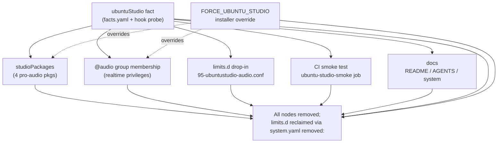

# Remove Ubuntu Studio Support - Plan

## Goal Capsule

- **Objective:** Drop Ubuntu Studio as a supported Linux target, narrowing this repo's Linux support to three — Ubuntu (GNOME), Fedora (GNOME), Fedora KDE Spin (KDE). Excise the `ubuntuStudio` host fact and everything it gates, and make Ubuntu's package config GNOME-only while keeping the fcitx5 Korean IME.
- **Authority hierarchy:** The Product Contract below is the source of truth for scope. The two session-settled Key Technical Decisions (KTD1, KTD2) are user-directed and must not be re-litigated. On any conflict between this plan and repo reality, follow the repo and surface the conflict.
- **Stop conditions:** Stop and surface if the atomic fact excision cannot render clean (`facts-validate.tmpl` failure that isn't resolved by the documented sequencing), or if removing the Ubuntu KDE package path would strand a supported host's Korean IME (it must not — fcitx5 moves to baseline).
- **Execution profile:** Chezmoi **source-state** edits only. Never `chezmoi apply` to the live `$HOME`; verify by isolated render per the Verification Contract. Product Contract unchanged by this enrichment.
- **Tail ownership:** Invoked under LFG pipeline — LFG owns commit/push/PR/CI. This plan defines the work and its local verification only.

---

## Product Contract

### Summary

Remove Ubuntu Studio as a supported target so the repo supports exactly three Linux targets: Ubuntu (GNOME), Fedora (GNOME), Fedora KDE Spin (KDE). The `ubuntuStudio` fact and all of its consumers are deleted in one atomic change; Ubuntu's package config becomes GNOME-only, with `fcitx5`/`fcitx5-hangul` relocated to the ungated baseline so Korean input survives.

### Problem Frame

Ubuntu Studio exists in the repo as a full host fact because it is an Ubuntu *flavor* sharing `ID=ubuntu` — indistinguishable from plain Ubuntu Desktop except by a seed package, so it needs its own probe. That single fact fans out into a wide, high-maintenance surface: a pinned pro-audio package set, `@audio` realtime-privilege group membership, a repo-owned `limits.d` drop-in that grants `rtprio 95`/`memlock unlimited`, a `FORCE_UBUNTU_STUDIO` installer override with a load-bearing privilege-escalation caveat, and a dedicated CI smoke test that spins up an `ubuntu:26.04` container. Every one of those carries ongoing correctness cost (the FORCE override must never leak into the shared `facts-sh.tmpl`, the smoke test must track universe package availability) for a flavor that is no longer a target. Removing it collapses the KDE-on-Ubuntu path entirely — after this change the only KDE Linux target is the Fedora KDE Spin, and Ubuntu is GNOME-only.

### Key Decisions

These are the product-level framing decisions carried from the brainstorm. Their implementation-facing form lives in the Planning Contract (KTD1, KTD2).

- **Forward-only cleanup, no host reconciliation** (session-settled: user-directed — chosen over full host-reconcile and host-reinstall: no live Ubuntu Studio host exists). The `system.yaml` `removed:` entry for the `/etc` limits file is the only active reclamation, and is mandatory repo policy whenever a tracked `/etc` file is deleted.
- **Ubuntu is GNOME-only, but fcitx5 stays as a baseline IME** (session-settled: user-directed — chosen over removing the whole Ubuntu KDE path and over keeping it dormant). `fcitx5`/`fcitx5-hangul` move to Ubuntu's ungated baseline package set; `pinentry-qt` and the `desktop.kde` Ubuntu gate are dropped.
- **The excision must be atomic.** `facts-validate.tmpl` rejects unknown/undeclared facts, so a partial removal fails every render. See KTD5 for the sequencing.

### Requirements

**Fact and override excision**

- R1. The `ubuntuStudio` host fact is removed entirely: its declaration in `.chezmoidata/facts.yaml`, the `fact_ubuntu_studio` probe and its `.install-prerequisites.sh` emission line, the Windows all-false mirror line in `.install-prerequisites.ps1`, and the documentation mirrors in `.chezmoitemplates/facts.tmpl` and `dot_local/bin/executable_host-facts.tmpl`.
- R2. The `FORCE_UBUNTU_STUDIO` override is removed from every site — the `facts.yaml` FORCE_* note, the `packages.yaml` FORCE_* note, the two shared partials `.chezmoitemplates/facts-sh.tmpl` and `.chezmoitemplates/facts-gate.sh.tmpl` (whose FORCE_* worked-example comments name it), the `host-facts.tmpl` force-vars map and its FORCE_* reporting block, and the Ubuntu install script — while the `FORCE_NVIDIA`/`FORCE_INTEL` overrides and the rationale for why FORCE_* must stay out of the shared partials are preserved, rewritten so no worked example relies on Studio.
- R3. The removal lands atomically: afterward no declared-but-unemitted or emitted-but-undeclared `ubuntuStudio` reference remains, and `facts-validate.tmpl` renders clean.

**Ubuntu package reconfiguration (GNOME-only)**

- R4. The Ubuntu `studioPackages` set and its `gates:` mapping are removed from `.chezmoidata/packages.yaml`, along with the Studio package-install loop and the `IS_UBUNTU_STUDIO` gate variable in the Ubuntu install script.
- R5. `fcitx5` and `fcitx5-hangul` are relocated into Ubuntu's ungated baseline package set so the Korean IME installs on every Ubuntu host independent of desktop, and they are no longer duplicated in the desktop-gated sets.
- R6. The Ubuntu-side `kdePackages` set and its `kdePackages: desktop.kde` gate mapping are removed, and `pinentry-qt` is dropped. The Ubuntu GNOME package set retains `pinentry-gnome3`.
- R7. Fedora's `kdePackages`/`gnomePackages` and its `desktop.kde` gate are left untouched — the Fedora KDE Spin remains a fully supported target.

**System and realtime cleanup**

- R8. The Studio-gated `@audio` realtime group membership is removed from the Ubuntu install script's group configuration.
- R9. The `system/linux/etc/security/limits.d/95-ubuntustudio-audio.conf` drop-in is deleted, its `.chezmoidata/system.yaml` manifest entry removed, and its absolute path `/etc/security/limits.d/95-ubuntustudio-audio.conf` added to the manifest's `removed:` list scoped `distro: ubuntu`, so any host that ever deployed it drops the orphan on the next apply.
- R10. The `ubuntuStudio` removal-reason label case in `install-system-10-files` is removed.

**CI and documentation**

- R11. The `.ci/smoke-ubuntu-studio-audio.sh` smoke test and its `ubuntu-studio-smoke` job in `.github/workflows/ci.yml` are removed.
- R12. `README.md`, `AGENTS.md`, and `system/README.md` describe three Linux targets (Ubuntu GNOME, Fedora GNOME, Fedora KDE Spin) with no remaining Ubuntu Studio references; `CLAUDE.md` stays exactly `@AGENTS.md`.
- R13. No source comment names Ubuntu Studio as a live KDE/Plasma target. The KDE/desktop comment sites that pair "Fedora + Ubuntu Studio" (`.chezmoidata/kde.yaml`, `dot_config/solaar/rules.yaml.tmpl`, `system/linux/etc/sddm.conf.d/90-breeze.conf`, `.chezmoiscripts/30-linux/run_onchange_after_setup-podman-cluster.sh.tmpl`, `.chezmoiscripts/50-linux-kde/run_onchange_after_config-kde-wallpaper-breeze.sh.tmpl`) name only the Fedora KDE Spin.

### Acceptance Examples

- AE1. **Covers R5, R6.** Given a fresh Ubuntu GNOME host, When `chezmoi apply` runs, Then `fcitx5` and `fcitx5-hangul` install (Korean input works) and `pinentry-qt` is absent while `pinentry-gnome3` is present.
- AE2. **Covers R9.** Given an Ubuntu host that previously deployed `95-ubuntustudio-audio.conf`, When the next apply runs, Then the file is removed from `/etc/security/limits.d/` and no repo-managed `@audio` realtime limits remain.
- AE3. **Covers R1, R3.** Given the post-removal source, When `chezmoi execute-template` renders the fact registry and `facts-validate.tmpl`, Then no `ubuntuStudio` reference is emitted and validation passes with no unknown- or undeclared-fact error.

### Success Criteria

- Both CI workflows — `render-dotfiles.yml` and `ci.yml` — pass with the `ubuntu-studio-smoke` job gone.
- A repo-wide case-insensitive search matching `ubuntu[ -]?studio` (the space, hyphen, and joined forms) plus `studioPackages`, `FORCE_UBUNTU_STUDIO`, and `95-ubuntustudio-audio` returns only the `removed:` reclamation path — nothing live (git history aside).
- Rendered scripts and templates compared on both sides per the Verification Contract; no `ubuntuStudio` gate remains in any rendered output.

### Scope Boundaries

- **KDE support stays** — this removes KDE-*on-Ubuntu* only. The Fedora KDE Spin, Fedora's `kdePackages`, and the distro-agnostic KDE desktop configuration (`50-linux-kde`) are untouched.
- **No live-host reconciliation** beyond the `/etc` `removed:` entry. No apt purge of the four pro-audio packages and no `@audio` de-membership are scripted or documented — teardown scripts are banned and no live Studio host exists.
- **`obs-studio` is not in scope.** It is the unrelated OBS screen-recorder present in both desktop package sets, not part of Ubuntu Studio; it must not be swept up by a name-based search-and-delete.
- **The generic `desktop` fact is unchanged.** Its KDE detection (the `plasmashell` probe) stays generic and continues to serve the Fedora KDE Spin.
- **macOS and Windows** secondary-target support is unaffected.

### Outstanding Questions

Both planning-time questions from the requirements phase are now resolved:

- The Intel-path grub drop-in — resolved as KTD3 (keep, rewrite the comment).
- The baseline home for `fcitx5`/`fcitx5-hangul` — resolved as KTD4 (the ungated `packages:` list).

---

## Planning Contract

### Key Technical Decisions

- KTD1. **Forward-only cleanup; reclaim the `/etc` drop-in via `removed:`** (session-settled: user-directed — chosen over full host reconciliation: no live Ubuntu Studio host exists, and teardown/revert scripts are banned repo-wide). Source deletion plus a `system.yaml` `removed:` entry scoped `distro: ubuntu`. No apt purge or `@audio` de-membership is scripted. Inherits the brainstorm Key Decision of the same name.
- KTD2. **Ubuntu GNOME-only, fcitx5 kept as baseline** (session-settled: user-directed — chosen over removing the whole Ubuntu KDE path and over keeping it dormant: the Korean IME must survive independent of desktop, but a dead KDE-on-Ubuntu gate shouldn't linger). `fcitx5`/`fcitx5-hangul` become ungated baseline packages; `pinentry-qt` and the Ubuntu `desktop.kde` gate are dropped. Inherits the brainstorm Key Decision of the same name.
- KTD3. **Keep the Intel-path grub flavour-order drop-in; rewrite its comment.** The `GRUB_FLAVOUR_ORDER="generic"` drop-in (`.chezmoiscripts/40-linux-ubuntu/run_onchange_before_ubuntu.sh.tmpl`, in `install_intel_support`) currently justifies itself by outranking Studio's lowlatency kernel. Keep the line — it still correctly makes the generic HWE kernel the boot default on Intel hosts — and rewrite the comment to drop the `ubuntustudio-lowlatency-settings` reference. Rationale: removing it would change Intel-path boot behavior for no benefit; it is behaviorally inert with respect to the now-unavailable lowlatency package. Resolves an Outstanding Question.
- KTD4. **Relocate `fcitx5`/`fcitx5-hangul` into the ungated `packages:` list.** Not `corePackages:` (reserved for pre-main DKMS build headers). `packages:` is the general ungated base set installed on every Ubuntu host and already carries `locales` (which compiles `ko_KR.UTF-8`), so the IME sits naturally alongside locale tooling. Resolves an Outstanding Question.
- KTD5. **Fact-registry excision is render-coupled and must be atomic.** `facts-validate.tmpl` aborts the apply when a `gate:` (in `packages.yaml` `gates:` or `system.yaml`) names a fact absent from the registry. So every `ubuntuStudio` *gate reference* — the `studioPackages: ubuntuStudio` gate in `packages.yaml` (U2) and the `gate: ubuntuStudio` on the limits file in `system.yaml` (U4) — must be removed **before, or in the same commit as**, the fact declaration in `facts.yaml` (U1). The hook emission (`.install-prerequisites.sh`), the doc row (`facts.tmpl`), and the `host-facts.tmpl` force-var must change together with the declaration so the registry and its emitted set stay consistent. This is why U1 depends on U2 and U4; landing U1–U4 as one commit is an equally valid execution.

### Assumptions

- No live Ubuntu Studio host exists (user-confirmed) — no runtime reconciliation is needed beyond the `removed:` entry.
- `HAS_KDE` in the Ubuntu installer has exactly two references (seed line and its sole `if HAS_KDE` consumer) — verified; removing the Ubuntu `kdePackages` gate cleanly removes both.
- `facts-sh.tmpl` renders the fact registry generically (no hardcoded `FACT_UBUNTU_STUDIO` consumer outside the gate map) — implementer confirms by grepping for `FACT_UBUNTU_STUDIO` before finalizing U1.
- The Windows `.install-prerequisites.ps1` all-false fact mirror must stay in lockstep with the `.sh` hook and the registry (AGENTS.md) — so it drops `ubuntuStudio` in the same unit (U1).
- The five KDE/desktop `ubuntu studio` references (U7) are all comments; grep confirms none is functional gate/package logic.

### Sequencing

U2, U3, U4 are independent and may proceed in any order (or in parallel). U1 (fact-registry excision) lands last among the coupled set, after U2 and U4 remove the last `ubuntuStudio` gate references (KTD5). U5 (CI), U6 (docs), and U7 (KDE/desktop comments) are independent of all others. An implementer may also collapse U1–U4 into a single atomic commit.

---

## Implementation Units

### U1. Excise the `ubuntuStudio` fact from the registry, hook, and doc mirrors

- **Goal:** Remove the fact declaration, its host probe (both OS mirrors), and every documentation/worked-example mirror so the registry no longer knows `ubuntuStudio`.
- **Requirements:** R1, R2, R3.
- **Dependencies:** U2, U4 (per KTD5 — the fact's gate references must be gone first).
- **Files:**
  - `.chezmoidata/facts.yaml` — delete the `ubuntuStudio:` fact block; rework the trailing `FORCE_*` note so it keeps the `FORCE_NVIDIA`/`FORCE_INTEL` rationale and the "never move into the shared partials" warning but drops the Studio-specific privilege-escalation worked example (recast it around NVIDIA/Intel); remove the "Ubuntu Studio also reports ID=ubuntu — see ubuntuStudio" cross-reference in the `distro` fact comment.
  - `.install-prerequisites.sh` — delete `fact_ubuntu_studio()` and its comment block, and the `printf 'ubuntuStudio: %s\n' ...` emission line.
  - `.install-prerequisites.ps1` — delete the `'ubuntuStudio: false'` line from the Windows all-false mirror and change the "all six cached facts" comment to "all five", keeping the sh/ps1 hook mirror in lockstep with the registry (AGENTS.md requirement).
  - `.chezmoitemplates/facts.tmpl` — delete the `ubuntuStudio` doc-table row.
  - `.chezmoitemplates/facts-sh.tmpl` — recast the `NO FORCE_* LOGIC LIVES HERE` comment block (its `/* */` header) so the "would let FORCE_UBUNTU_STUDIO=1 install the realtime-limits drop-in" worked example is replaced by a Studio-free framing (state the general rule; use NVIDIA/Intel if an example is kept).
  - `.chezmoitemplates/facts-gate.sh.tmpl` — recast the `CARRY FORCE_* LOGIC` comment so `FORCE_NVIDIA / FORCE_INTEL` remain and the `FORCE_UBUNTU_STUDIO` mention and its realtime-limits example are dropped.
  - `dot_local/bin/executable_host-facts.tmpl` — remove the `"ubuntuStudio" "FORCE_UBUNTU_STUDIO"` entry from the `$forceVars` dict; drop `FORCE_UBUNTU_STUDIO` from the `for force in FORCE_NVIDIA FORCE_INTEL FORCE_UBUNTU_STUDIO` reporting loop; rewrite the "Studio package sets" phrasing in the FORCE_* section header and the `FORCE_UBUNTU_STUDIO=1 must not install the realtime-limits drop-in` printf so neither names Studio; and remove the limits-file comment referencing the drop-in.
- **Approach:** This is the render-coupled core (KTD5). The FORCE_* comments in `facts-sh.tmpl`/`facts-gate.sh.tmpl` live inside Go-template `/* */` blocks, so they never reach rendered output and are invisible to the shellcheck / rendered-output checks — only the source grep sweep catches them, which is why they must be edited by file, not verified away by render alone. Before finalizing, grep `FACT_UBUNTU_STUDIO` across the repo to confirm no rendered-bash consumer survives. The hook predicate lockstep rule (container/devbox) is unaffected — `fact_ubuntu_studio` is a standalone probe.
- **Test scenarios:** `Test expectation: none` — chezmoi source removal with no behavioral test harness. Verification is by isolated render (Verification Contract) plus source grep: rendering the fact registry and `facts-validate.tmpl` must succeed and emit no `ubuntuStudio`, and the repo-wide grep must return no `ubuntuStudio`/`FORCE_UBUNTU_STUDIO` in any of these files. Covers AE3.
- **Verification:** Isolated `chezmoi execute-template` over `facts.tmpl`, `facts-validate.tmpl` (via a consuming script), and `host-facts.tmpl` renders clean; `grep -rniI 'ubuntustudio\|FORCE_UBUNTU_STUDIO'` returns nothing across `facts.yaml`, both `.install-prerequisites.*`, `facts.tmpl`, `facts-sh.tmpl`, `facts-gate.sh.tmpl`, and `host-facts.tmpl`.

### U2. Remove Studio pro-audio provisioning from the Ubuntu installer and package data

- **Goal:** Delete the `studioPackages` set, its gate, the installer's Studio package/gate/`@audio` handling, and the now-orphaned lowlatency comment.
- **Requirements:** R2 (installer FORCE line), R4, R8.
- **Dependencies:** none.
- **Files:**
  - `.chezmoidata/packages.yaml` — delete the `studioPackages:` list and its comment block; remove the `studioPackages: ubuntuStudio` entry from the ubuntu `gates:` map; fix the three header-comment references (the `ubuntuStudio` example in the gate-grammar list, the "intelPackages / intelHweKernel / studioPackages exist only under `ubuntu`" line, and the `FORCE_NVIDIA / FORCE_INTEL / FORCE_UBUNTU_STUDIO are NOT facts` note); remove the `flavour-order drop-in wins over ubuntustudio-lowlatency-settings` comment.
  - `.chezmoiscripts/40-linux-ubuntu/run_onchange_before_ubuntu.sh.tmpl` — remove the `IS_UBUNTU_STUDIO` seed + `FORCE_UBUNTU_STUDIO` line; remove the `if [[ "${IS_UBUNTU_STUDIO}" -eq 1 ]]` studioPackages block; remove the Studio-gated `@audio` block in `configure_user_groups`; update the file header (which names "Ubuntu Studio 26.04 (KDE Plasma)" and "the Studio pro-audio stack (studioPackages, @audio group)") to describe only GNOME Ubuntu; per KTD3, keep the `GRUB_FLAVOUR_ORDER="generic"` drop-in in `install_intel_support` but rewrite its comment to drop the `ubuntustudio-lowlatency-settings` reference.
- **Approach:** All Studio pro-audio concerns in one commit. The `@audio` block removal leaves `configure_user_groups` with its `keyd`/`vboxusers` defaults intact.
- **Test scenarios:** `Test expectation: none` — config/source removal. Verify by rendering the Ubuntu installer (Verification Contract): the rendered bash must contain no `studioPackages`, `IS_UBUNTU_STUDIO`, `FORCE_UBUNTU_STUDIO`, or Studio `@audio` membership, and must pass shellcheck (as CI does).
- **Verification:** Isolated render of the Ubuntu installer succeeds and is shellcheck-clean; `grep -n 'studio\|IS_UBUNTU_STUDIO' packages.yaml <installer>` returns only unrelated hits (`obs-studio` stays).

### U3. Make the Ubuntu package config GNOME-only and relocate fcitx5 to baseline

- **Goal:** Remove the Ubuntu KDE package path and its installer flag, drop `pinentry-qt`, and move the Korean IME into the ungated baseline.
- **Requirements:** R5, R6, R7.
- **Dependencies:** none. (Independent of U2; both edit `packages.yaml` and the installer but disjoint regions.)
- **Files:**
  - `.chezmoidata/packages.yaml` — delete the ubuntu `kdePackages:` list and the `kdePackages: desktop.kde` entry from the ubuntu `gates:` map; add `fcitx5` and `fcitx5-hangul` to the ungated `packages:` list (near `locales`, per KTD4); remove `fcitx5`/`fcitx5-hangul` from the ubuntu `gnomePackages:` list, leaving `pinentry-gnome3`; rewrite the ubuntu kde/gnome package comments to reflect GNOME-only + baseline IME. **Do not touch Fedora's `kdePackages`/`gnomePackages` (R7).**
  - `.chezmoiscripts/40-linux-ubuntu/run_onchange_before_ubuntu.sh.tmpl` — remove the `HAS_KDE=0; fact_gate {{ index $gates "kdePackages" ... }}` seed line and its sole consumer, the `if [[ "${HAS_KDE}" -eq 1 ]]` package block; trim the desktop-flags comment (which explains KDE/GNOME mutual exclusion and "KDE wins that tie") down to the GNOME-only reality.
- **Approach:** Removing the `kdePackages` gate entry forces the `HAS_KDE` seed removal — `index $gates "kdePackages"` would otherwise render empty and break `fact_gate` (KTD2 consequence). On an off-support Ubuntu+Plasma host, no desktop package set installs, but fcitx5 (now baseline) still provides IME — the intended unsupported behavior.
- **Test scenarios:** `Test expectation: none` — config/source. Verify by render: the Ubuntu installer's rendered baseline `packages` array includes `fcitx5`/`fcitx5-hangul`; the rendered script has no `HAS_KDE` reference and no `pinentry-qt`; `gnomePackages` renders `pinentry-gnome3` only. Covers AE1.
- **Verification:** Isolated render shows `fcitx5`/`fcitx5-hangul` in the unconditional package set and no `HAS_KDE`/`pinentry-qt`; Fedora sections in `packages.yaml` are byte-unchanged (diff-scoped).

### U4. Reclaim the realtime limits drop-in and clean the system manifest

- **Goal:** Delete the limits file, remove its manifest entry, register it for active removal, and drop the Studio removal-reason label.
- **Requirements:** R9, R10.
- **Dependencies:** none.
- **Files:**
  - `system/linux/etc/security/limits.d/95-ubuntustudio-audio.conf` — delete.
  - `.chezmoidata/system.yaml` — remove the `95-ubuntustudio-audio.conf` manifest entry and its comment; remove `ubuntuStudio` from the fact-list comment; add `/etc/security/limits.d/95-ubuntustudio-audio.conf` to the `removed:` list with `distro: ubuntu`.
  - `.chezmoiscripts/30-linux/run_onchange_after_install-system-10-files.sh.tmpl` — remove the `ubuntuStudio)` removal-reason label case and its comment.
  - `system/README.md` — remove the `95-ubuntustudio-audio.conf` table row and `ubuntuStudio` from the fact list.
- **Approach:** The `removed:` mechanism is the sanctioned reclamation (KTD1); `distro: ubuntu` scoping matches "paths only ever deployed there." This unit removes the `gate: ubuntuStudio` reference that couples to U1 (KTD5).
- **Test scenarios:** `Test expectation: none` — manifest/source. Verify by rendering `install-system-10-files.sh.tmpl`: the rendered script's `removed:` handling lists the limits path (scoped to Ubuntu) and no live manifest entry or `ubuntuStudio` label remains. Covers AE2.
- **Verification:** Isolated render of the system installer succeeds; the limits path appears under `removed:` (ubuntu-scoped) and nowhere as an active managed file; `git status` shows the `.conf` deleted.

### U5. Remove the Ubuntu Studio CI smoke test

- **Goal:** Delete the smoke test and its CI job.
- **Requirements:** R11.
- **Dependencies:** none.
- **Files:**
  - `.ci/smoke-ubuntu-studio-audio.sh` — delete.
  - `.github/workflows/ci.yml` — remove the `ubuntu-studio-smoke` job.
- **Approach:** Confirm no other CI job or `needs:` references `ubuntu-studio-smoke` before removing.
- **Test scenarios:** `Test expectation: none` — CI config. Verify the workflow YAML still parses and no job references the removed one.
- **Verification:** `ci.yml` has no `ubuntu-studio-smoke` job or reference; the file remains valid YAML.

### U6. Update docs to three Linux targets

- **Goal:** Rewrite the target descriptions so no Ubuntu Studio references remain.
- **Requirements:** R12.
- **Dependencies:** none.
- **Files:**
  - `README.md` — "Four Linux targets" → "Three"; remove Ubuntu Studio from the target list, the apt line, the Tailscale/Studio note, and the flavor-detection paragraph.
  - `AGENTS.md` — remove the "Ubuntu Studio packages, audio group, and realtime limits are all gated on `ubuntuStudio`; `FORCE_UBUNTU_STUDIO` MUST NOT grant the privilege file" sentence, and the `FORCE_UBUNTU_STUDIO` mention in the facts paragraph.
- **Approach:** `CLAUDE.md` stays exactly `@AGENTS.md` — do not edit it. Keep `system/README.md` edits in U4 (they document the manifest change).
- **Test scenarios:** `Test expectation: none` — docs. Verify by grep.
- **Verification:** `grep -rn 'Ubuntu Studio\|ubuntuStudio\|FORCE_UBUNTU_STUDIO' README.md AGENTS.md` returns nothing; `CLAUDE.md` is byte-unchanged and equals `@AGENTS.md`.

### U7. Purge stale "Ubuntu Studio" references from KDE/desktop comments

- **Goal:** Update the KDE/desktop comment sites that name Ubuntu Studio as a live Plasma target so they name only the Fedora KDE Spin — the sole remaining KDE target.
- **Requirements:** R13.
- **Dependencies:** none.
- **Files (all comment-only edits — no functional change):**
  - `.chezmoidata/kde.yaml` — the three "Fedora + Ubuntu Studio" / "On Ubuntu Studio" comments (the Breeze Global theme and KDE-target notes) → name only the Fedora KDE Spin.
  - `dot_config/solaar/rules.yaml.tmpl` — the `plasmashell — Fedora KDE Spin, Ubuntu Studio` comment → drop Ubuntu Studio.
  - `system/linux/etc/sddm.conf.d/90-breeze.conf` — the "Ubuntu Studio's greeter drop-in" comment → generalize to the shipped-theme de-branding without naming Studio.
  - `.chezmoiscripts/30-linux/run_onchange_after_setup-podman-cluster.sh.tmpl` — the "Fedora / Ubuntu Studio desktop targets" comment → reword to the supported desktop targets without Studio.
  - `.chezmoiscripts/50-linux-kde/run_onchange_after_config-kde-wallpaper-breeze.sh.tmpl` — the "Fedora + Ubuntu Studio" comment → Fedora KDE Spin only.
- **Approach:** Pure comment/consistency cleanup; no gate, package, or functional logic changes. Two benign side effects to disclose: editing the two `run_onchange_*` script comments reruns each once per host (idempotent — re-applies the same config), and the `90-breeze.conf` comment change re-copies that managed `/etc` file on the next apply via `install-system-10-files` (no service reload — SDDM config is read at next login).
- **Test scenarios:** `Test expectation: none` — comment-only. Verify by grep.
- **Verification:** `grep -rniI 'ubuntu studio\|ubuntustudio' .chezmoidata/kde.yaml dot_config/solaar/rules.yaml.tmpl system/linux/etc/sddm.conf.d/90-breeze.conf .chezmoiscripts/30-linux/run_onchange_after_setup-podman-cluster.sh.tmpl .chezmoiscripts/50-linux-kde/run_onchange_after_config-kde-wallpaper-breeze.sh.tmpl` returns nothing.

---

## Verification Contract

Chezmoi source-state change — **never `chezmoi apply` to the live `$HOME`.** Verify by isolated render per `AGENTS.md`.

1. **Isolated render (per changed `.tmpl`).** Using the `AGENTS.md` op-stub scratch procedure (per-user scratch dir, stub `op`, empty config, throwaway destination, `--source "$PWD"`), run `chezmoi execute-template` over each changed script/template on both the base and the branch:
   - `.chezmoiscripts/40-linux-ubuntu/run_onchange_before_ubuntu.sh.tmpl`
   - `.chezmoiscripts/30-linux/run_onchange_after_install-system-10-files.sh.tmpl`
   - `dot_local/bin/executable_host-facts.tmpl`
   - any script that includes `facts.tmpl` / `facts-validate.tmpl` / `facts-sh.tmpl` / `facts-gate.sh.tmpl`
   Each must render exit-0 (no `facts-validate` abort) and its rendered output must contain no `ubuntuStudio` / `studioPackages` / `IS_UBUNTU_STUDIO` / `FORCE_UBUNTU_STUDIO` / `HAS_KDE`. Note: the FORCE_* comments removed from `facts-sh.tmpl` / `facts-gate.sh.tmpl` live in Go-template `/* */` blocks and never reach rendered output — render cannot confirm their removal, so the source grep (step 3) is the authoritative check for those two files.
2. **Shellcheck parity.** The rendered Ubuntu installer must be shellcheck-clean (CI lints the rendered script).
3. **Grep sweep.** `grep -rniI 'ubuntu[ -]\?studio\|studioPackages\|FORCE_UBUNTU_STUDIO\|95-ubuntustudio-audio'` over the repo (case-insensitive; `[ -]\?` catches the space-separated "Ubuntu Studio", the hyphenated, and the joined forms) returns only `/etc/security/limits.d/95-ubuntustudio-audio.conf` inside `system.yaml`'s `removed:` list. `obs-studio` hits are expected and correct.
4. **Diff scoping.** `git diff --check` clean; `git status` shows the two deleted files (`.conf`, `.ci` script); Fedora package sections and the generic `desktop` fact are unchanged.
5. **CI.** After push (LFG-owned tail), both `render-dotfiles.yml` and `ci.yml` reach terminal green, with no `ubuntu-studio-smoke` job present.

## Definition of Done

**Global:**
- No `ubuntu[ -]?studio` (any of the space / hyphen / joined forms, case-insensitive), `studioPackages`, `FORCE_UBUNTU_STUDIO`, or `95-ubuntustudio-audio` reference remains anywhere except the `system.yaml` `removed:` reclamation path — this explicitly includes the shared partials, the Windows `.ps1` mirror, and the KDE/desktop comment sites.
- Isolated render of every changed template passes `facts-validate` and is shellcheck-clean; rendered output is `ubuntuStudio`-free.
- `obs-studio`, Fedora's KDE/GNOME package paths, the generic `desktop` fact, and `CLAUDE.md` (`@AGENTS.md`) are untouched.
- Both CI workflows green; the `ubuntu-studio-smoke` job is gone.
- No teardown/revert script was added; the only active reclamation is the `removed:` entry.
- Abandoned-attempt/dead code from the removal is not left behind (no commented-out Studio blocks).

**Per-unit:** each unit's Verification passes; U1 landed only after U2 and U4 (or U1–U4 landed as one atomic commit) so no intermediate rendered state references an undeclared fact.
