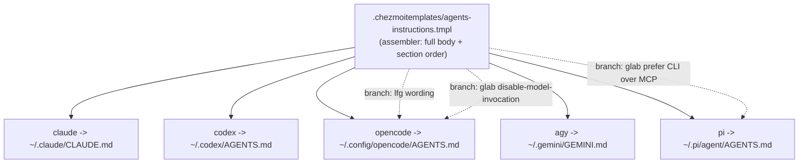

# Per-Harness Instruction Core Composition - Plan

## Goal Capsule

- **Objective:** Refactor the monolithic `dot_agents/readonly_AGENTS.md` instruction core into one chezmoi assembler template rendered per harness, so the harness-specific behavior (lfg invocation, glab usage) renders correctly for each of the five agent-harness wrappers.
- **Product authority:** User (this session). All framing forks resolved in dialogue.
- **Open blockers:** None.

---

## Product Contract

### Summary

Replace the single `dot_agents/readonly_AGENTS.md` plus its five byte-identical `include` wrappers with one assembler template (`.chezmoitemplates/agents-instructions.tmpl`) that owns the full instruction body and section order and branches by harness name only where behavior differs. Each of the five harness wrappers renders the assembler with its own harness id. The `~/.agents/AGENTS.md` hub and its `@AGENTS.md` mirror are removed — renderings are per-harness only.

### Problem Frame

Today each wrapper is a one-line `{{ include "dot_agents/readonly_AGENTS.md" }}`. `include` copies raw text without rendering, so all five harnesses receive an identical instruction core. But lfg invocation and glab usage genuinely differ by harness: OpenCode invokes lfg directly when the `/lfg <plan>` command injects its prompt and owns the `disable-model-invocation` concept; Pi must prefer the `glab` CLI over the glab MCP for issue reads because of an MCP compatibility problem; Claude, Codex, and AGY keep lfg user-invoked-only. A single shared body cannot state harness-correct behavior for all of them. The opening sentence is already stale — it claims the core is "included verbatim by the Claude Code, Codex, OpenCode, and Pi wrappers," which omits AGY and stops being true once the core is composed rather than copied.

### Key Decisions

- **Single assembler template + inline harness-name conditionals** (session-settled: user-directed — chosen over a data-driven `.chezmoidata/agents.yaml` capability schema and over per-harness assembler wrappers: keeps the section order in one file with minimal new surface).
- **No hub file; per-harness renderings only** (session-settled: user-directed — chosen over keeping the `~/.agents/AGENTS.md` canonical hub and its `@AGENTS.md` mirror: nothing consumes either, and Claude reads `~/.claude/CLAUDE.md`).
- **Branch by harness name, not a binary has-lfg flag.** All five wrappers have lfg, so a has-lfg flag carries no signal. The real deltas are per-named-harness — OpenCode and Pi are the special cases; Claude, Codex, and AGY share the default path.

The composition is a source-of-truth fan-out: one assembler feeds five derived instruction files, diverging only at two conditional points.



### Requirements

**Composition mechanism**

- R1. A single assembler template at `.chezmoitemplates/agents-instructions.tmpl` owns the entire instruction-core body and section order and accepts a harness identifier (e.g. `dict "harness" "<id>"`), rendering the harness-appropriate variant.
- R2. Each of the five harness wrappers becomes a one-line template that renders the assembler with its own harness id: `dot_claude/readonly_CLAUDE.md.tmpl` (`claude`), `dot_codex/readonly_AGENTS.md.tmpl` (`codex`), `dot_config/opencode/readonly_AGENTS.md.tmpl` (`opencode`), `dot_gemini/readonly_GEMINI.md.tmpl` (`agy`), `dot_pi/agent/private_readonly_AGENTS.md.tmpl` (`pi`).
- R3. The `dot_gemini` wrapper passes the AGY harness id — it is Antigravity's instruction file, not the deprecated (uninstalled) Gemini CLI.
- R4. All invariant instruction content renders identically across harnesses; only the branches named in R5–R9 differ.

**Per-harness behavior: lfg**

- R5. For `opencode`, the lfg guidance states the agent invokes lfg directly when the `/lfg <plan>` command directs it — the command injects an "invoke the lfg skill" prompt and there is no standalone skill to defer to, so the agent must not merely surface the command.
- R6. For `claude`, `codex`, `agy`, and `pi`, the lfg guidance keeps today's rule: lfg is user-invoked only; the agent MUST NOT invoke it and surfaces `/lfg <…>` for the user to run.

**Per-harness behavior: glab**

- R7. For `opencode`, the glab "Unattended runs" clause keeps both triggers: the lfg skill and any `disable-model-invocation` pipeline context.
- R8. For `claude`, `codex`, `agy`, and `pi`, the glab "Unattended runs" clause drops the `disable-model-invocation` trigger (an OpenCode-only concept) and keeps only the lfg-skill trigger.
- R9. For `pi`, the glab guidance adds a note to prefer the `glab` CLI over the glab MCP when fetching issues and making similar reads, because of Pi's MCP compatibility issue.

**Cleanup**

- R10. Remove the hub source `dot_agents/readonly_AGENTS.md` (target `~/.agents/AGENTS.md`) and its mirror `dot_agents/readonly_CLAUDE.md` (target `~/.agents/CLAUDE.md`); nothing consumes either.
- R11. Rewrite or drop the stale opening sentence that claims the core is "included verbatim by the Claude Code, Codex, OpenCode, and Pi wrappers" — it is no longer verbatim, omits AGY, and there is no hub.

### Acceptance Examples

- AE1. **Covers R5, R6.** Rendering the `opencode` wrapper yields lfg guidance that tells the agent to invoke lfg when `/lfg` directs; rendering the `claude` wrapper yields lfg guidance that says user-invoked only / MUST NOT invoke.
- AE2. **Covers R7, R8.** The `opencode` render's glab unattended clause mentions `disable-model-invocation`; the `pi` (and `claude`/`codex`/`agy`) render's does not.
- AE3. **Covers R9.** The `pi` render's glab guidance contains the prefer-`glab`-CLI-over-MCP note for issue reads; no other harness render contains it.
- AE4. **Covers R10.** After apply, `~/.agents/AGENTS.md` and `~/.agents/CLAUDE.md` no longer exist, while the five harness instruction files still deploy with their harness-correct content.

### Scope Boundaries

- Not redesigning lfg or glab behavior itself — only making the wording harness-correct.
- Not modeling other per-harness tool differences (figma, playwright, MCP availability beyond the Pi glab note). The assembler makes adding future variances cheap, but none beyond lfg + glab are populated now.
- Not adding a data-driven capability schema to `.chezmoidata/agents.yaml` (rejected in favor of inline conditionals).
- Not touching other harness config (MCP configs, plugins, settings) — only the instruction wrappers and the removed hub/mirror.

### Dependencies / Assumptions

- Assumes `includeTemplate "name" data` renders the named `.chezmoitemplates/` partial with the passed data — the established in-repo pattern (`.chezmoitemplates/facts.tmpl`, consumed via `includeTemplate ... | fromYaml`).
- Assumes nothing consumes `~/.agents/AGENTS.md` or `~/.agents/CLAUDE.md` — verified: a repo-wide search for consumers of those deployed paths returned nothing, and the user confirmed Claude reads `~/.claude/CLAUDE.md`.
- Verification is per-harness via `chezmoi execute-template` against each wrapper, following the repo's isolated-verification protocol (per-user scratch, stub `op`, `--source "$PWD"`).

### Outstanding Questions

- Deferred to Planning (now resolved in the Planning Contract): exact conditional shape, Pi glab-CLI note placement, reworded opening sentence, assembler filename.
- Resolve Before Planning: none.

### Sources / Research

- Wrappers and monolith (all include the same source): `dot_claude/readonly_CLAUDE.md.tmpl`, `dot_codex/readonly_AGENTS.md.tmpl`, `dot_config/opencode/readonly_AGENTS.md.tmpl`, `dot_gemini/readonly_GEMINI.md.tmpl`, `dot_pi/agent/private_readonly_AGENTS.md.tmpl`, `dot_agents/readonly_AGENTS.md`, mirror `dot_agents/readonly_CLAUDE.md`.
- Varying content today: `dot_agents/readonly_AGENTS.md` §Routing (lfg paragraph, line 9) and §JavaScript, mise, and GitLab (glab MR "Unattended runs" clause, line 60).
- compound-engineering (lfg source) install targets: `.chezmoiscripts/70-agents/run_onchange_after_install-agent-plugins.sh.tmpl` (range over `agy`, `claude`, `codex`), OpenCode file-phase, Pi native `git:` package, plus `.chezmoiscripts/70-agents/run_after_install-kimi-plugins.sh.tmpl`.
- Composition precedent: `.chezmoitemplates/facts.tmpl` + `includeTemplate ... | fromYaml`; dict-passing at `.chezmoiscripts/10-auth/run_onchange_after_auth-gitlab.sh.tmpl:136`.
- Deployed-target removal precedent: `.chezmoiremove` (already prunes `.agents/skills/ce-*`, `.agents/skills/lfg`).
- Authoritative external chezmoi docs for `include` vs `includeTemplate` semantics: `https://github.com/twpayne/chezmoi/tree/master/assets/chezmoi.io/docs`.

---

## Planning Contract

**Product Contract preservation:** changed R1 — the assembler filename is refined from the requirements draft's `.chezmoitemplates/agents/AGENTS.md.tmpl` to the flat `.chezmoitemplates/agents-instructions.tmpl` (KTD-3). No product behavior changes; all other Product Contract text and R-IDs are unchanged.

### Key Technical Decisions

- KTD-1. **Single assembler template + inline harness-name conditionals** (session-settled: user-directed — chosen over a data-driven `.chezmoidata/agents.yaml` capability-flag schema and per-harness assembler wrappers: keeps section order in one file with minimal new surface).
- KTD-2. **No hub file; per-harness renderings only** (session-settled: user-directed — chosen over keeping the `~/.agents/AGENTS.md` hub and its `@AGENTS.md` mirror: nothing consumes either; Claude reads `~/.claude/CLAUDE.md`).
- KTD-3. **Flat template name `.chezmoitemplates/agents-instructions.tmpl`.** Every existing `.chezmoitemplates/` partial is flat and referenced as `<name>.tmpl`; a flat name matches convention and avoids depending on nested-`.chezmoitemplates` path support. Supersedes the requirements draft's nested `agents/AGENTS.md.tmpl`.
- KTD-4. **Branch by harness name via `(dict "harness" "<id>")`.** The wrapper passes its id; the assembler tests `eq .harness "opencode"` and `eq .harness "pi"`, with the unmatched default serving `claude`/`codex`/`agy`. Syntax confirmed by in-repo consumers (`includeTemplate "secret-read.tmpl" (dict "ctx" . "ref" ...)`).
- KTD-5. **Prune the deployed hub/mirror via `.chezmoiremove`.** Deleting the two source files alone orphans the already-deployed `~/.agents/AGENTS.md` and `~/.agents/CLAUDE.md` — chezmoi does not auto-remove targets on source deletion. Appending `.agents/AGENTS.md` and `.agents/CLAUDE.md` to the existing `.chezmoiremove` (which already prunes `.agents/skills/ce-*`) is the repo's established removal mechanism, honoring the "no teardown scripts" rule.

### Technical Design

The assembler is a normal `.chezmoitemplates` partial holding the entire instruction body as static markdown, with three `{{ if }}` islands: the lfg paragraph (opencode vs default), the glab "Unattended runs" `disable-model-invocation` fragment (opencode-only), and a pi-only glab-CLI-over-MCP note. Each wrapper renders it via `includeTemplate "agents-instructions.tmpl" (dict "harness" "<id>")`. Invariant sections carry no conditionals and render byte-identical across harnesses — the source-of-truth fan-out in the Product Contract diagram. `.chezmoitemplates/` is never deployed, so the assembler needs no `.chezmoiignore` entry; only the five wrappers and (after removal) the pruned hub/mirror change deploy output.

### Assumptions

- chezmoi renders `includeTemplate "<name>.tmpl" (dict ...)` from `.chezmoitemplates/<name>.tmpl` with the dict bound as `.` (verified against in-repo consumers).
- `.chezmoitemplates/` contents are never deployed to `$HOME` (chezmoi special directory), so no `.chezmoiignore` change is needed.
- Nothing consumes `~/.agents/AGENTS.md` or `~/.agents/CLAUDE.md` (verified: repo search for consumers empty; user confirmed Claude reads `~/.claude/CLAUDE.md`).
- The `dot_gemini` wrapper is the AGY (Antigravity) harness and shares the default (non-opencode) variant; the deprecated Gemini CLI is not installed.
- The working branch `ethiopians` is renamed in place to a descriptive Git-Flow slug (e.g. `refactor/per-harness-instruction-composition`) before the first push, per the repo branch rules.

### Sequencing

U1 (assembler) → U2 (repoint wrappers) → U3 (remove hub/mirror + prune) → U4 (sweep stale doc references). Each unit depends on the prior.

---

## Implementation Units

### U1. Create the assembler `.chezmoitemplates/agents-instructions.tmpl`

- **Goal:** One template holding the full instruction-core body and section order, branching on `.harness` only at the lfg and glab spots.
- **Requirements:** R1, R3, R4, R5, R6, R7, R8, R9, R11.
- **Dependencies:** none.
- **Files:** `.chezmoitemplates/agents-instructions.tmpl` (new).
- **Approach:**
  1. Seed the file with the current body of `dot_agents/readonly_AGENTS.md` verbatim.
  2. R11: rewrite the opening sentence to drop "included verbatim by the Claude Code, Codex, OpenCode, and Pi wrappers"; replace with a harness-agnostic sentence true post-composition (e.g. "This file is the common user-scoped instruction core, composed per agent harness."). No branch.
  3. R5/R6: wrap the §Routing lfg paragraph in `{{ if eq .harness "opencode" }}` opencode variant (the agent invokes lfg directly when `/lfg <plan>` directs it — the command injects an "invoke the lfg skill" prompt, no standalone skill to defer to; do not merely surface the command) `{{ else }}` current text (user-invoked only, MUST NOT invoke, surface `/lfg`) `{{ end }}`.
  4. R7/R8: in the §GitLab glab paragraph's "Unattended runs — the `lfg` skill … —" clause, gate the ` or any `disable-model-invocation` pipeline context` fragment behind `{{ if eq .harness "opencode" }}…{{ end }}`; keep the lfg-skill trigger for all harnesses.
  5. R9: append a `{{ if eq .harness "pi" }}` sentence (prefer the `glab` CLI over the glab MCP when fetching issues and similar reads, due to Pi MCP compatibility) `{{ end }}` in the §GitLab section.
- **Patterns to follow:** `.chezmoitemplates/facts.tmpl` (naming + consumption); dict-passing per `.chezmoiscripts/10-auth/run_onchange_after_auth-gitlab.sh.tmpl` line 136.
- **Test scenarios:**
  - `harness=opencode` → agent-invoked lfg wording; glab clause contains `disable-model-invocation`; no Pi note.
  - `harness=claude` → user-invoked / MUST-NOT-invoke lfg; no `disable-model-invocation`; no Pi note.
  - `harness=pi` → default lfg; no `disable-model-invocation`; Pi glab-CLI note present.
  - `harness=codex` and `harness=agy` → identical to the `claude` variant.
  - Invariant sections byte-identical across all five renders.
- **Verification:** `chezmoi execute-template` per harness id (see Verification Contract).

### U2. Repoint the five harness wrappers

- **Goal:** Each wrapper renders the assembler with its harness id instead of raw-including the monolith.
- **Requirements:** R2, R3.
- **Dependencies:** U1.
- **Files:** `dot_claude/readonly_CLAUDE.md.tmpl`, `dot_codex/readonly_AGENTS.md.tmpl`, `dot_config/opencode/readonly_AGENTS.md.tmpl`, `dot_gemini/readonly_GEMINI.md.tmpl`, `dot_pi/agent/private_readonly_AGENTS.md.tmpl`.
- **Approach:** Replace the single `{{ include "dot_agents/readonly_AGENTS.md" }}` line with `{{ includeTemplate "agents-instructions.tmpl" (dict "harness" "<id>") }}`; ids claude / codex / opencode / agy / pi respectively (the `dot_gemini` wrapper passes `agy`).
- **Test scenarios:** each wrapper renders its harness variant per U1's scenarios.
- **Verification:** isolated `chezmoi execute-template` per wrapper.

### U3. Remove the hub source + mirror and prune the deployed targets

- **Goal:** `~/.agents/AGENTS.md` and `~/.agents/CLAUDE.md` cease to exist in source and in `$HOME`.
- **Requirements:** R10.
- **Dependencies:** U2.
- **Files:** delete `dot_agents/readonly_AGENTS.md`, delete `dot_agents/readonly_CLAUDE.md`; edit `.chezmoiremove`.
- **Approach:**
  1. Grep-confirm no remaining `include "dot_agents/readonly_AGENTS.md"` references (all five repointed in U2).
  2. `git rm` the two source files.
  3. Append `.agents/AGENTS.md` and `.agents/CLAUDE.md` to `.chezmoiremove`, with a short comment in its existing style explaining the hub/mirror removal.
- **Test scenarios:** `grep -rn 'readonly_AGENTS.md' --include='*.tmpl' .` returns nothing; an isolated `chezmoi apply --dry-run` (or state inspection) shows both targets slated for removal and no longer managed.
- **Verification:** grep clean; `.chezmoiremove` still renders; dry-run apply in scratch confirms removal.

### U4. Sweep repo meta-docs for stale references

- **Goal:** No live repo doc describes the monolith/hub/mirror or "included verbatim" wording as current.
- **Requirements:** R10, R11.
- **Dependencies:** U1–U3.
- **Files:** `AGENTS.md`, `README.md`, and any doc referencing `readonly_AGENTS.md`, `readonly_CLAUDE.md`, `~/.agents/AGENTS.md`, or "included verbatim".
- **Approach:** grep for those tokens; update only prose that now describes the old mechanism or the deleted files. Preserve the general "every directory containing AGENTS.md has a sibling CLAUDE.md = `@AGENTS.md`" behavior rule (still valid; the repo-root pair stays).
- **Test scenarios:** grep for the removed filenames + "included verbatim" surfaces only this plan / historical plans, not live docs.
- **Verification:** grep clean.

---

## Verification Contract

Isolated render per harness follows the repo's verification protocol (`AGENTS.md` → "Verification"): per-user scratch, stub `op`, `--source "$PWD"`.

```bash
scratch="$HOME/.cache/agent-scratch/chezmoi-agents-verify"
mkdir -p "$scratch/bin" "$scratch/target"; : > "$scratch/empty.toml"
printf '#!/usr/bin/env bash\ncase "${1-}" in whoami) printf dummy@example.invalid;; *) printf dummy-secret;; esac\n' > "$scratch/bin/op"
chmod 700 "$scratch/bin/op"
for w in dot_claude/readonly_CLAUDE.md.tmpl dot_codex/readonly_AGENTS.md.tmpl dot_config/opencode/readonly_AGENTS.md.tmpl dot_gemini/readonly_GEMINI.md.tmpl dot_pi/agent/private_readonly_AGENTS.md.tmpl; do
  echo "== $w =="
  env PATH="$scratch/bin:$PATH" chezmoi --config "$scratch/empty.toml" --source "$PWD" --destination "$scratch/target" execute-template < "$w"
done
```

Quality gates:

- Each render succeeds; assert the per-harness branch markers (opencode → `disable-model-invocation` present + agent-invoked lfg; pi → glab-CLI note; claude/codex/agy → neither).
- Invariant sections diff-identical across the five renders.
- `grep -rn 'include "dot_agents/readonly_AGENTS.md"' --include='*.tmpl' .` returns nothing.
- `git diff --check` clean; `git status` limited to the intended files.
- After push: watch `render-dotfiles.yml` and `ci.yml` to terminal green (repo `AGENTS.md`).

## Definition of Done

- The assembler renders correctly for all five harness ids; the three conditional islands produce harness-correct text and invariant sections stay byte-identical (U1).
- All five wrappers render the assembler with their id; none still `include` the monolith (U2).
- `dot_agents/readonly_AGENTS.md` and `dot_agents/readonly_CLAUDE.md` are deleted; `.chezmoiremove` prunes `~/.agents/AGENTS.md` and `~/.agents/CLAUDE.md` (U3).
- No live repo doc references the removed files or the old mechanism (U4).
- The opening sentence is rewritten; `disable-model-invocation` appears only for opencode; the Pi glab-CLI note appears only for pi.
- Working branch renamed to a descriptive Git-Flow slug before the first push.
- `git diff --check` clean; no throwaway wrappers or scratch left in the diff; CI green.
