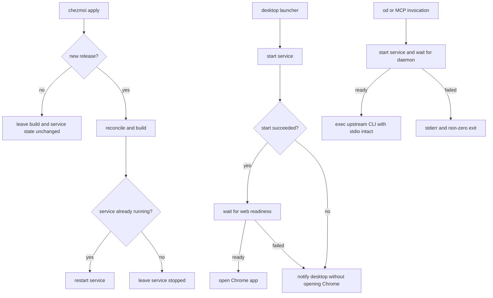
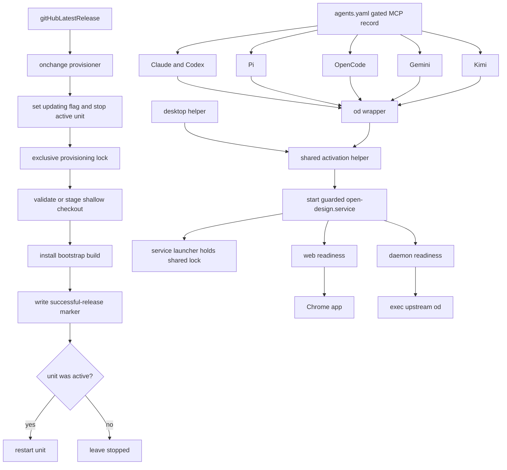

# Open Design Integration - Plan

## Goal Capsule

- **Objective:** Provision the latest Open Design release during `chezmoi apply` and expose its desktop, CLI, and MCP capabilities through one on-demand user service.
- **Product authority:** The confirmed Product Contract governs checkout ownership, update behavior, service lifetime, and failure handling; repository policy governs chezmoi lifecycle, Linux/container gates, runtime management, and non-deployment verification.
- **Open blockers:** None.

---

## Product Contract

### Summary

Manage an execution-only Open Design checkout, build the latest upstream release when it changes, and provide desktop, CLI, and MCP entry points that activate and share a disabled-by-default user service.

### Problem Frame

Open Design supports Linux but does not provide a suitable packaged application.
The working setup currently depends on a manually cloned repository, a manually built production web application, and a manually started development-tools server.
That setup is usable but is not reproducible through this dotfiles source state and does not provide stable desktop, command-line, or agent-facing entry points.

### Key Decisions

- **Resolve the latest release on every apply.** (session-settled: user-directed — chosen over a repository-pinned or first-install-only release: upstream release discovery should follow the repository's existing `gitHubLatestRelease` posture.)
- **Use a dedicated disposable checkout.** (session-settled: user-approved — chosen over reusing the developer-facing `~/src/github.com/nexu-io/open-design` checkout: automation may safely reconcile tracked files without risking development work.)
- **Keep the service on demand.** (session-settled: user-directed — chosen over login-time activation: launching the desktop application should start the server, while ordinary login should not.)
- **Keep the service independent of the Chrome window.** (session-settled: user-approved — chosen over stopping it when the app window closes: Chrome process lifetime is not a reliable proxy for the app window.)
- **Restart only an already-running service after an update.** (session-settled: user-approved — chosen over always starting the service after a build: an update should take effect immediately without changing a stopped service into a running one.)
- **Fail apply when release reconciliation fails.** (session-settled: user-approved — chosen over retaining stale state through a soft failure: release discovery and provisioning are declared apply-time dependencies.)
- **Treat desktop, CLI, and MCP as one product integration.** (session-settled: user-directed — chosen over splitting CLI/MCP into a dependent follow-up: the goal is to add the complete Open Design capability to this environment.)
- **Activate the service before every `od` invocation.** (session-settled: user-directed — chosen over maintaining a daemon-dependent subcommand list: Open Design may add or change daemon usage without requiring wrapper updates.)
- **Register MCP on every managed agent surface.** (session-settled: user-directed — chosen over selective or manual registration: Claude, Codex, Pi, and OpenCode should receive the same Open Design capability.)
- **Use user-scoped runtime IPC.** (session-settled: user-approved — chosen over upstream's shared `/tmp` default: the socket must follow this repository's per-user runtime policy.)

### Actors

- A1. **Dotfiles owner:** Applies the source state and launches Open Design from the Linux desktop.
- A2. **Chezmoi apply:** Discovers the latest release and reconciles the execution-only checkout and production build.
- A3. **User service manager:** Runs Open Design on demand and preserves its running state independently of the launcher.
- A4. **Desktop launcher:** Starts the user service and opens the local web application in Google Chrome.
- A5. **CLI caller:** Invokes `od` directly or through automation and expects the daemon to be available before the upstream CLI starts.
- A6. **Managed agents:** Claude, Codex, Pi, OpenCode, Gemini, and Kimi consume Open Design through its stdio MCP provider.

### Requirements

**Release and checkout**

- R1. Every apply must resolve the latest Open Design GitHub release, and an upstream release change must trigger reconciliation without a repository edit.
- R2. The managed checkout must live under `~/.local/share/open-design/source` and must be treated as execution-only disposable state.
- R3. The initial checkout must be shallow and subsequent reconciliation must leave it on the latest release tag.
- R4. Reconciliation may discard tracked changes within the managed checkout, but must not modify the separate checkout under `~/src/github.com/nexu-io/open-design`.
- R5. An unchanged release must not repeat dependency installation, bootstrap, or the production web build.

**Build and update**

- R6. A new release must be prepared in this order: enable Corepack without its download prompt, install dependencies, bootstrap the repository, then build `@open-design/web`.
- R7. The build must use a runtime compatible with the upstream release, currently Node.js 24 and pnpm 10 as declared by Open Design.
- R8. Release discovery, checkout, dependency installation, bootstrap, or build failure must fail the apply with an actionable error.
- R9. After a successful new build, apply must restart the Open Design service only if it was already running.
- R10. Persistent Open Design state must live at `$HOME/.od` through `OD_DATA_DIR` and must remain outside the disposable checkout.

**Service and desktop experience**

- R11. Linux hosts must receive a user systemd service that runs `pnpm tools-dev run web --prod --web-port 36947 --daemon-port 43909` from the managed checkout.
- R12. The service must not be enabled for automatic startup and must remain stopped until a desktop, CLI, MCP, or explicit user action starts it.
- R13. Once explicitly started, the service must continue running until the user stops it or the user session ends, and unexpected failures must use `Restart=on-failure`.
- R14. Linux hosts must receive an Open Design desktop entry that starts the user service idempotently, waits for `http://127.0.0.1:36947/` to become ready, and then opens it through `google-chrome --app`.
- R15. Closing the Chrome app window must not stop the user service.
- R16. When service start or web readiness fails, the launcher must not open Chrome and must send a desktop notification compatible with KDE and GNOME.
- R17. The desktop entry must use the upstream Open Design icon from `tools/pack/resources/linux/icon.png`.

**CLI and MCP**

- R18. Linux hosts must receive an executable `od` wrapper in `~/.local/bin` that delegates to the managed checkout's `apps/daemon/bin/od.mjs`.
- R19. Every `od` invocation, including help and version queries, must start the user service idempotently and wait for daemon readiness before delegating to the upstream CLI.
- R20. The wrapper must preserve stdin, stdout, stderr, arguments, exit status, and signal behavior required by ordinary CLI use and the `od mcp` stdio protocol.
- R21. Wrapper diagnostics must use stderr only, and service or readiness failure must exit non-zero without sending desktop notifications.
- R22. The service and wrapper-launched processes must use `OD_DAEMON_URL=http://127.0.0.1:43909`.
- R23. The service and wrapper-launched processes must set `OD_SIDECAR_IPC_BASE` to the user runtime directory's `open-design/ipc` directory so server and clients share the socket directory authority.
- R24. Wrapper-launched processes must set `OD_SIDECAR_IPC_PATH` to the complete user-runtime socket path `open-design/ipc/default/daemon.sock` for discovery, while the service supplies the same value for lifecycle-stamp validation.
- R25. Open Design must be registered as a common stdio MCP provider on eligible Linux non-container hosts for every agent surface currently fed by `.chezmoidata/agents.yaml`: Claude, Codex, Pi, OpenCode, Gemini, and Kimi.

The service lifecycle has two independent triggers:

### Key Flows

- F1. **First apply**
  - **Trigger:** A2 applies the source state when no managed Open Design checkout exists.
  - **Actors:** A2
  - **Steps:** Resolve the latest release, create the shallow execution-only checkout, select the release tag, install and bootstrap dependencies, and build the production web application.
  - **Outcome:** The application is built and its service is installed but stopped.
  - **Covered by:** R1, R2, R3, R6, R7, R8, R10, R12

- F2. **Apply with no new release**
  - **Trigger:** A2 applies while the locally built release remains current.
  - **Actors:** A2, A3
  - **Steps:** Resolve the latest release and compare it with the successfully built release.
  - **Outcome:** No install or build work occurs, and the service retains its current running or stopped state.
  - **Covered by:** R1, R5

- F3. **Apply with a new release**
  - **Trigger:** A2 discovers a release newer than the successfully built release.
  - **Actors:** A2, A3
  - **Steps:** Reconcile tracked checkout state to the new release, rebuild, and inspect the service's pre-update state.
  - **Outcome:** A previously running service restarts on the new build; a stopped service remains stopped.
  - **Covered by:** R3, R4, R6, R8, R9

- F4. **Launch from the desktop**
  - **Trigger:** A1 selects the Open Design desktop entry.
  - **Actors:** A1, A3, A4
  - **Steps:** Start the service idempotently, wait for web readiness, and open the local URL in Chrome app mode.
  - **Outcome:** The Open Design window opens and the service continues running after the window closes.
  - **Covered by:** R11, R12, R13, R14, R15, R16, R17

- F5. **Invoke the CLI or MCP provider**
  - **Trigger:** A5 invokes `od` or A6 starts the registered Open Design MCP provider.
  - **Actors:** A3, A5, A6
  - **Steps:** Start the service idempotently, wait for daemon readiness, apply the fixed daemon and IPC discovery environment, and replace the wrapper process with the upstream CLI.
  - **Outcome:** Ordinary CLI calls and MCP stdio sessions reach the shared daemon without wrapper output corrupting their protocol streams.
  - **Covered by:** R18, R19, R20, R21, R22, R23, R24, R25

### Acceptance Examples

- AE1. **Covers R1, R3, R5.** Given the managed checkout is built at the current latest tag, when apply runs again and upstream has no newer release, then dependency installation, bootstrap, and web build do not run.
- AE2. **Covers R1, R3, R6, R9.** Given the service is running and upstream publishes a new release, when apply succeeds, then the checkout and production build move to that release and the service restarts once.
- AE3. **Covers R9, R12.** Given the service is stopped and upstream publishes a new release, when apply succeeds, then the new build is ready and the service remains stopped.
- AE4. **Covers R4.** Given either managed build output or tracked generated changes exist in the execution-only checkout, when a new release is reconciled, then tracked changes may be discarded while `~/src/github.com/nexu-io/open-design` remains unchanged.
- AE5. **Covers R8.** Given release discovery, checkout, install, bootstrap, or build fails, when apply runs, then apply exits non-zero and identifies the failing stage.
- AE6. **Covers R12, R14, R15.** Given the service is stopped, when the desktop entry is selected and the web endpoint becomes ready, then Chrome opens; closing its window leaves the service running.
- AE7. **Covers R14, R16.** Given the service cannot start or the web endpoint does not become ready, when the desktop entry is selected, then Chrome does not open and KDE or GNOME displays an Open Design failure notification.
- AE8. **Covers R13.** Given the running Open Design process exits unexpectedly, when systemd observes the failure, then it restarts the service; an explicit user stop does not restart it.
- AE9. **Covers R18, R19, R22, R23, R24.** Given the service is stopped, when any `od` command runs, then the wrapper starts the service, waits for daemon readiness at port 43909, and delegates with matching user-runtime IPC discovery values.
- AE10. **Covers R20, R21.** Given an MCP client starts `od mcp`, when the service becomes ready, then JSON-RPC uses unmodified stdin/stdout and wrapper diagnostics do not appear on stdout.
- AE11. **Covers R20, R21.** Given the daemon cannot become ready, when an `od` command or MCP client invokes the wrapper, then it exits non-zero with stderr diagnostics and sends no desktop notification.
- AE12. **Covers R25.** Given the managed agent configurations are rendered for an eligible host, then Claude, Codex, Pi, OpenCode, Gemini, and Kimi each receive the same Open Design stdio MCP provider backed by the `od` wrapper; ineligible renders omit it.
- AE13. **Covers R10.** Given the disposable source checkout is reset or upgraded, then data under `$HOME/.od` remains intact.

### Scope Boundaries

- The existing checkout at `~/src/github.com/nexu-io/open-design` is neither adopted nor modified.
- The service is not enabled at login or boot.
- Chrome window closure does not stop the service.
- Release directories, automatic rollback, and retention of older builds are not included.
- Open Design source modification, contribution workflow, and development tooling are not included.
- Agent-specific opt-in or divergent Open Design MCP configuration is not included.
- CLI and MCP failures do not generate desktop notifications.
- Live deployment to the current home directory is not part of implementation verification unless the user requests it separately.

### Dependencies / Assumptions

- Chezmoi can resolve `nexu-io/open-design` releases through the same authenticated GitHub release mechanism already used by this repository.
- Open Design continues to expose the requested production server command and ports through its root workspace tooling.
- Google Chrome is available as `google-chrome` on targeted Linux desktop hosts.
- A freedesktop-compatible notification sender is available in KDE and GNOME sessions.
- The upstream release remains within the managed Node 24/pnpm 10 runtime contract; a future runtime change must hard-fail apply rather than silently using an incompatible local default.
- Container and non-Linux behavior follows the repository's established gates: no Open Design desktop service or launcher is provisioned where the Linux desktop integration does not apply.
- `OD_SIDECAR_IPC_BASE` controls the server's derived listen directory, while `OD_SIDECAR_IPC_PATH` is a full path used by clients for discovery and by the server for lifecycle-stamp validation; the two variables are related but not interchangeable.

### Sources / Research

- `AGENTS.md` defines apply lifecycle, fingerprinting, Linux/container gates, mise runtime ownership, and non-deployment verification.
- `.chezmoitemplates/fingerprint.tmpl` provides the existing content-driven `run_onchange` mechanism.
- `.chezmoiscripts/60-build/run_onchange_after_build-opencode-plugins.sh.tmpl` demonstrates apply-time JavaScript workspace builds without fingerprinting generated output.
- `.chezmoiscripts/60-build/run_onchange_after_build-mxm4-haptic.sh.tmpl` demonstrates user-service reload and restart-only-if-active behavior.
- `dot_config/systemd/user/mxm4-hapticd.service.tmpl` and `dot_local/share/applications/winbox.desktop.tmpl` provide adjacent user-service and desktop-entry conventions.
- `.chezmoidata/agents.yaml` is the shared MCP authority for Claude, Codex, Pi, OpenCode, Gemini, and Kimi.
- Open Design's `packages/sidecar/src/paths.ts`, `packages/sidecar/src/bootstrap.ts`, and `apps/daemon/src/daemon-url.ts` define the distinct IPC base, lifecycle-stamp, and client-discovery contracts.

**Product Contract preservation:** changed: A6, R22-R25, and AE12 clarify two verified repository constraints without changing user intent. `.chezmoidata/agents.yaml` feeds six agent surfaces rather than four, and its neutral MCP schema carries command/arguments but not a portable environment map, so the shared `od` wrapper must supply the environment.

---

## Planning Contract

### Key Technical Decisions

- KTD1. **Render the latest release tag into an onchange build script.** Resolve `nexu-io/open-design` with `gitHubLatestRelease` while rendering `.chezmoiscripts/60-build/run_onchange_after_build-open-design.sh.tmpl`. A tag change alters the rendered script hash and reruns provisioning without a dotfiles commit; unchanged tags skip install and build work. This instantiates “Resolve the latest release on every apply.” (session-settled: user-directed — chosen over a repository-pinned or first-install-only release: upstream release discovery should follow the repository's existing `gitHubLatestRelease` posture.)
- KTD2. **Own one validated disposable checkout and one durable success marker.** Provision only `~/.local/share/open-design/source`, keep lock/marker state in the owned parent rather than inside the resettable checkout, and reject symlinks, non-Git directories, or an unexpected origin. First install builds in an automation-owned staging directory and promotes it only after success, so an interrupted clone can be safely retried. Existing-release upgrades fetch the exact tag shallowly and reset tracked state in place; a failed upgrade keeps the previous marker but intentionally leaves the service stopped and the checkout unavailable until the next successful apply. This instantiates “Use a dedicated disposable checkout.” (session-settled: user-approved — chosen over reusing the developer-facing `~/src/github.com/nexu-io/open-design` checkout: automation may safely reconcile tracked files without risking development work.)
- KTD3. **Serialize provisioning against the service process itself.** Before mutation, the provisioner marks the installation as updating, records and stops an active unit, then takes an exclusive lock. The service's managed runtime launcher takes the corresponding shared lock for its lifetime and fails closed with a dedicated guard exit status when the updating flag or success-marker/HEAD check is invalid, so helper starts, direct `systemctl start`, and `Restart=on-failure` cannot run partial source or enter a guard-failure restart loop. A successful build updates the marker, clears the updating flag, releases the exclusive lock, and restarts only a previously active unit.
- KTD4. **Run Open Design through an unenabled guarded user systemd unit.** The unit delegates to the managed runtime launcher, creates `%t/open-design` with systemd runtime-directory ownership, and supplies fixed ports, `%h/.od` persistent data, and `%t/open-design/ipc` runtime IPC. Build, unit, and wrappers use one explicit non-interactive `mise exec node@24`/Corepack contract and hard-fail if upstream `engines.node` or `packageManager` leaves the supported Node 24/pnpm 10 contract. The unit has `Restart=on-failure`, prevents restart for the launcher's dedicated guard exit status, and has no enablement action or login target. This instantiates “Keep the service on demand.” (session-settled: user-directed — chosen over login-time activation: desktop, CLI, or MCP invocation starts the service while ordinary login does not.)
- KTD5. **Make `od` the final stdio and environment boundary.** `dot_local/bin/executable_od` calls the shared activation helper, exports `OD_DATA_DIR`, `OD_DAEMON_URL`, `OD_SIDECAR_IPC_BASE`, and `OD_SIDECAR_IPC_PATH`, then replaces itself with the managed upstream CLI through the same Node 24 runtime contract. It writes diagnostics only to stderr and inherits file descriptors, arguments, signals, and exit status. This instantiates “Activate the service before every `od` invocation.” (session-settled: user-directed — chosen over maintaining a daemon-dependent subcommand list: Open Design may change daemon usage without wrapper changes.)
- KTD6. **Share activation logic while keeping desktop notifications separate.** One managed helper starts the unit and polls either daemon `GET /api/ready` or the web root every 250 ms for at most 60 seconds without reading stdin. Daemon readiness requires HTTP 200 plus an Open Design JSON body with `ok: true`, `ready: true`, and a version value; daemon and web success both require the user unit to remain active so an unrelated responder cannot satisfy the probe by itself. The `od` wrapper uses daemon mode and stderr-only failures; `dot_local/bin/executable_open-design` uses web mode, opens Chrome only after readiness, and adds best-effort `notify-send` on failure. Closing Chrome does not stop the service.
- KTD7. **Add one gated neutral MCP record and filter it centrally.** Add `open-design` as stdio command `od` with argument `mcp` in `.chezmoidata/agents.yaml`, carrying Linux/non-container applicability metadata. A shared template predicate filters MCP records before all target-specific formatters consume them, preserving parity across Claude, Codex, Pi, OpenCode, Gemini, and Kimi while omitting the unusable entry in containers and non-Linux renders. This instantiates “Register MCP on every managed agent surface.” (session-settled: user-directed — chosen over selective or manual registration: every eligible MCP consumer should receive the same Open Design capability.)
- KTD8. **Keep IPC under one validated user-runtime authority.** Systemd `%t` resolves the server path. Wrappers accept `$XDG_RUNTIME_DIR` only when it is an absolute, existing, user-owned directory; otherwise they derive and validate `/run/user/$UID`, which is the Linux path behind systemd `%t`, and fail closed if neither is usable. They never fall back to cache for IPC. This instantiates “Use user-scoped runtime IPC.” (session-settled: user-approved — chosen over upstream's shared `/tmp` default: the socket must follow this repository's per-user runtime policy.)
- KTD9. **Hard-fail Open Design provisioning only.** Release lookup, checkout validation, fetch, install, bootstrap, and build failures return non-zero so chezmoi retries the failed onchange script. Runtime launch failures remain localized to the entry point: desktop shows a notification, while CLI/MCP returns stderr plus non-zero without corrupting stdout. This instantiates “Fail apply when release reconciliation fails.” (session-settled: user-approved — chosen over retaining stale state through a soft failure: provisioning is a declared apply dependency.)

### High-Level Technical Design

### Assumptions

- The upstream daemon health contract remains `GET /api/ready`, with HTTP 200 meaning ready and HTTP 503 meaning started but not ready.
- `mise exec node@24` can provide Node and Corepack to non-interactive apply and user-service contexts without relying on shell activation; metadata outside Node 24/pnpm 10 is an intentional hard failure requiring a dotfiles update.
- `notify-send` is already available on the targeted KDE/GNOME hosts; notification failure is best-effort and does not replace the helper's non-zero exit.
- `chezmoi apply --force` intentionally reruns the build even when the release tag is unchanged.
- Pi retains its existing eager MCP lifecycle, so rendering Open Design there may start the service when Pi initializes its MCP inventory.

### Risks and Mitigations

- **In-place upgrade failure:** Reset or dependency work can make the previous build unusable. Stop the service before mutation, retain the old marker as evidence rather than permission to start, and report that a formerly active service remains stopped until a successful retry.
- **Concurrent apply and agent startup:** An eager MCP client, direct systemctl start, or automatic restart can race the build. The unit's runtime launcher holds the shared lock for process lifetime, validates the updating flag plus marker, and uses a non-restartable guard exit status, while provisioning owns the exclusive side.
- **Interrupted first clone:** A direct clone into the final path can wedge future applies. Build initial state in a narrowly named staging directory under the owned parent, validate it, and atomically promote it.
- **Upstream contract drift:** Release tags may change Node, pnpm, command, health, or icon behavior. Validate declared runtime/package metadata and required artifacts before promotion; fail the apply rather than guessing.
- **Broken MCP entries on unsupported hosts:** Agent configs are retained in containers even though Open Design is not. Filter the Open Design record through shared host applicability before each consumer formats it.
- **MCP protocol contamination:** Any wrapper stdout breaks JSON-RPC. Route wrapper diagnostics to stderr and smoke-test an MCP initialize/list-tools exchange through the real wrapper boundary.
- **Partial target application before a failed after-script:** Managed helpers and agent configs can land before the build succeeds. Every entry point must validate the success marker and fail cleanly rather than start partial state.

### System-Wide Impact

- **Configuration authority:** `.chezmoidata/agents.yaml` gains per-server applicability metadata, and every MCP formatter consumes one shared filtered server list.
- **Apply lifecycle:** A new hard-fail `60-build` after-script adds network and potentially long-running Node workspace work when the upstream tag changes.
- **Runtime:** One unenabled guarded user service owns ports 36947 and 43909, persistent state under `~/.od`, and IPC under the user runtime directory.
- **Agent startup:** Pi's eager MCP lifecycle can activate Open Design at Pi startup; other harnesses activate it when spawning the MCP process.
- **Desktop:** KDE/GNOME users receive an application entry whose icon follows the managed checkout and whose helper reports launch failures through freedesktop notifications.

---

## Implementation Units

### U1. Gated MCP authority

- **Goal:** Give the neutral MCP authority one validated host-applicability mechanism before any gated server is declared.
- **Requirements:** R25; A6; AE12.
- **Dependencies:** None.
- **Files:** `.chezmoidata/agents.yaml`, `.chezmoitemplates/agent-mcp-servers-json.tmpl`, `dot_agents/private_readonly_agents.toml.tmpl`, `dot_pi/agent/private_readonly_mcp.json.tmpl`, `dot_config/opencode/readonly_opencode.json.tmpl`, `dot_gemini/config/private_readonly_mcp_config.json.tmpl`, `dot_kimi-code/private_readonly_mcp.json.tmpl`, `.chezmoiscripts/70-agents/run_onchange_after_install-dotagents-skills.sh.tmpl`, `.ci/test-open-design-mcp-render.sh`.
- **Approach:** Extend neutral records with optional `os` and `container` applicability fields. The shared helper receives root context, validates common record shape plus gate types/values, and returns the eligible list; all five formatter templates consume it before applying target-specific transport validation. Include the helper source in dotagents' selective onchange fingerprint and document the dependency in every consumer comment.
- **Patterns to follow:** `.chezmoidata/agents.yaml` marketplace `os`/`container` gates; `.chezmoitemplates/opencode-plugins-json.tmpl` for shared list filtering; existing MCP consumer validation branches.
- **Test scenarios:**
  - Existing ungated records render unchanged on Linux, macOS, Windows, and container contexts.
  - A fixture-gated record renders only for its eligible OS/container context in all consumers.
  - Missing or wrong-type `name`, `transport`, `os`, or `container` fields and unknown values fail with a server-specific error.
  - Target-specific validation still rejects incompatible auth/transport combinations after shared filtering.
- **Verification:** All consumers resolve the same eligible list, existing inventory is byte-equivalent apart from intentional formatting dependencies, and dotagents reruns when the helper changes.

### U2. Release provisioning and guarded service

- **Goal:** Reconcile and build exactly the latest Open Design release while making every service start fail closed against provisioning.
- **Requirements:** R1-R13, R22-R24; F1-F3; AE1-AE5, AE8, AE13.
- **Dependencies:** None.
- **Files:** `.chezmoiscripts/60-build/run_onchange_after_build-open-design.sh.tmpl`, `dot_config/systemd/user/open-design.service.tmpl`, `dot_local/libexec/open-design/executable_service`, `.chezmoiignore`, `.ci/test-open-design-provision.sh`, `.ci/test-open-design-activation.sh`.
- **Approach:** Render the latest tag, create an updating flag, record/stop an active unit, then acquire the exclusive lock. Validate the owned parent and existing checkout; initial install shallow-clones into a narrowly named stage and atomically promotes it, while upgrades shallow-fetch the exact tag and reset tracked state after origin/path validation. Validate the upstream Node 24/pnpm 10 metadata, run the specified Corepack/install/bootstrap/web-build sequence, verify CLI/icon artifacts, write the successful marker last, and clear the updating flag only on success. The unit delegates to a runtime launcher that validates the marker/updating flag, uses a dedicated non-restartable exit status for guard failures, and holds the shared lock for the service lifetime. The unit creates `%t/open-design` with a restrictive mode, sets `%h`/`%t` environment values, configures `RestartPreventExitStatus` for the guard status, and has no `[Install]` section.
- **Execution note:** This is packaging and provisioning glue; prove state transitions with a stubbed command harness before any optional real-network smoke.
- **Patterns to follow:** `.chezmoiscripts/00-tools/run_onchange_after_pi.sh.tmpl` for rendered release tags; `.chezmoiscripts/60-build/run_onchange_after_build-mxm4-haptic.sh.tmpl` for after-phase ordering and restart-only-if-active; `.chezmoitemplates/fingerprint.tmpl` for managed-input dependencies.
- **Test scenarios:**
  - Covers AE1. Absent checkout performs a depth-one staged clone of the resolved tag, runs Corepack with `COREPACK_ENABLE_DOWNLOAD_PROMPT=0`, install/bootstrap/build in order, validates artifacts, promotes the checkout, and writes the marker only after success.
  - Covers AE2. A validated older checkout shallow-fetches the exact new tag, stops an active service before reset, builds, writes the new marker, and restarts once.
  - Covers AE3. A stopped service remains stopped after a successful build.
  - Covers AE4. Tracked changes in the validated managed checkout are reset, untracked files are not broadly cleaned, and the separate `~/src` checkout is never referenced.
  - Covers AE5. Failure at release, fetch, install, bootstrap, or build returns non-zero, preserves the previous marker, retains the updating guard, and leaves a formerly active service stopped until a successful retry.
  - Interrupted initial stage state is recognized as automation-owned and recoverable; a symlink, unsafe parent, non-Git final directory, unexpected origin, missing CLI/icon, or unsupported upstream runtime metadata hard-fails.
  - Direct `systemctl start`, automatic restart, and helper start during provisioning all fail closed without a restart loop; an already-running service holds the shared lock and is stopped before the provisioner acquires exclusive ownership.
  - Rendered unit has `RuntimeDirectory=open-design`, restrictive runtime mode, fixed command/environment, `Restart=on-failure`, `RestartPreventExitStatus` for the guard exit, no `[Install]`, and no enable call; a genuine upstream process crash still restarts.
  - A no-user-bus build can complete, while service-state reconciliation reports that no runtime action was possible.
- **Verification:** Same-tag renders are stable; failed runs retry; successful runs leave HEAD, marker, artifact, lock, runtime directory, and service state consistent.

### U3. Shared activation preflight

- **Goal:** Give desktop and CLI entry points one service-start/readiness implementation with mode-specific output policy.
- **Requirements:** R14-R16, R19, R21-R24; F4, F5; AE6, AE7, AE9, AE11.
- **Dependencies:** U2.
- **Files:** `dot_local/libexec/open-design/executable_ensure-service`, `.ci/test-open-design-activation.sh`.
- **Approach:** Resolve the user runtime directory from a validated `$XDG_RUNTIME_DIR` or owned `/run/user/$UID`, reject cache or shared-temp fallback, start `open-design.service`, and poll a named readiness target without consuming stdin. Daemon mode requires HTTP 200 from `http://127.0.0.1:43909/api/ready` plus JSON with `ok: true`, `ready: true`, and a version value; web mode accepts a 2xx response from `http://127.0.0.1:36947/`. Both require `open-design.service` to remain active, poll every 250 ms for at most 60 seconds, and write failures plus `systemctl --user status`/journal guidance to stderr only.
- **Patterns to follow:** Repository shell strict-mode and runtime-directory policy; `dot_local/bin/executable_docker-credential-gh` for protocol-safe stderr.
- **Test scenarios:**
  - Delayed readiness succeeds before timeout for both daemon and web modes.
  - Active process with a closed port, HTTP 503 daemon readiness, malformed or semantically wrong readiness JSON, inactive-unit response, wrong responder, and timeout fail on stderr without reading stdin.
  - Unset `$XDG_RUNTIME_DIR` derives the owned `/run/user/$UID` path; missing, relative, mismatched, symlinked, or non-owned roots fail closed.
  - Service start failure and invalid success marker fail before readiness polling.
- **Verification:** Both entry points can delegate to one helper without duplicating lock, marker, systemctl, timeout, or diagnostic behavior.

### U4. CLI activation wrapper

- **Goal:** Provide a byte-clean `od` command that activates the shared daemon and safely delegates every upstream CLI/MCP invocation.
- **Requirements:** R18-R25; A5, A6; F5; AE9-AE12.
- **Dependencies:** U1, U2, U3.
- **Files:** `dot_local/bin/executable_od`, `.chezmoidata/agents.yaml`, `.ci/test-open-design-activation.sh`, `.ci/test-open-design-mcp-render.sh`.
- **Approach:** Call the shared helper in daemon mode for every invocation, export persistent data, daemon URL, IPC base, and full socket path, then `exec` the upstream CLI through the exact `mise exec node@24 -- node` invocation with unchanged arguments and file descriptors. Keep wrapper-owned output on stderr. Only after the wrapper contract exists, add the Linux/non-container `open-design` record as `od mcp`; every eligible consumer receives it through U1's filtered authority.
- **Execution note:** Start with the stdio and lifecycle harness; MCP byte cleanliness is the load-bearing behavior.
- **Patterns to follow:** `dot_local/bin/executable_docker-credential-gh` and `dot_local/bin/executable_docker-credential-glab` for protocol-sensitive wrappers; repository shell strict-mode and runtime-directory policy.
- **Test scenarios:**
  - Covers AE9. Every argument shape, including help/version, delegates to the helper and waits for daemon readiness.
  - Covers AE10. Arbitrary stdin reaches the upstream process, stdout contains only upstream bytes, stderr carries wrapper diagnostics, and exit status/termination signals propagate through `exec`.
  - Covers AE11. Missing marker, lock timeout, user-bus failure, or readiness timeout exits non-zero on stderr and never sends a desktop notification.
  - Environment observed by the upstream process contains `$HOME/.od`, port 43909, the user runtime IPC base, and the complete default socket path.
  - An `od mcp` initialize/list-tools smoke through a fake daemon produces valid JSON-RPC with no startup text on stdout.
  - Covers AE12. Eligible Claude, Codex, Pi, OpenCode, Gemini, and Kimi renders contain `od mcp`; container and non-Linux renders omit it.
- **Verification:** The wrapper is a transparent upstream process boundary after activation, and the gated MCP record never precedes or outlives wrapper availability.

### U5. Desktop launcher

- **Goal:** Open the production web UI as a normal desktop application with bounded readiness and visible launch failures.
- **Requirements:** R14-R17; A1, A3, A4; F4; AE6, AE7.
- **Dependencies:** U2, U3.
- **Files:** `dot_local/bin/executable_open-design`, `dot_local/share/applications/open-design.desktop.tmpl`, `.ci/test-open-design-desktop.sh`.
- **Approach:** Call the shared helper in web mode and launch `google-chrome --app=http://127.0.0.1:36947/` only on success. On helper failure, send one best-effort `notify-send` notification naming the service and journal guidance, then exit non-zero. Point the desktop entry at the managed upstream icon and helper.
- **Patterns to follow:** `dot_local/share/applications/winbox.desktop.tmpl` for templated absolute paths and desktop metadata; `dot_local/bin/executable_kde-color-picker` for best-effort freedesktop notifications.
- **Test scenarios:**
  - Covers AE6. A stopped service starts, readiness succeeds, Chrome receives the exact app URL once, and helper exit leaves the unit running.
  - Covers AE7. Marker, service, or readiness failure prevents Chrome, sends one notification, and exits non-zero.
  - Already-running service and repeated launcher invocation are idempotent.
  - Desktop entry renders the expected helper and existing upstream icon paths with no shell chaining in `Exec`.
- **Verification:** KDE/GNOME can discover the rendered entry, success opens only the local production URL, and failure is visible without affecting CLI/MCP stdout behavior.

### U6. Isolated render and lifecycle coverage

- **Goal:** Make the complete integration reproducibly verifiable without deploying the live home directory.
- **Requirements:** R1-R25; AE1-AE13.
- **Dependencies:** U1-U5.
- **Files:** `.ci/test-open-design-mcp-render.sh`, `.ci/test-open-design-provision.sh`, `.ci/test-open-design-activation.sh`, `.ci/test-open-design-desktop.sh`, `.ci/test-open-design-integration.sh`, `.github/workflows/render-dotfiles.yml`, `.github/workflows/ci.yml`, `AGENTS.md`.
- **Approach:** Keep focused harnesses for MCP rendering, provisioning state, activation/stdio, and desktop launch behind a small top-level runner. Render with an empty config and stub `op`; exercise external commands through task-scoped stubs. Add a named Open Design step to `ci.yml` for the hermetic runner and invoke the render assertions from `render-dotfiles.yml`'s rendered-internals job. Document ownership, hard-fail behavior, host gate, and live-apply prohibition in the repository supplement.
- **Execution note:** Prefer isolated render and stubbed integration proof; do not run live `chezmoi apply` or touch the existing manual Open Design checkout.
- **Patterns to follow:** `.ci/test-build-figma-auth.sh`, `.ci/smoke-agy-plugin-installer.sh`, and `.github/workflows/render-dotfiles.yml` internals rendering.
- **Test scenarios:**
  - All U1-U5 scenarios run from per-user or CI-provided scratch, never shared `/tmp` and never live `$HOME`.
  - Linux eligible, Linux container, and non-Linux rendering branches are asserted.
  - Rendered shell passes syntax checks, rendered JSON/TOML parse successfully, `systemd-analyze --user verify` runs when available, and `desktop-file-validate` runs when available.
  - The harness asserts that no command references `~/src/github.com/nexu-io/open-design` and no secret or rendered credential enters snapshots.
- **Verification:** The new harness passes locally and in CI, both required workflows remain green, `CLAUDE.md` remains exactly `@AGENTS.md`, and no live deployment occurs.

---

## Verification Contract

| Gate | Command or check | Proves |
|---|---|---|
| Focused integration harnesses | `.ci/test-open-design-integration.sh` dispatches the MCP-render, provision, activation, and desktop harnesses | Release state, lock/marker behavior, service lifecycle, wrapper stdio, desktop readiness, and MCP gating across U1-U5 |
| Template rendering | `chezmoi --config <empty> --source "$PWD" --destination <scratch-target> execute-template` for every changed template | Linux/container/non-Linux branches render without live-home access |
| Shell and data syntax | `bash -n` on rendered shell; parse rendered JSON and TOML; run `systemd-analyze --user verify` and `desktop-file-validate` when available | Generated targets are structurally valid and the unit intentionally lacks enablement |
| Upstream contract assertions | Provisioning harness validates metadata and required artifacts from its staged release fixture | Node/pnpm, CLI path, production command, icon, daemon URL, and IPC semantics are release-gated without relying on the separate manual checkout |
| Repository CI | `render-dotfiles.yml` and `ci.yml` | Full matrix rendering and repository checks remain green |
| Hygiene | `git diff --check`, `git status --short`, scoped diff review, and exact `CLAUDE.md` mirror check | Requested scope only, no whitespace drift, no mirror drift, no secrets |

---

## Definition of Done

- The latest upstream release tag drives an idempotent hard-fail provisioner that shallowly reconciles only the validated execution checkout and marks success only after the full build.
- Active-service upgrades stop before mutation and restart only after success; failed or partial builds cannot be started by desktop, CLI, or eager MCP clients.
- The unenabled user service runs production web and daemon processes on ports 36947 and 43909 with `$HOME/.od` persistence, user-runtime IPC, and `Restart=on-failure`.
- `od` always activates and waits for the daemon, preserves stdio/signals/exit status, and serves MCP without wrapper bytes on stdout.
- The desktop entry uses the upstream icon, waits for web readiness, opens Chrome app mode on success, and reports failure through KDE/GNOME notifications.
- Claude, Codex, Pi, OpenCode, Gemini, and Kimi receive the same `od mcp` provider on eligible Linux non-container hosts and omit it elsewhere.
- Isolated tests cover first install, no-op apply, active/stopped upgrade, failure recovery, unsafe checkout refusal, concurrent activation, wrapper/MCP stdio, desktop readiness, and all render gates.
- No live `$HOME` deployment occurs; the existing manual checkout is untouched; both repository workflows reach terminal green after the PR opens.
