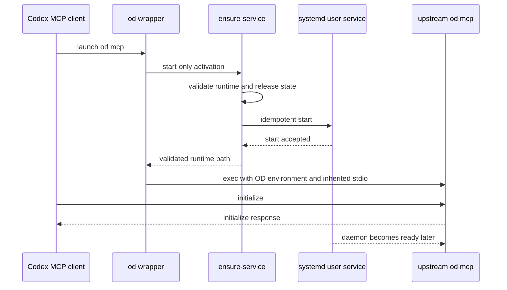

# Open Design MCP Startup - Plan

## Goal Capsule

- **Objective:** Let `od mcp` begin its stdio handshake before the Open Design daemon is ready while preserving guarded on-demand service activation.
- **Product authority:** This request supersedes the earlier requirement in `docs/plans/2026-07-24-002-feat-open-design-integration-plan.md` that every `od` invocation wait for readiness; the exception is limited to MCP startup.
- **Execution profile:** Change the managed activation helper and wrapper, protect the protocol boundary with isolated tests, and do not deploy or start the live service.
- **Open blockers:** None.

---

## Product Contract

### Summary

Start the Open Design service when an MCP client launches `od mcp`, but connect the upstream stdio MCP server as soon as guarded service activation has been accepted instead of waiting up to 60 seconds for daemon readiness.

### Problem Frame

`dot_local/bin/executable_od` currently captures the output of `ensure-service daemon`, so the upstream Node CLI cannot read the MCP `initialize` request until the daemon readiness loop succeeds.
Codex can close the startup session before that delayed handshake completes and reports `connection closed: initialize response`.
The upstream Open Design MCP server explicitly supports starting without a reachable daemon: initialization and schema discovery remain local, while daemon-backed tool calls report reachability failures.

### Requirements

- R1. `od mcp` must start the guarded user service and exec the upstream MCP CLI without waiting for daemon or web readiness.
- R2. The fast path must call `~/.local/libexec/open-design/ensure-service`; it must not bypass release-marker, updating-state, runtime-directory, or systemd-start validation.
- R3. Non-MCP `od` commands and the desktop launcher must retain their existing daemon or web readiness guarantees.
- R4. MCP stdin and stdout must remain exclusively connected to the upstream Node CLI, with no helper output, shell job text, or wrapper diagnostics on stdout.
- R5. The wrapper must preserve the existing `OD_DATA_DIR`, `OD_DAEMON_URL`, `OD_SIDECAR_IPC_BASE`, and `OD_SIDECAR_IPC_PATH` values plus argument, signal, stderr, and exit behavior.
- R6. A static wrapper preflight failure, helper-observed guard failure, or rejected systemd start must fail before the upstream CLI starts; a service guard exit or daemon failure after systemd accepts the start belongs to the upstream MCP server's daemon-reachability boundary and must not terminate its stdio session.
- R7. Concurrent MCP launches and an already-active service must remain idempotent through systemd rather than creating readiness-poller processes per client.

### Acceptance Examples

- AE1. **Covers R1, R4.** Given the service is accepted for startup but its readiness endpoint is still unavailable, when Codex launches `od mcp` and sends `initialize`, then the upstream MCP process receives it immediately and returns a valid response without helper bytes on stdout.
- AE2. **Covers R2, R6.** Given provisioning is incomplete, the release marker is unsafe, the runtime directory is unsafe, or `systemctl --user start` fails, when `od mcp` runs, then the wrapper exits non-zero on stderr before invoking the upstream CLI.
- AE3. **Covers R3.** Given the daemon is not ready, when a non-MCP `od` command runs, then delegation still waits for semantic daemon readiness; the desktop path still waits for web readiness.
- AE4. **Covers R5.** Given `od mcp` starts successfully, when the wrapper execs the upstream CLI, then all four Open Design environment values, input, arguments, stderr, exit status, and signal ownership retain the existing contract.
- AE5. **Covers R6.** Given service startup was accepted but the daemon later fails or remains unavailable, when the MCP client completes initialization, then the MCP process remains alive and a daemon-backed tool call returns the upstream reachability error.
- AE6. **Covers R7.** Given multiple MCP clients start concurrently or the service is already active, when each invokes the fast path, then each reaches its own MCP handshake while service activation remains idempotent and no readiness polling child is left attached to client stdio.

### Scope Boundaries

- The no-readiness path applies to `od mcp` subcommands only; daemon-backed ordinary CLI commands keep their readiness barrier.
- The user unit, fixed ports, release provisioner, MCP registry record, desktop launcher, and upstream Open Design source are unchanged.
- The work does not perform a live `chezmoi apply`, clone/build Open Design, or start the real user service.
- Durable background-start logging is not added because the fast path remains synchronous through guarded `systemctl start` and emits failures directly on stderr.

### Sources / Research

- `dot_local/bin/executable_od` imposes the current readiness barrier before `exec`.
- `dot_local/libexec/open-design/executable_ensure-service` owns runtime validation, release-state validation, service start, and semantic readiness polling.
- `.ci/test-open-design-activation.sh` is the isolated lifecycle and stdio contract suite used by `.ci/test-open-design-integration.sh`.
- The managed upstream `apps/daemon/src/mcp.ts` states that the MCP server launches without a daemon and defers reachability errors to tool calls.
- The managed upstream `apps/daemon/src/mcp.ts` also holds the process open until stdin closes after `server.connect`, so wrapper startup delay and preflight exits are more plausible than an immediate upstream lifecycle exit.
- No matching open GitHub issue or applicable `docs/solutions/` learning was found.

---

## Planning Contract

### Key Technical Decisions

- KTD1. **Add an explicit start-only helper mode.** Extend `ensure-service` with a mode that performs the shared runtime, marker, updating-state, and `systemctl start` checks, then prints the validated runtime directory without loading readiness-only dependencies or polling endpoints. Its success means systemd accepted the guarded unit start, not that the service completed its own guard or became ready; failures after that boundary surface through upstream daemon-reachability behavior. This is chosen over backgrounding the existing polling helper because a background process can retain or consume MCP stdio and can multiply 60-second pollers across concurrent clients.
- KTD2. **Limit fast-start to the MCP command family.** Route first-argument `mcp` invocations through start-only activation and keep the existing daemon readiness mode for every other `od` command. This is chosen over globally removing readiness because ordinary daemon-backed commands may issue their first HTTP request before the service is usable.
- KTD3. **Keep the wrapper as the final protocol boundary.** Capture the start-only helper's single runtime-path line synchronously, export the existing environment contract, and `exec` the pinned Node 24 upstream CLI unchanged. The helper may use stderr for immediate activation failures, but only the upstream process may write MCP stdout.
- KTD4. **Prove ordering without a live service.** Extend the existing fake `systemctl`, readiness, and `mise` harness so a not-ready daemon cannot delay the MCP exec, while non-MCP and desktop paths still prove readiness gating. The repository-mandated integration script remains the only full verification path.

### High-Level Technical Design

### Risks & Dependencies

- `systemctl start` is still on the critical path, but the unit is `Type=simple`, so acceptance should complete without waiting for application readiness.
- An accepted service may fail after MCP initialization; this is supported upstream behavior and must surface on daemon-backed tool calls rather than by killing the MCP process.
- Mode parsing must not accidentally treat `od mcp install`, `od mcp live-artifacts`, or future MCP subcommands as ordinary daemon-gated commands.
- Readiness-only dependency checks for `curl`, `jq`, and `timeout` must remain required for `daemon` and `web` modes but must not become artificial prerequisites for start-only activation.

---

## Implementation Units

### U1. Add guarded start-only activation

- **Goal:** Separate service-start acceptance from endpoint readiness without duplicating or weakening the activation guard.
- **Requirements:** R2, R6, R7; KTD1.
- **Dependencies:** None.
- **Files:** `dot_local/libexec/open-design/executable_ensure-service`, `.ci/test-open-design-activation.sh`
- **Approach:** Refactor the helper's common validation and idempotent start before mode-specific dependency checks and polling. Add a named start-only mode that prints exactly one validated runtime path after `systemctl start` succeeds, while `daemon` and `web` continue through their current semantic probes and failure diagnostics.
- **Patterns to follow:** Existing `resolve_runtime_dir`, `fail`, marker/updating checks, and sole-stdout-line contract in the same helper.
- **Test scenarios:**
  1. A valid stopped or active service accepts start-only activation and returns exactly the validated runtime path without invoking `curl`, `jq`, `timeout`, or `sleep`.
  2. Unsafe runtime directories, incomplete provisioning, missing or unsafe markers, and failed `systemctl start` return non-zero with no stdout.
  3. Existing `daemon` and `web` modes retain semantic readiness, inactive-unit detection, timeout diagnostics, and their exact stdout contract.
  4. Repeated start-only calls remain idempotent through repeated `systemctl --user start` requests and create no polling processes.
- **Verification:** The isolated activation suite proves the new mode and all existing readiness-mode assertions remain green.

### U2. Start MCP before readiness

- **Goal:** Make MCP initialization independent of daemon readiness while preserving the wrapper's protocol and environment contract.
- **Requirements:** R1, R3, R4, R5, R6, R7; KTD2, KTD3, KTD4.
- **Dependencies:** U1.
- **Files:** `dot_local/bin/executable_od`, `.ci/test-open-design-activation.sh`
- **Approach:** Select the helper's start-only mode when the upstream command family is `mcp`; use the existing daemon-ready mode otherwise. Capture the validated runtime line, export the unchanged environment, and retain the final `exec mise ... node "$CLI" "$@"`.
- **Execution note:** Add the ordering regression assertion before changing the wrapper so the old readiness-blocking behavior is demonstrated by the test.
- **Patterns to follow:** Existing wrapper prechecks, environment exports, and exec transparency assertions in `.ci/test-open-design-activation.sh`.
- **Test scenarios:**
  1. With daemon readiness forced false, `od mcp` invokes upstream immediately and passes MCP input/output without waiting or protocol contamination.
  2. `od mcp install`, `od mcp live-artifacts`, and a representative future-shaped MCP argument use the same start-only command-family route.
  3. A representative non-MCP command still waits for daemon readiness before upstream invocation.
  4. Missing helper, missing upstream CLI, missing `mise`, unsafe activation state, and start rejection prevent upstream invocation.
  5. Upstream arguments, all four environment values, stdin, stderr, exit status, and final process replacement remain unchanged.
  6. Service failure after accepted activation does not terminate the launched MCP process; the upstream server owns daemon-reachability reporting.
  7. A protocol-faithful isolated MCP fixture receives a valid JSON-RPC `initialize` request, emits a valid response before the former readiness barrier could complete, remains alive for a daemon-backed request, and reports daemon unreachability without closing stdio.
- **Verification:** The activation suite demonstrates CLI-before-readiness ordering and a bounded JSON-RPC initialize round trip; the full Open Design integration suite passes with isolated stubs.

---

## Verification Contract

| Gate | Applies to | Done signal |
|---|---|---|
| `bash .ci/test-open-design-integration.sh` | U1, U2 | Provision, activation, MCP render, desktop, shell syntax, and unit checks pass entirely in the isolated destination. |
| Render changed templates/scripts with `chezmoi --source "$PWD" execute-template` when applicable | U1, U2 | Every changed template or script parses in source context; plain scripts remain covered by `bash -n` inside the integration suite. |
| `git diff --check` | U1, U2 | No whitespace errors. |
| `git status --short` and requested-scope diff review | U1, U2 | Only the plan, helper, wrapper, and activation test changes are present. |
| `CLAUDE.md` exact-content check | U1, U2 | The sibling mirror remains exactly `@AGENTS.md`. |

No live apply, real service start, or real Open Design checkout/build is permitted during verification.

---

## Definition of Done

- U1 provides a guarded start-only contract without weakening existing daemon/web readiness behavior.
- U2 allows `od mcp` to reach upstream stdio initialization before daemon readiness while non-MCP commands retain their barrier.
- The regression suite proves ordering, stdio purity, environment forwarding, failure boundaries, and exit transparency.
- The complete isolated Open Design integration suite and repository quality gates pass.
- No user unit, MCP inventory, desktop behavior, live home state, or unrelated source is changed.
- Dead-end or experimental background-process code is absent from the final diff.
