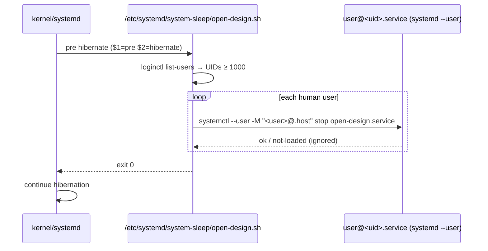

# Open Design Hibernate Stop Hook - Plan

## Goal Capsule

- **Objective:** Stop the per-user `open-design.service` before the system hibernates so the long-lived daemon and IPC sockets do not outlive the power cycle.
- **Product authority:** Repository policy governs `/etc` system-file provisioning, Linux/container gating, and non-deployment verification; the user's literal "hibernate" wording governs which sleep states trigger the stop.
- **Open blockers:** None.

---

## Summary

Add a systemd **system-sleep hook** (`/etc/systemd/system-sleep/open-design.sh`) that, on `pre hibernate` and `pre hybrid-sleep`, stops `open-design.service` for every logged-in human user via `systemctl --user -M <user>@.host`. Ship it through the existing `system.yaml` manifest (mode `0755`, no gate — the system installer is already Linux-only and container-skipped) and cover it with an isolated, stubbed CI test.

## Problem Frame

`open-design.service` is a systemd **user** service (`dot_config/systemd/user/open-design.service.tmpl`) provisioned execution-only and left unenabled. systemd does **not** stop user services when the system hibernates — the user manager is frozen, not stopped, so the Open Design daemon and its `RuntimeDirectory` sockets thaw unchanged on resume. For a hibernate (full power-off-to-disk) this is the wrong lifetime: the daemon should be cleanly stopped first.

There is no unit-level directive that stops a *user* service on hibernate, and logind's `PrepareForSleep` D-Bus signal fires for suspend, hibernate, and hybrid-sleep alike (it cannot distinguish them without extra logic). The canonical, hibernate-specific mechanism is a **system sleep hook** under `/etc/systemd/system-sleep/`, which systemd invokes with `$1=pre|post` and `$2=suspend|hibernate|hybrid-sleep|suspend-then-hibernate`.

## Requirements

- **R1.** Stop `open-design.service` before the system enters hibernation.
- **R2.** Also stop it before `hybrid-sleep` (power-off-to-disk variant), since the user's intent ("going to hibernate") covers disk-persisting sleep states.
- **R3.** Do **not** stop it on plain `suspend` (RAM-powered) — the user named hibernate specifically, and a suspend user keeps their running session.
- **R4.** Stop the service for each logged-in human user (UID ≥ 1000) whose user manager is running, not just a hard-coded user.
- **R5.** Be best-effort and never break hibernation: a missing service, an absent user manager, or a failed stop must not abort the sleep transition.
- **R6.** Provision through the existing `system.yaml` manifest and `install-system-10-files` installer — no new provisioning mechanism.
- **R7.** Verify without a live `chezmoi apply`, without starting the real user service, and without an Open Design clone/build (per repository verification policy).

## Key Technical Decisions

### KTD1. System-sleep hook (root), not a rootless D-Bus watcher

A `/etc/systemd/system-sleep/open-design.sh` hook is chosen over a rootless user service that subscribes to logind's `PrepareForSleep` signal.

- **Why:** system-sleep hooks receive `$2=hibernate|suspend|hybrid-sleep|...`, so the hook can honor R2/R3 literally (hibernate + hybrid-sleep, exclude suspend). The D-Bus signal cannot distinguish suspend from hibernate without unreliable post-hoc probing, so a rootless watcher would either over-stop (suspend too, violating R3) or need brittle action detection.
- **Why:** it is the canonical, robust systemd mechanism — no long-running listener, no `gdbus monitor` output parsing, no perpetual process.
- **Rejected alternative:** a user-level `open-design-sleep-guard.service` + `gdbus monitor` script in `dot_local/libexec/open-design/`. Rootless and matching Open Design's user-scoped philosophy, but stops on all sleep (violates R3) and adds a perpetual listener plus signal-parsing brittleness. Deferred to follow-up if a rootless variant is ever preferred over hibernate-specificity.
- **Trade-off accepted:** this adds a root-managed `/etc` file for a user-service concern. It is consistent with the repo's existing `system/linux/etc/**` + `system.yaml` model (sudoers, dconf, pam, modprobe, etc.), and the hook is a leaf script, not a new provisioning surface.

### KTD2. Enumerate logged-in human users via `loginctl list-users`

The hook iterates `loginctl list-users --no-legend`, keeps UID ≥ 1000, resolves each UID to a name with `getent passwd`, and runs `systemctl --user -M "<user>@.host" stop open-design.service`.

- **Why:** correct for multi-user and multi-seat hosts; no hard-coded username in a shared dotfiles repo.
- **Why:** `systemctl --user -M user@.host` reaches the user's user manager from the system context, which is the only way a root-run system hook can stop a *user* unit.
- **Best-effort:** every stop is `2>/dev/null || true` so an absent service or unreachable user manager never breaks hibernation (R5).

### KTD3. No host gate; rely on the installer's existing scoping

The `system.yaml` override carries only `mode: "755"` — no `gate:`.

- **Why:** Open Design itself provisions on Linux non-container hosts, and `install-system-10-files` already runs only on Linux and is skipped entirely in containers (per the container `.chezmoiignore` block). The hook's scoping therefore matches Open Design's without a redundant host fact, and the stop is a harmless no-op on a host where Open Design never ran.

## High-Level Technical Design

Plain `suspend` and `post *` invocations fall through the `case` and exit 0 without action.

## Implementation Units

### U1. Add the system-sleep hook and manifest entry

- **Goal:** Ship the hibernate/hybrid-sleep stop hook as a managed `/etc` file.
- **Requirements:** R1, R2, R3, R4, R5, R6.
- **Dependencies:** none.
- **Files:**
  - `system/linux/etc/systemd/system-sleep/open-design.sh` (create, POSIX `sh`, mode `0755`)
  - `.chezmoidata/system.yaml` (add one `overrides:` entry: `path: etc/systemd/system-sleep/open-design.sh`, `mode: "755"`)
- **Approach:**
  1. Create the hook script in POSIX `sh` (systemd runs system-sleep hooks with `/bin/sh`).
  2. `case "${1:-}/${2:-}"` matches only `pre/hibernate` and `pre/hybrid-sleep`; everything else (`pre/suspend`, `pre/suspend-then-hibernate`, all `post/*`) exits 0 without action.
  3. Inside the matched cases, enumerate human users via `loginctl list-users --no-legend | awk '$1 >= 1000 {print $1}'`, resolve each UID to a name with `getent passwd`, and run `systemctl --user -M "<user>@.host" stop open-design.service 2>/dev/null || true`.
  4. Guard every external command so a missing `loginctl`/`getent`/`systemctl` cannot abort sleep (`command -v ... >/dev/null 2>&1 || exit 0`).
  5. Add the `system.yaml` override so the installer installs the file mode `0755` (default would be `0644`, which systemd would not execute).
- **Patterns to follow:** `system/README.md` (file discovery + manifest model); existing `system/linux/etc/**` leaf scripts for tone and guards.
- **Test scenarios:**
  - Happy path: invoked as `pre hibernate` with a stubbed `loginctl`/`getent`/`systemctl`, asserts exactly one `systemctl --user -M "<user>@.host" stop open-design.service` call per human user and exit 0.
  - `pre hybrid-sleep` behaves identically to `pre hibernate`.
  - `pre suspend` invokes none of the stop command and exits 0 (R3).
  - `pre suspend-then-hibernate` invokes none of the stop command and exits 0 (not a matched state at `pre` time).
  - `post hibernate` and `post suspend` invoke none of the stop command and exit 0.
  - Missing tools: with `loginctl` absent from `PATH`, the hook exits 0 and attempts no stop (R5).
  - No human users: with `loginctl list-users` returning only system UIDs, the hook exits 0 and attempts no stop.
- **Verification:** the isolated CI test in U2 exercises every scenario above against stubs; the manifest entry is confirmed by rendering `system.yaml` and asserting the `0755` override for the path.

### U2. Add an isolated CI test and wire it into `ci.yml`

- **Goal:** Prove the hook's branch logic and best-effort guarantees without a live system or Open Design build.
- **Requirements:** R7.
- **Dependencies:** U1.
- **Files:**
  - `.ci/test-open-design-sleep-hook.sh` (create, `#!/usr/bin/env bash`, `set -euo pipefail`)
  - `.github/workflows/ci.yml` (add a `Run Open Design sleep hook` step mirroring the existing `.ci/test-open-design-integration.sh` step)
- **Approach:**
  1. Mirror the existing `.ci/test-open-design-integration.sh` harness shape: derive `repo_root`, build a per-run scratch dir under `RUNNER_TEMP`/`XDG_RUNTIME_DIR`/`$HOME/.cache`, `mktemp -d`, `trap rm -rf`.
  2. Assert the source hook exists, is a regular file, and is non-empty.
  3. Build a stub `PATH`: fake `loginctl` (emits one human UID+name line), `getent` (resolves the UID), and a `systemctl` recorder that appends each invocation to a log file.
  4. Run the hook under `sh` with each `($1,$2)` pair and assert on the recorded `systemctl` log: exactly one stop for `pre hibernate` and `pre hybrid-sleep`; zero for `pre suspend`, `pre suspend-then-hibernate`, `post hibernate`, `post suspend`.
  5. Re-run the `pre hibernate` case with `loginctl` removed from `PATH` and assert exit 0 and an empty `systemctl` log (R5).
  6. Wire the test into `.github/workflows/ci.yml` adjacent to the existing Open Design integration step, using the same `set -euo pipefail` guard.
- **Patterns to follow:** `.ci/test-open-design-integration.sh` (scratch/stub conventions); `.github/workflows/ci.yml` existing test step.
- **Test scenarios:**
  - The test itself is the verification harness; it fails loudly if any U1 scenario regresses. (`Test expectation: none -- this unit is the test harness for U1.`)
- **Verification:** the test passes in CI; `shellcheck` (run in the `render-dotfiles` workflow on the rendered script) reports no new warnings on the hook.

## Scope Boundaries

### In scope

- One system-sleep hook stopping `open-design.service` on hibernate and hybrid-sleep.
- Its `system.yaml` manifest entry.
- One isolated CI test and its CI wiring.

### Out of scope (non-goals)

- Starting or restarting `open-design.service` on resume (the service is on-demand and unenabled by design).
- Stopping Open Design on plain `suspend` (deliberately excluded — see R3/KTD1).
- Any change to the Open Design provisioner, service unit, desktop entry, or MCP entry points.

### Deferred to Follow-Up Work

- A rootless variant (`open-design-sleep-guard.service` + `gdbus monitor`) if a user-scoped, no-root solution is ever preferred over hibernate-specificity. See KTD1 rejected alternative.
- Generalizing the hook to stop additional on-demand user services on hibernate, if more such services are introduced.

## Verification Contract

- **Render check:** `chezmoi --config <empty> --source "$PWD" --destination <scratch> execute-template < .chezmoiscripts/30-linux/run_onchange_after_install-system-10-files.sh.tmpl` succeeds and the rendered installer references the new path (the manifest is rendered into the installer; a content change re-triggers the `run_onchange_`).
- **Manifest check:** `.chezmoidata/system.yaml` contains the `0755` override for `etc/systemd/system-sleep/open-design.sh`.
- **Behavioral check:** `.ci/test-open-design-sleep-hook.sh` passes locally (stubbed) and in CI.
- **No live deployment:** verification never runs `chezmoi apply`, never starts the real `open-design.service`, and never clones/builds Open Design (repository verification policy).

## Definition of Done

- The hook and manifest entry are committed; the CI test and its `ci.yml` step are committed.
- The isolated CI test passes in CI for every `($1,$2)` scenario.
- `shellcheck` (render-dotfiles workflow) is clean on the rendered hook.
- `git diff --check` is clean; the change is limited to the four files listed across U1/U2.
- The shipping branch is renamed to a work-descriptive Git-Flow slug before first push (`feat/open-design-hibernate-stop`).

## Assumptions

- "Hibernate" is interpreted literally: disk-persisting sleep states (`hibernate`, `hybrid-sleep`) trigger the stop; RAM-powered `suspend` does not. If stopping on suspend is also desired, broaden the hook's `case` — noted here so the decision is challengeable.
- The hook runs wherever `install-system-10-files` runs (Linux, non-container), matching Open Design's own provisioning scope; no separate host gate is added (KTD3).
