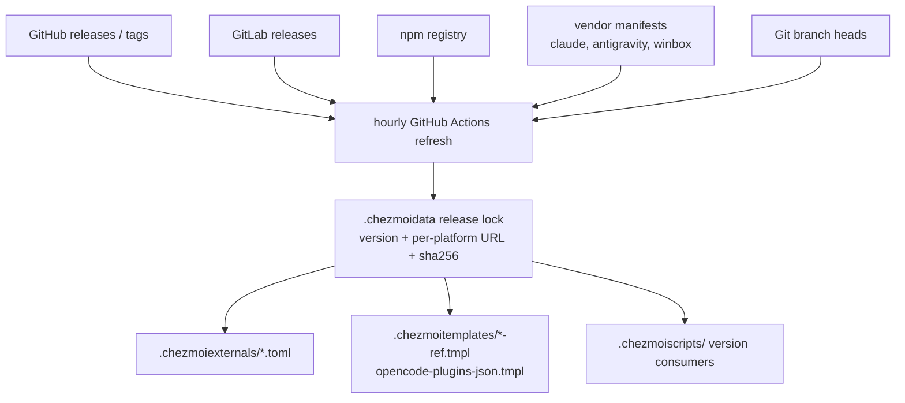
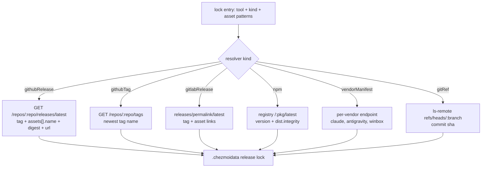

# Static Release Artifact Lock in .chezmoidata - Plan

## Goal Capsule

- **Objective:** Move every render-time external version resolution into a static artifact lock under `.chezmoidata`, so a chezmoi source-state read performs no network I/O, and keep that lock current with an hourly GitHub Actions refresh.
- **Product authority:** Repo maintainer (chezmoi source state).
- **Open blockers:** None. Coverage, lock contents, age-gate policy, and the refresh write model were settled in dialogue.
- **Product Contract preservation:** unchanged. Planning adds the HOW (lock schema, resolvers, units, verification) on top of unchanged R1–R14, F1–F3, and AE1–AE6.

---

## Product Contract

### Summary

One `.chezmoidata` lock holds every external tool's resolved version, its per-platform download URL, and that artifact's SHA-256 digest, and every external, shared template, and provisioning script reads the lock instead of calling upstream. An hourly GitHub Actions workflow re-resolves the lock from upstream and commits the result, making the render a pure data lookup.



### Problem Frame

Resolution happens at render time across roughly 32 call sites covering 22 distinct GitHub repositories plus GitLab, the npm registry, three vendor manifests, and one Git branch head. Two mechanisms are in play and they fail differently.

The chezmoi `gitHub*` builtins are HTTP-cached, but GitHub serves `Cache-Control: public, max-age=60`. Rendering `.chezmoiexternals/dev-tools.toml` inside that window costs 143 ms; outside it, 5.6 s. Seventy-five seconds after a warm render, with egress blocked, that same file fails outright on `gitHubLatestRelease`.

Calls made through `output "curl"` and `getRedirectedURL` are never cached at all. They shell out on every render — `.chezmoiexternals/ai-agents.toml` at 3.0 s, `.chezmoiexternals/system.toml` at 1.4 s, `.chezmoitemplates/glab-release-ref.tmpl` at 1.2 s — and they fail with egress blocked even immediately after a successful online render. A warm pass over the six externals files totals about 6 s, and a genuinely cold pass is higher.

So offline rendering is not degraded today; it is unavailable. Both mechanisms fail, which means a partial migration buys latency but never buys the offline property.

There is a second cost. The repository pins everything else — `mise.lock` carries URL and checksum per platform, npm dependencies are exact-pinned with a one-week floor, and `.chezmoitemplates/glab-release-ref.tmpl` exists specifically to stop two consumers from landing on different versions. The externals layer is the only remaining surface that resolves a floating `latest`, and it does so at whatever moment a host happens to apply.

### Key Decisions

- **Complete coverage, not a subset.** (session-settled: user-directed — chosen over migrating only the uncached calls, or only version strings: measurement showed a single remaining render-time lookup keeps offline rendering broken, so partial migration cannot deliver the goal.)
- **The lock stores resolved artifacts, not just versions.** Each entry carries the version, the per-platform URL, and the digest, mirroring the `mise.lock` shape already proven in this repository. Storing versions alone would leave the three checksum fetches live and offline rendering still broken.
- **No age gate on locked versions.** (session-settled: user-directed — chosen over an N-day cooldown before a bump is accepted: the lock takes upstream `latest` as resolved.) The install-time cooldowns in `packages/bunfig.toml`, `dot_bunfig.toml`, `dot_config/pnpm/config.yaml`, and `dot_yarnrc.yml` govern a different layer and are unaffected.
- **The refresh commits straight to the default branch.** (session-settled: user-approved — chosen over opening a merge request per bump: reviewing upstream releases was explicitly not a goal, so an approval gate would add friction without serving the objective.)
- **Migration lands the uncached call sites first.** They carry the entire always-paid cost and the smallest diff, so they are the first increment — but they are a milestone, not a stopping point, because offline rendering only appears once coverage is complete.

### Requirements

**Lock data**

- R1. One `.chezmoidata` file is the single source of truth for every external tool's resolved version.
- R2. Each entry carries the resolved version and, for every platform and architecture this repository targets, the exact download URL and that artifact's SHA-256 digest.
- R3. The lock covers every upstream shape resolved at render time today: GitHub releases, GitHub tags, GitLab releases, the npm registry, vendor manifests, and Git branch heads.

**Render consumers**

- R4. No template, external, or script performs network I/O while chezmoi reads the source state.
- R5. A render against a populated lock succeeds with no network reachable.
- R6. A consumer that requires a lock entry the lock does not carry fails the render loudly, and never falls back to a live lookup.
- R7. Consumers that must stay version-locked to each other continue to resolve to one identical version, as `.chezmoitemplates/glab-release-ref.tmpl` and `.chezmoitemplates/compound-engineering-ref.tmpl` guarantee today.

**Refresh automation**

- R8. A scheduled GitHub Actions workflow re-resolves every locked entry from upstream once per hour.
- R9. The workflow commits an updated lock directly to the default branch.
- R10. A run that finds no upstream change commits nothing.
- R11. A source that fails to resolve leaves its existing entry untouched and fails the run visibly, rather than dropping or blanking that entry.

**Bootstrap and integrity**

- R12. Every locked artifact carries a recorded digest, extending checksum verification from the three tools that have it today to all of them.
- R13. `.install-prerequisites.sh` stops hard-failing on a missing GitHub API token, because the source-state read no longer calls the GitHub API.
- R14. Apply-time outcomes are otherwise unchanged: the same tools land at the same paths, and `run_onchange` scripts still re-trigger when a locked version changes.

### Key Flows

- F1. Hourly refresh
  - **Trigger:** The scheduled workflow fires, or a maintainer runs it manually.
  - **Steps:** Resolve each locked entry from its upstream; resolve per-platform URLs and digests for every targeted platform; compare against the committed lock; commit only the entries that changed.
  - **Outcome:** The lock reflects current upstream state, or is unchanged when upstream is unchanged.
  - **Covered by:** R8, R9, R10, R11

- F2. Offline render and apply
  - **Trigger:** A maintainer runs `chezmoi diff` or `chezmoi apply` with no network reachable.
  - **Steps:** Templates read versions, URLs, and digests from the lock; no resolver runs.
  - **Outcome:** The render completes. Externals whose archives are already fetched and inside their refresh period need no download; anything not yet fetched still requires network.
  - **Covered by:** R4, R5

- F3. Upstream resolution failure
  - **Trigger:** An upstream source is unreachable, removed, or returns an unusable response during a refresh run.
  - **Steps:** The run surfaces the failure; the affected entry keeps its previously committed value.
  - **Outcome:** The lock stays internally consistent and every consumer keeps rendering against the last good value.
  - **Covered by:** R11

### Acceptance Examples

- AE1. **Covers R5.** Given a populated lock and no reachable network, when the source state is read, then every template renders successfully.
- AE2. **Covers R6.** Given a consumer that references a tool absent from the lock, when the source state is read, then the render fails with a message naming the missing entry, and no upstream request is made.
- AE3. **Covers R10.** Given upstream state identical to the committed lock, when the hourly workflow runs, then no commit is created.
- AE4. **Covers R11.** Given one upstream source that cannot be resolved and others that can, when the hourly workflow runs, then the resolvable entries update, the failed entry retains its prior value, and the run reports failure.
- AE5. **Covers R7.** Given `glab` and its two bundled skills in one lock, when the source state is read, then the binary and both skills resolve to the same release tag.
- AE6. **Covers R14.** Given a locked version that changed since the last apply, when `chezmoi apply` runs, then the `run_onchange` scripts consuming that version re-execute.

### Scope Boundaries

- Apply-time downloads stay online. Only *resolution* moves offline; externals still fetch archives, and `.install-prerequisites.sh` still clones prezto. This is not a fully offline first-time apply.
- No age or cooldown gate is applied to locked versions.
- No approval or merge-request gate sits in front of a version bump.
- The install-time cooldowns in `packages/bunfig.toml`, `dot_bunfig.toml`, `dot_config/pnpm/config.yaml`, and `dot_yarnrc.yml` are a separate layer and are not touched.
- Renovate is not adopted as the refresh mechanism; the non-GitHub sources would still need bespoke resolvers, so it would replace only part of the work.
- Reproducibility across hosts and relief from the GitHub anonymous rate limit are consequences of this change, not goals it is designed around.

### Dependencies / Assumptions

- The vendor endpoints currently resolved at render time — the Claude Code release manifest, the Antigravity platform manifest, and MikroTik's `LATEST.4` — stay resolvable by an automated job.
- A GitHub Actions runner can resolve assets and digests for platforms it is not itself running on, across the Linux, macOS, and Windows targets this repository supports on both `amd64` and `arm64`.
- The lock is a fingerprinted input to the `run_onchange` scripts that consume versions, so a bump continues to change their rendered content and re-trigger them.
- A GitHub API token remains useful for apply-time downloads even after the source-state read stops needing one.

### Outstanding Questions

**Deferred to Implementation**

- Whether every vendor-manifest source can carry a digest at all. MikroTik's `LATEST.4` publishes a bare version string, and the Antigravity platform manifest's digest coverage is unverified. A source that genuinely exposes none records a null digest and keeps its URL, rather than blocking the lock.
- Whether any GitHub source in scope publishes a release whose assets lack the API `digest` field (older releases predate it). Sampling found full coverage, but the resolver must still handle a null.

### Sources / Research

- Render-cost and offline behavior were measured directly in this repository at chezmoi `v2.71.0`. Warm and cold render timings, the `Cache-Control: public, max-age=60` header on GitHub API responses, and the proxy-blocked failures of both mechanisms are the basis for the Problem Frame.
- Render-time resolution call sites: `.chezmoiexternals/ai-agents.toml`, `.chezmoiexternals/dev-tools.toml`, `.chezmoiexternals/vcs.toml`, `.chezmoiexternals/k8s.toml`, `.chezmoiexternals/system.toml`, `.chezmoiexternals/fonts.toml`, `.chezmoitemplates/glab-release-ref.tmpl`, `.chezmoitemplates/compound-engineering-ref.tmpl`, `.chezmoitemplates/opencode-plugins-json.tmpl`, `.chezmoiscripts/00-tools/run_onchange_after_codex.sh.tmpl`, `.chezmoiscripts/00-tools/run_onchange_after_pi.sh.tmpl`, `.chezmoiscripts/00-tools/run_onchange_after_codegraph.sh.tmpl`, `.chezmoiscripts/00-tools/run_onchange_after_claude.sh.tmpl`, `.chezmoiscripts/00-tools/run_onchange_after_winbox-macos.sh.tmpl`, `.chezmoiscripts/60-build/run_onchange_after_build-open-design.sh.tmpl`, `.chezmoiscripts/70-agents/run_onchange_after_update-pi-extensions.sh.tmpl`.
- `mise.lock` is the in-repo precedent for the lock shape: per-platform URL plus checksum for each tool.
- `.chezmoiexternals/fonts.toml` is the precedent for an external driven entirely by `.chezmoidata`, ranging over `.fonts` rather than resolving anything itself.
- `.install-prerequisites.sh` gates the whole apply on a GitHub token, and its comment names the source-state read as the reason.
- The lockstep guarantees that must survive migration are documented in `.chezmoitemplates/glab-release-ref.tmpl` and `.chezmoitemplates/compound-engineering-ref.tmpl`.
- GitHub's release API returns a `digest` field per asset. Sampling `vercel-labs/agent-browser`, `ast-grep/ast-grep`, `artempyanykh/marksman`, `cli/cli`, and `astral-sh/uv` found digests on every asset of every release (7/7, 7/7, 6/6, 22/22, 42/42). `.chezmoiexternals/ai-agents.toml` already relies on this for agent-browser and kimi.

---

## Planning Contract

### High-Level Technical Design

Resolution collapses to a small set of resolver kinds rather than per-tool logic. Which kind a tool uses is data; the resolver itself is code.



One `githubRelease` call yields the tag and, for every platform, the asset name, download URL, and sha256 — so a Linux runner locks darwin and windows artifacts without downloading them. This is what makes R2 affordable at hourly cadence.

The lock's per-tool shape, as directional guidance rather than a schema specification:

```mermaid
flowchart LB
  A["tool key"] --> B["kind + source"]
  A --> C["version / tag"]
  A --> D["artifacts: platform-arch -> url + sha256"]
  C --> E["consumers needing only a version<br/>scripts, plugin pins, skill refs"]
  D --> F["consumers needing a download<br/>externals url + checksum"]
```

Tools whose consumers need only a version (the plugin pins, the skill refs, the script-level version consumers) carry no `artifacts` block. Only externals that download an archive need one.

### Key Technical Decisions

- KTD1. **Complete coverage of every render-time resolution site.** (session-settled: user-directed — chosen over migrating only the uncached sites or only version strings: offline render is all-or-nothing, so a single remaining lookup forfeits the goal.) Inherits the Product Contract Key Decision of the same name; covers R3, R4, R5.
- KTD2. **The lock stores resolved artifacts, not just versions** — version plus, where a consumer downloads something, the per-platform URL and sha256. Mirrors `mise.lock`, already proven in this repo. Covers R2.
- KTD3. **No age gate on locked versions.** (session-settled: user-directed — chosen over an N-day cooldown before accepting a bump: the user declined this when it was surfaced.) The install-time cooldowns in `packages/bunfig.toml`, `dot_bunfig.toml`, `dot_config/pnpm/config.yaml`, and `dot_yarnrc.yml` are a different layer and are out of scope.
- KTD4. **The refresh commits directly to the default branch.** (session-settled: user-approved — chosen over opening a merge request per bump: release approval was not among the drivers.) Covers R9.
- KTD5. **Digests come from the GitHub release API, never from downloading artifacts.** Every sampled release exposed `assets[].digest`, so one call per repo locks all platforms. This is what makes R12 tractable from a single-platform runner; without it the refresh would have to download roughly 22 repos across 6 platform targets every hour.
- KTD6. **Resolver kinds are code; asset selection is data.** Six kinds cover every source in scope. Per-tool asset naming — which lives in the current templates as bespoke `printf` shapes — moves into the lock's config as patterns, so adding a tool is a data edit.
- KTD7. **One shared read template is the only consumer entry point.** Consumers look a tool up through it rather than indexing the data file directly, so the missing-entry failure in R6 is enforced in one place instead of at every call site.

### Assumptions

- The refresh batches every changed entry into one commit per run rather than one commit per tool.
- The lock is a single `.chezmoidata` file rather than several, matching how `packages.yaml` and `agents.yaml` already carry large domains.
- npm's registry response supplies a usable per-version digest, so npm-sourced entries need no separate fetch.
- The existing `run_onchange` fingerprints pick the lock up as an input, so a version bump keeps re-triggering the scripts that consume it.

### Risks

- **A wrong asset pattern breaks a platform CI cannot exercise.** The runner is Linux; darwin and windows entries are locked from API metadata and never installed during verification. Mitigation: V5 spot-checks digests against real downloads for at least one darwin and one windows artifact.
- **Hourly commits to the default branch add history churn.** Mitigation: R10 makes a no-change run commit nothing, so churn tracks actual upstream activity.
- **A source stops publishing digests.** Mitigation: R11 keeps the prior entry rather than blanking it, and the resolver tolerates a null digest instead of failing the whole run.

---

## Implementation Units

### U1. Add the release lock and its shared read template

- **Goal:** Establish the data file and the single lookup path every consumer will use.
- **Requirements:** R1, R2, R6, R7 (KTD2, KTD7)
- **Dependencies:** none
- **Files:** `.chezmoidata/releases.yaml`, `.chezmoitemplates/release-lock-ref.tmpl`, `AGENTS.md`
- **Approach:** Seed the lock with the current resolved values so nothing changes behaviorally on the first commit. The read template takes a tool key, returns the version or a platform's artifact, and fails with a message naming the missing key. Lockstep groups (glab's binary plus its two bundled skills; compound-engineering's consumers) resolve through one shared key so R7 holds structurally.
- **Patterns to follow:** `.chezmoiexternals/fonts.toml` ranging over `.fonts`; the lockstep rationale comments in `.chezmoitemplates/glab-release-ref.tmpl`.
- **Test scenarios:** A known key returns its version. A known key plus platform returns url and sha256. An absent key fails the render with the key named, and issues no network call. A tool with no `artifacts` block still resolves a version.
- **Verification:** The template renders under the isolated recipe and a deliberately-missing key aborts the render.

### U2. Build the refresh resolver

- **Goal:** Produce the six resolver kinds that regenerate the lock from upstream.
- **Requirements:** R3, R11, R12 (KTD5, KTD6)
- **Dependencies:** U1
- **Files:** the resolver source under `packages/` plus its test file, and `packages/README.md`
- **Approach:** One entry point reads the lock's config, dispatches per kind, and emits a new lock. GitHub release resolution takes tag, asset names, URLs, and digests from a single response. Null digests are recorded as null, not treated as failure. A source that fails to resolve is reported and its previous entry is carried forward untouched.
- **Execution note:** Resolve GitHub first and confirm real digests land before adding the other five kinds.
- **Patterns to follow:** the existing single-call release handling in `.chezmoiexternals/ai-agents.toml` for agent-browser and kimi.
- **Test scenarios:** Covers R11. A resolver whose source 404s leaves the prior entry intact and marks the run failed. Covers R12. A GitHub release with digests on every asset produces a complete artifacts block. An asset lacking a digest records null and keeps its URL. An unchanged upstream produces a lock byte-identical to the committed one. A tool whose asset pattern matches nothing fails loudly rather than emitting an empty artifacts block.
- **Verification:** Running the resolver against the committed lock with unchanged upstream produces no diff.

### U3. Add the hourly refresh workflow

- **Goal:** Run the resolver on a schedule and commit only real changes.
- **Requirements:** R8, R9, R10
- **Dependencies:** U2
- **Files:** `.github/workflows/refresh-release-lock.yml`
- **Approach:** Scheduled hourly plus manual dispatch. The job runs the resolver, commits the lock to the default branch when it changed, and exits non-zero when any source failed to resolve even if others succeeded.
- **Test scenarios:** Covers R10. A run against unchanged upstream produces no commit. Covers R11. A run with one failing source still commits the resolvable entries and reports failure. A manual dispatch behaves identically to the scheduled trigger.
- **Verification:** A manual dispatch on a branch produces either no commit or a lock diff limited to changed entries.

### U4. Migrate the uncached call sites

- **Goal:** Remove every `output "curl"`, `getRedirectedURL`, and `ls-remote` from the render path — the always-paid cost and the sites that fail offline unconditionally.
- **Requirements:** R4, R7
- **Dependencies:** U1
- **Files:** `.chezmoiexternals/ai-agents.toml`, `.chezmoiexternals/dev-tools.toml`, `.chezmoiexternals/system.toml`, `.chezmoitemplates/glab-release-ref.tmpl`, `.chezmoitemplates/compound-engineering-ref.tmpl`, `.chezmoitemplates/opencode-plugins-json.tmpl`
- **Approach:** Replace each fetch with a lock lookup. The claude, kimi, agent-browser, antigravity, and winbox entries lose their API calls; the pi, aoe, and jq checksum fetches read the locked digest instead. The glab and compound-engineering ref templates become lock reads while keeping their lockstep contracts and their explanatory comments.
- **Patterns to follow:** the existing constructed-URL form already used for kimi and agent-browser rather than an asset-URL API call.
- **Test scenarios:** Each modified file renders under the isolated recipe. Covers R7 / AE5. glab's binary and both bundled skills resolve to one tag. The compound-engineering tag still carries its prefix filter semantics. Each entry's rendered URL and checksum match what the pre-migration render produced.
- **Verification:** These files render with egress blocked.

### U5. Migrate the chezmoi gitHub builtins

- **Goal:** Remove the remaining `gitHubLatestRelease`, `gitHubReleaseAssetURL`, `gitHubLatestReleaseAssetURL`, `gitHubReleases`, and `gitHubLatestTag` calls from the render path.
- **Requirements:** R4, R5
- **Dependencies:** U1, U4
- **Files:** `.chezmoiexternals/ai-agents.toml`, `.chezmoiexternals/dev-tools.toml`, `.chezmoiexternals/vcs.toml`, `.chezmoiexternals/k8s.toml`, `.chezmoiexternals/system.toml`, `.chezmoiexternals/fonts.toml`
- **Approach:** Each external takes its URL and checksum from the lock. Per-tool asset naming moves into the lock config. `fonts.toml` already ranges over `.chezmoidata`; it changes only where it calls the asset-URL builtin.
- **Test scenarios:** Covers R5. Every externals file renders with egress blocked. Each tool's rendered URL matches the pre-migration value for linux, darwin, and windows. The musl-linux branch still selects the musl asset. A tool with per-OS variants resolves the right asset per platform.
- **Verification:** No `gitHub*` builtin remains in `.chezmoiexternals/`.

### U6. Migrate the script-level version consumers

- **Goal:** Remove render-time resolution from the provisioning scripts.
- **Requirements:** R4, R14
- **Dependencies:** U1
- **Files:** `.chezmoiscripts/00-tools/run_onchange_after_codex.sh.tmpl`, `.chezmoiscripts/00-tools/run_onchange_after_pi.sh.tmpl`, `.chezmoiscripts/00-tools/run_onchange_after_codegraph.sh.tmpl`, `.chezmoiscripts/00-tools/run_onchange_after_claude.sh.tmpl`, `.chezmoiscripts/00-tools/run_onchange_after_winbox-macos.sh.tmpl`, `.chezmoiscripts/60-build/run_onchange_after_build-open-design.sh.tmpl`, `.chezmoiscripts/70-agents/run_onchange_after_update-pi-extensions.sh.tmpl`
- **Approach:** Each script reads its version from the lock. Where a script fingerprints its dependencies, the lock joins the fingerprint globs so a bump still re-triggers it.
- **Test scenarios:** Covers R14 / AE6. Changing a locked version changes the rendered script content, so `run_onchange` re-fires. An unchanged lock leaves rendered content byte-identical, so no script re-fires. Each script renders with egress blocked.
- **Verification:** Rendered script text before and after a simulated version bump differs only in the version.

### U7. Relax the bootstrap token gate and update documentation

- **Goal:** Stop hard-failing the bootstrap on a missing GitHub token, and document the new source of truth.
- **Requirements:** R13
- **Dependencies:** U4, U5, U6
- **Files:** `.install-prerequisites.sh`, `AGENTS.md`, `README.md`
- **Approach:** The token check becomes advisory: the source-state read no longer calls the GitHub API, while apply-time downloads still benefit from a token. `AGENTS.md` gains the lock in its single-source-of-truth table; `README.md`'s token section is rewritten to match the softened gate.
- **Test scenarios:** Covers R13. The bootstrap completes with no token in the environment and emits a notice rather than exiting non-zero. A token still present changes nothing. `CLAUDE.md` remains exactly `@AGENTS.md`.
- **Verification:** The bootstrap's own test harness passes with the token unset.

---

## Verification Contract

The repo has no unit-test suite for templates — verification is render-time, through the stub-`op` + throwaway-destination recipe in `AGENTS.md`, always with `--source "$PWD"`. Never run a live `chezmoi apply` against the real `$HOME`. Resolver units under `packages/` verify with `vp check` and `vp run -r test`.

- V1 (renders clean). Every modified template and externals file renders exit 0 under the stub-`op` recipe.
- V2 (offline render — the primary gate). With egress blocked, every file in `.chezmoiexternals/`, the shared templates, and the migrated scripts render exit 0. This is the goal's acceptance test; before this change the same command fails on both mechanisms.
- V3 (no render-time network). Searching the migrated surface for `gitHubLatestRelease`, `gitHubReleaseAssetURL`, `gitHubLatestReleaseAssetURL`, `gitHubReleases`, `gitHubLatestTag`, `getRedirectedURL`, `output "curl"`, and `ls-remote` returns zero hits.
- V4 (no behavioral drift). For each migrated tool, the rendered URL and checksum match the values the pre-migration render produced on the same day, across linux, darwin, and windows.
- V5 (digest correctness). Download at least one linux, one darwin, and one windows artifact and confirm the hash matches the locked digest.
- V6 (resolver idempotence). Re-running the resolver against unchanged upstream produces no lock diff.
- V7 (CI). `render-dotfiles.yml` and `ci.yml` stay green on the PR.

---

## Definition of Done

- DoD1. `.chezmoidata/releases.yaml` is the only source of external versions, URLs, and digests, and every consumer reads it through the shared template.
- DoD2. A render with no network reachable succeeds for every externals file, shared template, and migrated script.
- DoD3. No render-time network call remains anywhere in the source state (V3 returns zero hits).
- DoD4. Every locked artifact a consumer downloads carries a sha256, extending checksum verification from three tools to all of them.
- DoD5. The hourly workflow refreshes the lock, commits only real changes, and fails visibly on an unresolvable source without blanking its entry.
- DoD6. Migrated tools resolve to the same URLs and checksums as before the change on all three operating systems.
- DoD7. The bootstrap no longer hard-fails without a GitHub token, and `AGENTS.md` plus `README.md` describe the lock and the softened gate.
- DoD8. `run_onchange` scripts still re-fire on a version bump and stay quiet when the lock is unchanged.
