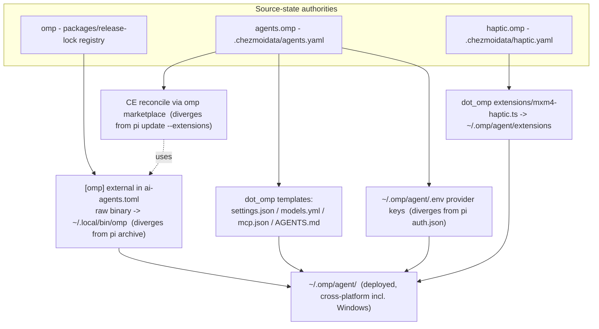

# Add oh-my-pi (omp) Agent Surface - Plan

## Goal Capsule

- **Objective:** Add oh-my-pi (`omp`) as a managed agent surface alongside pi, mirroring pi's managed-config pattern but adapted to omp's lone-binary distribution, `~/.omp/agent/` config dir, built-in MCP runtime, and marketplace plugin model. Port compound-engineering to omp via its marketplace and add omp to figma-auth.
- **Product authority:** This plan owns the omp managed surface only. pi is not active scope (untouched except a shared doc line); omp's own capabilities beyond config management (LSP, DAP, Python/Bun sandbox, browser, native addons) are not active scope.
- **Open blockers:** None. Product scope decisions are settled; planning-time clarifications are recorded as KTDs; remaining unknowns are implementation-time (OQ-A–OQ-E).

---

## Product Contract

*Product Contract preserved. Planning-time clarifications below refine HOW the product intent is met; none change product scope. Tracked in the Planning Contract KTDs.*

- **R2 refined** — release-locked externals track latest upstream via the lock (as pi/codegraph do). The ≥1-week cooldown is a `package.json`-dependencies policy and does not apply to `.chezmoiexternals` release CLIs.
- **R7 refined** — omp has no `auth.json`; credentials live in `~/.omp/agent/agent.db` (OAuth/keys via omp `/login`) plus `~/.omp/agent/.env` and `models.yml` `apiKey`. Static API-key providers render to a managed `~/.omp/agent/.env`; OAuth is left to omp `/login`. The pi auth.json merge script does not transfer.
- **R11 refined** — omp is cross-platform (it ships `omp-windows-x64.exe`), unlike POSIX-only pi. omp config deploys on Windows; only the mxm4-haptic extension is POSIX-only.
- **R4/R5 format** — omp's managed models baseline is `models.yml` (omp-preferred; legacy `models.json` auto-migrates).

### Summary

Add `omp` as a fully managed agent in this dotfiles, modeled on the existing pi surface: a release-locked binary external, `agents.omp` data driving managed-readonly config under `~/.omp/agent/`, a managed `.env` for provider keys, omp's built-in MCP, compound-engineering delivered through omp's marketplace, and an omp target in figma-auth. omp sits beside pi, not as a replacement.

### Problem Frame

The user runs both pi and its fork oh-my-pi (`omp`, fork of `badlogic/pi-mono`) and wants omp managed by these dotfiles the same way pi is — managed settings/models/auth, release-pinned binary, shared MCP, and on-demand Figma auth — so omp is not a hand-maintained outlier. omp is batteries-included (built-in MCP, native Anthropic OAuth, built-in subagents/ask_user/fuzzy search) and ships as a lone per-platform binary with a marketplace plugin model, so pi's archive distribution, extension packages, and `update --extensions` reconcile do not transfer verbatim. The work is to copy pi's *managed-config* pattern and adapt the pieces omp does differently.

### Key Decisions

- **Release-locked lone-binary external.** omp ships one raw binary per platform (`omp-linux-x64`, `omp-darwin-arm64`, `omp-windows-x64.exe`), not pi's whole-directory bundle, so it is pinned as a binary external like codegraph/cli-proxy-api rather than pi's archive plus symlink script. *(session-settled: user-directed — chosen over npm/bun/mise: matches the repo convention that standalone release CLIs live in `.chezmoiexternals`.)*
- **omp managed config mirrors pi's managed-readonly model**, adapted to `~/.omp/agent/` (settings, models, mcp, AGENTS).
- **Prune the MCP and Anthropic-auth plugins.** omp has a built-in MCP runtime and native Anthropic OAuth, so the two pi packages that exist only to supply those are redundant. *(session-settled: user-directed — chosen over full pi package parity: omp is batteries-included.)*
- **Port compound-engineering to omp via omp's marketplace/plugin mechanism**, not pi's native `git:` settings source, with a reconcile step. *(session-settled: user-directed — chosen over plugin-free and over mirroring pi's npm list: user wants CE on omp, delivered through omp's native plugin model.)*
- **Add omp to figma-auth.** A new omp storage adapter gives omp the same on-demand Figma-MCP auth as opencode/pi/antigravity/kimi. *(session-settled: user-directed.)*
- **omp alongside pi, not a replacement.** pi's surface is unchanged; only shared documentation gains an omp line.

### Requirements

**Install and release lock**

- R1. omp resolves as a release-locked lone-binary external placing the binary at `~/.local/bin/omp` (`.exe` on Windows), with tag, per-platform URL, and sha256 read through the release lock.
- R2. The omp release-lock entry tracks omp's latest release via the lock, consistent with pi/codegraph.
- R3. No pi-style archive extraction or version-directory symlink/prune script is added for omp; the binary is placed directly.

**Managed agent configuration**

- R4. An `agents.omp` data block drives a managed-readonly omp `settings.json`, a managed models baseline, and `auth.providers` static API-key entries (kimi, zai), mirroring `agents.pi`.
- R5. `dot_omp/private_agent/` templates render omp's `settings.json`, `models.yml`, `mcp.json`, and `AGENTS.md` under `~/.omp/agent/`.
- R6. omp's MCP server list is treated as live at runtime because omp has a built-in MCP runtime (unlike pi's mcp.json, which is inert without an extension).

**Auth and secrets**

- R7. omp static provider credentials (kimi, zai) render to a managed `~/.omp/agent/.env`; OAuth providers use omp's native `/login` and are not chezmoi-managed.
- R8. A figma-auth omp storage adapter writes Figma-MCP credentials to `~/.omp/agent/mcp-auth/`, and `omp` is registered as a figma-auth target alongside opencode/pi/antigravity/kimi.

**Plugins**

- R9. compound-engineering is installed on omp through omp's marketplace/plugin mechanism and reconciled by an onchange step; no pi-style `update --extensions` script is used.
- R10. No separate MCP-client or Anthropic-auth package is added for omp, and the pi npm package list (pi-subagents, pi-ask-user, pi-fff, fff-bun) is not ported.

**Gating, documentation, and haptic**

- R11. omp is cross-platform: config deploys on POSIX and Windows; only the mxm4-haptic extension (which shells out to the POSIX-only haptic daemon) is skipped on Windows. omp CLI dotfiles remain deployed in containers, matching pi.
- R12. `AGENTS.md` (and any pi/omp doc surface) documents omp's managed model so the source-state description stays accurate.
- R13. omp receives haptic event waveforms and the mxm4-haptic delivery at parity with pi.

### Acceptance Examples

- AE1. **Windows host** — omp config (`settings.json`, `models.yml`, `mcp.json`, `AGENTS.md`) deploys; only `.omp/agent/extensions/mxm4-haptic.ts` is skipped (no haptic daemon). The omp binary external resolves `omp-windows-x64.exe`. **Covers R11.**
- AE2. **Container host** — omp CLI dotfiles and managed config deploy; the haptic plugin/extension is skipped because there is no MX Master 4. **Covers R11, R13.**
- AE3. **Release refresh** — the omp lock entry resolves omp's latest release with per-platform URL + sha256 (no SHA256SUMS sidecar; sha256 comes from the GitHub release asset digest). **Covers R2.**

### Success Criteria

- A scratch render/apply (per the repo's op-stub verification) deploys the omp external and `dot_omp` templates with no rendered secret leakage.
- `bun test` in `packages/figma-auth` passes with the omp adapter and its storage test.
- omp managed config lands under `~/.omp/agent/` and `omp` is a working figma-auth target.

### Scope Boundaries

Deferred for later:

- omp capabilities beyond config management (LSP/DAP wiring, Python/Bun sandbox, browser tool, native-addon architecture) — omp ships these; this plan only manages config.
- Migrating pi users onto omp or removing pi.

Outside this plan:

- Modifying pi's existing surface; pi stays as-is except the shared doc line in R12.
- Porting pi's npm extension packages to omp.

### Dependencies and Assumptions

- R13 assumes omp's extension event surface is pi-compatible; omp's hooks doc confirms the same `pi.on(...)` API and equivalent events (`agent_start`, `agent_end`, `turn_end`, `tool_call`). Exact event-name mapping is an implementation confirmation (OQ-D).
- omp's marketplace is compatible with the Claude Code plugin registry format, which is the basis for delivering compound-engineering (R9); EveryInc's `compound-engineering-plugin` ships `.claude-plugin/marketplace.json`, which omp accepts as a fallback catalog.
- omp resolves credentials from `agent.db` + `.env` + `models.yml` `apiKey` + env vars (no `auth.json`).

### Outstanding Questions

Resolve before planning: none.

Resolved during planning: OQ1 (auth) → KTD6; OQ2 (CE marketplace) → KTD3; OQ4 (models format) → KTD7; OQ5 (haptic) → KTD8; cross-platform gating → KTD9.

Deferred to implementation:

- OQ-A. omp external type — confirm the downloaded asset is a raw binary (`type = "file"`) vs an archive (`type = "archive-file"` with `path`); ensure the executable bit.
- OQ-B. omp `mcp.json` management mode — managed-readonly (pi parity, blocks omp `/mcp add` persistence) vs live-merge; recommend readonly parity, confirm.
- OQ-C. Exact omp marketplace `name@marketplace` string for compound-engineering and whether `omp plugin install` is idempotent for a reconcile script.
- OQ-D. mxm4-haptic omp event-name mapping (pi `after_provider_response`/`agent_settled` → omp equivalents) and omp extension import package name (`@oh-my-pi/pi-coding-agent`).
- OQ-E. Whether `.chezmoiignore` should also skip `.omp/agent/mcp.json` + `AGENTS.md` on Windows (pi omits those) or deploy them (omp is cross-platform); lean deploy.

### Sources

- omp docs (`github.com/can1357/oh-my-pi/tree/main/docs`): `config-usage.md`, `mcp-config.md`, `models.md`, `marketplace.md`, `secrets.md`, `providers.md`, `hooks.md`, `extension-loading.md`.
- omp release assets (raw per-platform binaries, incl. `omp-windows-x64.exe`); latest tag `v17.1.8`.
- CE plugin repo `EveryInc/compound-engineering-plugin` ships `.claude-plugin/marketplace.json` (omp marketplace fallback).
- Repo pi pattern: `.chezmoiexternals/ai-agents.toml` (`[pi]`), `.chezmoiscripts/00-tools/run_onchange_after_pi.sh.tmpl`, `.chezmoidata/agents.yaml` (`agents.pi`), `dot_pi/private_agent/`, `.chezmoiscripts/70-agents/run_onchange_after_config-pi-auth.sh.tmpl`, `run_onchange_after_update-pi-extensions.sh.tmpl`, `.chezmoidata/haptic.yaml` (`haptic.pi`), `.chezmoiignore` (pi POSIX/container gating), `packages/figma-auth/src/storage/pi.ts`, `packages/release-lock/src/registry.ts` + `github.ts` + `test/registry.test.ts`.

---

## Planning Contract

### Key Technical Decisions

- KTD1. **omp install is a release-locked lone-binary external** (`type = "file"` raw binary → `~/.local/bin/omp`, `.exe` on Windows). *(session-settled: user-directed — chosen over npm/bun/mise: standalone release CLIs live in `.chezmoiexternals`.)*
- KTD2. **No MCP-client or Anthropic-auth plugin for omp**; the pi npm extension list is not ported. omp is batteries-included. *(session-settled: user-directed.)*
- KTD3. **compound-engineering on omp via omp's marketplace**, consuming `EveryInc/compound-engineering-plugin`'s `.claude-plugin/marketplace.json` (omp's Claude-compatible fallback), reconciled by an onchange script (`omp plugin marketplace add` + `omp plugin install`). *(session-settled: user-directed.)*
- KTD4. **omp is a figma-auth target** (`OmpStorage` → `~/.omp/agent/mcp-auth/`). *(session-settled: user-directed.)*
- KTD5. **omp alongside pi**; pi's surface is unchanged except a shared doc line. *(session-settled: user-directed.)*
- KTD6. **omp provider auth renders to a managed `~/.omp/agent/.env`** (0600) from `agents.omp.auth.providers` (kimi/zai static API keys). omp has no `auth.json`; OAuth (anthropic) uses omp's native `/login` into `agent.db` and is not chezmoi-managed. Resolves OQ1.
- KTD7. **omp models baseline is `models.yml`** (omp-preferred). Resolves OQ4.
- KTD8. **mxm4-haptic deploys to `~/.omp/agent/extensions/mxm4-haptic.ts`** via omp's native extension discovery; the extension uses omp's `pi.on(...)` API (fork-compatible). Resolves OQ5.
- KTD9. **omp is cross-platform** — config templates are not POSIX-gated (deploy on Windows too); only the mxm4-haptic extension template is POSIX-gated. Corrects the requirements' POSIX-only assumption.

### High-Level Technical Design

omp's managed surface is pi's fan-out with the distribution, auth, and plugin seams swapped. The fan-out below shows the source-state authorities and where each divergence lands.

Three seams diverge from pi and drive most of the implementation risk: (1) raw-binary external vs archive, (2) `.env` auth vs `auth.json` merge, (3) marketplace CE vs `update --extensions`. Everything else (managed-readonly settings, shared MCP render, haptic extension, figma-auth adapter) is a near-1:1 mirror of pi.

---

## Implementation Units

### U1. Add omp to the release-lock registry and refresh the lock

- **Goal:** Register omp as a release-locked tool so its tag, per-platform URL, and sha256 are resolvable through `release-lock-ref.tmpl`.
- **Requirements:** R1, R2.
- **Dependencies:** none.
- **Files:** `packages/release-lock/src/registry.ts`, `packages/release-lock/test/registry.test.ts`, `.chezmoidata/releases.json` (generated).
- **Approach:** Add an `omp` entry to the `REGISTRY` object mirroring the `codegraph` lone-binary shape, but matching omp's asset naming. omp assets are raw binaries named `omp-<os>-<x64arch>[.exe]` using chezmoi os values (`linux`/`darwin`/`windows`) — not codegraph's `win32`. There is no `windows-arm64` asset. sha256 comes from the GitHub release `digest` field (no SHA256SUMS sidecar). Then run the release-lock CLI to resolve omp into `releases.json`.
- **Patterns to follow:** `codegraph` and `pi` entries in `registry.ts`; the `EXPECTED` table + partition assertions in `test/registry.test.ts`.
- **Test scenarios:**
  - **Happy path (asset selector):** for each target platform the selector returns the exact asset name: `linux-amd64→omp-linux-x64`, `linux-arm64→omp-linux-arm64`, `darwin-amd64→omp-darwin-x64`, `darwin-arm64→omp-darwin-arm64`, `windows-amd64→omp-windows-x64.exe`, `windows-arm64→null`. Covers R1, AE3.
  - **Parity table:** an `omp` row is added to `EXPECTED` with those six values; the partition tests pass (omp has an `asset` function; table covers exactly the spec platforms).
  - **Lock resolution:** after the CLI refresh, `releases.json` has an `omp` entry with `version`, `source: can1357/oh-my-pi`, and per-platform `artifacts` (`url` + 64-hex `sha256`) for the five present platforms, `windows-arm64` absent.
- **Verification:** `bun test` in `packages/release-lock` is green; `release-lock` refresh writes the `omp` entry without a resolve failure.

### U2. omp binary external and agents.omp data block

- **Goal:** Wire the omp binary into `.chezmoiexternals` and declare the `agents.omp` data that feeds the managed-config templates.
- **Requirements:** R1, R3, R4, R10; carries R13 data.
- **Dependencies:** U1.
- **Files:** `.chezmoiexternals/ai-agents.toml`, `.chezmoidata/agents.yaml`, `.chezmoidata/haptic.yaml`.
- **Approach:** Add an `[omp]` external block (POSIX + Windows; no OS gate — omp is cross-platform) of `type = "file"` resolving the locked URL to `.local/bin/omp` (`.exe` on Windows), with `[omp.checksum] sha256` from the lock — modeled on the `cli-proxy-api`/`codegraph` blocks, not pi's archive block. Confirm whether `type = "file"` preserves the executable bit (OQ-A); add a tiny onchange `chmod` if needed. No `run_onchange_after_omp` symlink script (R3). Add an `agents.omp` block to `agents.yaml` mirroring `agents.pi`: `models.providers: {}` empty baseline, `settings` (managed-readonly omp `settings.json` keys — `theme`, `defaultProvider`, `defaultModel`, `defaultThinkingLevel`, `subagents`, `warnings`; the `packages` list OMITS `pi-mcp-extension` and `@gotgenes/pi-anthropic-auth` per KTD2 and contains only the omp-relevant sources), and `auth.providers` (kimi, zai `op://` keys). Add a `haptic.omp` block to `haptic.yaml` mirroring `haptic.pi` (`settled`/`failed`/`question` waveform names).
- **Patterns to follow:** `[cli-proxy-api]`/`[codegraph]` external blocks; `agents.pi` data block; `haptic.pi`.
- **Test scenarios:**
  - **Happy path (render):** `chezmoi execute-template` over `ai-agents.toml` renders the `[omp]` block with a concrete locked URL + sha256 on Linux, macOS, and Windows. Covers R1.
  - **No-symlink-script (R3):** no `run_onchange_after_omp` script is created; the binary external is the only install mechanism.
  - **Packages prune (R10):** rendered `agents.omp.settings.packages` contains neither `pi-mcp-extension` nor `@gotgenes/pi-anthropic-auth`.
  - **Edge case (data parity):** `agents.omp.models.providers` is `{}` (empty baseline, no `op://`); `haptic.omp` values are all within the 16-name waveform vocabulary.
- **Verification:** `ai-agents.toml` renders an `[omp]` block for all three OSes; `agents.yaml` lints; no pi symlink script exists.

### U3. dot_omp managed-config templates and the AGENTS harness branch

- **Goal:** Render omp's managed config under `~/.omp/agent/` and teach the shared instructions template about the omp harness.
- **Requirements:** R4, R5, R6, R12; carries R13 extension.
- **Dependencies:** U2.
- **Files:** `dot_omp/private_agent/private_readonly_settings.json.tmpl`, `dot_omp/private_agent/readonly_models.yml.tmpl`, `dot_omp/private_agent/private_readonly_mcp.json.tmpl`, `dot_omp/private_agent/private_readonly_AGENTS.md.tmpl`, `dot_omp/private_agent/extensions/mxm4-haptic.ts.tmpl`, `.chezmoitemplates/agents-instructions.tmpl`.
- **Approach:** Mirror the `dot_pi/private_agent/` templates 1:1 with omp's paths and divergences. `settings.json.tmpl` deep-copies `agents.omp.settings`, injects `lastChangelogVersion` from the omp lock key, and resolves `op://` by value (0400). `readonly_models.yml.tmpl` renders `agents.omp.models` as YAML with NO secret resolution (0444). `mcp.json.tmpl` reuses the shared `agent-mcp-servers-json.tmpl` source with `lifecycle: "eager"` and `auth: oauth` mapping, resolving header `op://` refs (managed-readonly per OQ-B recommendation). `AGENTS.md.tmpl` delegates to `agents-instructions.tmpl` with `harness "omp"`. Add an `{{ if eq .harness "omp" }}` branch to `agents-instructions.tmpl` (alongside the pi branch). Unlike pi's templates, the omp config templates are NOT POSIX-gated (KTD9: deploy on Windows too). The `mxm4-haptic.ts.tmpl` mirrors pi's: validates `haptic.omp` waveforms against the 16-name list (fail-closed), bakes the three waveform consts, and registers `pi.on(...)` event handlers — but imports omp's package (`@oh-my-pi/pi-coding-agent`) and targets omp's event names (OQ-D); it IS POSIX-gated (haptic daemon is POSIX).
- **Patterns to follow:** `dot_pi/private_agent/*`; the `{{ if eq .harness "pi" }}` clause in `agents-instructions.tmpl`.
- **Test scenarios:**
  - **Happy path (settings render):** `settings.json.tmpl` renders valid JSON with `lastChangelogVersion` matching the omp lock tag (minus `v`) and `op://` keys resolved to literals. Covers R4, R5.
  - **Happy path (models):** `readonly_models.yml.tmpl` renders valid YAML with no `op://` substring.
  - **Happy path (mcp):** `mcp.json.tmpl` renders the shared MCP servers with `lifecycle: "eager"` and `auth: oauth` mapped to `{type: oauth}`.
  - **Cross-platform (KTD9):** the four config templates have no `{{ if ne .chezmoi.os "windows" }}` gate; only `mxm4-haptic.ts.tmpl` is POSIX-gated. Covers R11, AE1.
  - **Edge case (haptic fail-closed):** an invalid `haptic.omp` waveform name aborts the render loudly (no silent drop).
  - **Integration (AGENTS):** `agents-instructions.tmpl` with `harness "omp"` renders omp-specific instruction content.
- **Verification:** scratch `chezmoi execute-template` of each template produces valid JSON/YAML/TS with no leaked `op://`; an omp `AGENTS.md` renders distinct from pi's.

### U4. omp provider-auth .env and compound-engineering marketplace reconcile

- **Goal:** Provision omp's static provider keys and reconcile the compound-engineering plugin.
- **Requirements:** R7, R9.
- **Dependencies:** U2 (omp on PATH via U2's external).
- **Files:** `.chezmoiscripts/70-agents/run_onchange_after_config-omp-auth.sh.tmpl`, `.chezmoiscripts/70-agents/run_onchange_after_update-omp-plugins.sh.tmpl`.
- **Approach:** The auth script writes `~/.omp/agent/.env` (0600, atomic) from `agents.omp.auth.providers`, rendering each `op://` key and emitting `PROVIDER_API_KEY=...`-style entries omp's env-tier credential resolution reads; use read-merge-write to preserve any interactive entries (KTD6). Soft-skip on missing `jq`/`omp` (container caveat, mirroring `config-pi-auth`). The plugin reconcile script runs `omp plugin marketplace add EveryInc/compound-engineering-plugin` then `omp plugin install compound-engineering@<marketplace>` (OQ-C confirms the exact `name@marketplace`); resolve-and-bake the marketplace source SHA into comment lines as the onchange trigger (like `compound-engineering-ref.tmpl`), so an upstream change re-runs. No `omp update --extensions` (omp has none). Soft-skip when `omp` is absent.
- **Patterns to follow:** `run_onchange_after_config-pi-auth.sh.tmpl` (merge discipline, jq soft-skip, fingerprint comments); `run_onchange_after_update-pi-extensions.sh.tmpl` (resolve-and-bake trigger).
- **Test scenarios:**
  - **Happy path (auth):** with an existing omp `.env` containing an interactive key, the script merges the declared provider keys without dropping the interactive one; output is 0600. Covers R7.
  - **Edge case (corrupt .env):** a malformed existing `.env` is backed up and rewritten from the declared providers.
  - **Soft-skip:** with `omp`/`jq` absent, the script exits 0 without writing.
  - **Happy path (CE reconcile):** the reconcile script invokes `omp plugin marketplace add` + `omp plugin install` for compound-engineering; the baked source comment changes the rendered content when upstream moves. Covers R9.
  - **Integration (no extensions command):** the script never calls `update --extensions`.
- **Verification:** scratch render shows the two scripts produce valid bash with resolved `op://`/SHA comments; `shellcheck`-clean; idempotent on re-run.

### U5. figma-auth omp storage adapter and tests

- **Goal:** Make `omp` a first-class figma-auth target.
- **Requirements:** R8.
- **Dependencies:** none (independent package).
- **Files:** `packages/figma-auth/src/storage/omp.ts`, `packages/figma-auth/src/cli.ts`, `packages/figma-auth/test/omp-storage.test.ts`, `packages/figma-auth/test/cli.test.ts`, `packages/figma-auth/package.json`.
- **Approach:** Add `OmpStorage` as a 1:1 copy of `PiStorage` with `authDir` default `~/.omp/agent/mcp-auth`, a renamed `ompCredentialFilename`, and retargeted error strings; the credential hash is unchanged (`FIGMA_SERVER_NAME` stays `"figma"`). Register `"omp"` in `cli.ts` `TARGETS`/`USAGE`/`adapterFor` switch. Mirror `test/pi-storage.test.ts` as `test/omp-storage.test.ts` (every `"pi"`→`"omp"`, `new OmpStorage(...)`); extend `test/cli.test.ts` enumerations and USAGE assertions; append "or oh-my-pi" to the `package.json` description.
- **Patterns to follow:** `src/storage/pi.ts`, `test/pi-storage.test.ts`, `src/cli.ts`.
- **Test scenarios:**
  - **Happy path (filename):** `ompCredentialFilename()` returns `5b79d0d574eedd09.json`. Covers R8.
  - **Happy path (commit):** `OmpStorage.commit()` writes the envelope to `~/.omp/agent/mcp-auth/` with 0700 dir / 0600 file.
  - **Edge case (modes/repair):** unsafe-mode dir is repaired; optional fields omitted yield a single `saved_at`.
  - **Edge case (replace):** only the figma-specific file is replaced.
  - **Error path:** malformed/non-object existing file and symlink/non-regular files are rejected.
  - **Integration (cli):** `figma-auth omp` selects `OmpStorage`; USAGE lists omp; invalid-args cases still reject.
- **Verification:** `bun test` in `packages/figma-auth` is green with the new adapter and tests.

### U6. Gating (.chezmoiignore) and AGENTS.md documentation

- **Goal:** Make omp's deploy gating match pi's and document omp's managed model.
- **Requirements:** R11, R12.
- **Dependencies:** U2, U3.
- **Files:** `.chezmoiignore`, `AGENTS.md`.
- **Approach:** In `.chezmoiignore`, add omp analogues to the pi gating: a Windows-skip for `.omp/agent/extensions/mxm4-haptic.ts` only (KTD9 — omp config deploys on Windows, so do NOT skip `.omp/agent/settings.json`/`models.yml`/`mcp.json`/`AGENTS.md` unless OQ-E decides otherwise; lean deploy); in the container block, add `.omp/agent/extensions/mxm4-haptic.ts` alongside the pi line (haptic skipped in containers) while keeping omp CLI dotfiles deployed. Update `AGENTS.md`'s agent-surfaces paragraph (the sentence beginning "Pi settings are managed readonly…") with an omp sibling describing managed-readonly settings, `.env` auth (not auth.json), marketplace CE reconcile, empty-provider `models.yml` baseline, and cross-platform deploy.
- **Patterns to follow:** the pi Windows-skip block and container block in `.chezmoiignore`; the pi sentence in `AGENTS.md`.
- **Test scenarios:**
  - **Happy path (Windows):** on a Windows-render, omp config files are NOT ignored but `.omp/agent/extensions/mxm4-haptic.ts` is. Covers R11, AE1.
  - **Happy path (container):** under the container fact, omp CLI dotfiles deploy and the haptic extension is skipped. Covers AE2.
  - **Integration (docs):** `AGENTS.md` mentions omp's managed model consistently with KTD6/KTD7 (`.env` auth, `models.yml`). Covers R12.
- **Verification:** scratch apply under a simulated Windows OS and container fact shows the correct include/skip set; `AGENTS.md` renders the omp line.

---

## Verification Contract

| Area | What proves it | Applicability |
|---|---|---|
| Release-lock | `bun test` in `packages/release-lock` green; omp `EXPECTED` row + registry entry present; CLI refresh writes the omp `releases.json` entry | U1 |
| figma-auth | `bun test` in `packages/figma-auth` green (omp-storage + cli tests) | U5 |
| Template render | `chezmoi execute-template` over every `dot_omp` template + U4 scripts with the op-stub produces valid JSON/YAML/TS/bash with zero leaked `op://` | U2, U3, U4 |
| Gating | scratch apply under simulated Windows OS + container fact yields the expected include/skip set | U6 |
| Diff hygiene | `git diff --check` clean; `CLAUDE.md` remains exactly `@AGENTS.md` | all |

Blind spots to disclose: the Windows OS path cannot be fully exercised on this Linux host (lean on render inspection); `omp plugin install` and the live `omp` CLI are smoke-checked only (require omp on PATH), not unit-tested; a real `chezmoi apply` is never run in verification.

---

## Definition of Done

- U1–U6 implemented; omp registered in the release-lock with a green parity test and a resolved `releases.json` entry.
- omp binary external + `agents.omp` + `haptic.omp` data land; no pi symlink script is introduced.
- `dot_omp/private_agent/` templates render clean (no secret leak) and deploy under `~/.omp/agent/` cross-platform; `agents-instructions.tmpl` has an omp branch.
- omp auth (`.env`) and CE marketplace reconcile scripts render `shellcheck`-clean and idempotent.
- figma-auth `bun test` is green with the omp adapter.
- `.chezmoiignore` omp gating matches pi (Windows haptic-only skip; container haptic skip; CLI kept); `AGENTS.md` documents omp's managed model.
- Branch diff is clean (`git diff --check`) and within scope; `CLAUDE.md` stays `@AGENTS.md`.
