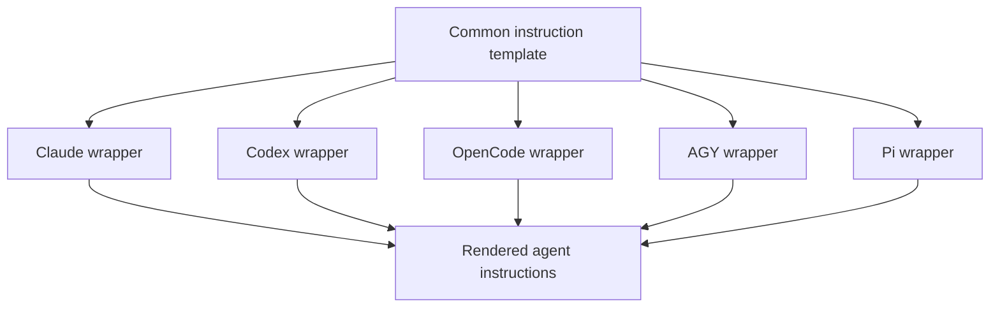

# ASD-STE100 Writing Guidance - Plan

## Goal Capsule

- **Objective:** Add a common writing baseline that uses practical ASD-STE100 principles for English agent output and clear, concise language for other languages.
- **Product authority:** The common agent instructions define the baseline. Project instructions can refine its scope, terminology, and exceptions, but cannot remove the clarity baseline.
- **Open blockers:** None.

---

## Product Contract

### Summary

The common agent instructions will require clear and concise natural-language output. English output will use practical ASD-STE100 principles without claiming full compliance with the standard.

### Key Decisions

- **Apply the baseline to all agent-authored text.** (session-settled: user-directed — chosen over chat-only guidance: documentation and development artifacts need the same clarity as direct responses.)
- **Permit bounded project overrides.** (session-settled: user-directed — chosen over complete project opt-out: projects need local control without removing the common clarity baseline.)
- **Use practical guidance, not strict compliance.** (session-settled: user-directed — chosen over controlled-vocabulary validation: the shared instructions must work without a licensed specification or validation tool.)

### Requirements

**Writing baseline**

- R1. Agent-authored natural-language text must be clear, concise, and direct.
- R2. English text must use practical ASD-STE100 principles, including short sentences, one main instruction or idea per sentence, active voice when practical, and consistent terminology.
- R3. Non-English text must follow the equivalent clarity and concision conventions of its language without presenting ASD-STE100 as a direct standard for that language.

**Covered output**

- R4. The baseline must cover direct responses, technical documentation, README content, code comments, commit messages, and PR or MR text that the agent authors or substantially revises.
- R5. Existing repository formats and terminology rules must remain authoritative when they are more specific than the common writing baseline.

**Overrides and exceptions**

- R6. Project instructions may refine the covered output, approved terminology, and justified exceptions.
- R7. Project instructions must not disable the requirement for clear and concise writing.
- R8. The baseline must preserve exact text when accuracy requires it, including code, commands, logs, error messages, quotations, identifiers, and official names.
- R9. The guidance must describe a practical style target and must not claim certified or complete ASD-STE100 compliance.

### Acceptance Examples

- **English response:** Given an indirect or wordy instruction, when the agent writes the response, then it uses direct verbs and separates distinct actions into short sentences.
- **Non-English response:** Given a Korean response, when the agent writes it, then it uses clear and concise Korean without forcing English grammar or controlled vocabulary onto it.
- **Project terminology:** Given a project rule that requires a specific domain term, when that term differs from a preferred general term, then the agent uses the project term consistently.
- **Bounded override:** Given a project rule that excludes generated API reference text from the ASD-STE100 guidance, when the agent updates that text, then the exclusion applies while the general clarity baseline remains active.
- **Exact content:** Given a log, command, quotation, or official API name, when the agent includes it, then the agent preserves the exact content instead of rewriting it to fit the style guidance.

### Scope Boundaries

- Do not add an ASD-STE100 linter, vocabulary checker, or other enforcement tool.
- Do not require access to the full ASD-STE100 specification.
- Do not claim formal, certified, or complete compliance with ASD-STE100.
- Do not deploy the updated chezmoi source state to the live home directory as part of this work.

---

## Planning Contract

### Key Technical Decisions

- KTD1. **Add one common writing section to the shared template.** The existing `.chezmoitemplates/agents-instructions.tmpl` fan-out already supplies every supported harness, so the change does not need wrapper-specific copies.
- KTD2. **State principles and boundaries instead of reproducing the standard.** (session-settled: user-directed — chosen over controlled-vocabulary validation: the shared instructions must work without a licensed specification or validation tool.)
- KTD3. **Use project supplements as bounded overrides.** (session-settled: user-directed — chosen over complete project opt-out: projects need local control without removing the common clarity baseline.)
- KTD4. **Keep exact-content exceptions explicit.** Code, commands, logs, error messages, quotations, identifiers, and official names must retain their exact text when accuracy requires it.

### High-Level Technical Design

The shared section flows through the existing one-line wrappers. No wrapper needs a new conditional because the baseline is the same for every harness.

### Implementation Approach

Place a concise writing section near the start of the common instructions, before operation-specific rules. Use normative language for the clarity baseline and practical English guidance. State override precedence and exact-content exceptions in the same section so downstream projects do not need to infer the boundary from other rules.

No automated conformance test can prove writing quality. Verification therefore combines exact source assertions, isolated rendering of all five wrappers, and manual review of the rendered section against R1-R9.

---

## Implementation Units

### U1. Add the common writing baseline

- **Goal:** Define practical ASD-STE100 guidance and its project override boundary in the common instruction source.
- **Requirements:** R1-R9; KTD1-KTD4.
- **Dependencies:** None.
- **Files:** `.chezmoitemplates/agents-instructions.tmpl`.
- **Approach:** Add one self-contained section that covers language scope, all agent-authored output, project precedence, exact-content exceptions, and the non-certification boundary. Keep the guidance compact enough to remain useful in every agent context.
- **Execution note:** This is an instruction-only change. Prefer isolated render and content assertions over a new test framework.
- **Patterns to follow:** The existing common section structure and RFC 2119 terms in `.chezmoitemplates/agents-instructions.tmpl`; the project-supplement precedence statement at the end of the same file.
- **Test scenarios:**
  - Covers R1-R4: The rendered section applies the clarity baseline to English and non-English agent-authored responses and development artifacts.
  - Covers R5-R7: The rendered section permits project-specific terminology, scope, and exceptions but does not permit projects to remove the clarity baseline.
  - Covers R8: The rendered section preserves exact content when rewriting would reduce accuracy.
  - Covers R9: The rendered section describes practical ASD-STE100 use and does not claim complete or certified compliance.
- **Verification:** Review the source section for all four decision boundaries, then render every wrapper and confirm that each output contains the same baseline.

### U2. Verify the five instruction consumers

- **Goal:** Prove that the common guidance reaches every supported harness without changing wrapper composition or deploying live state.
- **Requirements:** R1-R9; KTD1.
- **Dependencies:** U1.
- **Files:** `dot_claude/readonly_CLAUDE.md.tmpl`, `dot_codex/readonly_AGENTS.md.tmpl`, `dot_config/opencode/readonly_AGENTS.md.tmpl`, `dot_gemini/readonly_GEMINI.md.tmpl`, `dot_pi/private_agent/private_readonly_AGENTS.md.tmpl`.
- **Approach:** Keep all wrappers unchanged. Render each wrapper with the repository's stubbed `op`, empty configuration, per-user scratch destination, and `--source "$PWD"`. Compare the writing section across outputs while allowing the existing harness-specific sections to differ.
- **Test scenarios:**
  - Each wrapper renders successfully and contains the practical ASD-STE100 wording.
  - The writing section is byte-identical across Claude, Codex, OpenCode, AGY, and Pi output.
  - Each wrapper remains a one-line include of `.chezmoitemplates/agents-instructions.tmpl`.
  - No live `chezmoi apply` runs and no deployed home file changes.
- **Verification:** Isolated renders succeed, focused comparisons find no writing-section drift, and the wrapper diff stays empty.

---

## Verification Contract

- **Source validation:** Confirm `.chezmoitemplates/agents-instructions.tmpl` contains the English scope, non-English clarity rule, covered artifact set, bounded project override, exact-content exceptions, and non-certification statement.
- **Isolated render:** Render all five wrapper templates with a stubbed `op`, empty chezmoi configuration, per-user scratch destination, and `--source "$PWD"`.
- **Render parity:** Extract the new writing section from each output and confirm that all five copies are byte-identical.
- **Wrapper integrity:** Confirm each wrapper remains its existing one-line `includeTemplate` call and has no diff.
- **Repository checks:** Run `git diff --check`, inspect `git status`, and review a diff limited to the plan and common instruction template.
- **Mirror check:** Confirm the root `CLAUDE.md` remains exactly `@AGENTS.md`.
- **CI:** After the opening push, wait for both `render-dotfiles.yml` and `ci.yml` to reach terminal success.

---

## Definition of Done

- The common instructions require clear, concise, and direct agent-authored text.
- English output uses practical ASD-STE100 principles without a full-compliance claim.
- Non-English output uses equivalent language-appropriate clarity.
- Project supplements can refine scope, terminology, and exceptions but cannot disable the clarity baseline.
- Exact-content exceptions remain accurate and explicit.
- All five wrappers render the same writing section from the common source.
- No wrapper or live deployed home file changes.
- Local verification and required CI complete successfully.
