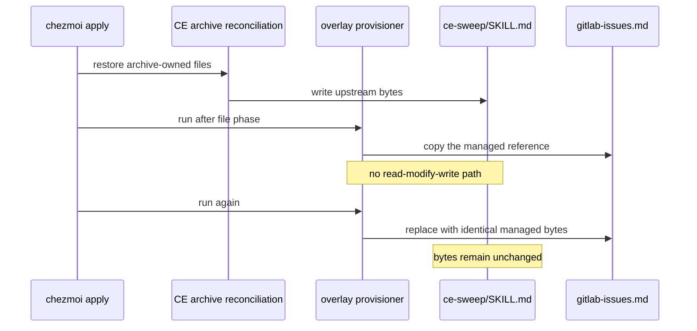

# Preserve the ce-sweep Skill During Apply

## Goal Capsule

- **Objective:** install the local GitLab issue source reference without modifying any file supplied by the pinned compound-engineering archive.
- **Authority:** the released `skills/ce-sweep/SKILL.md` is authoritative and must remain byte-identical before and after first and repeated overlay runs.
- **Execution profile:** restore the overlay provisioner to onchange delivery, update ownership comments, and change its isolated CI test. Do not run a live `chezmoi apply`.
- **Stop condition:** stop if the reference cannot be installed without writing an archive-owned path other than the missing reference file.
- **Tail ownership:** LFG reviews, commits, opens the pull request, watches CI and review, and merges when merge-ready.

---

## Product Contract

### Summary

The current overlay provisioner installs `gitlab-issues.md` and then patches two sentences in the archive-owned `ce-sweep/SKILL.md`.
This causes a persistent `chezmoi diff` after apply and violates the release archive's ownership.
The fix must install only the missing GitLab issue reference and leave the skill file unchanged across consecutive runs.

### Problem Frame

`run_after_compound-engineering-overlays.sh.tmpl` treats a local sensitivity-contract extension as part of overlay reconciliation.
Each external reconciliation restores the upstream skill, and each following script phase patches it again.
The resulting managed target differs from source state after every apply.
The existing CI test enforces the mutation, so it must change with the provisioner.

### Requirements

- R1. The provisioner must copy the canonical `gitlab-issues.md` reference to the pinned compound-engineering `ce-sweep` source-reference directory.
- R2. The provisioner must not edit, replace, or require changes in `skills/ce-sweep/SKILL.md`.
- R3. The provisioner must produce the same result on its first and second runs.
- R4. The isolated test must prove that `ce-sweep/SKILL.md` is byte-identical before and after each provisioner run.
- R5. The isolated test must prove that `gitlab-issues.md` exists and is byte-identical to the chezmoi-managed overlay source after each run.
- R6. Existing archive-owned source references must remain unchanged.
- R7. Verification must use an isolated destination and scratch state. It must not deploy to the live home directory.
- R8. The provisioner must run when the managed reference or pinned CE version changes, not after every apply.

### Acceptance Examples

- AE1. Given a pinned CE tree with the upstream skill and source references, when the provisioner runs twice, then the skill checksum is unchanged after both runs and the GitLab issue reference is present.
- AE2. Given a later archive reconciliation that restores all archive-owned files, when the provisioner runs again, then it adds the GitLab issue reference without changing the restored skill.
- AE3. Given an absent CE version directory or absent managed reference source, when the provisioner runs, then it exits successfully without partial writes.

### Scope Boundaries

- Keep the canonical GitLab issue reference content as-is. Do not claim that its optional per-item sensitivity field changes upstream orchestration semantics.
- Keep the compound-engineering external additive so the archive does not remove the locally added reference.
- Remove the local per-item sensitivity extension from the installed skill contract. Upstream `ce-sweep/SKILL.md` semantics remain authoritative.
- Do not change the bundled state engine, compound-engineering release pin, other agent integrations, or live `$HOME`.

---

## Planning Contract

### Key Technical Decisions

- KTD1. **Preserve the upstream skill exactly.** (session-settled: user-directed — chosen over patching or replacing `ce-sweep/SKILL.md`: the user requires the released skill as-is and only wants the GitLab issue reference added.) The provisioner must have no mutation or validation dependency on the skill file.
- KTD2. **Copy one managed reference file.** Choose a narrow file copy over merging the complete overlay tree. This prevents a future overlay file from shadowing an archive-owned path without an explicit code and test change.
- KTD3. **Keep additive external extraction.** The locally added reference is absent from the release archive. The existing additive `localArchive` behavior is still required so a later file reconciliation does not delete it.
- KTD4. **Use byte-preservation tests.** Content-token checks cannot prove non-mutation. The test captures the upstream skill and existing source references, runs the provisioner twice with an intervening simulated archive reconciliation, and compares each archive-owned file byte-for-byte.
- KTD5. **Restore onchange lifecycle.** Without an archive-owned mutation to retry, unconditional `run_after_` is unnecessary. The script fingerprint and rendered CE version must trigger reference installation only when its source or destination version changes.

### High-Level Technical Design

### Assumptions

- The pinned compound-engineering release continues to load source personas from `skills/ce-sweep/references/sources/<type>.md`.
- The local `gitlab-issues.md` reference is not present in the pinned archive.
- The current additive external behavior remains valid for the versioned CE tree.

---

## Implementation Units

### U1. Restore reference-only onchange delivery

- **Goal:** remove all skill-contract patching and install only the canonical GitLab issue reference.
- **Requirements:** R1, R2, R3, R6, R8; KTD1, KTD2, KTD3, KTD5.
- **Dependencies:** none.
- **Files:**
  - `.chezmoiscripts/00-tools/run_after_compound-engineering-overlays.sh.tmpl` (rename to `run_onchange_after_compound-engineering-overlays.sh.tmpl`)
- **Approach:** retain the current non-Windows and pinned-version resolution. Add the repository fingerprint partial for the managed overlay reference. Resolve the exact managed source and destination paths for `gitlab-issues.md`. Exit successfully when the CE version directory or managed source file is absent. Create only the destination reference directory and copy only that file. Remove `SWEEP_SKILL`, both substitution pairs, `patch_contract`, Perl use, and comments that describe archive-owned patching or generic tree overlays.
- **Patterns to follow:** the historical reference-only onchange provisioner from commit `c60a246`; the current template's version resolution and defensive skip behavior; `.chezmoitemplates/fingerprint.tmpl`.
- **Test scenarios:**
  - Covers AE1. A first run adds the reference and does not change the upstream skill.
  - Covers AE1. A second run is idempotent and preserves both files byte-for-byte.
  - Covers AE2. A run after simulated archive reconciliation adds only the reference and preserves every restored archive file.
  - Covers AE3. Missing source or destination tree exits successfully without partial output.
- **Verification:** the rendered provisioner passes the isolated overlay test and shell syntax validation on the supported render gates.
- **Execution note:** treat this as packaging/configuration work. Use isolated render and runtime smoke proof rather than a live apply.

### U2. Replace mutation assertions with preservation assertions

- **Goal:** make CI fail on any archive-owned skill or reference mutation and pass only for additive reference installation.
- **Requirements:** R3, R4, R5, R6, R7; KTD4.
- **Dependencies:** U1.
- **Files:**
  - `.ci/test-compound-engineering-overlays.sh`
- **Approach:** update the rendered provisioner path and assert that the onchange fingerprint covers the managed reference. Remove assertions for the locally patched sensitivity contract and the state-engine behavior that depended on it. Preserve pristine copies or checksums of the fixture skill and existing source references. Run the rendered provisioner twice, including an intervening simulated archive reconciliation. Compare all archive-owned fixtures after each run. Keep the persona content checks, additive-external assertion, absent-path skips, and byte-identical GitLab reference check.
- **Patterns to follow:** the current isolated stub-`op` render setup, per-user scratch handling, and `--source "$PWD"` usage.
- **Test scenarios:**
  - Covers AE1. The test fails if either run changes `ce-sweep/SKILL.md`.
  - Covers AE1. The test fails if the installed GitLab reference differs from its managed source.
  - Covers AE2. The test fails if a post-reconciliation run changes any restored archive-owned source reference.
  - Covers AE3. Missing overlay source and missing CE destination remain successful no-op cases.
  - The rendered CE external remains additive, while unrelated exact archives remain exact.
- **Verification:** the isolated test passes from the repository root and fails under a controlled mutation of the provisioner in test development.

### U3. Correct external ownership documentation

- **Goal:** describe the actual additive ownership boundary without promising archive-owned contract patching.
- **Requirements:** R1, R2; KTD1, KTD3.
- **Dependencies:** U1.
- **Files:**
  - `.chezmoiexternals/ai-agents.toml`
- **Approach:** keep the CE `localArchive` table additive. Update its template comment to state that the overlay installs archive-absent source references only. Remove wording that suggests archive-owned files may be replaced or patched.
- **Patterns to follow:** the existing explanatory comment for the CE `localArchive` block.
- **Test scenarios:**
  - Test expectation: none -- this changes source ownership documentation only. U2 continues to assert the rendered CE external is additive.
- **Verification:** the rendered external retains the existing CE archive behavior and unrelated exact archives remain exact.

---

## Verification Contract

| Gate | Scope | Done signal |
|---|---|---|
| Overlay integration test | U1, U2 | Two consecutive runs install only `gitlab-issues.md`; all archive-owned fixture bytes remain unchanged |
| Template render | U1 | The changed script renders with stubbed secrets, empty config, isolated scratch, and `--source "$PWD"` |
| External render | U2, U3 | The CE archive remains additive and its ownership comment matches reference-only overlay behavior |
| Shell validation | U1, U2 | Rendered and source shell files pass syntax and configured lint checks |
| Repository checks | All | `git diff --check`, scoped diff review, and `git status` show only intended changes |
| CI | All | `ci.yml` and `render-dotfiles.yml` finish successfully without weakening checks |

---

## Definition of Done

- The installed `ce-sweep/SKILL.md` matches the pinned archive before and after repeated overlay runs.
- The canonical GitLab issue reference is installed at the expected source-persona path and remains byte-identical to its chezmoi source.
- The provisioner contains no code that reads, patches, replaces, or validates the skill contract.
- The isolated test covers first run, second run, simulated archive reconciliation, and missing-path skips.
- No live `chezmoi apply` or real home deployment occurs during verification.
- The pull request is reviewed, CI is green, and the change is merged.
