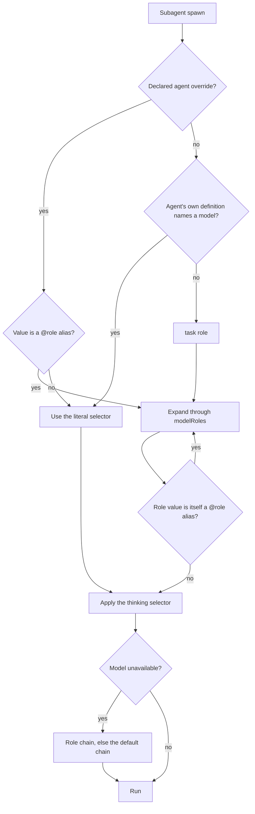
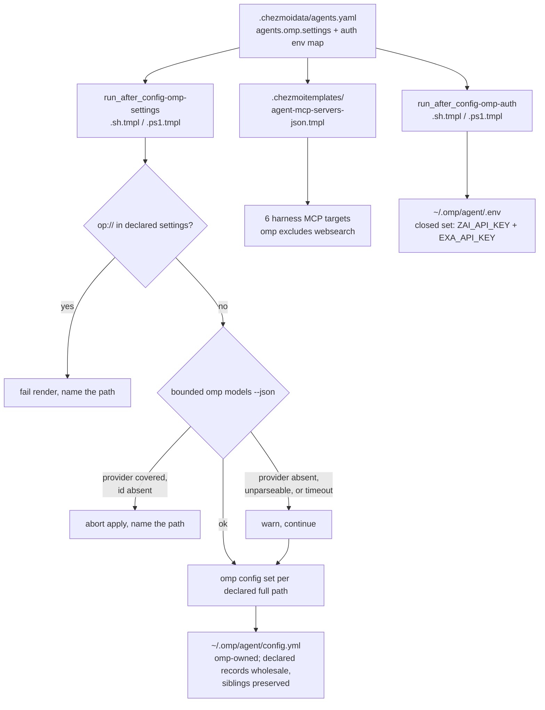

# omp Model Roles and Native Exa - Plan

## Goal Capsule

- **Objective:** Declare omp's per-role and per-subagent model resolution in `.chezmoidata/agents.yaml`, with role indirection as the single place a model is named, and wire omp's native Exa web search.
- **Authority hierarchy:** The Product Contract below is authoritative for product behavior. The root `AGENTS.md` and `.chezmoitemplates/agents-instructions.tmpl` outrank this plan on repository convention. Where a Key Technical Decision cites prior-plan or probe evidence, that evidence outranks a contrary habit found elsewhere in the tree.
- **Product authority:** This plan owns omp only. Model placement for pi, OpenCode, Claude, Codex, AGY, and Kimi, and their `websearch` MCP entry, are not active scope.
- **Execution profile:** Source-state edits plus two new provisioner scripts. Automated verification runs no live `chezmoi apply` against the real `$HOME`, starts no user service, and makes no model API call. Two checks run outside that profile and are named in the Verification Contract: a manual mechanism probe against a relocated agent directory, and a manual post-apply acceptance session.
- **Stop conditions:** Stop and report if `omp config set` stops preserving keys beside the declared set, if the catalog probe cannot separate an unauthenticated provider from a genuinely absent selector, or if retiring the settings target would leave a platform with no delivery path.
- **Tail ownership:** Implementation returns to the calling pipeline; this plan does not own the commit or PR tail.
- **Open blockers:** None.

---

## Product Contract

**Product Contract preservation:** Changed R1, R8, R10, and R16. R1 because the plan's own Declared Placement tables falsified "every model id appears exactly once". R8 because it asserted vendor runtime behavior no gate in this plan can observe, so it now states the deliverable this plan owns and the runtime expectation moved to Assumptions. R10 because a probe proved `omp config set` replaces a record-typed key wholesale rather than merging its members. R16 because `agents.omp.auth.providers` is a model-provider namespace that an Exa tool credential does not belong in. AE2's example was replaced for the same reason as R10. Product intent is unchanged in all four cases. Every other Product Contract statement and every R-ID is unchanged.

### Summary

Give omp a declared model policy: roles name every model selector but one, the six bundled subagents resolve through role indirection — `task` by inheriting the `task` role, four others by `@role` alias, and `sonic` as the single literal exception — and quota exhaustion is handled by role-keyed fallback chains. Source owns the declared keys and omp keeps ownership of the file itself. Exa becomes omp's native web-search backend instead of a shared MCP server.

### Problem Frame

`agents.omp.settings` declares `modelRoles: {}`, so every omp session and every spawned subagent runs on one model. A read-only scout and a code reviewer cost the same, and a single provider absorbs the entire workload.

The managed-readonly contract for the settings file is already broken in practice, not in theory. The deployed `~/.omp/agent/config.yml` is mode 600 rather than 0400, it carries a `modelRoles.default` value present in no source checkout, and `chezmoi status` reports it as modified. omp rewrites that file through `/model`, `/settings`, and its first-run setup, and a 0400 mode does not prevent it because a temp-plus-rename write needs only directory permission.

Exa is configured for omp only as a shared MCP server entry. omp has a native Exa search provider, so the MCP path duplicates a capability for the one harness that does not need it, and it places the Exa key in a second rendered file.

### Key Decisions

- **Role indirection is the resolution unit.** A model selector is named on a role; every subagent that needs an already-named model references that role rather than repeating it. Retuning a role propagates to its referents. (session-settled: user-directed — chosen over the per-agent pinning oh-my-openagent uses: that shape duplicates a model, a variant, and a fallback list across twenty entries.)
- **omp owns the settings file; source asserts declared keys.** `~/.omp/agent/config.yml` leaves chezmoi's managed targets and the apply asserts each declared key individually, so keys omp writes beside the declared set are preserved. (session-settled: user-directed — chosen over keeping the whole-file managed-readonly target: omp rewrites the file, which makes whole-file management a permanent fight.)
- **Every role is source-declared, including `default`.** A durable model change is a data edit; `/model` stays a session-scoped convenience. (session-settled: user-directed — chosen over leaving `default` to whatever `/model` last persisted: leaf-level ownership inside one record is not expressible, because `omp config set` rejects a path inside a record-typed key.)
- **Placement follows job shape across the authenticated coding plans.** Anthropic takes the coding loop, openai-codex takes deliberation, google-antigravity takes vision and background work, kimi takes mechanical bulk. (session-settled: user-directed — chosen over an Anthropic-centric placement and a cheap-first inversion: concentrating on one plan turns a quota wall into a full stop, and demoting the main loop pays a quality cost every turn.)
- **Usage-aware fallback and the resolved-model badge are on.** (session-settled: user-approved.)
- **omp resolves Exa natively and the shared MCP inventory gains per-harness applicability.** (session-settled: user-directed — chosen over keeping both surfaces, which duplicates the key and the tool surface, and over deleting the server for every harness, which would strip Exa from harnesses that have no native provider.)
- **The advisor has a declared model but the runtime stays off.** Assignment alone makes `/advisor on` usable per session without paying for a second model on every turn. (session-settled: user-approved.)
- **A declared selector the host can prove wrong fails the apply.** omp reports an unknown selector as a startup warning, which is easy to miss; the repository already treats an unresolvable declared target as a hard error in the release lock. The check is scoped to what the host can prove and is paired with a scheduled freshness check, per KTD4.
- **Agent overrides are expressed as `@role` aliases wherever a role already names the needed model.** This also resolves the `designer` collision: `designer` is both a built-in role and a bundled agent name, and an override that repeated a model id would let the two drift apart.

### Declared Placement

Roles carry the model selectors. A role value is either a model selector, which may append a thinking level, or a `@role` alias to another role. Every model selector except `sonic`'s is named on a role.

| Role | Selector | Why |
|---|---|---|
| `default` | `anthropic/claude-opus-5:xhigh` | Main coding and editing loop |
| `slow` | `openai-codex/gpt-5.6-sol:xhigh` | Deliberation ceiling |
| `plan` | `anthropic/claude-fable-5:xhigh` | Planning against a 1M context |
| `designer` | `anthropic/claude-opus-5:high` | UI and visual work |
| `vision` | `google-antigravity/gemini-3.1-pro` | Image input |
| `advisor` | `openai-codex/gpt-5.6-terra:high` | Turn review, runtime disabled |
| `task` | `anthropic/claude-sonnet-4-6` | Default subagent |
| `smol` | `openai-codex/gpt-5.4-mini` | Cheap floor that still follows tools |
| `tiny` | `google-antigravity/gemini-3.1-flash-lite` | Titles, memory, background classification |
| `commit` | `@smol` | Commit messages |

Subagent overrides reference roles. `task` is absent on purpose: it inherits the `task` role. So is `scout`, for a reason found during review rather than at planning time: on this host every compound-engineering persona — code review, doc review, simplification — is dispatched as agent type `scout`, so an override pinning it to `@smol` would demote deep-judgment work instead of billing an explorer correctly. Leaving it undeclared is how the job-shape policy actually applies to the observed job shape.

| Agent | Override | Why |
|---|---|---|
| `librarian` | `@smol` | External library research |
| `reviewer` | `@advisor` | Same critic model as turn review |
| `designer` | `@designer` | Binds the agent to its role |
| `sonic` | `kimi-code/kimi-for-coding-highspeed` | Mechanical bulk; the only model no role names |

Fallback is keyed by role. The `default` chain covers every role without its own, including the roles `sonic` and the aliased overrides resolve to.

| Key | Chain | Why |
|---|---|---|
| `default` | `openai-codex/gpt-5.6-sol:high`, `kimi-code/k3`, `zai/glm-5.2` | Cross-provider recovery for heavy roles |
| `smol` | `google-antigravity/gemini-3.6-flash`, `zai/glm-4.7-flash` | Keeps the cheap floor cheap |
| `tiny` | `google-antigravity/gemini-3.6-flash`, `zai/glm-4.7-flash` | Background work must not escalate to a heavy model |

No `provider/*` wildcard chain is declared. A `provider/*` key outranks the role chain by specificity, so an `anthropic/*` entry would preempt the provider-diverse chains above while its own hop keeps the failing model id and swaps only the provider — and google-antigravity serves no `claude-opus-5` or `claude-fable-5` id, so that hop is not guaranteed to resolve and the document cannot rely on a cascade to a less-specific chain. Omitting the wildcard is what keeps the role chains reachable, which is the whole point of R7. The `model key` tier omp's own precedence names is an internal tier: this plan declares no model-keyed chain, so R6's role-only grammar is exhaustive for declared data.

### Requirements

**Model resolution**

- R1. Within `modelRoles` and `task.agentModelOverrides`, every declared model selector — model id plus thinking level — appears at most once, and a subagent that needs a model a role already names references that role instead of repeating it. Fallback-chain entries are exempt.
- R2. `modelRoles` declares `default`, `smol`, `slow`, `vision`, `plan`, `designer`, `commit`, `tiny`, `task`, and `advisor`.
- R3. A role value may carry a thinking selector or be a `@role` alias, and the declared value is authoritative for that role.
- R4. A bundled subagent whose need differs from the `task` role resolves through a `@role` alias whenever a role already names the model it needs.
- R5. The `task` subagent inherits the `task` role with no override entry.
- R6. Fallback is declared per role, never per agent name and never as a provider wildcard.
- R7. Placement spreads across the authenticated providers so that no single plan carries the coding loop, deliberation, vision, and bulk work at once.
- R8. `retry.usageAwareFallback` and `task.showResolvedModelBadge` are declared and asserted under omp's documented key names.
- R9. The advisor has a declared model and stays disabled until a session enables it.

**Ownership and drift**

- R10. Apply re-asserts every declared key. A declared record-typed key is owned wholesale, so its undeclared members are replaced; keys omp writes *beside* the declared set are left byte-identical.
- R11. `~/.omp/agent/config.yml` is not a chezmoi-managed target, and the already-deployed file is preserved rather than pruned.
- R12. A declared selector the host can prove absent fails the apply and names the offending data path.
- R13. Settings delivery covers Linux, macOS, and Windows, matching the current unconditional deployment of the omp settings target, and both platform halves assert the same declared key set.
- R14. A `/model` or `/settings` change to a declared key is session-scoped, and a durable change is an edit to `.chezmoidata/agents.yaml`.

**Exa web search**

- R15. omp resolves Exa through its native search provider, fed by `EXA_API_KEY` in the omp dotenv.
- R16. The dotenv reconciler carries exactly the declared omp environment credentials and keeps unrelated valid entries byte-identical.
- R17. Exa is omp's preferred web-search backend, and the deep-research surfaces stay off.
- R18. The shared MCP inventory excludes `websearch` for omp only, and every other harness renders an unchanged inventory.
- R19. The MCP applicability grammar validates the new harness field and fails on an unknown value, matching the existing `os` and `container` gates.

### Key Flows

Resolution precedence is the part a planner is most likely to get wrong, because three resolution sources sit between an agent and a model.

- F1. Subagent model resolution
  - **Trigger:** A subagent spawns.
  - **Steps:** The declared agent override is consulted first, then the agent's own definition, then the `task` role. An alias value expands through `modelRoles`, and a role whose own value is an alias expands again. A thinking selector applies last. On unavailability, the active role's chain takes over, or the `default` chain when the role declares none.
  - **Outcome:** The subagent runs on the model its role names.
  - **Covered by:** R1, R3, R4, R5, R6

- F2. Apply-time assertion
  - **Trigger:** Any `chezmoi apply`.
  - **Steps:** The render refuses a credential-bearing declared value. Declared selectors are checked against the host catalog for providers the catalog can speak for. Each declared key is asserted at its own full path. Keys beside the declared set are left alone.
  - **Outcome:** Declared keys match source, sibling keys survive, and a provably absent selector stops the apply.
  - **Covered by:** R10, R11, R12, R13

### Acceptance Examples

- AE1. **Covers R10, R14.** Given a session changed the active model through `/model`, when the next apply runs, then the declared role value is restored.
- AE2. **Covers R10.** Given omp wrote a settings key beside the declared paths — not a member inside a declared record — when apply runs, then that key is preserved exactly.
- AE3. **Covers R12.** Given a declared role names a selector whose provider the catalog covers and which the catalog does not contain, when apply runs, then the apply fails and names that selector instead of leaving a startup warning.
- AE4. **Covers R4, R1.** Given `librarian` is declared as `@smol`, when the `smol` role changes, then `librarian` follows without any edit to the agent override.
- AE5. **Covers R18.** Given the shared MCP inventory excludes `websearch` for omp, when every harness config renders, then omp's inventory omits it and the pi, OpenCode, Claude/Codex, AGY, and Kimi inventories are unchanged.
- AE6. **Covers R9.** Given the advisor has a declared model and the runtime is off, when a session runs normally, then no second model reviews the turn, and enabling the advisor in that session uses the declared model.
- AE7. **Covers R12.** Given a host where a provider has no credentials and the catalog therefore returns no models for it, when apply runs, then selectors naming that provider are not treated as absent and the apply proceeds.
- AE8. **Covers R7.** Given the declared placement, when the rendered settings are inspected, then the coding loop, deliberation, vision, and bulk job shapes name four distinct providers.

### Success Criteria

- Declared roles, agent overrides, and chains render to the intended selectors, verified without a live apply against the real `$HOME`.
- The recorded provisioner argv shows one assertion per declared leaf path and no whole-record write above a declared path.
- No omp settings drift is reportable, because the file is no longer a managed target.
- The MCP consumer uniformity check, updated to the new harness-carrying call shape, passes for all six consumers, and omp is covered by it for the first time.
- The omp reconcile test covers the new settings path, which it does not cover today.
- Post-merge manual observation, outside the automated profile: one real omp session shows a spawned subagent resolving to its role's model, the advisor staying off, and a `web_search` returning through the native Exa provider.

### Scope Boundaries

- Model placement for pi, OpenCode, Claude, Codex, AGY, and Kimi.
- The `websearch` MCP entry for every non-omp harness.
- Exa researcher and websets surfaces, which stay off.
- A YAML codec for `packages/kimi-reconcile`.
- A model-catalog lock; `.chezmoidata/releases.json` covers release artifacts and container images, not model ids. The scheduled freshness check in KTD4 is the lighter substitute.
- Enabling the advisor runtime by default.

#### Deferred to Follow-Up Work

- `~/.omp/agent/mcp.json` keeps its managed-readonly *management mode* even though omp's MCP list is live at runtime, so it is the next candidate for the same drift this plan fixes (see KTD10). This plan still changes that target's rendered *content* by excluding `websearch` for omp; only the management mode is deferred.
- `~/.omp/agent/models.yml` and `~/.omo/omo.jsonc` stay on the managed-readonly side of the line this plan moves for `config.yml` only (see KTD11).

### Dependencies and Assumptions

- omp authenticates `anthropic`, `openai-codex`, `google-antigravity`, `zai`, and `kimi-code` on this host. Plain `openai`, `google`, and `openrouter` are absent, so a chain naming them would be inert.
- `agents.omp.settings` has exactly one consumer today, `dot_omp/private_agent/private_readonly_config.yml.tmpl:11`, so retiring that template retires the whole current delivery path.
- Verified by isolated probe against a relocated agent directory (`PI_CODING_AGENT_DIR`): `omp config set` creates the file when absent, accepts record values including `@role` alias strings, writes a nested path such as `task.agentModelOverrides` without disturbing its parent's other members, preserves every key beside the declared set byte-for-byte, and is byte-identical on a second identical assertion.
- Verified by the same probe: `omp config set modelRoles.default <value>` is **rejected** — a path inside a record-typed key is not a settings path. Record-typed keys can only be asserted wholesale, which is why R10 draws its boundary at siblings rather than members.
- Verified by the same probe: re-asserting `task.agentModelOverrides` **removes** a member present in the file but absent from the declared JSON.
- Verified by the same probe: a nonsense selector such as `totally-bogus/no-such-model:xhigh` is accepted silently by both `omp config set` and `omp config get`. Schema validation is type-only, which is why R12 needs its own catalog check.
- Verified by the same probe: on an agent directory with no OAuth credentials, `omp models --json` **exits zero** and returns a partial catalog covering only the providers it can authenticate. Exit status alone cannot separate an unauthenticated provider from an absent selector, which is why KTD4 scopes the check per provider.
- Vendor behavior this plan declares but cannot observe in its automated gates: that live quota reports order fallback hops, and that the resolved-model badge appears in the session UI. R8 owns the declaration; the post-merge manual observation is where the behavior is seen.
- `.ci/test-open-design-mcp-render.sh` covers five of six MCP consumers: `dot_omp/private_agent/private_readonly_mcp.json.tmpl` appears in neither the `render_consumer` list nor the call-shape grep list, so omp's inventory has no CI coverage today. The call-shape grep at `:144-158` matches the literal `(dict "ctx" .)`, and three call sites inside the test itself — `render_servers`, `render_real`, and `assert_invalid` — pass `os`/`container` overrides.
- The existing harness ids are exactly `claude`, `codex`, `opencode`, `agy`, `pi`, `omp`; there is no `kimi` id, and `dot_agents/private_readonly_agents.toml.tmpl` renders one file for both Claude and Codex.
- `.ci/test-omp-agent-reconcile.sh` covers the dotenv auth reconcile, the plugin reconcile, and the haptic extension. Its `omp` stub records argv and writes no config file, and the `omp-agent-integration` job installs no omp binary — so CI can prove call shape but not file-merge semantics.
- The PowerShell analyzer job fails only on Error severity and reports Warnings without failing, so warning-cleanliness for the new `.ps1` is a manual check.
- The omp settings target is not OS-gated and has no Windows counterpart, so today it is the only thing delivering omp settings on Windows.
- `omp` installs to `$HOME/.local/bin`, which chezmoi's non-interactive script environment omits, so a provisioner must prepend it.
- Risk: replacing an unconditional file target with a provisioner that soft-skips a missing `omp` means a host with a broken omp gets no settings *and* no drift signal, a combination the managed target made impossible. The soft-skip diagnostic on stderr is the only signal, and it is accepted.
- Assumption, unverified: whether omp *resolves* a thinking selector appended to an agent override value the way it does for a role value. The probe proved the value is stored, not that it is honored. U1 probes this before any override relies on it; today no declared override carries one.
- Assumption, unverified: why the `websearch` MCP tools are absent from the omp session tool inventory even though the server is declared. If the same cause blocks the native path, the post-merge acceptance check catches it and the omp harness gate on `websearch` is reverted — a one-line data change.

### Outstanding Questions

**Deferred to Planning** — all resolved below; retained for traceability.

- Whether a declared agent override honors a thinking selector: resolved as a probe in U1, with the fallback of expressing the level through the referenced role.
- How selector validation reads the host catalog and behaves when a provider is unauthenticated: resolved by KTD4.
- The spelling and membership of the per-harness applicability field: resolved by KTD7.
- How the Windows counterpart asserts the same declared keys, and how parity is checked: resolved by U5 and U7.
- Whether the zai credential migrates into the new environment-credential map: resolved by KTD8 and U3.

---

## Planning Contract

### Key Technical Decisions

- KTD1. **Role indirection is the resolution unit.** Implements the Product Contract decision of the same name. (session-settled: user-directed — chosen over per-agent pinning: one naming point instead of twenty duplicated entries.)

- KTD2. **The settings provisioner is `run_after_`, not `run_onchange_`.** `AGENTS.md:15-20` prefers onchange, but `docs/plans/2026-07-20-002-feat-manage-claude-settings-plan.md:60` records the trade-off precisely: an onchange script re-runs only when its rendered content changes, so a vendor UI edit to a declared value whose data is unchanged persists until the next data edit or `chezmoi apply --force`. That is exactly the observed omp failure, so an onchange lifecycle would silently fail R10. `run_after_config-omp-auth.sh.tmpl:7-8` and `run_after_config-aoe.sh.tmpl:3-6` already take `run_after_` for the same reason. The recurring cost is one bounded catalog probe plus one `omp config set` per declared path, and the assertion is byte-idempotent (probed).

- KTD3. **Assert each declared key at its own full path; a declared record is owned wholesale.** The declared paths are `modelRoles`, `task.agentModelOverrides`, `task.showResolvedModelBadge`, `retry.fallbackChains`, `retry.usageAwareFallback`, the Exa keys, and the settings already declared today. Each is asserted with its own `omp config set <full-path> '<json>'`; never assert a parent namespace such as `task` or `retry`, which would destroy every other setting omp owns under it. `docs/plans/2026-07-29-003-fix-cli-proxy-config-drift-plan.md:53` supplies the allowlist discipline. The preservation boundary is the declared path's **siblings**, not its members: a probe proved `omp config set` rejects a path inside a record-typed key and that re-asserting a record drops members absent from the declared JSON. So `modelRoles`, `task.agentModelOverrides`, and `retry.fallbackChains` are wholly source-owned, and a model pinned for a custom subagent through omp's UI does not survive the next apply. R10 states that plainly rather than promising a merge the CLI cannot perform.

- KTD4. **Catalog validation is provider-scoped, time-bounded, and paired with a freshness check.** Every declared selector is checked against `omp models --json` before any assertion, but only for a provider the catalog returns at least one model for. A selector whose provider is represented and whose id the catalog lacks aborts the apply and names the data path, following the reject-list taxonomy of `docs/plans/2026-07-29-003-fix-cli-proxy-config-drift-plan.md:54`. A selector whose provider is absent from the catalog, a catalog that cannot be parsed, and a probe that exceeds its timeout all warn and proceed. Exit status is not the discriminator: a probe showed an unauthenticated agent directory exits zero with a partial catalog, so keying on exit status would hard-fail a fresh host on valid selectors and — because this is a `run_after_` script — block the rest of the apply. The comparison key is the selector's `provider/model-id` with any `:thinking` suffix stripped and `@role` aliases expanded first. Because these ids are hand-edited rather than machine-generated, the fail-closed branch is only safe with a freshness mechanism: a scheduled CI job probes every declared selector against the live catalog, so provider churn surfaces as a failing CI run before it can hard-fail a user's whole-machine apply.

- KTD5. **Retire the source only; add no prune machinery.** Deleting `dot_omp/private_agent/private_readonly_config.yml.tmpl` stops management and leaves the deployed file, which is the desired end state. `.chezmoiremove:25-26` and `:34-36` document that deleting a managed source never prunes the target, and `docs/plans/2026-07-29-001-refactor-migrate-omo-unified-config-plan.md:64` separates the three mechanisms. So no `.chezmoiremove` line, no `remove_` source file, and no `.chezmoiignore` entry. `dot_config/opencode/remove_oh-my-openagent.json` is a live precedent an implementer would otherwise copy, which would delete omp's live config. Nothing re-locks the file once the source is gone, so no unlock step is needed either.

- KTD6. **A `.ps1` counterpart ships with the POSIX half.** `docs/plans/2026-07-29-001-feat-add-oh-my-pi-agent-plan.md:74,142` establish that omp config templates are deliberately not POSIX-gated, and the retired file target is currently the only omp settings delivery on Windows. `AGENTS.md:111` is the parity rule. The precedent pairs are `run_after_config-omp-auth.{sh,ps1}.tmpl` and `run_onchange_after_update-omp-plugins.{sh,ps1}.tmpl`. The halves share no rendered data block: each re-derives and re-validates the same data behind its own whole-file OS guard, and U7 asserts that both derive the same declared key set.

- KTD7. **The applicability field is `harness`, validated centrally, over an explicitly enumerated id set.** The repo already has a `harness` dict-key convention from the per-harness instruction composition (`dot_omp/private_agent/private_readonly_AGENTS.md.tmpl:1`), so the key name is reused. The **id set is not** reusable as-is: the instruction ids are `claude`, `codex`, `opencode`, `agy`, `pi`, `omp` and contain no `kimi`, while the MCP inventory has a Kimi consumer. The MCP valid-harness set is therefore those six plus `kimi`. `dot_agents/private_readonly_agents.toml.tmpl` renders one file for both Claude and Codex, so it passes `claude` and carries a header comment recording that Codex shares that render — a Codex-only gate is not expressible, which is acceptable because the only applicability record keys on `omp`. `docs/plans/2026-07-24-002-feat-open-design-integration-plan.md:215` fixes the rest of the shape: gate on the record, validate types and values in the helper, filter before any formatter sees it, never inline in a consumer. The `harness` input key is **required**, so a consumer that forgets it fails loudly instead of silently receiving every server — which is why the three override call sites inside the CI test change in the same unit.

- KTD8. **The Exa credential is a tool credential, the environment map is the single declared input, and its variable set is closed.** `agents.omp.auth.providers` is a model-provider list and `.chezmoidata/agents.yaml:14` documents it as provider auth, so `EXA_API_KEY` does not belong there. A sibling environment-credential map becomes the dotenv reconciler's only declared input, and the existing zai entry migrates into it so one namespace feeds one consumer; `agents.omp.auth.providers` is removed along with its comment, since nothing else reads it. Each entry names its variable explicitly, because today's records are `{name, type, key}` only and `docs/plans/2026-07-29-001-feat-add-oh-my-pi-agent-plan.md:139` shows an explicit provider-to-variable mapping was always the intent. The validator checks the declared names against a **closed required set** rather than a shape regex: a bare identifier regex would let a data edit inject `HTTP_PROXY` or `NODE_OPTIONS` into the environment omp loads for every session, and dropping the cardinality check would let an emptied map silently delete `ZAI_API_KEY`. `run_onchange_after_install-agent-plugins.sh.tmpl:60-220` is the closed-list precedent.

- KTD9. **The advisor model is declared and the runtime stays off.** (session-settled: user-approved — assignment makes `/advisor on` work per session without a second model on every turn.)

- KTD10. **`mcp.json` keeps its management mode and is out of scope, named as the next drift target.** `docs/plans/2026-07-29-001-feat-add-oh-my-pi-agent-plan.md:117` left its management mode an open question and `:60` records that omp's MCP list is live at runtime, so it is one `/mcp add` away from the same `MM` drift. This plan changes its rendered content only.

- KTD11. **This is a scoped convention reversal, and U6 records the membership rule.** `docs/plans/2026-07-29-001-refactor-migrate-omo-unified-config-plan.md:65,163` deliberately accepted a recurring vendor-side permission error to keep a 0444 managed file authoritative. This plan overturns that trade for omp's `config.yml`. Leaving two contradictory answers to "who owns an agent config file" with no rule would make the next contributor guess, so the `AGENTS.md` rewrite states the rule — a target moves to per-key assertion when its vendor writes it during normal use, and stays managed-readonly otherwise — and lists `config.yml`, `mcp.json`, `models.yml`, and `omo.jsonc` against it with the reason each sits where it does.

- KTD12. **Declared omp settings are credential-free by contract.** The retired template resolved `op://` references before rendering; its replacement asserts through a CLI whose value arrives as a process argument, which is visible to other processes and is captured verbatim by the argv-recording test stub. Rather than build a secret-safe channel no declared key needs, the provisioner fails the render when any declared `agents.omp.settings` value is an `op://` reference and names the data path. Because of that contract the provisioner needs no secret-safe scratch handling, which keeps it simpler than the `run_after_config-aoe.sh.tmpl` precedent it otherwise follows. Credentials continue to reach omp through the dotenv reconciler, which already has a secret-safe path. U6's `AGENTS.md` rewrite records the contract so the next person adding a settings key sees it.

### High-Level Technical Design

Ownership moves from a rendered file target to a per-path assertion, and the two halves land in different verification systems.

Two verification blind spots follow. Retiring the file target is visible to a `chezmoi archive` comparison; the replacement scripts are not, because `.chezmoiscripts/**` are not file targets (`AGENTS.md:69`, and `docs/plans/2026-07-20-002-feat-manage-claude-settings-plan.md:196`). And CI can prove the provisioner's call shape but not omp's file-merge semantics, because the test stub writes no config and the job installs no omp — so the byte-level preservation guarantee is a documented manual probe, not a CI assertion.

### Assumptions

- The op:// guard, the catalog probe, and the assertion run in the same provisioner, so a host whose catalog covers a provider validates that provider's selectors before it writes.
- Declaring `tiny` explicitly forfeits omp's automatic `@smol` tracking for background tasks. That is intended: the tiny model should be cheaper than the smol floor.
- `70-agents` settings writers need no ordering guarantee relative to each other, per `docs/plans/2026-07-20-002-feat-manage-claude-settings-plan.md:119`.

### System-Wide Impact

- Editing `.chezmoitemplates/agent-mcp-servers-json.tmpl` re-triggers the dotagents skills reconcile on every host at the next apply, because `.chezmoiscripts/70-agents/run_onchange_after_install-dotagents-skills.sh.tmpl:43` fingerprints that template and `.ci/test-open-design-mcp-render.sh:160-162` asserts the coupling. No new fingerprint entry is needed; the re-run is expected.
- All six MCP consumers gain a `harness` argument and all six header comments are updated, because the helper's `harness` input key is required. `docs/plans/2026-07-24-002-feat-open-design-integration-plan.md:290` requires updating every consumer comment.
- Three override call sites inside `.ci/test-open-design-mcp-render.sh` also pass the helper a dict, so they change in the same unit as the helper or the test aborts on its first assertion under `set -euo pipefail`.
- The root `AGENTS.md:49` sentence asserting omp's managed-readonly `config.yml` becomes false and is corrected in the same change, as a unit rather than cleanup.
- `.chezmoidata/agents.yaml`'s header consumer map and its omp block comment both describe the retired template and must be reconciled.
- The apply path gains its first unconditional network call. It is bounded by a timeout and fails open.

### Sequencing

Deliver the replacement before retiring the target so no apply between commits leaves a platform without settings delivery: U1 → U4 → U5 → U6. U2 is self-contained: it carries its own CI repair so the repo is never red between units. U3 is independent of both chains. U7 lands last because it adds coverage for behavior U2, U4, and U5 introduce.

---

## Implementation Units

### U1. Declare the omp model policy and Exa backend preference in data

- **Goal:** `agents.omp.settings` carries the full declared policy: roles, agent overrides, fallback chains, the two retry/UI booleans, and the web-search backend preference.
- **Requirements:** R1, R2, R3, R4, R5, R6, R7, R8, R9, R17; KTD1, KTD9.
- **Dependencies:** None.
- **Files:** `.chezmoidata/agents.yaml`.
- **Approach:** Replace `modelRoles: {}` with the Declared Placement tables. Add `task.agentModelOverrides`, `retry.fallbackChains`, `retry.usageAwareFallback: true`, and `task.showResolvedModelBadge: true`, and leave `advisor.enabled` unset so it keeps its `false` default. For R17, declare the web-search provider order with Exa at its head and the Exa surface toggles so search is on while the researcher and websets surfaces stay off. Declare no `provider/*` fallback chain. Keep every existing key. Quote any value beginning with `@` so YAML does not read it as a tag. Document the new keys in the header consumer map and in the omp block comment, following the two-place convention the file already uses.
- **Patterns to follow:** The header consumer map at `.chezmoidata/agents.yaml:1-45`; the omp block comment at `:411-421`; `agents.pi.settings.subagents.agentOverrides` at `:380-399` as the nearest existing per-agent mapping.
- **Execution note:** Probe against a relocated agent directory whether an agent override honors an appended thinking selector before any override relies on one. If it does not, express the level through the referenced role and record that in the data comment.
- **Test scenarios:**
  - Rendering the data with a stub `op` on PATH yields each declared role, override, and chain with the intended selector.
  - Within `modelRoles` and `task.agentModelOverrides`, no full selector repeats, and every subagent needing an already-named model carries a `@role` alias rather than a duplicate id.
  - Covers AE8. The four job shapes R7 names resolve to four distinct providers.
  - The rendered settings contain the web-search order with Exa first and the researcher and websets toggles off.
  - The two R8 key names match omp's documented settings paths exactly.
  - No declared value is an `op://` reference.
- **Verification:** The rendered settings JSON contains exactly the declared keys; selector uniqueness holds under R1's scope; the four job shapes span four providers; the Exa preference keys and the two R8 booleans are present under their documented names.

### U2. Add per-harness applicability to the shared MCP inventory

- **Goal:** A neutral MCP record can name the harnesses it applies to, `websearch` is excluded for omp, and the repository's MCP gate stays green in the same commit.
- **Requirements:** R18, R19; KTD7.
- **Dependencies:** None.
- **Files:** `.chezmoitemplates/agent-mcp-servers-json.tmpl`, `.chezmoidata/agents.yaml`, `dot_agents/private_readonly_agents.toml.tmpl`, `dot_config/opencode/readonly_opencode.json.tmpl`, `dot_gemini/config/private_readonly_mcp_config.json.tmpl`, `dot_omp/private_agent/private_readonly_mcp.json.tmpl`, `dot_pi/private_agent/private_readonly_mcp.json.tmpl`, `private_dot_kimi-code/private_readonly_mcp.json.tmpl`, `.ci/test-open-design-mcp-render.sh`.
- **Approach:** Add an optional `harness` field to the record grammar and a required `harness` key to the helper's input dict, validated with the same strict triple the `os` block uses. Hoist the valid-harness list as the six instruction ids plus `kimi`. Fold the harness test into the single eligibility conditional. Each consumer passes its own id; `dot_agents/private_readonly_agents.toml.tmpl` passes `claude` and gains a header comment recording that Codex shares that render. In the same commit, update the three helper call sites inside the CI test that pass `os`/`container` overrides — `render_servers`, `render_real`, and `assert_invalid` — and the consumer call-shape grep, because the required key otherwise aborts the test on its first assertion. Extend the helper's header contract comment and the `agents.yaml` mcp applicability sub-list, and refresh all six consumer header comments. `mcp.json` remains a managed target, so the next apply rewrites omp's deployed inventory without `websearch`; no manual cleanup of the stale entry is needed.
- **Patterns to follow:** The `os` optional-field block at `.chezmoitemplates/agent-mcp-servers-json.tmpl:67-81`, the `container` block at `:82-92`, the final filter at `:93-95`, the caller-override protocol at `:25-37`, and the existing `(dict "harness" "omp")` convention at `dot_omp/private_agent/private_readonly_AGENTS.md.tmpl:1`.
- **Test scenarios:**
  - `websearch` is absent from the omp render and present in the pi, OpenCode, Claude/Codex, AGY, and Kimi renders.
  - A record with no `harness` field renders for every harness on Linux, macOS, Windows, and container contexts.
  - A `harness` value of the wrong type fails the render with a message naming the server.
  - An unknown harness id fails the render and lists the valid ids.
  - A missing `harness` key in the helper's input dict fails with the same shape as the missing-`ctx` guard.
  - The existing MCP render test passes in this commit, including its override renders, its four `assert_invalid` fixtures, and its negative check that no consumer bypasses the helper.
- **Verification:** Every harness inventory except omp is byte-identical to its pre-change render, and the MCP render test is green at this commit.

### U3. Move omp credentials to an environment map and add Exa

- **Goal:** The omp dotenv carries exactly the declared environment credentials, fed by one namespace.
- **Requirements:** R15, R16; KTD8.
- **Dependencies:** None.
- **Files:** `.chezmoidata/agents.yaml`, `.chezmoiscripts/70-agents/run_after_config-omp-auth.sh.tmpl`, `.chezmoiscripts/70-agents/run_after_config-omp-auth.ps1.tmpl`.
- **Approach:** Declare a sibling environment-credential map under `agents.omp.auth`, each entry naming its variable and its `op://` reference. Migrate the zai entry into it, add the Exa entry, and remove `agents.omp.auth.providers` together with its comment and its header consumer-map line, so one namespace feeds one consumer. Replace the exactly-one-zai-provider assertion in both halves with validation against a closed required set: the declared names must be exactly `ZAI_API_KEY` and `EXA_API_KEY`, each with a non-empty resolved value; any name outside the set, any missing member, and an emptied map fail the render naming the data path. Keep the existing filter-then-append rewrite so unrelated valid lines stay byte-identical, keep the 0600 mode and the malformed-line refusal, and report the reconciled variable names.
- **Patterns to follow:** The current provider validation and dotenv rewrite in `.chezmoiscripts/70-agents/run_after_config-omp-auth.sh.tmpl:2-73` and its Windows twin at the same range; the closed-list render-time validation idiom in `run_onchange_after_install-agent-plugins.sh.tmpl:60-220`, including its locator string in every message and its rule that a `fail` message must avoid `: `.
- **Test scenarios:**
  - Both declared variables are present with correctly quoted values, and an unrelated pre-existing entry is byte-identical afterward.
  - A duplicate managed variable is collapsed to one entry.
  - A malformed pre-existing dotenv line still aborts with the existing diagnostic.
  - A declared name outside the closed set fails the render and names the data path.
  - An emptied credential map fails the render rather than silently removing a variable.
  - The file mode remains 600.
- **Verification:** The reconcile is idempotent across two runs, writes no credential to any other path, and no source file still reads `agents.omp.auth.providers`.

### U4. Add the POSIX omp settings provisioner

- **Goal:** Every apply refuses credential-bearing settings, validates provable selectors under a time bound, and asserts each declared settings path through omp's own CLI.
- **Requirements:** R10, R12, R13, R14; KTD2, KTD3, KTD4, KTD12.
- **Dependencies:** U1.
- **Files:** `.chezmoiscripts/70-agents/run_after_config-omp-settings.sh.tmpl`.
- **Approach:** Gate the whole file on Linux and macOS. At render time, fail with the data path if any declared settings value is an `op://` reference; because of that contract no secret-safe scratch handling is required. Prepend `$HOME/.local/bin` to PATH. Soft-skip with a stderr diagnostic when `omp` is absent. Probe the catalog once under a bounded timeout and build the set of providers it returns models for; expand `@role` aliases, strip thinking suffixes, and abort with the data path only for a selector whose provider is in that set and whose id the catalog lacks. Warn and continue when the catalog is unparseable, when the probe times out, or when a selector's provider is absent from it. Then assert each declared key at its own full path — `modelRoles`, `task.agentModelOverrides`, `task.showResolvedModelBadge`, `retry.fallbackChains`, `retry.usageAwareFallback`, the Exa keys, and the existing settings — never a parent namespace such as `task` or `retry`. Explain the `run_after_` choice in the header the way the sibling scripts do, and state that a declared record is owned wholesale while keys beside the declared set are omp's.
- **Patterns to follow:** `run_after_config-aoe.sh.tmpl:1-33` for the hard-fail and reporting shape; `run_after_config-omp-auth.sh.tmpl:7-8` for the in-band `run_after_` justification; `run_onchange_after_update-omp-plugins.sh.tmpl:13-20` for the omp-specific guard policy; `run_onchange_after_update-pi-extensions.sh.tmpl:52-54` for the PATH prepend.
- **Execution note:** Prove the assertion and sibling-preservation semantics against a relocated agent directory before wiring the catalog gate, and record the result — this manual probe is the only evidence for R10's byte-level guarantee.
- **Test scenarios:**
  - The recorded argv shows one `config set` per declared full path and no assertion at `task` or `retry`.
  - A declared selector absent from a readable stub catalog whose provider that catalog covers exits non-zero and names the data path.
  - A declared selector whose provider the stub catalog does not cover warns and still performs the assertions.
  - An unparseable stub catalog warns and still performs the assertions.
  - A stub catalog command that hangs past the timeout warns and still performs the assertions.
  - A missing `omp` binary exits zero with a diagnostic.
  - A declared settings value containing an `op://` reference fails the render and names the data path.
- **Verification:** The isolated run exits zero and its argv matches the declared path set; the manual relocated-directory probe shows declared keys equal to source and sibling keys untouched across two runs.

### U5. Add the Windows counterpart

- **Goal:** Windows asserts the same declared paths with the same guard policy.
- **Requirements:** R13; KTD6, KTD12.
- **Dependencies:** U4.
- **Files:** `.chezmoiscripts/70-agents/run_after_config-omp-settings.ps1.tmpl`.
- **Approach:** Mirror U4 behind a Windows-only whole-file gate, re-deriving and re-validating the same data rather than sharing a rendered block, including the `op://` guard, the bounded catalog probe, and the provider-scoped gate. Translate the idioms: stop-on-error preference, command discovery for the binary probe, warn-and-exit for the soft skip, throw for the hard fail, and an explicit exit-code check after every native invocation.
- **Patterns to follow:** `run_after_config-omp-auth.ps1.tmpl:1-6` and `run_onchange_after_update-omp-plugins.ps1.tmpl` for the gate, preamble duplication, and idiom translation.
- **Test scenarios:**
  - The Windows render is non-empty and the POSIX render is empty on Windows, and the reverse on Linux and macOS.
  - The rendered script passes the PowerShell analyzer at Error severity in CI, and its Warnings are reviewed by hand because that job does not fail on them.
  - The declared path set extracted from this half equals the POSIX half's.
- **Verification:** U7's parity assertion passes for both halves.

### U6. Retire the managed settings target and correct the contract docs

- **Goal:** `~/.omp/agent/config.yml` stops being a chezmoi target, the deployed file survives, and the repository documents which side of the ownership line every agent config sits on.
- **Requirements:** R11; KTD5, KTD10, KTD11, KTD12.
- **Dependencies:** U4, U5.
- **Files:** delete `dot_omp/private_agent/private_readonly_config.yml.tmpl`; edit `AGENTS.md`, `.chezmoidata/agents.yaml`.
- **Approach:** Delete the template. Add nothing to `.chezmoiremove`, add no `remove_` source file, and add no `.chezmoiignore` entry — deleting the source already leaves the deployed copy, and a prune would destroy omp's live config. Rewrite the `AGENTS.md` sentence that asserts omp's managed-readonly `config.yml` so it names the new ownership boundary, states the membership rule from KTD11 and lists `config.yml`, `mcp.json`, `models.yml`, and `omo.jsonc` against it, records that the deployed file is deliberately left in place and never re-locked, and records that declared omp settings are credential-free by contract. Update the `agents.yaml` header consumer map and omp block comment to point at the new provisioner.
- **Patterns to follow:** `.chezmoiremove:25-26` and `:34-36` for the retire-but-keep rule; `AGENTS.md:51` for the same rule as convention; `docs/plans/2026-07-15-002-chore-remove-meridian-proxy-plan.md:44,79,131` for stating a deliberate omission.
- **Test scenarios:**
  - The archive comparison shows the omp settings target disappearing and no other target changing.
  - The rendered-script comparison accounts for the retirement and the replacement separately, because the archive gate cannot see scripts.
  - A repository-wide search finds no remaining reference to the deleted template or to a managed-readonly omp `config.yml`.
- **Verification:** Both comparisons hold and the deployed file is untouched by the change.

### U7. Extend verification coverage and register it

- **Goal:** CI proves what a stub can honestly prove — call shape, both catalog branches, cross-platform parity, and omp's MCP inventory — and a scheduled job guards selector freshness.
- **Requirements:** R8, R12, R13, R18, R19.
- **Dependencies:** U2, U4, U5.
- **Files:** `.ci/test-omp-agent-reconcile.sh`, `.ci/test-open-design-mcp-render.sh`, `.github/workflows/ci.yml`.
- **Approach:** Extend the omp reconcile test with a settings section that takes both rendered provisioners as new positional arguments and stubs `omp` to record argv and to serve a canned catalog. Assert the recorded argv: one `config set` per declared full path, no assertion at a parent namespace, and the correct branch for each catalog fixture. Do **not** assert byte-level preservation here — the stub writes no config file and the job installs no omp, so such an assertion would pass vacuously; R10's byte guarantee is the documented manual probe in U4 and the Verification Contract says so. Add a parity assertion that extracts the declared path set from each platform half's render and compares them. Add omp's MCP consumer to both loops in the MCP render test — the `render_consumer` entry list and the call-shape grep list — with an explicit assertion that `websearch` is absent from omp's render and present in the other five, and add invalid-fixture cases for the harness field. Register the new rendered scripts in the omp integration job's render loop and argument list, and add a scheduled job that probes every declared selector against the live catalog.
- **Patterns to follow:** the stub-binary and recorded-argv idiom at `.ci/test-omp-agent-reconcile.sh:57-68`; positional rendered scripts at `:4-6`; `assert_invalid` at `.ci/test-open-design-mcp-render.sh:164-192`; the consumer call-shape loop at `:144-158`; the render-and-pass registration at `.github/workflows/ci.yml:56-73`; the scheduled-refresh shape of `.github/workflows/refresh-release-lock.yml`.
- **Test scenarios:**
  - The settings section fails when the provisioner asserts at `task` or `retry` instead of the declared leaf paths.
  - It fails when a selector the stub catalog covers and lacks does not abort.
  - It fails when a selector whose provider the stub catalog omits causes an abort instead of a warning.
  - It fails when the two platform halves derive different declared path sets.
  - The MCP render test fails if any of the six consumers stops passing its harness id, and the existing negative check on bypassing the helper still fires.
  - The MCP render test fails if `websearch` reappears in omp's render or disappears from another harness.
  - The new harness invalid-fixture cases fail with the expected diagnostics.
  - The scheduled job fails when a declared selector is absent from the live catalog.
- **Verification:** Both `.ci` scripts pass locally against isolated scratch homes with stubbed commands and no live apply, and the scheduled job runs green against the current catalog.

---

## Verification Contract

| Gate | Command or check | Applies to | Done signal |
|---|---|---|---|
| Template render | `chezmoi --config <empty> --source "$PWD" --destination <scratch> execute-template` with a stub `op` on PATH, per the root `AGENTS.md` recipe | U1, U2, U3, U4, U5 | Every changed template renders and the diff is limited to the requested scope |
| Isolated settings reconcile | `.ci/test-omp-agent-reconcile.sh` with the rendered scripts as positional arguments | U3, U4, U5, U7 | Passes, including argv shape, all catalog branches, and cross-platform parity |
| MCP applicability | `.ci/test-open-design-mcp-render.sh`, invoked from `.ci/test-open-design-integration.sh` | U2, U7 | Passes at the U2 commit and again at U7 with six-harness coverage and the harness invalid-fixture cases |
| Shell lint | The `shellcheck` job in `.github/workflows/render-dotfiles.yml` | U3, U4 | Clean |
| PowerShell lint | The PowerShell analyzer job in the same workflow; it fails on Error only, so Warnings are reviewed by hand | U5 | No Errors, and Warnings reviewed |
| Archive comparison | `chezmoi archive --exclude=encrypted,externals,scripts` before and after | U6 | The omp settings target disappears and no other target changes |
| Rendered-script comparison | Compare rendered script text on both sides, because `.chezmoiscripts/**` are not file targets | U4, U5, U6 | The retirement and the replacement are each accounted for separately |
| Selector freshness | The new scheduled CI job probing declared selectors against the live catalog | R12, U7 | Green, and a provider rename surfaces here rather than in a user's apply |
| Repository hygiene | `git diff --check`, `git status`, and a scope-limited diff | All | Clean |
| Manual mechanism probe | Run the rendered provisioner against a relocated agent directory (`PI_CODING_AGENT_DIR`) twice with an intervening simulated omp rewrite; byte-compare the sibling region | R10 | Declared keys equal source, sibling keys byte-identical. **CI cannot prove this** — the stub writes no config and the job installs no omp |
| Manual post-apply acceptance | One real omp session after a real apply: spawn a `scout`, read the resolved-model badge, confirm the advisor stays off, run one `web_search` | R8, R9, R17, and the resolution half of R1-R7 | The badge names the role's model, no advisor turn fires, and search returns through Exa. If native Exa does not work, revert the omp harness gate on `websearch` — a one-line data change |

Every automated gate runs without a live `chezmoi apply` against the real `$HOME`, without starting a user service, and without a model API call; the catalog probe is stubbed. The two manual gates are the named exceptions, and they exist because every automated gate proves the config file's bytes or the provisioner's argv, and none proves omp honors them.

**Disclosed apply side effects.** Editing the shared MCP helper re-triggers the dotagents skills reconcile on every host at the next real apply. The new `run_after_` provisioner runs on every apply and performs one bounded catalog probe per apply — the first unconditional network call in the apply path.

---

## Definition of Done

**Global**

- Every requirement R1 through R19 is implemented and traced to a unit that implements it.
- Declared omp settings are asserted at their full paths on every apply; the manual probe shows sibling keys byte-identical across two runs with an intervening vendor rewrite, and the wholesale ownership of declared records is documented rather than promised away.
- A provably absent selector aborts the apply and names the data path; an unauthenticated provider, an unparseable catalog, and a timed-out probe warn and proceed.
- No declared settings value can be an `op://` reference.
- Linux, macOS, and Windows each have a settings delivery path, and CI proves both halves derive the same declared path set.
- omp's MCP inventory omits `websearch`, the other five inventories are byte-identical to their pre-change renders, and omp is covered by the MCP render test.
- The omp dotenv carries exactly the closed declared credential set at mode 600 with unrelated entries byte-identical, and no source file still reads the removed provider list.
- `AGENTS.md` states the ownership membership rule and places every agent config against it; no document still asserts a managed-readonly omp `config.yml`; no prune machinery was added.
- Every gate in the Verification Contract passes, including both manual gates.
- No dead code, no abandoned experiment, and no leftover scaffolding remains in the diff. Every probe scratch directory created during implementation is removed.

**Per unit**

| Unit | Done when |
|---|---|
| U1 | Rendered settings carry every declared role, override, chain, Exa preference, and R8 boolean; selector uniqueness holds under R1's scope; the four job shapes span four providers |
| U2 | The harness gate validates and filters centrally over the enumerated id set, all six consumers and the three test call sites pass an id, all six header comments are current, and the MCP render test is green at this commit |
| U3 | One credential namespace feeds the reconciler, the closed set validates in both halves, and the removed provider list has no remaining reader |
| U4 | The provisioner refuses `op://` values, bounds the probe, guards per provider, and asserts one full path at a time |
| U5 | The Windows half matches U4's declared path set and guard outcomes and passes the analyzer at Error severity |
| U6 | The template is gone, the deployed file is intact, no prune entry exists, and the contract docs state the membership rule |
| U7 | CI fails if argv shape, either catalog branch, cross-platform parity, the harness gate, or omp's `websearch` exclusion regresses, and the scheduled freshness job is registered |

---

## Sources

- `.chezmoidata/agents.yaml:1-45` — header consumer map; `:47-58` MCP applicability grammar; `:97-101` the `websearch` record; `:411-437` the omp block.
- `dot_omp/private_agent/private_readonly_config.yml.tmpl:11-12` — the only consumer of `agents.omp.settings`.
- `.chezmoiscripts/70-agents/run_after_config-omp-auth.sh.tmpl:2-5,7-8` and its `.ps1` twin at the same range — the duplicated single-provider assertion and the in-band `run_after_` justification.
- `.chezmoiscripts/70-agents/run_after_config-aoe.sh.tmpl:1-33` — the closest prior art for asserting declared state through a vendor CLI.
- `.chezmoiscripts/70-agents/run_onchange_after_update-omp-plugins.sh.tmpl:13-20` and its `.ps1` twin — omp guard policy and the pairing precedent.
- `.chezmoiscripts/70-agents/run_onchange_after_update-pi-extensions.sh.tmpl:52-54` — the PATH prepend for `$HOME/.local/bin`.
- `.chezmoiscripts/70-agents/run_onchange_after_install-agent-plugins.sh.tmpl:60-220` — closed-list render-time validation.
- `.chezmoitemplates/agent-mcp-servers-json.tmpl:1-16,25-37,67-95` — the input contract, the caller-override protocol, and the optional-field validation idiom to copy.
- `.chezmoiscripts/70-agents/run_onchange_after_install-dotagents-skills.sh.tmpl:43` — the fingerprint coupling the MCP helper to the dotagents reconcile.
- `.ci/test-omp-agent-reconcile.sh:4-6,57-68` — positional rendered scripts and the stub-binary recorded-argv idiom.
- `.ci/test-open-design-mcp-render.sh:27,56,110-118,144-158,164-192` — the three helper override call sites, the four-entry consumer render loop, the five-entry call-shape grep loop that omits omp, and the invalid-fixture helper.
- `.github/workflows/ci.yml:56-73` — explicit test registration for the omp integration job.
- `.github/workflows/refresh-release-lock.yml` — the scheduled-probe shape the selector-freshness job follows.
- `.chezmoiremove:25-26,34-36` and `AGENTS.md:51` — deleting a managed source never prunes the deployed target.
- `AGENTS.md:14-20,49,69,111` — script-prefix semantics and the onchange preference, the omp managed-readonly sentence to correct, the archive blind spot, and the POSIX/PowerShell parity rule.
- `docs/plans/2026-07-20-002-feat-manage-claude-settings-plan.md:60,117,119,196` — the onchange re-assert trade-off, vendor-writable mode, ordering independence, and the archive-gate split.
- `docs/plans/2026-07-29-003-fix-ce-sweep-overlay-idempotency-plan.md:70,72` — declared-leaf ownership and the run-twice byte-compare shape.
- `docs/plans/2026-07-29-003-fix-cli-proxy-config-drift-plan.md:53,54` — allowlist projection and the fail-closed reject taxonomy.
- `docs/plans/2026-07-29-001-feat-add-oh-my-pi-agent-plan.md:60,74,117,139,142` — omp cross-platform delivery, the intended provider-to-variable mapping, and the still-open `mcp.json` management question.
- `docs/plans/2026-07-24-002-feat-open-design-integration-plan.md:215,286-292` — the applicability-helper contract and the every-consumer-comment obligation.
- `docs/plans/2026-07-29-001-refactor-migrate-omo-unified-config-plan.md:64,65,163` — removal-mechanism split and the convention this plan reverses for omp.
- `omp://settings.md`, `omp://models.md`, `omp://task-agent-discovery.md`, `omp://environment-variables.md:247` — role and alias semantics, chain-key specificity, subagent model precedence, and `EXA_API_KEY` feeding both the native provider and Exa MCP tools.
