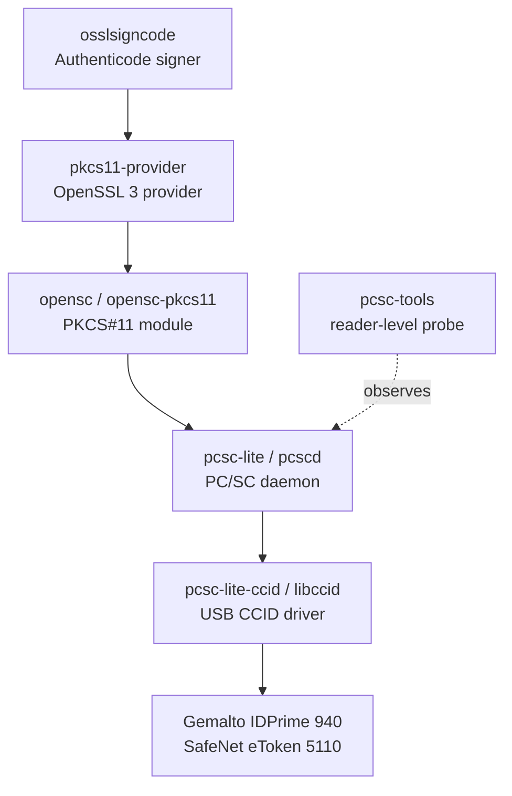

# SafeNet 5110 Code Signing Packages - Plan

## Goal Capsule

- **Objective.** Declare in chezmoi source state the packages that let a workstation Authenticode-sign Windows binaries with the GlobalSign OV code-signing certificate held on a SafeNet eToken 5110 (Gemalto IDPrime 940). The stack already works on the live Fedora host but is undeclared, so a reinstall or a second host loses it.
- **Product authority.** Package declarations only, on both the Fedora and Ubuntu lists. No provisioning script, no service enablement, no `/etc` manifest entry, no `openssl.cnf` change, no PIN handling, no signing wrapper, no usage documentation.
- **Open blockers.** None. The one unverified link — a real signature produced by `osslsigncode` — is human-gated on the physical token and its PIN, so it lands in Definition of Done as a manual step rather than a blocker.

---

## Product Contract

**Product Contract preservation:** unchanged. Planning added the Planning Contract, Implementation Units, Verification Contract, and Definition of Done below; no R-ID or AE-ID text was altered.

### Summary

Add the smartcard and Authenticode signing stack to both distro package lists in `.chezmoidata/packages.yaml`, so PC/SC, the OpenSC PKCS#11 module, the OpenSSL 3 PKCS#11 provider, and `osslsigncode` are reproducible from source state. Nothing else changes: the PC/SC socket unit is enabled by each distribution's own install behavior, and `osslsigncode` loads the provider per invocation, so no configuration file needs editing.

### Problem Frame

Windows executables and installers for this product are built on the Fedora workstation, but signing happens on a separate Windows machine that exists only to run SafeNet Authentication Client and `signtool`. Every release therefore crosses a machine boundary for one step.

That boundary is unnecessary. The token is a Gemalto IDPrime 940, which OpenSC drives directly, and the full chain from OpenSSL to the card already resolves on this host. The certificate reads without a PIN.

The stack got there by accident. `pcsc-lite`, `pcsc-lite-ccid`, `opensc`, and `pkcs11-provider` are installed as transitive dependencies of unrelated packages, and no repository file mentions any of them. A reinstall, or a second workstation, starts from nothing and the failure appears at release time. The one genuinely missing piece, `osslsigncode`, has never been installed at all.

### Key Decisions

- **Reach the token through the OpenSSL 3 provider, not the legacy ENGINE.** `osslsigncode` supports both. The provider (`pkcs11-provider`) is already present on the Fedora host, is the interface both distributions are standardizing on, and was observed reading the token's certificate through OpenSSL 3.5.7. The ENGINE path would mean installing a package for an API OpenSSL 3 has deprecated. (session-settled: user-approved — chosen over the libp11 ENGINE path and over declaring both: the provider was demonstrated working, and the fallback is one list entry away if the end-to-end signing test fails.)

- **Declare packages and nothing else.** The PC/SC socket unit is enabled by package install on both distributions, so no enablement step is needed. `osslsigncode` takes `-provider` and `-pkcs11module` as arguments, so the provider needs no entry in `openssl.cnf`. Both facts remove the usual reasons a change like this would grow a provisioning script. (session-settled: user-directed — chosen over a wrapper script plus service enablement: the user scoped the work to the packages.)

- **Both distro lists, not Fedora alone.** The token is physically attached to the Fedora workstation today, so a Fedora-only declaration was the narrower option. Declaring both keeps the capability from being a property of one machine, and every package exists in Ubuntu 26.04. (session-settled: user-directed — chosen over Fedora-only.)

- **No recorded signing command.** A packages-only change leaves no trace of how the pieces connect, and writing the working invocation into this plan was offered as a free hedge against rediscovery cost. It is deliberately not here. (session-settled: user-directed — chosen over recording a reference invocation.)

### Requirements

**Package declaration**

- R1. The Fedora package list in `.chezmoidata/packages.yaml` declares `pcsc-lite`, `pcsc-lite-ccid`, `opensc`, `pkcs11-provider`, `osslsigncode`, and `pcsc-tools`.
- R2. The Ubuntu package list declares the equivalents: `pcscd`, `libccid`, `opensc`, `opensc-pkcs11`, `pkcs11-provider`, `osslsigncode`, and `pcsc-tools`.
- R3. The Ubuntu list carries `opensc-pkcs11` alongside `opensc` because Debian packaging splits the PKCS#11 module out of the tools package, while Fedora ships both under `opensc`. The extra entry is the split, not a second capability.
- R4. Each added entry carries an inline comment in the style the surrounding entries already use, naming what the package is for.

**No added machinery**

- R5. The change adds no provisioning script, no systemd unit enablement, and no `/etc` manifest entry; bringing up the PC/SC socket remains each distribution's own install behavior.
- R6. `openssl.cnf` and the distribution's OpenSSL configuration drop-in directory stay untouched, so no non-signing OpenSSL consumer initializes a token.

**Reproducibility**

- R7. On a host of either distribution where none of these packages are present, a `chezmoi apply` leaves the host able to sign with the token attached, requiring no further manual installation.

### Acceptance Examples

- AE1. End-to-end signing
  - **Covers R1, R7.**
  - **Given** a host provisioned from source state, with the eToken attached.
  - **When** `osslsigncode sign` runs against an unsigned `.exe` using the token's key through the PKCS#11 provider, and the user enters the token PIN once.
  - **Then** the output binary carries an Authenticode signature chaining to `GlobalSign GCC R45 CodeSigning CA 2020`, and `osslsigncode verify` accepts it.

- AE2. No collateral token initialization
  - **Covers R6.**
  - **Given** the OpenSSL configuration unmodified and the token attached.
  - **When** any other OpenSSL consumer on the host runs.
  - **Then** it neither initializes the token nor prompts for a PIN.

- AE3. Daemon comes up without help
  - **Covers R5.**
  - **Given** a host where the PC/SC package was installed by this change and no unit was enabled by hand.
  - **When** the token is inserted.
  - **Then** the PC/SC daemon is running through socket activation and `opensc-tool --list-readers` reports the reader.

- AE4. Ubuntu reaches the same module
  - **Covers R2, R3.**
  - **Given** an Ubuntu host provisioned from source state.
  - **When** `pkcs11-tool --list-token-slots` runs with the token attached.
  - **Then** it reports the token, confirming `opensc-pkcs11` supplied the module that `opensc` alone would not have.

### Scope Boundaries

- A signing wrapper, helper script, build-system integration, or recorded reference command. The packages are the whole deliverable.
- PIN automation, PIN caching, and keyring or pinentry integration.
- CI or remote signing. The token is a physical device on one desk.
- Registering the token with browsers, the NSS database, GPG, or SSH. This change serves code signing only.
- Certificate renewal and re-enrollment. Enrollment is a CA and vendor flow, and the current certificate expires 2026-08-30.
- Adopting SafeNet Authentication Client. OpenSC drives this card, so the proprietary stack has no role here.

### Dependencies / Assumptions

**Verified on the Fedora host (2026-07-29)**

- The chain resolves: OpenSSL 3.5.7 loads `pkcs11-provider` 1.1, which reaches `opensc-pkcs11.so`, `pcscd`, and the card. `openssl storeutl` printed the certificate with no PIN.
- The card identifies as Gemalto IDPrime 940 behind a `SafeNet eToken 5100 [eToken 5110 SC]` reader; USB id `0529:0620`.
- The certificate is a GlobalSign OV code-signing certificate (`extendedKeyUsage: Code Signing`, policy `2.23.140.1.4.1`), RSA 4096, valid to 2026-08-30.
- `pcscd.socket` is enabled by Fedora's distribution preset, not by anything in this repository.
- Fedora 44 offers `osslsigncode 2.12` and `pcsc-tools 1.7.0`; both are absent from the host.
- Every Ubuntu package named in R2 exists in Ubuntu 26.04 "resolute", the release this repository targets.

**Assumptions**

- `osslsigncode` drives this token through the provider interface. This is the one unverified link, and AE1 is what verifies it.
- Installing the PC/SC package on Ubuntu enables its socket unit the way Fedora's preset does, through Debian's maintainer-script unit enablement. The mechanism differs; the outcome is assumed equivalent and AE3 covers it.
- Module paths differ across distributions because Debian uses multiarch directories. Nothing in this change references a module path, so the divergence costs nothing here, but any later automation would have to resolve the path per distribution.
- The signing key sits in slot 0 behind the ordinary user PIN. Slot 1, labelled `Digital Signature PIN`, exposes no objects.
- PIN retry budget is small: 5 remaining on the user PIN and 3 on the Digital Signature PIN. Verification must not guess.
- Nothing in the change references the token serial or the certificate, so renewal does not invalidate the package declarations.
- Signatures need an RFC 3161 timestamp to outlive the certificate's 2026-08-30 expiry. Timestamping is a property of how the tool is invoked, so it sits outside this change while remaining a real constraint on whoever signs.

### Outstanding Questions

**Resolve Before Planning**

- None.

**Deferred to Planning**

- Whether `pcsc-tools` earns its place on either list. Resolved: keep it. It is the only reader-level probe (`pcsc_scan`) and costs about 100 KB; `opensc`'s tools start one layer above the reader, so a reader that never appears is invisible without it.
- The fallback if AE1 fails: add the libp11 ENGINE package (`openssl-pkcs11` on Fedora, `libengine-pkcs11-openssl` on Ubuntu) and sign through `-engine` instead of `-provider`. Both distributions still ship it, so the fallback costs one entry per list. Recorded as KTD6; not implemented now.

### Sources / Research

- `.chezmoidata/packages.yaml:218` — the Fedora `packages:` list these entries join; every existing entry carries an inline comment.
- `.chezmoidata/packages.yaml:509` — the Ubuntu `packages:` list, which gains the equivalent set.
- `.chezmoidata/packages.yaml:552`, `:606` — the established convention for naming a Fedora counterpart in an Ubuntu entry's comment (`libffi-dev  # ... (libffi-devel equivalent)`, `libnotify-bin  # ... Fedora bundles it in libnotify`).
- `/usr/lib/systemd/system-preset/90-default.preset:226` — `enable pcscd.socket`, the reason no enablement script is needed on Fedora.
- `docs/plans/2026-07-22-002-refactor-secrets-gpg-cache-plan.md:121` — hardware-token adoption was named a non-goal there; this plan is narrower and does not revisit GPG key storage.
- osslsigncode README, "Using the PKCS#11 Provider with osslsigncode (OpenSSL 3.x only)" — the provider invocation shape, and the source of a module filename that differs from the one Fedora ships.

---

## Planning Contract

### Key Technical Decisions

- KTD1. **Provider, not ENGINE.** Inherits the Product Contract's first Key Decision. `pkcs11-provider` is the declared access path; no libp11 ENGINE package enters either list. (session-settled: user-approved — chosen over the libp11 ENGINE path: the provider was demonstrated reading the token, and ENGINE is deprecated in OpenSSL 3.)

- KTD2. **Data-only change.** Inherits the Product Contract's second Key Decision. The diff touches `.chezmoidata/packages.yaml` and this plan, nothing else — no script under `.chezmoiscripts/`, no entry in `.chezmoidata/system.yaml`, no file under `system/linux/etc/`. This matches the repository's single-source-of-truth rule: edit data, not generated scripts. (session-settled: user-directed — chosen over a wrapper script plus service enablement.)

- KTD3. **Both distro lists.** Inherits the Product Contract's third Key Decision. (session-settled: user-directed — chosen over Fedora-only.)

- KTD4. **No usage documentation.** Inherits the Product Contract's fourth Key Decision. (session-settled: user-directed — chosen over recording a reference invocation.)

- KTD5. **One new thematic group per list, mirrored across distros.** Both `packages:` lists are organized as thematic blocks introduced by a `# Category` comment and separated by a blank line. The six or seven entries go into a single new `# Smartcard / code signing` block placed immediately before the existing `# Password manager` block in each list, rather than being scattered into `Build tooling` and `CLI utilities`. **Rationale:** the grouping is the file's only index of *why* a package is present; splitting one capability across three blocks makes it unremovable later because no reader can tell which entries belong together. Placing it beside the password manager keeps credential-handling tooling adjacent, and mirroring the position across both lists keeps the two lists diffable against each other.

- KTD6. **The real-signature check is human-gated and stays out of the automated contract.** AE1 needs the physical token attached and one PIN entry, and the user PIN has 5 retries left. No automated gate can produce it, and a scripted attempt risks the token. **Rationale:** the automated Verification Contract therefore stops at what is mechanically checkable — the data parses, the installers render with the new names, and every Fedora name resolves in the enabled repositories — and AE1 moves to Definition of Done as an explicit manual step. Recording it as an automated gate would be a false green; dropping it would lose the only proof the capability works.

### High-Level Technical Design

Each declared package is one link in the chain from the signing tool to the card. The diagram is the map from package to purpose, and is why the list cannot be trimmed further without breaking a link.

Fedora ships the module and the tools together under `opensc`; Debian splits the module into `opensc-pkcs11`. That split is the only structural difference between the two lists.

### Sequencing

U1 and U2 are independent edits to different regions of one file and may land in either order or together. U2 mirrors U1's grouping and comment shape, so doing U1 first is the cheaper sequence.

---

## Implementation Units

### U1. Declare the Fedora smartcard and signing packages

- **Goal.** The Fedora package list carries the six packages that make token-based Authenticode signing reproducible.
- **Requirements.** R1, R4, R5, R6; supports AE1 and AE3. Implements KTD1, KTD2, KTD5.
- **Dependencies.** None.
- **Files.** `.chezmoidata/packages.yaml`
- **Approach.** Insert one new thematic block in the Fedora `packages:` list, immediately before the `# Password manager` block, following the file's existing shape: a `# Smartcard / code signing` header comment, then one entry per line with an inline comment, then a blank line before the next block. Declare `pcsc-lite`, `pcsc-lite-ccid`, `opensc`, `pkcs11-provider`, `osslsigncode`, `pcsc-tools`. Each comment names the link the package supplies, per the High-Level Technical Design. Note in the `pcsc-lite` comment that its `pcscd.socket` is enabled by the distribution preset, so no enablement script exists — that comment is what stops a future reader from adding one.
- **Patterns to follow.** The block shape at `.chezmoidata/packages.yaml:254-259` (`# Hardware sensors / fan control`, `# Logitech device manager`) — header comment, entries with inline comments, blank-line separation. The multi-line explanatory header at `:249-250` is the pattern when one comment line is not enough.
- **Test scenarios.** `Test expectation: none — pure data declaration with no behavioral logic.` Coverage comes from the Verification Contract gates below: the list parses and contains exactly these names, and the rendered Fedora installer carries them.
- **Verification.** Querying the Fedora package list from the data file returns all six names, and the rendered `.chezmoiscripts/20-linux-fedora/` installer contains them.

### U2. Declare the Ubuntu smartcard and signing packages

- **Goal.** The Ubuntu package list carries the same capability under Debian's package names.
- **Requirements.** R2, R3, R4, R5, R6; supports AE4. Implements KTD3, KTD5.
- **Dependencies.** U1 — not technical, but U2 mirrors U1's block position, header wording, and comment shape.
- **Files.** `.chezmoidata/packages.yaml`
- **Approach.** Insert the mirrored `# Smartcard / code signing` block in the Ubuntu `packages:` list, immediately before its `# Password manager` block. Declare `pcscd`, `libccid`, `opensc`, `opensc-pkcs11`, `pkcs11-provider`, `osslsigncode`, `pcsc-tools`. Where a name differs from Fedora's, the inline comment names the Fedora counterpart, matching how the file already handles `libffi-dev` and `libayatana-appindicator3-dev`. The `opensc-pkcs11` comment states that Fedora bundles this module inside `opensc`, mirroring the `libnotify-bin` comment's shape, so the extra entry does not read as an accident.
- **Patterns to follow.** `.chezmoidata/packages.yaml:552` (`libffi-dev  # FFI headers (libffi-devel equivalent)`) and `:606` (`libnotify-bin  # ... Fedora bundles it in libnotify`).
- **Test scenarios.** `Test expectation: none — pure data declaration with no behavioral logic.` Coverage comes from the Verification Contract gates below.
- **Verification.** Querying the Ubuntu package list from the data file returns all seven names, and the rendered Ubuntu installer contains them.

---

## Verification Contract

| Gate | Command | Applies to | Done signal |
|---|---|---|---|
| Data parses and carries the Fedora set | `yq '.packages.linux.fedora.packages[]' .chezmoidata/packages.yaml` | U1 | All six Fedora names present; file parses |
| Data parses and carries the Ubuntu set | `yq '.packages.linux.ubuntu.packages[]' .chezmoidata/packages.yaml` | U2 | All seven Ubuntu names present; file parses |
| Fedora installer renders with the new names | Render `.chezmoiscripts/20-linux-fedora/run_onchange_before_fedora.sh.tmpl` through the repository's isolated recipe (per-user scratch, stub `op`, empty config, throwaway destination, `--source "$PWD"`) | U1 | Render exits 0 and the output contains each Fedora name |
| Ubuntu package data renders | Render a fragment that ranges `.packages.linux.ubuntu.packages` through the same isolated recipe. The full `.chezmoiscripts/40-linux-ubuntu/` installer sits behind an OS gate and renders empty on a Fedora host, so the fragment is what exercises the data path | U2 | Render exits 0 and the output contains each Ubuntu name |
| Fedora names resolve in enabled repositories | `dnf -q --disablerepo='*' --enablerepo=fedora,updates repoquery <names>` | U1 | Every name returns at least one candidate |
| Diff is clean and scoped | `git diff --check` and a diff limited to `.chezmoidata/packages.yaml` plus this plan | U1, U2 | No whitespace errors; no unrelated file touched |

Two gates are bounded by running on a Fedora host. Ubuntu name existence was resolved during planning against `packages.ubuntu.com/resolute` and recorded in Dependencies / Assumptions, because this checkout cannot run `apt-cache` against Ubuntu. The full Ubuntu installer likewise cannot render here; the fragment gate covers the data path, and CI's `render-dotfiles.yml` covers the whole template.

---

## Definition of Done

- Both `packages:` lists carry a `# Smartcard / code signing` block in the same position, with every entry commented (R1, R2, R3, R4).
- The diff touches only `.chezmoidata/packages.yaml` and this plan — no script, no `/etc` manifest entry, no OpenSSL configuration (R5, R6, KTD2).
- Every gate in the Verification Contract passes.
- CI is green on both `render-dotfiles.yml` and `ci.yml`.
- **Manual, human-gated — not automatable in this pipeline.** With the token attached, install the set on the Fedora host and run AE1: sign an unsigned `.exe` through the provider, enter the PIN once, and confirm `osslsigncode verify` accepts a signature chaining to `GlobalSign GCC R45 CodeSigning CA 2020`. If it fails, apply KTD6's ENGINE fallback. The user PIN has 5 retries left; do not retry a guessed PIN.
