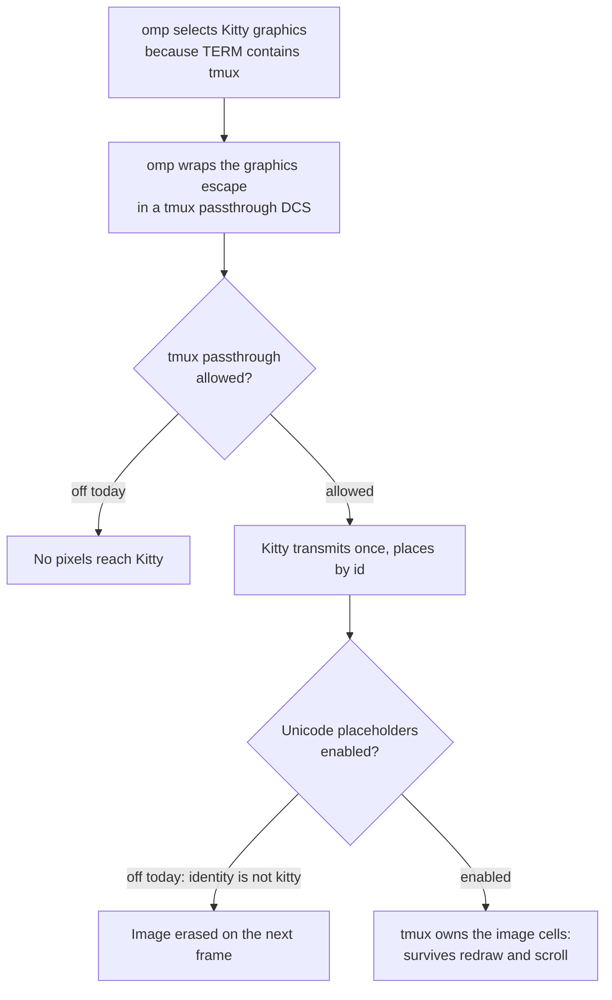
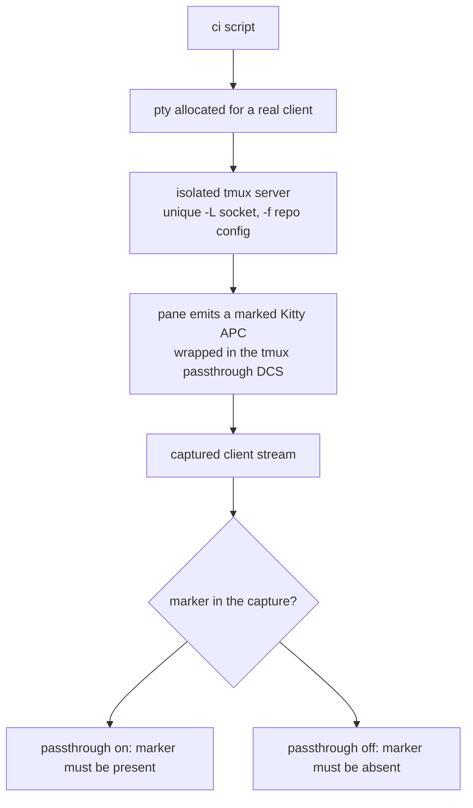

# tmux Kitty Image Passthrough - Plan

## Goal Capsule

- **Objective:** Make omp's inline image output visible, and keep it correct across redraw and scroll, inside the aoe -> tmux -> Kitty stack. The vehicle is this repository's first chezmoi-managed tmux configuration, which also carries the upstream-recommended extended-key settings.
- **Product authority:** This plan owns the tmux-side settings and the omp image-protocol value that the image path needs. It does not own aoe's attach model, Kitty's own configuration, or upstream omp and tmux behavior.
- **Execution profile:** Three sequential units — the managed config, an isolated automated test, then the documentation of the constraint. Verification is local and isolated; the one step that needs a human eye is a manual Kitty session check.
- **Stop conditions:** Stop and report rather than widening scope if the isolated test cannot distinguish passthrough `on` from `off`, or if the manual Kitty check shows images that do not survive a scroll. Do not open passthrough to `all` to make a test pass, and do not fall back to sixel — both are rejected decisions, not fallbacks.
- **Tail ownership:** The calling pipeline owns commit, push, pull request and CI watch. Implementation stops after local verification.
- **Open blockers:** None.

---

## Product Contract

**Product Contract preservation:** unchanged, except that the three `Deferred to Planning` questions were resolved by planning and the section was removed — their answers now live as KTD3, KTD5, and the confirmed assumption A4. No requirement, flow, or acceptance example was altered.

### Summary

omp's inline images render as pixels inside aoe-managed tmux sessions under Kitty and stay correct when the pane scrolls or redraws. A new managed tmux configuration carries the two settings the Kitty graphics path needs through tmux, plus the extended-key settings that restore Shift+Enter in the same stack.

### Problem Frame

omp already aims at this stack correctly. It selects the Kitty graphics protocol whenever `TERM` contains `tmux` or `screen`, and it wraps its graphics escape in a tmux passthrough DCS with doubled escapes whenever `TMUX` is set. Nothing on the omp side is missing.

Two gates on the tmux side close the path. First, `allow-passthrough` is `off` on this host — tmux's default, with no configuration overriding it — and tmux 3.7b carries no Kitty-graphics handling of its own, so it discards the passthrough payload and no pixels reach Kitty. Second, omp enables Kitty Unicode placeholders only when the resolved terminal identity is `kitty` or `ghostty`, or when `TMUX` is set together with an explicitly forced `kitty` protocol. Inside tmux, `KITTY_WINDOW_ID` is absent and `TERM_PROGRAM` reports tmux, so identity never resolves to Kitty. Without placeholders tmux does not own the image cells, so an image that did reach the screen would be erased by the next frame. Opening one gate without the other leaves either a blank pane or an image that dies on the first scroll.

The same stack loses a second behavior silently. omp binds newline insertion to Shift+Enter and Ctrl+J, but tmux's default key reporting collapses Shift+Enter into a bare carriage return, so only the Ctrl+J fallback works today.

Neither gate can be reached from where the repository currently stands: no tmux configuration exists at all. `~/.tmux.conf`, `~/.config/tmux/tmux.conf` and `/etc/tmux.conf` are all absent, and nothing in the source tree manages a tmux target — though `dot_config/.chezmoiignore` already names `tmux` in its Windows-only exclusion block, with no source directory behind it.

### Key Decisions

- **Kitty graphics, not tmux-native sixel** (session-settled: user-directed — chosen over the sixel path and over dropping the tmux attach mode: Kitty is the actual outer terminal, so the Kitty path keeps full-color fidelity and stays on omp's default, best-tested code path, while sixel would pay palette-quality loss and per-image re-encoding forever to avoid a one-time security judgment).
- **Passthrough opened no wider than visible-pane output** (session-settled: user-approved — chosen over the wider allowance that also covers hidden panes and the alternate screen: the image path needs nothing beyond visible panes, and the narrower value keeps the relaxation as small as the goal permits).
- **Extended-key settings ship with the image fix** (session-settled: user-directed — chosen over an image-only change: Shift+Enter is already broken in this same stack, the remedy is upstream-documented, and it lands in the same new file at no added carrying cost).
- **The forced image-protocol value is declared inside the tmux configuration** (session-settled: user-approved — chosen over `dot_config/environment.d/` and over `agents.omp.auth.env`: a systemd user-environment entry would force the Kitty protocol in bare Kitty, the editor terminal and ssh sessions where it is wrong, while `agents.omp.auth.env` is a credential surface by contract). Declaring it in tmux makes "only inside tmux" structural rather than conditional logic.
- **A literal configuration file, not a template.** Nothing in the file derives from `.chezmoidata`, so it stays a plain source file. `dot_config/kitty/kitty.conf.tmpl` is a template only because two font lines read `fonts.yaml`.

### Requirements

**Image rendering**

- R1. omp renders an inline image as visible pixels inside an aoe-managed tmux session running under Kitty.
- R2. A rendered image stays correctly placed when its pane redraws or scrolls, instead of being erased or smeared.
- R3. omp running directly in Kitty with no tmux keeps its current image behavior unchanged.

**Keyboard input**

- R4. Shift+Enter inserts a newline in omp's composer inside tmux and is distinguishable from a bare Enter.

**Managed configuration surface**

- R5. tmux configuration becomes a chezmoi-managed target in this source tree, at the XDG path tmux reads natively.
- R6. The passthrough allowance is opened no wider than visible-pane image output requires.
- R7. The forced image-protocol value reaches tmux sessions only, and no other shell or terminal context.
- R8. Windows targets receive no tmux configuration.

**Verification constraints**

- R9. The change is proven in a real Kitty, tmux and omp session rather than by template rendering alone.
- R10. Verification stays isolated from the live environment: no `chezmoi apply`, and no disruption of the user's running aoe sessions.

### Key Flows

- F1. Inline image render inside tmux
  - **Trigger:** omp emits an inline image in a pane of an aoe-managed tmux session under Kitty.
  - **Steps:** omp resolves the Kitty graphics protocol from `TERM`; it wraps the graphics escape in a tmux passthrough DCS; tmux forwards the payload untouched; Kitty transmits the image once and places it by id; placeholder cells hold the placement so tmux owns the grid.
  - **Outcome:** the image is visible and moves with the text around it.
  - **Covered by:** R1, R2, R6, R7
- F2. Modified Enter inside tmux
  - **Trigger:** the user presses Shift+Enter in omp's composer inside tmux.
  - **Steps:** tmux reports the modified key in CSI-u form instead of collapsing it to a carriage return; omp matches it against the newline binding.
  - **Outcome:** a newline is inserted rather than the message being sent.
  - **Covered by:** R4

### Acceptance Examples

- AE1. **Covers R1.** Given an aoe session attached through tmux under Kitty, when omp renders an image, then pixels appear rather than a text placeholder or nothing at all.
- AE2. **Covers R2.** Given a visible inline image, when the pane scrolls or is forced to redraw, then the image stays in the right place instead of disappearing.
- AE3. **Covers R3.** Given omp launched directly in Kitty with no tmux, when it renders an image, then behavior matches today's.
- AE4. **Covers R4.** Given omp's composer inside tmux, when the user presses Shift+Enter, then a newline is inserted; when the user presses Enter, then the message is sent.
- AE5. **Covers R8.** Given a Windows target, when chezmoi applies, then no tmux configuration is deployed.

### Scope Boundaries

- The tmux-native sixel path, and the `terminal-features` advertisement it would need. Rejected with the transport decision, not deferred.
- Changing aoe's attach mode away from tmux.
- Serving a tmux session attached from a terminal that cannot draw Kitty graphics. The forced protocol is unconditional inside tmux, so such an attach shows graphics escapes instead of images; recovering that session means unsetting the protocol for it by hand.
- Any tmux setting not evidenced as broken in this stack: prefix keys, mouse behavior, status line, copy mode.
- Changes to `dot_config/kitty/kitty.conf`. The Kitty graphics path needs none, and `allow_remote_control` stays absent.
- Upstream changes to omp or to tmux.

### Sources and Research

- `dot_config/agent-of-empires/profiles/main/private_config.toml.tmpl:21-22` — aoe attaches through tmux and launches omp, which is what puts omp behind a multiplexer at all.
- `dot_config/.chezmoiignore:12-16` — a Windows-only exclusion block already naming `tmux`, with no source directory behind it.
- `dot_config/kitty/kitty.conf.tmpl` — Kitty settings carry nothing about graphics, and `allow_remote_control` is absent, which bounds the passthrough exposure.
- `.chezmoidata/agents.yaml:26-28,452-454` — `agents.omp.auth.env` is the credential surface and declared omp settings stay credential-free, which is why the protocol value does not go there.
- `.chezmoidata/packages.yaml:237,543` — tmux ships in the base package set on both Fedora and Ubuntu.
- omp internals, read from the embedded sources in the installed binary: `packages/tui/src/tmux.ts` wraps payloads as a tmux passthrough DCS with doubled escapes whenever `TMUX` is set, and the Kitty placement emitter routes through that wrapper; the placeholder gate returns true for `TMUX` plus a forced `kitty` protocol, and otherwise only for a `kitty` or `ghostty` identity; protocol selection returns Kitty when `TERM` contains `tmux` or `screen`; terminal identity reads `KITTY_WINDOW_ID` before falling back to `TERM_PROGRAM`; `tui.input.newLine` defaults to Shift+Enter and Ctrl+J.
- pi v0.82.1 `docs/tmux.md` lines 10-11, 21 and 60, installed under `~/.local/share/pi/versions/v0.82.1` — upstream recommends `extended-keys on` with `extended-keys-format csi-u` and states the 3.5 minimum.
- tmux upstream, `options-table.c` and `tmux.1` — `allow-passthrough` accepts `off`, `on` and `all`, where `on` permits passthrough only from a visible pane and `all` permits it from an invisible one; the default is `off`. `extended-keys` accepts `off`, `on` and `always`; `extended-keys-format` is a server option accepting `csi-u` and `xterm`, defaults to `xterm`, and arrived in tmux 3.5. Neither extended-keys option is documented to affect passthrough, graphics or mouse reporting.
- Kitty upstream, `docs/graphics-protocol.rst` and `kittens/icat` — Unicode placeholders (`U+10EEEE`, added in Kitty 0.28.0) are the mechanism that makes images survive redraw and scroll inside a multiplexer, because the placeholder is ordinary text that the host application moves for you. Kitty's own `icat` treats the two as a pair: enabling tmux passthrough "implies `--unicode-placeholder` as well". Placeholders need no tmux `terminal-features` entry and no special `TERM`; allowing passthrough is the only tmux-side gate.
- Measured on this host: `tmux show -gv allow-passthrough` prints `off`; tmux 3.7b carries sixel identifiers and no Kitty-graphics identifiers; `~/.tmux.conf`, `~/.config/tmux/tmux.conf` and `/etc/tmux.conf` are all absent; `KITTY_WINDOW_ID` is absent from `tmux show-environment -g`.
- Measured against an isolated tmux server (unique `-L` socket, never the default one): all four intended settings apply from a config file; a pane process receives the forced protocol in all three creation paths — a session created in the same invocation that sourced the config, a session created after the server was already running, and a new window inside an existing session. `show-environment -t <session>` does not list a global variable, so a session-environment listing is the wrong assertion; the pane's own environment is the right one.
- Measured: `#{version}` reports `3.7b` and `#{>=:#{version},3.5}` evaluates true, but `#{>=:#{version},3.10}` also evaluates true, so the comparison is lexical rather than semantic. Separately, an unknown option in a tmux config does not abort parsing — settings before and after the offending line still apply.
- Measured against an isolated server: appending `KITTY_WINDOW_ID` to `update-environment` propagates it to a pane created by a client that carries it, while a new window in a session that never saw such a client gets nothing. This is the identity-based alternative to forcing the protocol, recorded so the KTD3 tradeoff does not have to be rediscovered.
- Measured, and the reason this fix is easy to "disprove" by accident: tmux forwards a BARE Kitty graphics APC to its client regardless of `allow-passthrough`, and gates only the tmux-DCS-wrapped form. `kitten icat` therefore still draws images inside tmux with the setting off, because it falls back to an unwrapped APC. omp does not have that fallback — every one of its graphics emissions (transmission chunks, placement, delete) routes through the wrapper that adds the DCS whenever `TMUX` is set, so all of them are gated.
- Verified end to end against a real Kitty window: a hand-built payload matching omp's exact wrapped shape renders as pixels with `allow-passthrough on` and renders nothing with it `off`. `kitten icat` is not a faithful probe for this and must not be used as one.

---

## Planning Contract

### Key Technical Decisions

- KTD1. **Enable passthrough and force the Kitty protocol together, as one pair.** Neither setting alone produces a working image: without passthrough tmux discards the payload, and without the forced protocol omp leaves Unicode placeholders off inside tmux, so any image that did land would be erased on the next frame. Kitty's own `icat` couples them the same way — enabling tmux passthrough implies the placeholder path. Treat removing either line as a regression, not a simplification. (session-settled: user-directed — chosen over the tmux-native sixel path and over dropping the tmux attach mode; inherits the Product Contract decision *Kitty graphics, not tmux-native sixel*.)
  Do not conclude from `kitten icat` that passthrough is unnecessary. icat falls back to an unwrapped APC, which tmux forwards whatever the setting says; omp has no such fallback, so the setting is load-bearing for omp specifically.
- KTD2. **`allow-passthrough on`, never `all`.** tmux's own option text distinguishes them by pane visibility, and the image path only ever draws into a visible pane. `all` would additionally permit passthrough from panes tmux considers invisible, widening what an unattended pane can emit to the outer terminal for no gain here. (session-settled: user-approved — chosen over `all`; inherits the Product Contract decision *Passthrough opened no wider than visible-pane output*.)
- KTD3. **Declare the forced protocol with `set-environment -g` in the tmux config.** Measurement settles the question the Product Contract deferred: a pane receives the value in every creation path aoe uses, including a new window inside an already-running session. The alternatives were rejected upstream — a systemd user-environment entry would force the Kitty protocol in terminals where it is wrong, and `agents.omp.auth.env` is a credential surface. (session-settled: user-approved — chosen over `dot_config/environment.d/` and `agents.omp.auth.env`; inherits the Product Contract decision *The forced image-protocol value is declared inside the tmux configuration*.) **Conflict call-out:** the force is unconditional inside tmux, so attaching the same server from a terminal that cannot draw Kitty graphics makes omp emit graphics escapes into it. Propagating `KITTY_WINDOW_ID` through `update-environment` is measurably self-correcting per client, but it cannot rescue that case, because a forced protocol value outranks terminal identity in omp's own resolution. Self-correction would require dropping the force, which inverts this settled decision. The decision stands; the limitation is recorded in Scope Boundaries.
- KTD4. **Guard the tmux 3.5+ option with a `%if #{>=:#{version},3.5}` block.** This repository provisions tmux on both Fedora and Ubuntu, and `extended-keys-format` does not exist before tmux 3.5, which matches upstream pi's own instruction to omit it on 3.2 through 3.4. An unguarded line would not break the rest of the config, but it would surface a config error on every tmux start on an older host. The guard's comparison is lexical, which is correct for the 3.5 threshold and stays correct through 3.9; note the limit in a comment rather than building a semantic version parser for a threshold this repo will outgrow before it matters.
- KTD5. **Automate the transport assertion; leave the pixels to a human.** R9 wants a real-stack proof and R10 forbids a live apply, and CI has no Kitty and no display. Split the proof: the falsifiable half — does tmux forward the passthrough payload, and does it stop forwarding when the setting is off — runs as an isolated automated test, while visual confirmation that Kitty draws the image stays a documented manual step. A test that could only assert "the file contains the right lines" would be theater.
- KTD6. **Assert inside a pane, not against the session environment.** `show-environment -t <session>` does not list globally-set variables, so that assertion would fail against a working configuration. The test reads the environment of a process running in a pane.
- KTD7. **Drive the transport test through a pty.** tmux forwards a passthrough payload to an attached client, so a detached server produces nothing to assert against. The test allocates a pty, attaches, and captures the client stream.

### High-Level Technical Design

The transport test is the only part of this change whose shape is not obvious from its file list. It exists to prove the tmux-side gate, and it needs a pty because tmux only forwards passthrough to an attached client.

The negative case carries the weight. A test that only checks the `on` path would still pass if tmux forwarded the payload for some unrelated reason, so the `off` run is what proves the setting is the cause.

### Assumptions

- A1. tmux 3.7b on this host satisfies the 3.5 minimum. tmux ships in the shared base package set for both Fedora and Ubuntu, so the target is present wherever the file deploys, and the KTD4 guard covers the older Ubuntu build.
- A2. Kitty 0.47.1 is the outer terminal for aoe work, and every attach to an aoe tmux session comes from Kitty. Attaching from another terminal is a recorded limitation rather than a handled case — see KTD3's conflict call-out and Scope Boundaries.
- A3. First adoption needs a full tmux server restart, because a config file is sourced at server start. aoe's `auto_resume_on_restart` recovers sessions, but the restart is not free.
- A4. `dot_config/.chezmoiignore`'s existing bare `tmux` entry excludes the whole subtree on Windows, matching how sibling entries in that file gate directories. R8 needs no new ignore rule, and a dot-prefixed source path needs no root `.chezmoiignore` line.

### System-Wide Impact

- This introduces the first chezmoi-managed tmux surface in the repository. `dot_config/.chezmoiignore` already anticipated it; nothing else in the source tree currently reasons about tmux.
- It relaxes a tmux security default. `allow-passthrough on` lets any program in a visible pane send arbitrary escape sequences to Kitty, not only graphics — clipboard writes, title and notification sequences, and hyperlinks all ride the same channel. That matters in a stack where agents print untrusted repository content into panes. Kitty's absent `allow_remote_control` removes only the remote-control API from that surface; it does not bound the rest. KTD2 holds the relaxation at the narrower of the two enabling values, and the remaining exposure is accepted rather than mitigated.
- The protocol force propagates server-wide rather than per pane. Because it applies to every pane in every session on the server, a non-Kitty attach degrades every omp pane there at once instead of one. That bounds this specific failure mode to tmux, and says nothing about the escape-sequence exposure above.
- It places an omp environment value outside the omp settings surface. A later reader working from `.chezmoidata/agents.yaml` could reasonably try to consolidate it into the omp dotenv or into `environment.d`, which would break the scoping that makes it correct. U3 exists to prevent that.
- No workflow registration changes are needed for the new target itself: `render-dotfiles.yml` renders the whole tree with no per-target allowlist.

### Risks and Dependencies

- The tmux server's recorded global environment on this host carries `TERM=xterm-256color`, not Kitty's own value, which means the running server was started from a non-Kitty context. Kitty's FAQ warns that a tmux server used across terminals with different `TERM` values misbehaves because tmux holds one terminfo definition. Forcing the protocol removes omp's dependence on terminal identity, but it does not fix tmux's own capability model — verify in a server started from Kitty.
- Kitty's protocol requires that images be cleared on reset and on alternate-screen transitions, and omp's renderer borrows the alternate screen on some resizes. An image may therefore need a redraw after a resize. Observe this during the manual check; treat it as expected behavior to note, not a blocker.
- Kitty documents that a clear-all with tmux affects images across panes. Nothing in this change triggers it, but it explains any cross-pane image disappearance seen during verification.
- The escape-sequence surface opened by `allow-passthrough on` is an accepted residual risk, not a mitigated one. A malicious or careless byte stream printed into a visible pane can drive Kitty's OSC surface — clipboard, title, notifications, hyperlinks — for as long as the setting is on. Nothing here detects or filters that. The accepted bound is narrow: Kitty's remote-control API stays disabled and the setting stays at `on` rather than `all`.

### Sequencing

U1 -> U2 -> U3. U2 asserts against the file U1 creates. U3 documents the constraints U1 established, and is last so it describes what actually shipped.

---

## Implementation Units

### U1. Managed tmux configuration

- **Goal:** Deploy the four settings to `~/.config/tmux/tmux.conf` on every non-Windows target.
- **Requirements:** R1, R2, R4, R5, R6, R7, R8 — enables F1 and F2; implements KTD1, KTD2, KTD3, KTD4.
- **Dependencies:** none.
- **Files:** `dot_config/tmux/tmux.conf` (new).
- **Approach:** A literal source file with no `.tmpl` extension, because nothing in it derives from `.chezmoidata` and this tree uses templates only where template data exists. Carry the passthrough setting, `extended-keys on`, the 3.5-guarded `extended-keys-format csi-u`, and the `set-environment -g` line for omp's image protocol. Comment each setting with what it unlocks, and state on the passthrough and protocol lines that they are a pair — that comment is the guard against a future reader deleting one and silently degrading images. Open the file with the same `managed by chezmoi` banner `dot_config/kitty/kitty.conf.tmpl` uses; the literal exemplars under `dot_config/environment.d/` omit it, but this file is easy to mistake for hand-written and a reader who edits the deployed copy loses the edit. Add no `.chezmoiignore` line anywhere: the Windows gate already exists.
- **Patterns to follow:** `dot_config/kitty/kitty.conf.tmpl` for the header banner and the practice of explaining each non-default setting and naming the upstream default it reverses.
- **Test scenarios:**
  - Covers AE5. The `tmux` entry in `dot_config/.chezmoiignore` sits inside the `eq .chezmoi.os "windows"` conditional, so a Windows destination excludes the subtree. Assert this structurally against the ignore file rather than by faking a Windows apply, which chezmoi cannot do from this host.
  - The target is listed by `chezmoi --source "$PWD" managed` for this host, and appears as `.config/tmux/tmux.conf` in an archive taken against a throwaway destination.
  - The file sources cleanly on the installed tmux with no error output, and the 3.5-guarded block takes effect on tmux 3.7b. Asserted by U2.
- **Verification:** The managed target resolves to `.config/tmux/tmux.conf`, and U2's test passes against this file.

### U2. Isolated transport and option test

- **Goal:** Prove, with no Kitty and without touching the user's tmux server, that the config applies and that tmux forwards the Kitty passthrough payload with the setting on and drops it with the setting off.
- **Requirements:** R1, R2, R4, R6, R7, R10 — asserts the tmux-side steps of F1 and F2; implements KTD5, KTD6, KTD7.
- **Dependencies:** U1.
- **Files:** `.ci/test-tmux-kitty-passthrough.sh` (new), `.github/workflows/ci.yml` (modify).
- **Approach:** Follow the harness shape of `.ci/test-cli-proxy-api-render-matrix.sh` — a per-user scratch directory under `$XDG_RUNTIME_DIR` with `~/.cache` as the fallback and never `/tmp`, explicit failure helpers, and no shared sourced helper, since this repository has none. Every tmux invocation uses a unique `-L` socket and `-f` pointed at the repository's config; the default socket is never addressed. Assert the option values, then assert the forced protocol from inside a pane rather than through a session-environment listing. For the transport case, allocate a pty so tmux has a real client, emit a marked Kitty graphics APC wrapped in the tmux passthrough DCS from inside a pane, and assert the marker reaches the captured stream; then repeat with passthrough `off` and assert it does not. Skip the 3.5-only assertion when the installed tmux is older, so a lagging CI runner skips rather than fails. Kill the isolated server from a trap so no stray server or scratch directory survives a failure. Register the script in `ci.yml` as an explicit named step, matching how the other `.ci` scripts are wired.
- **Capture note:** the assertion depends on the capture preserving raw bytes. A capture path that normalizes line endings, strips or rewrites control characters, or re-encodes the stream can drop the marker from a working configuration or invent one in a broken configuration, so the positive and negative cases would both report the wrong thing. Establish that the capture is byte-faithful before trusting either result.
- **Execution note:** Write the negative case first and watch it fail before U1's passthrough line exists. A transport test that has never been observed failing cannot distinguish a working config from a vacuous assertion.
- **Patterns to follow:** `.ci/test-cli-proxy-api-render-matrix.sh` for the scratch and failure-reporting skeleton; `.ci/test-cli-proxy-api-integration.sh` for PATH stubbing and an isolated `HOME`.
- **Test scenarios:**
  - Covers AE1 and AE2, transport half. With passthrough on, the marked payload appears in the captured client stream.
  - Negative case. With passthrough off, the marked payload is absent. This is the assertion that proves causation.
  - Capture fidelity. The captured stream reproduces a known control-character marker byte for byte, asserted before the transport cases run so a mangling capture path fails loudly instead of silently inverting them.
  - Covers AE4, enabling half. Option values: `allow-passthrough` is `on`; `extended-keys` is `on`; `extended-keys-format` is `csi-u` on tmux 3.5 or newer, and the assertion is skipped below that.
  - Pane environment. A process running in a pane sees the forced image protocol, asserted for a session created after the server started and for a new window in an existing session.
  - Isolation. The default socket's `allow-passthrough` is unchanged after the run, and no test-prefixed socket or scratch directory survives.
  - Version skip. On a tmux older than 3.5 the script still exits 0 and reports the skip rather than failing.
- **Verification:** The script exits 0 locally and in CI, and fails when U1's passthrough line is removed.

### U3. Record the surface and its constraints in AGENTS.md

- **Goal:** Stop a later agent from consolidating the forced protocol into the omp settings surface or `environment.d`, or from tightening passthrough back to the default without knowing what breaks.
- **Requirements:** R6, R7 — durability of KTD1, KTD2, KTD3.
- **Dependencies:** U1.
- **Files:** `AGENTS.md` (modify).
- **Approach:** Add the tmux configuration to the managed-surface documentation, in the file's existing dense prose style rather than as a new section. State three things and no more: the passthrough setting and the forced protocol are a pair and neither works alone; the protocol value lives in the tmux config because a systemd user-environment entry would force it in non-Kitty terminals while `agents.omp.auth.env` is a credential surface; passthrough stays at `on` and not `all`. Keep the reasoning, not the history.
- **Patterns to follow:** the surrounding ownership-and-constraint sentences in `AGENTS.md`, which state what a surface owns and what it must not do, without narrating how the decision was reached.
- **Test scenarios:** Test expectation: none — documentation only.
- **Verification:** A reader who has not seen this change can tell from `AGENTS.md` why the two settings are coupled and why the environment value is not in the omp settings surface.

---

## Verification Contract

| Gate | Command or action | Applies to |
|---|---|---|
| Isolated transport and option test | `.ci/test-tmux-kitty-passthrough.sh` | U1, U2 |
| Negative-case credibility | Remove U1's passthrough line, confirm the test fails, restore it | U2 |
| Managed target shape | `chezmoi --source "$PWD" --destination "$scratch" archive --exclude=encrypted,externals,scripts` contains `.config/tmux/tmux.conf` | U1 |
| Windows exclusion | `dot_config/.chezmoiignore` keeps `tmux` inside the `eq .chezmoi.os "windows"` conditional | U1 |
| Manual Kitty proof (R9) | In Kitty, start an isolated tmux server against the repository's config with a unique `-L` socket, run omp in it, render an image, scroll the pane, then press Shift+Enter and Enter in the composer | R1, R2, R4; AE1, AE2, AE4 |
| No-tmux regression check | In Kitty with no tmux, run omp and render an image; confirm behavior matches the pre-change baseline | R3; AE3 |
| Repo hygiene | `git diff --check`; `git status` | all |
| CI | `render-dotfiles.yml` and `ci.yml` both to terminal success | all |

The manual proof never uses the default tmux socket and never runs `chezmoi apply`, per R10. Record its outcome in the pull request description, since it is the only gate a reviewer cannot re-run from CI.

---

## Definition of Done

**Global**

- R1 through R10 hold, and AE1 through AE5 have each been observed or structurally asserted at least once.
- The isolated test passes, and its negative case has been seen to fail without U1's passthrough line.
- The manual Kitty proof has been performed and its outcome recorded in the pull request description: image visible, image survives a scroll, Shift+Enter inserts a newline while Enter sends.
- No stray tmux socket, scratch directory, or test artifact remains, and the default socket's options are unchanged.
- Experimental or dead-end code from the run is removed rather than left in the diff.
- `render-dotfiles.yml` and `ci.yml` are both terminal green.

**Per unit**

- U1. The managed target resolves to `.config/tmux/tmux.conf`, carries all four settings with the 3.5 guard, and explains the passthrough-and-protocol coupling in a comment.
- U2. The script is registered in `ci.yml` as an explicit step, exits 0 on this host, skips cleanly on tmux older than 3.5, and leaves no server or scratch behind.
- U3. `AGENTS.md` states the coupling, the placement rationale, and the `on`-not-`all` boundary.
