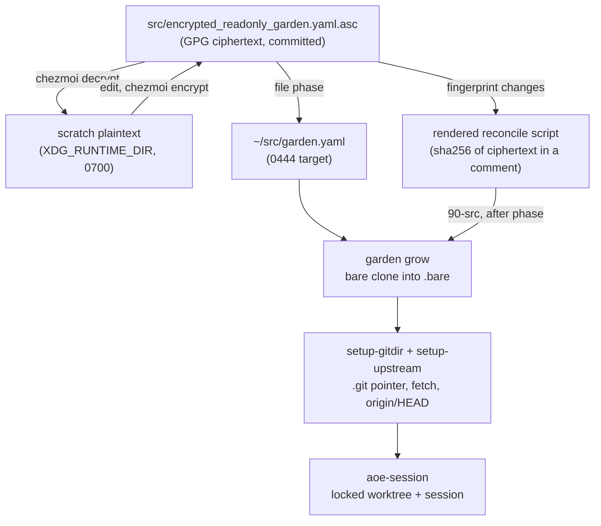

# Register ExamVueDuo_AI in the ~/src Garden Registry - Plan

## Goal Capsule

- **Objective:** Declare `https://git.jpi.app/products/examvue-duo/ExamVueDuo_AI.git` as a bare tree in the encrypted `~/src` project registry, and correct the registry header's stale encryption references in the same commit.
- **Authority:** The root `AGENTS.md` garden rules and the manifest's own in-file conventions outrank this plan. Where they conflict, follow them and flag the conflict.
- **Execution profile:** One commit against `src/encrypted_readonly_garden.yaml.asc`. Plaintext exists only in per-user scratch, never in the worktree.
- **Stop conditions:** Stop and ask if `chezmoi decrypt` fails (GPG key absent), if `garden ls` rejects the edited manifest, or if the plaintext round-trip is not byte-identical.
- **Tail ownership:** The implementer commits. Deployment is the user's call — `chezmoi apply` performs a real private clone and creates an aoe session, so it is never part of verification.

---

## Product Contract

### Summary

Add one tree to the chezmoi-managed `~/src` project registry so `garden grow` clones the `ExamVueDuo_AI` repository and the 90-src provisioner bootstraps it like every other JPI product repo. The registry is GPG ciphertext in a public repo, so the edit is a decrypt-edit-re-encrypt cycle in scratch. The same pass corrects the manifest header, which currently documents an age backend and an `.age` filename that no longer exist.

### Problem Frame

`products/examvue-duo/ExamVueDuo_AI` is active first-party product code (private, default branch `develop`) but is absent from the registry, so no host grows or sessions it. Its group sibling `examvue-apps` is already declared, so the normalization for this remote namespace is settled by precedent rather than open.

Separately, the manifest header instructs agents to run `chezmoi decrypt src/encrypted_readonly_garden.yaml.age` and calls the file AGE-ENCRYPTED. The repository moved to GPG (`encryption = "gpg"` in `.chezmoi.toml.tmpl`, source `src/encrypted_readonly_garden.yaml.asc`). An agent following the header verbatim fails on a missing path — the documented procedure for this very task is broken.

### Requirements

**Registry entry**

- R1. The registry declares tree `ExamVueDuo_AI` with `url: https://git.jpi.app/products/examvue-duo/ExamVueDuo_AI.git`.
- R2. Its path is `git.jpi.app/examvue-duo/ExamVueDuo_AI/.bare`, dropping the `products` umbrella segment.
- R3. The entry carries `bare: true` and `remote.origin.fetch: "+refs/heads/*:refs/remotes/origin/*"`, because `git clone --bare` alone tracks no remote branches.

**Registry documentation**

- R4. The manifest header names GPG as the backend and `src/encrypted_readonly_garden.yaml.asc` as the source, so its non-interactive agent procedure runs as written.

**Delivery discipline**

- R5. Decrypted plaintext never enters the worktree, `/tmp`, `/var/tmp`, or `/dev/shm`.
- R6. Verification touches neither `~/src` nor the network, and runs no live `chezmoi apply`.

### Scope Boundaries

**Deferred to follow-up work**

- The other seven repositories in the `products/examvue-duo` group. The user scoped this change to one repository. Enumerate them from the group listing at implementation time rather than from this plan, which stays in a public repo.

**Out of scope**

- `.chezmoiscripts/90-src/run_onchange_after_reconcile-garden.sh.tmpl` — its fingerprint already covers the registry; no script change is needed.
- `.chezmoiignore`, `dot_local/bin/executable_src-audit`, and aoe session lifecycle. aoe owns worktrees; the registry only declares trees.
- Migrating the registry off GPG or renaming the source file. R4 corrects documentation to match reality, not the reverse.

---

## Planning Contract

### Key Technical Decisions

- KTD1. **Leaf name stays verbatim `ExamVueDuo_AI`.** (session-settled: user-directed — chosen over kebab-cased `examvue-duo-ai`: every declared tree's name already matches its remote repository name character-for-character, and this group's remotes are natively mixed-case.) Accepts one mixed-case directory beside lowercase siblings.
- KTD2. **The path drops the `products` umbrella segment.** `examvue-apps` maps `products/examvue-duo/examvue-apps` to `git.jpi.app/examvue-duo/examvue-apps/.bare` — same remote namespace, so the group segment is `examvue-duo`. `signet` keeps `products` only because it sits directly under that group with no product subgroup.
- KTD3. **Bare tree, not a plain clone.** Bare is the aoe worktree shape for first-party code. Plain clones are reserved for third-party tools never developed through aoe (`opencode-mcp-figma`, `works`).
- KTD4. **Both edits land in one commit.** (session-settled: user-directed — chosen over deferring the header fix to its own change: the source is opaque ciphertext, so a second commit would rewrite the entire blob to fix a comment.)
- KTD5. **The entry sits next to `examvue-apps`, not appended.** Preserves the file's group clustering. `pacs-frontend`'s trailing position is drift from an earlier append, not a convention to copy.
- KTD6. **The HTTPS URL is used as supplied.** Matches every other `git.jpi.app` entry; the glab credential helper configured in `10-auth` injects auth, and the provisioner passes no tokens.
- KTD7. **No new `.ci/` test.** Every `.ci/test-*.sh` covers a script or render behavior; none covers registry data. The runtime guards are the provisioner's completeness check and `src-audit`.

### High-Level Technical Design

The registry reaches disk through two independent chezmoi mechanisms — file decryption and a fingerprinted provisioner. The fingerprint indirection is why a data-only edit re-runs a clone-and-session bootstrap.

Because gpg output is non-deterministic, any re-encrypt changes the fingerprint even when the plaintext is unchanged. The provisioner is idempotent, so that over-trigger is harmless.

### Assumptions

- The implementer's host has the GPG private key imported, so `chezmoi decrypt` works. Absence is a stop condition, not something to work around.
- `garden` 2.6.1 and a writable `$XDG_RUNTIME_DIR` are available.

---

## Implementation Units

### U1. Register the tree and correct the registry header

**Goal:** Add the `ExamVueDuo_AI` bare tree and replace the header's age/`.age` references with GPG/`.asc`, as one ciphertext change.

**Requirements:** R1, R2, R3, R4, R5, R6

**Dependencies:** none

**Files:**

- `src/encrypted_readonly_garden.yaml.asc` — the only file changed. No test file; see KTD7.

**Approach:**

Create scratch with `umask 077` and `mktemp -d` beneath `$XDG_RUNTIME_DIR`, and install a cleanup trap on `EXIT HUP INT TERM` before decrypting, so a stop-condition exit cannot leave plaintext behind. Decrypt to `$scratch/garden.yaml`, edit that plaintext, encrypt to the staged file `$scratch/reenc.asc`, verify the round-trip against the staged file, and only then move it over `src/encrypted_readonly_garden.yaml.asc`. Never redirect `chezmoi encrypt` straight onto the source: the shell truncates the destination before encryption runs, so a failure would destroy the canonical ciphertext before any gate could catch it.

Run every `chezmoi` invocation with `--source "$PWD"`; this checkout is a nested worktree and omitting it triggers recursive-data errors. This non-interactive scratch path is the one the root `AGENTS.md` sanctions alongside the `chezmoi edit ~/src/garden.yaml` wrapper ("or decrypt/encrypt `src/encrypted_readonly_garden.yaml.asc` non-interactively using per-user scratch"); the wrapper is unusable here because it opens `codium --wait`.

Insert the tree immediately after `examvue-apps`, mirroring that entry's field order (`path`, `url`, `bare`, `gitconfig`) and its quoted refspec form:

- name `ExamVueDuo_AI`
- `path: git.jpi.app/examvue-duo/ExamVueDuo_AI/.bare`
- `url: https://git.jpi.app/products/examvue-duo/ExamVueDuo_AI.git`
- `bare: true`
- `gitconfig.remote.origin.fetch: "+refs/heads/*:refs/remotes/origin/*"`

In the header comment block, correct the backend name, the source filename in the provenance line, and both `.age` paths in the non-interactive agent recipe. Leave the rest of the header alone — the layout rules, forbidden-command list, and bare/non-bare explanations are all still accurate.

**Patterns to follow:** the `examvue-apps` entry (same remote group, same normalization) for the tree; the header's existing comment voice and line width for the correction.

**Test scenarios:**

- Round-trip fidelity: decrypt the staged ciphertext in scratch and `cmp` it against the edited plaintext; the two are identical before anything overwrites the source.
- Manifest parses and paths resolve: `garden --chdir <scratch> ls --all --no-commands --no-remotes --no-gardens --no-groups -v` exits 0 and lists `ExamVueDuo_AI` at `<scratch>/git.jpi.app/examvue-duo/ExamVueDuo_AI/.bare`, with the pre-existing twelve trees unchanged.
- Tree count: the manifest declares thirteen trees, exactly one more than the twelve at `HEAD`.
- Provisioner re-trigger: the rendered reconcile script's fingerprint comment for `src/encrypted_readonly_garden.yaml.asc` differs from `261ad615205011feacb115bb8581fa19fffb7abb6d71219d14fd7b705e053134` and equals `sha256sum` of the new source.
- Header accuracy: the header contains no `.age` path and no `AGE-ENCRYPTED` claim, and its `chezmoi decrypt` recipe names a path that exists in the source tree.
- Cleanup on an aborted run: force the round-trip gate to fail (stage deliberately corrupt ciphertext) and confirm the trap removes the scratch directory and leaves `src/encrypted_readonly_garden.yaml.asc` byte-identical to `HEAD`.
- No plaintext leak: `git status --porcelain` shows only `src/encrypted_readonly_garden.yaml.asc` plus the plan file, and the scratch directory is gone.

**Verification:** All seven scenarios pass, `git diff --check` is clean, and the scoped diff touches exactly one source file.

---

## Verification Contract

Run from the checkout root. `scratch` is a `mktemp -d` directory beneath `$XDG_RUNTIME_DIR`, created under `umask 077` and removed by a trap on `EXIT HUP INT TERM`.

| Gate | Command | Proves |
|---|---|---|
| Decrypt | `chezmoi --source "$PWD" decrypt src/encrypted_readonly_garden.yaml.asc > "$scratch/garden.yaml"` | GPG key present; plaintext obtained outside the worktree (R5) |
| Round-trip | `chezmoi --source "$PWD" decrypt "$scratch/reenc.asc" \| cmp - "$scratch/garden.yaml"` | The staged ciphertext preserves plaintext byte-for-byte before it replaces the source |
| Parse + paths | `garden --chdir "$scratch" ls --all --no-commands --no-remotes --no-gardens --no-groups -v` | garden accepts the manifest and resolves the new tree path (R1, R2, R6) |
| Fingerprint | render `.chezmoiscripts/90-src/run_onchange_after_reconcile-garden.sh.tmpl` via `chezmoi execute-template` with the documented `op` stub, and compare its fingerprint comment to `sha256sum src/encrypted_readonly_garden.yaml.asc` | The 90-src provisioner will re-run on the next apply |
| Hygiene | `git diff --check`, `git status --porcelain`, and an injected round-trip failure | No whitespace damage; no stray plaintext; the trap clears scratch and leaves the source untouched on an aborted run |

Prohibited as verification: `chezmoi apply`, `garden grow`, `garden --chdir ~/src` anything, and any command that reaches `git.jpi.app`. The registry is verified as data, not by provisioning it (R6).

---

## Risks & Dependencies

- **Default branch is `develop`, not `main`.** The bootstrap already handles it: `git clone --bare` seeds HEAD from the remote, `setup-upstream` runs `git remote set-head origin --auto`, and `aoe-session` reads `symbolic-ref HEAD`. No plan action. Flagged so that an aoe session titled `main` after apply is recognized as a bootstrap failure rather than accepted.
- **Private repository.** The clone at apply time depends on the glab credential helper from `10-auth`. The provisioner sets `GIT_TERMINAL_PROMPT=0`, so a missing credential fails the apply fast instead of hanging on a prompt.
- **Whole-file ciphertext churn.** gpg is non-deterministic, so the diff is the entire blob and carries no reviewable signal. Review the intent from this plan and the commit message, not the diff.
- **Editing the wrong copy.** `~/src/garden.yaml` is the 0444 deployed target. Editing it is silently discarded on the next apply. The source is `src/encrypted_readonly_garden.yaml.asc`.

---

## Documentation / Operational Notes

The next `chezmoi apply` re-runs the 90-src provisioner because the fingerprint changed. It clones the repository into `~/src/git.jpi.app/examvue-duo/ExamVueDuo_AI/.bare`, writes the `.git` pointer, fetches and sets upstreams, and asks aoe to create a locked `develop` worktree with a `zsh`-tool session in group `git.jpi.app/examvue-duo/ExamVueDuo_AI`. It also re-runs grow and bootstrap across all other declared trees; every step is idempotent.

That whole-registry sweep is a precondition, not a no-op. The provisioner's completeness check fails the apply and names any declared tree that is missing, broken, or half-cloned, so an unrelated pre-existing tree — or one whose auth or reachability has changed — can fail this apply even when the registry edit itself is sound. Idempotence does not imply the gate passes. Run `src-audit` first when the host's `~/src` state is uncertain.

The apply is deliberately not part of verification. It performs a real network clone and mutates aoe state, and repository policy forbids exercising a live `$HOME` apply as a check. Deployment is a separate, user-initiated step.

No `~/.agents` or root `AGENTS.md` change is needed. The garden rules there already describe this workflow; this change only adds data.

---

## Definition of Done

- R1 through R6 hold.
- All five Verification Contract gates pass.
- One commit touches `src/encrypted_readonly_garden.yaml.asc`; the message is a lowercase Conventional Commit describing the registry addition.
- No plaintext registry copy exists anywhere in the worktree or in scratch.
- No scaffolding survives: no leftover scratch scripts, no commented-out registry entries, no temporary helper files.

---

## Sources & Research

- `~/src/garden.yaml` (deployed target) — tree schema, bare vs plain-clone shapes, and the `setup-gitdir` / `setup-upstream` / `aoe-session` command bodies that consume each entry.
- `.chezmoiscripts/90-src/run_onchange_after_reconcile-garden.sh.tmpl` — fingerprint over the encrypted source, the grow-completeness gate, and `GIT_TERMINAL_PROMPT=0`.
- `.chezmoi.toml.tmpl` — `encryption = "gpg"` and recipient `A7F1956CD1A035A139BC7ABFCC740A29852C0E95`, the evidence behind R4.
- GitLab API `projects/products%2Fexamvue-duo%2FExamVueDuo_AI` on `git.jpi.app` — confirmed the leaf is `ExamVueDuo_AI`, the default branch is `develop`, and the repository is non-empty, private, and not archived.
- GitLab API `groups/products%2Fexamvue-duo/projects` — the seven sibling repositories deferred in Scope Boundaries, and confirmation that mixed-case remote names are normal in this group.
