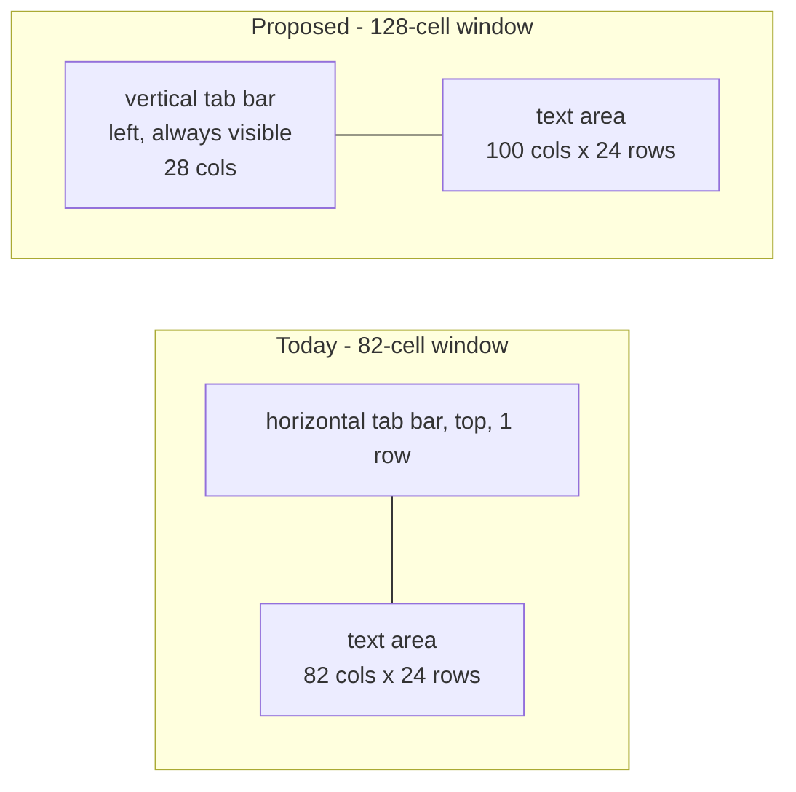
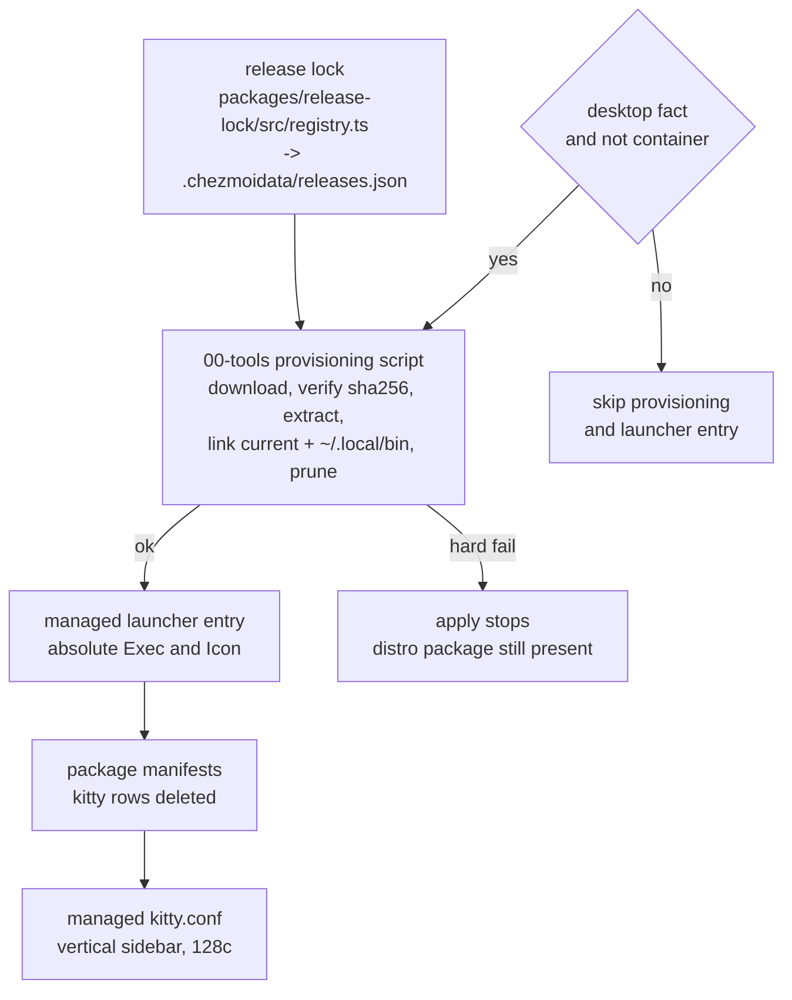

# Kitty Vertical Tab Bar - Plan

## Goal Capsule

- **Objective:** show kitty's tabs as an always-visible vertical sidebar on the left window edge, and provision kitty from its upstream release through the release lock so managed hosts run the version that supports it.
- **Product authority:** direct user request — "kitty 탭을 세로 탭으로 표시하고 싶어", driven by wanting the vertical-tab shape browsers and editors use. The user chose the release-lock lane over waiting for Fedora, picked the left-edge powerline shape from live renders of four candidates, and set the always-visible sidebar and the 128-cell window width.
- **Execution profile:** one new release-lock registry entry with its unit test, one new provisioning script, one new managed launcher entry, three manifest row deletions, and the managed kitty config. Verification is scratch-harness render plus a new `.ci/` test — never a live `chezmoi apply`.
- **Stop conditions:** any need to add a teardown or package-uninstall script (repo policy forbids it); any contradiction with the chrome and font coupling from `docs/plans/2026-07-28-004-feat-kitty-chrome-font-coupling-plan.md`; any need to branch the config per desktop.
- **Tail ownership:** commit, push, PR, and CI watch belong to the shipping tail, not to the implementation units.

---

## Product Contract

**Product Contract preservation:** changed — R2 and R13. Planning found that `.chezmoidata/packages.yaml` carries no package-removal key (`removed:` in `.chezmoidata/system.yaml:111-127` removes `/etc` paths only) and that repo policy forbids adding a teardown script. Both requirements now state the mechanism the repo allows: deleting the manifest rows stops future installs, and uninstalling the already-present package is a documented one-time manual step. The product outcome — one provisioned kitty, one launcher entry — is unchanged.

### Summary

Provision kitty from its upstream release artifact through the release lock, stop installing the distribution package, and configure the tab bar as an always-visible vertical sidebar on the left edge in the existing powerline style. The managed window widens from 82 to 128 cells so the sidebar does not shrink the working text area.

### Problem Frame

kitty is the default terminal on every managed Linux desktop, and its tab bar is fully managed. A vertical tab bar is not a setting the current build has: `tab_bar_edge` accepted only `top` and `bottom` until kitty 0.48, which added `left` and `right`.

The managed hosts cannot reach 0.48 through the distribution lane today. Fedora 44 offers 0.43.1 and 0.47.1; the installed build is 0.47.1. The Fedora update record explains why waiting is not a bounded plan: on the F44/F45 streams kitty went from 0.43.1 (submitted 2025-10-24) straight to 0.47.1 (submitted 2026-05-28), skipping 0.44, 0.45 and 0.46 entirely, and 0.48.0 (upstream 2026-07-18) and 0.48.1 (upstream 2026-07-24) have no submission as of 2026-07-30. A search of Copr surfaced no trustworthy project carrying 0.48.

The old build also makes a config-first attempt actively harmful rather than inert. kitty 0.47.1 resolves an unrecognised `tab_bar_edge` value by falling back to `bottom` with no warning, so shipping the vertical setting ahead of the new build would silently move today's top bar to the bottom edge.

One further cost is invisible in the settings file. kitty derives an `initial_window_width` expressed in cells from the cell size plus margins and padding only; it never adds the tab bar. A vertical bar therefore takes its width out of the text area, unlike the horizontal bar, which costs a single row.

### Key Decisions

- **Provision kitty through the release lock and stop installing the distribution package.** (session-settled: user-directed — chosen over waiting for a Fedora 0.48, a Copr project, or running the upstream build beside the distribution package: the Fedora stream skipped three minor releases and has not submitted 0.48, no trustworthy Copr build exists, and a side-by-side install splits the app-launcher entry from the PATH entry.) The accepted trade-off is that the default terminal leaves the distribution security-update stream; the release lock refreshes hourly, which tracks upstream more closely than the observed distribution cadence.
- **Vertical bar on the left edge, keeping the current powerline style.** (session-settled: user-directed — chosen over the right edge and over a narrowed `fade` sidebar, judged from live renders of four candidates produced by the real 0.48.1 build.)
- **The sidebar stays visible with a single tab.** (session-settled: user-directed — chosen over kitty's default of hiding the bar below two tabs: the sidebar is the feature, so it should not appear only after a second tab opens.)
- **The window grows to 128 cells.** (session-settled: user-directed — chosen over the 110-cell width that reproduces today's 82-column text area: 128 cells yields a measured 100-column text area, widening the working area instead of only preserving it.)
- **The sidebar keeps its default width.** (session-settled: user-directed — chosen over capping titles at 14 cells: the wider sidebar carries more of a tab title, and the width is a one-line adjustment later.)
- **Config and build must arrive together.** The vertical setting is inert-looking but destructive on a build older than 0.48, so the configuration change is only correct on a host already carrying the provisioned build.

### Requirements

**Provisioning**

- R1. kitty is provisioned from its upstream release artifact, with version, per-platform URL and checksum read from the generated release lock.
- R2. The manifests stop installing the distribution kitty package on both the Fedora and Ubuntu targets, and the one-time manual uninstall of an already-present package is documented for the operator. Repo policy forbids a teardown script, and the package manifest has no removal key.
- R3. Provisioning covers Linux x86_64 and Linux arm64, since upstream publishes an artifact for each, and declares kitty unsupported on macOS and Windows.
- R4. The provisioned kitty resolves as `kitty` on `PATH`, because the KDE default-terminal setting and the terminal-provider entry both store the bare command name.
- R5. A release-lock version change is what causes the provisioned build to be replaced, and superseded versions are pruned.
- R6. Provisioning does not run on hosts that have no desktop, and does not run inside containers.
- R7. A failed provisioning run stops the apply rather than continuing, so the manifests never stop installing the distribution package on a host that did not receive the upstream build.

**Tab bar appearance**

- R8. The tab bar renders as a vertical sidebar on the left window edge.
- R9. The sidebar renders when only one tab is open.
- R10. The existing powerline style with slanted separators and the index-prefixed title template are preserved.
- R11. With the sidebar visible at its default width, the default window presents a 100-column by 24-row text area.



**Configuration integrity**

- R12. The vertical tab-bar settings only reach a host whose kitty already supports them, because an older build resolves the unknown edge value to the bottom edge without reporting it.
- R13. Once the operator has completed the documented uninstall, the application launcher lists exactly one kitty entry, and that entry starts the provisioned build.
- R14. Configuration keys renamed in 0.48 are updated, so a kitty start reports no unknown-key warning for managed settings.
- R15. The window-decoration setting and the font coupling to `.chezmoidata/fonts.yaml` are unchanged by this work.

**Desktop integration**

- R16. Default-terminal resolution keeps working through both the `xdg-terminal-exec` provider entry and the KDE default-terminal setting.
- R17. The launcher entry does not register kitty as a MIME handler, so it cannot displace the desktop's directory or text-file openers.

### Acceptance Examples

- AE1. Single tab shows the sidebar.
  - **Covers R9, R11.**
  - **Given** a managed host with the provisioned kitty and exactly one tab open,
  - **When** kitty starts with the managed configuration,
  - **Then** the vertical bar is drawn on the left edge and the text area measures 100 columns by 24 rows.
- AE2. Sidebar width is accounted for in the window width.
  - **Covers R11.**
  - **Given** the sidebar at its default width, which occupies 28 columns,
  - **When** the window width is set to 128 cells,
  - **Then** the text area is 100 columns, not 128.
- AE3. No unknown-key warning.
  - **Covers R14.**
  - **Given** the managed configuration loaded by kitty 0.48 or newer,
  - **When** kitty starts,
  - **Then** it reports no unknown configuration key for any managed setting.
- AE4. One launcher entry after the documented uninstall.
  - **Covers R2, R13.**
  - **Given** a host where provisioning has run and the operator has completed the documented uninstall,
  - **When** the user searches the application launcher for a terminal,
  - **Then** exactly one kitty entry appears and starting it runs the provisioned build.
- AE5. An older build must not receive the vertical setting.
  - **Covers R12.**
  - **Given** a host still running kitty older than 0.48,
  - **When** that build reads `tab_bar_edge left`,
  - **Then** it renders the bar on the bottom edge and reports nothing, which is why the setting must not arrive before the build.
- AE6. Failed provisioning stops the apply.
  - **Covers R7.**
  - **Given** a host where the upstream artifact cannot be downloaded or its checksum does not match,
  - **When** the provisioning script runs,
  - **Then** it exits non-zero and the apply stops before any later phase runs.
- AE7. Non-desktop and container hosts skip provisioning.
  - **Covers R6.**
  - **Given** a host with no desktop fact, or a container,
  - **When** an apply runs,
  - **Then** no kitty bundle is downloaded and no launcher entry is deployed.

### Scope Boundaries

- A Copr or PPA route, and running the upstream build beside the distribution package. Both are rejected: no trustworthy Copr build of 0.48 exists, and a side-by-side install makes the launcher entry and the `PATH` entry different versions.
- Uninstalling the distribution package automatically. Repo policy forbids teardown scripts and the package manifest has no removal key, so this stays a documented one-time operator step.
- `kitty-open.desktop`. Upstream's own note warns it takes over MIME types including `inode/directory`, which would displace the desktop's file manager as the directory opener.
- Tab colour overrides, a custom tab-bar draw function, and tab-bar filtering. The repository manages no kitty palette, so tab colours stay at their defaults.
- Replacing kitty tabs with a tmux or session-manager sidebar.
- Sidebar width tuning through the title-length cap. It stays available as a later one-line adjustment; measured reference: capping titles at 14 cells returns 6 columns to the text area.
- macOS and Windows. The configuration deploys harmlessly with no consumer, following the precedent of the earlier kitty plans; upstream ships no Linux-style bundle for them.

### Dependencies / Assumptions

- The vertical tab bar requires kitty 0.48 or newer. Upstream's newest release is 0.48.1, published 2026-07-24.
- The upstream Linux artifacts for 0.48.1 are `kitty-0.48.1-x86_64.txz` (32,022,592 bytes) and `kitty-0.48.1-arm64.txz` (30,482,416 bytes). Both carry a SHA-256 digest in the release metadata, so the lock refresh records a checksum without downloading the artifact.
- The upstream build runs on this host. The 0.48.1 artifact was extracted to a scratch directory, its checksum matched the published digest, and it rendered the vertical bar under the KDE Wayland session used for the shape decision.
- Every column figure in this contract was measured with that build using the managed configuration, one tab, and the terminal's reported size. The sidebar cost of 28 columns is measured, not the "about twenty title cells" figure from the upstream option documentation, which counts title cells only.
- The archive members are rooted at `bin/`, `lib/` and `share/` with no wrapping directory, so it extracts into a version directory directly.
- The renamed key is `strip_trailing_space`, now `strip_trailing_spaces`; its accepted values are unchanged, so the managed value stays valid.
- The bundle carries its own terminfo and shell integration, and kitty exports `TERMINFO` for its children, so removing the distribution package does not strand local `xterm-kitty` consumers. Anything outside kitty that reads the system terminfo entry is out of scope for this work.
- A future Fedora 0.48 does not invalidate this work; the decision to keep a single provisioned kitty stands regardless.

---

## Planning Contract

### Key Technical Decisions

- KTD-1. **Register kitty as a `githubRelease` entry in `packages/release-lock/src/registry.ts`.** The asset selector maps `amd64` to `x86_64` and `arm64` to `arm64`, and strips the tag's leading `v` with the existing `versionFromTag` helper because the artifact embeds the bare version (`v0.48.1` → `kitty-0.48.1-x86_64.txz`). The existing `bufArch` helper is not reusable: it spells Linux arm64 as `aarch64`. Returning `null` for macOS and Windows follows the `pi` and `omp` convention (`packages/release-lock/src/registry.ts:196-218`).
- KTD-2. **Provision with a `run_onchange_before_` script under `.chezmoiscripts/00-tools/`, not a chezmoi external.** `.chezmoiexternals/system.toml:61-79` records that an archive external forces chezmoi to extract the whole archive to enumerate entries even during an unrelated externals apply; a 32 MB bundle makes that cost concrete. `00-tools` is also the documented home for linking and pruning versioned CLIs. The `before_` phase is load-bearing rather than cosmetic: the distro package installers are `run_onchange_before_fedora.sh` and `run_onchange_before_ubuntu.sh`, and chezmoi's phase outranks the directory number, so an `after_` script would run only once those installers had already finished without installing kitty — exactly the fresh-host no-terminal state R7 forbids. Same phase puts `00-tools` ahead of them by path order.
- KTD-3. **Install to `~/.local/share/kitty/versions/<version>` with a `current` symlink and `~/.local/bin` links.** This mirrors the existing versioned-payload lane (`.chezmoiscripts/00-tools/run_onchange_after_codegraph.sh.tmpl:12-29`, `run_onchange_after_codex.sh.tmpl:20-38`) rather than upstream's `~/.local/kitty.app` suggestion, so version swaps are atomic and old versions prune. The prune loop must skip symlinks, per the codex script's comment.
- KTD-4. **The rendered release-lock version is the onchange trigger.** Interpolating the version into the script text makes an unchanged version render byte-identically, so chezmoi never invokes the script — the same mechanism `run_onchange_after_build-open-design.sh.tmpl:2` uses. No in-script version comparison is needed to decide whether to run.
- KTD-5. **Provisioning hard-fails.** It follows the open-design `fail()` style, not the figma-auth soft-skip style. A soft skip would let the apply continue to the phase that stops installing the distribution package, which is exactly the state R7 forbids.
- KTD-6. **Both host gates live in `.chezmoiignore`, not in script logic.** One gated block skips the provisioner and the launcher entry on non-Linux hosts and on Linux hosts with no KDE or GNOME desktop fact; the container block skips the same two paths. No in-script `fact_gate()` call is needed, which keeps the gate in one place instead of two. The container block wildcards `20-linux-fedora`, `40-linux-ubuntu` and `50-linux-*` but not `00-tools`, so this provisioner needs explicit entries. Repo policy requires container skips to live in that block, never in script logic, and this follows the open-design precedent, which gates its provisioner and launcher the same way.
- KTD-7. **The launcher entry is a managed template with absolute `Exec` and `Icon` paths.** This follows `dot_local/share/applications/winbox.desktop.tmpl`, which interpolates `{{ .chezmoi.homeDir }}`. Bare names would break once the distribution package no longer supplies an icon-theme icon. The existing provider entry at `dot_local/share/xdg-terminals/kitty.desktop` keeps its bare `Exec=kitty` because the `~/.local/bin` link satisfies it.
- KTD-8. **Stopping installation is a manifest deletion plus documented manual uninstall.** `.chezmoidata/packages.yaml` has no removal key, and repo policy forbids adding a teardown script. The three `kitty` rows are deleted and a comment records the one-time operator command; `xdg-terminal-exec` rows stay because the provider entry still needs that resolver.
- KTD-9. **Config changes land in the same commit as provisioning, with no version conditional.** kitty offers no version guard in its config syntax, and a render-time probe of the installed binary would be a runtime-tool fact, which repo policy rejects. Ordering inside one apply is the guard: `00-tools` installs 0.48 before anything reads the config.

### Assumptions

- The `vp run -r test` lane in the `ts-workspace` CI job covers the new registry test; no new workflow job is needed for it.
- `registry.test.ts` enforces platform parity against the spec's target platforms, so the kitty expectation table must list all six OS-arch keys with explicit nulls for macOS and Windows.
- The provisioning script runs under `bash` and must pass the repository's shellcheck gate in `render-dotfiles.yml`.

### High-Level Technical Design

Ordering is the safety property. Provisioning sits in an earlier numbered phase than the package manifests, and it hard-fails, so a host can never reach "manifest no longer installs kitty" without already carrying the upstream build.



---

## Implementation Units

### U1. Register kitty in the release lock

- **Goal:** the lock carries a kitty version with per-platform URL and checksum for both Linux architectures.
- **Requirements:** R1, R3; KTD-1
- **Dependencies:** none
- **Files:** `packages/release-lock/src/registry.ts`, `packages/release-lock/test/registry.test.ts`
- **Approach:** add a `kitty` entry with `kind: "githubRelease"` and `source: "kovidgoyal/kitty"`. The asset selector returns `null` for `darwin` and `windows`, and otherwise builds `kitty-<version>-<arch>.txz` where `<version>` is the tag without its leading `v` and `<arch>` is `x86_64` for `amd64` and `arm64` for `arm64`. Do not declare `emulatedPlatforms`: upstream publishes a real build for both Linux architectures. Do not reuse `bufArch`.
- **Patterns to follow:** the `pi` and `omp` entries for null-returning selectors (`packages/release-lock/src/registry.ts:196-218`); the `buf` entry for an os-and-arch-varying selector (`:50-54`); the `EXPECTED`-table-plus-loop shape in `packages/release-lock/test/registry.test.ts`.
- **Test scenarios:**
  1. `linux-amd64` selects `kitty-0.48.1-x86_64.txz` for tag `v0.48.1`.
  2. `linux-arm64` selects `kitty-0.48.1-arm64.txz` for the same tag.
  3. `darwin-amd64`, `darwin-arm64`, `windows-amd64` and `windows-arm64` each select `null`.
  4. The expectation table satisfies the file's existing platform-parity guard — all six keys present.
- **Verification:** `vp run -r test` inside `packages/` passes, and the kitty rows appear in the regenerated lock when the refresh workflow runs.

### U2. Provision the upstream bundle

- **Goal:** a desktop host installs the locked kitty version under `~/.local/share/kitty`, exposes `kitty` and `kitten` on `PATH`, and prunes superseded versions.
- **Requirements:** R1, R3, R4, R5, R6, R7; KTD-2, KTD-3, KTD-4, KTD-5, KTD-6
- **Dependencies:** U1
- **Files:** `.chezmoiscripts/00-tools/run_onchange_before_kitty.sh.tmpl`, `.chezmoiignore`
- **Approach:** resolve the version, artifact URL and SHA-256 through `.chezmoitemplates/release-lock-ref.tmpl` with `platform "auto"`, and interpolate all three into the script body so they are the onchange trigger. Keep the `{{ if eq .chezmoi.os "linux" }}` render guard so the lock lookup never runs for a platform the lock does not carry. Host gating is the `.chezmoiignore` entries from KTD-6, not in-script logic. Download to a scratch path under `XDG_RUNTIME_DIR`, verify the checksum before extracting, extract into a staging directory, then move it into a fresh version directory, flip `current`, and refresh the two `~/.local/bin` links. Prune superseded versions, skipping symlinks, and keep the tree that was live before this run for one more generation because a running kitty lazily loads files from its own tree.
- **Patterns to follow:** `.chezmoiscripts/00-tools/run_onchange_after_codegraph.sh.tmpl:12-29` for the versions/current/bin/prune shape; `run_onchange_after_codex.sh.tmpl:20-38` for the symlink-safe prune; `.chezmoiscripts/60-build/run_onchange_after_build-open-design.sh.tmpl` for the `fail()` style and the fingerprint comment position.
- **Execution note:** this is packaging work; prefer a render check plus the `.ci/` harness in U6 over unit coverage.
- **Test scenarios:**
  1. Rendering the template through the scratch harness emits the locked version, both artifact URL and checksum, and no unresolved template markers.
  2. The rendered script contains a checksum verification step that precedes extraction.
  3. The rendered script's prune loop skips symlinks so `current` survives.
  4. `.chezmoiignore` skips this script inside a container.
  5. Rendering for a non-desktop fact set produces a script that exits before downloading.
- **Verification:** the U6 harness asserts the rendered script's ordering and gating; shellcheck passes in `render-dotfiles.yml`.

### U3. Ship one managed launcher entry

- **Goal:** the application launcher gets a kitty entry that points at the provisioned bundle and registers no MIME types.
- **Requirements:** R13, R16, R17; KTD-7
- **Dependencies:** U2
- **Files:** `dot_local/share/applications/kitty.desktop.tmpl`, `.chezmoiignore`
- **Approach:** mirror `dot_local/share/applications/winbox.desktop.tmpl`: absolute `Exec` and `Icon` interpolated from `{{ .chezmoi.homeDir }}` into the `current` symlink path, so the entry survives version changes. Set the terminal-appropriate categories and omit every `MimeType` key. Add per-line `.chezmoiignore` entries so the file is skipped on non-Linux and on Linux hosts with no KDE or GNOME desktop fact, following the open-design precedent. Leave `dot_local/share/xdg-terminals/kitty.desktop` unchanged; its bare `Exec=kitty` resolves through the new `PATH` link.
- **Patterns to follow:** `dot_local/share/applications/winbox.desktop.tmpl`; the per-line desktop-gated ignore block already used for `.local/share/applications/open-design.desktop`.
- **Test scenarios:**
  1. The rendered entry's `Exec` and `Icon` are absolute paths under the home directory with no unresolved markers.
  2. The rendered entry declares no `MimeType` key.
  3. The archive target tree omits the entry for a non-desktop fact set and includes it for a KDE fact set.
- **Verification:** covered by the U6 harness render and archive assertions.

### U4. Stop installing the distribution package

- **Goal:** the manifests no longer install distribution kitty, and the operator has the one-time uninstall recorded next to the change.
- **Requirements:** R2; KTD-8
- **Dependencies:** U2, U3
- **Files:** `.chezmoidata/packages.yaml`
- **Approach:** delete the `kitty` row from the Fedora KDE group, the Fedora GNOME group and the Ubuntu GNOME group. Keep every `xdg-terminal-exec` row: the provider entry still needs that resolver. Replace each deleted row with a short comment stating that kitty is provisioned by the `00-tools` script and naming the one-time manual uninstall the operator runs on hosts that already carry the distribution package. Add no uninstall script.
- **Patterns to follow:** the existing gate comments above each `*Packages:` group in `.chezmoidata/packages.yaml:344-368` and `:679-687`.
- **Test scenarios:**
  1. No `*Packages:` group in the file lists `kitty`.
  2. All three `xdg-terminal-exec` rows remain.
  3. Rendering the Fedora and Ubuntu package installers produces no `kitty` in their install lists.
- **Verification:** the U6 harness greps the rendered installer scripts; the diff shows three deletions plus comments and no new script.

### U5. Set the vertical tab bar in the managed config

- **Goal:** the managed kitty config renders the always-visible left sidebar, the widened window, and the renamed key.
- **Requirements:** R8, R9, R10, R11, R12, R14, R15; KTD-9
- **Dependencies:** U2
- **Files:** `dot_config/kitty/kitty.conf.tmpl`
- **Approach:** change `tab_bar_edge` from `top` to `left`, add `tab_bar_min_tabs 1`, change `initial_window_width` from `82c` to `128c`, and rename `strip_trailing_space` to `strip_trailing_spaces` with its value unchanged. Leave `tab_bar_style`, `tab_powerline_style`, `tab_title_template`, `tab_switch_strategy`, the key bindings, the chrome line and the two font lines untouched. Follow the file's comment convention: each changed directive states the reason and the upstream default it reverses, and the width comment records that the sidebar occupies 28 columns so 128 cells yields a 100-column text area.
- **Patterns to follow:** the existing `# --- tab bar ---` and `# --- window ---` comment style in `dot_config/kitty/kitty.conf.tmpl`.
- **Test scenarios:**
  1. The rendered config contains `tab_bar_edge left`, `tab_bar_min_tabs 1`, `initial_window_width 128c` and `strip_trailing_spaces smart`.
  2. The rendered config contains no `strip_trailing_space ` occurrence without the plural suffix, and no `tab_bar_edge top`.
  3. The chrome line and both font lines are byte-identical to the pre-change render.
- **Verification:** covered by the U6 harness; the live appearance check is the operator's residual step after the next real apply.

### U6. Add the provisioning and config CI test

- **Goal:** one `.ci/` script proves the render-level contract of U2 through U5 without deploying anything.
- **Requirements:** R2, R6, R7, R11, R13, R14, R17
- **Dependencies:** U2, U3, U4, U5
- **Files:** `.ci/test-kitty-provisioning.sh`, `.github/workflows/ci.yml`
- **Approach:** follow the repository's `.ci/` conventions: derive `repo_root` from `BASH_SOURCE`, create a scratch directory under `RUNNER_TEMP` or `XDG_RUNTIME_DIR` with a cleanup trap, write an empty config, stub `op`, and render through `chezmoi execute-template` with `--source "$repo_root"`. Assert the U2, U3, U4 and U5 scenarios with a `fail()`/`has()` helper pair. Render the provisioning script for both a desktop fact set and a non-desktop fact set to prove the gate. State in the header that the script never runs `chezmoi apply`, never downloads the bundle, and never launches kitty. Add a matching `ci.yml` job that checks out, installs chezmoi, and runs the script.
- **Patterns to follow:** `.ci/test-cli-proxy-api-integration.sh:13-46` for scratch isolation, stubbing and assertion helpers; the `codex-wrapper` job in `.github/workflows/ci.yml` for the job shape.
- **Test scenarios:**
  1. The script exits zero on the current tree.
  2. Perturbing any asserted string in a scratch copy makes it exit non-zero, so the assertions bite.
- **Verification:** the script passes locally and its new CI job passes on push.

---

## Verification Contract

Per `AGENTS.md`: per-user scratch directory, stub `op`, empty config, throwaway destination, `--source "$PWD"`. Never a live `chezmoi apply`, never a real bundle download, never a kitty launch.

```sh
scratch="$HOME/.cache/agent-scratch/chezmoi-op-stub"
mkdir -p "$scratch/bin" "$scratch/target"
: > "$scratch/empty.toml"
printf '#!/usr/bin/env bash\ncase "${1-}" in whoami) printf dummy@example.invalid;; *) printf dummy-secret;; esac\n' > "$scratch/bin/op"
chmod 700 "$scratch/bin/op"
render() {
  env PATH="$scratch/bin:$PATH" chezmoi --config "$scratch/empty.toml" \
    --source "$PWD" --destination "$scratch/target" execute-template
}
render < dot_config/kitty/kitty.conf.tmpl
render < .chezmoiscripts/00-tools/run_onchange_before_kitty.sh.tmpl
render < dot_local/share/applications/kitty.desktop.tmpl
chezmoi --config "$scratch/empty.toml" --source "$PWD" --destination "$scratch/target" \
  archive --exclude=encrypted,externals,scripts
```

| Gate | Applies to | Done signal |
|---|---|---|
| `.ci/test-kitty-provisioning.sh` | U2–U5 | exits zero; assertions bite when perturbed |
| `vp run -r test` in `packages/` | U1 | registry test passes, platform parity guard satisfied |
| Scratch render of all three templates | U2, U3, U5 | no unresolved `{{`; asserted strings present |
| `chezmoi archive` target tree | U3, U5 | deploys `.config/kitty/kitty.conf` and the launcher entry |
| `git diff --check`, `git status` | all | diff limited to the files named in the units plus this plan |
| `render-dotfiles.yml`, `ci.yml` | all | terminal success on push, shellcheck included |

- **Behaviour-change signal:** provisioning and configuration change; there is no unit-test layer for chezmoi data, so the bar is the new `.ci/` script plus the release-lock unit test. Tests added: `packages/release-lock/test/registry.test.ts` cases and `.ci/test-kitty-provisioning.sh`.
- **Residual operator steps, documented not automated:** the one-time distribution-package uninstall, and the live appearance check that the sidebar renders on the left with a 100-column text area after the next real apply.

---

## Definition of Done

- The release lock carries kitty for `linux-amd64` and `linux-arm64`, with `null` selectors for macOS and Windows, and its registry test passes.
- `.chezmoiscripts/00-tools/run_onchange_before_kitty.sh.tmpl` verifies the checksum before extracting, links `current` and the two `~/.local/bin` entries, prunes superseded versions while skipping symlinks and keeping one prior generation, hard-fails on every error path, and is skipped by `.chezmoiignore` on non-Linux hosts, on Linux hosts without a KDE or GNOME desktop fact, and in containers.
- `dot_local/share/applications/kitty.desktop.tmpl` deploys one launcher entry with absolute `Exec` and `Icon` and no `MimeType` key.
- `.chezmoidata/packages.yaml` no longer installs kitty on any target, retains `xdg-terminal-exec`, and records the one-time manual uninstall. No teardown script exists.
- `dot_config/kitty/kitty.conf.tmpl` carries `tab_bar_edge left`, `tab_bar_min_tabs 1`, `initial_window_width 128c` and `strip_trailing_spaces`, with the chrome and font lines byte-identical.
- `.ci/test-kitty-provisioning.sh` and its CI job pass; `render-dotfiles.yml` and `ci.yml` are green on push.
- `git diff --check` is clean and the diff is limited to the files named above plus this plan.

---

## Sources & Research

- `dot_config/kitty/kitty.conf.tmpl` — the managed configuration this work changes: top edge, powerline with slanted separators, index-prefixed titles, 82-cell initial width, and the key 0.48 renamed.
- `docs/plans/2026-07-28-005-feat-kitty-tab-bar-customization-plan.md`, `docs/plans/2026-07-28-004-feat-kitty-chrome-font-coupling-plan.md` — the tab-bar and chrome/font state this work preserves.
- `.chezmoidata/packages.yaml:344-368`, `:679-687` — the three desktop-gated groups that install kitty and `xdg-terminal-exec`; `:125-126` is the Copr list shape behind the rejected Copr route.
- `.chezmoidata/system.yaml:111-127` and `.chezmoiscripts/30-linux/run_onchange_after_install-system-10-files.sh.tmpl:242-270` — the repository's only `removed:` mechanism; it deletes `/etc` paths, which is why package removal cannot reuse it.
- `packages/release-lock/src/types.ts:59-73,88-125` — `ResolverKind`, `AssetSelector` returning `string | null`, and the `ToolSpec` fields. `packages/release-lock/src/platforms.ts:9-27` — platform keys are `<os>-<arch>` with `amd64`/`arm64`. `packages/release-lock/src/registry.ts:24-54,196-218` — helper functions, the `buf` selector, and the null-returning `pi`/`omp` convention. `packages/release-lock/test/registry.test.ts` — the expectation table and platform-parity guard.
- `.chezmoitemplates/release-lock-ref.tmpl:1-24` — the sole consumer entry point and its `platform "auto"` behaviour.
- `.chezmoiexternals/system.toml:61-79,92-98` — why a GUI payload avoids a whole-archive external.
- `.chezmoiscripts/00-tools/run_onchange_after_codegraph.sh.tmpl:12-29`, `run_onchange_after_codex.sh.tmpl:20-38` — the versions/current/bin/prune lane and the symlink-safe prune.
- `.chezmoiscripts/60-build/run_onchange_after_build-open-design.sh.tmpl:1-8` — version-as-onchange-trigger and the `fail()` style; `run_onchange_after_build-figma-auth.sh.tmpl:1-19` — the soft-skip style this work deliberately does not use.
- `.chezmoitemplates/fingerprint.tmpl:16-21` — the fingerprint contract this script does not need, because the rendered lock values are its trigger. `.chezmoiignore`'s existing open-design blocks — the precedent for gating a provisioner and its launcher entry purely by ignore rules.
- `dot_local/share/applications/winbox.desktop.tmpl` — the managed launcher precedent with absolute `Exec`/`Icon`. `dot_local/share/xdg-terminals/kitty.desktop` — the provider entry that keeps its bare `Exec=kitty`. `.chezmoidata/kde.yaml:183-190` — the KDE default-terminal row that resolves the bare command name.
- `.chezmoiignore` — the container-fact block wildcards `20-linux-fedora`, `40-linux-ubuntu` and `50-linux-*` but not `00-tools`, so the new script needs its own skip line.
- `.ci/test-cli-proxy-api-integration.sh:13-46` and the `codex-wrapper` job in `.github/workflows/ci.yml` — the `.ci/` harness and CI job shape; `ts-workspace` runs the release-lock tests via `vp run -r test`.
- [kitty changelog](https://sw.kovidgoyal.net/kitty/changelog/) — vertical tab bars arrived in 0.48. [kitty option definitions](https://github.com/kovidgoyal/kitty/blob/master/kitty/options/definition.py) — `tab_bar_edge` accepting `left`/`right`, the sidebar-width note on the title-length cap, and the renamed trailing-space key. [kitty tab bar implementation](https://github.com/kovidgoyal/kitty/blob/master/kitty/tab_bar.py) — vertical layout draws one tab per row and marks overflow with an ellipsis. [kitty binary install docs](https://sw.kovidgoyal.net/kitty/binary/) — the bundle's `bin`/`share` layout, the documented `PATH` symlinks and desktop-entry patching, and the warning that `kitty-open.desktop` captures `inode/directory`.
- Fedora update record for kitty on the F44 and F45 streams — 0.43.1 submitted 2025-10-24, 0.47.1 submitted 2026-05-28, no 0.48 submission as of 2026-07-30.
