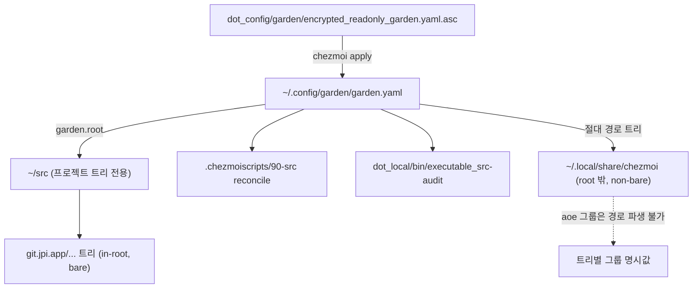
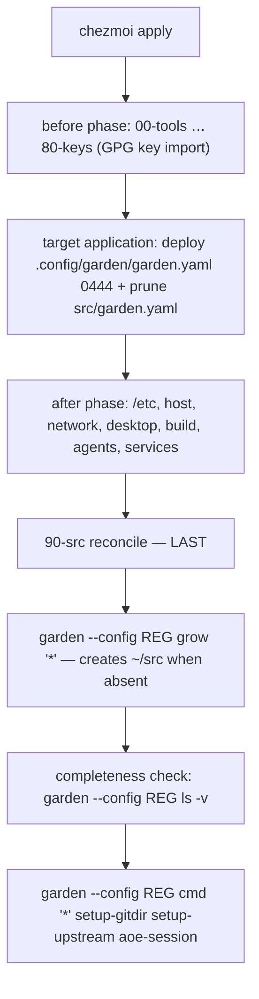

# Garden Registry Relocation and Dotfiles Tree Registration - Plan

## Goal Capsule

- **Objective:** garden 레지스트리를 `~/.config/garden/garden.yaml`로 옮겨 `~/src`를 프로젝트 트리 전용 루트로 만들고, chezmoi 체크아웃을 제자리에서 garden 트리로 등록해 `github.com/hyperlapse122/dotfiles` 정체성(감사 대상 + aoe 그룹)을 부여한다.
- **Product authority:** 이 플랜은 레지스트리 위치와 dotfiles 등록만 소유한다. chezmoi 소스 경로 이전은 명시적 비목표이며, `~/.local/share/chezmoi`는 고정이다.
- **Authority hierarchy:** 리포지토리 규칙(`AGENTS.md`) > 이 플랜의 Product Contract > Planning Contract > 구현자 재량.
- **Execution profile:** 셸·chezmoi 소스 상태 변경이므로 이 리포에는 단위 테스트 스위트가 없다. 검증은 `chezmoi execute-template` 렌더, 스텁 기반 스탠자 하니스, 복호화 라운드트립 diff로 하고, 라이브 `chezmoi apply`는 유지관리자 호스트 한 곳으로 제한한다.
- **Stop conditions:** chezmoi 소스 경로를 옮기려는 순간, dotfiles를 `.bare`로 전환하려는 순간, `garden prune --rm`이나 워크트리 수동 제거가 필요해지는 순간 멈추고 사용자에게 확인한다.
- **Tail ownership:** U6(기존 세션 그룹 정렬)과 라이브 apply는 병합 후 유지관리자 호스트에서 수행한다. CI는 이 둘을 실행하지 않는다.
- **Open blockers:** 없음.
- **Product Contract preservation:** 변경됨 — (1) `Outstanding Questions`(Deferred 4건) 섹션 삭제. 네 항목 모두 KTD4·KTD6·KTD7과 U3에서 해소되었고, 해소 레이어를 덧쌓지 않기 위해 원문을 제거했다. (2) `Scope Boundaries`에 `Deferred to Follow-Up Work` 항목 추가 — 심화 과정에서 나온 인접 작업을 활성 요구사항으로 승격하지 않기 위한 분리다. R/F/AE 본문과 ID는 무변경.

---

## Product Contract

### Summary

garden 레지스트리를 `~/.config/garden/garden.yaml`로 옮겨 `~/src`에는 프로젝트 트리만 남긴다. chezmoi 체크아웃은 `~/.local/share/chezmoi`에 그대로 두고 레지스트리에 root-외부 non-bare 트리로 선언해, aoe 그룹과 `src-audit` 감사를 `github.com/hyperlapse122/dotfiles` 이름으로 받게 한다.

### Problem Frame

`~/src`는 프로젝트 트리의 루트이면서 동시에 자기 자신의 레지스트리 파일을 담고 있다. 그리고 이 환경에서 가장 자주 작업하는 저장소인 dotfiles만 그 체계 밖에 있다. 체크아웃은 `~/.local/share/chezmoi`에 있어 `src-audit`의 `$HOME/src` 스캔에 걸리지 않고, aoe 그룹은 다른 프로젝트가 따르는 `<host>/<group>/<project>` 규칙 대신 `personal/chezmoi`다.

문서는 이 상태를 예외로 명시해 두었다. 그러나 레지스트리에 없는 예외는 관리되지 않는 예외다. 감사도, 그룹 정책 자기치유도, 선언된 트리라면 자동으로 받는 것들이 dotfiles에는 적용되지 않는다.

구체적인 사고가 발생한 적은 없다. 비용은 사고가 아니라 규칙이 두 개라는 것이며, 그래서 이 작업의 성공 기준은 기능 추가가 아니라 규칙 수의 감소다.

### Key Decisions

- **레지스트리는 `~/.config/garden/garden.yaml`에 둔다.** (session-settled: user-directed — chosen over `~/garden.yaml`: garden은 XDG 설정 경로를 cwd와 무관하게 탐색하므로 소비자에서 `--chdir ~/src`가 필요 없어진다. `~/garden.yaml`도 상향 탐색으로 발견되지만 `${GARDEN_CONFIG_DIR}`가 `~`가 되고 홈 루트에 파일이 하나 늘어난다.)
- **dotfiles는 이동하지 않고 제자리에서 등록한다.** (session-settled: user-directed — chosen over `.bare` + aoe 워크트리 완전 이관, 그리고 심볼릭 링크: 재클론·세션 재생성 없이 레지스트리·감사·그룹 정책만 확보한다. 심볼릭 링크는 링크로 가린 새 예외가 되어 목적과 어긋난다.)
- **chezmoi 소스 경로는 `~/.local/share/chezmoi`를 유지한다.** (session-settled: user-directed — chosen over sourceDir 재지정: `.chezmoi.toml.tmpl`의 홈 상대 hook 경로와 이를 미러링하는 CI fakehome이 그대로 유지되므로, 변경 표면이 레지스트리와 매니페스트로 한정된다.)
- **매니페스트가 `garden.root`를 `${HOME}/src`로 명시한다.** XDG 경로로 탐색되면 `GARDEN_ROOT`가 기본적으로 설정 디렉터리(`~/.config/garden`)로 잡힌다. 현재 매니페스트의 `${GARDEN_CONFIG_DIR}` 표현을 그대로 옮기면 모든 트리 경로가 조용히 잘못된 루트 아래로 이동한다.
- **aoe 그룹은 트리별 명시값을 우선하고, 경로 파생을 기본값으로 남긴다.** root 밖 트리에서는 경로 파생이 절대 경로를 그룹으로 내놓는다. URL에서 그룹을 파생하는 대안은 기존 트리들의 그룹을 바꿔버린다 — 디스크 경로와 원격 네임스페이스가 의도적으로 다른 트리가 이미 여러 개 있다.
- **문서의 예외 규정은 삭제가 아니라 재작성이다.** dotfiles는 등록 후에도 `~/src` 밖에 있으므로 여전히 예외다. 달라지는 것은 관리되지 않는 예외에서 선언된 root-외부 트리가 된다는 점이다. 아울러 non-bare 규정("aoe 워크트리로 개발하지 않는 의존성만")이 dotfiles와 정면으로 충돌하므로 그 규정도 함께 넓혀야 한다.
- **기존 워크트리 세션의 그룹은 일회성 수동 재지정으로 처리한다.** 매니페스트의 `aoe-session`은 트리 자신의 세션 경로만 생성·자기치유하므로, 같은 저장소의 형제 워크트리 세션은 손대지 않는다. 통일이 목적이므로 남은 세션도 같은 그룹으로 맞추되, 스크립트에 형제 세션 순회를 추가하지는 않는다.

### Registry and Consumers

### Requirements

**레지스트리 이전**

- R1. 레지스트리 소스가 `dot_config/garden/` 아래로 이동하고 `~/.config/garden/garden.yaml`에 배포된다.
- R2. 매니페스트가 garden 루트를 `~/src`로 명시적으로 선언한다.
- R3. 구 타깃 `~/src/garden.yaml`이 적용 시 제거된다. 소스 삭제만으로는 0444 파일이 남는다.
- R4. Windows와 컨테이너 스킵이 새 타깃 경로를 가리킨다.
- R5. 적용 후 `~/src`에는 chezmoi가 관리하는 파일이 남지 않는다.

**dotfiles 트리 등록**

- R6. 매니페스트가 `~/.local/share/chezmoi`를 non-bare 트리로 선언한다.
- R7. 그 트리의 aoe 그룹이 `github.com/hyperlapse122/dotfiles`로 해석된다.
- R8. 그룹 명시값이 없는 트리는 기존 경로 파생 그룹을 그대로 유지한다.
- R9. `setup-gitdir`와 `setup-upstream`은 이 트리를 계속 스킵한다.
- R10. 반복 적용이 이 트리의 aoe 세션을 중복 생성하지 않는다.
- R11. 이 호스트의 기존 dotfiles 워크트리 세션이 트리의 그룹과 같은 값으로 정렬된다.

**소비자**

- R12. reconcile 스크립트가 새 레지스트리 경로를 전제로 동작한다.
- R13. reconcile 스크립트가 `~/src` 부재를 이유로 실패하지 않는다.
- R14. reconcile 스크립트의 재실행 fingerprint가 새 레지스트리 소스 경로를 해시한다.
- R15. `src-audit`가 새 레지스트리 경로를 읽는다.
- R16. `src-audit`가 root-외부 dotfiles 트리를 broken이나 unmanaged로 보고하지 않는다.

**문서와 규칙**

- R17. 예외 규정이 "관리되지 않는 평지 체크아웃"에서 "선언된 root-외부 트리"로 재작성되고, non-bare 규정이 aoe 워크트리로 개발되는 트리를 허용하도록 넓혀진다.
- R18. 단일 출처 표와 매니페스트 편집 절차의 경로가 갱신된다.
- R19. 매니페스트 자체의 헤더 주석이 새 위치·새 루트·새 트리 형태를 반영한다.

### Key Flows

- F1. 매니페스트 변경 후 적용
  - **Trigger:** 레지스트리 소스가 변경된 상태에서 `chezmoi apply`.
  - **Steps:** 새 타깃에 레지스트리 배포 → 구 타깃 제거 → reconcile이 선언된 트리 전부를 grow → 세 부트스트랩 명령 실행 → dotfiles 트리는 gitdir/upstream을 스킵하고 세션 그룹만 정렬.
  - **Outcome:** dotfiles가 감사·그룹 정책 대상이 되고, `~/src`에는 트리만 남는다.
  - **Covered by:** R1, R3, R7, R9, R10, R12, R14
- F2. 이 호스트 일회성 정렬
  - **Trigger:** F1이 성공한 직후, 한 번만.
  - **Steps:** 트리 자신의 세션은 reconcile이 정렬 → 남은 dotfiles 워크트리 세션의 그룹을 aoe 메타데이터 연산으로 같은 값으로 이동.
  - **Outcome:** dotfiles 관련 세션이 한 그룹 아래 모인다.
  - **Covered by:** R11

### Acceptance Examples

- AE1. root-외부 트리의 그룹 해석
  - **Covers R7.**
  - **Given** dotfiles 트리 경로가 garden 루트 밖에 있고 그룹 명시값이 선언되어 있다.
  - **When** 세션 부트스트랩 명령이 실행된다.
  - **Then** 그룹은 `github.com/hyperlapse122/dotfiles`이고, 절대 파일시스템 경로가 아니다.
- AE2. 명시값 없는 in-root 트리
  - **Covers R8.**
  - **Given** 기존 in-root 트리에 그룹 명시값이 없다.
  - **When** 같은 명령이 실행된다.
  - **Then** 그룹은 종전과 동일한 루트 상대 경로이며 재지정이 발생하지 않는다.
- AE3. garden 변수와 셸 기본값 혼용
  - **Covers R7, R8.**
  - **Given** 그룹 명시값을 셸 기본값 확장 한 줄로 읽으려 한다.
  - **When** garden이 명령 본문의 중괄호 표현을 먼저 치환한다.
  - **Then** 값이 조용히 비어 그룹이 빈 문자열이 된다. 따라서 명시값 읽기와 기본값 적용은 분리된 두 단계여야 한다.
- AE4. `~/src` 부재 상태의 적용
  - **Covers R5, R13.**
  - **Given** 레지스트리가 새 위치에 있고 `~/src`가 아직 없다.
  - **When** `chezmoi apply`가 실행된다.
  - **Then** reconcile이 실패하지 않고 트리를 grow하며 루트를 만든다.
- AE5. 재적용 멱등성
  - **Covers R10, R16.**
  - **Given** F1과 F2가 이미 한 번 완료되었다.
  - **When** `chezmoi apply`와 `src-audit`를 다시 실행한다.
  - **Then** 세션이 새로 생기지 않고, 감사 결과에 dotfiles 관련 broken·unmanaged 항목이 없다.

### Scope Boundaries

- chezmoi 소스 경로 관련 일체 — `sourceDir` 재지정, hook 경로, 이를 미러링하는 CI 준비 단계.
- dotfiles의 `.bare` 전환과 워크트리 이관.
- 새 호스트 부트스트랩 절차의 재설계.
- dotfiles 외 다른 트리의 그룹 정책 변경.
- garden의 파괴적 정리 명령 사용.
- 매니페스트에 형제 워크트리 세션 순회 로직 추가.

**Deferred to Follow-Up Work**

- 실제 설치된 garden 바이너리로 트리 변수 확장을 확인하는 카나리. 릴리스 락의 garden 항목이 바뀔 때만 돌리면 되고, 이 플랜의 CI 하니스는 스텁을 쓰므로 실제 바이너리 회귀를 볼 수 없다. Risk-2가 근거다. 이번 변경의 정합성에는 필요하지 않으므로 별도 작업으로 분리한다.
- `src-audit`가 `garden`에서 루트를 읽어 자기 상수와 대조하는 코드 수준 검증. System-Wide Impact의 경계 A가 근거다. 이번 범위에서는 주석으로 불변식을 선언하는 것까지만 한다.

### Dependencies / Assumptions

- garden 2.6.1의 다음 동작에 의존한다. 모두 이 브레인스토밍에서 직접 확인했다.
  - XDG 설정 경로의 매니페스트를 cwd와 무관하게 탐색한다.
  - `GARDEN_CONFIG_DIR`는 탐색용 환경 변수가 아니라 매니페스트 안에서 쓰는 내부 변수다.
  - 루트가 명시되지 않으면 설정 디렉터리가 루트가 된다.
  - 루트 값은 `${HOME}` 확장, `~` 확장, 절대 경로를 모두 받는다.
  - 트리 경로로 루트 밖 절대 경로를 받으며, 기존 체크아웃을 grown으로 인식한다.
  - 트리별 변수를 명령 본문에 노출하고, 선언되지 않은 변수는 빈 값으로 치환한다.
- chezmoi의 적용 순서도 직접 확인했다. 격리된 소스·destination에 프룬 대상과 배포 대상, 그리고 관측용 after-스크립트를 두고 적용한 결과, after-스크립트 시점에 구 타깃은 이미 제거되어 있고 새 타깃은 이미 배포되어 있었다. KTD6이 이 순서에 기댄다.
- garden 바이너리는 생성된 릴리스 락을 통해 최신 릴리스로 떠오른다. 위 동작은 버전 고정이 아니라 관측에 기댄다. Risk-2 참조.
- GPG 복호화 경로와 컨테이너·Windows 스킵 메커니즘은 그대로 유지된다.
- aoe의 그룹 이동은 메타데이터 연산이며 워크트리를 건드리지 않는다.
- 이 호스트의 dotfiles 워크트리는 모두 clean하고 stash가 없으므로, 세션 정렬이 작업 손실 위험을 만들지 않는다.

### Sources / Research

- `.chezmoiscripts/90-src/run_onchange_after_reconcile-garden.sh.tmpl` — 레지스트리 존재를 하드 요구하고, 루트를 세 곳에서 cwd로 전달하며, fingerprint가 현재 레지스트리 소스 경로를 해시한다. 헤더의 배치 설명이 `~/src`가 타깃 적용의 부수 효과로 생긴다는 현재 사실을 명시한다.
- `dot_local/bin/executable_src-audit` — 루트를 고정 경로로 잡고, 레지스트리 존재를 요구하며, 같은 방식으로 garden을 세 곳에서 호출한다. non-bare 검사와 unmanaged 필터는 root-외부 경로에서도 성립한다. 스크래치 정리 관용구(`mktemp -d` + `trap ... EXIT`)의 리포 내 선례이기도 하다.
- `.chezmoitemplates/agents-instructions.tmpl` — 평지 체크아웃 예외와 non-bare 규정의 원문. R17의 대상. 두 문장은 하니스 조건문 밖에 있어 여섯 지시문 타깃이 동일 텍스트를 받는다.
- `.chezmoiignore` — Windows 블록과 컨테이너 블록에 각각 레지스트리 타깃이 들어 있고, 컨테이너 블록은 90-src 스크립트도 함께 스킵한다. 항목은 타깃 경로 형태다.
- `.chezmoidata/facts.yaml` — 컨테이너 팩트 설명 주석이 구 타깃을 산문으로 언급한다. 세 번째 참조 지점이다.
- `.chezmoiremove` — 현재 레지스트리 타깃을 프룬하는 항목이 없다. 항목은 타깃 상대 경로이고, 0444 배포본을 프룬하는 선례가 이미 있다(`.omp/agent/CLAUDE.md`).
- `AGENTS.md` 단일 출처 표와 승인된 암호문 목록, 그리고 `.chezmoi.toml.tmpl`의 암호화 스탠자 주석 — R18의 대상.
- `.chezmoiexternals/vcs.toml`, `.chezmoitemplates/release-lock-ref.tmpl` — garden 바이너리 버전이 생성된 락을 따라 떠오르는 경로.
- `.ci/test-open-design-integration.sh` — chezmoi 소스 검증의 가장 가까운 골격: 스크래치, 빈 설정, 버려지는 destination, `execute-template`과 구문 검사만, 라이브 apply 없음.
- `docs/plans/2026-07-22-001-feat-garden-apply-reconcile-plan.md`, `docs/plans/2026-07-27-001-feat-garden-aoe-session-non-bare-plan.md` — 적용 시 reconcile과 non-bare 세션 형태의 선행 결정. 둘 다 레지스트리 위치나 체크아웃 위치를 다루지 않으므로 이 작업과 충돌하지 않는다.

---

## Planning Contract

### Key Technical Decisions

- KTD1. **레지스트리 타깃은 `~/.config/garden/garden.yaml`, 소스는 `dot_config/garden/encrypted_readonly_garden.yaml.asc`.** (session-settled: user-directed — chosen over `~/garden.yaml`: XDG 탐색이 cwd에 의존하지 않으므로 소비자에서 `--chdir`를 없앨 수 있다.) Product Contract의 동명 Key Decision을 구현 수준으로 확정한 것이다.
- KTD2. **chezmoi 체크아웃은 옮기지 않고 root-외부 절대 경로 트리로 등록한다.** (session-settled: user-directed — chosen over `.bare` 완전 이관 및 심볼릭 링크: 재클론·세션 재생성 없이 레지스트리·감사·그룹 정책만 확보한다.)
- KTD3. **chezmoi 소스 경로는 손대지 않는다.** (session-settled: user-directed — chosen over sourceDir 재지정: `.chezmoi.toml.tmpl`의 홈 상대 hook 경로와 CI의 fakehome 미러링이 그대로 유지되어 변경 표면이 좁아진다.)
- KTD4. **소비자 두 곳에서 `--chdir "$src"`를 제거하고 `--config "$HOME/.config/garden/garden.yaml"`을 명시적으로 전달한다.** 오늘 `~/src`가 존재하는 이유는 chezmoi가 구 레지스트리 타깃을 거기로 복호화하기 때문이다. 레지스트리가 나가면 그 보장이 사라지고, 없는 디렉터리에 `--chdir`는 하드 실패한다(실측 exit 1). 명시적 `--config`는 cwd와 상위 디렉터리 매니페스트에 영향받지 않으며, `garden grow`가 없는 루트를 스스로 만든다(실측). 따라서 `mkdir -p` 보강보다 이 쪽이 선행 조건 자체를 없앤다.
- KTD5. **`garden.root`를 `${HOME}/src`로 명시한다.** 현재 값 `${GARDEN_CONFIG_DIR}`는 오늘은 우연히 `~/src`와 같지만, 레지스트리가 옮겨가면 `~/.config/garden`이 되어 모든 트리 경로가 조용히 이동한다.
- KTD6. **구 타깃은 `.chezmoiremove` 항목으로 프룬한다.** `.chezmoiremove`는 타깃 적용 단계에서 처리되어 모든 after-스크립트보다 앞선다 — 격리 환경 실측으로 확인했고 Dependencies에 근거를 적었다. 스크립트에 `rm`을 넣으면 90-src가 마지막 단계이므로 낡은 0444 파일이 apply 거의 전 구간 동안 남는다. 0444는 장애물이 아니다 — POSIX unlink는 상위 디렉터리 쓰기 권한만 요구한다.
- KTD7. **트리별 변수 이름은 `aoe_group`이고, 명시값 읽기와 기본값 적용을 셸 두 문장으로 분리한다.** garden이 명령 본문의 모든 `${...}`를 먼저 치환하므로 `${aoe_group:-$rel}`은 조용히 빈 값이 된다(실측). 확정 형태는 `override="${aoe_group}"` 다음 줄에서 `group="$override"`, 그리고 `[ -z "$group" ] && group="$rel"` 계열의 별도 분기다.
- KTD8. **소스 파일의 leaf 이름과 속성 접두사(`encrypted_`, `readonly_`)를 그대로 옮긴다.** 바뀌는 것은 상위 디렉터리뿐이다. 리포에 `dot_config/**` 암호화 선례가 없으므로 현재 파일 자체가 유일한 구조적 선례다.
- KTD9. **검증은 `docs/plans/2026-07-22-001-feat-garden-apply-reconcile-plan.md`가 세운 관례를 계승한다.** 복호화 라운드트립 diff, 스탠자 추출 하니스 + 스텁, `execute-template` 렌더, 그리고 유지관리자 호스트 한 곳의 라이브 apply.
- KTD10. **CI 게이트와 로컬 게이트를 분리한다.** CI에는 GPG 개인키가 없어 매니페스트를 복호화할 수 없다. 따라서 매니페스트 내용 검증(라운드트립 diff, `aoe-session` 스탠자 하니스)은 로컬 전용이고, `.ci/` 스크립트는 렌더·구문·게이트 문자열만 검증한다.
- KTD11. **라운드트립 검증은 소스를 덮어쓰기 전에 통과해야 하는 선행 조건이다.** 재암호화 결과를 스크래치에서 먼저 복호화해 YAML로 파싱하고 트리 개수가 보존되었음을 확인한 뒤에만 소스 위로 `mv`한다. recipient는 자기 키로 복호화가 되는지가 아니라 암호문이 담은 수신자 키 ID 목록을 변경 전과 대조해 확인한다 — 복호화 성공은 수신자가 늘어난 경우를 탐지하지 못한다. 사후 검사로 두면 잘못된 암호문이 이미 작업 트리에 올라간 뒤에 발견된다. Risk-1이 근거다.

### Apply-phase ordering

KTD6은 이 순서에 의존한다. 프룬이 타깃 적용 단계에 있고 reconcile이 마지막 after-스크립트이므로, 두 지점 사이의 거리가 곧 낡은 파일이 남는 시간이다.

### System-Wide Impact

**경계 A — 루트 값이 두 곳에서 독립적으로 주장된다.** 오늘 `garden.root: ${GARDEN_CONFIG_DIR}`는 항등식이다: 레지스트리가 어디 배포되든 그 디렉터리가 루트이므로 불일치가 물리적으로 불가능하다. KTD5 이후 루트는 독립 리터럴이 되고, 같은 사실을 주장하는 두 번째 당사자가 이미 존재한다 — `dot_local/bin/executable_src-audit`의 `src="$HOME/src"`. 감사는 레지스트리에서 트리를 읽지만 스캔할 루트 자체는 이 상수로 결정한다. 둘을 대조하는 코드도 테스트도 없다. 이것이 이 변경이 만드는 유일한 새 누수 지점이며, 실패는 시끄럽지 않다: 루트가 어긋나면 감사가 잘못된 디렉터리를 훑거나 "감사할 것이 없다"며 0으로 조기 종료해 드리프트를 숨긴다. 이번 범위에서는 `src-audit` 헤더에 "이 값은 매니페스트의 `garden.root`와 반드시 일치하며 자동 검증되지 않는다"는 불변식을 주석으로 선언하는 것까지 한다. 코드 수준 대조는 Deferred로 보냈다.

**경계 B — 지시문 표면 패리티.** R17이 재작성하는 두 문장은 하니스 조건문 밖에 있어 여섯 지시문 타깃(`~/.claude/CLAUDE.md`, `~/.codex/AGENTS.md`, `~/.config/opencode/AGENTS.md`, `~/.gemini/GEMINI.md`, `~/.omp/agent/AGENTS.md`, `~/.pi/agent/AGENTS.md`)이 바이트 단위로 같은 텍스트를 받는다. 팬아웃 드리프트 위험은 없고, 공통 지시문 렌더 하나로 여섯 표면이 모두 검증된다. 대신 같은 문단의 "워크트리에서 작업하고 프로젝트 컨테이너에서는 작업하지 않는다" 원칙과 충돌할 여지가 있다 — 등록 대상은 컨테이너이고 실제 워크트리는 다른 경로에 있으므로, 재작성 문구는 그 구분을 명시해야 문단 내부 모순을 피한다.

**경계 C — non-bare 계약의 확장 폭.** 현재 non-bare 규정에 기대는 항목은 `opencode-mcp-figma`와 `works` 두 개뿐이고, 둘 다 실제로 aoe 워크트리 개발 대상이 아니다. 정직하게 유지되는 최소 확장은 "non-bare 트리의 체크아웃 자체는 여전히 워크트리 개발 대상이 아니며, 그 프로젝트의 워크트리는 트리 경로 밖에 존재할 수 있다"는 국소 예외 하나다. "워크트리로 개발되는 프로젝트도 허용"처럼 일반화하면 bare와 non-bare를 가르는 신호가 무의미해지고, `*/.bare` 자기 스킵 로직이 기대는 구분이 무너진다.

**경계 D — 결합 지점의 수.** 레지스트리 위치를 아는 지점은 늘어난다(매니페스트, 소비자 두 곳의 `--config`). 그러나 그 소유권은 `AGENTS.md` 단일 출처 표가 이미 갖는 패턴이고 R18이 그 행을 갱신한다. 반면 루트 값의 이중 인코딩(경계 A)은 그 표의 소유권 밖이다 — 표는 데이터 소스를 나열하지, 매니페스트 내부 필드가 다른 스크립트의 상수와 일치해야 한다는 불변식을 다루지 않는다.

**장애 전파.** 루트 드리프트는 조용하다(경계 A). `--chdir`를 하나라도 남기면 `~/src` 부재 시 즉시 시끄럽게 실패한다 — 안전한 실패 모드다. 완전성 검사는 garden 출력에서 트리 경로를 그대로 받으므로 루트 값과 무관하게 동작한다. `.chezmoidata/facts.yaml`의 산문 언급을 놓치면 렌더나 apply가 깨지지 않고 문서 드리프트로만 남아, 다음 유지관리자가 잘못된 경로를 신뢰하는 지연 비용이 된다.

### Risks & Dependencies

- Risk-1. **단일본 레지스트리의 라운드트립.** 불변식: 커밋된 암호문이 유일한 영속 진실이고, 재암호화 결과는 같은 트리 집합과 같은 recipient 집합으로 복호화되어야 한다. 이미 알려진 절단 위험 외의 실패 경로는 네 가지다 — 스크래치와 작업 트리가 다른 파일시스템이면 `mv`가 복사+삭제이므로 중단 시 잘린 암호문이 남는다. `EXIT` 트랩은 `SIGKILL`에 발동하지 않아 복호화된 평문이 디스크에 남을 수 있다. recipient 집합이 조용히 바뀌면 다른 호스트가 복호화하지 못한다. 동시 편집을 막는 장치가 없어 두 번째 `mv`가 첫 번째 변경을 조용히 덮는다. 완화: KTD11이 라운드트립을 `mv`의 선행 조건으로 만들고 recipient 집합 보존을 함께 단정한다. 트랩이 `SIGKILL`을 못 잡는다는 사실은 U1 검증에 명시해 중단된 편집 세션 뒤 평문 잔존을 수동 확인하게 한다.
- Risk-2. **떠오르는 garden 버전.** 불변식: 이 플랜이 의존하는 여섯 동작이 설치된 버전에서 계속 성립해야 한다. 버전은 생성된 릴리스 락을 따라 자동으로 최신이 된다. 대부분의 드리프트는 시끄럽게 실패한다 — 루트 생성이나 root-외부 경로 수용이 깨지면 `set -euo pipefail`과 완전성 검사가 트리 이름을 대며 apply를 실패시킨다. 위험한 것은 KTD7이 기대는 `${...}` 사전 확장 타이밍이다: 이것이 바뀌면 오류 없이 그룹이 비거나 리터럴이 된다. 그리고 CI 하니스는 스텁 garden·aoe를 쓰므로 실제 바이너리의 동작 변화를 원리적으로 볼 수 없다. 완화: 이번 범위에서는 이 의존을 Dependencies에 명시하는 것까지 한다. 이 특정 회귀는 **어디에서도 탐지되지 않는다** — apply도 실패하지 않고 `src-audit`도 그룹 값을 검증하지 않으므로, Deferred로 분리한 실제 바이너리 카나리가 붙기 전까지는 무탐지 상태를 받아들인다.
- Risk-3. **롤백은 완전한 역연산이 아니다.** `git revert` 후 재적용은 소스 트리와 구 타깃 배포를 되살린다. 되살리지 못하는 것은 셋이다 — 새 타깃을 프룬하는 대칭 항목이 없으므로 `~/.config/garden/garden.yaml`이 관리되지 않는 0444 고아로 남는다. aoe 그룹 이동과 새로 생긴 세션은 git 밖의 라이브 메타데이터다. `~/src`와 거기로 grow된 트리는 additive-only 계약에 따라 되돌려지지 않는다. 완화: 아래 Rollout / Rollback에 세 항목의 수동 절차를 적어 둔다.
- Risk-4. **`~/src` 부재 구간이 길어진다.** 오늘 `~/src`는 타깃 적용 중에 생기므로 after-단계 전체에서 존재한다. 변경 후에는 마지막 스크립트의 `garden grow`까지 존재하지 않는다. apply가 중간에 중단되면 `~/src`가 종전보다 훨씬 긴 구간 동안 없다. `src-audit`는 0으로 조용히 끝나 오경보를 내지 않지만, `cd ~/src` 같은 습관이나 에디터의 최근 항목은 재적용이 성공할 때까지 간헐적으로 빈다. 완화: 코드 변경은 없다. KTD1과 KTD4의 의도된 결과로 받아들이고, U3가 고치는 헤더 문단에 이 사실을 적는다.
- Risk-5. **부분 착지의 비대칭성.** 게이트 문자열을 놓치면 Windows·컨테이너에서 복호화 시도가 즉시 시끄럽게 실패하고, CI의 무시 목록 렌더 게이트가 이 슬립을 잡는다. 소비자만 재지정되고 레지스트리가 옮겨지지 않으면 reconcile의 선행 조건이 경로를 이름으로 밝히며 실패한다. 위험한 쪽은 `src-audit`다 — 수동 호출뿐이므로 같은 부분 착지가 누군가 감사를 돌릴 때까지 보이지 않는다. 완화: Definition of Done이 두 소비자를 각각 확인하게 하고, reconcile의 자동 하드 실패가 양쪽을 대신하지 않는다는 점을 명시한다.

### Rollout / Rollback

- 배포 측은 전진 전용이다. `.chezmoiremove`가 구 타깃을 앞으로만 프룬하며, 새 타깃을 되돌려 프룬하는 항목은 없다. 롤백 시에는 새 타깃용 임시 프룬 항목을 넣거나 고아 0444 파일을 수동으로 제거한다.
- U6와 라이브 apply는 설계상 git으로 되돌릴 수 없다. 롤백에는 역방향 그룹 이동이 포함되어야 한다.
- `~/src` 생성과 트리 grow는 additive-only 관례에 따라 영구적이다. 되돌리지 않는다는 사실을 가정이 아니라 명시로 남긴다.
- 롤백을 실제로 수행했다면 구 타깃 복원, 새 타깃의 부재 또는 고아 문서화, 그리고 버려진 그룹을 가리키는 세션이 없음을 확인한다.

### Sequencing

U1 → U2 → U3 → U4 → U5, 그다음 병합 후 U6. U1과 U2는 같은 암호화 매니페스트를 편집하므로 복호화·재암호화 라운드트립을 한 번으로 합쳐도 된다. U3는 U1이 정한 타깃 경로 문자열에 의존한다. U5는 U1과 U3의 최종 문자열에 의존한다.

### Implementation constraints

- 매니페스트는 평문으로 커밋하지 않는다. 편집은 `$XDG_RUNTIME_DIR` 하위 per-user 스크래치에서 하고, 재암호화 결과를 소스 위에 `mv`로 올린다. 소스로 바로 리다이렉트하면 암호화 전에 파일이 잘린다.
- 기존 `run_*` 이름과 번호 순서는 그대로 둔다. 이 작업은 새 스크립트 단계를 만들지 않는다.
- 워크트리를 손으로 제거·해제하지 않는다. U6는 aoe 그룹 메타데이터만 만진다.

---

## Implementation Units

### U1. 레지스트리 소스를 옮기고 루트를 명시하며 게이트와 프룬을 맞춘다

- **Goal:** 레지스트리가 `~/.config/garden/garden.yaml`에 배포되고, 구 타깃이 사라지고, 구 타깃을 언급하는 세 지점이 모두 새 경로를 가리킨다.
- **Requirements:** R1, R2, R3, R4, R5, R19(위치·루트 부분)
- **Dependencies:** 없음
- **Files:**
  - `src/encrypted_readonly_garden.yaml.asc` (삭제)
  - `dot_config/garden/encrypted_readonly_garden.yaml.asc` (신규)
  - `.chezmoiignore`
  - `.chezmoiremove`
  - `.chezmoi.toml.tmpl`
  - `.chezmoidata/facts.yaml`
- **Approach:** 스크래치에서 복호화해 `garden.root`를 `${GARDEN_CONFIG_DIR}`에서 `${HOME}/src`로 바꾸고 헤더 주석의 위치·편집 절차를 갱신한다. 같은 헤더에 이미 죽어 있는 두 참조(제거된 에이전트 지시문 허브와 삭제된 `src-layout` 스킬)도 이 기회에 정리한다. 재암호화한 결과를 스크래치에서 다시 복호화해 트리 개수와 recipient 집합을 확인한 뒤에만 새 소스 경로로 `mv`한다(KTD11). `.chezmoiignore`의 두 블록에서 타깃 문자열을 `.config/garden/garden.yaml`로 바꾸고 주변 주석의 경로 언급도 고친다. `.chezmoiremove`에 타깃 상대 경로 `src/garden.yaml`을 추가하고 인접 항목처럼 왜 프룬하는지 한 줄 주석을 붙인다. `.chezmoi.toml.tmpl`의 암호화 스탠자 주석과 `.chezmoidata/facts.yaml`의 컨테이너 팩트 설명에서 구 타깃 언급을 고친다. 암호화 recipient 값은 건드리지 않는다.
- **Patterns to follow:** `.chezmoiremove`의 `.omp/agent/CLAUDE.md` 항목 — 소스가 사라진 뒤 남는 0444 배포본을 프룬하는 동일한 형태. OS 조건부 항목은 필요하지 않다(구 타깃은 모든 POSIX 호스트에 배포되었다). 스크래치 생성과 정리는 `dot_local/bin/executable_src-audit`의 `mktemp -d` + `trap ... EXIT` 관용구를 따른다.
- **Test scenarios:**
  - 새 소스가 렌더 대상으로 인식되고, 배포 타깃 경로가 `.config/garden/garden.yaml`로 나온다.
  - Windows 사실로 렌더할 때 새 타깃이 무시 목록에 들어간다.
  - 컨테이너 사실로 렌더할 때 새 타깃과 `.chezmoiscripts/90-src/*.sh`가 함께 무시 목록에 들어간다.
  - 리포 전체에서 `src/garden.yaml` 리터럴 검색 결과가 0건이다. 루트 `.chezmoiignore`, `dot_config/.chezmoiignore`, `.chezmoidata/facts.yaml`을 모두 확인한다.
  - 재암호화 결과가 유효한 YAML로 복호화되고, 트리 개수가 변경 전과 같다.
  - 재암호화 결과의 recipient 집합이 변경 전과 같다.
  - `garden.root`가 `~/src`로 해석된다.
  - 헤더 주석에 죽은 참조가 남지 않는다.
- **Verification:** 무시 목록 렌더가 세 사실 조합(기본·Windows·컨테이너)에서 기대대로 나오고, 라운드트립 확인이 `mv` 이전에 통과하며, 평문 매니페스트가 스크래치 밖으로 나가지 않았다. 편집 세션이 비정상 종료했다면 트랩이 발동하지 않았을 수 있으므로 평문 잔존을 수동으로 확인한다.

### U2. dotfiles 트리를 선언하고 그룹 명시값을 도입한다

- **Goal:** 매니페스트가 chezmoi 체크아웃을 non-bare 트리로 선언하고, `aoe-session`이 그 트리에 `github.com/hyperlapse122/dotfiles` 그룹을 부여한다.
- **Requirements:** R6, R7, R8, R9, R10, R19(트리 형태 부분), AE1, AE2, AE3
- **Dependencies:** U1
- **Files:** `dot_config/garden/encrypted_readonly_garden.yaml.asc`
- **Approach:** `trees:`에 non-bare 항목을 추가한다 — 경로는 `${HOME}/.local/share/chezmoi` 절대 경로, url은 origin, `bare`와 fetch refspec은 없다. 그 항목에만 트리 변수 `aoe_group`을 선언한다. `aoe-session` 명령 본문에서 그룹 결정부를 두 문장으로 나눈다: garden이 치환하는 `${aoe_group}`을 셸 변수로 먼저 받고, 빈 값일 때만 기존 경로 파생값으로 되돌린다. 기존 경로 파생 로직은 그대로 남겨 in-root 트리의 그룹을 바꾸지 않는다. 헤더 주석에 root-외부 non-bare 트리라는 세 번째 형태를 설명하고, 이 체크아웃 자체는 워크트리가 아니며 그 워크트리는 다른 경로에 있다는 구분을 함께 적는다.
- **Patterns to follow:** 매니페스트의 기존 non-bare 항목(`opencode-mcp-figma`, `works`) — `bare`도 refspec도 없는 형태. 명령 본문의 기존 규약 "셸 변수는 중괄호 없이 쓴다"를 그대로 지킨다.
- **Execution note:** 그룹 결정부는 먼저 실패하는 하니스부터 만든다. 잘못 쓰면 오류 없이 빈 그룹이 되므로, 빈 값을 잡아내는 단정이 없으면 회귀를 눈으로 볼 수 없다.
- **Test scenarios:**
  - 명시값이 선언된 트리에서 그룹이 `github.com/hyperlapse122/dotfiles`로 해석된다.
  - 명시값이 없는 in-root 트리에서 그룹이 종전과 같은 루트 상대 경로로 해석된다.
  - `${aoe_group:-...}` 형태로 쓰면 그룹이 빈 문자열이 된다는 것을 하니스가 재현한다. 확정 형태에서는 재현되지 않는다.
  - 중간 셸 변수를 `${override}`처럼 중괄호로 감싸도 그룹이 빈 문자열이 된다는 것을 하니스가 재현한다. 확정 형태가 기대는 "셸 변수는 중괄호 없이"라는 규약은 강제되지 않으므로, 이 동형 회귀를 잡는 시나리오가 있어야 한다.
  - 세션이 이미 있고 그룹이 일치하면 그룹 이동이 호출되지 않는다.
  - 세션이 이미 있고 그룹이 다르면 그룹 이동이 정확히 한 번 호출된다.
  - non-bare 트리에서 `setup-gitdir`와 `setup-upstream`이 스킵 메시지를 내고 0으로 끝난다.
  - non-bare 트리에서 세션 생성 호출에 `-w`와 `--tool zsh`가 붙지 않는다.
- **Verification:** 스텁 aoe로 위 다섯 갈래(신규·그룹 일치·그룹 드리프트·비-베어 스킵·detached HEAD)가 기대 호출을 내고, in-root 트리의 그룹이 변경 전과 동일하다.

### U3. reconcile 스크립트와 `src-audit`를 새 레지스트리로 돌린다

- **Goal:** 두 소비자가 새 레지스트리 경로를 명시적으로 지정하고, `~/src` 부재에도 실패하지 않는다.
- **Requirements:** R12, R13, R14, R15, R16, AE4
- **Dependencies:** U1
- **Files:**
  - `.chezmoiscripts/90-src/run_onchange_after_reconcile-garden.sh.tmpl`
  - `dot_local/bin/executable_src-audit`
- **Approach:** 두 스크립트에서 레지스트리 존재 확인을 새 경로로 바꾸고, 모든 garden 호출에서 `--chdir "$src"`를 지우고 `--config` 인자를 넣는다. reconcile에서는 세 호출(grow, ls, cmd), `src-audit`에서는 세 호출(ls, eval, prune)이 대상이다. reconcile의 fingerprint glob을 새 소스 경로로 바꾼다. reconcile 헤더에서 `~/src`가 타깃 적용의 부수 효과로 생긴다고 설명하는 문단을 고쳐, 이제 `garden grow`가 루트를 만들고 그 결과 `~/src`가 after-단계 내내 없을 수 있다고 적는다. `src-audit`의 `~/src` 부재 시 조기 종료는 그대로 둔다 — 감사는 읽기 전용이므로 루트를 만들 이유가 없다. `src-audit`의 `src` 상수 위에 이 값이 매니페스트의 `garden.root`와 반드시 일치하며 자동 검증되지 않는다는 불변식을 주석으로 선언한다(System-Wide Impact 경계 A).
- **Patterns to follow:** reconcile의 기존 선행 조건 블록 — `command -v` 확인 뒤 하드 실패. 새 경로 확인도 같은 형태로 둔다. `fingerprint.tmpl` 호출은 `globs` 인자만 바뀌며 템플릿 자체는 손대지 않는다.
- **Test scenarios:**
  - 레지스트리가 새 경로에 없으면 reconcile이 그 경로를 이름으로 밝히며 하드 실패한다.
  - `~/src`가 없는 상태에서 rendered reconcile이 성공하고 루트가 생긴다.
  - `~/src`가 없는 상태에서 `src-audit`가 0으로 조기 종료한다.
  - cwd가 `~/src`가 아니어도, 그리고 상위 디렉터리에 다른 매니페스트가 있어도 두 스크립트가 선언된 트리를 정확히 열거한다.
  - grow가 조용히 실패해 트리가 반쯤 남으면 완전성 검사가 그 트리 이름을 대며 하드 실패한다.
  - root-외부 non-bare 트리가 완전성 검사를 통과하고, `src-audit`의 broken·unmanaged 목록에 오르지 않는다.
  - fingerprint가 새 소스 경로의 해시를 담고, 구 경로 언급이 남지 않는다.
  - 두 스크립트에 `--chdir`가 한 곳도 남지 않는다.
  - linux·darwin·windows 사실로 렌더가 성공하고 Windows만 빈 렌더가 된다. 컨테이너 스킵은 이 템플릿의 가드가 아니라 무시 목록에 있으므로 여기서 검증하지 않는다.
- **Verification:** 스텁 garden·aoe로 위 갈래가 기대 종료 코드를 내고, 세 사실 조합의 렌더가 구문 검사를 통과하며, `src-audit`의 루트 불변식 주석이 존재한다.

### U4. 리포 규칙과 단일 출처 문서를 다시 쓴다

- **Goal:** 예외 규정과 non-bare 규정이 새 사실을 반영하고, 단일 출처 표와 편집 절차가 새 경로를 가리킨다.
- **Requirements:** R17, R18
- **Dependencies:** U1, U2, U3
- **Files:**
  - `.chezmoitemplates/agents-instructions.tmpl`
  - `AGENTS.md`
- **Approach:** 공통 지시문에서 평지 체크아웃 예외 문장을 "선언된 root-외부 트리"로 다시 쓰고, non-bare 규정을 국소적으로 넓힌다 — 체크아웃 자체는 여전히 워크트리 개발 대상이 아니며, 그 프로젝트의 워크트리가 트리 경로 밖에 존재할 수 있다는 형태다. 이 구분이 없으면 같은 문단의 "워크트리에서 작업하고 컨테이너에서는 작업하지 않는다" 원칙과 표면상 충돌한다. 매니페스트 편집 명령의 경로를 새 타깃으로 바꾼다. `AGENTS.md`에서는 단일 출처 표의 행, 승인된 암호문 목록의 경로, 편집 절차 서술을 갱신한다. 두 문서 모두 dotfiles가 여전히 루트 밖이라는 사실을 숨기지 않는다.
- **Patterns to follow:** 두 문서의 기존 서술 톤 — 규칙을 근거와 함께 한 문장으로 적는 방식. 관리되는 지시문 타깃에는 `CLAUDE.md` 형제를 만들지 않는다.
- **Test scenarios:**
  - 공통 지시문 렌더에 `~/src/garden.yaml` 언급이 남지 않는다.
  - 공통 지시문 렌더가 non-bare 트리 중 워크트리가 트리 경로 밖에 있는 경우를 허용한다고 읽힌다.
  - 공통 지시문 렌더에서 컨테이너 직접 작업을 허용한다고 읽히는 문장이 생기지 않는다.
  - 여섯 지시문 타깃 렌더가 모두 같은 재작성 텍스트를 담는다.
  - 리포 루트의 `CLAUDE.md` 쌍이 정확히 `@AGENTS.md`로 남는다.
  - `AGENTS.md`의 단일 출처 표 행이 새 소스와 새 타깃을 가리킨다.
- **Verification:** 공통 지시문을 렌더해 여섯 래퍼에 새 문장이 동일하게 들어가고, 구 경로 문자열이 리포 전체에서 사라졌다.

### U5. 이전을 검증하는 `.ci` 스크립트를 추가한다

- **Goal:** CI가 렌더·구문·게이트 문자열 회귀를 잡는다.
- **Requirements:** R1, R4, R12, R13, R14, R15, AE4를 CI에서 증명한다.
- **Dependencies:** U1, U3
- **Files:**
  - `.ci/test-garden-registry-relocation.sh` (신규)
  - `.github/workflows/ci.yml`
- **Approach:** `.ci/test-open-design-integration.sh`의 골격을 그대로 따른다 — 스크래치 디렉터리, 빈 chezmoi 설정, 버려지는 destination, `execute-template`만 사용하고 `chezmoi apply`는 절대 실행하지 않는다. 검사 항목은 무시 목록 렌더 세 조합, reconcile 렌더 세 조합과 구문 검사, `src-audit`의 구문 검사, `--chdir` 부재, 구 타깃 리터럴 부재, 그리고 레지스트리 소스가 PGP armor 헤더로 시작하는지다. 스텁 garden·aoe를 스크래치 `PATH`에 두고 rendered reconcile을 `~/src` 부재 상태로 한 번 돌린다. 스크립트는 리포 루트를 인자로 받아 그 트리를 대상으로 검사한다 — `.ci/test-compound-engineering-overlays.sh`가 이미 쓰는 형태이고, 이것이 아래 자기검증에서 변형된 스크래치 복사본을 가리키는 수단이다. 워크플로에 이 스크립트를 자기 job으로 추가한다. 스텁을 쓰므로 실제 garden 바이너리의 동작 변화는 이 게이트의 범위 밖이다(Risk-2).
- **Patterns to follow:** `.ci/test-open-design-integration.sh`의 `render()` 헬퍼와 `trap` 정리, `.ci/test-tmux-kitty-passthrough.sh`의 `fail()` 형태. `ci.yml`의 기존 job은 병렬이고 서로 의존하지 않는다.
- **Test scenarios:** 이 단위는 테스트 자체이므로, 리포를 스크래치로 복사해 한 곳씩 되돌린 뒤 그 복사본을 인자로 넘겨 실패를 확인한다.
  - 게이트 문자열을 구 경로로 되돌리면 스크립트가 실패한다.
  - fingerprint glob을 구 경로로 되돌리면 스크립트가 실패한다.
  - `--chdir`를 되살리고 `~/src`를 지우면 스크립트가 실패한다.
  - 아무 것도 깨지 않은 상태에서 스크립트가 0으로 끝난다.
- **Verification:** 스크립트를 로컬에서 실행해 통과하고, 위 세 가지 의도적 회귀에서 각각 실패한다.

### U6. 기존 dotfiles 세션 그룹을 정렬한다

- **Goal:** 이 호스트의 dotfiles 관련 aoe 세션이 모두 트리와 같은 그룹에 있다.
- **Requirements:** R11, F2
- **Dependencies:** U1–U5 병합, 그리고 유지관리자 호스트에서의 라이브 apply
- **Files:** 없음. 라이브 aoe 메타데이터만 변경한다.
- **Approach:** 트리 자신의 세션은 reconcile이 정렬한다. 남는 것은 형제 워크트리 세션이다. 세션 목록에서 경로가 `~/.local/share/chezmoi-worktrees/` 아래인 항목을 골라 그룹을 트리와 같은 값으로 옮기고, 다시 조회해 구 그룹이 0건임을 확인한다. `.aoe-trash/` 아래 항목은 건드리지 않는다.
- **Execution note:** 유지관리자 호스트에서 수동으로 수행한다. CI도, 자율 실행도 이 단위를 실행하지 않는다. 형제 세션은 `~/src` 밖이라 `src-audit`이 누락을 잡아주지 못하므로, 재조회가 유일한 완료 확인이다. 되돌리려면 같은 연산을 역방향으로 수행해야 하며 git은 관여하지 않는다(Risk-3).
- **Test scenarios:** 없음 — 라이브 메타데이터 연산이며 리포에 동작 변경이 없다.
- **Verification:** 세션 목록에서 구 그룹 항목이 0건이고, 워크트리 잠금 상태와 경로가 변경 전과 같다.

---

## Verification Contract

CI에는 GPG 개인키가 없으므로 매니페스트 내용을 복호화할 수 없다. 아래 게이트는 실행 위치로 갈라진다.

| Gate | 무엇을 하는가 | 증명 | 실행 위치 |
|---|---|---|---|
| Ignore render | 기본·Windows·컨테이너 사실로 무시 목록을 렌더해 새 타깃 문자열을 확인 | R4 | CI |
| Reconcile render | linux·darwin·windows 조합으로 reconcile을 렌더하고 구문 검사 | R12, R14 | CI |
| Reconcile harness | 스텁 garden·aoe로 rendered reconcile을 실행 — 정상, 레지스트리 부재, `~/src` 부재, 조용한 clone 실패, 반쯤 남은 트리 | R13, AE4 | CI |
| Audit syntax | `src-audit`의 구문 검사와 `~/src` 부재 시 조기 종료 | R15 | CI |
| No-chdir grep | 두 소비자에 `--chdir`가 남지 않음 | R13, AE4 | CI |
| Stale-literal grep | 리포 전체에서 구 타깃 리터럴이 0건 | R1, R4, R18, R19 | CI |
| Ciphertext armor | 레지스트리 소스가 `-----BEGIN PGP MESSAGE-----`로 시작 — GPG 키 없이 평문 커밋을 잡는다 | Risk-1 | CI |
| Directive render | 공통 지시문을 렌더해 여섯 하니스 타깃이 동일한 재작성 문장을 담고 구 경로 문자열이 없음을 확인 | R17 | CI |
| Manifest round-trip | 스크래치에서 복호화해 YAML 파싱, 트리 개수 보존, 수신자 키 ID 목록 대조, `garden.root` 해석값, 새 트리 항목 형태를 배포본과 diff. `mv` 이전에 통과해야 한다 | R1, R2, R6, Risk-1 | 로컬 |
| Session harness | `aoe-session` 스탠자를 추출해 스텁 aoe로 다섯 갈래 실행 | R7, R8, R9, R10, AE1, AE2, AE3 | 로컬 |
| Deploy | 유지관리자 호스트에서 `chezmoi apply --source "$PWD"`, 이어서 `src-audit`, 그다음 두 명령을 한 번 더 반복 | R3, R5, R16, AE5 | 유지관리자 호스트 한 곳 |
| Session realign | 세션 재조회로 구 그룹 0건 확인 | R11, F2 | 유지관리자 호스트 한 곳 |
| Rollback drill | 롤백을 수행했을 때만: 구 타깃 복원, 새 타깃의 부재 또는 고아 문서화, 버려진 그룹을 가리키는 세션 부재 | Risk-3 | 유지관리자 호스트, 조건부 |
| Hygiene | 평문 매니페스트 미커밋, 스크래치 제거, 공백 검사 통과, 리포 `CLAUDE.md` 쌍이 `@AGENTS.md` | Risk-1 | 로컬 |

라이브 apply는 이 부류 변경의 관례대로 유지관리자 호스트 한 곳으로 제한한다. 이번 변경은 네트워크·서비스 재시작을 유발하지 않으므로 콘솔 전용 요건은 없다.

---

## Definition of Done

**전역**

- R1–R19가 모두 구현되고 위 표의 해당 게이트로 확인되었다.
- 리포 전체에서 구 타깃 리터럴 `src/garden.yaml`이 0건이다.
- 두 소비자를 각각 확인했다. reconcile의 자동 하드 실패가 `src-audit` 확인을 대신하지 않는다(Risk-5).
- 평문 매니페스트가 커밋에 없고, 스크래치가 남아 있지 않다.
- 실험용·중도 포기 코드가 diff에 남아 있지 않다. 되돌리기 스크립트를 새로 만들지 않았다.
- 변경이 Git-Flow 접두사를 가진 브랜치에 올라가고, PR의 CI(`render-dotfiles.yml`, `ci.yml`)가 터미널 그린에 도달했다.

**단위별**

- U1 — 새 타깃이 배포되고, 구 타깃 프룬 항목이 있으며, 세 사실 조합의 무시 목록 렌더가 기대대로이고, 라운드트립이 `mv` 이전에 통과했다.
- U2 — 명시값이 있는 트리와 없는 트리의 그룹이 각각 기대대로 해석되고, 빈 그룹 회귀를 하니스가 잡는다.
- U3 — 두 소비자에 `--chdir`가 남아 있지 않고, `~/src` 부재 상태에서 rendered reconcile이 성공하며, fingerprint가 새 경로를 해시하고, 루트 불변식 주석이 있다.
- U4 — 예외·non-bare 규정이 재작성되고, 여섯 지시문 렌더가 동일하며, 컨테이너 직접 작업을 허용한다고 읽히지 않고, 단일 출처 표가 새 경로를 가리키며, `CLAUDE.md` 쌍이 그대로다.
- U5 — 새 `.ci` 스크립트가 통과하고 세 가지 의도적 회귀에서 실패하며, 워크플로에 자기 job으로 등록되었다.
- U6 — 구 그룹 세션이 0건이고 워크트리 잠금·경로가 그대로다.

---

## Deferred / Open Questions

### From 2026-07-30 review

- **U5와 KTD10 — 신규 CI 인프라가 이 플랜의 자체 성공 기준과 상충한다.** (scope-guardian, P1) Problem Frame은 성공 기준을 "기능 추가가 아니라 규칙 수의 감소"로 못박는데, U5는 오늘 CI 커버리지가 0인 서브시스템(`.chezmoiscripts/90-src`, `src-audit`)에 영구 스크립트와 신규 job을 만든다. U5와 KTD10은 브레인스토밍 Product Contract에 없던 계획 단계 추가다. 반대편 근거도 실재한다 — Risk-5는 게이트 문자열 누락이 시끄럽게 실패한다고 주장하고 그 근거가 바로 이 CI 렌더 게이트이므로, U5를 지우면 그 완화가 사라진다. 결정: 전용 스크립트를 유지할지, 검사만 기존 CI 스크립트에 접어 넣을지.
