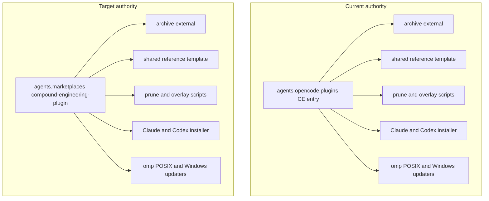
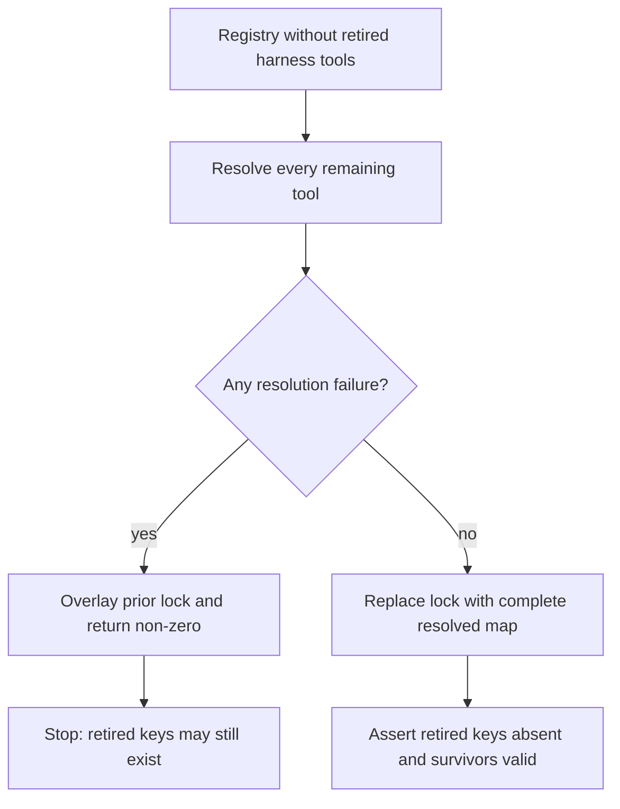

# Un-manage Pi, Kimi Code, OpenCode, oh-my-openagent and AGY - Plan

## Goal Capsule

- **Objective:** Stop managing five agent surfaces — `pi`, `kimi-code`, `opencode`, `oh-my-openagent` (`omo`), and `agy` — leaving `claude`, `codex`, and `omp` as the managed harnesses. One atomic change removes their configuration, target trees, apply scripts, CLI externals, release-lock entries, verification assertions, and documentation after re-homing the shared machinery they own.
- **Product authority:** The user's session-settled decisions govern scope and the deletion cascade. The root `AGENTS.md` and `.chezmoitemplates/agents-instructions.tmpl` govern repository convention.
- **Execution profile:** This is a coordinated source cutover. Intermediate source states need not render, but the final branch must pass every surviving render, package, and CI contract without applying to live `$HOME`.
- **Stop conditions:** Stop if the neutral compound-engineering authority cannot serve every surviving consumer, a clean release-lock regeneration cannot complete, or a proposed deletion changes omp model-provider settings.
- **Tail ownership:** Local proof uses isolated scratch rendering and package checks. The pull request owns final `ci.yml` and `render-dotfiles.yml` proof.

---

## Product Contract

### Summary

Delete every chezmoi-managed surface belonging to `pi`, `kimi-code`, `opencode`, `omo`, and `agy`, including their CLI externals, environment configuration, and repository tooling. First re-home the compound-engineering archive authority off the OpenCode block, because omp, Claude, and Codex resolve their plugin install through it. Deployed files and already-installed binaries remain on the current host as unmanaged state; `figma-auth` collapses to its one surviving `omp` store.

### Problem Frame

The repository manages eight agent harnesses. Five are no longer used because the user has consolidated on `omp`. Each removed harness still adds apply-time work through settings reconciliation, plugin installation, MCP rendering, release-lock refresh, and per-consumer CI assertions.

The five are coupled to surviving infrastructure:

- The compound-engineering archive path is single-sourced from the `compound-engineering` entry in `agents.opencode.plugins`. The shared reference template, archive external, two `00-tools` scripts, generic Claude/Codex installer, and both omp updater variants are the seven readers of that deleted authority.
- `.chezmoitemplates/agent-mcp-servers-json.tmpl` hardcodes the seven-harness id list and fails rendering closed on unknown ids.
- `packages/kimi-reconcile` outlives Kimi because `run_after_config-aoe.sh.tmpl` uses its `settings` subcommand as a target-neutral TOML-leaf reconciler.
- `google-antigravity` and `kimi-code` are also omp model-provider ids. They are distinct from the removed `agy` and `kimi` CLI harnesses.

### Key Decisions

- **Five surfaces out, three harnesses stay.** `pi`, `kimi-code`, `opencode`, `omo`, and `agy` stop being managed; `claude`, `codex`, and `omp` remain. (session-settled: user-directed — chosen over dropping only the three originally named: AGY is part of the same consolidation, and `omo` is an OpenCode-only enhancement layer with no consumer left.)
- **Configuration and CLI externals both go; the host is not pruned.** A fresh host converges to the three surviving harnesses. This host keeps already-deployed config and already-installed binaries as unmanaged state. (session-settled: user-directed — chosen over keeping the externals installed, and over full `.chezmoiremove` pruning: pruning would destroy live credential and session state for no benefit.)
- **Delete dead code, keep required historical names.** No orphaned subcommand, adapter, helper, or harness branch survives. `kimi-reconcile` keeps its name, binary path, and settings contract; `figma-auth` keeps its positional argument. (session-settled: user-directed — chosen over leaving the dead `plugin` subcommand in place, and over renaming both survivors: a rename would churn aoe's invoker and strand a dead binary that nothing prunes.)
- **`figma-auth` becomes omp-only.** (session-settled: user-directed — chosen over staying multi-target: removing four storage targets leaves omp's SQLite row as the only credential-store shape.)
- **Harness configuration only; omp's model settings are untouched.** `google-antigravity` and `kimi-code` stay named in omp's `modelRoles` and `retry.fallbackChains`. (session-settled: user-directed — chosen over pruning those references: they are provider ids, not harness config, and omp owns their OAuth state.)
- **One atomic change.** Re-home, delete, narrow, and strip in one branch. (session-settled: user-directed — chosen over a staged prepare-then-delete and over a harness-inventory refactor: fail-closed consumers make the integrated cutover easier to review than temporary compatibility state.)
- **Retain `packages/mxm4-haptic` after its importer disappears.** It remains the portable TypeScript twin of the Rust client surface, including the Windows named-pipe constant. (session-settled: user-directed — chosen over deleting the zero-importer package: the Rust and TypeScript parity contract still has independent value.)
- **Retain the `vendorManifest` resolver kind, not the AGY adapter.** Claude and Winbox still use the kind. The AGY registry entry, Antigravity-specific resolver branch, vendor type member, SHA-512-only lock field/documentation, tests, and lock entry leave under the no-orphan-adapter rule. This is planner-derived from the user-settled dead-code decision and direct resolver evidence; it is not a separate user-settled choice.

The authority re-home changes the root of the surviving fan-out:

### Requirements

**Shared-authority re-homing**

- R1. The compound-engineering local-archive source, path, and version source must be declared in a location no removed harness owns, and every surviving consumer must resolve it there. The declaration is platform-neutral even though the marketplace row's `os` field continues to gate only Claude/Codex installer applicability.
- R2. No archive path, source, or version literal may be copied into a per-agent entry. The shared reference and six direct consumers — archive external, two prune/overlay scripts, generic plugin installer, and both omp updaters — must name the neutral authority. The external must emit exactly one versioned compound-engineering archive on Linux, macOS, and Windows.
- R3. Plugin provisioning for `claude`, `codex`, and `omp` must fail rendering when the authority is missing or malformed, or when archive emission would be empty, rather than install nothing silently.

**Harness surface removal**

- R4. `pi`, `kimi-code`, `opencode`, `omo`, and `agy` must own no `.chezmoidata` blocks; the Pi and AGY haptic waveform blocks must also be gone.
- R5. Their chezmoi target trees must be deleted: `dot_pi/`, `dot_config/opencode/`, `private_dot_kimi-code/`, `dot_omo/`, and `dot_gemini/`.
- R6. Every apply-time script whose purpose is one of the five must be deleted, and no surviving script may reference a removed harness as a managed consumer.
- R7. Their CLI externals must be removed from `.chezmoiexternals/ai-agents.toml`, together with each external that exists only to serve one of them.
- R8. Their release-lock entries must be removed through `packages/release-lock` and a successful authoritative regeneration, never by hand-editing `.chezmoidata/releases.json`. This includes the harness CLIs, OpenCode plugins and auth packages, Pi extensions, the distinct `pi-compound-engineering` gitRef key, and `@ff-labs/fff-bun` used by the removed Pi extension surface.
- R9. The `vendorManifest` kind and its Claude/Winbox behavior must remain. The AGY registry entry, Antigravity-specific resolver code/tests, Antigravity-only `LockedArtifact.sha512` field and documentation, and stale release-lock README text must be removed as dead adapter code.
- R10. The instruction wrappers for OpenCode, Pi, and AGY must be deleted. The OpenCode-only and Pi-only islands in `.chezmoitemplates/agents-instructions.tmpl` must be removed while the invariant body and omp island render unchanged for the surviving harnesses.
- R11. The MCP harness-id list must narrow to `claude`, `codex`, and `omp`; each stale `harnessSkip` value naming a removed harness must fail rendering.
- R12. aoe's declared `custom_agents.kimi` and `agent_detect_as.kimi` leaves and the `~/.local/libexec/aoe-bin/kimi` wrapper source must be removed. Every other declared aoe leaf must remain unchanged.
- R13. The AGY mxm4-haptic bundle, its generic-installer branch, and its `.chezmoiignore` paths must be removed; Claude, Codex, and omp haptic surfaces must remain.
- R14. Repo-scoped OpenCode tooling must be removed: `.opencode/`, root `opencode.json`, and the matching root `.chezmoiignore` line.
- R15. The three `packages/opencode-*` workspace members, the OpenCode plugin template, and the OpenCode plugin build script must be deleted. `packages/mxm4-haptic` must remain and no surviving comment may claim an OpenCode consumer.
- R16. `figma-auth` must accept only `omp`; the four other storage adapters, their tests, their now-unused atomic file helper/test, and dependencies used only by those adapters must be removed.
- R17. `kimi-reconcile` must keep its name, binary path, build script, settings contract, and `settings` subcommand for aoe. Its `plugin` subcommand, plugin contract, plugin-only helpers, and plugin tests must be removed.
- R18. The Kimi Code, OpenCode, and OMO blocks in `dot_config/environment.d/60-development.conf`, the `.pi-subagents` ignore, and the `.omo/` / `.sisyphus/` ignore blocks must be removed.

**Host state**

- R19. No deployed harness file or installed harness binary may be pruned. No new `.chezmoiremove` entry or `remove_` source may be added for a removed harness.
- R20. The existing `.chezmoiremove` entry `.config/opencode/commands` must be removed because it would keep deleting a path inside an otherwise-unmanaged tree.
- R21. Residual host cleanup must be documented once as an optional manual operator step. It must distinguish local deletion from provider-side revocation and enumerate the orphaned Figma OAuth stores at `~/.local/share/opencode/mcp-auth.json`, `~/.pi/agent/mcp-auth/`, `~/.kimi-code/credentials/mcp/`, and `~/.gemini/antigravity-cli/mcp_oauth_tokens.json`; the retained omp row in `~/.omp/agent/agent.db` is not residue. No teardown or revert script may be added.

**Verification surfaces and documentation**

- R22. The shared MCP-consumer inventory must narrow to the surviving direct file consumers and stop defaulting its fixture to a removed harness. The AGY-only plugin-installer smoke test must be removed or replaced with survivor-focused coverage.
- R23. All Linux, macOS, and Windows jobs in `.github/workflows/render-dotfiles.yml` must carry no assertion or step owned by a removed harness, and each remaining step must stay valid.
- R24. `README.md` and root `AGENTS.md` must describe only the surviving managed harnesses, describe `figma-auth` as omp-only, and use a surviving script in verification examples.
- R25. `.agents/skills/sync-omp-models/SKILL.md` must remove only its sibling pointer to deleted `.opencode/commands/sync-omo-models.md`. Every upstream oh-my-openagent research citation in that skill and `model-notes.md` remains.

### Acceptance Examples

- AE1. **Covers R1-R3.** Given the OpenCode block is absent, when Linux, macOS, and Windows templates render, then Claude, Codex, and omp resolve the same pinned compound-engineering directory from the neutral authority and exactly one archive external is emitted per platform. A materialized Windows external lets the surviving PowerShell updater find its marketplace manifest. When the authority is absent, malformed, or cannot emit the archive, each provisioning template fails rendering.
- AE2. **Covers R11.** Given an MCP server carries a `harnessSkip` value naming a removed harness, when the MCP target renders, then rendering fails with an unknown-harness error.
- AE3. **Covers R12, R19.** Given aoe's live `config.toml` contains user keys and a Kimi custom agent, when apply later runs, then source declares no Kimi leaf, the live undeclared Kimi entry remains, and every surviving declared aoe value converges.
- AE4. **Covers R19, R20.** Given a host has deployed Pi, OpenCode, Kimi Code, omo, and Gemini configuration, when apply later runs, then no file in those trees is deleted, including `~/.config/opencode/commands`.
- AE5. **Covers R16.** Given `figma-auth` receives no argument or an unknown target, it prints usage naming only `omp` and exits non-zero without a write; given `figma-auth omp`, it writes the omp credential row.
- AE6. **Covers R17.** Given the rebuilt reconciler, its contract list contains only `settings:kimi-settings/v1` and aoe settings converge. Given a stale binary lacks that settings contract, the aoe invoker fails before mutation; a stale extra plugin contract cannot trigger plugin mutation because its only caller is deleted.
- AE7. **Covers R8, R9.** Given a clean release-lock regeneration from the narrowed registry, no retired key remains, every surviving entry remains byte-unchanged unless its upstream moved during the run, and Claude/Winbox `vendorManifest` resolution still passes without an Antigravity branch.

### Success Criteria

- Every changed template and surviving script renders through `chezmoi execute-template` with stub `op`, empty config, `--source "$PWD"`, and a per-user throwaway destination. No rendered output contains an unresolved `op://` reference.
- An extracted target-tree comparison shows only removed harness targets disappearing; surviving targets compare byte-for-byte. Rendered scripts are compared separately because archive output excludes scripts.
- Source searches find no live management reference to a removed harness. Deliberate exceptions are historical plans, omp provider ids, the retained `kimi-reconcile` name/settings contract, upstream research citations in `sync-omp-models`, external skill fixture prose, and the manual-cleanup note.
- The TypeScript workspace builds, type-checks, tests, and checks after package and lockfile pruning.
- Both `ci.yml` and `render-dotfiles.yml` reach terminal success on the pull request.

### Scope Boundaries

- **omp model settings.** `agents.omp.settings`, `retry.fallbackChains`, `auth.env`, and models stay untouched, including every `google-antigravity/*` and `kimi-code/*` provider id.
- **Published research and fixtures.** `.agents/skills/sync-omp-models/` keeps upstream oh-my-openagent research citations. `.ci/fixtures/ce-sweep/` keeps its external skill's cross-harness prose.
- **Host pruning.** Deployed configuration, installed binaries, credential stores, and session state remain. The repository only stops owning them.
- **Historical names.** `kimi-reconcile` and `kimi-settings/v1` stay because aoe uses them. `figma-auth` keeps its positional target argument.
- **Harness inventory refactor.** The remaining harness lists are narrowed in place. Creating a new global inventory abstraction is deferred.
- **Other agents and services.** aoe, CLIProxyAPI, `claude-glm`, mise, Claude, Codex, and omp change only where they name a removed harness or consume the re-homed archive.
- **Non-harness resolver consumers.** Winbox is an external tool entry, not a ninth managed agent harness. Only its surviving `vendorManifest` resolver behavior is in scope.
- **Haptic runtime.** The Rust daemon/client and TypeScript parity twin remain; only removed-harness consumers and comments leave.

### Dependencies and Assumptions

- A1. omp's `google-antigravity` and `kimi-code` model access does not depend on the AGY or Kimi CLI binaries. omp owns provider OAuth through its own database and `/login` flow.
- A2. A zero-failure `release-lock` run is authoritative and prunes retired keys. A partial run overlays the prior lock and is not acceptable proof for this change.
- A3. Deleting the two `remove_oh-my-openagent.*` sources stops asserting the legacy omo config prune and does not recreate removed files.
- A4. `packages/mxm4-haptic` remains a valid zero-importer workspace member and continues to build and test independently.
- A5. The five deployed instruction targets remain unmanaged on this host. No mirror-prune line is added.

### Sources / Research

- `.chezmoidata/agents.yaml` — agent data, marketplace registry, aoe leaves, omp provider settings, and the current OpenCode-owned archive authority.
- `.chezmoiexternals/ai-agents.toml` and `.chezmoiscripts/00-tools/run_{onchange,after}_compound-engineering*.sh.tmpl` — archive extraction, pruning, and overlays.
- `.chezmoiscripts/70-agents/run_onchange_after_install-agent-plugins.sh.tmpl` and `run_onchange_after_update-omp-plugins.{sh,ps1}.tmpl` — surviving archive consumers and fail-closed guards.
- `.chezmoitemplates/agent-mcp-servers-json.tmpl` and `.chezmoitemplates/agents-instructions.tmpl` — harness identity validation and instruction composition.
- `packages/figma-auth/`, `packages/kimi-reconcile/`, and `packages/release-lock/` — the three code-bearing simplification surfaces and their tests.
- `.ci/test-open-design-mcp-render.sh`, `.ci/test-compound-engineering-overlays.sh`, and `.github/workflows/render-dotfiles.yml` — direct consumer inventory and cross-platform render assertions.
- `docs/plans/2026-07-15-002-chore-remove-meridian-proxy-plan.md` and `docs/plans/2026-07-29-001-refactor-migrate-omo-unified-config-plan.md` — source-only removal and removal-mechanism precedents.
- No `docs/solutions/` or `CONCEPTS.md` corpus exists. External research was not load-bearing because the repository has direct local patterns for every affected mechanism.

---

## Planning Contract

**Product Contract preservation:** clarified R1-R3/AE1 so the re-homed archive emits on Windows for the surviving omp updater; clarified R9 so the no-orphan-adapter rule removes Antigravity-only SHA-512 lock shape/documentation while retaining Claude/Winbox `vendorManifest`; expanded R18 to cover the removed harnesses' discovered environment/ignore configuration; corrected AE6 to the surviving settings invoker's real contract; and corrected A2 to the lock CLI's clean-versus-partial behavior. All user-settled choices, scope boundaries, and stable R/AE ids remain intact.

### Key Technical Decisions

- KTD1. **Place the complete platform-neutral archive declaration under `agents.marketplaces.compound-engineering-plugin`.** Add its GitHub source, relative extraction path, and version-source selector to the already-neutral marketplace row. Its existing `os` field still gates Claude/Codex installer rows only; named archive and omp consumers read the declaration on Windows too. This extends the existing data model instead of adding a second shared-agent registry.
- KTD2. **Make all seven authority readers validate the named marketplace row.** The shared reference, archive external, prune script, overlay script, generic installer, and both omp updaters read the same fields and fail on missing or unsupported values. No reader scans a deleted harness block, and the external emits one archive on every supported OS.
- KTD3. **Land the cutover as one integrated branch.** (session-settled: user-directed — chosen over a staged compatibility bridge: temporary duplicate authority would weaken the single-source invariant without making the final review smaller.)
- KTD4. **Unmanage without pruning.** (session-settled: user-directed — chosen over `.chezmoiremove` entries or teardown scripts: source ownership ends, but live credentials and session state stay.)
- KTD5. **Keep two MCP file consumers over three logical harness ids.** The direct inventory contains `claude` and `omp`; Codex continues through dotagents' Claude-shaped file and remains invalid in `harnessSkip`.
- KTD6. **Require an authoritative lock refresh.** The clean CLI path replaces the tool map and prunes retired keys. A partial resolution overlays old data, returns non-zero, and blocks completion.
- KTD7. **Keep only the settings half of `kimi-reconcile`.** (session-settled: user-directed — chosen over renaming or retaining plugin compatibility: aoe needs the historical binary path and settings contract, but no surviving caller needs Kimi plugin publication.)
- KTD8. **Collapse `figma-auth` at the adapter boundary.** Retain the shared OAuth flow, omp SQLite adapter, and interactive human consent. Delete file-backed adapters and their file-write infrastructure rather than leave unused abstractions.
- KTD9. **Retain the zero-importer TypeScript haptic package.** (session-settled: user-directed — chosen over the deletion cascade: its Rust parity tests and Windows named-pipe contract remain meaningful.)
- KTD10. **Treat omp provider ids as data-plane names, not harness residue.** (session-settled: user-directed — chosen over text-matching deletion: `google-antigravity` and `kimi-code` continue to route omp models.)

### High-Level Technical Design

The Product Contract diagram defines the archive topology. Release-lock retirement has a separate branch contract:

### Assumptions

- A6. Keeping the archive base path unchanged lets existing extracted compound-engineering versions remain usable; only the authority moves.
- A7. Environment-variable and ignore entries owned only by removed harnesses are configuration surfaces, not protected host residue. Removing them from surviving files is in scope.
- A8. The survivor-focused generic plugin smoke test should replace the deleted AGY-only smoke so Claude/Codex behavior remains exercised.
- A9. Live `$HOME` may still contain removed-harness names after this change. Source and isolated destination state, not live residue, define success.

### Sequencing

U1 establishes the final archive authority before U2 removes the OpenCode data block in the same coordinated cutover. U3 and U4 simplify independent packages. U5 updates the workspace graph after those package changes. U6 removes release-lock producers only after U2 and U5 remove their consumers. U7 integrates cross-platform assertions and documentation after all final surfaces are known. The final branch is verified as one unit; no live apply is part of implementation.

### System-Wide Impact

- **Fresh hosts:** Only Claude, Codex, and omp agent configuration and CLIs are managed. Removed harness tools are not downloaded.
- **Existing hosts:** Removed targets, binaries, credentials, and session state remain in place but receive no further updates. Optional cleanup is manual.
- **Surviving agents:** Claude, Codex, and omp keep the same compound-engineering release path. Omp model providers and OAuth remain unchanged.
- **Automation:** aoe continues to reconcile declared TOML leaves through `kimi-reconcile settings`; undeclared live keys remain untouched.
- **CI:** Linux container, macOS, and Windows render jobs stop expecting removed targets. Package CI still covers the surviving workspaces.
- **Operational side effects:** No system service or network configuration is changed. A later real apply can rerun the surviving archive/plugin onchange scripts because their rendered authority source changed.

### Risks and Mitigations

- **Missed archive reader or platform:** A surviving harness loses compound-engineering, especially the Windows omp updater whose source archive was previously POSIX-gated. Mitigation: enumerate all seven authority readers, emit one archive on each OS, add missing/malformed-authority render failures, and run a Windows updater smoke against a materialized external.
- **Partial lock refresh:** Retired entries survive due overlay semantics. Mitigation: accept only a zero-failure refresh and assert the final key set.
- **Provider-name false positive:** Broad deletion removes omp's `google-antigravity` or `kimi-code` models. Mitigation: pin those data paths in source search and render comparisons.
- **Over-broad host cleanup:** A remove directive destroys live state. Mitigation: inspect `.chezmoiremove`, `remove_*`, and the target diff; add no new prune mechanism.
- **Dead-code residue:** Helper code or dependencies survive without callers. Mitigation: use LSP references and package type-checking after each code-bearing deletion.
- **Cross-platform workflow breakage:** Removing a step leaves invalid YAML or stale references in one job. Mitigation: review all four render jobs and require both repository workflows to pass.

---

## Implementation Units

### U1. Re-home compound-engineering archive authority

- **Goal:** Move archive source/path/version ownership to the neutral marketplace row and preserve Claude, Codex, and omp provisioning.
- **Requirements:** R1-R3, R13 (generic-installer branch only); KTD1-KTD3; AE1.
- **Dependencies:** None.
- **Files:** `.chezmoidata/agents.yaml`; `.chezmoiexternals/ai-agents.toml`; `.chezmoitemplates/compound-engineering-ref.tmpl`; `.chezmoiscripts/00-tools/run_onchange_after_compound-engineering.sh.tmpl`; `.chezmoiscripts/00-tools/run_after_compound-engineering-overlays.sh.tmpl`; `.chezmoiscripts/70-agents/run_onchange_after_install-agent-plugins.sh.tmpl`; `.chezmoiscripts/70-agents/run_onchange_after_update-omp-plugins.sh.tmpl`; `.chezmoiscripts/70-agents/run_onchange_after_update-omp-plugins.ps1.tmpl`; `.ci/test-compound-engineering-overlays.sh`; `.ci/test-omp-agent-reconcile.sh`; `.ci/smoke-agent-plugin-installer.sh`.
- **Approach:** Make `agents.marketplaces.compound-engineering-plugin` the complete platform-neutral authority. Rewire the archive external from the deleted OpenCode range and emit exactly one versioned archive on Linux, macOS, and Windows; the marketplace `os` gate continues to control only Claude/Codex installer rows. Narrow the generic installer to Claude/Codex, remove its AGY branch, and replace the AGY-only smoke with survivor-focused coverage. Every reader validates required fields before producing output.
- **Patterns to follow:** The generic installer's existing render-time marketplace validation; the omp updater's current fail-closed guard; the repository scratch-test pattern.
- **Test scenarios:**
  - Covers AE1. With valid source data, render the shared reference, exactly one archive external on each OS, both `00-tools` scripts, generic installer, and both omp updaters; all seven authority readers resolve the same versioned directory.
  - Remove the marketplace row in an override fixture; every provisioning template that requires it fails rendering with a named authority error.
  - Set an invalid version source or unsafe relative path; rendering fails before shell or PowerShell is emitted.
  - Run the survivor smoke with stub Claude and Codex CLIs; both register/install compound-engineering and no AGY command is invoked.
  - Render on Linux-container, macOS, and Windows data; exactly one compound-engineering external is present per platform and the POSIX/PowerShell omp paths match.
  - Materialize the rendered Windows archive in scratch, run the PowerShell updater with a stub `omp`, and verify it finds `.claude-plugin/marketplace.json` before install.
- **Verification:** The seven authority readers resolve one archive path and release, negative fixtures fail closed, the Windows runtime smoke reaches the stub installer, and no rendered script names OpenCode, Kimi, Pi, or AGY as an archive consumer.

### U2. Remove managed harness data, targets, and runtime configuration

- **Goal:** Delete the five harnesses' source-owned configuration, provisioning, repo tooling, and target trees without pruning live host state.
- **Requirements:** R4-R14 (R13 owns the AGY bundle and `.chezmoiignore` paths here), R18-R21, R25; KTD4-KTD5, KTD10; AE2-AE4.
- **Dependencies:** U1.
- **Files:** `.chezmoidata/agents.yaml`; `.chezmoidata/haptic.yaml`; `.chezmoitemplates/agent-mcp-servers-json.tmpl`; `.chezmoitemplates/agents-instructions.tmpl`; `.chezmoiexternals/ai-agents.toml`; `.chezmoiscripts/00-tools/run_onchange_after_pi.sh.tmpl`; `.chezmoiscripts/70-agents/run_after_config-kimi.sh.tmpl`; `.chezmoiscripts/70-agents/run_after_install-kimi-plugins.sh.tmpl`; `.chezmoiscripts/70-agents/run_onchange_after_config-pi-auth.sh.tmpl`; `.chezmoiscripts/70-agents/run_onchange_after_update-pi-extensions.sh.tmpl`; `dot_pi/`; `dot_config/opencode/`; `private_dot_kimi-code/`; `dot_omo/`; `dot_gemini/`; `dot_local/libexec/aoe-bin/executable_kimi`; `dot_local/share/agy-plugins/`; `.opencode/`; `opencode.json`; `.chezmoiignore`; `.chezmoiremove`; `dot_config/environment.d/60-development.conf`; `.gitignore`; `dot_config/git/ignore`; `.agents/skills/sync-omp-models/SKILL.md`; `.ci/test-open-design-mcp-render.sh`.
- **Approach:** Delete source trees and harness-only scripts. Narrow shared lists and conditions in place. Remove the existing OpenCode command prune line and add no replacement prune. Keep omp provider ids, aoe's non-Kimi leaves, and the omp haptic block byte-identical.
- **Patterns to follow:** Data-driven deletion from `.chezmoidata`; `agent-mcp-servers-json.tmpl` unknown-id failure; source-only non-pruning from root `AGENTS.md`.
- **Test scenarios:**
  - Covers AE2. A fixture with `harnessSkip: pi`, `agy`, `kimi`, or `opencode` fails as unknown; `claude` and `omp` render; Codex remains non-skippable.
  - Covers AE3. The aoe source fixture drops only the Kimi leaves while unrelated declared and live values remain.
  - Covers AE4. Render `.chezmoiremove` and confirm `.config/opencode/commands` and every removed-harness target are absent from the prune set.
  - Render all surviving instruction wrappers before and after the cutover; invariant text is byte-identical and the omp-specific island remains.
  - Render an archive target tree and confirm removed target roots disappear while `dot_agents/`, `dot_claude/`, `dot_codex/`, and `dot_omp/` outputs remain unchanged.
  - Confirm `agents.omp.settings` still contains all `google-antigravity/*` and `kimi-code/*` selectors.
- **Verification:** No source-owned target, script, external, env block, repo command, or haptic data remains for the five harnesses; no live-prune source is introduced.

### U3. Collapse figma-auth to omp storage

- **Goal:** Retain the shared interactive OAuth flow and omp database commit while deleting every removed-harness adapter path.
- **Requirements:** R16; KTD8; AE5.
- **Dependencies:** None.
- **Files:** `packages/figma-auth/src/cli.ts`; `packages/figma-auth/src/storage/opencode.ts`; `packages/figma-auth/src/storage/pi.ts`; `packages/figma-auth/src/storage/kimi.ts`; `packages/figma-auth/src/storage/antigravity.ts`; `packages/figma-auth/src/storage/atomic.ts`; `packages/figma-auth/test/cli.test.ts`; `packages/figma-auth/test/opencode-storage.test.ts`; `packages/figma-auth/test/pi-storage.test.ts`; `packages/figma-auth/test/kimi-storage.test.ts`; `packages/figma-auth/test/antigravity-storage.test.ts`; `packages/figma-auth/test/atomic-write.test.ts`; `packages/figma-auth/test/omp-storage.test.ts`; `packages/figma-auth/package.json`; `.chezmoiscripts/60-build/run_onchange_after_build-figma-auth.sh.tmpl`.
- **Approach:** Reduce the target union and adapter switch to `omp`. Remove file-backed storage code, its atomic helper, and `jsonc-parser`; retain the SQLite test dependency used by omp tests.
- **Patterns to follow:** Existing `OmpStorage` commit transaction and CLI invalid-argument handling.
- **Test scenarios:**
  - Covers AE5. No argument and each former target return non-zero, print usage containing only `omp`, and do not open a credential store.
  - `figma-auth omp` completes the existing OAuth callback path and commits one expected omp credential row while preserving unrelated rows.
  - OAuth cancellation, callback mismatch, and persistence failure keep their current non-success behavior.
  - The package graph contains no import of deleted adapters, `atomic.ts`, or `jsonc-parser`.
- **Verification:** Package tests and type-checking pass with only the omp adapter reachable; the build provisioner still produces and promotes the same `figma-auth` binary path.

### U4. Reduce kimi-reconcile to target-neutral settings reconciliation

- **Goal:** Keep aoe's selective TOML merge while removing all Kimi plugin publication behavior.
- **Requirements:** R12, R17; KTD7; AE3, AE6.
- **Dependencies:** None.
- **Files:** `packages/kimi-reconcile/src/cli.ts`; `packages/kimi-reconcile/src/reconcile.ts`; `packages/kimi-reconcile/test/reconcile.test.ts`; `packages/kimi-reconcile/package.json`; `.chezmoiscripts/60-build/run_onchange_after_build-kimi-reconcile.sh.tmpl`; `.chezmoiscripts/70-agents/run_after_config-aoe.sh.tmpl`.
- **Approach:** Remove the plugin command and contract; `treeDigest`, `validateTree`, `recordsEquivalent`, `validateSourceTree`, `recoverPluginArtifacts`, `createSafeDirectoryChain`, `exists`; and their dead `createHash`, `cp`, `readdir`, `realpath`, `rm`, and `stat` imports. Keep the settings contract and safe TOML overlay/atomic-write path under the historical binary name.
- **Patterns to follow:** Existing settings tests for declared-leaf overlay and undeclared-key preservation; aoe's contract preflight.
- **Test scenarios:**
  - Covers AE3. Declared nested leaves update while unrelated TOML values remain semantically unchanged.
  - Scalar/table conflicts, unsafe paths, and concurrent target changes still fail before unsafe mutation.
  - Covers AE6. `contracts` emits only `settings:kimi-settings/v1`; `settings` still succeeds; `plugin` is rejected by usage handling.
  - An aoe fixture whose reconciler omits the settings contract fails before writing, while an extra stale plugin contract cannot cause plugin work because no caller invokes it.
- **Verification:** `kimi-reconcile` builds to the same executable path, its package tests pass, and LSP/reference checks find no caller or export for plugin reconciliation.

### U5. Remove OpenCode workspace plugins and refresh the workspace graph

- **Goal:** Delete the three OpenCode-only packages and build integration while preserving the standalone TypeScript haptic parity package.
- **Requirements:** R15; KTD9.
- **Dependencies:** U3, U4.
- **Files:** `packages/opencode-mxm4-haptic/`; `packages/opencode-scratch-guard/`; `packages/opencode-playwright-cli-session-injection/`; `.chezmoitemplates/opencode-plugins-json.tmpl`; `.chezmoiscripts/60-build/run_onchange_after_build-opencode-plugins.sh.tmpl`; `packages/mxm4-haptic/`; `.chezmoiscripts/60-build/run_onchange_after_build-mxm4-haptic.sh.tmpl`; `crates/mxm4-haptic/src/lib.rs`; `packages/bun.lock`.
- **Approach:** Delete package directories; wildcard workspace discovery removes them automatically. Regenerate the package lock after U3/U4 dependency pruning. Retain and continue testing `@h82/mxm4-haptic`; change only stale removed-consumer comments.
- **Patterns to follow:** `packages/package.json` wildcard workspaces and the existing Rust/TypeScript drift guard.
- **Test scenarios:**
  - Frozen workspace install succeeds with no deleted package or deleted adapter dependency in `packages/bun.lock`.
  - Recursive build/typecheck/test discovers `packages/mxm4-haptic` even with zero importers.
  - The Rust/TypeScript waveform and Windows pipe drift guards pass unchanged.
  - Source search finds no OpenCode plugin build output or symlink destination.
- **Verification:** The workspace contains no `opencode-*` member, all surviving packages pass the workspace gates, and the haptic parity package remains buildable and tested.

### U6. Retire release-lock producers and regenerate authoritatively

- **Goal:** Remove every lock producer that serves only a deleted harness while preserving all surviving resolver kinds and entries.
- **Requirements:** R8-R9; KTD6; AE7.
- **Dependencies:** U2, U5.
- **Files:** `packages/release-lock/src/registry.ts`; `packages/release-lock/src/vendor-manifest.ts`; `packages/release-lock/src/types.ts`; `packages/release-lock/test/registry.test.ts`; `packages/release-lock/test/vendor-manifest.test.ts`; `packages/release-lock/test/cli.test.ts`; `packages/release-lock/README.md`; `.chezmoidata/releases.json`.
- **Approach:** Delete the retired registry keys, Antigravity vendor branch/type/test, and Antigravity-only SHA-512 artifact shape/documentation. Keep Claude and Winbox vendor dispatch. First generate to stdout, require exit zero, and assert retired keys and `sha512` are absent; only then run the normal output-path generation and compare surviving entries against the pre-run lock.
- **Patterns to follow:** `runCli` clean-result replacement, existing retired-entry prune coverage, and sorted lock serialization.
- **Test scenarios:**
  - Covers AE7. A clean resolution from the narrowed registry omits every retired key and keeps the tool map sorted.
  - A simulated remaining-source failure returns non-zero and demonstrates why the overlaid result is not accepted as retirement proof.
  - Claude manifest and Winbox text fixtures still resolve; an Antigravity vendor spec is rejected as unknown; serialized clean locks contain no `sha512` member.
  - Registry partition tests contain no expected asset row for Kimi, OpenCode, or Pi.
  - Surviving lock entries compare byte-for-byte unless a real upstream moved; any such drift is surfaced rather than hidden.
- **Verification:** The committed lock is generator output from a successful run, contains no retired entry or SHA-512-only artifact member, and all release-lock tests pass with the surviving resolver matrix.

### U7. Reconcile CI, documentation, and integrated proof

- **Goal:** Remove stale verification/documentation ownership and prove the final source cutover on every supported platform.
- **Requirements:** R21-R24; all acceptance examples.
- **Dependencies:** U1-U6.
- **Files:** `.ci/smoke-agy-plugin-installer.sh`; `.ci/smoke-agent-plugin-installer.sh`; `.ci/test-compound-engineering-overlays.sh`; `.ci/test-open-design-mcp-render.sh`; `.ci/test-omp-agent-reconcile.sh`; `.github/workflows/render-dotfiles.yml`; `.github/workflows/ci.yml`; `.agents/skills/sync-omp-models/SKILL.md`; `.agents/skills/sync-omp-models/model-notes.md`; `README.md`; `AGENTS.md`.
- **Approach:** Delete AGY assertions, narrow haptic row checks to surviving agents, remove OpenCode/Pi target assertions from Linux/macOS/Windows jobs, and keep each workflow structurally valid. Document the exact optional OAuth-residue cleanup/revocation list and the surviving managed harness set. Remove only the deleted command pointer from `sync-omp-models/SKILL.md`; keep all other oh-my-openagent research in both skill files.
- **Execution note:** Prefer isolated render and runtime smoke proof. Do not run `chezmoi apply`, start services, or mutate live agent stores.
- **Patterns to follow:** The repository's stub-`op` scratch recipe, archive comparison guidance, and native CI watcher requirement.
- **Test scenarios:**
  - Linux container internals render the Claude/Codex compound-engineering rows, filter Linux-only haptic rows as declared, and contain no AGY row.
  - macOS internals render only supported survivor rows and contain no removed-harness target assertion.
  - Windows renders the compound-engineering external and omp settings/updater paths without expecting OpenCode or Pi files; the updater runtime smoke finds the materialized archive.
  - The MCP reverse-coverage inventory has exactly the two direct file consumers and rejects stale removed ids.
  - README/manual cleanup text distinguishes optional host deletion and provider revocation from automated source unmanagement, enumerates all four orphaned Figma OAuth stores, and excludes omp's database row.
  - The final archive comparison and scoped source search honor the deliberate exceptions and find no dangling live-management reference.
- **Verification:** Local integration gates pass; `git diff --check`, repository status, and the requested-scope diff are clean; both PR workflows reach terminal success.

---

## Verification Contract

| Gate | Scope | Required evidence |
|---|---|---|
| TypeScript workspace | U3-U6 | From `packages/`: frozen install, recursive build, typecheck, test, and `vp check` all pass with the refreshed lockfile. |
| MCP inventory | U2, U7 | `.ci/test-open-design-mcp-render.sh` passes with `claude` and `omp` as direct consumers and stale harness ids rejected. |
| Archive overlays | U1, U7 | `.ci/test-compound-engineering-overlays.sh` passes after the neutral authority re-home. |
| Plugin installers | U1, U7 | Rendered generic and omp installers pass shell/PowerShell validation; survivor smoke proves Claude/Codex behavior; a Windows runtime smoke finds the materialized archive; missing-authority fixtures fail rendering. |
| Template/script rendering | U1-U2, U7 | Every changed template and surviving script renders with the root `AGENTS.md` stub-`op`, empty-config, per-user scratch recipe on its applicable OS data. |
| Target-tree comparison | U2, U7 | Extracted `chezmoi archive --exclude=encrypted,externals,scripts` trees differ only by removed harness targets; rendered scripts are compared separately. |
| Release lock | U6 | A zero-failure package generator run creates the committed lock; release-lock tests pass; retired keys and the Antigravity-only `sha512` artifact field are absent. |
| Static repository checks | All | `git diff --check`, repository status, scoped diff, wrapper-mirror checks, and deliberate-exception source searches pass. Root `CLAUDE.md` remains exactly `@AGENTS.md`. |
| Pull-request workflows | All | `.github/workflows/ci.yml` and `.github/workflows/render-dotfiles.yml` finish successfully. |

No browser test is required because this change has no browser-rendered interface. No live chezmoi deployment is permitted during verification.

---

## Definition of Done

- The neutral compound-engineering marketplace row owns source, path, and version-source data; every surviving consumer uses it and fails closed on invalid data (R1-R3, AE1).
- All five removed harnesses have no data block, target tree, apply script, CLI external, repo tool, haptic block, environment block, or active shared-list entry (R4-R18).
- Omp provider ids, Claude/Codex/omp plugin behavior, aoe settings reconciliation, omp Figma credentials, Claude/Winbox vendor resolution, and both haptic client surfaces remain functional (R3, R9, R12-R17).
- No new prune mechanism exists, the stale OpenCode command prune is gone, and optional cleanup is documented without being executed (R19-R21, AE3-AE4).
- CI inventories, cross-platform render assertions, README, root `AGENTS.md`, and the omp model-sync skill describe the surviving ownership accurately (R22-R25).
- Package, render, archive-comparison, static, and PR workflow gates in the Verification Contract pass.
- No abandoned compatibility shim, orphan helper, stale dependency, generated build output, or dead-end implementation remains in the diff.
