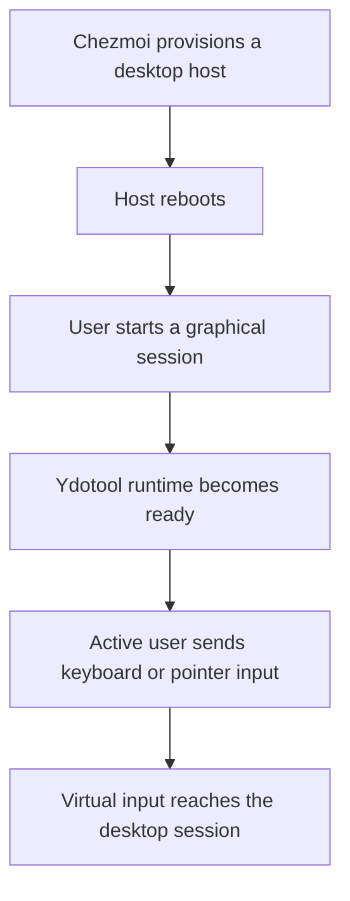

# Ydotool Linux Provisioning - Plan

## Goal Capsule

- **Objective:** Make `ydotool` ready for keyboard and pointer automation after reboot and graphical login on managed Fedora and Ubuntu desktops.
- **Product authority:** This Product Contract defines the required behavior and scope. Repository package, system-file, and service conventions constrain the implementation.
- **Open blockers:** None.

---

## Product Contract

### Summary

Provision `ydotool` as a working Wayland input-automation capability on managed Fedora and Ubuntu KDE/GNOME desktops. The active desktop user can use keyboard and pointer commands without `sudo` after reboot and graphical login.

### Problem Frame

The repository does not manage `ydotool` today. The user wants to introduce Wayland automation where no automation currently exists.

Installing the client is insufficient. `ydotool` also needs a running daemon, access to `/dev/uinput`, and a client-accessible Unix socket.

### Key Decisions

- **Working capability:** Configure a usable runtime instead of installing only the package. (session-settled: user-directed — chosen over package-only installation: an installed client does not deliver Wayland input automation.)
- **Active-user boundary:** Limit unprivileged use to the active desktop user. (session-settled: user-directed — chosen over all-local-user or root-only access: automation is for the logged-in graphical session.)
- **Desktop coverage:** Support managed Fedora and Ubuntu KDE/GNOME desktops. (session-settled: user-directed — chosen over all Linux hosts or Fedora-only coverage: headless systems and containers do not need desktop input automation.)
- **Activation timing:** The capability may become available after reboot and graphical login. (session-settled: user-directed — chosen over same-session activation: immediate activation during the first apply is unnecessary.)
- **Input coverage:** Keyboard and pointer automation are both required. (session-settled: user-directed — chosen over either input class alone: the intended automation is not limited to typing or pointer control.)

### Requirements

**Installation and coverage**

- R1. Chezmoi installs the distribution-native `ydotool` package on supported Fedora and Ubuntu desktop hosts.
- R2. Chezmoi does not provision `ydotool` on headless Linux hosts or containers.

**Runtime and access**

- R3. The required `ydotool` background runtime starts automatically for the graphical user after reboot and login.
- R4. The active desktop user can run `ydotool` without `sudo` and connect to the configured daemon socket.
- R5. `/dev/uinput` access follows the active-seat boundary and does not grant permanent input-injection access to every local user.
- R6. The managed runtime provides keyboard, pointer movement, button, and scroll input.

**Cross-distribution behavior**

- R7. Fedora and Ubuntu expose the same user-visible capability despite differences in their package-provided service units and udev rules.
- R8. Provisioning remains idempotent across repeated applies and does not weaken the repository's existing `/dev/uinput` access policy.

### Key Flows



- F1. Provision and activate
  - **Trigger:** Chezmoi applies the configuration on a supported Fedora or Ubuntu desktop.
  - **Steps:** The package and required runtime access are provisioned; the host reboots; the user signs in graphically; the runtime starts.
  - **Outcome:** `ydotool` is ready for the active desktop user without a privileged command.
  - **Covered by:** R1, R3, R4, R5, R7, R8.
- F2. Send synthetic input
  - **Trigger:** The active desktop user invokes a keyboard or pointer command.
  - **Steps:** The client connects to the managed runtime; the runtime emits the requested virtual input.
  - **Outcome:** The graphical session receives the requested keyboard, pointer, button, or scroll event.
  - **Covered by:** R4, R6.

### Acceptance Examples

- AE1. **Covers R1, R3, R4, R7.** Given a managed Fedora or Ubuntu desktop that has completed apply and reboot, when the user signs in graphically, then the runtime starts and the user can invoke `ydotool` without `sudo`.
- AE2. **Covers R6.** Given a ready runtime, when the active user runs representative keyboard, pointer-movement, button, and scroll commands, then the desktop session receives each input class.
- AE3. **Covers R2.** Given a headless Linux host or container, when Chezmoi evaluates its managed targets, then it does not install or configure `ydotool`.
- AE4. **Covers R5.** Given another local account whose session does not own the active seat, when it attempts to use the managed runtime, then it does not gain the active user's input-injection access.
- AE5. **Covers R8.** Given an already-provisioned supported desktop, when Chezmoi applies the same source again, then the runtime remains usable and access does not broaden.

### Scope Boundaries

- No automation scripts, macros, or application-specific workflows.
- No support for headless hosts, containers, remote sessions, or inactive local users.
- No requirement to activate the first apply within the current session; reboot and graphical login are acceptable.
- No custom upstream build while supported distribution packages provide the required binaries.

### Dependencies / Assumptions

- Fedora 44 and Ubuntu 26.04 provide native `ydotool` packages.
- The packages include both the client and daemon, but their service and udev integration differ by distribution.
- The repository's existing active-seat `/dev/uinput` policy is the security baseline.

### Outstanding Questions

**Deferred to Planning**

- Choose the common user-scoped runtime arrangement that reconciles Fedora's system service with Ubuntu's user service while preserving the active-seat boundary.
- Determine how package-provided udev rules interact with the repository's existing rule and avoid duplicate or broader access.
- Define a safe, observable smoke exercise for every required input class after reboot.

### Sources / Research

- `.chezmoidata/packages.yaml` — package-provisioning authority and desktop gates.
- `.chezmoidata/system.yaml` — root-owned system-file authority.
- `system/linux/etc/udev/rules.d/70-uinput-solaar.rules` — existing active-seat `/dev/uinput` access policy.
- [Upstream ydotool documentation](https://github.com/ReimuNotMoe/ydotool) — daemon and `/dev/uinput` requirements.
- [Fedora ydotool package](https://packages.fedoraproject.org/pkgs/ydotool/ydotool/) — Fedora package and system-service guidance.
- [Ubuntu 26.04 ydotool file list](https://packages.ubuntu.com/resolute/amd64/ydotool/filelist) — client, daemon, user service, and udev rule contents.

**Product Contract preservation:** changed: AE4 now makes the Unix security boundary explicit. The contract denies other local accounts that do not own the active seat. It does not claim process isolation between graphical and remote processes that share the same Unix UID; socket mode `0600` intentionally authorizes that UID.

---

## Planning Contract

### Key Technical Decisions

- KTD1. **Install native packages only through desktop-gated package groups.** Add `ydotool` to Fedora's existing `kdePackages` and `gnomePackages`. Add a `kdePackages: desktop.kde` gate and list to Ubuntu, then add `ydotool` to both Ubuntu desktop lists. Extend the Ubuntu installer to seed and append the KDE group through the same `fact_gate()` mechanism as GNOME. Do not add `ydotool` to either unconditional package list. This makes `desktop=none` and containers fail closed without a new host fact. (session-settled: user-directed — chosen over Fedora-only coverage: both managed distributions and desktop families are required.)
- KTD2. **Override both distributions with one managed user unit.** Deploy `~/.config/systemd/user/ydotool.service` on Fedora and Ubuntu KDE/GNOME hosts. Run a managed active-seat wrapper that owns `/usr/bin/ydotoold`, `%t/.ydotool_socket`, and socket mode `0600`. Bind the unit to `graphical-session.target` with `PartOf=`, `WantedBy=`, and `Restart=on-failure` with a short delay. Use hardening that works in an unprivileged per-user manager without filesystem namespaces: `UMask=0077`, `NoNewPrivileges=yes`, an empty `CapabilityBoundingSet=`, `RestrictSUIDSGID=yes`, `SystemCallArchitectures=native`, and `RestrictAddressFamilies=AF_UNIX`. Do not use `PrivateTmp`, `ProtectSystem`, `ProtectHome`, `PrivateDevices`, or a device policy that hides `/dev/uinput`; the first three would be ineffective without `PrivateUsers=true`, while `ProtectHome=yes` with that namespace would hide `%t` under `/run/user`. Do not enable lingering and do not start the unit during apply. (session-settled: user-directed — chosen over package-only installation and a root system daemon: the tool must work for the graphical user without `sudo`.)
- KTD3. **Preserve the active-seat `/dev/uinput` policy and neutralize Ubuntu's broader rule.** Keep `system/linux/etc/udev/rules.d/70-uinput-solaar.rules` as the shared `static_node=uinput` plus `TAG+="uaccess"` authority. Update its comments to name both Solaar and `ydotoold`, without adding `GROUP`, `MODE`, or persistent group membership. Add a comment-only `/etc/udev/rules.d/80-uinput.rules` through the system-file manifest tree. The same basename in `/etc` shadows Ubuntu's package-owned `/usr/lib/udev/rules.d/80-uinput.rules`; Fedora receives an inert defensive override. (session-settled: user-directed — chosen over all-local-user or root-only access: input injection belongs to the active desktop user.)
- KTD4. **Remove package-owned service activation only on eligible desktops.** In the Fedora package installer, stop and mask the system `ydotool.service` after package installation when the daemon exists and either the KDE or GNOME package gate is active. In the Ubuntu package installer, disable the package's global `default.target` user-unit enablement under the same desktop predicate. Keep these distro-specific actions in their package-fingerprinted installers so package-list changes reassert them. A headless host with an independently installed `ydotoold` remains untouched.
- KTD5. **Persist graphical enablement without depending on a live user bus.** Add a `run_after_` script under `.chezmoiscripts/30-linux/`. It uses the rendered OS, distro, desktop, headless, and container facts to fail closed and skips when `ydotoold` is unavailable. It first performs an offline-capable `systemctl --user enable --no-reload` so the next graphical login starts the unit even when apply has no user bus. When the bus is reachable, it also reloads the manager and restarts only an already-active unit. The unconditional `run_after_` form retries recovered package and runtime state without a source fingerprint change. (session-settled: user-directed — chosen over same-session activation: the next graphical login is the required activation point.)
- KTD6. **Use isolated orchestration proof, then leave physical input confirmation to post-apply acceptance.** Add one focused shell harness that renders eligible and ineligible branches, executes the user reconciliation script against stubs, validates the unit with `systemd-analyze --user verify`, validates package membership and udev policy, and checks each distro's rendered service override. CI must not start the real daemon, inject input, run a live `chezmoi apply`, or modify live user/system service state.
- KTD7. **Close the managed daemon when its user loses active-seat access.** Add a small managed wrapper that polls the calling UID's write access to `/dev/uinput` every 250 ms. It starts `ydotoold` only while that access exists, unlinks the private socket and terminates the child when access is revoked, and restarts the child when access returns. This closes the managed daemon's retained `/dev/uinput` descriptor after fast user switching instead of assuming ACL revocation affects an already-open descriptor. The wrapper cannot isolate processes that share the same Unix UID or prevent an authorized UID from opening `/dev/uinput` independently; those limits remain outside the Product Contract.

### High-Level Technical Design

```mermaid
flowchart TB
  P[desktop-gated native package] --> D{distribution}
  D -->|Fedora| F[mask and stop root system unit]
  D -->|Ubuntu| U[disable global vendor user-unit enablement]
  F --> M[managed user unit]
  U --> M
  R70[/etc 70-uinput rule] --> ACL[logind uaccess ACL on /dev/uinput]
  O[/etc 80-uinput override] --> X[Ubuntu vendor group grant shadowed]
  M --> W[active-seat wrapper]
  ACL --> W
  W --> Y[ydotoold as desktop user]
  Y --> S[%t/.ydotool_socket mode 0600]
  C[ydotool client for same UID] --> S
```

### Assumptions

- Fedora and Ubuntu package `ydotool` 1.0.4 with `/usr/bin/ydotool` and `/usr/bin/ydotoold`. Fedora ships a system unit; Ubuntu ships a user unit and `80-uinput.rules`.
- systemd expands `%t` to the same per-user runtime directory that the `ydotool` client derives from `XDG_RUNTIME_DIR`.
- `ydotoold` accepts `--socket-path` and `--socket-perm` in the packaged version. Both package metadata sets and the rendered unit must retain the expected `/usr/bin/ydotoold` path and command flags.
- `graphical-session.target` is reached by the managed KDE and GNOME sessions. A user manager exists after graphical login; lingering is unnecessary.
- The active-seat ACL is UID-based and does not revoke an already-open `/dev/uinput` descriptor. The managed wrapper must therefore stop its child within one 250 ms reconciliation interval when the calling UID loses write access. A process that shares the active user's UID can use that user's mode-`0600` socket, including over SSH; same-UID process isolation is outside the Product Contract.
- Live deployment and real input injection are prohibited during repository verification. The operator performs the final post-reboot keyboard and pointer exercise after applying from the managed host.

### Risks and Mitigations

- **Daemon starts before the logind ACL exists:** The active-seat wrapper waits for write access before starting `ydotoold` and retries after a transient open failure.
- **A formerly active user retains an open `/dev/uinput` descriptor:** The wrapper detects the revoked write permission, unlinks its socket, and terminates the managed child within one 250 ms reconciliation interval. The isolated harness must prove stop and later restart behavior with a fake device.
- **Fedora root daemon and user daemon race for runtime ownership:** Stop and mask the system unit in the same package-installer run that adds `ydotool`; verify the system scope is masked before relying on the user unit.
- **Ubuntu broad group rule survives alongside `uaccess`:** udev combines matching rules, so ordering alone does not revoke a broader grant. Shadow the vendor file by exact basename in `/etc/udev/rules.d/` and assert that the managed override contains no access assignment.
- **Ubuntu's package enables its vendor unit under `default.target`:** Disable the global user-unit enablement before creating the per-user graphical-session enable link.
- **A no-sudo apply cannot install the package:** Keep package actions in the existing distro installers and use a `run_after_` user reconciler so a later successful apply retries current package state.
- **A no-user-bus apply cannot reload the manager:** Persist the graphical-session enable link with offline-capable `systemctl --user enable --no-reload` before probing the bus. Defer reload and active-instance restart until a manager is reachable.
- **Filesystem hardening silently no-ops in a user manager:** Do not claim mount-namespace isolation. Use only the KTD2 directives that apply without `PrivateUsers=true`, and validate their rendered presence.
- **Same-UID remote callers can reach the socket:** Document this Unix DAC limit. Do not claim session-level isolation that mode `0600` and `uaccess` cannot provide.

### System-Wide Impact

- **Packages:** Fedora KDE/GNOME and Ubuntu KDE/GNOME desktop package groups gain `ydotool`; headless and container package sets remain unchanged.
- **System services:** Fedora's package-owned root `ydotool.service` becomes masked and stopped. Ubuntu's package-owned global user enablement is disabled.
- **User services:** Eligible users receive and enable one graphical-session `ydotool.service`. Apply does not start an inactive service.
- **Seat lifecycle:** One user-owned wrapper starts the daemon only while the UID can write `/dev/uinput`, begins teardown within one 250 ms poll after access loss, removes the socket before termination, and gives the child at most another 100 ms to exit before forcing it down.
- **Device access:** `/dev/uinput` remains controlled by logind's active-seat ACL. Ubuntu's `input`-group rule is shadowed; no account gains `input` group membership.
- **Filesystem:** The daemon creates one mode-`0600` socket at `$XDG_RUNTIME_DIR/.ydotool_socket`; the wrapper unlinks it when the UID loses active-seat access.
- **Apply behavior:** The distro package installers rerun when package data changes. The user-service reconciler runs after every eligible apply and may reload the user manager or restart an already-active wrapper.

---

## Implementation Units

### U1. Desktop-gated package delivery and distro service cutover

- **Goal:** Install the native binaries on every supported desktop combination while removing package-owned activation that conflicts with the common user runtime.
- **Requirements:** R1, R2, R7, R8; F1; AE1, AE3, AE5.
- **Dependencies:** None.
- **Files:** `.chezmoidata/packages.yaml:108-117`, `.chezmoidata/packages.yaml:343-376`, `.chezmoidata/packages.yaml:411-426`, `.chezmoidata/packages.yaml:682-700`, `.chezmoiscripts/20-linux-fedora/run_onchange_before_fedora.sh.tmpl:671-700`, `.chezmoiscripts/40-linux-ubuntu/run_onchange_before_ubuntu.sh.tmpl:21-77`, `.chezmoiscripts/40-linux-ubuntu/run_onchange_before_ubuntu.sh.tmpl:119-143`, `.ci/test-ydotool-integration.sh` (new).
- **Approach:** Implement KTD1's four desktop-gated package entries and Ubuntu `HAS_KDE` path. Implement KTD4 after each installer completes package installation. Require both an installed daemon and the same KDE/GNOME eligibility predicate that selected the package; keep failures visible when they would leave a conflicting runtime.
- **Patterns to follow:** Existing duplicated `xdg-terminal-exec` desktop entries; each installer's map-driven `HAS_*` flags; Fedora `enable_services()` and existing system-unit mask patterns.
- **Test scenarios:**
  - The rendered package data contains `ydotool` once in each of Fedora KDE, Fedora GNOME, Ubuntu KDE, and Ubuntu GNOME, and nowhere in unconditional package arrays.
  - `desktop=none` selects none of the four `ydotool` package entries.
  - With `desktop=none` and a pre-existing `ydotoold` stub, neither distro installer changes system or global user-unit state.
  - Fedora's rendered installer stops and masks the system `ydotool.service` after package installation.
  - Ubuntu's rendered installer disables the global user `ydotool.service` enablement after package installation.
  - No installer adds the managed user to `input`.
- **Verification:** Package selection is driven only by registered desktop facts, distro service ownership is unambiguous, and repeated installer runs leave the package installed with package-owned activation disabled.

### U2. Active-seat uinput policy

- **Goal:** Reuse the existing active-seat access model without accepting Ubuntu's persistent group-based permission.
- **Requirements:** R5, R7, R8; F1; AE4, AE5.
- **Dependencies:** None.
- **Files:** `system/linux/etc/udev/rules.d/70-uinput-solaar.rules`, `system/linux/etc/udev/rules.d/80-uinput.rules` (new), `system/README.md:88-103`, `dot_config/solaar/rules.yaml.tmpl:5-25`, `dot_config/solaar/rules.yaml.tmpl:68-74`, `.ci/test-ydotool-integration.sh` (new).
- **Approach:** Implement KTD3 without changing the existing positive rule expression. Update its ownership comments to describe shared Solaar/ydotool use. Add a comment-only same-basename override for Ubuntu's vendor `80-uinput.rules`; the system-file installer deploys it with the ordinary `0644` default and reloads udev through its existing changed-file path. Update adjacent documentation so future maintainers do not add `input` group membership.
- **Patterns to follow:** `system/linux/etc/**` plus `.chezmoidata/system.yaml` as the only `/etc` authority; the current `TAG+="uaccess"` rule; `system/README.md`'s one-line udev inventory.
- **Test scenarios:**
  - The shared rule retains `KERNEL=="uinput"`, `SUBSYSTEM=="misc"`, `OPTIONS+="static_node=uinput"`, and `TAG+="uaccess"`.
  - Neither managed udev file declares `GROUP`, `OWNER`, or a permissive `MODE`.
  - The managed `80-uinput.rules` is inert and has the exact basename of Ubuntu's package rule, so `/etc` shadows `/usr/lib`.
  - `udevadm verify` accepts both files when the command is available.
- **Verification:** The active seat receives `/dev/uinput`; other UIDs do not receive a persistent group grant; the Ubuntu vendor policy cannot add a second, broader permission path.

### U3. Managed graphical-session runtime

- **Goal:** Start one hardened user-managed runtime after graphical login, keep its socket private to the active user's UID, and close the managed `/dev/uinput` descriptor when that UID loses the active seat.
- **Requirements:** R2-R8; F1, F2; AE1-AE5.
- **Dependencies:** U1, U2.
- **Files:** `dot_config/systemd/user/ydotool.service` (new), `dot_local/libexec/executable_ydotoold-active-seat` (new), `.chezmoiscripts/30-linux/run_after_config-ydotool.sh.tmpl` (new), `.chezmoiignore:17-18`, `.chezmoiignore:50-67`, `.chezmoiignore:126-150`, `.ci/test-ydotool-integration.sh` (new).
- **Approach:** Implement KTD2's unit, socket, lifecycle, and user-manager-compatible hardening profile. Implement KTD7's active-seat wrapper with a 250 ms permission check, one owned child, socket unlink before child termination, and restart after access returns. Add one Linux desktop gate that includes only Fedora/Ubuntu plus KDE/GNOME and excludes headless/container/non-Linux targets. The after-script repeats that guard defensively, checks the installed daemon, persists enablement without a bus per KTD5, then probes the user manager for daemon reload and restart-only-if-active behavior.
- **Execution note:** Do not enable lingering. Do not start a previously inactive unit during apply. Offline enablement must still make the first graphical login after a successful apply the activation point.
- **Patterns to follow:** `dot_config/systemd/user/mxm4-haptic-notify.service.tmpl` for graphical-session binding; `.chezmoiscripts/60-build/run_onchange_after_build-mxm4-haptic.sh.tmpl` for user-bus probing, daemon reload, enablement, and restart-only-if-active; the kitty gate in `.chezmoiignore` for Linux graphical targets.
- **Test scenarios:**
  - Eligible Fedora/Ubuntu KDE/GNOME renders include the unit, wrapper, and reconciler; headless, container, non-Linux, and unsupported distro renders omit all three.
  - The unit invokes the managed wrapper, uses `PartOf=graphical-session.target`, `WantedBy=graphical-session.target`, and `Restart=on-failure`.
  - The unit sets `UMask=0077`, `NoNewPrivileges=yes`, an empty `CapabilityBoundingSet=`, `RestrictSUIDSGID=yes`, `SystemCallArchitectures=native`, and `RestrictAddressFamilies=AF_UNIX`; it does not use filesystem namespace controls, `PrivateDevices`, a root `User`, `default.target`, or a device policy that hides `/dev/uinput`.
  - With a fake unwritable device, the wrapper does not start its daemon child. Granting write access starts one child and creates the expected command shape. Revoking access unlinks the socket and terminates that child within one reconciliation interval; restoring access starts a new child.
  - A stubbed inactive service causes offline enablement and, with a bus, daemon reload only. A stubbed active service also restarts once. No path invokes `systemctl --user enable --now`.
  - With `ydotoold` present and no user bus, the script still requests graphical-session enablement and skips only reload/restart; the next graphical login needs no second apply.
  - Missing `ydotoold` exits cleanly with an actionable message and no service mutation.
  - Representative `ydotool key`, `mousemove`, `click`, and `mousemove --wheel` command shapes reach the same default socket in the post-apply operator checklist.
- **Verification:** `systemd-analyze --user verify` accepts the rendered unit, the stub harness proves reconciler and wrapper lifecycle calls, and permission loss closes the managed daemon's retained device descriptor without granting another UID access.

### U4. Isolated integration and CI coverage

- **Goal:** Prove the complete package, policy, gate, and runtime wiring without deploying to the current home directory or injecting real input.
- **Requirements:** R1-R8; F1, F2; AE1-AE5.
- **Dependencies:** U1-U3.
- **Files:** `.ci/test-ydotool-integration.sh` (new), `.github/workflows/ci.yml:126-162`.
- **Approach:** Build one task-scoped harness with an empty chezmoi config, stub `op`, fake desktop probes, and stub `systemctl`/`ydotoold`. Render `.chezmoiignore`, both package authorities, the after-script, and the unit. Assert current-runner distro behavior, all four package memberships, service call order, udev least privilege, and unsupported-host omission. Add a dedicated Ubuntu CI job and run the same harness locally on Fedora so both distro render branches receive evidence.
- **Execution note:** Do not run a live `chezmoi apply`, start the real unit, call the real daemon, touch live `/etc`, or send synthetic input.
- **Patterns to follow:** `.ci/test-open-design-integration.sh` for scratch and render helpers; `.ci/test-cli-proxy-api-render-matrix.sh` for host-gate assertions; `.github/workflows/ci.yml`'s focused integration jobs.
- **Test scenarios:**
  - Shell strict mode and cleanup work from `$RUNNER_TEMP`, `$XDG_RUNTIME_DIR`, or `$HOME/.cache`, never shared `/tmp`.
  - Fake KDE, fake GNOME, and no-desktop PATHs select the expected target set without changing host facts outside the scratch render.
  - The service stub log distinguishes no-bus, inactive, and active reconciliation; proves offline enablement; and rejects root-scope or `--now` calls.
  - The harness checks the same source on Fedora locally and Ubuntu in CI, with distro-specific assertions selected from the rendered fact.
  - The test leaves live service, device, group, and home state unchanged.
- **Verification:** The focused harness passes locally, the CI job is green, and the repository render workflow remains green.

---

## Verification Contract

| Gate | Command or check | Proves |
|---|---|---|
| Focused integration | `.ci/test-ydotool-integration.sh` | Desktop package membership, distro service cutover, target gates, user reconciliation, active-seat child lifecycle, socket contract, and least-privilege udev files |
| Template rendering | `chezmoi --config <empty> --source "$PWD" --destination <scratch-target> execute-template` with fake KDE/GNOME/headless probes | Eligible and ineligible branches render without using deployed `$HOME` |
| Unit and shell syntax | `systemd-analyze --user verify <scratch-unit>` and `bash -n <rendered-script> <active-seat-wrapper>` | The managed unit and generated shell are structurally valid |
| Udev syntax | `udevadm verify system/linux/etc/udev/rules.d/70-uinput-solaar.rules system/linux/etc/udev/rules.d/80-uinput.rules` when supported | Both managed rules parse, and the override remains inert |
| Fedora local branch | Run the focused harness on the current Fedora checkout | Fedora package render and root-unit mask path |
| Ubuntu CI branch | Dedicated `ubuntu-latest` job in `.github/workflows/ci.yml` | Ubuntu package render, KDE/GNOME data, and global vendor-unit disable path |
| Post-apply operator acceptance | After a user-run apply and reboot: inspect `systemctl --user is-active ydotool.service`, `stat -c '%a %U' "$XDG_RUNTIME_DIR/.ydotool_socket"`, `getfacl /dev/uinput`, Fedora system-unit mask or Ubuntu global-user disable state, then run representative keyboard, pointer, button, and scroll commands. Unconditionally confirm the cross-UID denial with the distro's existing `nobody` account by checking that it cannot write `/dev/uinput` or connect to the active user's socket. When a second graphical account is already available, fast-switch away from the first account and confirm its managed socket disappears before testing the new active account; do not create an account only for this optional physical check. | Real compositor delivery, unconditional cross-UID denial, and optional physical fast-switch behavior that isolated CI cannot safely exercise |
| Repository CI | `render-dotfiles.yml` and `ci.yml` | Full template matrix and repository checks remain green |
| Hygiene | `git diff --check`, `git status --short`, scoped diff review, and exact root `CLAUDE.md` mirror check | Requested scope only, no whitespace drift, no mirror drift, no secrets |

---

## Definition of Done

- Native `ydotool` packages are selected only for Fedora/Ubuntu KDE/GNOME desktop facts; headless and container hosts receive no package, service, or reconciler.
- Fedora's root system service is stopped and masked. Ubuntu's package-wide default-target user enablement is disabled.
- One managed user unit starts at graphical login, uses a user-manager-compatible hardening profile, and never requires `sudo` from the caller.
- The active-seat wrapper creates `%t/.ydotool_socket` at mode `0600` only while its UID can write `/dev/uinput`, begins teardown within one 250 ms poll after access loss, removes the socket first, forces termination after at most another 100 ms, and restarts the daemon after access returns.
- The existing logind `uaccess` rule remains the sole positive `/dev/uinput` grant. Ubuntu's broader `input`-group rule is shadowed, and provisioning never adds group membership.
- The after-script persists graphical-session enablement without a user bus, never starts an inactive service during apply, reloads and restarts only through a reachable manager, and retries recovered package state on later applies.
- Isolated tests cover all four desktop package branches, unsupported hosts, both distro service conflicts, user-unit reconciliation, active-seat wrapper stop/restart, socket mode, udev policy, and repeated reconciliation.
- No live `$HOME` deployment, real service startup, `/etc` mutation, group mutation, or synthetic input occurs during implementation verification. The post-reboot physical input exercise remains an explicit operator acceptance step.
