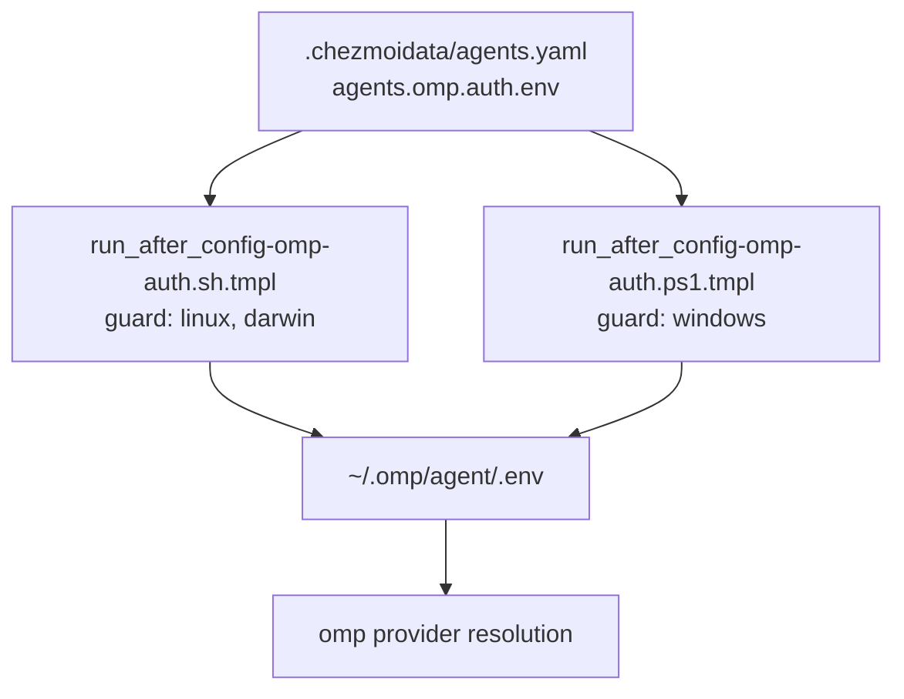

# omp OpenRouter and OpenCode Credentials - Plan

## Goal Capsule

- **Objective:** Add `OPENROUTER_API_KEY` and `OPENCODE_API_KEY` to the chezmoi-managed omp static-credential set, so every host provisioned from this repo can reach the `openrouter`, `opencode-zen`, and `opencode-go` providers.
- **Product authority:** This Product Contract and the dialogue behind it. Model policy — `modelRoles`, `task.agentModelOverrides`, `retry.fallbackChains` — is owned by `.agents/skills/sync-omp-models/SKILL.md` and is not active scope here.
- **Execution profile:** Two data entries, paired POSIX/PowerShell render-time validators, and one reconciliation test update.
- **Stop conditions:** Do not run a live `chezmoi apply` or modify deployed files during isolated verification. Do not change model routing, catalog bounds, or the encrypted secrets bundle.
- **Open blockers:** None. Both 1Password items exist, both values are already cached in the committed secrets bundle, and no repo file currently references either variable.

---

## Product Contract

### Summary

Declare two more static API keys in `agents.omp.auth.env` and widen the provisioners' closed allowlist from two names to four. The keys make three additional model providers reachable on every host; nothing routes to them until a later change says so.

### Problem Frame

omp reaches six providers on this host today: five OAuth plans stored in `~/.omp/agent/agent.db`, plus `zai` from a static key in `~/.omp/agent/.env`. OpenRouter and OpenCode subscriptions already exist and their keys already sit in 1Password, but no host can use them — omp only sees a provider when its key is present, and the repo declares neither variable.

The credential path is deliberately narrow. `agents.omp.auth.env` is validated against a hardcoded allowlist in both provisioners rather than a name-shape regex, because a shape check would let a data edit inject an arbitrary variable such as `HTTP_PROXY` or `NODE_OPTIONS` into the environment omp loads for every session (`docs/plans/2026-07-29-004-feat-omp-model-roles-native-exa-plan.md:240`). Widening that allowlist is the designed extension path, but the accepted set is written out twice per file — once as the enforced list and once as English inside the failure message — across a POSIX and a PowerShell template that must agree. Each widening therefore has four places to drift, and a missed PowerShell edit fails only at render on Windows, invisibly from a Linux host.

### Key Decisions

- KD1. **Declare the keys in the managed closed set rather than hand-editing the deployed dotenv.** (session-settled: user-directed — chosen over two hand-typed lines in `~/.omp/agent/.env`, which the provisioner would have preserved indefinitely: the host set is plural and provisioning must repeat.) Governs R1, R5.
- KD2. **Credentials only; model routing is untouched.** (session-settled: user-directed — chosen over also placing the providers in roles or fallback chains: reachability is wanted now, routing when a use case names a model.) Governs R3.
- KD3. **Accept the full added catalog instead of bounding it.** (session-settled: user-directed — chosen over an `enabledModels` allow-list or disabling `opencode-zen`: nothing auto-routes to a metered provider, so there is no spend to bound.) Governs R4.
- KD4. **Widen the enforced list and derive the failure message from it.** (session-settled: user-directed — chosen over retyping the literal in both files, and over hoisting the duplicated validation into a shared partial: it removes two drift points without refactoring a security-critical validator inside a credential change.) Governs R6, R10.

<!-- ce-section: work-relationships -->
### How This Work Fits Together

This plan owns credential availability only. The breakdown below is how the surrounding work is currently understood, not a committed roadmap; a later plan may revise, split, or discard any of it.

- Credential availability (this plan) — declares the two keys and widens the allowlist.
  - Enables model-routing work: no role or fallback chain can name `openrouter` or `opencode-go` until their keys resolve.
  - Shares the provisioner pair and `.ci/test-omp-agent-reconcile.sh` with any future credential addition.
- Model routing — owned by `.agents/skills/sync-omp-models/SKILL.md`. Depends on this plan. Still to decide: whether either provider earns a role or a chain hop at all.
- Catalog bounding — `enabledModels` or `disabledProviders`. Can proceed independently of routing. Still to decide: whether the added catalog size becomes a problem in practice.
- Shared-validator extraction — collapsing the duplicated render-time validation into one partial. Can proceed independently of all of the above.

### Requirements

**Credential declaration**

- R1. `agents.omp.auth.env` in `.chezmoidata/agents.yaml` declares `OPENROUTER_API_KEY` from `op://Private/OpenRouter/API Key` and `OPENCODE_API_KEY` from `op://Private/Opencode/API Key`, alongside the existing `ZAI_API_KEY` and `EXA_API_KEY` entries.
- R2. The explanatory comment above that map states the current four-variable set and records that one `OPENCODE_API_KEY` serves both `opencode-zen` and `opencode-go`.

**Routing boundary**

- R3. No `modelRoles`, `task.agentModelOverrides`, or `retry.fallbackChains` entry names `openrouter`, `opencode-zen`, or `opencode-go`.
- R4. `enabledModels` and `disabledProviders` remain empty, leaving the added catalog selectable and unbounded.

**Provisioner contract**

- R5. `.chezmoiscripts/70-agents/run_after_config-omp-auth.sh.tmpl` and `.chezmoiscripts/70-agents/run_after_config-omp-auth.ps1.tmpl` accept exactly the same four variables, and each rejects any other name at render time.
- R6. Each provisioner's out-of-set failure message names the accepted set by deriving it from the enforced list, so the message cannot disagree with what is enforced.
- R7. Each provisioner still fails the render when a required variable is absent, when a variable is declared twice, or when a declared `op://` reference resolves to a non-string or empty value.
- R8. The reconciled `~/.omp/agent/.env` holds exactly one assignment per managed variable and carries every unmanaged line through unchanged. The POSIX output is mode `0600`; Windows preserves its existing platform-specific file behavior. A final unmanaged assignment written without a trailing newline gains one; that is existing behavior and is not a regression to fix here.

**Verification**

- R9. `.ci/test-omp-agent-reconcile.sh` asserts exactly one `OPENROUTER_API_KEY=` line and one `OPENCODE_API_KEY=` line in addition to its existing per-variable assertions.
- R10. The suite's negative render cases still fail for a name outside the set, for an empty `env` list, for a duplicated variable, and for empty or non-string resolved keys. The out-of-set case asserts the derived message rather than a hardcoded two-name string on both OS templates.
- R11. After an apply, `omp models` reports `openrouter`, `opencode-zen`, and `opencode-go` in addition to the six providers already available.

### Key Flows

One data entry fans out to two OS-gated validators and one deployed file, which is why R5 pairs the two templates rather than treating them independently.

- F1. Declared credential reaches a provider
  - **Trigger:** `chezmoi apply` on any host.
  - **Steps:** The provisioner matching the host OS renders; it validates every declared entry against the allowlist and resolves each `op://` reference cache-first; a rendering failure aborts the apply. The rendered script then rewrites `~/.omp/agent/.env`, replacing managed assignments and copying unmanaged lines through. omp reads that file at process start and offers each provider whose variable is present.
  - **Outcome:** `omp models` lists the provider.
  - **Covered by:** R5, R6, R7, R8, R11

### Acceptance Examples

- AE1. Provisioner halves disagree
  - **Covers R5.**
  - **Given** the POSIX template accepts four names and the PowerShell template still accepts two,
  - **When** `chezmoi apply` runs on Windows,
  - **Then** the render fails on the first undeclared-name check and the apply aborts before writing anything. The same source renders cleanly on Linux, so the defect is invisible from a Linux host.

- AE2. Out-of-set variable stays rejected
  - **Covers R6, R10.**
  - **Given** `agents.omp.auth.env` declares `NODE_OPTIONS`,
  - **When** the provisioner renders,
  - **Then** it fails, and the diagnostic names the four accepted variables because it was derived from the enforced list.

- AE3. Unmanaged dotenv content survives
  - **Covers R8, R9.**
  - **Given** an existing `~/.omp/agent/.env` holding a comment, an unrelated assignment, and a stale duplicate of a managed variable,
  - **When** the reconcile script runs,
  - **Then** the comment and unrelated assignment are unchanged, and each managed variable appears exactly once.

- AE4. Providers become reachable
  - **Covers R11.**
  - **Given** an apply that reconciled all four variables,
  - **When** `omp models` runs,
  - **Then** it reports nine providers, and no role or fallback chain selects one of the three new ones.

### Scope Boundaries

- Model routing — placing these providers in `modelRoles` or `retry.fallbackChains`.
- Catalog bounding — `enabledModels`, `disabledProviders`, `providers.openrouterVariant`.
- Hoisting the roughly twenty duplicated validation lines out of the two provisioners into a shared `.chezmoitemplates` partial. Worth doing on its own; not inside a credential change.
- Refreshing `.chezmoitemplates/secrets-bundle.json.asc`. It is stale only in the harmless extra-refs direction and both values it holds for these refs are current.
- `agents.omp.models.providers` stays `{}`, leaving omp's built-in catalog unchanged.
- The OAuth credential inventory in `~/.omp/agent/agent.db`. It was read during this brainstorm and is a point-in-time diagnostic — access tokens there expire within hours — so it is not recorded as a durable requirement.

### Dependencies / Assumptions

- Both 1Password items exist in the `Private` vault with a populated `API Key` field, verified 2026-08-01.
- Both `op://` references are already keys in the committed `.chezmoitemplates/secrets-bundle.json.asc`, and their cached values are digest-identical to the live 1Password values. Non-Windows hosts with the GPG readiness marker resolve cache-first; Windows uses the existing live-`op` fallback because the readiness probe is POSIX-only. The change needs no `chezmoi-secrets-sync` run.
- omp 17.2.2 maps `OPENROUTER_API_KEY` to `openrouter` and a single `OPENCODE_API_KEY` to both `opencode-zen` and `opencode-go`. There is no env-layer way to enable one of the two OpenCode providers without the other.
- Root `AGENTS.md` describes the credential set only as "a closed set" and names no variables, so no repo rule goes stale when the set grows.

### Sources / Research

- `.chezmoiscripts/70-agents/run_after_config-omp-auth.sh.tmpl:1-23` and `.chezmoiscripts/70-agents/run_after_config-omp-auth.ps1.tmpl:1-23` — the OS guards, the enforced list on line 3, and the hardcoded message on line 12 in each file.
- `.chezmoiscripts/70-agents/run_after_config-omp-auth.sh.tmpl:90` — the line that carries unmanaged dotenv assignments through.
- `.ci/test-omp-agent-reconcile.sh:32-37` — positive assertions on mode and per-variable line counts; `:290-298` — negative render cases for an out-of-set name, an empty `env` list, and a duplicate.
- `.github/workflows/ci.yml:54-68` renders the POSIX provisioner behind a stub `op`; `:80-88` invokes the reconcile test with the rendered script.
- `.chezmoidata/agents.yaml:436-451` — the current `agents.omp.auth.env` map and the comment that states the closed-set contract.
- `docs/plans/2026-07-29-004-feat-omp-model-roles-native-exa-plan.md:240` — why a name-shape regex was rejected in favor of an allowlist; commit `9045314` is the last widening, from one name to two.
- omp documentation `providers.md:88,128` — the provider-to-variable map, corroborated by `environment-variables.md:65,73`.

---

## Planning Contract

### Key Technical Decisions

- KTD1. **Keep the allowlist explicit in both OS templates.** Use the same four-name `$required` list in the POSIX and PowerShell templates. Chosen over a name-shape rule because the allowlist is the security boundary for variables loaded by every omp session.
- KTD2. **Derive the diagnostic from the enforced list.** Pass `join ", " $required` to the unsupported-variable error in both templates. Chosen over a second literal because the validator and its diagnostic must not drift.
- KTD3. **Assert the complete derived list in the negative render case.** Expect the four names in their enforced order. Chosen over a stable prefix because this test must prove that a widened list reaches the user-facing diagnostic.
- KTD4. **Preserve the duplicated OS validators.** Update both templates directly instead of extracting a shared partial. Chosen because the change is a narrow credential extension and a shared security validator would expand the review surface.

### Technical Design

`agents.omp.auth.env` remains the data source for the rendered credential values. Each OS template keeps its existing render-time shape checks, duplicate detection, required-variable checks, and cache-first `op://` resolution. The only validator changes are the two added names and the derived closed-set text.

The POSIX and PowerShell templates must render the same four managed names in the same order. The generated scripts continue to replace managed assignments, preserve comments and unrelated dotenv lines, reject malformed input, write exactly one assignment per managed name, and preserve their existing platform-specific file mode and newline behavior.

The provider boundary is environmental only. `OPENROUTER_API_KEY` enables `openrouter`; `OPENCODE_API_KEY` enables both `opencode-zen` and `opencode-go`. No provider is added to `modelRoles`, `task.agentModelOverrides`, `retry.fallbackChains`, `enabledModels`, or `disabledProviders`.

The isolated provider probe runs `omp models` from a clean scratch HOME with the two variable names supplied in the process environment. It proves catalog discovery without a live apply or a billable model request. A configured-host post-apply probe remains the deployment handoff for R11.

### Sequencing

1. Extend the data map and both render-time allowlists and diagnostics while preserving each platform's existing file-protection behavior.
2. Extend the positive, parity, and negative reconciliation assertions for both templates.
3. Render both platform templates and run the isolated reconciliation and provider-discovery checks.
4. Record the configured-host post-apply `omp models` result only when an approved deployment environment is available.

### Risks and Dependencies

- The two `op://` references must resolve to non-empty strings through the existing secret cache on supported non-Windows hosts or the live-`op` fallback on Windows and in the test stub. The plan does not refresh the encrypted bundle.
- CI executes the POSIX reconciler and self-renders the PowerShell auth template for parity and negative cases. The Bash harness does not execute Windows-specific permission behavior, and no new Windows permission contract is in scope.
- The installed omp version must retain the documented provider mappings. A mismatch must fail the isolated or manual `omp models` probe rather than trigger model-routing changes inside this plan.
- `omp models` proves provider discovery, not third-party credential validity. A real authenticated request is intentionally excluded because it can incur provider cost and is not required to change routing.

---

## Implementation Units

### U1. Extend the omp static credential contract

- **Goal:** Declare both provider keys and make the POSIX and PowerShell validators accept exactly the same four variables.
- **Requirements:** R1, R2, R3, R4, R5, R6, R7, R8. Implements KD1, KD2, KD3, KD4 and KTD1-KTD4.
- **Dependencies:** None.
- **Files:** `.chezmoidata/agents.yaml`, `.chezmoiscripts/70-agents/run_after_config-omp-auth.sh.tmpl`, `.chezmoiscripts/70-agents/run_after_config-omp-auth.ps1.tmpl`.
- **Approach:** Add the `OPENROUTER_API_KEY` and `OPENCODE_API_KEY` records with the exact `op://Private/.../API Key` references. Update the explanatory comment to state the four-variable set and the shared OpenCode key. Extend each `$required` list to four names. Build the unsupported-variable message with `join ", " $required`. Keep all existing validation and reconcile logic unchanged.
- **Patterns to follow:** The existing `list`, `has`, `append`, and `join` template idioms in the two provisioners and `.chezmoitemplates/agent-mcp-servers-json.tmpl`.
- **Test scenarios:** Render the POSIX and PowerShell templates with a stubbed secret resolver that returns distinct sentinels per `op://` URI. Confirm both templates embed the intended sentinel under each variable and the same ordered names. Render an out-of-set variable, an empty list, a duplicate, an empty key, and a non-string key and confirm both templates reject each before writing a target.
- **Verification:** `chezmoi execute-template` for both OS gates with `--source "$PWD"` and a URI-aware newline-free `op` stub; `bash -n` on the rendered POSIX script; use the repository's explicit PowerShell parser or analyzer against the rendered auth script; compare the two rendered managed-name sets and values.

### U2. Extend reconciliation and negative-render assertions

- **Goal:** Prove that the new managed assignments are written exactly once, that both OS validators stay in parity, and that the provider catalog exposes the three requested providers without changing routing.
- **Requirements:** R5, R6, R9, R10, R11. Implements KTD2 and KTD3.
- **Dependencies:** U1.
- **Files:** `.ci/test-omp-agent-reconcile.sh`, `.github/workflows/ci.yml`, `.github/workflows/render-dotfiles.yml`.
- **Approach:** Render the Windows auth template in the CI job with `chezmoi.os=windows` and pass it to the reconciliation harness beside the POSIX auth script. Compare the rendered POSIX `MANAGED_NAMES` and PowerShell `$managedNames` sequences with the exact ordered four-name set. Run the out-of-set, empty-list, duplicate, empty-key, and non-string-key render negatives against both source templates and assert the complete joined four-name diagnostic. Add the Windows auth output to the native render workflow survivor/error assertion so an `auth.ps1.render-error.txt` cannot be accepted. Add one positive line-count assertion for each new variable beside the existing Z.ai and Exa assertions. Keep the real `omp models` provider probe outside CI because the job has no pinned omp binary; run that probe separately under the Verification Contract with distinct process-level sentinels. Leave the malformed dotenv, symlink, and unrelated-line preservation cases unchanged.
- **Patterns to follow:** The existing settings parity comparison in `.ci/test-omp-agent-reconcile.sh:204-212`, the `grep -c` exact assignment counts, the `assert_render_fails` helper, and the Windows survivor loop in `.github/workflows/render-dotfiles.yml:798-807`.
- **Test scenarios:** A fresh fixture receives exactly one assignment for each of four managed names and preserves the comment and unrelated token. Every listed render-negative input fails on both templates with its existing diagnostic. A rendered Windows auth file is a required survivor in the native render job. The separately run real provider probe reports all three new providers and no routing or catalog-bound setting names them.
- **Verification:** Run `.ci/test-omp-agent-reconcile.sh` against freshly rendered POSIX and Windows auth, plugin, haptic, and settings scripts through the existing isolated harness and confirm the four assignment counts, both-template parity, exact sentinel mapping, and all render negatives pass. The Bash harness does not execute the PowerShell file or claim Windows-specific file-mode behavior.

---

## Verification Contract

- **Render credentials:** Use the isolated `chezmoi execute-template` recipe from `AGENTS.md` with `--source "$PWD"`, an empty config, a scratch `HOME`, and a URI-aware `op` stub that emits distinct newline-free sentinels for the OpenRouter and OpenCode references. Render the POSIX auth script normally and the PowerShell auth script with `--override-data '{"chezmoi":{"os":"windows"}}'`. Assert the decoded rendered assignments map each variable to its intended sentinel.
- **Exercise the cache path:** In a separate scratch HOME, create the readiness marker and pass the authorized GPG config described in `AGENTS.md`. Make the `op` stub fail if called. Render both auth templates and assert the managed-name sets and intended assignment mapping, proving that both `op://` entries decrypt from the committed bundle. If the host cannot exercise the imported-key path, record that as a verification exception; do not claim cache coverage from the live fallback.
- **Check platform parity:** Extract the rendered managed-name arrays from both scripts and assert the same ordered four-name set: `ZAI_API_KEY`, `EXA_API_KEY`, `OPENROUTER_API_KEY`, `OPENCODE_API_KEY`. Assert both source templates pass `join ", " $required` to the unsupported-variable diagnostic so a later allowlist edit cannot leave a hardcoded message.
- **Check syntax:** Run `bash -n` on the rendered POSIX script. Use the repository's explicit `Invoke-ScriptAnalyzer -Path <rendered-auth.ps1>` check when the Windows workflow is available; otherwise use `[System.Management.Automation.Language.Parser]::ParseFile` in `pwsh -NoProfile -NonInteractive` and fail on returned parse errors.
- **Run reconciliation coverage:** Run `.ci/test-omp-agent-reconcile.sh` with freshly rendered POSIX auth, Windows auth, plugin, haptic, and settings scripts, as `.github/workflows/ci.yml` does. The test must pass its positive four-variable assertions, parity check, exact sentinel mapping, and all render negatives. The Bash harness does not execute the PowerShell file.
- **Check provider reachability:** With the real installed omp binary, create an empty scratch working directory and run `env -i HOME="$scratch/home" PATH="$PATH" OPENROUTER_API_KEY='openrouter-probe' OPENCODE_API_KEY='opencode-probe' omp models --json --no-extensions` from that directory. Ensure `PI_CODING_AGENT_DIR`, `OMP_AGENT_ENV`, and other omp path overrides are unset. Confirm `openrouter`, `opencode-zen`, and `opencode-go` appear alongside the existing catalog. A configured-host post-apply result is a deployment handoff, not a live apply in this source-only run.
- **Check routing boundary:** Compare the semantic `agents.omp.settings` snapshot before and after the data edit and assert no change under `modelRoles`, `task.agentModelOverrides`, `retry.fallbackChains`, `enabledModels`, `disabledProviders`, or `providers.openrouterVariant`; also assert the three new provider names are absent from routing fields.
- **Check scope:** Run `git diff --check`, `git status`, and a scoped diff. Only the data map, the two auth templates, the reconcile test, the two workflow assertions, and this plan may change.
- **CI gate:** If pushed, `.github/workflows/ci.yml` and `.github/workflows/render-dotfiles.yml` must reach terminal success.

---

## Definition of Done

- The data map declares both keys with the required 1Password references and the comment documents the four-variable closed set and shared OpenCode key.
- Both OS provisioners accept exactly the same four variables, derive their unsupported-variable diagnostics from that list, and preserve existing dotenv content, file-mode, and newline behavior.
- The isolated reconciliation test proves one assignment per managed variable, POSIX mode `0600`, unmanaged-line preservation, malformed and symlink safety, empty-list, duplicate, empty-key, and non-string-key rejection, platform parity, exact sentinel mapping, and the full derived out-of-set diagnostic. The Bash harness does not claim Windows-specific file-mode behavior.
- The real installed omp provider probe confirms the three requested providers from a clean environment, and the configured-host post-apply result is recorded when an approved deployment environment is available, without any model-routing or catalog-bound changes.
- Render, cache-path or documented cache exception, syntax, reconciliation, scope, and applicable CI checks pass.
- No abandoned experiment, placeholder, fallback, or unrelated refactor remains in the diff.
