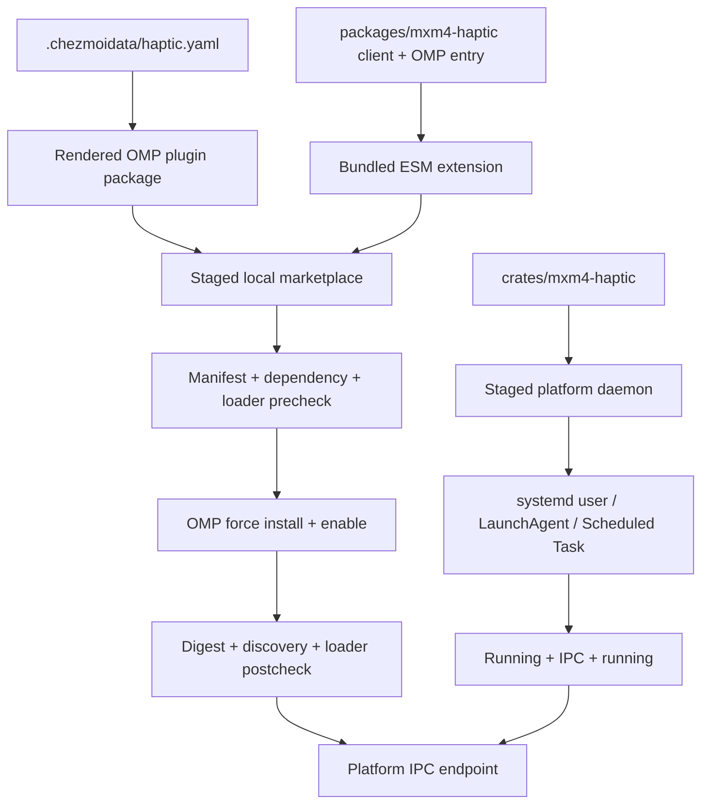

# Cross-Platform OMP Haptic Plugin - Plan

## Goal Capsule

- **Objective:** Replace OMP's binary-launching haptic extension with a bundled OMP plugin that uses `@h82/mxm4-haptic`, and deploy the daemon for user-session startup on Linux, macOS, and Windows.
- **Product authority:** The Product Contract owns user-visible behavior and platform scope. Session-settled decisions outrank implementation convenience. The Planning Contract owns packaging, reconciliation, startup, and verification mechanisms within those requirements.
- **Stop conditions:** Stop if OMP v17.2.4 cannot load the bundled client, the Rust daemon cannot run without elevation on a supported platform, or implementation evidence invalidates a session-settled decision. Do not replace these requirements with a soft-skip path.
- **Execution profile:** Deep cross-platform code and provisioning change. Use isolated render, loader, IPC, and service-manager fixtures before any hardware smoke. Never run a live `chezmoi apply` during verification.
- **Tail ownership:** The implementing workflow owns code, isolated verification, cleanup, review fixes, commit, push, PR creation, and CI. A human owns the final physical-vibration smoke on each desktop platform.

---

## Product Contract

### Summary

Provide one self-contained OMP haptic plugin and one cross-platform daemon deployment contract.
The plugin uses `@h82/mxm4-haptic` directly and preserves the current completion, failure, question, headless, and silent-delivery-failure behavior on Linux, macOS, and Windows.

### Problem Frame

OMP currently renders a native TypeScript extension that launches the Rust `mxm4-haptic` command for every pulse.
The existing `@h82/mxm4-haptic` package already implements the portable daemon IPC client, but no source consumer imports it and current dotfiles provisioning does not install it.
The current OMP extension is also excluded on Windows, while the TypeScript client and daemon protocol define a Windows named-pipe path.
This split leaves OMP on a separate transport path and prevents one deployment contract from covering all supported desktop platforms.

### Key Decisions

- **Ship a bundled OMP plugin.** Use `@h82/mxm4-haptic` as the build input for a self-contained plugin instead of keeping a path-coupled native extension or publishing the package independently. Governs R1-R3. (session-settled: user-directed — chosen over adjacent-module deployment and independent package publication: bundling gives OMP a reliable runtime dependency without a separate package release.)
- **Own the complete desktop runtime.** Include daemon installation and user-session startup on Linux, macOS, and Windows instead of treating daemon availability as an external prerequisite. Governs R7-R9. (session-settled: user-directed — chosen over plugin-only cross-platform support: the user wants working haptics on every daemon-supported desktop platform.)
- **Keep runtime delivery failures silent.** Preserve optional, non-fatal haptics instead of showing first-failure or per-failure notifications. Governs R6. (session-settled: user-directed — chosen over visible runtime diagnostics: haptic delivery failure must not interfere with an agent turn.)
- **Fail incomplete deployment.** Treat daemon or plugin build, installation, reconciliation, and startup failures as apply failures instead of warnings. Governs R10. (session-settled: user-directed — chosen over soft continuation: a successful apply must not leave a partially installed haptic runtime.)

### Requirements

**Plugin packaging and migration**

- R1. The OMP haptic integration must be an installable OMP plugin whose runtime haptic client comes from `@h82/mxm4-haptic`.
- R2. The installed plugin must be self-contained and must not require the workspace package, a global JavaScript package, or the Rust `mxm4-haptic` command at runtime.
- R3. OMP's native marketplace and plugin lifecycle must install, enable, and reconcile the plugin on Linux, macOS, and Windows.
- R4. The new plugin must replace the current OMP haptic extension in one clean cutover, with no compatibility shim or duplicate event handlers.
- R5. Containers must remain excluded because the haptic device and daemon are not available there.

**Runtime behavior**

- R6. A haptic delivery error must not propagate, fail an agent turn, produce an unhandled rejection, or create an OMP user notification.
- R7. The plugin must preserve the configured settled, failed, and question waveforms and reject invalid configured waveform names before deployment.
- R8. The settled or failed waveform must fire only at the end of a UI-backed agent run, with the failed waveform selected when the last recorded numeric provider response indicates failure.
- R9. The question waveform must fire only for the OMP ask tool in a UI-backed context, using case-insensitive tool-name matching.

**Daemon deployment**

- R10. A successful chezmoi apply must build and validate both artifacts; install, configure, start, and reconcile the daemon; and install, enable, reconcile, and loader-verify the plugin for the current supported desktop platform. Failure of any required stage must fail the apply and name that stage.
- R11. The daemon must start automatically in the user's desktop session on Linux, macOS, and Windows without requiring a privileged system service.
- R12. The plugin and daemon must use the platform endpoint defined by `@h82/mxm4-haptic`: `XDG_RUNTIME_DIR` on managed Linux, per-user `TMPDIR` on managed macOS, and the named pipe on Windows.
- R13. Reapplying unchanged source must be idempotent, while changes to the client package, plugin, daemon, event configuration, or startup definition must reconcile only the affected runtime.

### Key Flows

- F1. Cross-platform installation
  - **Trigger:** Managed source for the plugin, client, daemon, configuration, or startup definition changes.
  - **Actors:** Chezmoi, the build toolchain, OMP, and the platform user-session manager.
  - **Steps:** Build and validate both staged artifacts. In phase 60, deploy the bundle and install, register, start, and verify the platform daemon. In phase 70, install, enable, and verify the OMP plugin; remove the legacy extension only after replacement proof; then verify one fresh-loader haptic owner.
  - **Outcome:** The current platform has one enabled OMP haptic plugin and one running user daemon. Any incomplete required stage fails the apply.
  - **Covers:** R1-R5, R10-R13.
- F2. Agent event delivery
  - **Trigger:** A supported OMP lifecycle or ask-tool event occurs.
  - **Actors:** OMP, the bundled plugin, `@h82/mxm4-haptic`, and the daemon.
  - **Steps:** Check for a UI-backed context, select the configured waveform, await the bounded client send, and absorb any delivery error.
  - **Outcome:** The daemon receives the waveform, or the plugin remains silent without failing the turn.
  - **Covers:** R6-R9, R12.

### Acceptance Examples

- AE1. **Covers R3, R8, R11, R12.** Given a Linux, macOS, or Windows desktop where deployment registered native user-session startup, when a new desktop session begins and a UI-backed OMP run ends successfully, then the manager-started daemon receives the configured settled waveform through that platform's endpoint.
- AE2. **Covers R6.** Given the daemon is absent, stopped, unreachable, or times out, when a supported event fires, then the OMP turn completes without a propagated error, unhandled rejection, or visible haptic warning.
- AE3. **Covers R8, R9.** Given OMP runs without a UI context, when an agent ends or the ask tool runs, then the plugin sends no haptic command.
- AE4. **Covers R8.** Given the last recorded numeric provider response indicates failure, when the UI-backed agent run ends, then the configured failed waveform is selected instead of the settled waveform.
- AE5. **Covers R9.** Given a UI-backed tool call whose name differs from `ask` only by letter case, when the call begins, then the configured question waveform is sent; unrelated tools send nothing.
- AE6. **Covers R4.** Given migration has completed and a fresh OMP process starts, then only the bundled plugin owns OMP haptic events and no handler launches the Rust client command.
- AE7. **Covers R10.** Given any required build, validation, installation, reconciliation, startup, readiness, digest, or loader stage fails, when chezmoi applies the change, then the apply exits unsuccessfully and identifies the failing deployment stage.
- AE8. **Covers R13.** Given the deployed source and configuration are unchanged, when chezmoi applies again, then it preserves one plugin installation and one daemon startup registration without duplicate handlers or services.
- AE9. **Covers R3, R13.** Given plugin content changes without a version change, when reconciliation runs, then the installed bundle digest changes to the expected digest and the plugin remains enabled exactly once.

### Scope Boundaries

- Do not publish `@h82/mxm4-haptic` or create an independent package release lifecycle for this work.
- Do not add new OMP haptic events, waveform choices, model-visible tools, commands, prompts, or user-facing haptic settings.
- Do not enable haptics in containers.
- Do not change Claude, Codex, Solaar, or other consumers that still use the Rust client command.
- Do not add privileged system-wide daemon installation or user lingering.
- Do not add teardown scripts or rollback orchestration. Failed applies must converge on a later reapply.

### Dependencies / Assumptions

- OMP v17.2.4 is the pinned loader and marketplace contract for this change.
- The Rust daemon remains a foreground, manager-owned process on each platform.
- Automated readiness proves stable manager state and endpoint acceptance, not HID receiver presence or physical vibration.
- A process that loaded the legacy extension before migration must restart before the clean-cutover result is observable.

### Sources / Research

- `dot_omp/private_agent/extensions/mxm4-haptic.ts.tmpl` — current OMP event mapping, UI gate, binary launch, and silent failure behavior.
- `packages/mxm4-haptic/src/index.ts` and `packages/mxm4-haptic/package.json` — portable IPC client contract and current private package boundary.
- `.chezmoiscripts/60-build/run_after_build-mxm4-haptic.sh.tmpl` — current Linux and macOS daemon build and startup ownership.
- `.chezmoiscripts/70-agents/run_onchange_after_update-omp-plugins.sh.tmpl` — current OMP marketplace reconciliation pattern.
- `.ci/test-omp-haptic-extension.ts` — current observable OMP haptic behavior.
- `docs/plans/2026-07-29-001-feat-add-oh-my-pi-agent-plan.md` — prior OMP extension and marketplace decisions.
- [OMP v17.2.4 marketplace contract](https://github.com/can1357/oh-my-pi/blob/v17.2.4/docs/marketplace.md) and [extension loading contract](https://github.com/can1357/oh-my-pi/blob/v17.2.4/docs/extension-loading.md).
- [systemd service semantics](https://www.freedesktop.org/software/systemd/man/latest/systemd.service.html), [Apple LaunchAgents guidance](https://developer.apple.com/library/archive/documentation/MacOSX/Conceptual/BPSystemStartup/Chapters/CreatingLaunchdJobs.html), and [Microsoft logon task guidance](https://learn.microsoft.com/en-us/windows/win32/taskschd/starting-an-executable-when-a-user-logs-on).

---

## Planning Contract

### Key Technical Decisions

- KTD1. **Use one OMP-native local marketplace identity.** Use marketplace `h82-dotfiles`, catalog plugin `mxm4-haptic`, and deployed package name `@h82/omp-mxm4-haptic`. Deploy a repository-owned `.omp-plugin/marketplace.json` whose package `package.json#omp.extensions` points to bundled ESM JavaScript. The deployed package is not a publication of the private source package `@h82/mxm4-haptic`. Use OMP-native fields instead of legacy `.claude-plugin` and `pi` compatibility paths. Governs R1-R3.
- KTD2. **Bundle the client into the extension artifact.** Build the OMP entry from `packages/mxm4-haptic` so relative client code is included and only `node:` built-ins remain external. Do not ship a runtime `node_modules` tree. Governs R1-R2. (session-settled: user-directed — chosen over adjacent-module deployment and independent package publication: the plugin must resolve without a separate package installation or release.)
- KTD3. **Render runtime waveform configuration into the plugin package.** Keep `.chezmoidata/haptic.yaml` authoritative, validate its waveform names at render time, and make the installed plugin read only its validated local package configuration. Do not duplicate editable waveform values in TypeScript. Governs R7.
- KTD4. **Validate the complete plugin payload before and after OMP mutation.** Before install, require valid catalog and package manifests, existing declared entries, dependency closure, and a loadable factory. Define one canonical payload digest over ordered relative paths and bytes for the rendered package manifest and every declared extension entry. After force-install, resolve the canonical module path through pinned OMP, prove it is inside OMP's reported installed package, compare the complete payload digest, require enabled state, one discovered entry, no loader errors, and the expected event registrations. Marketplace install success alone is insufficient. Governs R3, R10, R13.
- KTD5. **Separate build and reconcile phases and component fingerprints.** Phase 60 builds staged plugin and daemon artifacts and reconciles the platform daemon. Phase 70 reconciles OMP after the deployed bundle exists. Each platform has separate plugin and daemon/startup raw-input fingerprints and component stamps, so either component can converge without rebuilding or restarting the other. No onchange script fingerprints `dist/`, `target/`, rendered secrets, or other generated output. Governs R10, R13.
- KTD6. **Stage before changing live daemon manager state.** Chezmoi can write a managed startup-definition target before an after-script runs, but the manager retains its previously loaded definition until the provisioner validates the candidate and reaches the reload or registration commit boundary. Build the executable in scratch and validate every artifact plus startup definition before manager mutation. POSIX atomically replaces the installed binary before restarting the manager. Windows stops the task only after validation, replaces the locked executable, then registers and starts the task. A pre-commit failure makes no manager call; a later-stage failure does not roll back an already valid component. The next identical apply re-inspects state and converges. Governs R10, R13. (session-settled: user-directed — chosen over soft continuation: no eligible desktop may report a successful apply with an incomplete daemon deployment.)
- KTD7. **Use native user-session managers.** Linux uses a `Type=exec` systemd user service. macOS uses the existing `gui/$UID` LaunchAgent. Windows uses a current-user Task Scheduler logon task with `InteractiveToken`, `LeastPrivilege`, one-instance behavior, unlimited execution time, battery operation, and bounded restart-on-failure. Governs R10-R12. (session-settled: user-directed — chosen over plugin-only platform support: daemon installation and automatic startup are part of the same deliverable.)
- KTD8. **Define readiness as stable lifecycle plus owned IPC.** Require manager-owned running state, connect-and-close acceptance on the exact managed endpoint, and a second manager-state check after connection. On Windows, the daemon must reserve the first named-pipe instance for its full lifetime and use a security descriptor limited to the current-user SID plus required system principals. Do not send a waveform or require hardware presence during apply. Governs R10-R12.
- KTD9. **Keep delivery errors inside the event boundary.** Await `sendCommand` so socket writes flush, catch the full bounded send, and never call an OMP notification surface. Loader, manifest, registration, and configuration failures remain deployment errors. Governs R6-R9. (session-settled: user-directed — chosen over visible runtime diagnostics: delivery failure stays silent while deployment failure remains observable.)
- KTD10. **Commit the clean cutover after replacement proof.** Stop managing the legacy source target, but let the phase-70 reconciler delete its known deployed path only after the replacement plugin passes install, enablement, canonical-path, complete-payload-digest, discovery, and loader postchecks. Then start a fresh loader and require one haptic owner. Do not use `.chezmoiremove`, a shim, or hot unregistration because those cannot enforce this migration order. Governs R4-R5, R10.
- KTD11. **Own enabled desired state.** Force-install same-version local content, explicitly enable the managed haptic plugin, and verify one enabled package. This work does not preserve a prior user-disabled haptic state because R3 requires an active managed integration. Governs R3, R13.

### High-Level Technical Design



### Output Structure

```text
packages/mxm4-haptic/
├── src/omp-plugin.ts                     # OMP event factory built with the client
└── test/omp-plugin.test.ts                # event and silent-delivery contract

dot_local/share/omp-plugins/
├── dot_omp-plugin/marketplace.json        # OMP-native local catalog
└── plugins/mxm4-haptic/
    ├── package.json.tmpl                  # omp.extensions + rendered waveform config
    └── dist/index.js                      # generated during phase 60; not committed

.chezmoiscripts/60-build/
├── run_after_build-mxm4-haptic.sh.tmpl
└── run_after_build-mxm4-haptic.ps1.tmpl
```

The generated bundle is copied into the deployed marketplace after chezmoi installs the static catalog and package skeleton.

### Implementation Constraints

- Use `packages/mxm4-haptic` as the only TypeScript client source. Keep `crates/mxm4-haptic/src/lib.rs` authoritative for waveform IDs and endpoint parity.
- Keep the Rust client binary because Solaar and other integrations remain in scope elsewhere. Only OMP stops launching it.
- Keep `mxm4-haptic-notify` Linux-only. Its optional notification bridge must not weaken the required daemon stages.
- Preserve POSIX and PowerShell parity for OMP reconciliation and daemon provisioning.
- Use shared marketplace data in `.chezmoidata/agents.yaml`. Do not hard-code a second OMP marketplace registry inside scripts.
- Treat missing cargo, Vite+, OMP, user-session manager, runtime directory, build output, or postcondition as a fatal stage on an eligible desktop.
- Require managed Linux `XDG_RUNTIME_DIR` and managed macOS `TMPDIR`. Do not accept `/tmp` fallback as successful managed deployment.
- Never hash or commit generated `dist/`, Rust `target/`, rendered secrets, or live OMP state.
- Do not run a real Open Design build, a real service start, or a live `chezmoi apply` in automated verification.

### Sequencing

1. U1 establishes a self-contained, testable plugin artifact and static marketplace contract.
2. U3 and U4 implement the platform phase-60 build, deployment, and daemon contracts in parallel.
3. U2 reconciles the phase-60 deployed marketplace through OMP and commits legacy removal after replacement proof.
4. U5 integrates cross-platform render, loader, provisioning, Rust, and CI gates after U1-U4 define their contracts.

### System-Wide Impact

- **Agent runtime:** OMP changes from a native extension plus subprocess to an installed in-process plugin plus IPC client. A fresh OMP process is required after migration.
- **Provisioning:** Haptic setup changes from best-effort to required on eligible desktops. A missing toolchain or session manager now stops apply.
- **Platform lifecycle:** Linux and macOS service definitions gain verified immediate-start semantics. Windows gains a new current-user scheduled task.
- **Other consumers:** Claude, Codex, Solaar, the notification bridge, and the Rust CLI keep their existing contracts.
- **Operations:** The daemon remains optional during ordinary OMP runtime, but its managed installation is no longer allowed to drift silently.

### Risks and Mitigations

- **OMP marketplace install does not validate extension factories.** Mitigate with staged and installed loader checks plus complete-payload digest equality under the pinned v17.2.4 contract.
- **Same-version local content can appear installed while stale files remain.** Mitigate with separate raw-source fingerprints, force-install, canonical loaded-path resolution, and a digest over the manifest plus every declared extension entry.
- **Windows Task Scheduler is new repository territory.** Mitigate with a current-user XML fixture, native `windows-latest` smoke, explicit task-property assertions, and no stored credentials or elevation.
- **A manager can report running before IPC is stable.** Mitigate with bounded endpoint connect-and-close followed by a second manager-state check.
- **The Windows named pipe is machine-global.** Support one current-user daemon owner per machine. Reserve the first pipe instance for the daemon lifetime and apply an explicit current-user security descriptor. A foreign prebound pipe must fail startup, and a different user must not write commands; both conditions converge after the collision or unauthorized client is removed.
- **A failed multi-component apply can leave partial valid state.** Mitigate through complete preflight before script-owned mutation, staging, atomic replacement, repeatable force reconciliation, no premature success marker, and retry convergence rather than rollback.
- **CI cannot prove physical vibration.** Keep transport and lifecycle automated; retain one manual hardware smoke per platform.

### Deferred Implementation Notes

- The implementer may choose the exact Vite+ multi-entry or dedicated-pack configuration, but the U1 output and dependency-closure checks are fixed by KTD2.
- Derive OMP's XDG-aware user plugin paths through OMP output or its pinned loader helpers. Do not hard-code `~/.omp/plugins`.
- Capture manager diagnostics on failure, but exact human-readable wording is implementation-time detail.

---

## Implementation Units

### U1. Build the client-backed OMP plugin

- **Goal:** Produce a self-contained OMP extension bundle and OMP-native local marketplace package from the existing TypeScript client.
- **Requirements:** R1-R3, R6-R9; F2; AE1-AE5, AE9.
- **Dependencies:** None.
- **Files:**
  - `packages/mxm4-haptic/src/omp-plugin.ts`
  - `packages/mxm4-haptic/test/omp-plugin.test.ts`
  - `packages/mxm4-haptic/vite.config.ts`
  - `packages/mxm4-haptic/package.json`
  - `dot_local/share/omp-plugins/dot_omp-plugin/marketplace.json`
  - `dot_local/share/omp-plugins/plugins/mxm4-haptic/package.json.tmpl`
  - `.chezmoidata/haptic.yaml`
- **Approach:**
  1. Add an OMP extension factory beside the client and import `sendCommand` from the package's client module.
  2. Preserve the current status reset, numeric-last-status, UI gate, case-insensitive ask, bounded await, and catch behavior under KTD9.
  3. Emit a bundled ESM entry that includes local client code and leaves only `node:` built-ins external.
  4. Add the OMP-native catalog and package manifest with the exact KTD1 identity tuple. Render validated waveform values into the package-local configuration from KTD3.
  5. Keep the existing library build, exports, waveform tests, and Rust drift guard intact.
- **Execution note:** Start with the event contract test, then prove bundle isolation outside the workspace before provisioning consumes it.
- **Patterns to follow:** `dot_omp/private_agent/extensions/mxm4-haptic.ts.tmpl` for behavior; `packages/mxm4-haptic/src/index.ts` for IPC; `dot_local/share/claude-plugins/dot_claude-plugin/marketplace.json` for local catalog ownership, adapted to the OMP-native manifest.
- **Test scenarios:**
  - Register the four current handlers and assert no tool, command, prompt, notification, or model-visible result is registered.
  - Reset status between runs; accept only numeric statuses; use the last numeric status; select failed for `>=400`; default to settled without a numeric status.
  - Send question only for string tool names equal to `ask` ignoring case; suppress unrelated, non-string, and headless calls.
  - Absorb missing socket, refused connection, timeout, early close, and synchronous delivery errors without an unhandled rejection or notification. Covers AE2.
  - Build the bundle, copy only the plugin package to an isolated directory without workspace modules or the Rust client on `PATH`, import it, and observe the exact newline-delimited waveform over a temporary endpoint.
  - Scan bundle imports and fail on any unresolved bare runtime import other than approved host built-ins.
  - Render an invalid configured waveform and fail before a bundle or marketplace mutation. Change only the rendered waveform configuration without changing the package version and require a different complete payload digest. Covers AE7, AE9.
- **Verification:** The package test suite passes, the normal library artifact remains valid, and the isolated OMP entry loads as one default-exported factory with bundled client code.

### U2. Reconcile the OMP marketplace and remove the legacy extension

- **Goal:** Install and enable the haptic plugin through OMP's user marketplace lifecycle, verify the installed loader state, and prune the prior native extension.
- **Requirements:** R3-R5, R10, R13; F1; AE6-AE9.
- **Dependencies:** U1, U3, U4.
- **Files:**
  - `.chezmoidata/agents.yaml`
  - `.chezmoiscripts/70-agents/run_onchange_after_update-omp-plugins.sh.tmpl`
  - `.chezmoiscripts/70-agents/run_onchange_after_update-omp-plugins.ps1.tmpl`
  - `.ci/test-omp-agent-reconcile.sh`
  - `.ci/test-omp-haptic-plugin.ts`
  - `dot_omp/private_agent/extensions/mxm4-haptic.ts.tmpl` (remove)
  - `.chezmoiignore`
  - `AGENTS.md`
- **Approach:**
  1. Add the OMP haptic marketplace and plugin to shared agent data with Linux, macOS, Windows, and container applicability.
  2. Generalize the two OMP reconcilers without changing compound-engineering's existing outcome.
  3. Complete a platform preflight before any script-owned mutation. Require eligible host gates, pinned OMP, writable user paths, the deployed phase-60 payload, and all loader tools.
  4. Validate the staged plugin under KTD4 before marketplace mutation, then add or update the marketplace, force-install at user scope, explicitly enable, and validate the canonical loaded path, complete payload digest, and loader state.
  5. Delete the known deployed legacy extension only after every replacement postcheck passes. Start a fresh loader and require one haptic owner.
  6. Make every unexpected command or postcondition failure fatal. Leave the run repeatable from partial state.
- **Execution note:** Prove the pinned OMP loader contract in an isolated data root before generalizing the live reconcile templates.
- **Patterns to follow:** Existing OMP POSIX/PowerShell reconcile pair; render-time marketplace validation in `.chezmoiscripts/70-agents/run_onchange_after_install-agent-plugins.sh.tmpl`; isolated OMP test setup in `.ci/test-omp-agent-reconcile.sh`.
- **Test scenarios:**
  - Install a temporary OMP-native marketplace with pinned OMP, discover the declared entry, load one factory with no loader errors, and observe the expected event registrations.
  - Prove marketplace install alone accepts a missing or invalid entry, while the managed precheck and postcheck reject it and name the failed stage.
  - Change bundle bytes, package manifest bytes, and rendered waveform configuration independently without changing package version. Force-reconcile and require complete installed payload equality plus one enabled plugin. Covers AE9.
  - Seed staged, legacy, and duplicate installed copies. Require the fresh loader to report one owner whose canonical loaded path is inside the digest-verified installed package.
  - Inject preflight, marketplace add, install, enable, canonical-path, payload-digest, discovery, and loader errors. Each exits nonzero, preserves the legacy target until all replacement postchecks pass, and leaves the next identical run able to converge. Covers AE7.
  - Seed the legacy target, reconcile twice, and assert it is removed only after replacement proof, no Rust command handler remains, and one plugin registration remains. Covers AE6, AE8.
  - Render a container and assert it installs neither the haptic marketplace, plugin, legacy migration, nor daemon assets.
  - Exercise both POSIX and PowerShell render/reconcile paths while preserving compound-engineering installation.
- **Verification:** A fresh isolated OMP process loads one enabled haptic plugin from the canonical path inside the expected complete-payload digest; the legacy target is absent; repeat reconciliation is singular and deterministic.

### U3. Make Linux and macOS daemon provisioning fatal and verifiable

- **Goal:** Replace best-effort POSIX daemon setup with staged, hard-fail build, install, startup, and readiness reconciliation.
- **Requirements:** R10-R13; F1; AE1, AE7, AE8.
- **Dependencies:** U1.
- **Files:**
  - `.chezmoiscripts/60-build/run_after_build-mxm4-haptic.sh.tmpl`
  - `dot_config/systemd/user/mxm4-hapticd.service.tmpl`
  - `Library/LaunchAgents/dev.h82.mxm4-hapticd.plist`
  - `.ci/test-mxm4-haptic-provision.sh`
  - `.chezmoidata/haptic.yaml`
- **Approach:**
  1. Define separate plugin and daemon/startup raw-input fingerprints and component stamps under KTD5 while retaining one ordered phase-60 owner.
  2. Complete a platform preflight before script-owned mutation. Require Vite+, cargo, writable user paths, the managed runtime endpoint environment, and a reachable native user-manager domain.
  3. Build the plugin bundle and Rust daemon in staging. Validate all required outputs before replacing installed state.
  4. On Linux, use `Type=exec`, reload, enable, start or restart on change, and require enabled, active, exact `XDG_RUNTIME_DIR` endpoint acceptance, then active again.
  5. On macOS, validate the already rendered managed plist before manager mutation, stage the binary before bootout, clear disabled state, bootstrap in `gui/$UID`, kickstart, require running state, exact per-user `TMPDIR` endpoint acceptance, then running again.
  6. Keep the Linux notification bridge separate from required daemon success.
- **Patterns to follow:** Current targeted haptic fingerprint; hard-fail stage helpers in `.chezmoiscripts/60-build/run_onchange_after_build-open-design.sh.tmpl`; existing systemd unit and LaunchAgent identity.
- **Test scenarios:**
  - Stub successful Vite+, cargo, atomic copy, systemd reload/enable/start/state, and endpoint readiness. Require one unit and one bundle after repeat.
  - Fail each preflight prerequisite and assert no binary replacement or manager call. Fail plugin build, Rust build, artifact validation, atomic install, unit validation, reload, enable/start, first manager state, IPC readiness, and second manager state independently. Covers AE7.
  - Change only plugin input and require bundle update without daemon rebuild or restart. Change only daemon source or platform startup definition and require daemon convergence without changing deployed plugin bytes or phase-70 desired state. Covers AE8.
  - On macOS, prove definition validation and binary staging occur before bootout; bootstrap and kickstart use `gui/$UID`; absent GUI domain and failed print/readiness are fatal.
  - Require managed Linux `XDG_RUNTIME_DIR` and managed macOS `TMPDIR`; reject managed `/tmp` fallback while retaining the library fallback for unmanaged callers.
  - Verify readiness uses connect-and-close and does not send a waveform or require a receiver.
- **Verification:** The rendered script passes shell checks and isolated fixtures for both POSIX branches; platform CI confirms Rust build and manager-definition syntax without touching the developer's live services.

### U4. Add Windows daemon build and current-user startup

- **Goal:** Build and install the Windows daemon, register a non-elevated current-user logon task, start it immediately, and verify stable named-pipe readiness.
- **Requirements:** R10-R13; F1; AE1, AE7-AE8.
- **Dependencies:** U1.
- **Files:**
  - `.chezmoiscripts/60-build/run_after_build-mxm4-haptic.ps1.tmpl`
  - `.ci/test-mxm4-haptic-provision.ps1`
  - `crates/mxm4-haptic/src/lib.rs`
  - `.chezmoiignore`
  - `.github/workflows/ci.yml`
- **Approach:**
  1. Mirror POSIX prerequisite, staging, separate component-fingerprint, and fatal-stage contracts in PowerShell with explicit native exit-code checks.
  2. Complete a Windows preflight before script-owned mutation. Require Vite+, cargo, writable user paths, the current SID, Task Scheduler availability, limited current-user task capability, and the fixed pipe contract.
  3. Build and validate the OMP bundle from U1 inputs, then atomically copy it beside the rendered Windows plugin manifest before phase 70.
  4. Build and validate the staged Rust daemon for Windows without replacing the installed executable.
  5. Make the Rust server reserve the first named-pipe instance for the daemon lifetime. Apply a DACL that grants pipe access only to the current-user SID and required system principals, and fail startup if ownership cannot be claimed.
  6. Render and validate deterministic Task Scheduler XML for the current SID with `AtLogOn`, `InteractiveToken`, `LeastPrivilege`, unlimited execution, battery operation, one instance, and bounded restart-on-failure.
  7. On changed daemon/startup inputs, stop the task only after all staged validation passes, replace the executable, register or update the task, and start it. Require task running, owned fixed named-pipe acceptance, and running state again.
  8. Preserve no stored credential, no highest privilege, no SYSTEM principal, and no boot trigger.
- **Execution note:** Treat this as platform integration work. Prove the rendered task contract with plain PowerShell assertions, then use a native Windows CI smoke for build and named-pipe transport.
- **Patterns to follow:** Existing OMP PowerShell scripts for `$ErrorActionPreference = 'Stop'` and `$LASTEXITCODE`; Rust Windows dependencies and named-pipe server in `crates/mxm4-haptic`.
- **Test scenarios:**
  - Render and inspect the task XML for the current-user SID, logon trigger, interactive limited principal, absolute action, unlimited execution, battery settings, one-instance policy, and restart policy.
  - Register, start, query, update, and repeat the task in a disposable fixture; require one current task and no stored credential.
  - Fail each preflight prerequisite and assert no binary replacement, bundle replacement, task mutation, or enabled-state mutation. Fail plugin build, Rust build, output validation, atomic installs, task registration, property re-query, start, first running state, named-pipe readiness, and second running state independently. Covers AE7.
  - Change only plugin input and require bundle update without daemon rebuild or task restart. Change only daemon/startup input and require daemon convergence without changing deployed plugin bytes or phase-70 desired state. Covers AE8.
  - Prebind the fixed named pipe with another process and require daemon startup to fail instead of creating a compatible second instance. Inspect the live pipe security descriptor and prove a client under a different user SID cannot write. Remove each condition and prove retry convergence.
  - Run a Windows named-pipe client/server round trip with the TypeScript client and Rust daemon endpoint constant.
  - Build and test all Rust targets on `windows-latest`.
- **Verification:** Native Windows CI produces both deployable artifacts, validates the task reconciliation contract, and proves named-pipe transport without requiring physical hardware.

### U5. Integrate cross-platform CI and repository contracts

- **Goal:** Make isolated repository checks prove the complete package, plugin, daemon, migration, and platform contract.
- **Requirements:** R1-R13; F1-F2; AE1-AE9.
- **Dependencies:** U2, U3, U4.
- **Files:**
  - `.github/workflows/ci.yml`
  - `.github/workflows/render-dotfiles.yml`
  - `.ci/test-omp-agent-reconcile.sh`
  - `.ci/test-omp-haptic-plugin.ts`
  - `.ci/test-mxm4-haptic-provision.sh`
  - `.ci/test-mxm4-haptic-provision.ps1`
  - `AGENTS.md`
- **Approach:**
  1. Replace the legacy extension-only test with package behavior, bundle isolation, OMP loader, and reconciliation coverage.
  2. Add isolated POSIX and PowerShell provisioning fixtures with complete preflight, per-stage failure injection, and retry convergence.
  3. Add an isolated chezmoi state-machine fixture with a throwaway source, destination, home, state database, and stubbed commands. Prove a failed phase 60 prevents phase 70 mutation and that the unchanged next apply retries the failed every-apply provisioner and converges.
  4. Expand Rust and transport coverage to the three supported desktop operating systems.
  5. Render all changed templates through isolated destinations and stubbed runtime commands. Keep live user services and `$HOME` untouched.
  6. Update repository ownership text from dedicated OMP extension to dedicated bundled OMP plugin and cross-platform daemon provisioning.
- **Patterns to follow:** `.ci/test-open-design-integration.sh` for isolated destinations and stubbed runtime commands; existing `ts-workspace`, `omp-agent-integration`, and `rust-crate` CI jobs.
- **Test scenarios:**
  - Run the complete event matrix: sequential status reset, multiple numeric statuses, nonnumeric status retention, absent status, mixed-case ask, unrelated/non-string tool, headless context, and all delivery error classes.
  - Run the recovery matrix from every committed stage and require convergence to one marketplace, one enabled plugin, matching complete payload, no legacy extension, one startup registration, and one running daemon.
  - In the isolated chezmoi state-machine fixture, fail each phase-60 commit stage, assert phase 70 made no mutation, rerun unchanged source, and require the failed provisioner to run again and converge.
  - Render Linux, macOS, Windows, and container outputs and assert each gets only its platform startup mechanism and correct gates.
  - Compare Rust and TypeScript endpoint/waveform parity on every supported OS.
  - Confirm repository `CLAUDE.md` mirrors remain exactly `@AGENTS.md` and changed source metadata remains ignored as required.
- **Verification:** All repository CI jobs are green; isolated checks prove every acceptance example and retry scheduling; manual hardware smoke remains documented but is not faked by CI.

---

## Verification Contract

### Required Local Gates

| Gate | Command or method | Proves |
|---|---|---|
| TypeScript workspace | `cd packages && vp install --frozen-lockfile && vp run -r build && vp run -r typecheck && vp run -r test && vp check` | Client, plugin bundle, types, unit behavior, and workspace quality |
| Rust crate | From `crates/mxm4-haptic`: `cargo build --all-targets`, `cargo test`, and `cargo fmt --check` | Daemon/client build, protocol behavior, and formatting on the current OS |
| OMP integration | Render changed OMP templates with stubbed secrets, then run `.ci/test-omp-agent-reconcile.sh` and `.ci/test-omp-haptic-plugin.ts` against an isolated OMP data root | Marketplace install, enablement, canonical path, complete payload digest, loader, ordered migration, and event behavior |
| POSIX provisioning | Run `.ci/test-mxm4-haptic-provision.sh` against rendered Linux and macOS branches with stubbed build and manager commands | Preflight, fatal stages, component isolation, manager ordering, readiness, idempotence, and retry convergence |
| Windows provisioning | Run `.ci/test-mxm4-haptic-provision.ps1` against the rendered PowerShell provisioner | Preflight, artifact isolation, task contract, fatal stages, pipe collision handling, readiness, and idempotence |
| Chezmoi render | Use an empty config, stub `op`, throwaway destination, and `--source "$PWD"`; render every changed script separately | Template validity, platform gates, target paths, and no secret leak without live apply |
| Chezmoi retry orchestration | Run an isolated apply fixture with throwaway source, destination, home, state database, and stubbed commands | Failed phase-60 execution, phase-70 suppression, and unchanged-source retry convergence without live `$HOME` |
| Repository hygiene | `git diff --check`, `git status --short`, and a diff limited to requested scope | Clean, scoped source state and required mirror/ignore rules |

### CI Matrix

- Keep the recursive TypeScript workspace job on Linux.
- Run Rust build and tests on Linux, macOS, and Windows. Install platform prerequisites only where required.
- Run OMP marketplace and loader integration with the pinned OMP release in an isolated data root.
- Run PowerShell provisioning and named-pipe checks on `windows-latest` rather than relying on Linux text assertions.
- Keep render-dotfiles coverage for both POSIX and Windows templates.

### Behavioral Proof

- Automated checks must prove every AE-ID through event, loader, digest, migration, manager, endpoint, and failure-injection evidence.
- Runtime send errors may be silent only after the plugin has loaded and registered. Build and deployment errors must remain visible and fatal.
- Physical vibration is a manual post-apply smoke on Linux, macOS, and Windows. It is not a prerequisite for automated CI and must not be simulated as success.
- The first real apply changes daemon and network-independent user-service state. Run it from a local desktop session, never through SSH or Tailscale.

---

## Definition of Done

### Global

- The artifact remains `artifact_readiness: implementation-ready` until execution starts; execution does not add progress state to this file.
- All R1-R13, F1-F2, and AE1-AE9 have implementation and verification evidence.
- OMP v17.2.4 installs and loads one enabled haptic plugin from the canonical installed path whose complete payload digest matches the staged manifest and declared entries and whose runtime has no workspace-package or Rust-client dependency.
- Linux, macOS, and Windows each have one non-privileged user-session daemon registration that starts immediately and passes stable endpoint readiness; a foreign prebound Windows pipe cannot satisfy readiness.
- Every preflight failure causes no script-owned mutation. Every required deployment failure exits nonzero with a named stage, phase 70 does not run after phase-60 failure, and the next identical apply reschedules and converges from partial state.
- Containers receive no haptic plugin, daemon, startup definition, or migration action.
- Claude, Codex, Solaar, the notification bridge, and the Rust client retain their existing behavior.
- Automated checks pass without a live chezmoi apply or real service mutation.
- Abandoned prototypes, duplicate manifests, compatibility shims, generated artifacts, debug logging, and dead tests are absent from the final diff.
- Repository documentation, `.chezmoiignore`, source attributes, and `CLAUDE.md` mirrors satisfy repository rules; the phase-70 migration owns ordered removal of the formerly managed extension path.

### Per Unit

- **U1:** The isolated bundle loads as one OMP factory, uses the TypeScript client, preserves event semantics, and has no forbidden runtime dependency.
- **U2:** OMP reconciliation is data-driven, fatal on invalid state, repeatable, canonical-path and complete-payload verified, enabled, and free of the legacy extension only after replacement proof.
- **U3:** Linux and macOS provisioning complete preflight, isolate plugin and daemon changes, stage before manager mutation, start immediately, verify exact managed endpoints, and fail hard at every required stage.
- **U4:** Windows builds both deployable artifacts, isolates plugin and daemon changes, manages one current-user limited scheduled task, rejects foreign pipe ownership, and proves stable named-pipe readiness without elevation or stored credentials.
- **U5:** Local and CI matrices prove the complete cross-platform contract and unchanged-source retry behavior, and the remaining hardware smoke is stated accurately.
