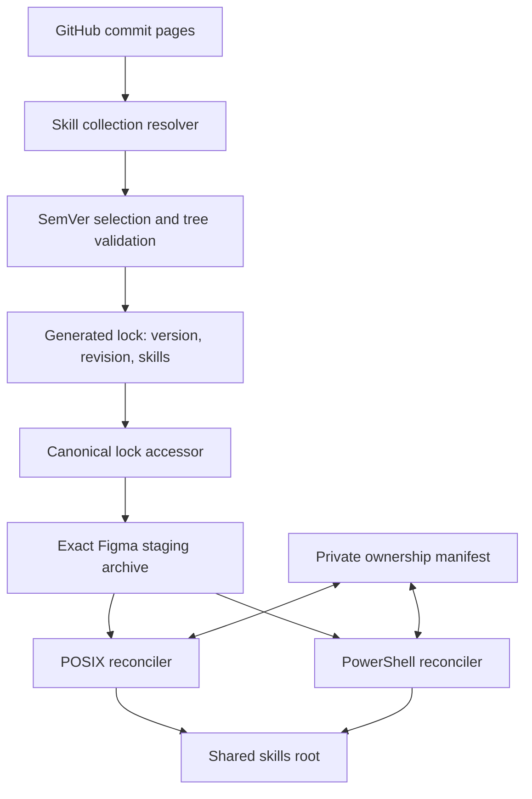
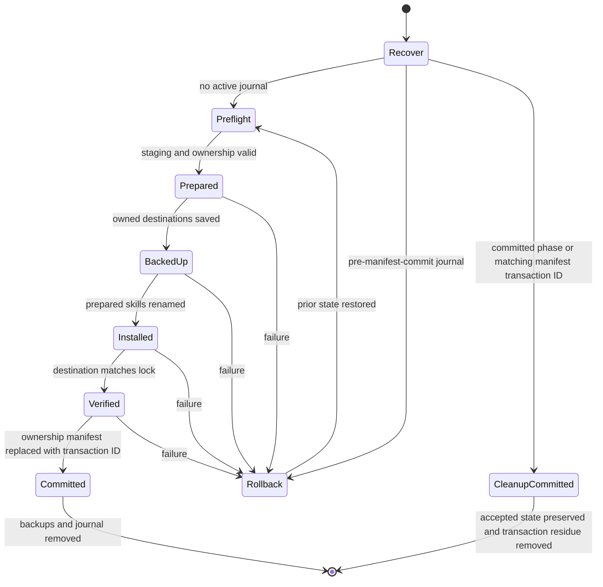

# Manage Official Figma Skills - Plan

## Goal Capsule

- **Objective:** Install the complete official Figma MCP skill collection as managed shared agent skills on POSIX and Windows hosts.
- **Product authority:** The Product Contract and its session-settled decisions define behavior and scope. The Planning Contract defines implementation within those requirements. Repository rules govern release locking, cross-platform parity, and isolated verification.
- **Open blockers:** None.
- **Execution profile:** Standard cross-platform feature. Implement the resolver before its lock consumer, then stage and reconcile the collection before adding final CI assertions.
- **Stop conditions:** Stop if research or implementation invalidates a session-settled decision, if the resolver cannot fail closed on incomplete GitHub history, or if reconciliation cannot preserve unrelated skills on both operating-system families.
- **Tail ownership:** The executor owns package tests, native reconciliation fixtures, isolated template renders, workspace gates, and cleanup. It MUST NOT apply to the live home directory.

**Product Contract preservation:** restructured, no scope change: Summary enriched for the implementation approach; R/A/F/AE IDs and all product boundaries remain unchanged.

---

## Product Contract

### Summary

Extend the generated release lock with one immutable official Figma skill collection. Stage the exact locked archive on every supported OS, then reconcile its individual skills into the shared skills root through equivalent POSIX and PowerShell paths.

### Problem Frame

Figma's MCP server provides bundled skill guidance, but Claude and omp sometimes miss that guidance and call MCP tools directly. The repository currently manages no official Figma skills. Its existing external-skill path installs named GitHub skill subtrees only outside Windows, so it cannot provide an automatically complete, cross-platform Figma collection without extension.

### Key Decisions

- **Use a lock-backed upstream collection.** Governs R1-R9. (session-settled: user-directed — chosen over vendoring the skills or installing one aggregate package: it preserves immutable external ownership while keeping individual skills discoverable.)
- **Select the highest semantic version encoded in a Figma skill commit.** Governs R1-R3. (session-settled: user-directed — chosen over following `main`, release tags, or the newest matching commit: Figma publishes skill versions through commit subjects rather than GitHub releases.)
- **Mirror the complete collection automatically.** Governs R4, R6, R7. (session-settled: user-directed — chosen over approving skill names individually or freezing today's set: every current and future official skill should remain managed.)
- **Support POSIX and Windows.** Governs R8. (session-settled: user-directed — chosen over retaining the current non-Windows external-skill scope: the managed collection should be cross-platform.)
- **Limit omp scope to installation.** Governs R8. (session-settled: user-directed — chosen over adding or proving omp global skill discovery: this work manages the files but does not change omp discovery behavior.)

### Actors

- A1. **Repository maintainer:** Reviews generated lock changes and controls the managed-skill policy.
- A2. **Release-lock workflow:** Finds and pins the authoritative Figma skill version and collection manifest.
- A3. **Chezmoi:** Converges the pinned skill collection into the shared user-scoped skills directory.
- A4. **Compatible agent harness:** Discovers individual installed skills through its existing skills path or integration.

### Requirements

**Release selection and locking**

- R1. The resolver MUST consider only upstream commits whose complete subject matches `Skills v<semver> (#<number>)` and whose version is valid semantic versioning.
- R2. The resolver MUST select the matching commit with the highest semantic version rather than the newest commit by date or history position.
- R3. The generated lock MUST record an immutable commit and enough collection metadata for source-state rendering to remain network-free.
- R4. The existing periodic lock-refresh workflow MUST refresh this source and commit a changed lock through its normal generated-lock process.
- R5. A failed or ambiguous resolution MUST retain the last valid lock entry and make the refresh fail visibly.

**Collection ownership and convergence**

- R6. The locked collection MUST contain every valid immediate `figma-*` skill directory under the selected commit's `skills/` directory, including its complete supporting subtree.
- R7. A successful lock refresh MUST update the repository desired collection; the next successful host convergence MUST add new upstream Figma skills and remove deleted upstream Figma skills without deleting unrelated managed skills. A direct child whose name matches a locked Figma skill is atomically replaced and becomes Figma-owned.
- R8. Each Figma skill MUST install as an individual direct child of the shared agent skills directory on POSIX and Windows.
- R9. Installation MUST use only the generated lock and immutable upstream content; chezmoi rendering MUST NOT query GitHub or infer a moving branch revision.

### Key Flows

- F1. **Scheduled collection refresh**
  - **Trigger:** The existing periodic release-lock workflow runs.
  - **Actors:** A1, A2
  - **Steps:** Find valid Figma skill-version commits, choose the highest semantic version, inventory the complete skill collection, and update the generated lock only when its resolved state changes.
  - **Outcome:** The repository records one reproducible Figma collection revision.
  - **Covered by:** R1-R7, R9
- F2. **Cross-platform convergence**
  - **Trigger:** Chezmoi processes the locked external skills on a supported host.
  - **Actors:** A3, A4
  - **Steps:** Fetch immutable content, materialize each locked Figma skill under the shared skills root, and prune Figma skills removed from the collection.
  - **Outcome:** The installed Figma skill set matches the lock without disturbing unrelated skills.
  - **Covered by:** R7-R9

### Acceptance Examples

- AE1. **Covers R1-R4, R6-R9.** Given a new matching commit with a higher semantic version and a new `figma-*` skill, the next successful refresh pins that commit and the next convergence installs the new skill on POSIX and Windows.
- AE2. **Covers R2.** Given a newer-dated matching commit with a lower semantic version than an older matching commit, resolution selects the higher semantic version.
- AE3. **Covers R5.** Given no valid matching commit, an unreachable upstream, or more than one commit that ambiguously represents the selected version, the workflow preserves the prior lock and exits unsuccessfully.
- AE4. **Covers R6, R7.** Given a selected version that removes one Figma skill, convergence removes that skill while preserving all unrelated entries in the shared skills directory.
- AE5. **Covers R6.** Given a Figma skill with reference files or other supporting assets, installation preserves the complete skill subtree rather than only `SKILL.md`.
- AE6. **Covers R8.** Given the same generated lock on POSIX and Windows, both hosts receive the same individual Figma skill directories under their shared user-scoped skills root.

### Scope Boundaries

**In scope**

- The complete current and future official `figma-*` collection under `figma/mcp-server-guide/skills`.
- Automated selection of the highest version expressed through Figma's skill commit-subject convention.
- Generated-lock integration, exact collection convergence, and POSIX/Windows installation.

**Out of scope**

- Configuring or proving that omp discovers global `~/.agents/skills`; omp coverage ends when the files are installed.
- Changes to the Figma MCP server declaration, OAuth authorization, or the instruction that routes Figma URLs through the MCP.
- Vendoring Figma's skill sources into this repository.
- Applying the source state to the live home directory as part of implementation verification.

### Dependencies / Assumptions

- Figma continues to publish skill versions with subjects shaped as `Skills v<semver> (#<number>)`.
- Official skill directories continue to use the `figma-` prefix and contain agent-consumable skill content.
- GitHub exposes complete commit pagination and tree metadata within its documented REST limits.
- The current repository proves shared-skill links for Claude and Codex, but not global-skill discovery for omp; R8 intentionally does not strengthen that discovery contract.

---

## Planning Contract

### Key Technical Decisions

- KTD1. **Add a typed GitHub skill-collection resolver and lock entry.** The entry records a normalized semantic `version`, an immutable 40-character `revision`, and a sorted unique `skills` inventory. It does not overload platform `artifacts`. Governs R1-R6. (session-settled: user-directed — chosen over vendored sources or one aggregate discovery directory: the lock remains the reviewable authority while each skill stays individually installable.)
- KTD2. **Scan complete commit pagination and validate the selected tree.** Follow GitHub pagination metadata, match the first commit-message line exactly, compare with exact-pinned `semver@7.8.5`, and fail on tied highest precedence from distinct commits. Inventory skills from the selected commit tree and reject truncated, empty, malformed, duplicate, unsafe, or missing-`SKILL.md` collections. Validate every selected supporting-tree path before locking: reject links, unsafe relative paths, Windows-reserved or case-colliding paths, and file forms that cannot materialize on both supported platform families. Governs R1, R2, R5, R6. (session-settled: user-directed — chosen over chronological selection, `main`, or GitHub releases: semantic skill versions are the only authority.)
- KTD3. **Stage one exact immutable archive outside the existing OS gate.** A collection declaration in `.chezmoidata/agents.yaml` supplies static policy. The generated lock supplies the revision and inventory. `.chezmoiexternals/ai-agents.toml` materializes one exact Figma-only staging tree on POSIX and Windows. Governs R3, R6, R8, R9. (session-settled: user-directed — chosen over per-skill approval and POSIX-only deployment: one collection must mirror upstream automatically on every supported OS.)
- KTD4. **Reconcile live skills with paired every-apply transactions.** POSIX and PowerShell scripts acquire one exclusive transaction lock per shared-skills root before recovery or preflight, then preflight the complete staging tree, prepare same-filesystem replacements, journal each durable transaction phase, back up owned destinations, replace each direct child, verify the result, and atomically commit a schema-versioned private ownership manifest with the transaction ID. Desired-name collisions become Figma-owned replacements. Removal uses only the prior ownership manifest, not a prefix-wide delete. A missing ownership manifest initializes only on an otherwise empty managed state; missing, corrupt, or schema-mismatched ownership state alongside managed artifacts or a journal fails closed. An unchanged valid destination is a no-op, while drift is repaired on the next apply. Governs R7, R8. (session-settled: user-approved — chosen over prefix-wide pruning or change-only reconciliation: unrelated skills remain safe and live managed state repairs drift.)
- KTD5. **Extend the canonical lock accessor rather than bypassing it.** `.chezmoitemplates/release-lock-ref.tmpl` gains typed access for `revision` and a JSON-encoded skill inventory. Consumers validate kind, SHA shape, safe names, uniqueness, order, and non-empty inventory before emitting runnable content. Governs R3, R9.
- KTD6. **Use failure-atomic, crash-recoverable convergence.** Whole-collection instantaneous visibility is not possible while skills remain separate direct children. Both reconcilers must restore the prior files and ownership state after handled failure. Journal recovery is phase-aware: a pre-manifest-commit journal rolls back, while a committed phase or matching ownership-manifest transaction ID preserves the accepted collection and completes cleanup forward. Governs R7, R8. (session-settled: user-approved — chosen over best-effort copying or an impossible single-operation swap: failures must not leave a mixed collection.)
- KTD7. **Stop verification at source-state and filesystem behavior.** Native fixtures prove staging materialization and install semantics on Linux, macOS, and Windows. Render checks prove locked, network-free templates. No test applies to the live home directory, invokes an agent, or claims omp discovery. Governs R8, R9.

### High-Level Technical Design

The release path separates network resolution from source-state rendering and live convergence.

The reconciliation lifecycle is transactional per host. The journal makes interrupted work recoverable before the next transaction begins.

### Sequencing

1. Establish the resolver kind, lock schema, SemVer dependency, and deterministic tests.
2. Register the Figma collection and expose validated lock metadata to templates.
3. Stage the immutable archive on every OS.
4. Add paired transactional reconcilers and native fixtures.
5. Add render-matrix and workspace gates, then refresh the generated lock.

### System-Wide Impact

- **Prompt supply chain:** A higher locked Figma version can add executable agent guidance automatically. The immutable revision and sorted inventory provide reproducibility and a durable audit record; the hourly workflow does not require maintainer approval before it updates the lock.
- **Shared workspace:** `~/.agents/skills` remains the canonical user-scoped skills root. Collection cleanup is limited to names recorded in the private Figma ownership manifest.
- **Cross-platform parity:** Linux, macOS, and Windows consume the same lock entry and staged archive. The two reconcilers must produce the same relative skill tree and ownership state.
- **Authentication:** GitHub refresh requests reuse the existing optional token header path. Figma OAuth and MCP configuration do not change.
- **Apply lifecycle:** The reconciler runs after externals on every apply because the copied destination is live managed state. A matching destination must exit without rewriting files.

### Risks and Mitigations

- **Upstream commit convention changes:** Exact subject matching can stop finding versions. Resolution fails, preserves the previous whole collection entry, and reports the source failure.
- **Incomplete GitHub history or tree data:** Pagination, malformed responses, rate limits, or a truncated tree can produce a false collection. The resolver rejects incomplete evidence rather than shrinking the lock.
- **Unsafe upstream payload:** New skills can change agent behavior. Automatic mirroring accepts the operational risk of trusting the selected upstream content. The lock diff exposes version, revision, additions, and removals for non-blocking maintainer review and later audit, but review is not a deployment gate.
- **Mixed live collection after interruption:** Multi-directory replacement cannot be one rename. The journal, backups, rollback, and startup recovery prevent a failed run from becoming the accepted state.
- **Destructive cleanup:** Prefix-wide pruning could remove unrelated manual skills. The private ownership manifest is the sole removal ledger.
- **Cross-platform path differences:** Symlinks, junctions, unsafe basenames, and case collisions can diverge across hosts. Both reconcilers reject linked or ambiguous staging and destination entries before mutation.

### Alternatives Considered

- **One direct external per skill:** Reuses the current pattern, but a removed lock member makes its stanza disappear and leaves the deployed directory unmanaged. It also does not provide collection-scoped transactional convergence.
- **One exact archive at the shared skills root:** Downloads once, but exact mode would delete unrelated skills.
- **One additive archive at the shared skills root:** Preserves unrelated entries, but cannot remove deleted files or retired skills.
- **Vendored upstream skills:** Works cross-platform but duplicates third-party sources and creates large generated diffs.
- **One aggregate discovery directory:** Avoids fan-out but does not preserve the direct-child discovery layout required by R8.

### Sources and Research

- `.chezmoidata/agents.yaml` — single source of truth for MCP and external-skill policy.
- `.chezmoiexternals/ai-agents.toml` — archive, exact-subtree, OS-gate, and fail-closed template patterns.
- `.chezmoitemplates/release-lock-ref.tmpl` — canonical release-lock consumer boundary.
- `packages/release-lock/src/types.ts`, `packages/release-lock/src/resolve-all.ts`, and `packages/release-lock/src/lock.ts` — resolver dispatch, lock shape, sorting, and last-good overlay behavior.
- `packages/release-lock/src/github.ts` and `packages/release-lock/src/github-tag.ts` — GitHub authentication and response-validation patterns.
- `packages/release-lock/test/cli.test.ts` — resolver-table completeness and partial-failure retention patterns.
- `.chezmoiscripts/70-agents/run_onchange_after_update-omp-plugins.sh.tmpl` and `.chezmoiscripts/70-agents/run_onchange_after_update-omp-plugins.ps1.tmpl` — paired phase-70 preflight and parity patterns.
- `.github/workflows/refresh-release-lock.yml` — hourly refresh, partial-success commit, and final failure signaling.
- `.github/workflows/render-dotfiles.yml` and `.github/workflows/ci.yml` — cross-platform render and native fixture surfaces.
- [GitHub REST commits API](https://docs.github.com/en/rest/commits/commits?apiVersion=2022-11-28#list-commits) — `path`, `per_page`, `page`, and commit tree metadata.
- [GitHub REST trees API](https://docs.github.com/en/rest/git/trees?apiVersion=2022-11-28#get-a-tree) — recursive tree data and truncation contract.
- [node-semver 7.8.5](https://www.npmjs.com/package/semver/v/7.8.5) — SemVer 2.0 parsing and precedence; published more than one week before this plan.

---

## Implementation Units

### U1. Add the Figma collection resolver

- **Goal:** Resolve one authoritative Figma skill release into a deterministic typed lock entry.
- **Requirements:** R1-R6, R9; F1; AE1-AE3. Implements KTD1, KTD2.
- **Dependencies:** None.
- **Files:**
  - `packages/release-lock/src/github-skill-collection.ts` — create the dedicated resolver.
  - `packages/release-lock/src/types.ts` — add the resolver kind and typed collection fields.
  - `packages/release-lock/src/resolve-all.ts` — register the resolver.
  - `packages/release-lock/src/github.ts` — reuse or expose shared authenticated GitHub fetch support where clean.
  - `packages/release-lock/package.json` — add exact `semver@7.8.5` and an exact compatible `@types/semver` development dependency.
  - `packages/bun.lock` — update through the workspace package manager.
  - `packages/release-lock/test/github-skill-collection.test.ts` — add resolver behavior coverage.
  - `packages/release-lock/test/cli.test.ts` — extend resolver-table and retention coverage.
- **Approach:**
  1. Add a discriminated collection lock entry without weakening existing artifact types.
  2. Page commits that touch `skills/`, parse only exact first-line subjects, and compare complete SemVer precedence.
  3. Reject distinct commits tied at the highest precedence, including build-metadata-only ties.
  4. Read the selected commit tree, reject truncation, and derive sorted immediate members that have safe `figma-*` names and regular `SKILL.md` files.
  5. Validate every selected descendant path and entry mode before locking so the complete subtree can materialize without links, unsafe paths, Windows-reserved paths, or case collisions.
  6. Return the normalized version, immutable revision, and complete inventory through existing per-source failure handling.
- **Execution note:** Start with resolver tests. The external API responses are the contract boundary and should remain fully stubbed.
- **Patterns to follow:** One resolver module per kind in `packages/release-lock/src/`; `ResolutionError`; `authHeaders`; directly assertable `RESOLVERS`; inline fetch stubs in existing resolver tests.
- **Test scenarios:**
  - A stable exact subject produces the expected semantic version, 40-character revision, and sorted inventory.
  - A newer-dated lower version loses to an older higher version. Covers AE2.
  - A higher version on a later API page wins, proving complete pagination.
  - Prerelease precedence follows SemVer 2.0, and build metadata does not create false precedence.
  - Distinct commits tied at the highest precedence fail as ambiguous. Covers AE3.
  - Repeated evidence for the same SHA does not create false ambiguity.
  - Near-match subjects, message-body matches, invalid versions, files, nested directories, unsafe names, and non-`figma-*` directories are rejected or excluded as specified by KTD2.
  - A candidate without regular `SKILL.md`, an empty inventory, a truncated tree, an HTTP error, or malformed JSON fails with the source named.
  - A selected supporting subtree containing a link, unsafe relative path, Windows-reserved path, or case collision fails before the lock is written.
  - Authenticated requests preserve the existing bearer-header behavior.
  - A collection failure retains the prior complete entry while another source can update, and the CLI returns failure. Covers AE3.
- **Verification:** Resolver tests prove selection and inventory invariants. Type checking proves old resolver kinds remain exhaustive. A clean lock serialization is deterministic.

### U2. Register and stage the immutable collection

- **Goal:** Make the generated collection available as one exact cross-platform staging external with no render-time network lookup.
- **Requirements:** R3-R9; F1; AE1, AE5, AE6. Implements KTD3, KTD5.
- **Dependencies:** U1.
- **Files:**
  - `packages/release-lock/src/registry.ts` — register `figma/mcp-server-guide` under the new resolver kind.
  - `.chezmoidata/releases.json` — regenerate the locked Figma entry.
  - `.chezmoidata/agents.yaml` — declare the collection source, lock key, staging policy, and ownership-state location.
  - `.chezmoitemplates/release-lock-ref.tmpl` — add typed collection access.
  - `.chezmoiexternals/ai-agents.toml` — emit one exact archive outside the current Windows exclusion.
  - `packages/release-lock/README.md` — document the resolver kind and refresh contract.
  - `.ci/test-figma-skills-stage.sh` — add an isolated POSIX archive-materialization fixture.
  - `.ci/test-figma-skills-stage.ps1` — add an isolated PowerShell archive-materialization fixture.
- **Approach:**
  1. Keep static collection policy in `agents.skills`; keep version, revision, and names in the generated lock.
  2. Validate collection metadata through the canonical accessor before building the archive declaration.
  3. Use only the locked revision in the immutable GitHub archive URL.
  4. Extract only the locked skill subtrees into a stable Figma-only staging root with `exact = true`.
  5. Exercise that declaration against an immutable local archive fixture, not only template rendering, and assert selected nested contents, excluded siblings, and exact pruning.
  6. Keep the existing generic external-skill loop and its non-Windows behavior unchanged.
- **Execution note:** Render the accessor and external template with positive and negative lock fixtures before regenerating the real lock.
- **Patterns to follow:** Existing GitHub archive fields and `exact` semantics in `.chezmoiexternals/ai-agents.toml`; fail-closed lookups in `.chezmoitemplates/release-lock-ref.tmpl`; generated-lock-only consumers in `packages/release-lock/README.md`.
- **Test scenarios:**
  - Valid collection metadata renders one exact archive with the locked commit on POSIX and Windows.
  - Missing entry, wrong kind, malformed revision, empty inventory, duplicate or unsorted names, and unsafe basenames fail rendering before runnable output.
  - The archive-materialization fixtures on POSIX and Windows extract nested references and supporting assets for every member, exclude unrelated upstream files and non-Figma skill directories, and prune prior staging residue exactly. Covers AE5.
  - Existing `agent-browser`, `improve`, `glab`, and `glab-stack` external declarations render unchanged.
  - Two clean resolver runs produce byte-identical `.chezmoidata/releases.json` when upstream state is unchanged.
- **Verification:** The generated lock contains a review-visible Figma version, revision, and sorted inventory. Isolated Linux, macOS, and Windows renders contain the same immutable staging external and no live release lookup; native staging fixtures prove that the declaration materializes the intended exact tree.

### U3. Reconcile Figma skills transactionally

- **Goal:** Converge individual live Figma skills from staging while preserving unrelated shared skills and recovering from failures.
- **Requirements:** R6-R9; F2; AE1, AE4-AE6. Implements KTD4, KTD6, KTD7.
- **Dependencies:** U2.
- **Files:**
  - `.chezmoiscripts/70-agents/run_after_install-figma-skills.sh.tmpl` — add the POSIX reconciler.
  - `.chezmoiscripts/70-agents/run_after_install-figma-skills.ps1.tmpl` — add the Windows reconciler.
  - `.ci/test-figma-skills-reconcile.sh` — add isolated POSIX transaction fixtures.
  - `.ci/test-figma-skills-reconcile.ps1` — add isolated PowerShell transaction fixtures.
- **Approach:**
  1. Render both scripts from the same collection declaration and lock inventory.
  2. Acquire an exclusive per-root transaction lock, then recover any prior journal before reading the next desired state.
  3. Validate staging, safe direct-child names, complete subtrees, destination path types, and a schema-versioned ownership manifest before mutation; initialize a missing manifest only when no managed state or journal exists.
  4. Prepare same-filesystem replacements and a journal that records a transaction ID and every durable phase.
  5. Back up prior owned paths, adopt desired-name collisions, install prepared paths, and verify the resulting inventory and content.
  6. Atomically replace the private ownership manifest with the transaction ID only after verification.
  7. Restore backups and the prior manifest after handled failure; a pre-commit interrupted journal rolls back, while a committed phase or matching manifest transaction ID completes cleanup forward.
  8. Remove transaction artifacts after accepted cleanup, release the transaction lock on every exit, and compare before replacing so an unchanged valid destination is a true no-op while every apply can repair drift.
- **Execution note:** Build both reconcilers against the same fixture contract. Do not implement one OS as a weaker translation of the other.
- **Patterns to follow:** Paired phase-70 script guards; POSIX ownership and symlink checks; PowerShell reparse-point checks and `finally` cleanup; transactional fixture isolation used by existing agent and haptic provisioners.
- **Test scenarios:**
  - First install creates a missing shared skills root and installs every desired direct child.
  - Nested references, assets, and sibling-relative links remain intact. Covers AE5.
  - A new lock member is added on both OS paths. Covers AE1.
  - A previously owned retired member is removed while unrelated managed, personal, and unowned `figma-*` siblings remain. Covers AE4.
  - A desired-name collision is backed up, replaced by the official Figma skill, and recorded as owned.
  - A second matching run leaves skill contents, ownership bytes, and representative modification times unchanged.
  - Tampered owned content is repaired on a later apply without changing unrelated siblings.
  - Missing, partial, extra, empty, linked, or malformed staging fails before destination mutation.
  - Corrupt, schema-mismatched, or unexpectedly missing ownership state, unsafe destination links, or case-ambiguous names fail before mutation.
  - A second reconciler cannot enter while the per-root transaction lock is held.
  - An injected failure after one replacement restores all prior skill content and ownership state.
  - An interrupted pre-commit journal rolls back before the next reconciliation, while interruption after manifest commit preserves the new transaction-ID-matched state and only completes cleanup.
  - POSIX and PowerShell fixtures produce the same relative skill inventory and logical ownership state. Covers AE6.
- **Verification:** Native fixtures prove failure atomicity, crash recovery, deletion authority, collision adoption, idempotence, drift repair, and cross-platform parity. No fixture reads or writes the live home directory.

### U4. Integrate repository-wide verification

- **Goal:** Make resolver, template, script, and cross-platform behavior part of the repository's normal quality gates.
- **Requirements:** R1-R9; F1, F2; AE1-AE6. Implements KTD7.
- **Dependencies:** U1, U2, U3.
- **Files:**
  - `.github/workflows/ci.yml` — include native staging and reconciliation fixtures in the established Linux, macOS, and Windows jobs.
  - `.github/workflows/render-dotfiles.yml` — assert collection externals and rendered scripts across Fedora, Ubuntu, macOS, and Windows.
  - `.ci/test-figma-skills-reconcile.sh` — expose stable POSIX fixture entry points for CI.
  - `.ci/test-figma-skills-reconcile.ps1` — expose stable Windows fixture entry points for CI.
  - `.ci/test-figma-skills-stage.sh` and `.ci/test-figma-skills-stage.ps1` — expose immutable local-archive materialization fixture entry points for CI.
  - `packages/release-lock/README.md` — record the final resolver and verification surfaces.
- **Approach:**
  1. Add native staging and reconciliation fixture execution on Linux, macOS, and Windows without weakening existing workspace or render gates.
  2. Assert POSIX and Windows templates use the same lock revision and inventory.
  3. Keep script and external checks separate because archive comparisons exclude scripts and externals.
  4. Refresh the generated lock through the release-lock CLI and prove an unchanged second resolution is byte-identical.
  5. Verify only isolated targets and scratch-scoped fixtures.
- **Execution note:** This unit closes the verification blind spots. Render success alone does not prove script behavior, and fixture success alone does not prove template portability.
- **Patterns to follow:** Existing native Windows integration jobs, cross-platform render assertions, package workspace gates, and isolated chezmoi template rendering with a stub `op`.
- **Test scenarios:**
  - Resolver and CLI suites cover every release and retention acceptance example.
  - Linux and macOS POSIX fixtures plus Windows PowerShell fixtures cover every staging and convergence acceptance example.
  - Fedora, Ubuntu, macOS, and Windows render the external and paired scripts successfully.
  - Existing external skills, MCP declarations, OAuth data, and common Figma routing instructions remain unchanged.
  - A second lock refresh produces no diff when upstream state is unchanged.
- **Verification:** All plan-specific suites and repository gates pass. The final diff contains no deployed home files, plaintext secrets, generated files outside their owning workflow, or unrelated refactors.

---

## Verification Contract

| Gate | Scope | Required outcome |
|---|---|---|
| `vp test` in `packages/release-lock` | U1, U2 | Resolver, dispatch, serialization, ambiguity, and last-good retention tests pass. |
| `vp run typecheck` in `packages/release-lock` | U1, U2 | The new discriminated resolver and lock entry remain type-safe and exhaustive. |
| `vp install --frozen-lockfile` in `packages` | U1 | The exact dependency and workspace lock agree. |
| `vp run -r build`, `vp run -r typecheck`, `vp run -r test`, and `vp check` in `packages` | U1, U2, U4 | All workspace packages and quality checks pass. |
| `.ci/test-figma-skills-stage.sh` on native Linux and macOS | U2, U4 | An immutable local archive materializes the exact selected staging tree, including nested assets and pruning, in isolated scratch. |
| `.ci/test-figma-skills-stage.ps1` on native Windows | U2, U4 | The PowerShell staging fixture proves the same exact materialization contract in isolated scratch. |
| `.ci/test-figma-skills-reconcile.sh` on native Linux and macOS | U3, U4 | POSIX install, update, removal, rollback, phase-aware recovery, idempotence, exclusive locking, and preservation scenarios pass in isolated scratch. |
| `.ci/test-figma-skills-reconcile.ps1` on native Windows | U3, U4 | PowerShell proves the same phase-aware transaction, exclusive-lock, and final-state contract. |
| Release-lock CLI refresh | U2, U4 | The generated lock records the selected semantic version, immutable revision, and sorted complete inventory. A second clean run is byte-identical. |
| Isolated `chezmoi execute-template --source "$PWD"` renders | U2-U4 | The external and both scripts render without live release lookup on every supported OS context. |
| `git diff --check`, `git status`, and requested-scope diff | U1-U4 | No whitespace errors, unexpected targets, secrets, or scope drift remain. |
| CI and render workflows | U4 | `ci.yml` and `render-dotfiles.yml` reach terminal success after push. |

The verification run MUST NOT execute a live `chezmoi apply`, modify deployed `$HOME`, start a real service, invoke Figma MCP tools, or claim omp discovers the installed skills.

---

## Definition of Done

- U1 resolves the highest valid semantic skill version from complete commit pagination, validates every selected subtree is portable to both platform families, and writes a deterministic typed collection entry.
- U2 registers the collection, regenerates the lock, and materializes one exact immutable staging archive in isolated POSIX and Windows fixtures.
- U3 installs every locked skill as a direct child, preserves complete subtrees, removes only previously owned retired skills, repairs drift, serializes concurrent applies, and performs phase-aware recovery from failure on both OS paths.
- U4 makes resolver, native staging and reconciliation on Linux, macOS, and Windows, and cross-platform rendering part of normal repository verification.
- AE1-AE6 are enforced by named resolver, CLI, render, or native fixture scenarios.
- The Product Contract remains preserved with no scope change and all R/A/F/AE citations remain valid.
- The generic external-skill path, Figma MCP declaration, OAuth behavior, routing instruction, and omp discovery configuration remain unchanged.
- The generated lock is source-state authoritative and no template performs network release resolution.
- All Verification Contract gates pass without applying to the live home directory.
- Abandoned experiments, temporary fixtures, transaction residue, and superseded implementation paths are absent from the final diff.
