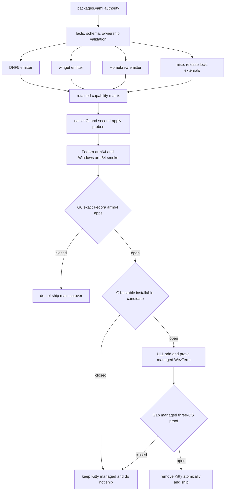

# Cross-Platform Workstation Parity - Plan

## Goal Capsule

- **Objective:** Make this chezmoi source provision one equivalent development workstation on current Fedora, Windows 11, and macOS, using native mechanisms behind one declarative authority.
- **Product authority:** The Product Contract controls supported outcomes and scope. The Planning Contract controls ownership, sequencing, and failure boundaries. Implementation Units control file-level execution.
- **Execution profile:** Build and verify the units on one branch as one main cutover. Do not apply this source to the live home directory during implementation or verification.
- **Main cutover stop conditions:** Do not declare or ship the new support contract until G0 proves native Fedora arm64 Chrome, Cider, and Edge, G1a proves an installable stable cross-platform WezTerm candidate, and G1b proves that candidate from managed source with working Kitty Unicode placeholders and real-device scroll/redraw behavior. Substitutes, architecture exclusions, nightly channels, maintained forks, and weaker image persistence are not accepted.
- **Current-terminal safety:** Keep Kitty fully managed and unchanged until G1b passes and the replacement path is ready for atomic removal. Preparatory units may run while any gate is closed, but no partial support contract ships.
- **Tail ownership:** The implementation run owns source changes, isolated verification, docs, and cleanup. The operator owns live apply, named first-apply elevation, OAuth login, OS security enablement, hardware-app profile setup, preparation and lifecycle of the Fedora VM, and manual decommission of deployed residue.

---

## Product Contract

### Summary

Manage Fedora, Windows, and macOS as one workstation product whose native implementations deliver equivalent retained capabilities.
The main cutover adds one declarative package authority, closes Windows and macOS provisioning gaps, and removes Ubuntu, WSL, CLIProxyAPI, CPA-Manager-Plus, and Open Design from active source.
Kitty remains the managed terminal until G1b passes. WezTerm replacement and Kitty removal are part of the same main cutover, because the settled equivalent-outcomes contract does not permit the documented Windows inline-image gap to ship.

### Problem Frame

The repository is Linux-first despite native render coverage for macOS and Windows.
Current source contains 59 POSIX provisioner templates but only six Windows PowerShell counterparts.
The package manifest owns Fedora and Ubuntu, while macOS and Windows bootstrap package state lives outside the general manifest.
Windows also lacks complete Git, SSH, GPG, Claude/Codex integration, shared skills, and agent-plugin provisioning.

Several current integrations are no longer part of the target product.
CLIProxyAPI has Linux and macOS runtime machinery but no active agent consumer.
Open Design is a Linux-only service, desktop application, CLI, and MCP integration that the target product removes instead of porting.
Ubuntu and WSL are replaced by current Fedora support and a separately prepared Fedora VM for Linux development from Windows.

The requested Kitty-to-WezTerm replacement cannot preserve the current tmux image contract today.
Released WezTerm builds do not implement Kitty Unicode placeholders, and Fedora has no stable WezTerm channel for a current release.
The working Kitty transport therefore stays intact until the gate criteria become true.

### Key Decisions

- **One main cutover.** (session-settled: user-directed — chosen over platform-by-platform delivery: avoid a supported state in which operating systems carry different retained feature contracts.) Governs R4, R28.
- **Equivalent outcomes across retained user capabilities.** (session-settled: user-directed — chosen over preserving platform-exclusive retained features: the owner must perform the same retained work on every supported OS.) Governs R2, R3, R17.
- **Use the actual rolling support matrix.** (session-settled: user-directed — chosen over broad historical compatibility: focus proof on current operating systems and architectures.) Governs R1, R27.
- **Drop Ubuntu and WSL.** (session-settled: user-directed — chosen over retaining compatibility paths: Linux development on Windows uses a separately prepared Fedora VM.) Governs R24, R25.
- **Use native package managers under one declarative authority.** (session-settled: user-directed — chosen over ad hoc winget and Homebrew commands: Windows and macOS package ownership must match the data-driven Fedora standard.) Governs R6-R12.
- **Install, update, and repair without prune.** (session-settled: user-approved — chosen over install-only or destructive convergence: owned software stays current while apply cannot uninstall undeclared software.) Governs R10, R29, R36.
- **Keep Kitty until a common stable WezTerm gate opens.** (session-settled: user-directed — chosen over nightly builds, a maintained fork, or weaker image persistence: preserve the working tmux image contract.) Governs R18-R21, R33.
- **Block Fedora arm64 rather than substitute required applications.** (session-settled: user-directed — chosen over Chromium/web substitutes or architecture exclusions: Chrome, Cider, and Edge remain exact required applications.) Governs R1, R30, R34.
- **Accept Windows x64 emulation.** (session-settled: user-directed — chosen over native-arm64-only gating or per-tool approval: x64 packages may satisfy Windows arm64 when marked explicitly and exercised on the device.) Governs R30, R35.
- **Remove consumer-free CLIProxyAPI.** (session-settled: user-directed — chosen over retaining a separate load-balancing service: omp already owns model roles and fallback chains.) Governs R22, R23.
- **Remove Open Design on every platform.** (session-settled: user-directed — chosen over native ports or a Linux-only carve-out: the service, app, CLI, MCP integration, and build chain leave active source.) Governs R31, R32.
- **Use 1Password as the cross-platform secret authority.** (session-settled: user-directed — chosen over OS-specific secret authorities: share source references while each host keeps credentials and runtime state isolated.) Governs R14.
- **Use Logi Options+ as the non-Linux gesture path.** (session-settled: user-directed — chosen over adding a managed third-party input stack: package installation is managed, but profile setup remains an operator step.) Governs R17, R37.
- **Do not automate teardown.** (session-settled: user-directed — chosen over removing live services, applications, credentials, and state during apply: use operator checklists.) Governs R23, R26, R32.
- **Prove support with CI and real hardware.** (session-settled: user-directed — chosen over render-only architecture claims: hosted runners do not prove every arm64 outcome.) Governs R27-R30.

### Requirements

**Platform contract**

- R1. Official support covers the latest stable Fedora on x86_64 and arm64, the latest stable Windows 11 on x64 and arm64, and the latest stable macOS on arm64.
- R2. Every retained user-facing repository capability must produce an equivalent usable outcome on every supported operating system.
- R3. OS-specific mechanisms may differ or be marked not applicable only when they have no independent retained user-facing outcome.
- R4. The main support contract becomes complete only when every active main-cutover requirement passes for the full matrix; no platform-specific partial contract is an accepted delivered state.
- R5. After the minimum chezmoi and 1Password bootstrap, one apply must converge a fresh host to a complete development workstation. Named vendor authentication, OS security, hardware-profile, Windows/macOS Wi-Fi-profile application, prepared-Fedora-VM, and first-apply elevation preconditions remain operator-owned.

**Declarative packages and applications**

- R6. One declarative package authority must own required packages, GUI applications, repositories, direct distributions, and conditional groups for Fedora, Windows, and macOS.
- R7. Fedora must use DNF5, Windows must use winget, and macOS must use Homebrew for packages those managers own.
- R8. The authority must express shared and OS-specific groups, host-fact gates, CPU architecture constraints, external sources, and direct distributions at the same control level as the current manifest.
- R9. Invalid declarations, unknown gates, unavailable required architectures, unsupported identifiers, and undeclared third-party trust must fail visibly.
- R10. A declaration change must cause the next apply to install, update, or repair the declared state without hand-editing an installer.
- R11. Each tool must have one delivery owner among the native package manifest, mise, the generated release lock, or the managed external-tool path.
- R12. Native CI and supported-device smoke checks must verify that declarations resolve to the intended installed capabilities on each platform.
- R36. Automated apply must never run package cleanup, uninstall, autoremove, or an equivalent destructive prune operation.

**Development readiness and feature parity**

- R13. A converged host must have working Git credentials, SSH, GPG, commit signing, and repository access without additional dotfiles setup.
- R14. 1Password references must remain the shared secret authority while OAuth databases, keys, caches, and resolved credentials remain isolated per host.
- R15. Required runtimes, common CLI tools, agent harnesses, MCP integrations, skills, plugins, editors, and development applications must be ready for immediate use after convergence.
- R16. Equivalent tasks must use similar commands, shortcuts, configuration meaning, and operational flows when native mechanisms permit it.
- R17. The plan must trace every retained user-facing capability to a native implementation or explicit OS-native/manual disposition and acceptance proof on all supported operating systems.
- R37. Fedora retains managed Solaar and ydotool gesture behavior; Windows and macOS receive managed Logi Options+ installation and an explicit manual profile checklist.

**Gated WezTerm terminal cutover**

- R18. Before the main support contract ships, WezTerm must replace Kitty as the managed and installed terminal on every supported operating system.
- R19. Managed WezTerm preferences must set only the shared terminal font from the repository font authority and otherwise retain WezTerm defaults.
- R20. Each OS must register WezTerm through supported native application-launch and default-terminal mechanisms; unsupported upstream handoff mechanisms must be documented rather than emulated with a second convention.
- R21. omp inline images inside tmux under WezTerm must render and remain correctly placed after scroll and redraw on every supported path, including Windows WezTerm over SSH to the Fedora VM.
- R33. Until G1b passes, Kitty configuration, provisioning, launchers, default-terminal integration, tmux settings, and tests must remain managed and unchanged in capability.

**Clean removals and migration**

- R22. Active CLIProxyAPI and CPA-Manager-Plus data, packages, release records, services, launchers, configuration, tests, gates, and documentation must be removed while historical plans remain intact.
- R23. CLIProxyAPI removal must include a manual decommission checklist for existing Linux and macOS hosts without reading or deleting provider credentials.
- R24. Active Ubuntu and WSL package data, provisioners, gates, CI coverage, and support documentation must be removed.
- R25. Fedora VM creation, resource assignment, host integration, and lifecycle management remain outside repository ownership; a prepared Fedora guest follows the normal Fedora contract.
- R26. The cutover must not add teardown or revert scripts for Kitty, CLIProxyAPI, Open Design, Ubuntu, WSL, packages, credentials, or runtime state.
- R31. Active Open Design release data, build provisioner, service, sleep hook, launchers, CLI, MCP declaration, tests, gates, and documentation must be removed while historical plans remain intact.
- R32. Open Design removal must include a manual decommission checklist and must not stop its live service or delete its generated checkout, application data, or credentials during apply.

**Verification and support proof**

- R27. Native automated coverage must exercise Fedora x86_64, Windows x64, and macOS arm64, while isolated real-device smoke checks cover Fedora arm64 and Windows arm64.
- R28. A fresh-host scenario must prove that the minimum bootstrap followed by one apply reaches the active support contract on each matrix entry.
- R29. A second apply with unchanged declarations must prove convergence without unnecessary reinstall, reauthentication, privilege prompts, or destructive state changes.
- R30. Any supported architecture that cannot obtain a required capability must close G0 unless R3 or R35 supplies an explicit disposition.
- R34. Fedora arm64 keeps G0 closed until native Chrome, Cider, and Edge packages are available and pass device smoke; substitutes and architecture exclusions do not satisfy this requirement.
- R35. Windows arm64 may use x64-emulated packages without per-tool approval when the manifest or release lock marks the disposition and the Windows arm64 device smoke exercises the installed capability.

### Key Flows

- F1. Fresh workstation bootstrap
  - **Trigger:** The owner starts from a supported OS with no managed workstation state and, on Windows, has prepared the separately owned Fedora VM when VM-backed capabilities are required.
  - **Steps:** Install chezmoi and 1Password, sign in to 1Password and enable CLI integration, authorize named stage-specific elevation for declared machine-wide changes, apply the source once, complete named vendor OAuth, OS security, hardware-profile, and Windows/macOS Wi-Fi-profile steps, and run the platform smoke check. Host apply does not provision or configure the Fedora guest.
  - **Outcome:** The host satisfies the active main-cutover contract without additional package or dotfiles work.
  - **Covered by:** R1, R5-R21, R27, R28, R34-R37.
- F2. Declarative package convergence
  - **Trigger:** A required package, application, source, gate, architecture declaration, or ownership row changes.
  - **Steps:** The next apply validates the declaration, selects the eligible native delivery owner, and installs, updates, or repairs the owned software.
  - **Outcome:** The host reaches the declared capability set or fails with a visible unsupported requirement; no package is pruned.
  - **Covered by:** R6-R12, R29, R30, R35, R36.
- F3. Cross-platform capability use
  - **Trigger:** The owner performs the same development or agent workflow on another supported OS.
  - **Steps:** Use the native application and integration through shared configuration meaning and an equivalent operational flow.
  - **Outcome:** The retained workflow is available with the documented native, VM, or manual disposition from the capability matrix.
  - **Covered by:** R2, R3, R13-R17, R37.
- F4. Existing-host clean cutover
  - **Trigger:** An existing host updates from the old support contract.
  - **Steps:** Apply the new source, then follow the operator checklists for live CLIProxyAPI or Open Design residue. Keep Kitty managed while the terminal gate is closed.
  - **Outcome:** Chezmoi no longer owns removed surfaces, while running or sensitive state changes only through explicit operator action.
  - **Covered by:** R22-R26, R31-R33.
- F5. Terminal cutover activation
  - **Trigger:** A stable WezTerm release and all channel/protocol availability criteria satisfy G1a, and G0 is also open.
  - **Steps:** Install WezTerm through each native authority without removing Kitty, prove the managed tmux transport and default-terminal paths to satisfy G1b, then remove Kitty source and ship its operator checklist atomically.
  - **Outcome:** G1b proves WezTerm without losing inline-image placement or leaving a hidden Kitty dependency, which permits the main support contract to ship.
  - **Covered by:** R18-R21, R26, R33.

### Acceptance Examples

- AE1. **Covers R5, R13-R16, R28.** Given a fresh supported host with the minimum bootstrap and any prepared-Fedora-VM precondition complete, when chezmoi applies once with named stage-specific elevation, then Git credentials, SSH/GPG signing, runtimes, agents, editor tooling, native applications, and required OS integrations are ready except for named human-only authentication, security, hardware-profile, and Windows/macOS Wi-Fi-profile steps.
- AE2. **Covers R6-R12.** Given a package declaration is added behind an eligible fact gate, when the next apply runs on each matching OS, then DNF5, winget, or Homebrew installs or updates the declared capability and nonmatching hosts remain unchanged.
- AE3. **Covers R9, R30, R34, R35.** Given a required application has no artifact for a supported architecture, when validation or convergence runs, then the cutover gate fails unless Windows arm64 has an explicit x64-emulated disposition; Fedora arm64 never substitutes or excludes Chrome, Cider, or Edge.
- AE4. **Covers R18-R21, R33.** Given the terminal gate is closed, Kitty remains the working managed path. After the gate opens, omp inside tmux under WezTerm must retain an inline image through scroll, redraw, resize, split, and SSH-to-VM composition before Kitty source can leave.
- AE5. **Covers R2, R17, R37.** Given the MX Master capability row is evaluated, when Fedora uses managed haptic and gesture paths and Windows/macOS use native haptics plus Logi Options+, then haptic events work on all three OSes and the manual gesture-profile boundary is explicit.
- AE6. **Covers R22-R26, R31-R33.** Given an existing host still runs CLIProxyAPI or Open Design, when the new source applies, then those components are no longer managed but their live services, generated files, credentials, and state are not automatically destroyed; Kitty remains managed.
- AE7. **Covers R27-R29.** Given CI and the device matrix pass a fresh convergence check, when the unchanged source applies again against the same package-source snapshot, then every host remains converged without unnecessary reinstall, reauthentication, privilege prompts, or state loss. A newly published upstream version is declared-state drift, not an unchanged-second-apply failure.
- AE8. **Covers R25, R35.** Given Windows arm64 uses an x64-emulated tool and Windows Linux development uses the Fedora VM, when the device smoke runs, then the emulated local tool starts and the SSH, tmux, agent, and repository paths complete their documented workflows.

### Scope Boundaries

- Fedora virtual-machine creation, resource assignment, hypervisor choice, guest configuration, and host lifecycle are not managed; the prepared guest is an operator precondition for Windows VM-backed capabilities.
- Exact UI parity is not required; equivalent retained capability and usability are required.
- Open Design, CLIProxyAPI, CPA-Manager-Plus, Ubuntu, and WSL are removed product capabilities, not parity exceptions.
- OS-only mechanisms with no independent retained user-facing outcome do not need artificial counterparts.
- FileVault and BitLocker enablement remain operator-owned high-impact security actions; the plan verifies and documents their native role but does not enable them.
- Logi Options+ profile configuration remains manual on Windows and macOS.
- Windows and macOS Wi-Fi profile application remains an operator-owned elevated step; apply prepares the private input and never prompts for elevation.
- Historical plans remain historical evidence and are not rewritten to remove old platform or product names.
- Live package uninstallation, service teardown, credential deletion, generated checkout deletion, and state deletion require explicit operator action outside automated apply.
- Support for older OS releases, macOS x86_64, and operating-system combinations outside R1 is not promised.

### Dependencies / Assumptions

- G0 is closed until native Fedora arm64 packages exist for Chrome, Cider, and Edge.
- G1a is closed because released WezTerm builds lack Kitty Unicode placeholders and Fedora lacks a current stable channel. G1b remains closed until U11 proves the managed path; both block the main cutover because Windows cannot otherwise satisfy the retained inline-image outcome.
- A future Fedora terminal gate accepts an upstream stable RPM for the current Fedora release, locked by the release-lock registry and installed through DNF.
- The owner can run isolated smoke checks on Fedora arm64 and Windows arm64 hardware.
- Windows x64 emulation remains available on supported Windows arm64 hosts.
- 1Password desktop and CLI authentication are available on all supported operating systems.
- Required human OAuth flows remain supported by their vendor CLIs or native MCP stores.

### Sources / Research

- `.chezmoidata/packages.yaml`, `.chezmoidata/facts.yaml`, and `.chezmoitemplates/facts-validate.tmpl` — current package, fact, and fail-safe gate authority.
- `.install-prerequisites.sh` and `.install-prerequisites.ps1` — current bootstrap and host-fact hook paths.
- `.chezmoidata/agents.yaml`, `.chezmoiscripts/70-agents/`, and `.ci/test-omp-agent-reconcile.sh` — agent authority and cross-shell reconcile patterns.
- `dot_config/tmux/tmux.conf`, `.ci/test-tmux-kitty-passthrough.sh`, and `.ci/test-kitty-provisioning.sh` — current load-bearing terminal and image behavior.
- `docs/plans/2026-08-02-002-feat-cross-platform-omp-haptic-plugin-plan.md` — native service, endpoint, and POSIX/PowerShell parity precedent.
- `docs/plans/2026-07-28-004-feat-cli-proxy-api-quadlet-plan.md` — current CLIProxyAPI and CPA-Manager-Plus inventory.
- `docs/plans/2026-07-21-004-refactor-remove-cli-proxy-api-plan.md` — source-only removal and manual decommission precedent.
- `docs/plans/2026-07-24-002-feat-open-design-integration-plan.md` and its later Open Design plans — active integration inventory and removal evidence.
- [WinGet install command](https://learn.microsoft.com/en-us/windows/package-manager/winget/install), [return codes](https://github.com/microsoft/winget-cli/blob/master/doc/windows/package-manager/winget/returnCodes.md), and [sources](https://learn.microsoft.com/en-us/windows/package-manager/winget/source) — exact identity, noninteractive flags, architecture failure, and source trust.
- [Homebrew Bundle](https://docs.brew.sh/Brew-Bundle-and-Brewfile), [Homebrew 6.0.0](https://brew.sh/2026/06/11/homebrew-6.0.0/), and [tap trust](https://docs.brew.sh/Tap-Trust) — generated Brewfile behavior and mandatory third-party trust.
- [WezTerm issue #4531](https://github.com/wezterm/wezterm/issues/4531), [placeholder PR #7924](https://github.com/wezterm/wezterm/pull/7924), and [Kitty Unicode placeholders](https://sw.kovidgoyal.net/kitty/graphics-protocol/#unicode-placeholders) — terminal gate evidence.

---

## Planning Contract

### Key Technical Decisions
- KTD1. **One package and capability data authority with three emitters.** Extend `.chezmoidata/packages.yaml` instead of adding independent Brewfile or winget registries. Its versioned capability inventory treats every current active Fedora user-facing package/integration as retained unless this plan explicitly removes it or records an R3 manual/not-applicable disposition. Each capability row maps the Fedora, Windows, and macOS delivery owner and identifier. Emit DNF5 specs, exact winget rows, and a generated Brewfile from the same validated data.
- KTD2. **Update without prune.** (session-settled: user-approved — chosen over install-only or cleanup convergence: keep owned tools current without letting apply remove undeclared software.) DNF5, winget, and Homebrew may install, update, or repair owned entries. Generated commands must make removal operations unreachable.
- KTD3. **Backend-specific version semantics.** Fedora exact NEVRA may converge in either direction. winget versions constrain install or forward upgrade but do not promise downgrade. Homebrew remains rolling and has no lockfile; exact-version tools belong to mise or the release lock.
- KTD4. **Exact manager identity and visible failure mapping.** Every manager row declares package ID, logical source, source type, and canonical origin. Before mutation, query the live DNF repository, winget alias, or Homebrew tap and fail closed when its normalized origin is missing, duplicated, or different; never silently repair an unknown origin. Use exact noninteractive winget arguments and map `NO_APPLICABLE_INSTALLER` as an architecture failure unless R35 applies.
- KTD5. **Generated Brewfile with explicit trust and elevation preflight.** Emit only `tap`, `brew`, and `cask` rows. Mark every non-official tap trusted, mark owned self-updating casks greedy when updates are required, exclude `mas` and language-manager DSLs, and use Homebrew Bundle's default install-or-upgrade semantics. The manifest marks elevation needs. Resolve the full eligible set and validate a pre-elevated Windows token or `sudo -n`/App Management authorization on macOS before any package mutation; otherwise fail the whole stage without prompting.
- KTD6. **Declarative one-owner and integrity lint.** Validate that each capability and tool has exactly one delivery owner across `.chezmoidata/packages.yaml`, `dot_config/mise/config.toml`, `packages/release-lock/src/registry.ts`, and `.chezmoiexternals/*.toml`. Add PATH sentinel checks because managers cannot detect each other's installs. Preserve the release-lock and external-tool checksum contract for every direct distribution.
- KTD7. **One fact and gate grammar.** Keep `.chezmoidata/facts.yaml` and `<fact>`, `!<fact>`, `<fact>.<value>` as the only gate contract. Add a PowerShell seeding partial that mirrors `facts-sh.tmpl` and `facts-gate.sh.tmpl`; do not embed a second Windows gate system in installers.
- KTD8. **Cross-shell behavior pairs.** Every new Windows provisioner has a POSIX/PowerShell behavior contract, rendered parity assertions, and native Windows execution proof. Windows Claude settings merges use `jq`; PowerShell JSON serialization must not rewrite undeclared vendor state.
- KTD9. **Native user-session services only.** Reuse systemd user units, launchd agents, and current-user Task Scheduler tasks. Keep staged fingerprints, every-apply drift repair, exact endpoint checks, per-user or loopback-only access, least privilege, and stage-named failures.
- KTD10. **Human authentication boundary.** One 1Password desktop sign-in and CLI enablement unlocks `op://` automation. Claude, Codex, omp provider, and Figma OAuth remain human-only and per-host through vendor-native flows with their minimum supported scopes. Apply never manages OAuth databases, keychains, or provider credential stores, and auth evidence must be redacted.
- KTD11. **Source-only removal.** Delete active source and use `.chezmoidata/system.yaml` `removed:` only for tracked `/etc` reclamation. Do not add teardown scripts or new automatic user-state deletion. Ship CLIProxyAPI and Open Design operator checklists.
- KTD12. **Two release gates with an explicit terminal handoff.** (session-settled: user-approved — chosen over silent scope reduction.) G0 blocks the main cutover until exact Fedora arm64 application coverage exists. G1 has two ordered states, not two independent product gates: G1a validates stable release/channel/placeholder availability and permits U11 to add the managed candidate without weakening Kitty; G1b validates U11's managed passthrough and three-OS real-device behavior and permits atomic Kitty removal. The main cutover requires G0 and G1b.
- KTD13. **Architecture disposition.** (session-settled: user-directed — chosen over substitutes on Fedora and per-tool approval on Windows: Fedora arm64 blocks on exact native apps, while Windows arm64 accepts explicit x64 emulation.) `emulated: true` is a valid Windows lock resolution and never a Linux resolution.
- KTD14. **Keep the tmux image pair structural.** Until G1b passes, retain `allow-passthrough on` and `PI_FORCE_IMAGE_PROTOCOL=kitty` inside `dot_config/tmux/tmux.conf`. Never move the protocol to `environment.d` or agent auth, never widen passthrough to `all`, and never substitute sixel without a new Product Contract decision.
- KTD15. **Native capability dispositions.** aoe runs inside the Fedora VM on Windows. Garden becomes native after the Windows GPG chain exists. Korean input uses each OS's native IME. Wi-Fi import uses private, 1Password-backed native OS commands; Windows/macOS profile application is an elevated operator step. BitLocker and FileVault remain manual. Logi Options+ installation is managed and its profile is manual. Open Design is removed.
- KTD16. **Safe generated inputs and secret handoff.** Validate package identifiers, sources, URLs, paths, and trust fields with backend-specific grammars. Emit manager calls as argument arrays or fixed DSL fields, never through `eval` or constructed command strings. Pass resolved secrets through native standard input or owner-only transient files, delete transient plaintext immediately, and exclude it from logs, fingerprints, and artifacts.
- KTD17. **Deterministic convergence evidence.** Hermetic CI pairs use local immutable package-source fixtures and record their digests. Real-device pairs capture resolver outputs before the first apply, run the second apply immediately with automatic refresh disabled where supported, and invalidate/re-run the pair if any source changes; they do not pretend to replay mutable public indexes. Device records bind to a versioned support-matrix snapshot and covered input paths.

### High-Level Technical Design

The package authority validates data before any native manager runs.
Provisioning remains ordered by the existing phase tree: bootstrap hook, package phases, tool linking, builds and user services, agent reconciliation, key import, and source-garden reconciliation.
Terminal source work stays dormant behind G1a so no managed terminal change can weaken Kitty before an installable candidate exists. U11 may add the managed candidate only after G1a, keeps Kitty authoritative until G1b passes, and then removes Kitty atomically before U10.

### Capability Parity Matrix

| Retained capability | Fedora | Windows | macOS | Proof or disposition |
|---|---|---|---|---|
| Native packages and GUI apps | DNF5 | winget | Homebrew | Versioned capability inventory maps every retained row to an owner/identifier or explicit manual/not-applicable disposition; manifest, native install, and second-apply probes consume it |
| Locked runtimes and release tools | mise and release lock | mise and release lock, with explicit x64 emulation | mise and release lock | One-owner lint and PATH sentinels |
| Git HTTPS credentials | 1Password-backed `gh`/`glab` auth | PowerShell counterparts and native credential manager | POSIX auth scripts | Native auth status smoke |
| SSH | 1Password agent socket | 1Password OpenSSH named pipe | 1Password agent socket | Scratch SSH and Fedora-VM connection smoke |
| GPG and commit signing | Existing key import and owner trust | Gpg4win plus PowerShell import and owner trust | GPG plus `pinentry-mac` | Signed scratch commit |
| Claude, Codex, and omp binaries | Existing native artifacts | Native or explicitly emulated artifacts | Existing native artifacts | Binary version and PATH assertions |
| MCP, skills, plugins, and settings | Existing POSIX reconcilers | New PowerShell reconcilers | Existing POSIX reconcilers | Cross-render parity plus native execution |
| Agent OAuth | Native vendor flows | Native vendor flows | Native vendor flows | Human-only checklist; apply leaves stores untouched |
| VSCodium settings and extensions | XDG target and native extension install | `%APPDATA%` target and native extension install | `Library/Application Support` target and native extension install | Native path and extension-list assertions |
| Shell and tmux | zsh and tmux | Native PowerShell for local work; tmux inside Fedora VM | zsh and tmux | Command and VM-flow smoke |
| Terminal before G1b passes | Managed Kitty | Existing OS-native terminal; inline images remain an unresolved gate, not a supported parity claim | Existing terminal state | Current Kitty transport and provisioning tests remain authoritative; the main contract does not ship |
| Terminal in the main support contract | Stable WezTerm RPM through DNF | Stable winget WezTerm, x64 emulation accepted on arm64 | Stable Homebrew WezTerm | Per-OS launch plus real scroll/redraw proof, including SSH-to-VM |
| Source garden | Existing GPG-backed reconcile | Native after GPG port | Existing reconcile | Registry relocation test plus native smoke |
| aoe session orchestration | Native | Runs inside Fedora VM | Native | Binary/config gate and VM attach smoke |
| MX Master 4 haptics | Existing native daemon and hooks | Existing Task Scheduler daemon plus hook proof | Existing launchd daemon plus hook proof | Endpoint and event tests on all OSes |
| MX Master gestures | Solaar plus ydotool | Managed Logi Options+ install; manual profile | Managed Logi Options+ install; manual profile | Package assertion plus operator checklist |
| Korean input | Managed fcitx5 | Native Windows IME | Native macOS input source | Native typing smoke; no artificial config clone |
| Wi-Fi from 1Password | NetworkManager importer | Private profile generator plus elevated operator import | Private profile generator plus elevated `networksetup` operator step | File-mode, transient-cleanup, log-redaction, and device-smoke proof |
| Disk encryption | Existing LUKS/TPM2 path | BitLocker remains operator-managed | FileVault remains operator-managed | Checklist and read-only status assertion only |
| Desktop environment, autostart, and user environment | KDE/GNOME manifests, autostart, `environment.d` | Native Run/Task and user-environment equivalents for retained outcomes | LaunchAgent and native settings equivalents | Per-OS render and native setting reads |
| Browser and default-app integration | Existing Linux paths | Native registration where supported | Native LaunchServices where supported | Launch smoke; unsupported handoff documented |
| CLIProxyAPI and CPA-Manager-Plus | Removed | No active support | Removed | Zero active references and manual residue checklist |
| Open Design | Removed | Removed | Removed | Zero active references and manual residue checklist |

### Sequencing and Gates

1. **Prepare without weakening current terminals.** Implement U1-U8 in dependency order while retaining all Kitty files and tests.
2. **Build fail-closed proof.** Complete U9 across Fedora x86_64, Windows x64, macOS arm64, and isolated Fedora/Windows arm64 devices.
3. **Re-evaluate G0.** The scheduled release/package refresh path checks native Fedora arm64 Chrome, Cider, Edge, and 1Password availability through the G0 preflight. A closed result is valid evidence but blocks delivery.
4. **Re-evaluate G1a.** The scheduled release/package refresh path runs the canonical gate evaluator against stable WezTerm releases, upstream stable RPM, winget/Homebrew channels, placeholder behavior, and default-terminal limits. It updates the same committed evidence consumed by candidate CI.
5. **Activate and prove U11.** Only when G0 and G1a are open, add managed WezTerm while retaining Kitty, prove G1b from the managed path on three OSes, then remove Kitty source and retarget CI atomically.
6. **Complete the atomic main cutover.** Finish U10 after U11 and G1b, verify removals, current docs, all gate evidence, and the full verification contract in the same delivered change.

### Risks and Dependencies

- **Indefinite G0 closure:** Chrome, Cider, or Edge may never publish Fedora arm64 packages. The user selected blocking instead of substitutes or exclusions.
- **Indefinite G1a closure:** Fedora lacks a current stable WezTerm channel and placeholder support remains unreleased. Nightly, forked, and Flatpak channels are outside the selected gate.
- **Windows symlink privilege:** Dotagents skill links may require Developer Mode or elevation. The PowerShell reconciler must use a validated junction or copy fallback with a visible diagnostic.
- **Windows hook shell:** Claude/Codex haptic hooks currently use shell scripts. Native device proof must establish the vendor hook runtime before Windows marketplace gates open.
- **Package-manager permissions:** App Management can affect cask upgrades, and machine-scope winget rows need an elevated token. The manifest declares this need; U5 preflights the complete eligible set before mutation and keeps authorization in the human bootstrap checklist.
- **Fedora arm64 CI limits:** Container resolution cannot prove hardware, graphics, or app usability. R27 device evidence remains mandatory.
- **Removal residue:** Source deletion deliberately leaves deployed user services and generated data. Operator checklists must name exact stop, verification, and cleanup steps without reading credentials.

---

## Implementation Units

| Unit | Title | Primary files | Depends on |
|---|---|---|---|
| U1 | Remove CLIProxyAPI and CPA-Manager-Plus | `.chezmoidata/cli-proxy-api.yaml`, `dot_config/containers/systemd/`, `.chezmoiscripts/90-services/`, release lock, CI | None |
| U2 | Remove Open Design | `.chezmoiscripts/60-build/*open-design*`, `dot_local/*open-design*`, `.chezmoidata/agents.yaml`, release lock, CI | None |
| U3 | Remove Ubuntu and WSL support | `.chezmoidata/packages.yaml`, `.chezmoidata/facts.yaml`, `.chezmoiscripts/40-linux-ubuntu/`, workflows | None |
| U4 | Build package authority v2 | `.chezmoidata/packages.yaml`, fact/schema templates, ownership lint | U3 |
| U5 | Add winget and Homebrew reconcilers | `.chezmoiscripts/20-windows/`, `.chezmoiscripts/20-darwin/`, bootstrap hooks | U4 |
| U6 | Complete Windows trust and repository access | `.chezmoiscripts/10-auth/`, `.chezmoiscripts/80-keys/`, `dot_ssh/`, garden | U5 |
| U7 | Complete agent, editor, and tool parity | `.chezmoiscripts/00-tools/`, `.chezmoiscripts/70-agents/`, VSCodium targets, agent data | U5, U6 |
| U8 | Complete native desktop and hardware outcomes | package rows, desktop scripts/data, Wi-Fi importer, haptic and Logi gates | U5, U7 |
| U9 | Add CI, convergence, and device gates | `.ci/`, `.github/workflows/` | U1-U8 |
| U11 | Activate the stable WezTerm cutover | terminal config, tmux, launchers, package rows, terminal CI | U9, G0, G1a |
| U10 | Complete docs and atomic main cutover | `README.md`, `AGENTS.md`, operator checklists | U1-U9, U11, G0, G1b |

### U1. Remove CLIProxyAPI and CPA-Manager-Plus

- **Goal:** Remove every active source path that can provision or launch CLIProxyAPI or CPA-Manager-Plus while preserving historical plans and live host state.
- **Requirements:** R22, R23, R26, AE6.
- **Dependencies:** None.
- **Files:** Delete `.chezmoidata/cli-proxy-api.yaml`, the three CPA quadlets under `dot_config/containers/systemd/`, `.chezmoiscripts/90-services/`, `dot_config/cli-proxy-api/`, the CLIProxyAPI libexec/share launchers, the macOS LaunchAgent, the system-sleep hook, CPA tests, and sole-purpose externals. Update `.chezmoidata/system.yaml`, `.chezmoiignore`, `.chezmoiremove`, `.github/workflows/ci.yml`, `packages/release-lock/src/registry.ts`, and generated `.chezmoidata/releases.json`. Delete the `ociImage` resolver if it becomes consumer-free.
- **Approach:** Use `docs/plans/2026-07-28-004-feat-cli-proxy-api-quadlet-plan.md` as the current inventory, not the older removal plan. Remove CI jobs with their fixtures, needs edges, artifacts, and aggregate references. Keep credentials unread and untouched. Add no teardown script.
- **Test Scenarios:** Render Linux, macOS, Windows, and container variants; prove no managed runtime, config, test, or workflow source outside repository documentation and `docs/plans/**` contains CPA identifiers or `127.0.0.1:8317`; prove unrelated release-lock kinds still resolve.
- **Verification:** Run the release-lock package tests, workflow syntax checks, isolated render matrix, and the scoped runtime/config zero-reference check. U10 owns the final repository-wide reference check and the operator checklist.

### U2. Remove Open Design

- **Goal:** Remove Open Design as a managed product capability on all platforms without stopping or deleting an existing live deployment.
- **Requirements:** R26, R31, R32, AE6.
- **Dependencies:** None.
- **Files:** Delete `.chezmoiscripts/60-build/run_onchange_after_build-open-design.sh.tmpl`, `dot_config/systemd/user/open-design.service.tmpl`, `dot_local/bin/executable_open-design`, `dot_local/bin/executable_open-design-desktop`, `dot_local/libexec/open-design/`, `dot_local/share/applications/open-design.desktop.tmpl`, `system/linux/etc/systemd/system-sleep/open-design.sh`, and `.ci/test-open-design-*.sh`. Remove the MCP row from `.chezmoidata/agents.yaml`, the release row from `packages/release-lock/src/registry.ts`, the generated lock entry, ignore gates, system manifest path, CI job, and render assertion.
- **Approach:** Move the tracked `/etc` sleep-hook path to `.chezmoidata/system.yaml` `removed:` as required by repository policy. Do not add `.chezmoiremove` entries for the user service, checkout, app data, or launchers. Preserve all Open Design historical plans.
- **Test Scenarios:** Render every supported OS and container shape; prove no managed runtime, config, test, or workflow source outside repository documentation and `docs/plans/**` references Open Design; prove MCP generation omits the server without disturbing other rows.
- **Verification:** Run agent manifest rendering, release-lock tests, workflow syntax validation, and the scoped runtime/config zero-reference check. U10 owns the final repository-wide reference check and manual service/checkout decommission checklist.

### U3. Remove Ubuntu and WSL support

- **Goal:** Make Fedora the only managed Linux distribution and remove all active Ubuntu and WSL support claims atomically.
- **Requirements:** R24, R25, R26.
- **Dependencies:** None.
- **Files:** Delete `.chezmoiscripts/40-linux-ubuntu/`. Remove the Ubuntu manifest map, installer bootstrap, MOK prompt, distro fact values, Ubuntu CI matrix rows, Ubuntu-specific gates and comments, and support prose from `.chezmoidata/packages.yaml`, `.chezmoidata/facts.yaml`, `.install-prerequisites.sh`, `.chezmoi.toml.tmpl`, `.chezmoiignore`, `.chezmoidata/system.yaml`, workflows, and current docs.
- **Approach:** Update fact declarations, consumers, and validators in one unit so no orphaned Ubuntu gate can make every render fail. Keep historical plans unchanged. Do not create migration or teardown logic for existing Ubuntu hosts.
- **Test Scenarios:** Render Fedora, macOS, and Windows immediately after the fact change; assert no Ubuntu job remains; assert WSL has no active source reference.
- **Verification:** Run fact validation and render workflows with an empty config and stubbed `op`, then run the scoped active-reference check excluding `docs/plans/**`.

### U4. Build the package authority v2

- **Goal:** Extend the existing data-driven package manifest to represent Fedora, Windows, and macOS with one schema, one gate grammar, and one ownership ledger.
- **Requirements:** R6-R9, R11, R30, R34-R36, AE2, AE3.
- **Dependencies:** U3.
- **Files:** Update `.chezmoidata/packages.yaml`, including its versioned capability inventory, `.chezmoidata/facts.yaml`, `.chezmoitemplates/facts-validate.tmpl`, and existing fact/gate partials. Add `.ci/test-packages-manifest.sh` and `.ci/test-package-ownership.sh`.
- **Approach:** Migrate every current active Fedora user-facing row into the capability inventory, then map each to Fedora, Windows, and macOS owners/identifiers or an explicit disposition already authorized by R3 or this plan. Add typed Windows rows for exact ID, source type/origin, architecture, scope, elevation, and optional install version. Add typed Homebrew tap, formula, and cask rows with canonical remote, trust, elevation, and greedy metadata. Enforce KTD16 before manager emission. Validate every package architecture against R1, including an early 1Password desktop/CLI availability preflight. Represent Fedora arm64 Chrome/Cider/Edge as a typed, gate-closing unresolved disposition until native artifacts exist; represent accepted Windows emulation explicitly and as valid.
- **Test Scenarios:** Missing capability disposition, unknown fact, malformed comparison, duplicate owner, missing or duplicate source, spoofed winget alias, changed Homebrew tap remote, mismatched DNF repository origin, unsafe field, unsupported ID, untrusted tap, checksum omission, unavailable 1Password bootstrap, unresolved/resolved required architecture, explicit Windows emulation, and nonmatching fact gate.
- **Verification:** Run the inventory, manifest, ownership, and canonical-origin tests against all supported OS/architecture combinations. They pass only when every retained capability has one complete cross-OS disposition and they distinguish a valid manifest with a closed G0 from an invalid manifest before package-manager execution.

### U5. Add winget and Homebrew reconcilers

- **Goal:** Make one apply install, update, or repair native Windows and macOS package state from U4 data.
- **Requirements:** R5, R7, R9, R10, R12, R29, R36, AE1, AE2, AE7.
- **Dependencies:** U4.
- **Files:** Add `.chezmoitemplates/facts-ps1.tmpl`, `.chezmoiscripts/20-windows/run_onchange_before_winget.ps1.tmpl`, and `.chezmoiscripts/20-darwin/run_onchange_before_homebrew.sh.tmpl`. Slim `.install-prerequisites.ps1` and `.install-prerequisites.sh` to the minimum bootstrap. Update package data and native workflow jobs.
- **Approach:** Resolve the complete eligible set and its elevation needs before mutation. On macOS, bootstrap Homebrew from its official pinned installer when `brew` is absent, verify its canonical source and expected prefix, and require the declared `sudo -n`/App Management authorization. On Windows, recover App Installer registration, verify the configured winget source identity, and require an elevated token for machine-scope rows. Fail the whole stage before any manager command if trust or elevation preflight fails. Generate a Brewfile with explicit tap trust and no `mas` or cleanup path. Keep DNF5 fail-closed without skip shortcuts.
- **Test Scenarios:** Fresh macOS without Homebrew, invalid bootstrap source/prefix, spoofed manager origin, mixed eligible rows with one missing elevation grant, authorized and rejected elevation before mutation, fresh install, forward update, already installed, unavailable architecture, untrusted tap, self-updating cask, hermetic source-fixture drift, real-device source change invalidation, and unchanged second apply.
- **Verification:** Native tests execute both authorized and rejected preflight paths and prove rejection occurs before any partial package mutation. Assert absent-to-ready Homebrew bootstrap, canonical runtime origins, `winget list`/owned upgrade output, `brew bundle check --verbose`, DNF5 semantics, and hermetic source-fixture digests. Redact paths, identities, and secret-shaped values before artifact upload.

### U6. Complete Windows trust and repository access

- **Goal:** Deliver the same Git, SSH, GPG, signing, source-garden, and GitHub/GitLab access outcomes on Windows.
- **Requirements:** R13-R15, R25, AE1, AE8.
- **Dependencies:** U5.
- **Files:** Add PowerShell counterparts under `.chezmoiscripts/10-auth/` and `.chezmoiscripts/80-keys/`, add `dot_ssh/.config_windows`, update `dot_ssh/config.tmpl`, package Gpg4win and `jq`, and port or gate `.chezmoiscripts/90-src/run_onchange_after_reconcile-garden.sh.tmpl` behavior for Windows.
- **Approach:** Point OpenSSH at `\\.\pipe\OpenSSH-ssh-agent`. Verify the imported GPG key against the expected fingerprint before importing owner trust, and fail closed on mismatch. Use pinned host identities for Git hosts and the prepared Fedora VM, with an explicit rotation procedure and no unrestricted agent forwarding into the guest. Import key material from 1Password through standard input or an owner-only transient file, never process arguments. Create and remove any transient key file in a shared trap/finally path on success, fingerprint rejection, import failure, cancellation, and interruption. Preserve the live-`op` fallback when the GPG cache is not ready.
- **Test Scenarios:** Fresh Windows x64/arm64, unavailable 1Password login, wrong GPG fingerprint, import failure, cancellation and interruption, transient-file mode and cleanup, argv/log/fingerprint/artifact leak scan, GPG idempotence, signed scratch commit, SSH host-key mismatch/rotation, prohibited forwarding, gh/glab auth, and garden reconcile.
- **Verification:** Execute native PowerShell fixtures. Confirm the intended signing fingerprint, signed scratch commit, strict host-key authentication, SSH access without reading private key material, and zero transient private-key residue or output disclosure on every exit path.

### U7. Complete agent, editor, and tool parity

- **Goal:** Make Claude, Codex, omp, MCP servers, skills, plugins, editor state, and shared wrappers usable on every supported host.
- **Requirements:** R2, R14-R17, R35, AE1, AE5, AE8.
- **Dependencies:** U5, U6.
- **Files:** Add PowerShell counterparts for Claude/Codex linking, dotagents skills, agent-plugin install, Claude settings, compound-engineering overlay/prune, and required wrappers under `.chezmoiscripts/00-tools/`, `.chezmoiscripts/70-agents/`, and `dot_local/bin/`. Update `.chezmoidata/agents.yaml`, `.chezmoiexternals/ai-agents.toml`, `.chezmoiignore`, omp updater special cases, and haptic marketplace gates. Create correct VSCodium targets under `AppData/Roaming/VSCodium/User/` and `Library/Application Support/VSCodium/User/` and port extension reconciliation.
- **Approach:** Reuse existing sh/ps1 pairs and dual-render tests. Preserve vendor-owned keys with the established assertion pattern. Use `jq` for Claude JSON merge. Mark all Windows arm64 x64 artifacts explicitly in the generated lock. Preserve the repository's pinned marketplace, skill, plugin, MCP, release-lock, and checksum authorities; an undeclared or unpinned integration fails before installation. Use human vendor-native OAuth with minimum supported scopes rather than porting Open Design or managing auth stores.
- **Test Scenarios:** Fresh host path checks, MCP list, unpinned integration rejection, skills link without Developer Mode, plugin install and enable, haptic event delivery, unauthorized endpoint caller, undeclared settings preservation, correct VSCodium path, redacted auth evidence, and second apply without OAuth prompts.
- **Verification:** Extend `.ci/test-omp-agent-reconcile.sh`, `.ci/test-omp-agent-reconcile.ps1`, agent-plugin fixtures, haptic gates, and native Windows/macOS execution jobs.

### U8. Complete native desktop and hardware outcomes

- **Goal:** Close retained desktop, input, Wi-Fi, hardware, and operational-flow gaps without cloning Linux-only mechanisms onto other operating systems.
- **Requirements:** R2, R3, R16, R17, R37, AE5.
- **Dependencies:** U5, U7.
- **Files:** Update package rows for Logi Options+, native IME prerequisites, pinentry, browser/default-app tools, and retained desktop apps. Add or update native autostart, user-environment, Wi-Fi importer, haptic hook, and per-OS desktop configuration sources under `Library/`, `AppData/`, `dot_local/bin/`, `.chezmoidata/kde.yaml`, `.chezmoidata/gnome.yaml`, and relevant scripts.
- **Approach:** Manage equivalent outcomes only. Keep Linux Solaar/ydotool behavior. Install Logi Options+ on Windows/macOS and document manual profile setup. Use native IMEs. Implement 1Password-backed Wi-Fi import with native commands under KTD16: owner-only deployed tools, no secrets in arguments, owner-only transient profiles, immediate plaintext deletion, and native profile-store ownership after import. Keep BitLocker/FileVault enablement manual and read-only in checks. Do not create a second service-manager convention.
- **Test Scenarios:** MX Master haptic event on every OS, rejected unauthorized haptic caller, Linux gesture event, Logi Options+ presence, Korean text entry, Wi-Fi deployed mode, secret-free process/log output, transient-profile cleanup, native autostart launch, and read-only encryption status.
- **Verification:** Run render-matrix tests, per-user/loopback service endpoint tests, and per-device smoke. Never enable disk encryption or alter live Wi-Fi during CI.

### U9. Add CI, convergence, and device gates

- **Goal:** Make every support claim fail closed through native CI, architecture validation, and reproducible device evidence.
- **Requirements:** R12, R27-R30, R34, R35, AE2, AE3, AE7, AE8.
- **Dependencies:** U1-U8.
- **Files:** Update `.github/workflows/render-dotfiles.yml`, `.github/workflows/ci.yml`, and `.github/workflows/refresh-release-lock.yml`. Add `.github/workflows/device-smoke.yml`, `.ci/support-matrix.schema.json`, `.ci/support-matrix.json`, `.ci/cutover-gates.schema.json`, `.ci/cutover-gates.json`, `.ci/evaluate-cutover-gates.mjs`, per-manager immutable fixtures, one parameterized POSIX device collector for Fedora/macOS, one Windows collector, three device-evidence records, and their schema/validator.
- **Approach:** Make the support-matrix snapshot canonical only for supported OS versions, architectures, and exact native hosted-runner labels; validate it before workflow expansion. Positive self-hosted device/runner allowlists, mandatory evidence legs/claims, and trusted collector/evaluator digests live in protected default-branch/environment policy and cannot be expanded or weakened by candidate files. Keep Fedora container, native Windows x64, and the snapshot's exact macOS arm64 runner, never `macos-latest`; every native job asserts its runtime architecture. Protected `workflow_dispatch` jobs use the default-branch-pinned workflow and trusted collector digest to measure the candidate checkout as data on Fedora arm64, Windows arm64, and macOS arm64 devices. The canonical evaluator emits `{gate,status,reasons,evidence_commit,support_snapshot}` for G0/G1a/G1b; scheduled refresh updates committed G0/G1a evidence, while candidate CI recomputes every status.
- **Test Scenarios:** Invalid or missing support-matrix field, wrong native runner label/architecture, missing macOS terminal leg, missing protected device, candidate-added device/runner identity, candidate-weakened mandatory leg or claim, untrusted collector/evaluator digest, self-signed artifact, wrong GitHub OIDC issuer, repository, default-branch workflow SHA, protected environment, runner class, subject digest, candidate commit, or support snapshot, revoked device, malformed gate status, expected closed/open G0/G1a/G1b, source-fixture drift, and secret-shaped artifact.
- **Verification:** The final delivery job requires validated support-matrix expansion, every non-quarantined native/render job, open G0/G1b from the canonical evaluator, and authenticated three-OS device evidence. Verify GitHub artifact attestations against the GitHub/Sigstore trust root, `https://token.actions.githubusercontent.com` issuer, expected repository, immutable default-branch signer-workflow SHA, protected environment, protected positive device/runner allowlist, mandatory evidence policy, trusted collector/evaluator digests, candidate commit, support snapshot, and artifact digest. Treat candidate files and collector output only as measured subjects, never authorization sources. Policy rotation or expansion requires separate operator approval. Also validate full-history ancestry, covered-input freshness, retrieval, retention, and redaction.

### U10. Complete documentation and the atomic main cutover

- **Goal:** Publish the new support contract only after G0, G1b, U11, and every other implementation unit pass.
- **Requirements:** R1-R37, F1-F5, AE1-AE8.
- **Dependencies:** U1-U9, U11, G0, G1b.
- **Files:** Update `README.md`, `AGENTS.md`, current support tables, bootstrap instructions, phase ownership, package authority documentation, and operator checklists for CLIProxyAPI, Open Design, and Kitty residue. Preserve repository `CLAUDE.md` mirrors exactly as `@AGENTS.md`.
- **Approach:** Rewrite current support prose from Fedora/Ubuntu to the resolved R1 matrix. Document human-only OAuth, named elevation, Logi profile, OS security, prepared-Fedora-VM, and decommission boundaries. Include exact manual decommission steps and explicit warnings that apply leaves live residue. Document WezTerm as the delivered terminal and remove current support claims for Kitty.
- **Test Scenarios:** A reader can bootstrap each supported host from the docs, distinguish automatic from operator-owned steps, identify a failed gate, and decommission removed services or Kitty residue without exposing credentials. A final scan permits removed product names only in historical plans and the labeled CLIProxyAPI/Open Design/Kitty decommission checklist sections.
- **Verification:** Run link and final active-reference checks with the explicit checklist-section allowlist, inspect the rendered support matrix, and verify every Requirement, Flow, Acceptance Example, KTD, and Unit has a completion path.

### U11. Activate the stable WezTerm cutover

- **Goal:** Replace Kitty after G0 and G1a admit the stable candidate, prove G1b, and then hand the completed terminal state to U10.
- **Requirements:** R18-R21, R26, R33, F5, AE4.
- **Dependencies:** U9, G0, G1a.
- **Files:** Add `dot_config/wezterm/wezterm.lua.tmpl`, stable package rows, non-default candidate launchers, and managed tests while retaining every Kitty source and default-terminal setting. After G1b passes, atomically switch native default-terminal entries, update `.chezmoidata/kde.yaml`, GNOME settings, `dot_config/tmux/tmux.conf`, `.chezmoiignore`, release-lock entries, and terminal docs, then delete Kitty config, provisioner, launchers, package notes, lock entry, and Kitty-specific tests.
- **Approach:** Accept only an upstream stable RPM installed through DNF, stable winget package, and stable Homebrew cask from the same G1a release. Render only the shared font. Invoke the managed candidate explicitly for Linux, macOS, and Windows-to-Fedora-VM proof while Kitty remains installed, configured, and the default. Only open G1b authorizes the default-terminal switch and Kitty-removal portion.
- **Test Scenarios:** G1a closed, non-default managed candidate with Kitty authoritative, font resolution, config parse failure, explicit launch, tmux passthrough on/off negative pair, inline image, scroll, redraw, resize, split/unsplit, SSH byte path, missing macOS visual record, G1b failure preserving Kitty/defaults, and passing residue handoff.
- **Verification:** Keep current Kitty tests, source, launchers, and default-terminal settings until managed successor tests plus protected Fedora, Windows, and macOS evidence produce open G1b. Then switch defaults and remove Kitty in the same unit.

---

## Verification Contract

| Gate | Applies to | Command or evidence | Pass condition |
|---|---|---|---|
| Template render | All changed templates and scripts | Isolated `chezmoi --config <empty> --source "$PWD" --destination <scratch> execute-template` with a stub `op` | Every changed template renders on its eligible OS and fails safely on ineligible facts |
| Manifest and capability validation | U4-U5 | `.ci/test-packages-manifest.sh` and `.ci/test-package-ownership.sh` | Every retained capability has one cross-OS disposition; malformed gate, owner, source origin, trust, integrity, unsafe field, elevation, or architecture data fails before manager execution |
| Release-lock integrity | U1, U2, U7, U9, U11 | Existing `packages/release-lock` tests plus generated-lock diff | Removed entries disappear, direct artifacts retain checksums, required platform keys exist, and Windows emulation is marked explicitly |
| Agent reconcile parity | U6-U7 | Extended `.ci/test-omp-agent-reconcile.sh` and native `.ci/test-omp-agent-reconcile.ps1` fixtures | sh/ps1 consumers preserve undeclared state, reject unpinned integrations, and converge to the same managed set |
| Native package convergence | U5, U9 | Hermetic manager-source fixtures plus native package probes | First apply installs/updates; unchanged second apply against identical digests converges without prompt/prune; real-device pairs invalidate if public source state moves |
| Secret handoff | U6-U8 | Failure-path fixtures and argv/log/fingerprint/artifact scans | Owner-only transient secrets are removed on success, rejection, failure, cancellation, and interruption with no disclosure |
| Service and haptic readiness | U7-U8 | Existing mxm4-haptic provision, gate, endpoint, and unauthorized-caller tests extended to new hook rows | Native manager state, exact endpoint, and access boundary pass; failures name their stage |
| Removal completeness | U1-U3, U10 | Runtime/config checks in U1-U3, then final allowlisted active-reference check; workflow syntax; render matrix | Removed runtime/config paths disappear before documentation; only historical plans and labeled decommission checklists retain names |
| Gate evaluation | U9-U11 | `.ci/evaluate-cutover-gates.mjs` against validated support matrix, candidate commit, and canonical evidence | Machine-readable G0/G1a/G1b statuses name reasons, evidence commit, and support snapshot; scheduled data alone cannot satisfy candidate CI |
| Fedora arm64 main gate G0 | U9-U11 | Protected Fedora arm64 device run plus canonical evaluator | Native Chrome, Cider, Edge, and 1Password install/run; attested evidence is current; no substitute, exclusion, or emulation |
| Windows arm64 | U6-U11 | Protected Windows arm64 device run plus validator | Every native or explicitly emulated tool completes fresh/second-apply workflows with attested current evidence |
| Fresh host | U9-U11 | One isolated fresh-host run per resolved R1 matrix entry | Minimum bootstrap plus one apply reaches the contract with only named operator-owned steps remaining |
| Terminal entry G1a | U9 | Stable release/channel/placeholder evidence | One installable stable candidate exists for all supported paths; Kitty remains unchanged |
| Terminal proof G1b | U11 | Managed passthrough tests plus protected Fedora, Windows, and macOS visual records | Explicitly launched managed WezTerm preserves image placement through AE4 while Kitty stays default; only then may defaults switch and Kitty leave |
| Repository hygiene | All units | `git diff --check`, `git status`, scoped diff, wrapper/mirror assertions | No whitespace errors, unrelated changes, plaintext secrets, or `CLAUDE.md` mirror drift |

Verification must not run a live `chezmoi apply`, start the real Open Design service, start the real CLIProxyAPI service, or alter live network, encryption, OAuth, or hardware-profile state.
Use per-user scratch under `$XDG_RUNTIME_DIR` or `~/.cache`, an empty chezmoi config, and `--source "$PWD"`.
Render scripts directly because `chezmoi archive --exclude=encrypted,externals,scripts` does not cover them.

---

## Definition of Done

### Global Completion

- Every Product Contract requirement has objective evidence, and all R/F/AE/KTD references resolve.
- U1-U9 preparatory checks pass before gate evaluation. A closed G0 or G1a is valid diagnostic evidence but blocks U11; a closed G1b blocks Kitty removal, U10, and delivery.
- After U10, removed product names occur only in historical plans and labeled CLIProxyAPI, Open Design, or Kitty decommission checklist sections.
- Kitty remains fully managed until G1b passes. U11 adds the managed candidate only after G0/G1a, proves G1b first, and removes Kitty atomically.
- The capability/package authority has one validated inventory, one owner/disposition per retained capability, canonical runtime source identities, argument-safe emission, verified direct artifacts, elevation preflight, and no executable uninstall or prune path.
- Fresh and unchanged-second-apply evidence exists for every R1 matrix entry. Protected GitHub/Sigstore-attested records cover Fedora arm64, Windows arm64, and all three G1b visual legs against the validated support snapshot.
- Windows arm64 emulation is explicit in source and exercised on the device.
- OAuth, credentials, live services, generated checkouts, and hardware profiles are not deleted or silently rewritten; transient secrets leave no plaintext residue on any exit path.
- Current docs describe the resolved support matrix, G0/G1a/G1b, operator-owned steps, Fedora VM boundary, and manual decommission procedures.
- All abandoned implementation attempts, stale comments, orphaned tests, consumer-free helpers, and superseded scaffolding are removed from the final diff.
- Repository-required render checks, `git diff --check`, `git status`, scoped diff inspection, and mirror assertions pass.

### Per-Unit Completion

- U1 is done when the current quadlet/launchd/release-lock/CI runtime surface is absent; U10 owns the final documentation and live-state checklist.
- U2 is done when the Open Design build, runtime, MCP, release-lock, system, CI, and gate surface is absent; U10 owns the final documentation and live-state checklist.
- U3 is done when all active Ubuntu and WSL support paths are absent and every remaining OS render passes fact validation.
- U4 is done when every retained capability has a validated cross-OS owner or explicit disposition and every manifest row has valid type, gate, architecture, canonical source origin, elevation, safe emission, integrity metadata, and one owner.
- U5 is done when DNF5, winget, and Homebrew validate trust/elevation before mutation, converge against immutable CI fixtures, invalidate moved real-device sources, and expose stable second-apply probes without prune or unexpected prompts.
- U6 is done when Windows verifies signing and host identities, authenticates GitHub/GitLab, reaches the Fedora VM, reconciles the garden, and proves zero transient private-key residue or disclosure on every exit path.
- U7 is done when every supported host has usable pinned agent binaries, MCP servers, skills, plugins, settings, wrappers, and correct editor targets without clobbering vendor state.
- U8 is done when each retained desktop/hardware capability matches its inventory disposition, service access boundaries pass, Wi-Fi secret handling leaves no plaintext residue, and automatic/manual proof is recorded.
- U9 is done when candidate CI validates the support-matrix snapshot, uses exact native runner assertions, hermetic source fixtures, protected three-OS device collectors, pinned GitHub/Sigstore issuer and subject claims, and fail-closed checks for declarations, trust, ownership, architecture, removals, convergence, freshness, and secrets.
- U10 is done when G0, G1b, U11, final allowlisted active-reference scans, and current documentation/operator checklists describe exactly the delivered contract.
- U11 is done only when G0/G1a admit the candidate, managed proof opens G1b while Kitty remains intact, Kitty is then removed atomically, and three-OS image evidence stays green.
