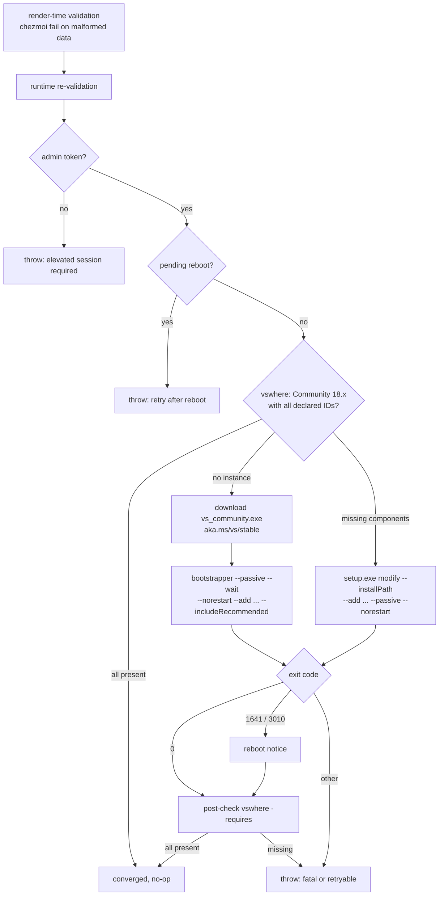

# Windows Visual Studio 2026 Toolchain - Plan

## Goal Capsule

- **Objective:** Managed Windows hosts build native C++ apps, Rust apps on the MSVC toolchain, and .NET apps targeting .NET Framework 4.8 and .NET 10, through one declarative Visual Studio 2026 Community provisioner.
- **Authority hierarchy:** this plan > `AGENTS.md` data-ownership rules > existing provisioner precedents (`.chezmoidata/vscodium.yaml`, `.chezmoiscripts/30-windows/`). External identifier facts (workload/component IDs) are verified against the Microsoft VS 2026 workload-and-component reference and cited under Sources.
- **Stop conditions:** any requirement that forces a `packages.yaml` schema or reconciler change (out of scope per KTD1); any need to uninstall or prune software (additive-only contract); VS 2026 identifier facts contradicted by the live Microsoft reference at implementation time.
- **Execution profile:** data + one Windows-only PowerShell provisioner + Linux-render CI fixtures. No POSIX counterpart exists by design (Windows-only product); the behavior contract lives in the script header and the fixture exercises it.
- **Tail ownership:** `ce-work` implements U1-U3; a human performs the on-device apply verification in Definition of Done (physical Windows host, admin session, multi-GB download).

---

## Product Contract

### Summary

Add Visual Studio 2026 Community with the C++ and .NET desktop workloads to Windows hosts as a declarative, idempotent provisioner: a new data authority declares workloads and components, a new `30-windows` run_onchange script converges them through vswhere detection and the VS setup engine, and Linux-render CI fixtures prove the rendered behavior.

### Problem Frame

Windows hosts in this dotfiles fleet cannot compile C++ or Rust (MSVC toolchain) or build .NET Framework 4.8 / .NET 10 apps today. The package authority (`.chezmoidata/packages.yaml`) and its winget reconciler manage Windows packages, but winget rows cannot express Visual Studio workload and component convergence: `winget upgrade` performs an in-place product update and never adds components to an existing instance. Without a component-level converger, a host with VS present but missing the C++ workload would report converged while remaining unable to build. Rust on Windows is already managed by mise and needs only the MSVC linker and Windows SDK from VS. .NET 10 SDK and .NET Framework 4.8 build support ship as VS components, so a correctly provisioned VS instance covers both without separate SDK installers.

### Requirements

**Native toolchains**

- R1. Managed Windows hosts have Visual Studio 2026 Community with the `Microsoft.VisualStudio.Workload.NativeDesktop` workload, giving C++ desktop builds the MSVC latest toolset (`Microsoft.VisualStudio.Component.VC.Tools.x86.x64`), Windows 11 SDK (`Microsoft.VisualStudio.Component.Windows11SDK.26100`), and CMake tools (`Microsoft.VisualStudio.Component.VC.CMake.Project`).
- R2. The MSVC linker and Windows SDK components that Rust's `stable-msvc` toolchain requires are present; R1's workload plus the explicit components in U1 satisfy this with no rustup-side provisioning.

**.NET toolchains**

- R3. Managed Windows hosts have the `Microsoft.VisualStudio.Workload.ManagedDesktop` workload, giving .NET 10 SDK (`Microsoft.NetCore.Component.SDK`, in-box with VS 2026) and .NET Framework 4.8 build support (`Microsoft.Net.Component.4.8.SDK` plus `Microsoft.Net.Component.4.8.TargetingPack`).

**Provisioning behavior**

- R4. Workloads and components are declared in exactly one data authority; editing that data changes the provisioner's rendered content and re-triggers convergence on the next apply.
- R5. Convergence is detect-then-act: vswhere gates every run; a missing instance installs via the VS bootstrapper; an instance missing declared components converges via `setup.exe modify --add`; the provisioner is additive-only and never removes or prunes.
- R6. Runs are non-interactive and elevation-aware: admin preflight fails with a clear message before any mutation; setup runs `--passive --norestart` (`--wait` on the bootstrapper); exit codes 0, 1641, and 3010 count as success, with 1641/3010 surfacing a reboot notice; a pre-detected pending reboot aborts the run as a failure so chezmoi retries after the reboot.
- R7. Validation is fail-closed: the data is schema-validated at render time (chezmoi `fail`), re-validated at runtime before any mutation, and verified after convergence by a vswhere `-requires` probe over every declared workload and component.
- R8. The provisioner never executes in CI: hosted apply excludes scripts, and verification is renderable off-Windows (execute-template plus pwsh AST parse plus fixture-injected behavior probes), matching the existing native-reconciler test pattern.
- R9. The provisioner's phase sorts before `60-build`, so the mxm4-haptic `cargo build --release` in `.chezmoiscripts/60-build/run_after_build-mxm4-haptic.ps1.tmpl` finds the MSVC linker on a freshly provisioned host. Placement in `30-windows` carries this guarantee; the provisioner must not move to a phase numbered 60 or higher.

### Scope Boundaries

- **Non-goals:** VS 2022 management or removal (side-by-side coexistence is Microsoft's supported posture); the Build Tools SKU; treating VS 2026 Professional/Enterprise as satisfying this declaration (KTD5); uninstalling or pruning any software; Visual Studio extension management; standalone .NET SDK acquisition (KTD2).
- **Deferred to follow-up work:** a device-smoke evidence claim in `.ci/collect-device-evidence.ps1` for real-device VS verification (wezterm-claim precedent); VS extensions as data if the user later wants them.

---

## Planning Contract

### Key Technical Decisions

- KTD1. **Dedicated authority and provisioner, not a packages.yaml winget row.** VS needs component-level convergence on an existing instance (`setup.exe modify --add`); winget's install/upgrade model cannot express it, and a schema `override` field would both keep that gap and force a raw-argument string through the fail-closed validator. The provisioner follows the `.chezmoidata/vscodium.yaml` + `30-windows/run_onchange_after_install-vscodium-extensions.ps1.tmpl` precedent: script-specific data rendered inline, additive-only, fail-closed. Rejected alternatives: (a) winget capability row with `Microsoft.VisualStudio.Community` — cannot converge components (upgrade is not modify; the reconciler accepts `0x8A15002B` no-upgrade as converged); (b) packages.yaml schema extension for `--override` — same convergence gap plus a validation hole; (c) `winget configure` + Microsoft.VisualStudio.DSC — additive-only like `--add` but adds a DSC provider dependency with single-instance limitations and no repo precedent.
- KTD2. **No standalone .NET SDK package.** `Microsoft.NetCore.Component.SDK` (Required by ManagedDesktop) ships the .NET 10 SDK with VS 2026 and VS services it; Microsoft guidance reserves the standalone SDK for VS-less or version-decoupled hosts. Rejected alternative: a `Microsoft.DotNet.SDK.10` winget row — duplicates the VS-shipped SDK and winget cannot even see VS-shipped SDKs for dependency resolution (winget-cli #4201), so the row would double-install.
- KTD3. **vswhere-gated detect-then-install/modify convergence.** vswhere at the fixed `%ProgramFiles(x86)%\Microsoft Visual Studio\Installer\vswhere.exe` path is the only hardcoded path; the install root is always resolved via vswhere. Fresh installs download the bootstrapper from `https://aka.ms/vs/stable/vs_community.exe` (the VS 2026 Stable alias; the URL scheme changed from VS 2022's `aka.ms/vs/17/release/...`) and run `--passive --wait --norestart --add ... --includeRecommended`. Existing instances run `setup.exe modify --installPath <vswhere-resolved> --add ... --passive --norestart` from a different working directory. `--add` is idempotent at the component level and additive-only, which matches the repo's install/update/repair-without-prune semantics.
- KTD4. **Exit-code and reboot contract.** 0, 1641, and 3010 map to success; 1641/3010 additionally emit a reboot-required notice. A pending reboot detected before setup (Component Based Servicing\RebootPending, WindowsUpdate RebootRequired, PendingFileRenameOperations) throws, so chezmoi records failure and retries on the next apply after the user reboots. Codes for VS-in-use (1003/8006) and another-installer-running (1618) also throw as retryable-on-next-apply; everything else throws as fatal with the log locations (`%TEMP%\dd_*`) named in the message.
- KTD5. **Community edition, Stable channel, generation pinned by version range — not by winget ID.** The convergence gate is `vswhere -products Microsoft.VisualStudio.Product.Community -version "[18.0,19.0)" -requires <declared IDs>`. There is no `Microsoft.VisualStudio.2026.Community` winget ID (winget-pkgs #312417): the unversioned `Microsoft.VisualStudio.Community` now serves 18.x, so the winget ID cannot pin the VS generation and is not used. Side-by-side with VS 2022 is supported and left alone.
- KTD6. **mise keeps owning Rust; VS supplies only its MSVC prerequisites.** `dot_config/mise/config.toml` already installs Rust cross-platform. rustup-init's prerequisite auto-install is broken for detection (rustup #4699) and is moot here because mise owns the toolchain. The full NativeDesktop workload, not the two-component minimal set, is the reliable satisfaction path (same issue).

### High-Level Technical Design

Convergence flow per apply run on a Windows host:

### Assumptions

- A1. The data authority is a new script-specific file (`.chezmoidata/visualstudio.yaml`), and Visual Studio stays out of `packages.yaml`; the file header records the ownership boundary so the one-owner lint stays meaningful. Un-validated bet: the parity contract prefers ledger entries, but no ledger owner can express component convergence (KTD1).
- A2. The VS-shipped .NET 10 SDK satisfies CLI `dotnet` use on these hosts; no host needs a VS-decoupled SDK band.
- A3. `includeRecommended` is fixed on in the script (covers host-arch-appropriate components such as ARM64 tools on arm64 devices) rather than exposed as a data knob.
- A4. The bootstrapper is fetched at apply time from the `aka.ms` latest-Stable alias without a checksum pin; the trust anchor is HTTPS to the Microsoft CDN. A pinned hash would break on every VS Stable refresh, and the repo's release-lock mechanism does not cover VS.
- A5. Provisioning order against mise's Rust install needs no enforcement: `rustup`/mise installs Rust without VS, and only the first native link needs the MSVC linker, which any later apply converges.
- A6. Real-device verification is human-performed (Definition of Done); no device-smoke collector claim ships in this change.

### Sources

- Microsoft VS 2026 workload and component IDs: `https://learn.microsoft.com/en-us/visualstudio/install/workload-component-id-vs-community?view=vs-2026`
- Command-line parameters, exit codes, winget `--override` semantics: `https://learn.microsoft.com/en-us/visualstudio/install/use-command-line-parameters-to-install-visual-studio?view=visualstudio`
- vswhere location and query syntax: `https://github.com/microsoft/vswhere`
- VS 2026 release history and channels (GA 18.0.0 2025-11-11; Stable 18.8.2): `https://learn.microsoft.com/en-us/visualstudio/releases/2026/release-history`
- Unversioned winget ID decision: `https://github.com/microsoft/winget-pkgs/issues/312417`
- Rust MSVC prerequisites: `https://rust-lang.github.io/rustup/installation/windows-msvc.html`; detection failure: `https://github.com/rust-lang/rustup/issues/4699`
- .NET 10 LTS with VS 2026: `https://devblogs.microsoft.com/dotnet/announcing-dotnet-10/`
- .NET Framework 4.8 runtime in-box on Windows 11; targeting/developer pack for builds: `https://learn.microsoft.com/en-us/dotnet/framework/install/guide-for-developers`
- VS 2026 drops Windows 10 SDK component IDs (do not reuse VS 2022 configs): `https://github.com/microsoft/PowerToys/commit/15cb76f9b874a368b78bc5ad071dccfc2f796822`
- Repo precedents: `.chezmoidata/vscodium.yaml`, `.chezmoiscripts/30-windows/run_onchange_after_install-vscodium-extensions.ps1.tmpl`, `.chezmoiscripts/20-windows/run_onchange_before_winget.ps1.tmpl` (elevation preflight), `.ci/test-native-package-reconcilers.sh` (render + AST + fixture pattern), `docs/plans/2026-07-29-005-feat-safenet-5110-code-signing-plan.md` (human-gated DoD precedent)

### Risks & Dependencies

| Risk | Mitigation |
|---|---|
| The bootstrapper fetch is the repo's first PowerShell apply-time download and its first unpinned tool download; the repo culture is pin-by-default (releases.json lock, kitty/Homebrew sha256 pins). | A4 records the accepted deviation: the `aka.ms` Stable alias moves with every VS refresh, so no hash can be pinned; the trust anchor is HTTPS to the Microsoft CDN. U2 specifies the retry/timeout posture the kitty (`--retry 3`) and GNOME (`--max-time`) precedents established. |
| A YAML syntax error in `visualstudio.yaml` breaks every chezmoi command on every OS; `.chezmoidata` loads eagerly, while the script's render-time `fail` guards fire only in Windows-context renders. | CI render gates cover all four OS contexts on every PR; the schema stays flat (scalars plus two string lists). |
| The `--wait` install can block an apply for tens of minutes (multi-GB), and interrupting it can leave a partial instance. | The vswhere post-check and `modify` path converge a partial instance on the next apply; the pending-reboot preflight catches the worst partial state. |
| The script is the first admin-requiring `30-windows` provisioner and sorts alphabetically before `install-vscodium-extensions.ps1`; a VS failure aborts the apply before the previously always-passing VSCodium step. | Accepted: the `20-windows` winget phase already requires elevation for existing machine-scope rows, so the operational posture is unchanged; chezmoi retries the whole phase on the next apply. |
| VS open during an apply (setup exits 1003/8006) or another installer running (1618) fails the run. | KTD4 maps these codes to throw-and-retry on the next apply. |
| The `aka.ms` alias and unversioned winget ID move with VS Stable churn; a future VS generation could silently change what the URL serves. | KTD5 pins the generation through the vswhere version range, not the URL; the stop condition in the Goal Capsule covers contradiction of the cited identifier facts. |

Dependencies: network access to the Microsoft CDN at apply time; an elevated PowerShell session (already the norm for managed Windows hosts); mise-owned Rust for the toolchain itself (KTD6); pwsh on the windows-2025 CI runner (preinstalled) for the U3 fixture.

---

## Implementation Units

### U1. Visual Studio data authority

**Goal:** One data file declares the VS 2026 edition/channel identity and the full workload/component set.

**Requirements:** R1, R2, R3, R4

**Dependencies:** none

**Files:** `.chezmoidata/visualstudio.yaml` (create); `AGENTS.md` (add the data file to the single-source-of-truth ownership table)

**Approach:**

1. Declare `product` (`Microsoft.VisualStudio.Product.Community`), `versionRange` (`[18.0,19.0)`), and `bootstrapperUrl` (`https://aka.ms/vs/stable/vs_community.exe`) so the edition/generation identity is data, not script literal.
2. Declare `workloads`: `Microsoft.VisualStudio.Workload.NativeDesktop`, `Microsoft.VisualStudio.Workload.ManagedDesktop`.
3. Declare `components`: `Microsoft.VisualStudio.Component.VC.Tools.x86.x64`, `Microsoft.VisualStudio.Component.Windows11SDK.26100`, `Microsoft.VisualStudio.Component.VC.CMake.Project`, `Microsoft.Net.Component.4.8.TargetingPack`. (The 4.8 SDK and .NET 10 SDK land as Required components of ManagedDesktop; the targeting pack is Recommended, so it is pinned explicitly per R3.)
4. Header comment follows the `.chezmoidata/vscodium.yaml` pattern: names the consuming script, states that the data renders inline so edits re-trigger the run_onchange, and records the ownership boundary (Visual Studio is managed here, not in `packages.yaml`). The `AGENTS.md` ownership-table row mirrors that boundary in the repo's documentation.

**Patterns to follow:** `.chezmoidata/vscodium.yaml` header and list shape.

**Test scenarios:**

- Covered by U3 fixtures: a malformed workload ID in this file aborts rendering with `fail`; the rendered script contains every declared ID.

**Verification:** the data renders into the U2 script on a Windows-context `execute-template`, and the U3 negative fixture proves a malformed entry aborts the render.

### U2. Visual Studio provisioner script

**Goal:** Idempotent, non-interactive convergence of the declared VS 2026 state on Windows hosts.

**Requirements:** R4, R5, R6, R7, R9

**Dependencies:** U1

**Files:** `.chezmoiscripts/30-windows/run_onchange_after_install-visual-studio.ps1.tmpl` (create)

**Approach:**

1. Render-gate with `{{ if eq .chezmoi.os "windows" }}`; validate the data at render (IDs match `^[A-Za-z0-9][A-Za-z0-9.]*$`, version range and aka.ms URL shapes) with chezmoi `fail`, mirroring the vscodium script's two-stage validation. No `.chezmoiignore` change: the existing `30-windows/*.ps1` non-Windows block covers it. Placement in `30-windows` is load-bearing per R9: the phase must sort before `60-build` so the mxm4-haptic cargo build finds the MSVC linker.
2. Runtime, `$ErrorActionPreference = 'Stop'`: re-validate the rendered arrays before any mutation.
3. Preflight an admin token unconditionally — unlike the winget reconciler's data-conditional gate, VS setup always requires elevation — and fail with the winget preflight's message shape before any mutation; then the KTD4 pending-reboot probe, throwing to retry after reboot.
4. Gate on vswhere per KTD5; short-circuit to converged when every declared workload and component is present.
5. Fresh instance: download the bootstrapper to `$env:TEMP` with bounded retries and a timeout (the `Invoke-WebRequest` equivalent of the kitty `--retry 3` and GNOME `--max-time` precedent), then invoke per KTD3 with `--includeRecommended`; existing instance: invoke `setup.exe modify` per KTD3.
6. Map exit codes per KTD4, then post-verify with a single vswhere `-requires` probe over all declared IDs; throw on any miss so the next apply retries.

**Execution note:** This is packaging/provisioning; prefer render and fixture-injected behavior proof over unit coverage, and hold real-device verification for the human-gated DoD step.

**Patterns to follow:** `.chezmoiscripts/30-windows/run_onchange_after_install-vscodium-extensions.ps1.tmpl` (structure, header contract, validation twice, additive-only); `.chezmoiscripts/20-windows/run_onchange_before_winget.ps1.tmpl` (admin preflight message shape); KTD16 of the parity plan (argument-array emission, never string eval).

**Test scenarios:**

- No VS instance: the fixture bootstrapper receives the declared workloads, components, `--passive`, `--wait`, `--norestart`, `--includeRecommended`.
- Existing Community 18.x instance missing one declared component: `setup.exe modify` runs with only `--add` arguments and the vswhere-resolved install path; no bootstrapper download.
- All declared IDs present: no setup process starts; script reports converged.
- Bootstrapper exits 3010: success path, reboot notice emitted, no throw.
- Bootstrapper exits 1603: script throws and names `%TEMP%\dd_*` logs.
- Pending-reboot registry key present: script throws before any download or setup invocation.
- Non-elevated session: script throws before any mutation.
- Post-check vswhere reports a missing component after a 0 exit: script throws (retry next apply).

**Verification:** every scenario above passes under U3's fixture injection, and PSScriptAnalyzer reports no warnings or errors on the rendered script.

### U3. CI render verification

**Goal:** Prove the rendered provisioner on every PR, without installing VS.

**Requirements:** R7, R8

**Dependencies:** U1, U2

**Files:** `.ci/test-visualstudio-provisioner.sh` (create); `.github/workflows/ci.yml` (add the fixture to the native-windows-x64 step `Run Windows package, trust, editor, Wi-Fi, and garden parity fixtures` beside `.ci/test-native-package-reconcilers.sh`)

**Approach:**

1. Render the script for `windows/amd64` and `windows/arm64` via `chezmoi execute-template` with `--override-data` and the repo's isolated scratch/stub-`op` recipe; parse both renders with the PowerShell AST under `pwsh` and assert zero parse errors. The fixture needs pwsh, so in CI it runs in the windows-2025 job's Git Bash step (the reconciler/vscodium fixture pattern — no Linux CI job carries pwsh); locally it also runs on Linux with pwsh installed.
2. Extract and exercise the convergence logic against fixture-injected `vswhere`/`setup.exe`/bootstrapper functions for the U2 scenarios, mirroring how `test-native-package-reconcilers.sh` exercises `Invoke-Winget`.
3. Content assertions: rendered script contains each U1 workload and component ID; forbids `Windows10SDK` IDs (removed in VS 2026) and any hardcoded VS install root.
4. Negative render fixture: a mutated data copy with a malformed workload ID must abort rendering with the validator's message.

**Patterns to follow:** `.ci/test-native-package-reconcilers.sh` (render + AST + fixture injection + requires/forbids); `.ci/test-vscodium-extensions.sh` (editor-provisioner fixture precedent).

**Test scenarios:**

- Both architectures render and parse clean.
- Rendered content carries every declared ID and no forbidden IDs or paths.
- Each U2 behavior scenario passes under fixture injection in the windows-2025 CI job and in local runs with pwsh.

**Verification:** the fixture exits 0 in the native-windows-x64 CI job and locally; the ci.yml diff adds exactly one line to the existing bash fixture step.

---

## Verification Contract

| Gate | Command / mechanism | Proves |
|---|---|---|
| New fixture | `.ci/test-visualstudio-provisioner.sh` (windows-2025 CI job; local runs need pwsh) | U2/U3 render, parse, behavior scenarios |
| Reconciler regression | `.ci/test-native-package-reconcilers.sh` | winget reconciler untouched |
| Manifest regression | `.ci/test-packages-manifest.sh`; `.ci/test-package-ownership.sh` | packages.yaml authority and one-owner lint unchanged |
| Render smoke | isolated `chezmoi execute-template` recipe from `AGENTS.md` for the new script | template renders off-Windows without secrets |
| PowerShell lint | `render-dotfiles.yml` `lint-powershell` (PSScriptAnalyzer on rendered scripts; automatic) | script style and correctness rules |
| Native CI | `ci.yml` windows-2025 job executes the new fixture | render + behavior on a real Windows PowerShell |
| Hygiene | `git diff --check` | whitespace/conflict markers |

## Definition of Done

- U1-U3 implemented; every Verification Contract gate green locally where runnable, and both `render-dotfiles.yml` and `ci.yml` green on the PR.
- No changes to `packages.yaml`, the winget reconciler, or the package validator; the diff is limited to the U1-U3 files plus this plan.
- No abandoned-attempt code or fixtures left in the diff.
- Human-gated device verification (safenet-plan precedent, recorded here not in CI): on a real Windows host, run `chezmoi apply` elevated; confirm vswhere reports Community 18.x with all declared workloads/components; confirm `dotnet --list-sdks` shows a 10.x band and a `net48` target builds; confirm the `60-build` phase's mxm4-haptic `cargo build --release` completes against the MSVC linker (R9).
