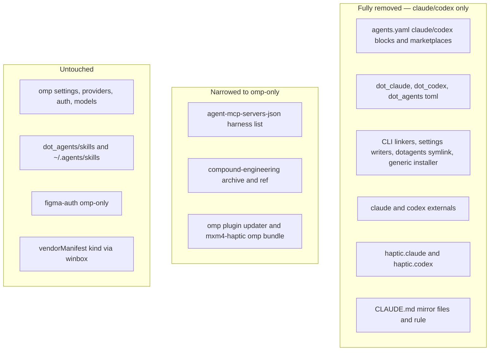
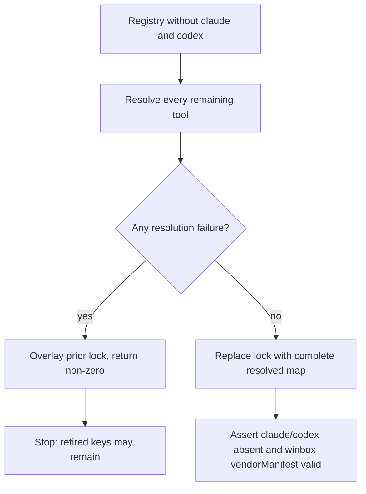

# Un-manage Claude Code and Codex - Plan

## Goal Capsule

- **Objective:** Stop managing Claude Code (`claude`) and Codex (`codex`) as agent harnesses — every chezmoi-owned surface — leaving `omp` as the sole managed harness; remove the repository `CLAUDE.md` mirror convention; and clean this host's deployed configuration, binaries, and payloads once. A fresh host converges to omp-only.
- **Product authority:** The user's session-settled decisions govern scope, the host-cleanup boundary, and the mirror-rule removal. The root `AGENTS.md` and `.chezmoitemplates/agents-instructions.tmpl` govern repository convention; `docs/plans/2026-07-30-004-chore-unmanage-legacy-agent-harnesses-plan.md` is the removal precedent this plan mirrors.
- **Execution profile:** A coordinated source cutover plus a one-time host-local cleanup. Intermediate source states need not render; the final branch must pass every surviving render, package, and CI contract without applying to live `$HOME`.
- **Stop conditions:** Stop if narrowing a shared mechanism would remove a capability omp still needs, if the mirror-rule removal would orphan a non-Claude consumer, or if the host cleanup would touch any path belonging to omp or another tool.
- **Tail ownership:** Local proof uses isolated scratch rendering and package checks. The pull request owns final `ci.yml` and `render-dotfiles.yml` proof; the host cleanup is a documented operator step, not a chezmoi-managed prune.

---

## Product Contract

### Summary

Delete every chezmoi-managed surface for `claude` and `codex` — data blocks, target trees, apply scripts, CLI externals, release-lock entries, CI assertions, and docs — and remove the repository `CLAUDE.md` mirror convention. Shared mechanisms (compound-engineering archive, mxm4-haptic, MCP rendering, skills) narrow to omp-only in place; omp keeps every current capability. On this host, deployed configuration, installed binaries, and downloaded payloads are removed once as a manual operator action, not a recurring chezmoi prune.

### Problem Frame

The repository narrowed its managed harnesses to `claude`, `codex`, and `omp` on 2026-07-30, when five legacy harnesses were un-managed because the user consolidated on `omp`. Claude and Codex still carry apply-time work that no longer pays: settings reconciliation into the live `~/.claude/settings.json`, per-agent plugin installation, MCP rendering through the shared dotagents file, per-harness instruction composition, release-lock refresh, and per-consumer CI assertions. Removing them finishes the consolidation.

These two differ from the five legacy harnesses in one structural way: they anchor a repository-documentation convention — every `AGENTS.md` directory keeps a sibling `CLAUDE.md` set to `@AGENTS.md` — whose sole purpose was feeding Claude Code. With Claude Code gone, that maintenance cost no longer pays, so the convention is removed alongside the harness management.

### Key Decisions

- **Two harnesses out, omp stays sole.** `claude` and `codex` stop being managed; `omp` is the only managed harness. (session-settled: user-directed — chosen over retaining either as a secondary harness: the user has consolidated on omp.) Governs R1, R2, R6, R7, R8.
- **Narrow in place, keep the multi-harness abstractions.** Shared templates and scripts collapse to omp-only rather than being flattened; the per-harness instruction-composition framework and MCP harness-id list stay, narrowed. (session-settled: user-directed — chosen over flattening the now-single-harness scaffolding: lowest risk, preserves omp's working surfaces, matches the 2026-07-30 precedent's explicit deferral of an inventory refactor.) Governs R3, R4, R5.
- **Unmanage without a managed prune; clean this host once.** No `.chezmoiremove` entry or `remove_` source is added; deployed configuration, installed binaries/symlinks, and downloaded payloads are removed on this host as a one-time operator action. (session-settled: user-directed — chosen over leaving deployed state as residue and over a permanent host-universal `.chezmoiremove`: this host gets fully cleaned, but fresh hosts simply never receive the two harnesses.) Governs R10, R11.
- **Remove the `CLAUDE.md` mirror convention entirely.** Delete the `@AGENTS.md` mirror files and strip the mirror-rule mandate from the instruction sources; the rule existed to feed Claude Code. (session-settled: user-directed — chosen over retaining the convention as harmless documentation: with Claude Code gone the maintenance cost no longer pays.) Governs R9.
- **omp owns the `.claude-plugin/marketplace.json` format.** omp's plugin updaters and CI read that path as a marketplace-format artifact; claude-named paths in omp scripts survive as format, not Claude dependency. Governs R5.
- **`dot_agents/skills/` is harness-neutral and stays.** omp reads `~/.agents/skills` natively; only the claude/codex MCP-and-symlink file under `dot_agents/` is removed. Governs R2.

### Requirements

**Data and target removal**

- R1. `claude` and `codex` must own no block in `.chezmoidata/agents.yaml` — including their `settings`/`plugins` blocks and the `dotfiles`, `dotfiles-codex`, and `claude-plugins-official` marketplace rows — and no `haptic.claude`/`haptic.codex` waveform blocks in `.chezmoidata/haptic.yaml`. omp's blocks are unchanged.
- R2. The claude/codex target trees must be deleted: `dot_claude/`, `dot_codex/`, and the `dot_agents/private_readonly_agents.toml.tmpl` MCP/trust file that owns the `~/.claude/skills` and `~/.codex/skills` symlinks. `dot_agents/skills/` is harness-neutral and remains.

**Shared mechanisms narrowed to omp-only**

- R3. The MCP harness-id list must narrow to `omp` only; a `harnessSkip` value or id naming `claude` or `codex` must fail rendering with an unknown-harness error. omp's MCP file remains the sole MCP target.
- R4. The generic claude+codex plugin installer (`run_onchange_after_install-agent-plugins.{sh,ps1}.tmpl`) must be deleted — omp is not served by it and keeps its own updater — along with the deployed plugin trees `dot_local/share/claude-plugins/` and `dot_local/share/codex-plugins/`.
- R5. omp's compound-engineering and mxm4-haptic provisioning must remain byte-identical in behavior, including any `.claude-plugin/marketplace.json` path it reads as a marketplace-format artifact. No omp script, updater, or CI assertion may be weakened or removed.

**Scripts, externals, and release-lock**

- R6. Every apply-time script that exists only to install, link, or configure the claude or codex CLI or its settings must be deleted — the per-CLI linkers, the claude-settings read-merge writers, and the dotagents-skills symlink installer, in both POSIX and Windows halves. No surviving script may reference `claude` or `codex` as a managed consumer.
- R7. The `claude` and `codex` CLI externals must be removed from `.chezmoiexternals/ai-agents.toml` — only the standalone `[claude]` and `[codex]` external stanzas. The compound-engineering marketplace row's `os` field and the archive external's OS emission both STAY, because omp's plugin updater reads that field for linux/darwin eligibility (with a Windows special-case). omp's archive consumption is unchanged.
- R8. The `claude` and `codex` release-lock entries must be removed through `packages/release-lock` and an authoritative regeneration, never by hand-editing `.chezmoidata/releases.json`. The `vendorManifest` resolver kind stays for `winbox`; the `"claude"` vendor name, the `resolveClaude` branch, the `"claude"` `VendorName` member, and their tests are removed as a dead adapter.

**Mirror convention**

- R9. The repository `CLAUDE.md` mirror convention is removed: the `@AGENTS.md` mirror files at repository root and under `packages/` are deleted, and the mirror-rule mandate is stripped from both the repository-root `AGENTS.md` and the shared `.chezmoitemplates/agents-instructions.tmpl` body. The surrounding routing and lfg text in that body is unchanged. `.chezmoiignore` is updated for the deleted mirror files, and no new mirror file or mandate may be introduced.

**Host state**

- R10. No `.chezmoiremove` entry or `remove_` source may be added for `claude` or `codex`. Source ownership ends; the host cleanup is the operator step in R11, not a chezmoi prune.
- R11. A one-time operator cleanup removes, on this host only: the deployed configuration trees `~/.claude/` and `~/.codex/`; the installed CLI binaries and symlinks and any claude/codex CLI shims under `~/.local/bin/`; the downloaded external payloads at `~/.local/share/claude/versions/` and `~/.codex/packages/standalone/`; and the deployed plugin trees `~/.local/share/claude-plugins/` and `~/.local/share/codex-plugins/`. It must not touch any path belonging to omp or another tool, and it is documented once rather than added as a chezmoi mechanism.

**Verification surfaces and documentation**

- R12. Every Linux, macOS, and Windows job in `.github/workflows/render-dotfiles.yml` and `.github/workflows/ci.yml` must carry no assertion, step, or job owned by `claude` or `codex` — including the `codex-wrapper` job and its tokscale test — and each remaining step must stay valid. The shared MCP-consumer inventory and the plugin-installer smoke narrow to omp-focused coverage.
- R13. The repository-root `AGENTS.md` and `README.md` must describe only `omp` as the managed harness and drop the claude/codex managed-set prose, the "shared Claude/Codex dotagents target" description, and the "ships to Claude and Codex" compound-engineering/mxm4-haptic wording, while omp's description stays accurate.

### Acceptance Examples

- AE1. **Covers R3.** Given an MCP server carries a `harnessSkip` value or id naming `claude` or `codex`, when the MCP target renders, then rendering fails with an unknown-harness error; `omp` renders its MCP file unchanged.
- AE2. **Covers R5.** Given omp renders on Linux, macOS, and Windows, then omp's compound-engineering and mxm4-haptic provisioning resolves the same archive, registers the plugin through its `.claude-plugin/marketplace.json` read path, and no omp updater or CI assertion is weakened.
- AE3. **Covers R8.** Given a clean release-lock regeneration from the narrowed registry, then no `claude` or `codex` key remains, `vendorManifest` still resolves `winbox` without a `resolveClaude` branch, and every surviving entry is byte-unchanged unless its upstream moved during the run.
- AE4. **Covers R9.** Given the cutover, then no `CLAUDE.md` mirror file exists at repository root or under `packages/`, neither the repository-root `AGENTS.md` nor the rendered shared instruction body contains a `CLAUDE.md`-sibling mandate, and the surviving routing and lfg text is byte-identical.
- AE5. **Covers R10, R11.** Given the cutover and a subsequent apply, then no `.chezmoiremove` or `remove_` source prunes `claude` or `codex`; the one-time operator cleanup removes the enumerated host paths and touches nothing belonging to omp.
- AE6. **Covers R2.** Given `dot_agents/` after the cutover, then the `private_readonly_agents.toml.tmpl` file is gone but `dot_agents/skills/` deploys unchanged to `~/.agents/skills`.

### Success Criteria

- Every changed template and surviving script renders through `chezmoi execute-template` with stub `op`, empty config, `--source "$PWD"`, and a per-user throwaway destination. No rendered output contains an unresolved `op://` reference.
- An extracted target-tree comparison shows only `claude`/`codex` targets disappearing and the `CLAUDE.md` mirror files gone; surviving omp targets compare byte-for-byte. Rendered scripts are compared separately because archive output excludes scripts.
- Source searches find no live management reference to `claude` or `codex` as a managed harness. Deliberate exceptions: historical plans, the `.claude-plugin/` format-artifact paths in omp scripts and CI, and the host-cleanup note.
- The TypeScript workspace (`packages/release-lock`, `packages/mxm4-haptic`) builds, type-checks, and tests after pruning.
- Both `ci.yml` and `render-dotfiles.yml` reach terminal success on the pull request.

### Scope Boundaries

- **Deferred for later.** Flattening the per-harness instruction-composition and MCP harness-id abstractions now that one harness remains. This matches the 2026-07-30 precedent's explicit deferral of an inventory refactor.
- **Outside this change.** omp's settings, model providers and models, auth, and haptic runtime are untouched. Provider-side OAuth/registration revocation for the retired clients is not wired in (host file cleanup only). The VSCodium Claude Code extension and its settings are editor integration, not a managed harness surface, and stay.

### Dependencies and Assumptions

- A1. omp's compound-engineering and mxm4-haptic consumption does not depend on the `claude` or `codex` CLI binaries or their plugin trees.
- A2. A zero-failure `release-lock` run is authoritative and prunes retired keys; a partial run overlays the prior lock and is not acceptable proof for this change.
- A3. The `vendorManifest` kind remains load-bearing for `winbox` after the `"claude"` vendor resolver is removed.
- A4. The repository-root and `packages/` `CLAUDE.md` files exist solely to satisfy the mirror rule and have no consumer other than Claude Code.
- A5. Live `$HOME` may still contain `claude`/`codex` names after the source cutover; the operator cleanup in R11 is what clears this host.

### Sources / Research

- `.chezmoidata/agents.yaml`, `.chezmoidata/haptic.yaml` — claude/codex blocks, marketplace rows, MCP harness-id list.
- `dot_claude/`, `dot_codex/`, `dot_agents/` — managed targets; the harness-neutrality of `dot_agents/skills/`.
- `.chezmoitemplates/agents-instructions.tmpl`, `.chezmoitemplates/agent-mcp-servers-json.tmpl`, `.chezmoitemplates/compound-engineering-ref.tmpl` — shared composition and the omp-only island.
- `.chezmoiscripts/70-agents/` (`install-agent-plugins`, `config-claude-settings`, `install-dotagents-skills`, `update-omp-plugins`) and `.chezmoiscripts/00-tools/` (claude/codex linkers) — apply scripts.
- `.chezmoiexternals/ai-agents.toml` — `claude` and `codex` CLI externals.
- `packages/release-lock/` (`registry.ts`, `vendor-manifest.ts`, `types.ts`, tests) — lock entries and the `vendorManifest`/`winbox` resolver split.
- `.github/workflows/{ci,render-dotfiles}.yml` and `.ci/` (`smoke-agent-plugin-installer.sh`, `test-codex-tokscale-wrapper.sh`, `test-mxm4-haptic-{gates,hook-events}.sh`, `test-omp-agent-reconcile.sh`, `test-package-ownership.sh`) — CI assertions.
- `AGENTS.md`, `README.md` — managed-set prose and the `CLAUDE.md` mirror-rule mandate.
- `docs/plans/2026-07-30-004-chore-unmanage-legacy-agent-harnesses-plan.md` — the removal precedent this plan mirrors, including its "unmanage without pruning" and "retain the resolver kind, drop the dead adapter" decisions.
- No `docs/solutions/` or `CONCEPTS.md` corpus exists.

---

## Planning Contract

**Product Contract preservation:** planning confirmed the generic plugin installer serves no omp consumer (fully removed, not narrowed); confirmed `winbox` carries its own vendor name so the `"claude"` resolver branch is dead and removable while the `vendorManifest` kind stays; and confirmed the `agents-instructions.tmpl` body carries routing and lfg text alongside the mirror mandate, so only the mirror paragraph is stripped. All user-settled choices, scope boundaries, and stable R/AE ids remain intact.

### Key Technical Decisions

- KTD1. **Land the cutover as one atomic branch.** (session-settled: user-directed — chosen over a staged compatibility bridge: temporary duplicate state would weaken single-source invariants without shrinking the final review; mirrors the 2026-07-30 precedent.) Governs sequencing across U1–U6.
- KTD2. **Narrow every shared template and script to omp-only in place; keep the multi-harness composition framework.** Remove only the claude/codex callers and list entries; do not flatten the per-harness instruction-composition template or the MCP harness-id abstraction. (session-settled: user-directed — chosen over flattening the now-single-harness scaffolding: lowest risk, preserves omp's working surfaces.) Governs R3, R4, R5.
- KTD3. **Delete the generic claude+codex plugin installer wholesale.** omp is not served by `run_onchange_after_install-agent-plugins` (it has its own updater), so the installer and its smoke are removed entirely, not narrowed. Governs R4.
- KTD4. **Drop the `"claude"` vendor resolver; keep the `vendorManifest` kind for `winbox`.** Remove the `resolveClaude` branch, the `"claude"` `VendorName` member, the claude registry entry, and their tests; `resolveWinbox` and the kind stay. (session-settled: user-directed — chosen over text-matching deletion: winbox is a distinct vendor and keeps the kind load-bearing; mirrors the precedent's AGY-adapter rule.) Governs R8.
- KTD5. **Require an authoritative release-lock regeneration.** A zero-failure `release-lock` run replaces the lock and prunes retired keys; a partial run overlays old data, returns non-zero, and blocks completion. Governs R8.
- KTD6. **Strip only the CLAUDE.md mirror paragraph from the shared instruction body.** The `agents-instructions.tmpl` body also carries routing and lfg text; remove only the `@AGENTS.md` sibling-mirror mandate, leaving the rest byte-identical. Governs R9.
- KTD7. **No managed prune; host cleanup is a documented operator step.** Add no `.chezmoiremove` or `remove_` source; the one-time host cleanup (config, binaries, payloads) is documented and executed on this host only. (session-settled: user-directed — chosen over a permanent `.chezmoiremove`: this host is cleaned once, fresh hosts never receive the harnesses.) Governs R10, R11.

### High-Level Technical Design

The cutover sorts every affected surface into three fates:

Release-lock retirement follows the same branch contract as the precedent:

### Assumptions

- A6. The compound-engineering marketplace row's `os` field is load-bearing for omp — its plugin updater reads it for linux/darwin eligibility (with a Windows special-case) — so it stays. (Implementation refuted the original draft's claim that the field was dead; corrected in place.)
- A7. The repo-root and `packages/` `CLAUDE.md` files are non-deployed repository docs (listed in `.chezmoiignore`); deleting them is a documentation change, not a managed-target removal.
- A8. `dot_agents/skills/` has no claude/codex-specific consumer; omp reaches `~/.agents/skills` natively with the compatibility providers disabled.
- A9. The `codex-wrapper` CI job and `test-codex-tokscale-wrapper.sh` exist only to serve the codex CLI wrapper and are removed with it.

### Sequencing

U1 removes the data blocks and target trees first so no surviving consumer references a deleted block. U2 narrows the shared templates and removes the generic installer against the narrowed data. U3 removes the per-CLI scripts and externals. U4 retires release-lock entries and the claude vendor resolver after U1 removes the data-block consumers. U5 removes the mirror convention independently. U6 narrows CI and updates documentation after all final surfaces are known. The final branch is verified as one unit; no live apply is part of implementation.

### System-Wide Impact

- **Fresh hosts:** Only omp agent configuration, CLI, plugins, and skills are managed. claude and codex tools are not downloaded.
- **Existing hosts:** Removed targets, binaries, payloads, and credentials remain in place until the one-time operator cleanup (R11); they receive no further updates.
- **Surviving agents:** omp keeps the same compound-engineering, mxm4-haptic, MCP, and skills paths, byte-identical in behavior.
- **Automation:** aoe continues to reconcile its declared leaves; omp settings reconciliation is unchanged.
- **CI:** Render jobs stop expecting claude/codex targets. Per the user directive for this change, GitHub Actions CI is not watched (it is pre-existing broken); workflow files are still kept valid YAML.
- **Operational side effects:** No system service or network configuration changes. A later real apply can rerun the surviving omp onchange scripts because their rendered authority source is unchanged.

### Risks and Mitigations

- **Over-reach into omp's `.claude-plugin` paths:** Removing "everything claude" could delete omp's marketplace-format reads. Mitigation: pin omp updaters and CI in source search; byte-compare omp targets before and after.
- **Stale reference in a shared file:** A surviving template or script still names claude or codex. Mitigation: render every surviving template and script; source-search the final branch.
- **Partial lock refresh:** Retired entries survive via overlay semantics. Mitigation: accept only a zero-failure refresh and assert the final key set.
- **Mirror-rule text entangled with routing/lfg:** Stripping too much from `agents-instructions.tmpl` changes omp's deployed instructions. Mitigation: remove only the mirror paragraph; byte-compare the surviving body.
- **Invalid workflow YAML:** Removing a CI step leaves a dangling reference. Mitigation: review both workflow files and keep them valid even though CI is not run for this change.
- **Host-cleanup over-reach:** The operator step deletes a path belonging to omp or another tool. Mitigation: enumerate only the retired-harness paths in R11; the operator step touches nothing else.

---

## Implementation Units

### U1. Delete claude/codex data blocks and target trees

- **Goal:** Remove every `.chezmoidata` block and managed target owned only by claude or codex.
- **Requirements:** R1, R2; KTD1; AE6.
- **Dependencies:** None.
- **Files:** `.chezmoidata/agents.yaml`; `.chezmoidata/haptic.yaml`; `dot_claude/`; `dot_codex/`; `dot_agents/private_readonly_agents.toml.tmpl`.
- **Approach:** Delete the `claude:` and `codex:` blocks, the `dotfiles`, `dotfiles-codex`, and `claude-plugins-official` marketplace rows, and the `haptic.claude`/`haptic.codex` waveform blocks. Delete the `dot_claude/` and `dot_codex/` target trees and the dotagents MCP/trust file. Keep `dot_agents/skills/` and every omp block byte-identical.
- **Patterns to follow:** Data-driven deletion from `.chezmoidata`; the 2026-07-30 precedent's target-tree removal.
- **Test scenarios:**
  - Render the surviving target tree and confirm `dot_claude/`, `dot_codex/`, and the dotagents toml disappear while `dot_agents/skills/`, `dot_omp/`, and `dot_local/share/omp-plugins/` outputs remain unchanged.
  - Render `.chezmoidata/agents.yaml`-driven templates and confirm no block references claude or codex as a managed harness.
  - Covers AE6. `dot_agents/skills/daily-report/` still deploys to `~/.agents/skills/daily-report`.
- **Verification:** No source-owned data block or target tree remains for the two harnesses; `dot_agents/skills/` and omp blocks are unchanged.

### U2. Narrow shared templates and plugin installer to omp-only

- **Goal:** Collapse every shared mechanism that served claude/codex alongside omp down to omp-only, without weakening omp.
- **Requirements:** R3, R4, R5; KTD2, KTD3; AE1, AE2.
- **Dependencies:** U1.
- **Files:** `.chezmoitemplates/agent-mcp-servers-json.tmpl`; `.chezmoiscripts/70-agents/run_onchange_after_install-agent-plugins.sh.tmpl`; `.chezmoiscripts/70-agents/run_onchange_after_install-agent-plugins.ps1.tmpl`; `dot_local/share/claude-plugins/`; `dot_local/share/codex-plugins/`; `.ci/smoke-agent-plugin-installer.sh`.
- **Approach:** Narrow the MCP harness-id list to `omp`; keep the unknown-id failure. Delete the generic claude+codex plugin installer (POSIX and Windows) and the deployed `claude-plugins`/`codex-plugins` trees. Replace the plugin smoke with omp-focused coverage. Confirm omp's compound-engineering and mxm4-haptic provisioning, including its `.claude-plugin/marketplace.json` reads, is byte-identical.
- **Patterns to follow:** `agent-mcp-servers-json.tmpl` unknown-id failure; the precedent's survivor-focused smoke replacement.
- **Test scenarios:**
  - Covers AE1. A fixture with `harnessSkip: claude` or `codex` fails as unknown; `omp` renders.
  - Covers AE2. omp renders on Linux/macOS/Windows and resolves the same compound-engineering archive and mxm4-haptic plugin through its `.claude-plugin/marketplace.json` path; no omp updater or CI assertion is weakened.
  - Render the omp updater scripts before and after; byte-identical.
- **Verification:** MCP narrows to omp; the generic installer is gone; omp paths are unchanged.

### U3. Remove claude/codex apply scripts and CLI externals

- **Goal:** Delete every apply-time script that only installs, links, or configures the claude or codex CLI, and remove their CLI externals.
- **Requirements:** R6, R7; KTD1.
- **Dependencies:** U2.
- **Files:** `.chezmoiscripts/00-tools/run_onchange_after_claude.sh.tmpl`; `.chezmoiscripts/00-tools/run_onchange_after_claude.ps1.tmpl`; `.chezmoiscripts/00-tools/run_onchange_after_codex.sh.tmpl`; `.chezmoiscripts/00-tools/run_onchange_after_codex.ps1.tmpl`; `.chezmoiscripts/70-agents/run_onchange_after_config-claude-settings.sh.tmpl`; `.chezmoiscripts/70-agents/run_onchange_after_config-claude-settings.ps1.tmpl`; `.chezmoiscripts/70-agents/run_onchange_after_install-dotagents-skills.sh.tmpl`; `.chezmoiscripts/70-agents/run_onchange_after_install-dotagents-skills.ps1.tmpl`; `.chezmoiexternals/ai-agents.toml`.
- **Approach:** Delete the per-CLI linkers, the claude-settings read-merge writers, and the dotagents-skills symlink installer (POSIX and Windows). Remove the `[claude]` and `[codex]` externals; KEEP the compound-engineering marketplace `os` field and the archive external's OS emission (omp reads them). No surviving script references claude or codex as a managed consumer.
- **Patterns to follow:** The precedent's harness-only script deletion and external narrowing.
- **Test scenarios:**
  - Source-search the final branch for surviving scripts referencing claude or codex as a managed consumer; expect none outside documented exceptions.
  - Render `.chezmoiexternals/ai-agents.toml` on Linux/macOS/Windows; exactly one compound-engineering archive external remains and no claude/codex external is present.
- **Verification:** No harness-only script or external remains; omp's archive external is unchanged.

### U4. Retire release-lock entries and the claude vendor resolver

- **Goal:** Remove the claude and codex lock entries and the dead claude vendor resolver while keeping vendorManifest for winbox.
- **Requirements:** R8; KTD4, KTD5; AE3.
- **Dependencies:** U1.
- **Files:** `packages/release-lock/src/registry.ts`; `packages/release-lock/src/types.ts`; `packages/release-lock/src/vendor-manifest.ts`; `packages/release-lock/test/registry.test.ts`; `packages/release-lock/test/vendor-manifest.test.ts`; `.chezmoidata/releases.json`.
- **Approach:** Remove the claude and codex registry entries, the `resolveClaude` branch, the `"claude"` `VendorName` member, and their tests. Keep the `vendorManifest` kind and `resolveWinbox`. Regenerate `.chezmoidata/releases.json` via the release-lock CLI; accept only a zero-failure run. Never hand-edit the lock.
- **Patterns to follow:** The precedent's AGY-adapter removal and authoritative-lock-refresh contract.
- **Test scenarios:**
  - Covers AE3. A clean regeneration leaves no claude/codex key; `vendorManifest` still resolves winbox without a `resolveClaude` branch; survivors byte-unchanged unless upstream moved.
  - The package type-checks and tests pass with the claude vendor member and resolver branch gone.
  - A partial-resolution fixture overlays the prior lock and returns non-zero (blocks).
- **Verification:** Lock is authoritative and pruned; package builds and tests pass; LSP/reference checks find no caller for the removed resolver.

### U5. Remove the CLAUDE.md mirror convention

- **Goal:** Delete the mirror files and strip the mirror-rule mandate from the instruction sources.
- **Requirements:** R9; KTD6; AE4.
- **Dependencies:** None.
- **Files:** `CLAUDE.md`; `packages/CLAUDE.md`; `AGENTS.md`; `.chezmoitemplates/agents-instructions.tmpl`; `.chezmoiignore`.
- **Approach:** Delete the repo-root and `packages/` `CLAUDE.md` mirror files. Strip the `@AGENTS.md` sibling-mirror mandate from the repo-root `AGENTS.md` and from the shared instruction body, leaving routing and lfg text byte-identical. Update `.chezmoiignore` for the deleted files. Add no replacement mirror.
- **Patterns to follow:** Repository-doc deletion; surgical template-body edits with byte-comparison of survivors.
- **Test scenarios:**
  - Covers AE4. No `CLAUDE.md` mirror file exists at root or under `packages/`; neither the repo-root `AGENTS.md` nor the rendered shared instruction body contains a CLAUDE.md-sibling mandate; surviving routing/lfg text is byte-identical.
  - Render the omp instruction target before and after; only the mirror paragraph differs.
- **Verification:** Mirror files and mandate are gone; surviving instruction text is unchanged.

### U6. Narrow CI verification and update documentation

- **Goal:** Remove claude/codex CI assertions and documentation, and document the one-time host cleanup.
- **Requirements:** R10, R11, R12, R13; KTD7; AE5.
- **Dependencies:** U1–U5.
- **Files:** `.github/workflows/ci.yml`; `.github/workflows/render-dotfiles.yml`; `.ci/test-codex-tokscale-wrapper.sh`; `.ci/smoke-agent-plugin-installer.sh`; `.ci/test-mxm4-haptic-gates.sh`; `.ci/test-mxm4-haptic-hook-events.sh`; `.ci/test-package-ownership.sh`; `README.md`; `AGENTS.md`.
- **Approach:** Remove the `codex-wrapper` job and gate reference, the claude/codex render assertions, the container gate grep, and the codex ownership assertion. Delete `test-codex-tokscale-wrapper.sh`; narrow the mxm4-haptic gates/hook-events tests and the plugin smoke to omp. Update `AGENTS.md` and `README.md` managed-set prose, drop the dotagents/compound-engineering claude/codex wording, and add the one-time host-cleanup note (R11). Assert no `.chezmoiremove`/`remove_` source is introduced. Keep both workflow files valid YAML.
- **Patterns to follow:** The precedent's CI narrowing and residue-documentation pattern.
- **Test scenarios:**
  - Covers AE5. After cutover, no `.chezmoiremove`/`remove_` source prunes claude/codex; the documented operator cleanup enumerates only the retired-harness host paths.
  - Both workflow files parse as valid YAML with no claude/codex-owned step.
  - `AGENTS.md` and `README.md` describe only omp as managed; omp description stays accurate.
- **Verification:** CI files carry no claude/codex assertion and stay valid; docs describe omp-only; the host-cleanup note is present; no managed prune is introduced.

---

## Verification Contract

| Check | Command / method | Units |
|---|---|---|
| Render templates (stub op) | `chezmoi execute-template` per the `AGENTS.md` scratch recipe; stub `op`, empty config, `--source "$PWD"`, throwaway destination | U1–U6 |
| Target-tree comparison | `chezmoi archive --exclude=encrypted,externals,scripts` extracted to scratch; omp targets byte-identical, claude/codex targets gone | U1, U2, U3 |
| Rendered scripts compared separately | archive excludes scripts; diff each rendered script | U2, U3 |
| Source search for stale refs | repo grep for claude/codex as a managed consumer; documented exceptions only | U1–U6 |
| Release-lock regeneration | `release-lock` zero-failure run; assert claude/codex absent, winbox valid | U4 |
| Package build/test | workspace build, typecheck, test after pruning | U4 |
| omp byte-identity | render omp updater + plugin outputs before/after | U2, U3 |
| Mirror removal | no `CLAUDE.md` mirror file; rendered instruction body byte-compare | U5 |
| No managed prune | `.chezmoiremove`/`remove_` source search; expect none new | U6 |
| CI workflow validity | YAML parse of both workflow files (CI not run per user directive) | U6 |

Per the user directive for this change, GitHub Actions CI is pre-existing broken and is not watched; both workflow files are kept valid YAML but `ci.yml`/`render-dotfiles.yml` are not executed as a gate.

---

## Definition of Done

- Source owns no managed surface for `claude` or `codex`: no data block, target tree, apply script, CLI external, release-lock entry, CI assertion, or doc reference.
- omp's compound-engineering, mxm4-haptic, MCP, settings, providers, auth, and skills are byte-identical in behavior; `dot_agents/skills/` survives.
- The `CLAUDE.md` mirror files and mandate are gone; surviving instruction text is unchanged.
- `release-lock` is authoritative and pruned; the claude vendor resolver is gone; `vendorManifest` still serves winbox.
- No `.chezmoiremove`/`remove_` source is introduced; the one-time host cleanup is documented.
- The TypeScript workspace builds, type-checks, and tests.
- The change lands on one branch and opens a pull request. Per the user directive, CI is not watched (pre-existing broken); the PR is left open for the user to merge.
