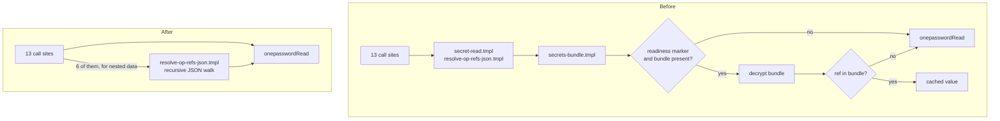
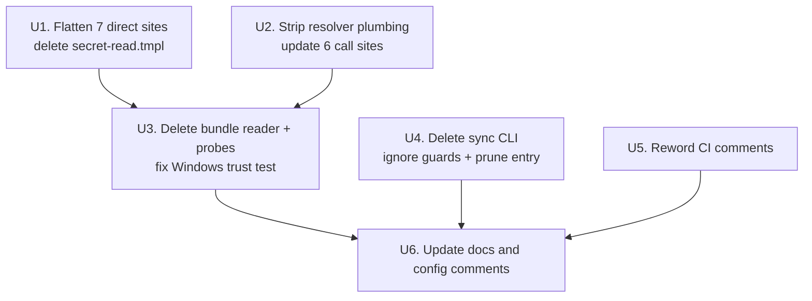

# GPG Secrets Cache Removal - Plan

## Goal Capsule

- **Objective:** Delete the GPG secrets cache from the chezmoi source so 1Password is the only secrets path and no local materialization of a secret can go stale.
- **Product authority:** the user, solo owner of `github.com/hyperlapse122/dotfiles`.
- **Execution profile:** source-tree refactor across 26 files. Verify by isolated `chezmoi execute-template` render parity against a counting `op` stub plus the existing `.ci/` tests — never by a live `chezmoi apply` against the real `$HOME`.
- **Stop conditions:** render parity fails at any call site after the flattening (output differs, or the stub read count moves off 17), or a tree-wide identifier sweep still returns a live source reference after U6. Surface either rather than working around it.
- **Open blockers:** none.

**Product Contract preservation:** Product Contract unchanged. No requirement added, removed, or reworded; R1-R10, KD1-KD6, F1, and AE1-AE4 keep their IDs and meaning. Planning resolved one Outstanding Question (the Windows trust test needs no replacement assertion — see KTD1) and left the other deferred.

---

## Product Contract

### Summary

Remove the GPG secrets cache outright: the two cache templates, both readiness probes, the sync CLI, and the deployed binary. Every `op://` reference resolves through a direct live 1Password read, and the recursive JSON resolver survives with its cache plumbing stripped out.

### Problem Frame

The cache was built to take 1Password off the per-apply hot path. Its cost landed elsewhere: rotating a secret meant edit in 1Password, run the sync CLI, commit, push, then apply on each host. Between any two of those steps the committed bundle disagreed with 1Password, and nothing detected the drift.

That ceremony has already been abandoned in practice. The bundle artifact was deleted in `4ccd717 chore: remove cached secrets`, so the readiness probe writes no marker and every reference already falls through to a live read. What survives is scaffolding that describes a cache which no longer exists — templates threading a `ctx` argument to reach an absent file, a probe testing for it, a CLI that can refill it, ignore rules guarding it, and instructions in `AGENTS.md`, `.agents/skills/sync-omp-models/SKILL.md`, and two CI surfaces telling readers a cache-first path is live.

The measured basis for the original trade also turns out to be weaker than assumed. A full render pass performs 17 `op read` invocations across 15 distinct references, not the roughly one hundred the earlier plan estimated.

### Key Decisions

- KD1. **Remove the mechanism, do not relocate it.** (session-settled: user-directed — chosen over keeping the bundle at a gitignored local path: the rotate-sync-commit-push step is the friction, and a local bundle keeps that step intact.) Governs R1, R3, R5.
- KD2. **Flatten the direct-read shim rather than keep it as a passthrough.** (session-settled: user-directed — chosen over retaining a one-line forwarder: its `ctx` argument exists only to reach the bundle, so keeping the wrapper leaves a vestigial parameter at every call site.) Governs R2, R4.
- KD3. **Accept live 1Password resolution as the steady state.** (session-settled: user-approved — the measured per-apply cost was surfaced before the choice.)
- KD4. **Leave the published ciphertext alone.** (session-settled: user-directed — chosen over rotating every reference or rewriting public history: the private key never left the user's machines, and the earlier plan already recorded permanent public ciphertext as an accepted risk.)
- KD5. **Prune the deployed sync CLI through the existing removal manifest.** (session-settled: user-directed — chosen over leaving it as an unmanaged orphan: a dead executable on `PATH` that still writes a bundle nothing reads is worse than one permanent manifest line.) Governs R7.
- KD6. **The GPG encryption backend is preserved, not swept up.** It, its recipient, the private-key import, and the encrypted garden registry never transited the cache templates. Governs R8.

The resolution path before and after — the branch being deleted is the entire marker-and-bundle subtree:

### Requirements

**Removing the cache**

- R1. No template, script, or CLI in the source tree resolves a secret from a local cache; an `op://` reference resolves only through a live 1Password read.
- R2. The direct-read shim `.chezmoitemplates/secret-read.tmpl` and the bundle reader `.chezmoitemplates/secrets-bundle.tmpl` are deleted, and each of the seven call sites that used the shim resolves its reference directly.
- R3. Neither readiness probe under `.chezmoiscripts/80-keys/` remains in the tree, on either platform.
- R4. `.chezmoitemplates/resolve-op-refs-json.tmpl` keeps its recursive walk and its `op://` leaf resolution, and drops the cache-only arguments from its published contract; its six call sites are updated to the reduced contract.
- R5. `dot_local/bin/executable_chezmoi-secrets-sync.tmpl` is deleted, and the ignore rules that existed to guard the bundle are removed.

**Provisioning and cleanup**

- R6. The change requires no per-host manual cleanup and adds no teardown or revert script.
- R7. A host that applies this change no longer has the sync CLI installed.

**Preservation**

- R8. Chezmoi's GPG encryption backend, its configured recipient, the private-key import under `.chezmoiscripts/80-keys/`, and `dot_config/garden/encrypted_readonly_garden.yaml.asc` all keep working unchanged.
- R9. CI and isolated verification keep passing through the existing `op` stub, with no new stub or fixture, and no test references a deleted source file.

**Documentation**

- R10. No instruction file, skill, CI comment, or workflow describes the cache; a tree-wide search for the cache's identifiers returns only historical plan documents.

### Key Flows

- F1. Apply on a host after the change lands
  - **Trigger:** `chezmoi apply` on any host that last applied before this change.
  - **Steps:** Templates render with each `op://` reference resolved by a live 1Password read. The removal manifest deletes the previously deployed sync CLI. Any readiness marker left on the host is read by nothing.
  - **Outcome:** Apply succeeds, the sync CLI is gone, and no cache code remains on the host.
  - **Covered by:** R1, R6, R7.

### Acceptance Examples

- AE1. **Covers R1, R2, R4.** **Given** the isolated-verification `op` stub, **When** every `op://` call site is rendered before and after the change, **Then** the rendered output is byte-identical and the number of stubbed reads is unchanged.
- AE2. **Covers R7.** **Given** a host with the sync CLI installed, **When** it applies this change, **Then** the executable is no longer present in the user's local bin directory.
- AE3. **Covers R6.** **Given** a host that still carries a readiness marker because it has not applied since the bundle was deleted, **When** it applies this change, **Then** apply succeeds and the orphaned marker changes no behavior.
- AE4. **Covers R9.** **Given** the Windows trust test, **When** it runs after the probe scripts are deleted, **Then** it passes without attempting to render a missing source file.

### Scope Boundaries

- Credential rotation and any rewrite of public git history.
- Any change to chezmoi's GPG encryption backend, its recipient, the private-key import, or the encrypted garden registry. R8 requires them preserved, so they are excluded from modification, not from care.
- Any replacement cache, memoization, or batching for 1Password reads.
- Moving secret resolution from render time to script-execution time. This would cut the render hot path and reduce plaintext secrets written into `$HOME`, but it changes runtime behavior of several tools and carries its own acceptance boundary. Deferred as separate work.
- Editing `docs/plans/2026-07-22-002-refactor-secrets-gpg-cache-plan.md` or `docs/plans/2026-08-01-001-feat-omp-openrouter-opencode-keys-plan.md`. Both stay as written; they are the record of a decision that was later reversed.

### Dependencies / Assumptions

- Every host that applies has a working 1Password CLI session. This is already the operating state, since the bundle was deleted in `4ccd717`.
- The published ciphertext stays readable only to the holder of the private key, and its presence in public history remains the accepted risk the earlier plan recorded.
- Apply wall-clock rises by the cost of roughly 17 serial `op` reads. Only the invocation count is measured; no wall-clock figure for a live host exists in the repo.
- A readiness marker left on a host is inert once nothing reads it, so no marker cleanup is needed.

---

## Planning Contract

### Key Technical Decisions

- KTD1. **Ship the Windows trust-test edit in the same unit that deletes the Windows probe.** `.ci/test-windows-trust.sh:17` renders the probe by path and the script runs under `set -euo pipefail`, so a missing input file aborts it. Splitting the two across commits leaves CI red in between. The test needs no replacement assertion: its `for script in "$scratch"/*.ps1` loop derives its work from what was rendered, so dropping the render line removes the probe from the loop automatically, and the three surviving renders keep the test's coverage intact. This resolves the Outstanding Question the Product Contract deferred. Governs R3, R9.
- KTD2. **Gate the removal-manifest entry to non-Windows.** `.chezmoiignore:41-46` ignores `.local/bin/*` on Windows except `*.ps1`, so chezmoi never deployed the sync CLI there. The gate is defense in depth, not a correctness requirement: chezmoi already skips ignored targets when it generates removals, so an ungated entry would be inert on Windows today. The gate keeps the platform intent legible at the entry and survives a future narrowing of that ignore rule, matching the `src/garden.yaml` precedent at `.chezmoiremove:42-55`. No container gate: the container block does not exclude `.local/bin`, so containers did receive the binary. Governs R7.
- KTD3. **The manifest target path keeps its leading dot — `.local/bin/chezmoi-secrets-sync`.** Entries are target paths relative to the destination directory, and chezmoi's `dot_` source prefix maps to a literal `.` there, as the `dot_`-sourced entries show (`.agents/skills/playwright-cli`, `.omp/agent/CLAUDE.md`). The undotted `src/garden.yaml` entry is not a counterexample — its source was never `dot_`-prefixed. A dotless `local/bin/...` would match nothing and silently no-op the prune. Governs R7.
- KTD4. **Verify by render parity against a counting `op` stub, never a live apply.** A real apply writes to `$HOME`; the repo's isolated-verification convention is the sanctioned check. Parity means byte-identical rendered output per call site plus a stub read count that stays at 17. Governs R9.
- KTD5. **The resolver's doc-comment header is part of the contract R4 reduces.** Its header documents the `ctx` and `secrets` arguments and the cache-first semantics; leaving it while deleting the code would leave the only description of the template actively wrong. Governs R4.
- KTD6. **Delete the `sync-omp-models` scratch-`HOME` bullet rather than re-justify it, but do not orphan the code block it explains.** The bullet's premise is bundle decryption, which disappears. The recipe's real-secret protection then rests entirely on the stub `op`, which was always the mechanism for live reads — so if the scratch `HOME` stays in the recipe, its justification must be restated on still-true grounds rather than left dangling. Governs R10.

### Assumptions

These are planning-time bets, not user-stated requirements. Each is cheap to revise during implementation.

- A1. The six-unit decomposition below, and its ordering, is a structuring choice made so each unit lands as an independently green commit.
- A2. Render parity is measured on Linux, which covers all seven direct sites and four of the six resolver sites — including `dot_local/bin/private_executable_import-wifi-1password.ps1.tmpl`, which carries no internal platform gate and so renders meaningfully there. It does not cover `.chezmoiscripts/70-agents/run_after_config-omp-auth.ps1.tmpl`, which is Windows-gated on its first line and renders empty on Linux, making a Linux parity check on it vacuous. That site is covered by rendering it under an `os=windows` data override, and by the `apply-windows` job in `.github/workflows/render-dotfiles.yml`. `.ci/test-windows-trust.sh` does not cover it — that test renders only the key-import, probe, and two auth scripts.
- A3. No `docs/decommission/` checklist is created. The repo uses that convention for removals that strand live runtime state (see `docs/decommission/cli-proxy-api.md`); this removal strands none — the binary is pruned by the manifest and the marker is inert.

### Implementation Unit Dependencies

---

## Implementation Units

### U1. Flatten the seven direct call sites and delete the shim

- **Goal:** Every former `secret-read.tmpl` consumer calls `onepasswordRead` directly, and the shim is gone.
- **Requirements:** R1, R2. Implements KD2, whose `Governs R2, R4` links name these requirements.
- **Dependencies:** none.
- **Files:**
  - `dot_wakatime.cfg.tmpl` (line 2)
  - `dot_local/bin/executable_claude-glm.tmpl` (line 10)
  - `dot_local/bin/private_executable_tokscale.tmpl` (line 10)
  - `.chezmoiscripts/10-auth/run_once_after_auth-tailscale.sh.tmpl` (line 42)
  - `.chezmoiscripts/10-auth/run_onchange_after_auth-gitlab.sh.tmpl` (lines 136 and 140)
  - `.chezmoiscripts/10-auth/run_onchange_before_auth-github.sh.tmpl` (line 21)
  - `.chezmoitemplates/secret-read.tmpl` (delete)
- **Approach:**
  1. At each of the seven sites, replace `{{ includeTemplate "secret-read.tmpl" (dict "ctx" . "ref" "op://…") }}` with `{{ onepasswordRead "op://…" }}`, carrying the reference string over unchanged.
  2. The replacement is uniform: all seven pass `.` as `ctx` and none sits inside a `range`, so no site needs `$` instead.
  3. Preserve the surrounding quoting exactly. Three sites sit inside double-quoted shell strings, three are bare lines inside unquoted `<<EOF` heredocs, and `dot_wakatime.cfg.tmpl` is a bare right-hand-side value.
  4. Delete `.chezmoitemplates/secret-read.tmpl` once no caller remains.
- **Patterns to follow:** `.chezmoiscripts/80-keys/run_once_before_import-gpg-key.sh.tmpl:7` already calls `onepasswordRead` directly inside a heredoc — the exact shape the three heredoc sites become.
- **Test scenarios:**
  - Covers AE1. Render each of the six touched files against the counting `op` stub before and after; output is byte-identical and each file's stub read count is unchanged.
  - `.chezmoiscripts/10-auth/run_onchange_after_auth-gitlab.sh.tmpl` still renders exactly two reads, one per `login_host` heredoc, with the two distinct references in their original order.
  - Rendering with no `op` on `PATH` fails loudly rather than emitting an empty secret.
- **Verification:** no `secret-read.tmpl` reference remains anywhere in the tree, and the six files render identically to their pre-change output.

### U2. Strip cache plumbing from the resolver and its six call sites

- **Goal:** `resolve-op-refs-json.tmpl` resolves `op://` leaves by direct read, and its published contract is `value` plus `indent` only.
- **Requirements:** R1, R4. Implements KD2 and KTD5.
- **Dependencies:** none.
- **Files:**
  - `.chezmoitemplates/resolve-op-refs-json.tmpl`
  - `.chezmoiscripts/70-agents/run_after_config-omp-auth.sh.tmpl` (line 15)
  - `.chezmoiscripts/70-agents/run_after_config-omp-auth.ps1.tmpl` (line 15)
  - `dot_local/bin/private_executable_import-wifi-1password.tmpl` (line 69)
  - `dot_local/bin/private_executable_import-wifi-1password-macos.sh.tmpl` (line 82)
  - `dot_local/bin/private_executable_import-wifi-1password.ps1.tmpl` (line 95)
  - `dot_omp/private_agent/private_readonly_mcp.json.tmpl` (line 27)
- **Approach:**
  1. Delete the `$secrets` setup block (lines 40-45): the `dict` initializer, the `secrets` branch, the `ctx` branch that includes `secrets-bundle.tmpl`, and its `end`.
  2. Drop `"secrets" $secrets` from both recursive calls (lines 55 and 66), leaving `value` and `indent`.
  3. Collapse the `op://` leaf (line 71) to a direct `onepasswordRead $value | toJson`, removing the `hasKey $secrets` conditional entirely.
  4. Rewrite the doc-comment header: delete the `ctx` and `secrets` argument entries (lines 8-12), rewrite the resolution-semantics prose that describes cache-first behavior and pre-cache backward compatibility (lines 14-21), and drop `"ctx" $` plus its framing from the usage example (lines 25-29).
  5. At each of the six call sites, drop the `"ctx"` argument. Every site passes exactly `value` and `ctx` and none passes `indent` or `secrets`, so the edit is a uniform deletion of one key.
- **Approach note on context variables:** three call sites sit inside a `range` and correctly pass `$`; dropping `ctx` removes the only reason those sites referenced the root context, but the remaining `value` expressions (`$entry.key`, `(get . "headers")`) must keep their current variable exactly as written.
- **Test scenarios:**
  - Covers AE1. Render all six call sites before and after; output byte-identical, stub read counts unchanged.
  - `dot_omp/private_agent/private_readonly_mcp.json.tmpl` still emits valid JSON with map keys in lexical order and nested header maps resolved.
  - The wifi importers still emit their full `WIFI_CONFIG_EOF` payload with all four network references resolved.
  - A map or slice containing no `op://` reference serializes unchanged, proving the recursion survived the edit.
  - Calling the resolver with a stray `ctx` argument does not silently change behavior — the template ignores unknown keys, so this is a documentation-only guarantee, not a runtime guard.
- **Verification:** the resolver's header describes only `value` and `indent`, and no file passes `ctx` or `secrets` to it.

### U3. Delete the bundle reader and both probes, and fix the Windows trust test

- **Goal:** The orphaned cache reader and its readiness probes leave the tree without breaking CI.
- **Requirements:** R1, R3, R6, R9. Implements KTD1. R6 is honored here by leaving the orphaned marker inert rather than adding a script to clear it.
- **Dependencies:** U1, U2 — `secrets-bundle.tmpl` still has callers until both land.
- **Files:**
  - `.chezmoitemplates/secrets-bundle.tmpl` (delete)
  - `.chezmoiscripts/80-keys/run_before_probe-gpg-cache-ready.sh.tmpl` (delete)
  - `.chezmoiscripts/80-keys/run_before_probe-gpg-cache-ready.ps1.tmpl` (delete)
  - `.ci/test-windows-trust.sh` (line 17)
- **Approach:**
  1. Confirm no caller of `secrets-bundle.tmpl` remains, then delete it.
  2. Delete both probe scripts.
  3. Remove the single `render` line for the Windows probe from `.ci/test-windows-trust.sh`, keeping the three surviving renders and the `render()` helper untouched.
- **Approach note:** do not also edit the test's `for script in "$scratch"/*.ps1` loop. It iterates whatever was rendered, so dropping the render line is the whole change; touching the loop would be a second, unnecessary edit.
- **Patterns to follow:** the `.chezmoiscripts/80-keys/run_once_before_import-gpg-key.{sh,ps1}.tmpl` pair stays — it is the surviving occupant of that directory and the reference for what R8 preserves.
- **Test scenarios:**
  - Covers AE4. `.ci/test-windows-trust.sh` passes and renders exactly three PowerShell scripts.
  - Covers AE3. Rendering any template on a host that still has `~/.config/chezmoi/gpg-cache-ready` succeeds, since nothing reads the marker.
  - No template in the tree resolves `secrets-bundle.tmpl`.
- **Verification:** `.ci/test-windows-trust.sh` exits zero, and the `80-keys` directory contains only the key-import pair.

### U4. Delete the sync CLI, drop its ignore guards, and prune the deployed binary

- **Goal:** The CLI has no source, no ignore rules guard a bundle that cannot exist, and hosts lose the deployed executable on next apply.
- **Requirements:** R5, R6, R7. Implements KD5, KTD2, KTD3. R6 is honored here by pruning through the manifest rather than asking each host to delete the binary by hand.
- **Dependencies:** none.
- **Files:**
  - `dot_local/bin/executable_chezmoi-secrets-sync.tmpl` (delete, 93 lines, wholly cache-specific)
  - `.gitignore` (drop the secrets-cache block)
  - `.chezmoiremove` (add the gated prune entry)
- **Approach:**
  1. Delete the CLI template. It has no reusable non-cache helper — every line builds or encrypts the bundle.
  2. Remove the `### Secrets cache …` block from `.gitignore`, including its two comment lines, the positive rule, and the negation that existed solely to permit the bundle. Leave the preceding dotagents block untouched.
  3. Append a new `.chezmoiremove` block in the file's established style: a leading comment paragraph explaining that deleting the source stopped management but left the deployed copy, followed by the target path.
  4. Wrap the path in a non-Windows gate matching the `src/garden.yaml` precedent, and record in the comment that the gate is defense in depth against a future narrowing of the ignore rule, not a correctness requirement.
- **Approach note on the exact entry:** the target path is `.local/bin/chezmoi-secrets-sync` — with the leading dot, because its source carries the `dot_` prefix. The gate is on `.chezmoi.os` alone; do not add the container predicate the garden entry uses, because containers keep CLI dotfiles and did receive this binary.
- **Patterns to follow:** `.chezmoiremove:42-55` (the `src/garden.yaml` block) is the closest analogue — same comment shape, same gating construct, same rationale structure.
- **Test scenarios:**
  - Covers AE2. Render `.chezmoiremove` on Linux; the output contains `.local/bin/chezmoi-secrets-sync`.
  - Render `.chezmoiremove` with an `os=windows` data override; the output omits that path while keeping every other entry.
  - Render it with the container fact true; the path is still present, since containers received the binary.
  - `git check-ignore` no longer reports a rule for a `secrets-bundle.json` path, confirming the guard block is gone.
- **Verification:** `.chezmoiremove` renders valid on all three gate combinations, and no source file references `chezmoi-secrets-sync`.

### U5. Reword the remaining CI and workflow comments

- **Goal:** No CI surface claims a cache-first resolution path exists.
- **Requirements:** R10.
- **Dependencies:** none.
- **Files:**
  - `.ci/test-omp-agent-reconcile.sh` (comment at lines 398-401)
  - `.github/workflows/render-dotfiles.yml` (comment sentence in the op-stub block, lines 97-100)
- **Approach:**
  1. In the reconcile test, reword only the comment. The scratch-`HOME` isolation mechanism itself stays — isolating a render from host secret state is still worth doing — but the justification must stop citing a `gpg-cache-ready` marker and a cache fallback. No logic line changes.
  2. In the workflow, delete the sentence claiming the cache shims fall back to `onepasswordRead` because CI has no GPG key or marker. Keep the first sentence describing what the stub satisfies and the trailing `printf`-versus-heredoc note.
- **Test scenarios:**
  - Covers AE1 indirectly. `.ci/test-omp-agent-reconcile.sh` passes unchanged, proving the edit was comment-only.
  - The workflow file still parses as valid YAML and the stub block's `printf` body is untouched.
- **Verification:** both files pass their existing checks and neither mentions the cache.

### U6. Update the instruction and configuration documentation

- **Goal:** Every instruction surface describes the live behavior, and the identifier sweep comes back clean.
- **Requirements:** R8, R10. Implements KTD6. R8 is honored here by editing only comments in `.chezmoi.toml.tmpl` and leaving every configuration value byte-identical.
- **Dependencies:** U3, U4, U5 — documentation lands last so it describes the finished state.
- **Files:**
  - `AGENTS.md` (lines 70, 85, and the table row at 107)
  - `.agents/skills/sync-omp-models/SKILL.md` (bullet at lines 406-412 and the code block it justifies)
  - `.chezmoi.toml.tmpl` (comment fragments at lines 18 and 26)
- **Approach:**
  1. `AGENTS.md:70` — keep the first sentence describing the isolated-check recipe and the newline-free stub requirement; delete the sentence about the readiness marker, the cache shims, and the instructions for exercising the cache path.
  2. `AGENTS.md:85` — rewrite the cache-first opening so it states that secrets resolve through live `onepasswordRead`. Preserve three still-true clauses: the key import remains the always-live-`op` site, the garden file remains a sanctioned GPG ciphertext, and the garden is edited through the wrapper and never committed as plaintext. Remove the bundle from the sanctioned-ciphertext list, leaving the garden file as the only one.
  3. `AGENTS.md:107` — delete the secrets-bundle table row. The garden row above it stays.
  4. `.agents/skills/sync-omp-models/SKILL.md` — delete the scratch-`HOME` bullet whose premise is bundle decryption. Leave the sibling reconcile-test bullet unchanged. Then decide what happens to the scratch `HOME` the recipe's code block builds: with no marker lookup left, the stub `op` alone keeps real keys out of a render, so drop the scratch `HOME` from the recipe if nothing else depends on it, and give it a still-true one-line reason if something does. Do not leave the block standing with no justification.
  5. `.chezmoi.toml.tmpl` — drop the "and the secrets cache" parenthetical from the header comment, and remove the `chezmoi-secrets-sync` reference from the recipient comment while keeping the `gpgPubKey` and `80-keys` import cross-reference. Leave `encryption`, the `[gpg]` block, `recipient`, and `args` byte-identical.
- **Approach note:** this unit changes no behavior. Every edit is comment or prose, and `.chezmoi.toml.tmpl`'s rendered configuration values must be unchanged.
- **Test scenarios:**
  - Covers R10. A tree-wide search for `secrets-bundle`, `secret-read`, `gpg-cache-ready`, `secrets-sync`, and `chezmoi-secrets` returns hits only under `docs/plans/`.
  - `.chezmoi.toml.tmpl` renders to the same configuration values as before the edit, comments excluded.
  - `AGENTS.md:85` still tells a reader that the key import is the always-live-`op` site and that the garden file is edited through the wrapper.
- **Verification:** the identifier sweep returns only historical plan documents, and the rendered chezmoi config is unchanged.

---

## Verification Contract

| Gate | Command | Applies to | Done signal |
|---|---|---|---|
| Render parity | `chezmoi --config <scratch>/empty.toml --source "$PWD" --destination <scratch>/target execute-template < <file>` with a counting `op` stub on `PATH` and a scratch `HOME`, run per call site before and after | U1, U2 | Output byte-identical per file; total stub reads stay at 17 across 15 distinct references, with `op://Private/Z.ai/API Key` read three times |
| Windows trust | `.ci/test-windows-trust.sh` | U3 | Exits zero, renders three PowerShell scripts |
| omp reconcile | `.ci/test-omp-agent-reconcile.sh` | U5 | Exits zero, unchanged behavior |
| Manifest gating | `chezmoi … execute-template < .chezmoiremove` on Linux, with an `os=windows` override, and with the container fact true | U4 | Path present on Linux and in containers, absent on Windows, other entries unchanged |
| Identifier sweep | Search the tree for `secrets-bundle`, `secret-read`, `gpg-cache-ready`, `secrets-sync`, `chezmoi-secrets` | U6 | Hits only under `docs/plans/` |
| Config parity | Render `.chezmoi.toml.tmpl` before and after | U6 | Values identical; only comments differ |

Do not run `chezmoi apply` against the real `$HOME` as a verification step. The scratch-destination render is the sanctioned check; a live apply is the user's to run.

## Definition of Done

- R1-R10 all hold, with AE1-AE4 demonstrated by the gates above.
- Every unit landed as its own commit and each commit passes the gates that apply to it — in particular U3 does not land without its `.ci/test-windows-trust.sh` edit.
- `.chezmoiremove` carries the non-Windows-gated `.local/bin/chezmoi-secrets-sync` entry, with a comment explaining the prune and the gate.
- No teardown or revert script was added, and no `docs/decommission/` checklist was created.
- The GPG backend, recipient, key import, and encrypted garden registry are untouched.

## Open Questions

**Deferred beyond this work**

- When the `.chezmoiremove` entry for the sync CLI can itself be retired. It is only safe to drop once every host has applied this change; there is no signal in the repo that tracks that, so it stays until the user judges the fleet converged.

## Sources & Research

- `docs/plans/2026-07-22-002-refactor-secrets-gpg-cache-plan.md` — the plan this reverses, including the original ~1-minute apply estimate and the accepted-risk note on permanent public ciphertext.
- `docs/plans/2026-08-01-001-feat-omp-openrouter-opencode-keys-plan.md:130,137` — the second historical reference to the bundle and sync CLI.
- Measured on this worktree by rendering every Linux call site against a counting `op` stub: 17 `op read` invocations across 15 distinct references per full render pass, with `op://Private/Z.ai/API Key` read three times. One of the 15, the private-key import reference, was never served by the cache — it delivers the key that decrypts the bundle. Cache-served traffic was therefore 16 reads across 14 references.
- `.chezmoitemplates/resolve-op-refs-json.tmpl:40-45,55,66,71` — the cache code to strip; `:8-12,14-21,25-29` — the doc-comment contract to rewrite.
- `.chezmoiignore:41-46` — the Windows gate on `.local/bin/*` that already makes the manifest entry inert there, independent of the entry's own gate.
- `.chezmoiremove:42-55` — the `src/garden.yaml` precedent for a gated prune entry; its gate is at `:53-55`.
- `internal/chezmoi/sourcestate.go` in `twpayne/chezmoi` — the removal-generation loop skips any target `.chezmoiignore` matches, which is why KTD2's gate is defense in depth rather than a correctness requirement.
- `.ci/test-windows-trust.sh:12-22` — the `render()` helper and the loop that makes the probe-render deletion self-contained.
- `docs/decommission/cli-proxy-api.md` — the repo's convention for removals that strand live runtime state, which this removal does not.
