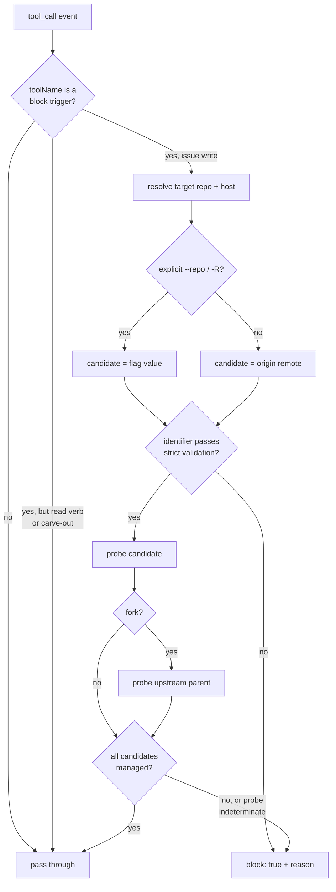
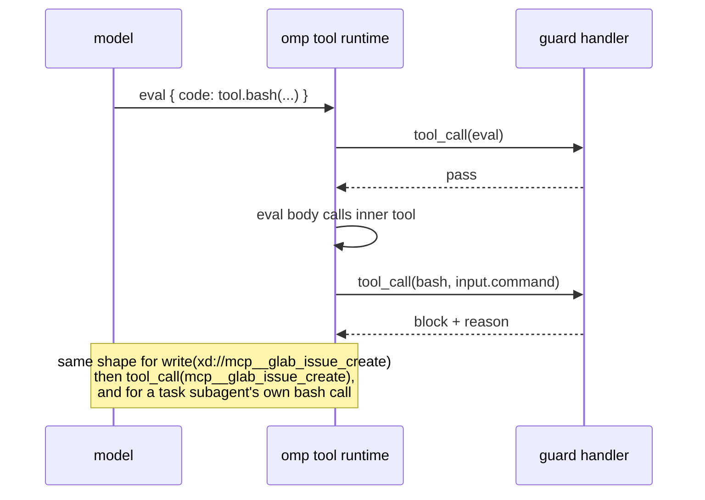

# Mechanically Block Issue Filing Into Unmanaged Repositories - Plan

## Goal Capsule

- **Objective:** Convert the prose-only repository-management gate at `.chezmoitemplates/agents-instructions.tmpl:50` into mechanical enforcement across the `gh`/`glab` CLI and MCP issue-write routes the guard recognises, so a silent skill fallback chain cannot file an issue into a repository the user does not manage. Enforcement is fail-closed on permission and fail-open on route recognition (KTD4); the routes it does not cover are named in Accepted residual gaps.
- **Product authority:** Issue #168. It is the residual half of PR #169, reserved by KTD8 of `docs/plans/2026-08-05-005-docs-external-repo-issue-confirmation-plan.md`.
- **Execution profile:** One new bundled omp plugin shipped as raw TypeScript, one shared marketplace row, one data row, a narrowed container gate, and three test tiers. No build step and no phase-60 provisioning script — see KTD1.
- **Tail ownership:** `lfg` owns commit, push, PR, and CI watch.
- **Open blockers:** None.

---

## Product Contract

### Summary

The instruction core already requires a fail-closed access probe before an agent files or comments on an issue in a repository the user does not manage. Nothing enforces it. The compound-engineering `lfg` residual-handoff path reaches `gh issue create` through `tracker-defer.md`, whose non-interactive mode is explicitly silent, probes only tracker *reachability*, and defaults its target to the current checkout. That file lives in a read-only plugin cache, so this repository cannot fix it at the source.

This plan adds the enforcement point the repository does own: an omp `tool_call` pre-execution extension that inspects issue-write tool calls, resolves the target repository, runs the same `viewerPermission` / `access_level` probe the instruction core mandates, and blocks with an instructive reason when the repository is unmanaged or the probe cannot answer.

### Problem Frame

- `.chezmoitemplates/agents-instructions.tmpl:50` states the gate "applies before any skill-level fallback chain" and must be re-applied "immediately before invoking any tracker, Defer, or residual-handoff filing step". That binding exists only in prose, and it races a skill whose own procedure reads as self-contained.
- `lfg/references/tracker-defer.md:21` — non-interactive mode "must not prompt. All blocking questions are skipped; the fallback chain is executed silently in order."
- `lfg/references/tracker-defer.md:59` — the probe is `gh auth status` plus `gh repo view --json hasIssuesEnabled`. Reachability only; no access-level dimension.
- `lfg/references/tracker-defer.md:138` — the GitHub tier's "Repo defaults to the current repo."
- **The failure is structural, not observed.** No run is known to have filed into an unmanaged repository. The gap was identified during PR #169's code review and filed as issue #168; the justification for this work is that the prose gate is unenforceable against a silent skill, not that it has already failed. Read the cost side of that trade in "Costs this plan accepts" below before treating the work as obviously warranted.
- The plugin cache (`~/.omp/plugins/cache/plugins/compound-engineering-plugin___.../`) is not repo-owned; an edit there is lost on the next plugin update. Recorded as KTD8 of the prior plan and restated in issue #168.
- No repo-owned code currently probes `gh`/`glab` access levels, and no existing extension returns `{ block: true }` — `packages/mxm4-haptic/src/omp-plugin.ts` observes `tool_call` but never blocks. This is the repository's first blocking hook.

### Alternatives considered

Recorded because this plan is greenfield (`product_contract_source: ce-plan-bootstrap`); this document is the only place the reasoning can live.

- **Do nothing; accept the residual behind the shipped prose gate.** Rejected: the residual is unbounded in an unattended run, and the whole point of issue #168 is that prose cannot bind a skill that reads as self-contained. This remains the cheapest option and is the honest baseline the costs below are measured against.
- **File upstream so `tracker-defer` grows the probe itself.** Rejected: issue #168 reserves it as a human decision, and the very gate this work enforces forbids an unattended filing into `EveryInc/compound-engineering-plugin`. This is the correct *durable* fix and stays available to the user; it is not available to this run.
- **A repo-owned skill that overrides `tracker-defer`.** Rejected: a skill is loaded by relevance and consulted by judgment, so it competes with `tracker-defer` on exactly the terms the instruction core already lost on. It cannot guarantee it runs before every filing route.
- **A `gh`/`glab` shim earlier on `PATH`.** Rejected: it covers the CLI routes and nothing else — an MCP-mounted `mcp__glab_issue_create` never execs the binary. It also mutates the interactive shell environment for the human, not just the agent.
- **A `tool_call` extension (chosen).** It sits at the one boundary every route crosses (KTD2), is owned by this repository, and survives a plugin update.

### Costs this plan accepts

- **A permanent interception point.** Every tool call in every omp session on this workstation passes through the guard's classifier. The classifier is pure and allocation-light, and the probe runs only after a call classifies as an issue write, so the steady-state cost is a string match — but the surface is permanent and is maintained forever.
- **Fail-closed blocks legitimate work.** R3 makes a transient `gh` auth blip, a network timeout, or a missing binary block a *managed*-repository filing. In an unattended run there is no one to unblock it, so a working pipeline degrades to its committed-record fallback for a non-permission reason. This is accepted because a wrong allow is unrecoverable (a public issue in a stranger's tracker) while a wrong block is recoverable (the finding still lands in the committed record and is reported). R13's reason string exists so the agent routes that degradation correctly instead of retrying.
- **A precedent.** This is the first mechanical `tool_call` block in the repository, and the Deferred section already anticipates a second. The bar a future blocking hook should clear: a documented instruction-core rule, a demonstrated route by which that rule can be silently bypassed, and a probe that can decide cheaply and fail closed. A hook that cannot state all three does not belong here.

### Requirements

**Enforcement behavior**

- R1. A `tool_call` pre-execution handler MUST block an issue-write tool call whose resolved target repository is one the user does not manage. Scope is the routes the classifier recognises per R4-R7 and KTD5; see "Accepted residual gaps" for what is deliberately outside it.
- R2. Management MUST be decided from host access data, never from the owner name: GitHub `viewerPermission` in `ADMIN`/`MAINTAIN`/`WRITE`; GitLab `permissions.project_access.access_level` or `permissions.group_access.access_level` at least `30`.
- R3. The probe MUST be fail-closed. A missing CLI, auth failure, non-zero exit, timeout, or unparseable response MUST block.
- R4. The guard MUST cover issue *comments* as well as issue *creation*.
- R5. The guard MUST NOT block read operations against the same unmanaged repository (`gh issue list`, `gh issue view`, GET `gh api`, read-only MCP issue tools).
- R6. The guard MUST NOT block the self-assignment carve-out the instruction core grants (`glab issue update <id> --assignee +<user>`).
- R7. The guard MUST NOT block pull-request or merge-request creation. The instruction-core gate is issue-scoped; a stricter hook than the documented policy is its own defect.

**Target resolution**

- R8. When the command names a target explicitly (`--repo`/`-R`), that value MUST be the probed target.
- R9. When no target is named, the guard MUST resolve the target the CLI would actually use, from the checkout's `origin` remote.
- R10. When the resolved repository is a fork, the guard MUST also probe the upstream parent and MUST block when either candidate is unmanaged.
- R11. A host override carried on the command (`GH_HOST=`, `GITLAB_HOST=`, `--hostname`) MUST select the host the probe runs against. A host the guard cannot probe is `indeterminate` and blocks under R3.

**Blocked-call feedback**

- R12. The `reason` string MUST name the resolved target repository and the probe outcome that caused the block.
- R13. The `reason` string MUST state that retrying through a different CLI, flag shape, or tool route hits the same gate, so the agent does not treat the block as a transient error.
- R14. The `reason` string MUST name the one sanctioned next move for the current run: ask the user when `ctx.hasUI` is true, otherwise fall to the committed-record fallback and report the residual.

**Guard implementation safety**

- R15. Every subprocess the guard runs MUST be invoked with an argv array, never a shell-interpolated string, and every repository identifier taken from the inspected command MUST be validated against a strict pattern before it reaches a subprocess or a URL. A value that fails validation is `indeterminate` and blocks under R3.
- R16. A cached management verdict MUST be bound to the authenticated identity it was obtained under and MUST have a bounded lifetime, so a revoked permission cannot be waved through for the rest of a long run.

**Packaging and provisioning**

- R17. The guard MUST ship as a bundled omp plugin owned by this repository, so a compound-engineering plugin update cannot remove it.
- R18. The guard MUST be installed in containers, because omp and compound-engineering both run there and an unattended container run is the highest-risk environment.
- R19. Plugin declaration MUST live in `.chezmoidata/agents.yaml`, not in a consuming template.
- R20. The guard's TypeScript MUST be typechecked in CI. It lives outside `packages/`, so the workspace-wide `ts-workspace` job does not reach it.

### Scope Boundaries

**In scope**

- A new bundled plugin under `dot_local/share/omp-plugins/plugins/unmanaged-repo-guard/`.
- One `plugins[]` row in `dot_local/share/omp-plugins/dot_omp-plugin/marketplace.json`.
- One `agents.omp.plugins` row plus an optional per-plugin `container` key in `.chezmoidata/agents.yaml`.
- A narrowed container gate in `.chezmoiignore` and per-plugin container support in `.chezmoiscripts/70-agents/run_onchange_after_update-omp-plugins.sh.tmpl`.
- Three test tiers under `.ci/`, plus a typecheck step for the guard's TypeScript.

**Non-goals**

- Editing `tracker-defer.md`, `lfg`, or any file in the plugin cache. KTD8 of the prior plan settled this.
- Filing an issue upstream against `EveryInc/compound-engineering-plugin`. Issue #168 reserves it as a human decision.
- `chezmoi apply`. The root `AGENTS.md` permits deployment only when the user asks.
- Changing `.chezmoitemplates/agents-instructions.tmpl`. The prose gate is correct and already landed; this plan enforces it, it does not restate it.
- Gating PR/MR comments on third-party repositories. Outside the instruction core's documented policy (R7).
- A build step, a `packages/` workspace member, or a phase-60 provisioning script. See KTD1.

**Deferred to Follow-Up Work**

- Extending the instruction core to PR/MR comments, and the matching guard coverage, if that policy is ever adopted.
- Bringing raw-HTTP issue filing into the classifier. This is a bounded extension of the same mechanism U1 step 4 already uses for `gh api`/`glab api` — match a write method against an issues or notes path — applied to `curl` and similar clients. It is deferred to keep this change scoped, not because it needs a different layer.
- Expanding `gh`/`glab` user aliases before classification. It needs an `alias list` subprocess at guard init and a cache of its own; disproportionate for a convenience feature the agent does not use.
- A `docs/solutions/` learning entry. The corpus does not exist in this repo yet.

**Accepted residual gaps (recorded, not silently omitted)**

- Raw HTTP filing through `curl` or a GraphQL POST. Reachable by the same classifier and deferred above, not architecturally out of reach.
- An unexpanded user-defined `gh`/`glab` alias, which never presents an `issue create` argv shape. Deferred above.
- Browser-driven filing through `agent-browser` or the `computer` tool. Blockable in principle, but no repository target is legible in those calls.
- A future MCP issue-write tool whose name matches none of the guard's block triggers. Route matching is deliberately fail-open; see KTD4.
- A script file handed to an interpreter (`bash filer.sh`). The classifier is pure and does no I/O, so it cannot read the file. A shell-shaped line inside an inline heredoc **is** covered; only an out-of-line script is not.
- An issue write expressed in a non-shell interpreter's own syntax (`python3 -c "os.system('gh issue create …')"`). A shell tokenizer cannot parse Python, Node, or Ruby source. Those interpreters stay in the recursion table because a bare shell-shaped line in their heredoc is still caught.
- An attended run cannot lift the gate by asking. The guard has no channel through which a user's consent could reach it, so it is deliberately stricter than the instruction core's prose gate for the *agent's own* filing call: the reason string tells the agent to hand the decision to the user rather than to retry. The user retains every non-agent route. Reconsider only if omp ever exposes a trustworthy consent signal to a `tool_call` handler.

### Acceptance Examples

- AE1. **Covers R1, R2, R3, R12.** `gh issue create --repo other/repo` with a stubbed probe returning `viewerPermission: READ` is blocked, and the reason names `other/repo` and `READ`.
- AE2. **Covers R2.** The same call with a stubbed `WRITE` executes normally.
- AE3. **Covers R3.** A probe that exits non-zero, times out, or emits malformed JSON blocks the call.
- AE4. **Covers R5.** `gh issue list --repo other/repo` and `gh issue view 1 --repo other/repo` are never blocked.
- AE5. **Covers R6, R7.** `glab issue update 5 --assignee +user` and `gh pr create` are never blocked.
- AE6. **Covers R10.** A managed fork whose upstream parent is unmanaged is blocked.
- AE7. **Covers R14.** With `hasUI: false` the reason names the committed-record fallback; with `hasUI: true` it names asking the user.
- AE8. **Covers R17, R18.** A real `omp plugin install`/`enable` against a relocated `$HOME` loads the extension and a tool call driven through omp's own runtime is blocked, and the rendered container gate keeps the plugin eligible.
- AE9. **Covers R4.** `gh issue comment 3 --repo other/repo -b x` against an unmanaged repo is blocked end to end, not only classified.
- AE10. **Covers R9.** `gh issue create -t x -b y` with no `--repo`, in a checkout whose `origin` is unmanaged, is blocked end to end.

---

## Planning Contract

### Key Technical Decisions

KTD1. **Ship the extension as raw TypeScript with no build step, no `packages/` member, and no phase-60 provisioning script.** *Chosen over cloning the 449-line `run_after_build-mxm4-haptic.sh.tmpl` pattern: that script exists because the haptic bundle inlines a workspace IPC client and drives a Rust daemon. This guard imports nothing but `node:` builtins and the injected `pi`, so there is nothing to bundle, and the clone would import the mise-fallback, stamp, atomic-install, and preflight-ordering failure modes for no benefit.* Verified empirically against omp 17.2.9: a manifest declaring `omp.extensions: ["./src/index.ts"]` installs through `omp plugin marketplace add`/`install`/`enable` and the raw `.ts` entry loads and runs. `extension-loading.md` documents the same. Cost, stated plainly: the guard's TypeScript leaves the `packages/` workspace and therefore leaves the `ts-workspace` CI job's typecheck, which R20 and U7 put back.

KTD2. **One uniform interception point: match on `event.toolName`, never by parsing an outer wrapper's payload.** Verified empirically that omp re-enters the `tool_call` handler for indirect routes rather than hiding them:
  - an `eval` cell calling `tool.bash(...)` fires `tool_call` twice — once as `eval`, then again as `bash`, and a block on the inner call takes effect;
  - an `xd://` tool device fires once as `write` with `input.path = "xd://<device>"`, then again as `<device>` with its parsed arguments;
  - a `task`-spawned subagent's `bash` call fires the same registered handler in the same process, so subagent-dispatched filing is covered.
  An MCP-mounted `mcp__glab_issue_create` therefore arrives as its own `toolName` with structured input. *Chosen over parsing `write` content JSON and `eval` code strings: those are unbounded string-analysis problems, and the runtime already decomposes them.* The subagent probe also showed the extension factory runs once per session rather than once per process, which KTD3 relies on.

KTD3. **Probe with a single `gh repo view --json viewerPermission,isFork,parent` call, and cache verdicts per session, keyed by identity, host, and repo, with a bounded lifetime.** *Chosen over caching every outcome for the process lifetime: a transient failure cached as "unmanaged" would block legitimate work for the rest of the run, and a `managed` verdict cached without an identity or an expiry would wave through a permission revoked mid-run — exactly the long unattended sessions R18 calls highest-risk.* Only `managed` and `unmanaged` verdicts are cached; `indeterminate` is never cached and is re-probed, while each individual call still blocks under R3. The cache lives in the factory closure, so its scope is one session (verified under KTD2), and it additionally expires on a short TTL and on a change of authenticated identity. One probe call also answers R10's fork question without a second round trip. `glab api projects/<url-encoded-path>` is the GitLab equivalent; the raw API path needs `%2F`, unlike the slashes-intact rule for other `glab` subcommands.

KTD4. **Fail-closed on the probe; fail-open on route matching.** The guard blocks when it cannot decide *permission* (R3), and passes when it does not recognise the *tool* as an issue write. *Chosen over blocking unrecognised tools: a denylist-shaped guard that blocks anything it does not know would break every unrelated tool call and would be removed within a day.* The asymmetry stops at the tool boundary: once a call *is* a recognised route, ambiguity inside it resolves toward probing (U1 approach step 8), because a probe on a managed repository still allows the call while a missed parse does not. This boundary is stated in the plan, in the code, and in tests that document it (U5).

KTD5. **Block triggers are an explicit table plus a narrow MCP name pattern.** The table names the `bash` subcommand shapes (`gh issue create`, `gh issue comment`, `glab issue create`, `glab issue note`, and `glab api`/`gh api` write methods against issue or note paths) and the known MCP tool names. The pattern covers `mcp__*_issue_create` / `mcp__*_issue_note` / `mcp__*_work_items_create` so a renamed MCP server does not silently drop coverage. *Chosen over a pure static list, which goes stale, and over a broad pattern, which would catch reads.*

KTD6. **Make container eligibility a per-plugin property.** `.chezmoiignore` currently excludes `.local/share/omp-plugins` wholesale in containers and the `h82-dotfiles` marketplace is `container: skip`, so today every bundled plugin is skipped together. Haptics needs hardware a container does not have; a guardrail is *most* needed there, because omp and compound-engineering both run in containers per the root `AGENTS.md`. *Chosen over a second marketplace pointing at a parallel directory.* The rejected alternative is genuinely cheaper in blast radius — it touches no shared validation — and the reason it still loses is that it makes container eligibility a property of *which catalog a plugin was filed under* rather than of the plugin, so the next plugin needing the opposite default forces a third catalog and a permanent split of one logical marketplace. The cost accepted here is a widened row schema on shared machinery, bounded by making the key optional (every existing row stays valid) and by U7 asserting the haptic plugin's container behavior is unchanged.

KTD7. **The guard blocks and explains; it never files, never writes, and never asks.** *Chosen over having the hook perform the fallback itself: `tracker-defer`'s chain already owns the durable sink, and a hook that writes would duplicate it.* The hook's only outputs are a boolean and a reason string, which is why R12-R14 specify that string as a contract.

KTD8. **Keep the probe's subprocess bounded by an explicit timeout and invoke it injection-safely.** No latency budget for a `tool_call` handler is documented, and `pi.exec` documents no `timeout` option — its cancellation surface is a forwarded `signal`. The guard therefore drives `pi.exec(command, args, { signal })` from an `AbortController` raced against its own timer, and treats expiry as `indeterminate`. Because the repository identifier reaching that subprocess originates in a model-authored command string, R15 additionally requires argv-array invocation and strict validation of that identifier; the guard's own probe must not become the injection point.

KTD9. **The guard is a correctness control against a conflicting instruction, not a security boundary against a hostile agent.** It runs in the process it polices, is loaded from a plugin that process can read, and shares an event where the first block short-circuits. It stops an agent that is following `tracker-defer` faithfully; it does not stop an agent that sets out to evade it. Every "bypass" in Accepted residual gaps is scoped by that threat model, and the Definition of Done is written to the same scope.

### High-Level Technical Design

Interception and decision flow:



Why indirect routes need no special handling (empirically verified, KTD2):



### Assumptions

- A1. omp remains the only harness this repository manages under the instruction core, so an omp-scoped extension covers every managed agent surface. Carried from the prior plan's A2.
- A2. The phase-70 reconciler stays the sole installer for bundled plugins; no new provisioning phase is introduced.
- A3. `gh` and `glab` are the only issue CLIs in play on this workstation, consistent with the instruction core naming exactly those two.

---

## Output Structure

```text
dot_local/share/omp-plugins/
  dot_omp-plugin/marketplace.json          # +1 plugins[] row
  plugins/unmanaged-repo-guard/
    package.json.tmpl                      # omp.extensions: ["./src/index.ts"]
    tsconfig.json                          # typecheck target for R20
    src/
      index.ts                             # extension factory, pi.on("tool_call")
      triggers.ts                          # block-trigger table + shell-aware matcher
      target.ts                            # repo/host resolution from flags / origin
      probe.ts                             # gh/glab access probe + identity-bound cache
      exec.ts                              # timeout-bounded argv-array subprocess
      reason.ts                            # reason-string composer
.ci/
  test-unmanaged-repo-guard.ts             # in-process behavior suite
  test-unmanaged-repo-guard-gates.sh       # render + container-eligibility gates
  test-unmanaged-repo-guard-real.sh        # real-omp install + runtime block proof
.chezmoidata/agents.yaml                   # +1 plugin row, optional container key
.chezmoiignore                             # narrowed container exclusion
.chezmoiscripts/70-agents/run_onchange_after_update-omp-plugins.sh.tmpl
.github/workflows/ci.yml                   # typecheck + three new test invocations
```

---

## Implementation Units

### U1. Block-trigger classifier

- **Goal:** Decide, from `toolName` plus input, whether a call is an issue write the guard governs.
- **Requirements:** R4, R5, R6, R7; KTD2, KTD4, KTD5.
- **Dependencies:** none.
- **Files:** `dot_local/share/omp-plugins/plugins/unmanaged-repo-guard/src/triggers.ts`; test in `.ci/test-unmanaged-repo-guard.ts`.
- **Approach:**
  1. Export a pure `classify(toolName, input)` returning `{ kind: "ignore" | "issue-write", target?: string, host?: string }`.
  2. For `bash`, split `input.command` into candidate simple-commands on the shell operators `&&`, `||`, `;`, `|`, and newline, tracking single-quote, double-quote, and heredoc state so an operator inside a quoted string or a heredoc body never splits.
  3. Route each heredoc by its consumer, not by dropping it wholesale. A heredoc feeding an interpreter's stdin (`bash <<EOF`, `sh`, `zsh`, `python`, `node`, and the `<<<` here-string form) carries executable text: recurse into the body with this same classifier. A heredoc consumed as a flag value (`--body`, `-b`, `-F -`, `--description`, `-d`) is inert data: drop it. Dropping both would let `bash <<'EOF' … gh issue create … EOF` execute unseen; scanning both would make every issue body quoting a command a false positive.
  4. Classify each simple-command by its argv head, not by substring: the first token must be `gh` or `glab` after skipping leading `env`, variable assignments, and `sudo`. Capture `GH_HOST` / `GITLAB_HOST` from those assignments and a `--hostname` flag, and return the host alongside the target (R11). Then match on the subcommand pair (`issue create`, `issue comment`, `issue note`, `api`), tolerating global flags between the binary and the subcommand.
  5. Treat `gh api` / `glab api` as a write only when an explicit write method (`-X`/`--method` with `POST`, `PUT`, `PATCH`, or `DELETE`) targets a path whose final or penultimate segment is `issues`, `notes`, or `discussions`. A bare `gh api` defaults to GET and stays `ignore`.
  6. Carve out `glab issue update ... --assignee +<user>` (R6) and every `gh pr` / `glab mr` verb (R7).
  7. For MCP names, apply the KTD5 table plus pattern; anything unmatched returns `ignore` (KTD4).
  8. A command containing an unparseable construct (unbalanced quotes, command substitution wrapping the binary) that the splitter cannot resolve classifies as `issue-write` when any `gh`/`glab` issue-write shape appears anywhere in it. Ambiguity in the *classifier* resolves toward probing, which is safe: the probe still allows the call when the repository is managed.
- **Patterns to follow:** pure, injectable logic separated from omp glue, mirroring the `createOmpHapticPlugin` split in `packages/mxm4-haptic/src/omp-plugin.ts`.
- **Test scenarios:**
  - `gh issue create --repo o/r -t x -b y` classifies as `issue-write` with target `o/r`.
  - `gh issue comment 3 --repo o/r -b y` classifies as `issue-write` (R4).
  - `gh issue list`, `gh issue view 3`, `gh api repos/o/r/issues` with no method, and `gh api -X GET ...` all classify as `ignore` (R5).
  - `gh pr create` and `glab mr create` classify as `ignore` (R7).
  - `glab issue update 5 --assignee +alice` classifies as `ignore` (R6).
  - `glab api projects/o%2Fr/issues -X POST` classifies as `issue-write`.
  - `cd /tmp && gh issue create --repo o/r` inside a chained command still classifies as `issue-write`.
  - `env GH_TOKEN=x gh issue create --repo o/r` classifies as `issue-write`, proving the argv-head skip.
  - `GH_HOST=ghe.example.com gh issue create --repo o/r` classifies as `issue-write` and returns host `ghe.example.com`, not the remote's host (R11).
  - `glab issue create --hostname gitlab.example.com` returns that host (R11).
  - `bash <<'EOF'\ngh issue create --repo o/r -t x\nEOF` classifies as `issue-write` — the interpreter-stdin heredoc is recursed into, not dropped.
  - `python3 <<'EOF'` whose body contains no `gh`/`glab` argv head classifies as `ignore`.
  - `gh issue create --repo o/r -F -` with a heredoc body containing the literal text `gh issue create` classifies as `issue-write` exactly once — the flag-value heredoc is dropped, not rescanned.
  - `echo "run gh issue create later" > notes.txt` classifies as `ignore`; the quoted text is not an argv head.
  - `gh issue view 3 --repo o/r | grep gh` classifies as `ignore` for both pipeline stages.
  - `mcp__glab_issue_create` classifies as `issue-write`; `mcp__glab_issue_list` classifies as `ignore`.
  - An unknown `mcp__foo_bar` classifies as `ignore`, documenting the fail-open route boundary (KTD4).
- **Verification:** every scenario above passes with no network access.

### U2. Target and host resolution

- **Goal:** Produce the candidate repositories a classified call would actually write to, on the host it would reach.
- **Requirements:** R8, R9, R11, R15.
- **Dependencies:** U1.
- **Files:** `dot_local/share/omp-plugins/plugins/unmanaged-repo-guard/src/target.ts`; test in `.ci/test-unmanaged-repo-guard.ts`.
- **Approach:**
  1. Prefer an explicit `--repo`/`-R` value, including the `--repo=o/r` form (R8).
  2. Otherwise resolve `origin` from the call's cwd via an injected exec function, normalizing SSH, HTTPS, and trailing-`.git` forms (R9).
  3. Prefer a host captured by U1 from `GH_HOST` / `GITLAB_HOST` / `--hostname`; fall back to the host in the remote URL (R11).
  4. Validate every resolved identifier against a strict pattern before returning it — owner and repository segments limited to the characters those hosts actually permit, with GitLab's nested subgroups allowed. A value that fails validation is returned as invalid, which U3 treats as `indeterminate` (R15).
  5. Return an ordered candidate list; the fork parent is appended by U3, which is where that datum arrives.
  6. When no target can be resolved at all, return no candidates and let U3 treat that as `indeterminate` (R3).
- **Test scenarios:**
  - `--repo o/r`, `-R o/r`, and `--repo=o/r` all yield `o/r`.
  - `git@github.com:o/r.git`, `https://github.com/o/r.git`, and `https://github.com/o/r` all normalize to `o/r` on host `github.com`.
  - A GitLab remote with a nested subgroup yields the full path and the GitLab host.
  - A `GH_HOST` captured by U1 overrides the remote's host.
  - An absent `origin` yields no candidates.
  - An explicit `--repo` wins over a differing `origin`.
  - `--repo "o/r; rm -rf /"`, `--repo '$(id)'`, and `--repo ../../etc` each fail validation and yield an invalid candidate rather than a probe argument.
- **Verification:** resolution is pure given an injected exec stub; no real git or network calls in tests.

### U3. Fail-closed access probe with identity-bound cache

- **Goal:** Answer "does the user manage this repository?" definitively or not at all.
- **Requirements:** R2, R3, R10, R15, R16; KTD3, KTD8.
- **Dependencies:** U2.
- **Files:** `dot_local/share/omp-plugins/plugins/unmanaged-repo-guard/src/probe.ts`; test in `.ci/test-unmanaged-repo-guard.ts`.
- **Approach:**
  1. GitHub: `gh repo view <owner>/<repo> --json viewerPermission,isFork,parent`; managed when `viewerPermission` is `ADMIN`, `MAINTAIN`, or `WRITE`.
  2. GitLab: `glab api projects/<url-encoded-path>`; managed when either `permissions.project_access.access_level` or `permissions.group_access.access_level` is at least `30`.
  3. Invoke every subprocess as `pi.exec(command, argsArray, { signal })` — never a shell string — and refuse any candidate U2 marked invalid (R15).
  4. When `isFork` is true, append the parent to the candidate list and probe it; any unmanaged candidate decides the whole call (R10). GitLab exposes the parent as `forked_from_project` on the same project response; when that field is absent the fork question is unanswered, which is `indeterminate`, not "not a fork".
  5. Race the call against an explicit timer driven by an `AbortController` (KTD8). Expiry, non-zero exit, missing binary, unparseable output, and an unprobeable host are all `indeterminate`.
  6. Cache only `managed` and `unmanaged` verdicts, keyed by authenticated identity plus host plus repo path, with a short TTL; expire the whole cache when the identity changes (R16, KTD3). Resolve identity from the same probe surface (`gh api user --jq .login`, `glab api user --jq .username`), cached for the same TTL.
- **Execution note:** the probe is the guard's only I/O. Inject the exec function so every scenario below runs against stubs.
- **Test scenarios:**
  - `viewerPermission: WRITE` / `MAINTAIN` / `ADMIN` each return `managed`.
  - `viewerPermission: READ` and `NONE` each return `unmanaged`.
  - GitLab `project_access.access_level: 30` returns `managed`; `20` returns `unmanaged`; both permission objects null returns `unmanaged`.
  - GitLab `group_access.access_level: 40` with null `project_access` returns `managed`.
  - Non-zero exit, empty stdout, malformed JSON, and a missing binary each return `indeterminate`.
  - A probe that never resolves is cut off by the timeout and returns `indeterminate`.
  - `isFork: true` with an unmanaged parent returns `unmanaged` even when the fork itself is `ADMIN`.
  - A GitLab project response with no `forked_from_project` field returns `indeterminate` rather than assuming no fork.
  - A candidate U2 marked invalid never reaches the exec stub and returns `indeterminate`.
  - The exec stub records an argv array; no scenario passes a single concatenated shell string.
  - A second call for the same repo and identity after a `managed` verdict issues no second subprocess.
  - A second call after an `indeterminate` outcome does issue another subprocess.
  - A cached `managed` verdict is not reused after the TTL elapses, and not reused when the authenticated identity changes.
  - The GitLab path is URL-encoded with `%2F` before being placed in the `projects/` API path.
- **Verification:** all scenarios pass against stubs; the cache assertions count stub invocations.

### U4. Reason-string composer

- **Goal:** Give the blocked agent enough to route correctly instead of retrying.
- **Requirements:** R12, R13, R14; KTD7.
- **Dependencies:** U3.
- **Files:** `dot_local/share/omp-plugins/plugins/unmanaged-repo-guard/src/reason.ts`; test in `.ci/test-unmanaged-repo-guard.ts`.
- **Approach:**
  1. Always name the resolved target and the probe outcome verbatim (R12).
  2. Always state that another CLI, flag shape, or tool route hits the same gate (R13).
  3. Branch the single sanctioned next move on `ctx.hasUI` (R14): ask the user with target, title, and body when attended; fall to the committed-record fallback and report the residual when not.
  4. Distinguish an `unmanaged` verdict from an `indeterminate` one so the agent is not told a probe failure was a permission denial.
- **Test scenarios:**
  - An `unmanaged` reason contains the repo, the permission value, and the anti-retry sentence.
  - An `indeterminate` reason names the probe failure and does not claim the user lacks access.
  - `hasUI: true` yields exactly the ask-the-user move and not the fallback move.
  - `hasUI: false` yields exactly the committed-record move and not the ask move.
  - Both variants name the repository exactly once and stay within a single readable paragraph.
- **Verification:** string assertions only; no I/O.

### U5. Extension entry point

- **Goal:** Wire classifier, resolver, probe, and composer into one registered `tool_call` handler.
- **Requirements:** R1, R17; KTD1, KTD4, KTD7, KTD9.
- **Dependencies:** U1, U2, U3, U4.
- **Files:** `dot_local/share/omp-plugins/plugins/unmanaged-repo-guard/src/index.ts`, `dot_local/share/omp-plugins/plugins/unmanaged-repo-guard/package.json.tmpl`; test in `.ci/test-unmanaged-repo-guard.ts`.
- **Approach:**
  1. Default-export a factory `(pi) => void` registering exactly one `tool_call` handler.
  2. Keep a testable inner factory that takes injected exec and clock, mirroring `createOmpHapticPlugin`. The session cache lives in this closure (KTD3).
  3. Return `undefined` for every `ignore` classification so unrelated tool calls are untouched.
  4. Let a thrown handler error stay thrown — omp fails closed on a handler throw, which is the correct direction here, and this is the one place that behavior is relied upon deliberately rather than accidentally.
  5. Manifest declares `name`, `type: module`, and `omp.extensions: ["./src/index.ts"]`, satisfying the same three-field contract the existing manifest validator checks.
- **Test scenarios:**
  - Exactly one event, `tool_call`, is registered exactly once, asserted with a Proxy-guarded fake `pi` that throws on any other API access. The guard reaches its subprocess only through the injected exec, never through a tool-invoking API that would recurse into its own handler.
  - Covers AE1. An unmanaged `gh issue create --repo other/repo` returns `{ block: true }` with a reason naming `other/repo`.
  - Covers AE2. The same call with a `WRITE` stub returns `undefined`.
  - Covers AE3. An erroring probe stub returns `{ block: true }`.
  - Covers AE4. `gh issue list --repo other/repo` returns `undefined` even though the repo is unmanaged.
  - Covers AE5. `gh pr create` and `glab issue update 5 --assignee +alice` return `undefined`.
  - Covers AE6. A managed fork with an unmanaged parent returns `{ block: true }`.
  - Covers AE7. Reason text switches on `hasUI`.
  - Covers AE9. `gh issue comment 3 --repo other/repo -b x` returns `{ block: true }`, exercising classifier through probe through reason, not classification alone.
  - Covers AE10. `gh issue create -t x -b y` with no `--repo`, against a stub `origin` pointing at an unmanaged repo, returns `{ block: true }`.
  - An `mcp__glab_issue_create` call against the unmanaged repo returns `{ block: true }`, proving coverage is not bash-only.
  - `bash <<'EOF'\ngh issue create --repo other/repo\nEOF` returns `{ block: true }`, proving the interpreter-heredoc path reaches the probe.
  - Negative-space documentation tests, one per accepted residual gap, each asserting `undefined` so the suite states its boundary instead of implying coverage: a `curl`-shaped write, a `computer`-tool call, and an unmatched `mcp__foo_issue_open` name.
- **Verification:** `bun .ci/test-unmanaged-repo-guard.ts` passes with no network access.

### U6. Marketplace, data, and container eligibility

- **Goal:** Register the plugin and make it install everywhere it is needed, including containers.
- **Requirements:** R17, R18, R19; KTD6.
- **Dependencies:** U5.
- **Files:** `dot_local/share/omp-plugins/dot_omp-plugin/marketplace.json`, `.chezmoidata/agents.yaml`, `.chezmoiignore`, `.chezmoiscripts/70-agents/run_onchange_after_update-omp-plugins.sh.tmpl`.
- **Approach:**
  1. Append one `{name, description, source}` object to `marketplace.json`.
  2. Add one `agents.omp.plugins` row `{ name: unmanaged-repo-guard, marketplace: h82-dotfiles, container: keep }`.
  3. Relax the reconciler's exactly-two-keys row check to allow an optional `container`, validate it against the existing valid-container set, and let it override the marketplace default in the eligibility expression at line 61. Keep the key optional so every existing row stays valid unchanged.
  4. Narrow the `.chezmoiignore` container entry from `.local/share/omp-plugins` to `.local/share/omp-plugins/plugins/mxm4-haptic`, so the shared catalog and the guard deploy in a container while the haptic plugin still does not.
  5. Extend the reconciler's fingerprint glob list with the new plugin's source so a guard edit re-triggers the reconcile.
- **Approach note:** the `mxm4-haptic@h82-dotfiles` strict special case is keyed on that exact id and does not apply to the new row; leave it untouched.
- **Test scenarios:** covered by U7; this unit changes declarations only.
- **Verification:** `chezmoi execute-template` renders the reconciler without a `fail`, and the rendered `PLUGINS` array contains the new row.

### U7. Gate, render, and typecheck tests

- **Goal:** Prove the declarations render correctly, the container carve-out behaves, and the guard's TypeScript is type-safe.
- **Requirements:** R18, R20; AE8.
- **Dependencies:** U6.
- **Files:** `.ci/test-unmanaged-repo-guard-gates.sh`, `dot_local/share/omp-plugins/plugins/unmanaged-repo-guard/tsconfig.json`.
- **Approach:**
  1. Follow `.ci/test-mxm4-haptic-gates.sh`: scratch `HOME`, stub `op`, `--source "$PWD"`, patched fixture facts.
  2. Render `.chezmoiignore` with `container: true` and assert the guard tree is *not* ignored while `plugins/mxm4-haptic` *is*.
  3. Render the phase-70 reconciler with `container: true` and assert the `unmanaged-repo-guard\th82-dotfiles` row survives while the `mxm4-haptic` row is filtered out.
  4. Render with `container: false` and assert both rows are present.
  5. Assert the plugin manifest renders with the three required fields and the `./src/index.ts` entry.
  6. Assert an invalid `container` value on a plugin row makes the reconciler render fail, and that a row omitting `container` entirely still renders.
  7. Run `tsc --noEmit` against the guard's own `tsconfig.json`, giving the guard's TypeScript the typecheck the `ts-workspace` job cannot reach (R20).
- **Test scenarios:**
  - Covers AE8. Container host: guard eligible, haptic filtered, both consistent with the deployed-file gate.
  - Non-container Linux host: both plugins eligible.
  - macOS host: both plugins eligible.
  - A plugin row with no `container` key renders exactly as it does today.
  - Invalid per-plugin `container: maybe` fails the render with a message naming the key and the value.
  - The rendered manifest's `omp.extensions` is exactly `["./src/index.ts"]`.
  - `tsc --noEmit` reports no errors for the guard sources.
- **Verification:** the script exits 0 on a clean tree and is shellcheck-clean, since `render-dotfiles.yml` lints everything under `.ci/`.

### U8. Real-omp runtime proof and CI wiring

- **Goal:** Prove omp's own runtime resolves the raw `.ts` entry and that a blocked call is actually blocked, then run every tier in CI.
- **Requirements:** R17; AE8.
- **Dependencies:** U5, U6, U7.
- **Files:** `.ci/test-unmanaged-repo-guard-real.sh`, `.github/workflows/ci.yml`.
- **Approach:**
  1. Model the script on `.ci/test-omp-real-plugin.sh`: version-pin `omp` against `.chezmoidata/releases.json`, relocate `HOME`/`USERPROFILE`/`XDG_CONFIG_HOME`/`XDG_DATA_HOME`, unset `PI_CODING_AGENT_DIR` and `OMP_AGENT_ENV`.
  2. Render the manifest, copy it plus `src/` into a scratch marketplace, then run `omp plugin marketplace add`, `install --scope user --force`, `enable --scope user`.
  3. Assert `omp plugin list` names the plugin and that `omp-plugins.lock.json` shows one enabled row whose `installPath` is under the relocated `HOME`, proving no escape to the real `$HOME`.
  4. Drive a real tool call through omp's own runtime against a stubbed `gh` on `PATH` that reports an unmanaged repository, and assert the call is blocked and the guard's reason text appears. This — not a `bun` import — is the regression detector for KTD1: it is the only step that exercises omp's own extension-resolution path for a raw `.ts` entry.
  5. In the `omp-agent-integration` job, add the manifest render, the guard typecheck, and the three new script invocations. No `delivery` edit is needed because the job name is unchanged.
- **Execution note:** step 4 is load-bearing and must not be reduced to a `bun` import of the entry file; a `bun` import proves the module parses, not that omp resolved it.
- **Detection limits, stated honestly:** two of them. First, CI pins `omp` to the version this behavior was verified against, so this test re-confirms known-good behavior and only detects a raw-`.ts` resolution regression on the run that bumps the pin — the pin bump is exactly when the recovery (adding a build step) would be needed. Second, step 4 needs a real model turn, and this repository's CI configures no model credentials, so step 4 is skipped on every CI run today; it emits a `::warning::` annotation so the gap is visible in the Checks UI rather than buried in step logs. Step 3b is the unconditional floor: it loads the installed raw `.ts` entry under Bun and asserts the single `tool_call` registration, which proves the module parses and registers but not that omp's own loader resolved it. Closing the gap fully needs a CI model credential, which is a user decision, not a change this plan makes.
- **Test scenarios:**
  - Covers AE8. Install, enable, and list succeed against the relocated `HOME`, and omp's own runtime resolves the raw `.ts` entry.
  - `omp-plugins.lock.json` has exactly one row, `enabled: true`, `installPath` inside the scratch tree.
  - A tool call driven through the real omp runtime against an unmanaged stub repo is blocked and surfaces the guard's reason.
  - The equivalent call against a managed stub repo is not blocked.
  - The real `$HOME` plugin lock is byte-identical before and after the run.
- **Verification:** the script exits 0 locally and in the `omp-agent-integration` job.

---

## Verification Contract

- `bun .ci/test-unmanaged-repo-guard.ts` — U1 through U5 behavior, no network.
- `bash .ci/test-unmanaged-repo-guard-gates.sh` — U6/U7 render, container eligibility, and the guard typecheck.
- `bash .ci/test-unmanaged-repo-guard-real.sh <rendered-package-dir>` — U8 real-omp install, enable, and runtime block proof.
- `chezmoi --config <scratch>/empty.toml --source "$PWD" --destination <scratch>/target execute-template` over every changed template, with a stub `op` on `PATH`, per the root `AGENTS.md` verification recipe.
- `git diff --check` plus a scope-limited `git diff` review that also confirms no scratch fixture, dead-end helper, or unreferenced export from an abandoned approach remains. This diff review is the mechanical check for the cleanup criterion below.
- CI: `ci.yml` `omp-agent-integration` and `render-dotfiles.yml` (including its shellcheck job) must reach terminal success.
- Not run: `chezmoi apply`. Deployment is a non-goal.

## Definition of Done

- Every requirement R1-R20 is implemented and covered by a named test scenario.
- All three test scripts pass locally and in CI, the guard typecheck is clean, and both workflows are terminal green.
- The guard blocks an unmanaged issue write on every route it claims — bash, interpreter heredoc, MCP tool name, and no-`--repo` origin resolution — and passes every read, carve-out, and PR verb in R5-R7.
- No issue is opened, through a route the guard recognises, in a repository the user does not manage. This is scoped deliberately: the routes in "Accepted residual gaps" are outside the control, and KTD9 states the threat model this criterion is written to.
- Each accepted residual gap has its own negative-space test in U5, so the suite states its boundary rather than implying coverage.
- No file under `~/.omp/plugins/cache/` is modified.
- The scope-limited diff review in the Verification Contract passes: scratch fixtures and abandoned-approach code are gone.

---

## Risks & Dependencies

- **A future omp release drops raw-`.ts` manifest resolution.** KTD1 rests on behavior verified against omp 17.2.9 and documented in `extension-loading.md`. U8 step 4 is the detector, and its detection lag is stated in that unit: CI pins the omp version, so the regression surfaces on the pin bump, which is also when adding a build step would be the right response.
- **Classifier over-reach is the dominant failure mode.** A guard that blocks `gh issue list` or a managed-repo write is worse than no guard, because it will be disabled. U1's read, carve-out, and PR scenarios exist specifically to hold that line, and the fail-closed cost is accepted explicitly in "Costs this plan accepts".
- **Route matching is fail-open by design (KTD4).** A newly added MCP issue tool outside the KTD5 table and pattern is not covered until it is added. Recorded as an accepted residual gap rather than mitigated.
- **The guard is not tamper-resistant (KTD9).** It runs in the process it polices and registers on an event where the first block wins. It is a correctness control, not a security boundary.
- **Probe latency sits in the tool-call path.** No handler latency budget is documented; KTD8's explicit timeout bounds it, and KTD3's cache keeps it to one subprocess per repository per identity per TTL.
- **The container carve-out touches shared machinery.** The reconciler's row validation and the root `.chezmoiignore` are used by every bundled plugin, so U7 asserts both that the haptic plugin's container behavior is unchanged and that a row omitting the new key renders exactly as before.

## Sources / Research

- Issue #168 and its originating PR #169.
- `docs/plans/2026-08-05-005-docs-external-repo-issue-confirmation-plan.md` — the prior plan's own KTD2 (probe commands and thresholds), KTD3 (fail-closed direction), and KTD8 (why the plugin cache is out of bounds). Those numbers belong to that document, not to this one.
- `docs/residual-review-findings/docs-confirm-external-repo-issue-filing.md` — the P0 that generated the issue, including the advisory that prose-only surfaces need executable verification.
- `.chezmoitemplates/agents-instructions.tmpl:50` — the gate this plan enforces.
- `lfg/references/tracker-defer.md:21,59,138` — the silent, reachability-only, current-repo-defaulting path being raced.
- `omp://hooks.md`, `omp://extensions.md`, `omp://extension-loading.md`, `omp://marketplace.md`, `omp://custom-tools.md` — `tool_call` contract, `ExtensionAPI` factory shape, `omp.extensions` manifest key, `.ts` manifest resolution, fail-closed-on-throw, and the `pi.exec(command, args, options?)` signature whose only cancellation surface is a forwarded `signal`.
- Empirical verification against omp 17.2.9 on this workstation (scratch `HOME`, since removed): raw-`.ts` plugin install and load; `pi.exec` present on the injected API; `{ block: true, reason }` blocking a `bash` call with the reason reaching the model; `eval` inner `tool.bash` re-entering `tool_call` as `bash`; an `xd://` device re-entering as its own `toolName` after an outer `write`; a `task` subagent's `bash` call reaching the same registered handler in the same process, with the extension factory running once per session rather than once per process.
- `packages/mxm4-haptic/src/omp-plugin.ts`, `.ci/test-omp-real-plugin.sh`, `.ci/test-omp-haptic-plugin.ts`, `.ci/test-mxm4-haptic-gates.sh` — the patterns U5, U7, and U8 mirror.
- `.chezmoiscripts/70-agents/run_onchange_after_update-omp-plugins.sh.tmpl:20,58,61` — the row-shape check, the `mxm4-haptic@h82-dotfiles` strict keying, and the eligibility expression U6 extends.
