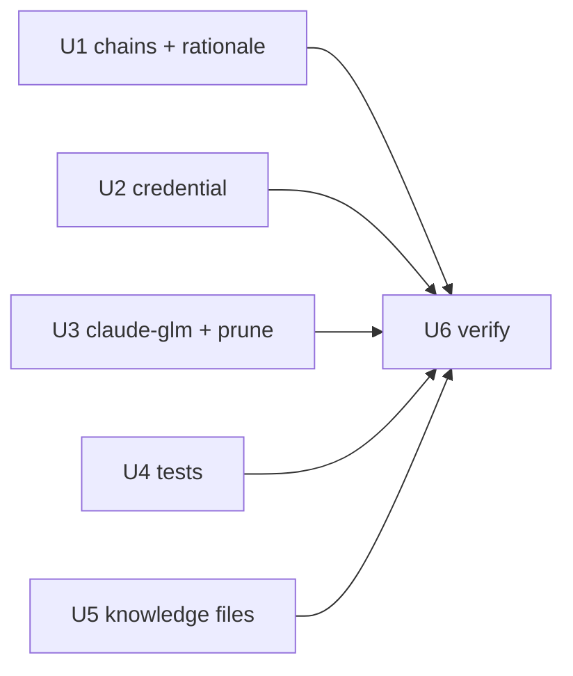

# Remove the expired Z.ai provider - Plan

## Goal Capsule

- **Objective:** Remove the expired Z.ai coding plan from the chezmoi source state — the `zai` hops in omp's fallback chains, the `ZAI_API_KEY` credential and every `op://Private/Z.ai/API Key` reference, and the `claude-glm` wrapper that fronted Z.ai's Anthropic-compatible endpoint — prune the deployed wrapper, and report the residue no mechanism can prune. A fresh host converges with no Z.ai surface.
- **Product authority:** The user's request governs scope. The root `AGENTS.md` governs chezmoi source attributes, the no-teardown rule, and isolated verification. `.agents/skills/sync-omp-models/SKILL.md` governs every edit to `modelRoles`, `task.agentModelOverrides`, and `retry.fallbackChains`.
- **Execution profile:** A bounded data-and-script removal plus knowledge-file realignment. Verification is isolated rendering and the existing reconcile test; never apply the source state to live `$HOME`, and never edit a live credential file without the user's explicit consent.
- **Stop conditions:** Stop if removing a `zai` hop would leave any role without a primary, or would newly break the anchor rule for a role that satisfied it before. Stop if a prune entry would delete a path chezmoi never deployed.
- **Tail ownership:** Local proof is isolated scratch rendering plus `.ci/test-omp-agent-reconcile.sh`. The pull request owns final `ci.yml` and `render-dotfiles.yml` proof. The host-local operator steps in R15 are the user's, reported by this run and never performed silently.

---

## Product Contract

### Summary

Delete the `zai` provider surface from this repository. Five omp fallback chains drop their `zai/` hop, the `ZAI_API_KEY` credential leaves the closed set that `run_after_config-omp-auth` reconciles, the two wrappers that read `op://Private/Z.ai/API Key` lose that reference (one is deleted outright), and the `sync-omp-models` knowledge files record which GLM families are still reachable. The already-deployed `~/.local/bin/claude-glm` is pruned through `.chezmoiremove`. The residue no mechanism can prune — a live secret inside a live-written dotenv, stale keys inside a live-written TOML, and the credential's own lifecycle at 1Password and at Z.ai — is reported to the operator with exact steps.

### Problem Frame

The Z.ai coding plan expired. Its credential still renders on every apply, so three source files perform a live `op read` for a dead secret, and deleting the now-useless 1Password item would fail every `chezmoi apply`. `zai/glm-5.2` and `zai/glm-4.7-flash` still sit in five fallback chains, so omp can still spend a retry hop on a provider that cannot answer. `claude-glm` still deploys an executable whose only backend is `https://api.z.ai/api/anthropic`.

Two removal mechanics matter and are easy to get wrong. First, omp only sees a provider whose key is present, so deleting the credential is what removes `zai` from `omp models --json` — but the dotenv reconciler preserves every **undeclared** entry byte-identically (`.chezmoiscripts/70-agents/run_after_config-omp-auth.sh.tmpl:89`), so an already-deployed `ZAI_API_KEY=` line survives as unmanaged text. Second, chezmoi does not delete a target when its source disappears, and the aoe TOML reconciler likewise preserves undeclared keys (`.chezmoiscripts/70-agents/run_after_config-aoe.sh.tmpl:3-5`).

**Current state of the working tree.** A prior pass in this session already landed the source edits for R1–R9 and R11–R14 against the live tree: no `zai/` hop survives in any chain or role, `agents.omp.auth.env` already declares the three-variable closed set, the `claude-glm` source and its aoe registration are already gone, both CI test files already omit `ZAI_API_KEY`, and both `sync-omp-models` knowledge files already carry the dated-unreachable shape. U1, U2, U4, and U5 are therefore **verify-only re-checks** of that state. The net-new work is U3's `.chezmoiremove` entry (R10) and U6's residue report (R15). The requirements stay enumerated because they are the completion contract this branch is reviewed against, not a to-do list.

### Requirements

**Model policy**

- R1. `agents.omp.settings.retry.fallbackChains` in `.chezmoidata/agents.yaml` contains no `zai/` hop. The affected chains are `default`, `slow`, `task`, `smol`, and `tiny`.
- R2. No `modelRoles` value and no `task.agentModelOverrides` value names a `zai/` selector, and no role is left without a primary.
- R3. No role's anchor status is made worse by this removal. Every role that reached both an `anthropic` hop and an `opencode-go` hop before the removal still reaches both after it, walking its own selector plus its chain — and, for a role with no declared chain, the `default` chain it inherits. `vision` is a **pre-existing exception this removal does not change**: its selector is `google-antigravity/gemini-3.1-pro` and its inherited `default` chain reached no `anthropic` hop before the removal and still reaches none after. No chain is left empty.
- R4. Each rationale comment in the omp settings block that named a `zai`/GLM hop describes the surviving order instead, and the block records the `zai` provider removal in the same shape as the existing `openai-codex` removal note.

**Credential**

- R5. `agents.omp.auth.env` declares exactly `EXA_API_KEY`, `OPENROUTER_API_KEY`, and `OPENCODE_API_KEY`, and its explanatory comment states that three-variable closed set.
- R6. `.chezmoiscripts/70-agents/run_after_config-omp-auth.sh.tmpl` enforces that same three-name set through the existing strict name allowlist — a membership test against `$required`, never a name-shape check — so its render-time diagnostics report three names from the single existing `join`.
- R7. No file outside `docs/plans/**` resolves `op://Private/Z.ai/API Key`.

**claude-glm wrapper**

- R8. `dot_local/bin/executable_claude-glm.tmpl` is deleted.
- R9. `agents.aoe."config.toml".session.custom_agents` and `agent_detect_as` no longer declare `claude-glm`.
- R10. `.chezmoiremove` prunes the already-deployed `.local/bin/claude-glm` target, ungated, following the `.local/bin/chezmoi-secrets-sync` precedent.

**Knowledge files**

- R11. `.agents/skills/sync-omp-models/model-notes.md` reflects GLM reachability: the main text line lists only `opencode-go/glm-5*`, and the Flash and vision lines carry a dated unreachable note in the shape the GPT Sol, Terra, and mini entries already use. Any substitution row whose first swap names a now-unreachable family is traceable to that note.
- R12. `.agents/skills/sync-omp-models/SKILL.md` names no unreachable `zai/` id in its worked examples.

**Tests**

- R13. `.ci/test-omp-agent-reconcile.sh` asserts the three-name managed set, keeps its duplicate-collapse coverage on a still-managed variable, keeps the `NODE_OPTIONS` outside-the-closed-set negative, and uses a declared variable name in every auth render negative.
- R14. `.ci/test-unmanaged-repo-guard-real.sh` no longer names `ZAI_API_KEY` in its model-credential probe, so an expired key cannot make the host look capable of a real-agent run.

**Residue and credential lifecycle**

- R15. Every residue this repository cannot prune is reported to the operator, in this plan and in the run's closing summary, with the exact action for each. The reported set is:
  1. The unmanaged `ZAI_API_KEY=` line in `~/.omp/agent/.env`. Until it is deleted, `zai` stays in `omp models --json` on this host and remains reachable by the catalog-wide scans described in KTD1.
  2. The `claude-glm` keys already written into `~/.config/agent-of-empires/config.toml`.
  3. The credential's own lifecycle: the `Private/Z.ai/API Key` 1Password item, which R7 makes safe to delete because no source file resolves it any more; and the key at Z.ai itself, which an expired **subscription** does not revoke.

  Reporting is the requirement. This run does not edit a live credential file or a live TOML, and does not touch 1Password or Z.ai.

### Acceptance Examples

- AE1. **Covers R1, R3.** **Given** the chains after removal, **When** each of the eleven `modelRoles` roles is walked — `default`, `slow`, `plan`, `designer`, `vision`, `advisor`, `task`, `smol`, `bulk`, `tiny`, `commit`, walking a role with no declared chain through the `default` chain it inherits — **Then** no hop names `zai`, and every role reaches at least one `anthropic` hop and at least one `opencode-go` hop **except `vision`**, which reaches `opencode-go` but no `anthropic` hop, exactly as it did before the removal.
- AE2. **Covers R5, R6, R13.** **Given** an existing `~/.omp/agent/.env` holding an unrelated token and duplicate managed assignments, **When** the rendered auth script runs against it, **Then** exactly one assignment exists for each of the three managed names, the unrelated token is byte-identical, and the file is mode 0600.
- AE3. **Covers R6.** **Given** `agents.omp.auth.env` rendered with an empty list, **When** the auth template renders, **Then** it fails naming `EXA_API_KEY` as the first missing required variable.
- AE4. **Covers R10.** **Given** a host that received `~/.local/bin/claude-glm`, **When** `.chezmoiremove` renders on Linux and in a container, **Then** `.local/bin/claude-glm` is present in both.
- AE5. **Covers R7.** **Given** the whole worktree except `docs/plans/**`, **When** searched for `op://Private/Z.ai`, **Then** there are no matches.

### Scope Boundaries

- **`agents.omp.settings.disabledProviders`** — untouched. See KTD1, which also states the window this leaves open and why it is accepted.
- **`opencode-go/glm-5.2`** — kept. It is the `advisor` role primary and the `reviewer` subagent target through `"@advisor"`. Only `zai/`-served GLM ids leave.
- **`vision`'s missing `anthropic` anchor** — pre-existing and out of scope. R3 records it; fixing it is a provider move, which the sync skill makes a separate human decision.
- **`dot_config/tokscale/custom-pricing.json`** — untouched. Its GLM entries still price `opencode-go` GLM usage.
- **Tokscale itself** — the wrapper keeps its own `op://Private/Tokscale/API Token` auth script and its mise provisioning. Only the `ZAI_API_KEY` line leaves.
- **Live `$HOME`, 1Password, and Z.ai** — not mutated by this run. R15 reports; the operator acts.
- **`docs/plans/**`** — not rewritten. See KTD6.
- **Deferred to Follow-Up Work** — none.

### Dependencies / Assumptions

- The live catalog confirms `opencode-go` serves `glm-5`, `glm-5.1`, and `glm-5.2` with no `-flash`, `-flashx`, or `v` variant, so the GLM Flash and vision families lose their only provider while the main text line survives.
- `kimi-code/k3` and `opencode-go/kimi-k3` report image input; `opencode-go/deepseek-v4-pro` does not. This is what the refreshed `vision` comment must state.
- `zai` remains in this host's `omp models --json` until the unmanaged dotenv line is deleted by hand. That is expected, not a failed removal, and KTD1 owns the consequence.
- No PowerShell counterpart of the auth provisioner exists; Windows support was dropped repo-wide by an earlier change, so there is no parity half to edit.
- The `zai` hop is the **last** entry in four chains (`slow`, `task`, `smol`, `tiny`) and a **middle** entry in one (`default`). Every affected chain keeps at least two hops either way, so none needs a replacement hop added.

---

## Planning Contract

### Key Technical Decisions

- KTD1. **Remove the credential; do not add `zai` to `disabledProviders`.** Deleting the key is the *durable* removal: it takes the provider out of `omp models --json`, which is the availability gate every role, override, and chain hop is checked against, and it leaves no permanent dead data behind. Chosen over listing `zai` in `agents.omp.settings.disabledProviders`, whose recorded rationale covers token-metered aggregators *whose keys stay provisioned*; once the key is gone that entry would be dead data forever, and re-adding a provider would then need two edits instead of one.
  **The cost, stated plainly:** deletion is *not* stronger than `disabledProviders` while the unmanaged `ZAI_API_KEY=` line survives on an already-provisioned host. `disabledProviders` applies before any credential check, and `.chezmoidata/agents.yaml:428-448` enumerates catalog-wide scans that no fallback chain governs — the text-only-model vision fallback ending at "first image-capable available", the `smol`/`slow` finders ending at `availableModels[0]`, and the built-in `priority.json` bare-pattern role chains. During that window `zai` is exactly the provisioned-key case the setting exists to cover, so a scan can still select it. The window is closed by the R15 operator step, not by this repository, and R15 plus the closing summary are what make it a named action rather than a silent gap. Governs R5, R6, R15.
- KTD2. **No teardown script; the unprunable residue is reported, not automated.** The root `AGENTS.md` forbids teardown/revert scripts and sanctions exactly three alternatives: delete the managed source, use `.chezmoidata/system.yaml` `removed:`, or document a one-time manual reversal. The mechanical reason the third applies here is that neither reconciler can be asked to delete a *line*: both preserve undeclared entries by design, and `system.yaml` `removed:` accepts only absolute `/etc` **file** paths for `rm -f`, so it cannot reach inside `~/.omp/agent/.env` or `~/.config/agent-of-empires/config.toml`. Chosen over adding a prune step to either provisioner. Governs R15.
- KTD3. **The deployed `claude-glm` binary is pruned through `.chezmoiremove`, ungated.** The asymmetry with KTD2 is mechanical, not a preference: `claude-glm` is a whole **file** chezmoi itself deployed, which is exactly what `.chezmoiremove` deletes, whereas the dotenv secret is a **line inside a file omp writes and owns**. `.local/bin/chezmoi-secrets-sync` is the same shape as `claude-glm`: a `dot_local/bin/executable_*.tmpl` wrapper, pruned with no container gate because the container ignore rules do not exclude `.local/bin`. A prune entry is a target-state declaration, not a teardown script, so KTD2 does not cover it. Governs R10.
- KTD4. **Purge the tokscale `ZAI_API_KEY` too.** (session-settled: user-approved — chosen over leaving `dot_local/bin/private_executable_tokscale.tmpl` untouched: it is the last `op://Private/Z.ai/API Key` reference, so deleting the now-useless 1Password item would otherwise fail every `chezmoi apply`.) This is what makes R15's 1Password step safe. Governs R7.
- KTD5. **Retain the unreachable GLM families in `model-notes.md` with a dated note.** That file is keyed by family, not by provider, and already documents unreachable families (GPT Sol, Terra, mini) with a dated line rather than deleting them — which is what keeps its substitution tables meaningful. The residual risk is that a substitution row's first swap can name a family with no provider today; the dated note inside the family entry is the mitigation, and R11 requires the row stay traceable to it. Chosen over deleting the GLM Flash and vision sections. Governs R11.
- KTD6. **`docs/plans/**` is historical and is not rewritten.** The sync skill states plans are not an input and their frozen values are stale by construction; prior provider removals left their plan records intact. Governs the `docs/plans/**` scope boundary.

### Assumptions

- Trailing rationale comments in the omp settings block are treated as data, per sync rule 9, so a value change and its comment change land together in one unit.
- The narrowing from four managed variable names to three **strengthens** the anti-injection property the closed set exists for, because the mechanism is a name allowlist rather than a shape check: a shorter allowlist admits strictly fewer names.

### Sequencing

U1, U2, and U3 all edit `.chezmoidata/agents.yaml`, but they touch **disjoint top-level keys** — the fallback chains and their rationale comments, `auth.env`, and the aoe `custom_agents`/`agent_detect_as` maps respectively. U4 and U5 touch separate files entirely. No two units edit the same key, so all five may land in any order. U6 verifies the whole set and runs last.

### Sources / Research

- `.agents/skills/sync-omp-models/SKILL.md` — sync rules 4 (availability and capability), 6 (chains and the anchor providers), 9 (comments are data); the "Ignore `docs/plans/`" rule behind KTD6. Its Verify section iterates declared chains only, which is why AE1 walks the no-chain roles explicitly.
- `.chezmoidata/agents.yaml:428-448` — the `disabledProviders` rationale, including the catalog-wide scans that KTD1's stated cost depends on.
- `.chezmoiscripts/70-agents/run_after_config-omp-auth.sh.tmpl:11-22,89` — the strict name-allowlist membership test, the completeness loop that produces the first-missing-variable diagnostic, and the line that preserves an unmanaged entry.
- `.chezmoiscripts/70-agents/run_after_config-aoe.sh.tmpl:3-5` — the same preserve-undeclared behavior for the aoe TOML.
- `.chezmoiremove:57-63` — the `.local/bin/chezmoi-secrets-sync` prune precedent, including its explicit no-container-gate reasoning.
- `.chezmoidata/system.yaml` `removed:` — absolute `/etc` file paths only, which is why it cannot serve as the residue mechanism (KTD2).
- `.github/workflows/ci.yml` — the reconcile test's argument order and the haptic-package build steps the Verification Contract reproduces.
- `docs/plans/2026-07-15-002-chore-remove-meridian-proxy-plan.md`, `docs/plans/2026-08-05-001-chore-unmanage-claude-codex-harnesses-plan.md` — prior removal precedents (read for shape only, per KTD6).
- Independent audits run for this plan: a post-edit residue sweep (surfaced the missing `.chezmoiremove` entry now covered by R10) and a five-persona document review (surfaced the KTD1 window, the `vision` anchor exception, the credential-lifecycle gap now in R15, and the haptic build gap now in the Verification Contract).
- No `docs/solutions/`, `CONCEPTS.md`, or `STRATEGY.md` exists in this repository, so R15's durable location is this plan plus the dated rationale comment in `.chezmoidata/agents.yaml`.

---

## Implementation Units

### U1. Drop the `zai` fallback hops and refresh the model-policy rationale

- **Goal:** No `zai` hop remains in any omp fallback chain, and every rationale comment that explained a `zai`/GLM hop describes the surviving order.
- **Requirements:** R1, R2, R3, R4.
- **Dependencies:** none.
- **Files:** `.chezmoidata/agents.yaml`.
- **Approach:**
  1. Delete the `zai/glm-5.2:max` hop from the `default`, `slow`, and `task` chains and the `zai/glm-4.7-flash` hop from `smol` and `tiny`.
  2. Rewrite the `default`, `slow`, and `task` chain comments so each describes its surviving order; the `advisor` comment is unaffected because its GLM primary is `opencode-go`-served.
  3. Rewrite the provider-spread comment's `vision` clause: the inherited `default` chain now ends on `opencode-go/deepseek-v4-pro`, which has no image input, while its first hop `kimi-code/k3` does.
  4. Add a provider-removal note in the same shape as the existing `openai-codex` note: date, that no role primary was affected, which chains lost a hop, that no role's anchor status got worse, and that the GLM main text line survives on `opencode-go` while the Flash and vision lines do not.
- **Patterns to follow:** the `openai-codex` removal paragraph already in the omp settings block; sync rule 9 (a value change and its comment change land together).
- **Test scenarios:**
  - Covers AE1. Every `retry.fallbackChains` role key is still a declared `modelRoles` key, no chain is empty, and no chain entry matches `zai/`.
  - Covers AE1. Walking each of the eleven roles — own selector plus chain, and the inherited `default` chain for a role that declares none — every role reaches an `anthropic` and an `opencode-go` hop except `vision`, whose status is unchanged from before the removal.
  - `.chezmoidata/agents.yaml` parses, and the rendered settings script still asserts the same declared paths.
- **Verification:** the settings provisioner renders, and the chain/anchor checks above hold on the rendered data.

### U2. Retire the `ZAI_API_KEY` credential and every `op://Private/Z.ai` reference

- **Goal:** The omp dotenv closed set is three variables, and no file resolves the Z.ai secret.
- **Requirements:** R5, R6, R7, R15. Implements KTD4.
- **Dependencies:** none.
- **Files:** `.chezmoidata/agents.yaml`, `.chezmoiscripts/70-agents/run_after_config-omp-auth.sh.tmpl`, `dot_local/bin/private_executable_tokscale.tmpl`.
- **Approach:**
  1. Delete the `ZAI_API_KEY` entry from `agents.omp.auth.env` and restate its comment as a three-variable closed set, recording that the removed line survives unmanaged in the deployed dotenv and must be hand-deleted (R15.1).
  2. Narrow `$required` in the auth template to the same three names. Keep the membership test, the duplicate check, the completeness loop, and the single `join ", " $required` diagnostic exactly as they are, so the allowlist stays strict and the message cannot drift from it.
  3. Delete the `ZAI_API_KEY=` line from the tokscale wrapper's `env` invocation, leaving `TOKSCALE_DEVICE_NAME` as its only rendered variable.
- **Patterns to follow:** the existing closed-set validation loop and its `join ", " $required` diagnostics; the auth comment's existing consumer-map wording.
- **Test scenarios:**
  - Covers AE2. Against a fixture dotenv holding an unrelated token plus duplicate managed assignments, the rendered script leaves exactly one assignment per managed name, the unrelated token byte-identical, and mode 0600.
  - Covers AE3. An empty `agents.omp.auth.env` fails the render naming `EXA_API_KEY`.
  - A declared `ZAI_API_KEY` now fails the render as an unsupported variable, and the diagnostic lists the three-name closed set.
  - The `NODE_OPTIONS` outside-the-closed-set negative still fails the render, proving the narrowing did not weaken the anti-injection allowlist.
  - Covers AE5. The tokscale wrapper renders with a stub `op` and contains no `ZAI_API_KEY` and no `z.ai` literal.
- **Verification:** both templates render under the isolated stub-`op` recipe, `bash -n` passes on the rendered auth script, and the reconcile test's auth assertions pass.

### U3. Delete the `claude-glm` wrapper, its aoe registration, and its deployed target

- **Goal:** No source, no agent registration, and no deployed binary for `claude-glm`.
- **Requirements:** R8, R9, R10, R15. Implements KTD3.
- **Dependencies:** none.
- **Files:** `dot_local/bin/executable_claude-glm.tmpl` (delete), `.chezmoidata/agents.yaml`, `.chezmoiremove`.
- **Approach:**
  1. Delete the wrapper source.
  2. Remove the `claude-glm` key from `agents.aoe."config.toml".session.custom_agents` and from `agent_detect_as`, leaving `omp` and the bare `zsh` shell agent. The reconciler preserves the already-written live entries, so they become R15.2.
  3. Append a `.chezmoiremove` block for `.local/bin/claude-glm` with a comment naming the deleted source, why deleting it leaves the target behind, and why there is no container gate.
- **Patterns to follow:** `.chezmoiremove:57-63` (`.local/bin/chezmoi-secrets-sync`) — same wrapper shape, same ungated reasoning, same comment structure.
- **Test scenarios:**
  - Covers AE4. `.chezmoiremove` renders on Linux and with the container fact true; `.local/bin/claude-glm` is present in both, and every pre-existing entry is unchanged.
  - The rendered aoe config JSON contains no `claude-glm` key in either map and still contains `omp` and `zsh`.
  - Covers AE5. No file outside `docs/plans/**` references `claude-glm`.
- **Verification:** `.chezmoiremove` renders in both gate states with the new entry and no diff to existing entries; the aoe provisioner renders.

### U4. Realign the omp reconciliation and guard tests to the three-name set

- **Goal:** The CI tests assert the new closed set and keep every coverage class they had.
- **Requirements:** R13, R14.
- **Dependencies:** none (they assert against freshly rendered scripts, so they may be edited alongside U2).
- **Files:** `.ci/test-omp-agent-reconcile.sh`, `.ci/test-unmanaged-repo-guard-real.sh`.
- **Approach:**
  1. Move the fixture's duplicate-assignment pair from `ZAI_API_KEY` onto a still-managed variable so duplicate-collapse coverage is preserved rather than deleted.
  2. Drop the `ZAI_API_KEY` count and value assertions, and narrow the expected ordered managed-name list to three.
  3. Update the `closed_set` diagnostic string and switch each auth render negative onto a declared variable name, including the emptied-set case whose expected diagnostic is now the first required name. Leave the `NODE_OPTIONS` negative in place.
  4. Remove `ZAI_API_KEY` from the guard test's separate model-credential probe list, so an expired key cannot make the host look capable of a real-agent run. This is a different assertion from the reconcile test's managed set — do not conflate them.
- **Patterns to follow:** the existing `grep -c` exact-count assertions, the `diff -u` ordered-name comparison, and the `assert_render_fails` helper.
- **Test scenarios:**
  - Covers AE2, AE3. The reconcile test passes against freshly rendered auth, plugin, settings, and built haptic artifacts: three exact assignment counts, the ordered three-name comparison, and every render negative including `NODE_OPTIONS`.
  - The duplicate-collapse case still fails if the reconciler stops collapsing duplicates, proving the coverage moved rather than vanished.
  - The guard test's remaining credential probe still detects a real model credential, so its always-on assertions are unaffected.
- **Verification:** `.ci/test-omp-agent-reconcile.sh` exits zero with the freshly rendered arguments the CI job passes.

### U5. Record GLM reachability in the sync-omp-models knowledge files

- **Goal:** The model-policy knowledge files state which GLM families remain reachable and name no unreachable id as a live example.
- **Requirements:** R11, R12. Implements KTD5.
- **Dependencies:** none.
- **Files:** `.agents/skills/sync-omp-models/model-notes.md`, `.agents/skills/sync-omp-models/SKILL.md`.
- **Approach:**
  1. Narrow the GLM main text line's `ids:` list to `opencode-go/glm-5*`.
  2. Add a dated unreachable note to the GLM Flash and GLM vision entries, keeping their `ids:` patterns and sources so the family stays documented. The GLM vision note states that the `vision` substitution order still names the family, which is what keeps that row traceable rather than misleading.
  3. Update the borrowed-rules bullet that described the `default` chain as passing through GLM, since that chain now ends on DeepSeek Pro.
  4. Drop the naive-pick table row whose example names two ids this host no longer reaches.
- **Patterns to follow:** the GPT Sol, GPT Terra, and GPT mini entries — each keeps its `ids:`, `built for`, and `src:` lines and adds a dated unreachable paragraph inside `weak at / watch`.
- **Test scenarios:** Test expectation: none — these are agent-facing knowledge documents with no executable behavior. Their correctness is checked by the R11/R12 assertions in U6.
- **Verification:** the role-to-family table still matches the declared roles in `.chezmoidata/agents.yaml`, and every remaining `zai/` id sits inside a paragraph that marks it unreachable.

### U6. Verify the removal in isolation and report the residue

- **Goal:** Proof that every changed template renders, the reconcile test passes, no Z.ai surface survives, and the operator knows the three residue actions.
- **Requirements:** all, and R15 in particular.
- **Dependencies:** U1, U2, U3, U4, U5.
- **Files:** none changed.
- **Approach:**
  1. Render every changed template through `chezmoi execute-template` with a stub `op` on `PATH`, an empty config, a throwaway destination, and `--source "$PWD"`; scripts are not targets, so compare them as rendered text.
  2. Render `.chezmoiremove` on Linux and with the container fact true.
  3. Build the haptic package, then run `.ci/test-omp-agent-reconcile.sh` with the rendered auth, plugin, and settings scripts plus that built package.
  4. Run the R7/R8/R11/R12 absence checks, excluding `docs/plans/**`.
  5. Run `git diff --check` and inspect a diff limited to the requested scope.
  6. Report R15's three residue actions in the run's closing summary, each with its exact command or step. Do not perform any of them.
- **Execution note:** this is packaging and configuration work, so the proof is render plus the existing isolated test, not new unit coverage. Never apply to live `$HOME`, and never edit `~/.omp/agent/.env` without the user's explicit consent.
- **Patterns to follow:** the isolated stub-`op` recipe in the root `AGENTS.md` verification section; the render-and-build steps and argument order in `.github/workflows/ci.yml`.
- **Test scenarios:** Test expectation: none — this unit runs the existing gates rather than adding behavior.
- **Verification:** every render exits zero, `bash -n` passes on each rendered POSIX script, the reconcile test exits zero, the absence checks return nothing, `git diff --check` is clean, and the closing summary names all three residue actions.

---

## Verification Contract

Run every check from the worktree root with an isolated destination. Never apply to live `$HOME`.

- **Isolated render.** Per the root `AGENTS.md` recipe: a per-user scratch directory, a stub `op` returning newline-free secrets, an empty config, a throwaway destination, and `--source "$PWD"`. Render `.chezmoiscripts/70-agents/run_after_config-omp-auth.sh.tmpl`, `run_after_config-omp-settings.sh.tmpl`, `run_onchange_after_update-omp-plugins.sh.tmpl`, `run_after_config-aoe.sh.tmpl`, `dot_local/bin/private_executable_tokscale.tmpl`, `.chezmoiscripts/10-auth/run_onchange_after_auth-tokscale.sh.tmpl`, `.chezmoiremove`, and `dot_local/share/omp-plugins/plugins/mxm4-haptic/package.json.tmpl`.
- **Haptic package build (prerequisite for the reconcile test).** The reconcile test's third argument is a *built* directory, not a rendered one: it asserts both `package.json` and `dist/index.js` exist and byte-compares the built plugin. Reproduce the CI step — render the package manifest into `<scratch>/haptic-package/package.json`, run `vp install --frozen-lockfile` in `packages/`, run `vp run build:omp-plugin` in `packages/mxm4-haptic/`, then copy `packages/mxm4-haptic/dist/omp-plugin/index.js` to `<scratch>/haptic-package/dist/index.js`. Rendering alone cannot produce this argument.
- **Manifest gating.** Render `.chezmoiremove` on Linux and with the container fact true; `.local/bin/claude-glm` must appear in both, with no change to existing entries.
- **Shell syntax.** `bash -n` on each rendered POSIX script.
- **Reconciliation coverage.** `.ci/test-omp-agent-reconcile.sh <rendered-auth> <rendered-plugins> <built-haptic-package> <rendered-settings>`, matching the argument order in `.github/workflows/ci.yml`.
- **Absence proof.** Search the worktree excluding `docs/plans/**` for `zai`, `ZAI_API_KEY`, `op://Private/Z.ai`, `api.z.ai`, and `claude-glm`. The only permitted matches are the past-tense removal notes in `.chezmoidata/agents.yaml` and the self-marked unreachable family entries in `model-notes.md`.
- **Repository hygiene.** `git diff --check`, `git status`, and a diff limited to the requested scope.

**Apply-time side effects.** None of the changed scripts restart a network or system service, so no console-only apply is required. `run_after_config-omp-auth` already retries on every apply because its rendered secrets are not a safe fingerprint input; `.chezmoiremove` acts in the target-application phase.

**Known verification blind spots.** `.chezmoiscripts/**` are not chezmoi targets, so a `chezmoi archive` comparison cannot see them; they are compared as rendered text instead. The stub `op` returns a fixed value for any reference, so CI cannot prove a vault or item path is spelled correctly — that is only provable on a live apply. Nothing in CI can observe the host residue in R15; only the operator can confirm those three actions.

---

## Definition of Done

**Global**

- Every requirement R1 through R15 is satisfied.
- Every Verification Contract check passes.
- No teardown or revert script was added, no live credential file was edited, and no scaffolding or dead-end edit remains in the diff.
- The commit subject is a lowercase Conventional Commit, and the branch carries a Git Flow prefix with a work-descriptive slug.

**Per unit**

- U1: no chain names `zai`; no role's anchor status is worse than before, with `vision` recorded as the unchanged pre-existing exception; every touched comment describes the surviving order.
- U2: the closed set is three names in the data, the template, and the comment; the allowlist stays a strict membership test; no `op://Private/Z.ai` reference remains.
- U3: the wrapper source is gone, neither aoe map names `claude-glm`, and `.chezmoiremove` prunes `.local/bin/claude-glm` in both gate states.
- U4: the reconcile test asserts the three-name managed set and keeps duplicate-collapse and `NODE_OPTIONS` coverage; separately, the guard test's model-credential probe no longer names `ZAI_API_KEY`.
- U5: GLM main text lists only `opencode-go/glm-5*`; the Flash and vision entries carry a dated unreachable note; no live example names an unreachable id.
- U6: all gates green, and the closing summary reports all three R15 residue actions — the dotenv line, the aoe TOML keys, and the 1Password item plus the key at Z.ai — with the exact step for each and an explicit note that `zai` stays catalog-reachable on this host until the dotenv line is deleted.
