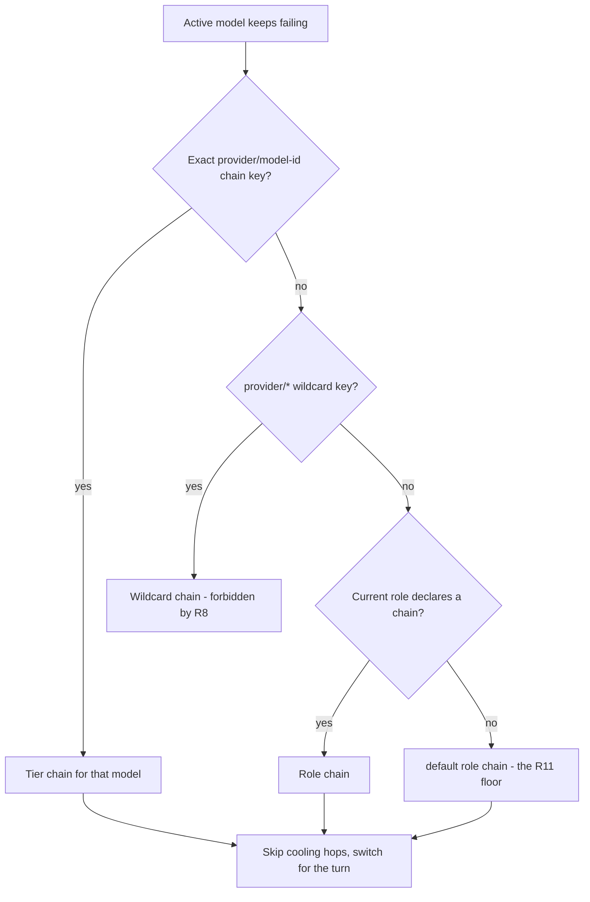
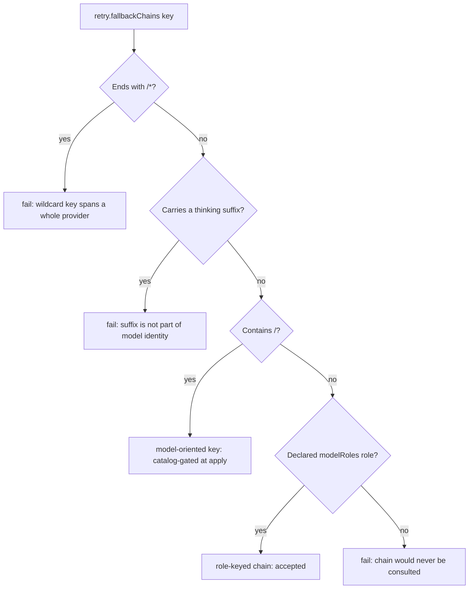
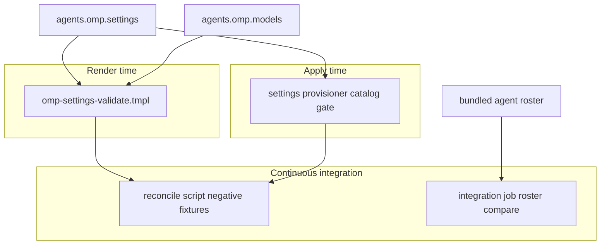

# omp Tier-Based Model Policy - Plan

## Goal Capsule

- **Objective:** Restructure omp's model policy in `.chezmoidata/agents.yaml` around three model tiers whose fallback chains are keyed by model selector rather than by role, map every bundled subagent explicitly onto a tier, move the critic seat to a third vendor and turn it on, cap every Kimi hop at 256k context, and retire the `sync-omp-models` skill together with the placement rationale that justified the old shape.
- **Product authority:** The Product Contract below and the dialogue behind it. The root `AGENTS.md` governs chezmoi source attributes, the credential-free settings contract, and isolated verification. omp's own documentation (`omp://settings.md`, `omp://models.md`, `omp://tools/task.md`, `omp://advisor-watchdog.md`) governs every mechanism claim; no external model-policy authority survives this change.
- **Execution profile:** One render-time validator change, one provisioner change, one data rewrite, one model-metadata addition, two verification changes, and one deletion pass. Seven units, dependency-ordered, each landable as its own commit.
- **Stop conditions:** Stop if the validator change cannot accept a model-oriented chain key without weakening the existing role-key, alias, parent-namespace, or transport-safety gates. Stop if a declared selector or thinking level is absent from the live catalog. Never run `chezmoi apply` against live `$HOME` during verification, and never edit a deployed credential file.
- **Tail ownership:** Local proof is isolated rendering plus `.ci/test-omp-agent-reconcile.sh`. The pull request owns final `ci.yml` and `render-dotfiles.yml` proof. The live-host observations named in the Verification Contract are the user's, reported by this run and never performed silently.
- **Open blockers:** None.

**Product Contract preservation:** extended, no scope change to existing entries. R1-R33 and KD1-KD11 are unchanged. R34-R41 were added from plan-time research: R34, R35, R36, R37, R40, and R41 each close a gap the machine-checked half of the policy would otherwise leave silent (KD12); R38 corrects a comment the role reduction falsifies; R39 removes the git-side rules for the deleted tree (KD10).

---

## Product Contract

### Summary

Model placement becomes derivable instead of argued: three tiers define which models are peers, a fallback chain hangs on each tier's model selector so any role using that model recovers within its own grade, and six roles plus seven explicit subagent mappings point at those tiers. The `sync-omp-models` skill, the whole `.agents/` tree, and the placement-rationale comments are deleted, with the machine-checkable half of their rules moved into the render-time validator.

### Problem Frame

Changing one model in this repository currently costs two reads before the first edit: a 534-line procedure skill and its 505-line capability-notes companion. On top of that, `.chezmoidata/agents.yaml` carries placement rationale across `:239-304`, and three of the traps that prose exists to prevent are consequences of one structural choice — that `retry.fallbackChains` is keyed by role. A role-keyed chain forces a light role to declare its own chain or silently inherit the deliberation chain, leaves it undocumented whether an alias role consults its own chain or its target's, and needs a hand-maintained anchor-provider rule to keep provider spread.

The prose also rots faster than it is read. Two of the bundled-agent frontmatter values the comments assert are already wrong on the installed binary: the comments claim `librarian` pins `@smol` and `reviewer` pins `@slow`, while `omp agents unpack` on v17.2.9 reports `librarian` with an empty `model:` and `reviewer` with no `model:` key at all. Both agents therefore resolve somewhere the comments do not describe, and the override set that was written as a diff against those values is a diff against a snapshot that moved.

The cost is paid twice. A reader pays it up front, and an agent that skips the reading pays it later by placing deep-judgment work on a light tier without any gate noticing.

### Key Decisions

- KD1. **Chains hang on model selectors, not roles.** An exact `provider/model-id` chain key outranks a role chain by specificity, so grade becomes a property of the model where it belongs. (session-settled: user-directed — chosen over keeping role-keyed chains and over a template-expanded tier map: model keying removes the duplication that would have justified the template.) Governs R7, R8, R9, R10.
- KD2. **One `default` role chain stays as the floor.** It costs one key and is the only recovery path left for a model that carries no chain of its own. (session-settled: user-directed — chosen over a pure model-keyed table with no floor.) Governs R11.
- KD3. **The LMArena leaderboard is one-shot advisory, never committed data.** Eight of thirteen omp plan ids exist there only as effort or preview variants, one is absent entirely, so a mechanical id-to-tier mapping would replace a hand-maintained skill with a hand-maintained alias table plus a daily fetch. (session-settled: user-directed — chosen over a generated tier lock refreshed by a workflow and over dropping the evidence entirely.) Governs R1, R25.
- KD4. **Leaderboards set the ceiling-to-mid boundary; the light tier is defined by latency and sits outside their reach.** Two leaderboard disagreements with the proposed grouping resolve the same way, and the light tier's own primary has no leaderboard row at all. (session-settled: user-approved — chosen over forcing every tier onto one Elo column.) Governs R1, R6, R25.
- KD5. **Subagent mapping is exhaustive, not a diff against bundled frontmatter.** Naming all seven bundled agents makes the mapping immune to the frontmatter drift that already invalidated two comment claims, and removes "re-read frontmatter after an omp upgrade" as a maintenance trigger. (session-settled: user-directed — chosen over the diff rule that omitted any agent whose frontmatter already named the wanted role.) Governs R13, R14, R15.
- KD6. **The critic seat moves to a third vendor and the advisor runtime is turned on.** `.chezmoidata/agents.yaml:272-276` already recorded reverting the critic seat to GPT as a pending decision once `openai-codex` returned; this change makes it. (session-settled: user-directed — chosen over staying on `opencode-go/glm-5.2` and over leaving the runtime off.) Governs R16, R17, R18.
- KD7. **Roles survive only when deleting them changes behavior for the worse.** Six pass that test and five do not. (session-settled: user-directed — chosen over declaring all ten built-ins as tier aliases.) Governs R2, R3, R4, R5.
- KD8. **Placement rationale drops to a two-to-three-line header, and its machine-checkable half becomes render failure.** A rule a validator enforces does not need a paragraph explaining it. (session-settled: user-directed — chosen over zero comments with no recorded tier basis and over keeping prose without validator changes.) Governs R24, R25, R26, R28, R29, R30.
- KD9. **Compaction strategy stays undeclared.** The repository declares no `compaction` key today and `snapcompact` is omp's schema default, so there is nothing to change and no vision precondition to gate. (session-settled: user-directed — chosen over declaring `snapcompact` explicitly with an `img=true` gate on every declared selector.) Governs R33.
- KD10. **The retired knowledge surface goes in full, tree and all.** `sync-omp-models` was the only project skill, so removing the procedure without the tree would leave a category with no members. (session-settled: user-directed — chosen over deleting only the procedure file and over keeping the capability-notes companion.) Governs R22, R23, R27, R39.
- KD11. **Context parity for Kimi is bought in `models.yml`, widening scope past `agents.omp.settings`.** Only one of the two Kimi plans publishes a 256k variant, so the other reaches parity through a model-metadata override; the retired skill had forbidden touching that file at all. (session-settled: user-directed — chosen over leaving one Kimi hop at 1M and over dropping that hop.) Governs R12, R20, R21.
- KD12. **Every gap that plan-time research found silent becomes loud.** Seven surfaces could accept a wrong value with no render, apply, or CI signal; six get a gate and the seventh gets the comment correction its own deletion requires. (session-settled: user-approved — chosen over accepting them as documented risks.) Governs R34, R35, R36, R37, R38, R40, R41.

### Requirements

**Tier definition and roles**

- R1. Three tiers define which models are peers: a ceiling tier, a mid tier that carries the main coding loop, and a light tier chosen for latency rather than leaderboard rank.
- R2. `modelRoles` declares exactly six roles: `slow`, `default`, `smol`, `advisor`, `plan`, and `commit`.
- R3. `plan` and `commit` are `@role` aliases; the other four carry literal selectors.
- R4. `task`, `tiny`, `vision`, `designer`, and `bulk` are removed from `modelRoles`.
- R5. No custom role is declared, so the surviving role set is a subset of omp's ten built-ins.
- R6. Every declared selector exists in the live catalog and every thinking suffix appears in that model's supported list.

**Fallback chains**

- R7. `retry.fallbackChains` keys the ceiling, mid, light, and advisor chains on the exact `provider/model-id` selector of each tier's primary.
- R8. No chain key is a `provider/*` wildcard, because such a key applies to every model that provider serves and would let one tier's chain catch another tier's model wherever a single provider backs more than one tier — which `anthropic` and `opencode-go` both do here.
- R9. Each chain's hops stay within their tier's grade; a chain does not escalate a light role to a deliberation model.
- R10. No role declares a chain of its own apart from the floor in R11.
- R11. `retry.fallbackChains.default` carries the mid-tier hop list as the floor for any model that has no chain keyed on it.
- R12. Every Kimi hop, whether primary or fallback, resolves to a 256k context window.

**Subagent mapping**

- R13. `task.agentModelOverrides` declares an entry for every agent `omp agents unpack` reports: `task`, `scout`, `designer`, `librarian`, `sonic`, `reviewer`, and `security-reviewer`.
- R14. Every override value is a `@role` alias that resolves against the roles declared in R2.
- R15. The mapping is authoritative rather than a diff, so an entry is kept even when it matches the agent's bundled frontmatter.

**Advisor**

- R16. `modelRoles.advisor` names an `openai-codex` model, placing the critic on a vendor family that appears nowhere in the doer's resolution path.
- R17. `advisor.enabled` is declared `true`.
- R18. `advisor.subagents`, `advisor.syncBacklog`, and `tier.advisor` stay undeclared so they keep their defaults.
- R19. The settings map declares no bare `advisor` key, because a declared parent namespace of an already-declared dotted path fails the render.
- R35. The provisioner reports a diagnostic when `advisor.enabled` is true and the advisor selector's provider is absent from the probed catalog, without aborting the apply.

**Model metadata**

- R20. `agents.omp.models` declares an override-only `opencode-go` provider whose `modelOverrides` caps `kimi-k3`'s `contextWindow` at 256k.
- R21. That override is the only change to `agents.omp.models`; no full custom provider or model list is introduced.
- R37. Every model id declared under `agents.omp.models` is cross-checked at render time against the selectors declared in `agents.omp.settings`, and an id matching none of them fails the render.
- R40. The models cross-check fails the render on any key under a declared provider other than `modelOverrides`, so the override-only shape R21 states by policy is machine-checked rather than trusted.
- R41. The credential-free scan that `agents.omp.settings` already carries extends to `agents.omp.models`, so an `op://` reference or a transport-unsafe character anywhere under that map fails the render.

**Knowledge-surface removal**

- R22. `.agents/` is deleted in full, including `.agents/skills/sync-omp-models/SKILL.md` and its `model-notes.md` companion.
- R23. The root `AGENTS.md` paragraph that names `sync-omp-models` as the repository's project skill is rewritten so it describes no deleted instance.
- R24. The placement-rationale comment block in `.chezmoidata/agents.yaml` is deleted and replaced by a two-to-three-line header above the tier data.
- R25. The header records only what no validator can check: the tier basis, the dated leaderboard snapshot it came from, and the fact that the light tier sits outside that basis.
- R26. The comment paragraph that documents the flat-settings-path assertion mechanics survives, because it describes the delivery contract rather than a model placement.
- R27. No replacement capability-notes corpus is created in any location.
- R38. The mnemopi memory-backend comment is corrected so it no longer describes resolution through the deleted `tiny` role.
- R39. The `.gitignore` negation pair that exists to keep `.agents/skills/` tracked is removed with the tree it describes. The lines excluding dotagents' own generated state stay unless that generation is proven to depend on the deleted tree.

**Machine-checked rules**

- R28. `.chezmoitemplates/omp-settings-validate.tmpl` accepts a chain key containing `/` as a model-oriented key.
- R29. The same template fails the render on a `provider/*` wildcard chain key.
- R30. The same template keeps failing the render on a chain key that is neither a model selector nor a declared role, and on a `@role` alias that `modelRoles` does not declare.
- R31. The provisioner's catalog gate validates model-oriented chain keys against the live catalog, not only chain values.
- R32. `.ci/test-omp-agent-reconcile.sh` asserts the accepted model-selector key case and the rejected wildcard and thinking-suffix cases alongside its existing rejection of an undeclared role key.
- R33. No `compaction` or `snapcompact` key is declared.
- R34. A model-oriented chain key carries no thinking suffix, and the validator fails the render on one.
- R36. Continuous integration compares the declared `task.agentModelOverrides` key set against the bundled agent roster the installed omp reports, and fails when they diverge.

### Key Flows

- F1. Tier recovery when a primary is unavailable
  - **Trigger:** The active model repeatedly fails with a quota wall, rate limit, or provider outage while `retry.modelFallback` is on.
  - **Steps:** omp picks the chain owning the failing model by specificity — exact `provider/model-id` key, then `provider/*` wildcard, then the current role's chain, then `default`. The tier chain keyed on that model wins at the first step. Hops still cooling down are skipped and the switch holds for the rest of the turn.
  - **Outcome:** The role recovers onto a same-grade model regardless of which role was using it, and no role needs a chain of its own. Grade holds while each tier primary keeps a chain keyed on it; a primary retuned without a matching key recovers through the R11 floor instead.
  - **Covered by:** R7, R8, R9, R10, R11
  - **Note:** A second failure re-enters the same ladder for the new failing model. A hop that is itself a declared tier primary resolves through its own keyed chain rather than continuing the first list. R9 keeps that recursion in grade at any depth.

- F2. Subagent model resolution
  - **Trigger:** A subagent spawns, whether requested by name or dispatched generically by a skill.
  - **Steps:** omp consults `task.agentModelOverrides` for that agent name, then the agent's own frontmatter, then the configured task role or session fallback. The exhaustive mapping resolves at the first step for every bundled agent, and the alias expands through `modelRoles`.
  - **Outcome:** Every bundled agent lands on a named tier, and a later frontmatter change upstream cannot move it.
  - **Covered by:** R13, R14, R15, R36

### Acceptance Examples

- AE1. **Covers R7, R9, R10.** Given the mid tier's primary is unavailable and the role using it declares no chain, when recovery runs, then the hop comes from the chain keyed on that model rather than from the deliberation chain.
- AE2. **Covers R11.** Given a model selected by hand that no chain is keyed on, when it hits a wall, then recovery falls through to the `default` role chain instead of ending without a fallback.
- AE3. **Covers R12, R20.** Given a Kimi fallback hop served by a provider that publishes no 256k variant, when a turn runs on it, then its effective context window is 256k.
- AE4. **Covers R13, R15.** Given an omp upgrade that changes a bundled agent's frontmatter `model:` value, when that agent spawns, then its resolved model is unchanged because the override resolves before frontmatter.
- AE5. **Covers R29, R32.** Given a `provider/*` wildcard declared as a chain key, when the settings script is rendered, then the render fails and names the offending key.
- AE6. **Covers R28, R31.** Given a model-oriented chain key whose provider the catalog serves but whose exact selector it does not, when the provisioner runs its catalog gate, then the apply aborts and names the data path.
- AE7. **Covers R19.** Given both `advisor` and `advisor.enabled` declared, when the settings script is rendered, then the render fails on the parent-namespace collision.
- AE8. **Covers R17.** Given `advisor.enabled` is true and the advisor model resolves, when a primary turn completes, then the advisor reviews only the new transcript delta and its usage is attributed to a separate advisor transcript.
- AE9. **Covers R34.** Given a chain key that carries a thinking suffix, when the settings script is rendered, then the render fails and names the suffix as the reason.
- AE10. **Covers R36.** Given an omp version whose bundled agent roster gains a name the override map does not declare, when the integration job runs, then it fails and names the unmapped agent.
- AE11. **Covers R37.** Given a model id under `agents.omp.models` that no declared settings selector names, when the models target is rendered, then the render fails and names the unmatched id.
- AE12. **Covers R35.** Given `advisor.enabled` is true and the advisor selector's provider is absent from the probed catalog, when the provisioner runs, then it prints a diagnostic naming the advisor path and continues to assert every declared setting.
- AE13. **Covers R40.** Given a key under a declared provider in `agents.omp.models` that is not `modelOverrides`, when the models target is rendered, then the render fails rather than ignoring the key.
- AE14. **Covers R41.** Given an `op://` reference declared anywhere under `agents.omp.models`, when the models target is rendered, then the render fails and names the offending path.

### Scope Boundaries

- Compaction strategy. The repository declares no `compaction` key and keeps omp's default; no `img=true` gate on declared selectors follows from it.
- A tier map in `.chezmoidata` expanded by a `.chezmoitemplates` partial. Model keying already removed the duplication that would justify it; revisit if the tier count grows past three or the role count past ten.
- `enabledModels` narrowing to tier members. It would close omp's built-in bare-pattern scans at the model level, at the cost of hand-testing a new model through `/model`.
- A `WATCHDOG.md` advisor-guidance target managed under `dot_omp/private_agent/`. Revisit when advisor notes read as generic because they carry no project context.
- Any `agents.omp.settings` key outside the model policy, the advisor pair, and the validator changes named above.
- Deploying the source state. `chezmoi apply` and restarting a running omp session remain separate user actions.
- Bounding what the advisor may see. Enabling the runtime starts a continuous flow of every turn's transcript delta to a third-vendor reviewer. `advisor.subagents` stays undeclared, so its `false` default keeps the seven mapped subagents out of that flow and only the main session is reviewed. That is the intended posture; no content filter is added.
- A successor to the retired files' judgment half. The deleted procedure's selection methodology and its per-family capability research are neither machine-checkable nor header material, so they have no successor anywhere. The next placement decision starts from the catalog and a fresh leaderboard read, which R25 and KD3 accept.

#### Deferred to Follow-Up Work

- A cross-check that every `modelRoles` literal selector has a chain keyed on it, and that every model-oriented chain key is still named by some role. Nothing catches an orphaned chain left behind when a tier primary is retuned. Worth doing; not required for this change to be correct.
- Restricting `modelOverrides.<id>` to a closed field set, so no unexpected metadata key can be declared there at all. R40 rejects a wrong shape one level up, at the provider; a per-field allowlist inside the override is stricter than this change needs.

### Dependencies / Assumptions

- The validator change in R28 must land before or with the data change in R7, or every render fails on the first model-oriented chain key. This is intra-branch commit ordering, not host drift: the validator is never deployed, so no host can hold an older copy.
- The provisioner harvests selectors from chain values only, so R31 is a real addition rather than a restatement of an existing gate.
- The bundled agent set is the seven agents `omp agents unpack` reports on v17.2.9. R36 is what makes an eighth agent loud; without it the mapping's exhaustiveness is a claim no mechanism keeps.
- Leaderboard evidence is a dated snapshot, advisory under KD3, and is not re-fetched by any committed mechanism.
- The `kimi-code` membership quota is shared across every client and spends early, per the rationale already recorded in `.chezmoidata/agents.yaml`. Moving the mid tier onto that plan moves the main loop's bottleneck there.
- Turning the advisor on puts continuous load on `openai-codex`, which also serves the light chain's third hop. A wall there removes that hop while leaving the light chain's fourth hop intact.
- A `contextWindow` override under-reports a real provider limit, so R20 cannot produce an API error; it only makes compaction fire earlier.
- omp has no documented write path into `models.yml` during normal use, unlike `config.yml`. The `readonly_` 0444 target stays correct once it holds real content.
- Deleting `.agents/` needs no `.chezmoiremove` or `.chezmoiignore` entry. Every `.chezmoiremove` entry is a deployed-target path, and a dot-prefixed source tree is never deployed, so there is no stale copy to prune.

### Outstanding Questions

**Resolve Before Planning**

- None.

**Deferred to Implementation**

- Whether R36's roster comparison lives as its own step in the integration job or folds into the existing reconcile invocation. The job installs a real omp, while the reconcile script stubs it, so the step boundary is a mechanics choice made while wiring it.

### Sources / Research

- `omp://settings.md` — `retry.fallbackChains` key semantics, the specificity ladder that KD1 rests on, the `provider/*` entry behavior behind R8, the built-in role list, and the `compaction.strategy` default behind KD9.
- `omp://models.md` — role alias expansion, thinking-suffix grammar, `modelOverrides` fields including `contextWindow`, the override-only provider validation rules behind R20, and the documented `tiny` fallback to `@smol` behind R4.
- `omp://tools/task.md` — the subagent model priority behind F2, the absence of any per-call model parameter, and the bundled agent list behind R13.
- `omp://advisor-watchdog.md` — delta-only review, separate advisor context and compaction, the inactive/`no_model` silent state behind R35, and the `advisor.subagents` / `syncBacklog` / `tier.advisor` defaults behind R18.
- `omp://compaction.md` — strategy comparison gathered for KD9, including the vision precondition that the undeclared default carries.
- `omp models --json` on `omp/17.2.9` — the 82-model catalog that settled every selector, thinking level, context window, and image-input flag in R6.
- `omp agents unpack` into a scratch directory on v17.2.9 — the seven bundled agents and their real frontmatter, which contradicted two claims in the comments being deleted.
- `lmarena-ai/leaderboard-dataset` via the Hugging Face datasets-server `/filter` endpoint, `config=text` with `category='coding'` and `config=agent` with `category='overall'`, text data dated 2026-08-03 — the advisory tier evidence under KD3 and KD4.
- `.chezmoidata/agents.yaml:206-320` — the comment blocks classified for deletion versus survival in R24 and R26, and the pending critic-seat decision at `:272-276` that KD6 resolves.
- `.chezmoitemplates/omp-settings-validate.tmpl:94-105` — the chain-key branch that R28, R29, R30, and R34 change.
- `.chezmoiscripts/70-agents/run_after_config-omp-settings.sh.tmpl:98-112` — the value-only selector harvest that R31 extends.
- `.ci/test-omp-agent-reconcile.sh:365-378, 409-411` — the negative-render helper and the orphan-chain assertion that R32 updates.
- `AGENTS.md:56` — the single line that names the deleted skill.

---

## Planning Contract

### Key Technical Decisions

- KTD1. **The chain-key check becomes a three-way discriminator inside the existing validator, not a new template.** A key containing `/` is model-oriented, a key without one must be a declared role, and a wildcard or suffixed key fails. One branch already owns chain-key policy, so widening it keeps a single owner. (session-settled: user-directed — chosen over keeping role-keyed chains and over a template-expanded tier map, per KD1.) Governs R28, R29, R30, R34.
- KTD2. **The key harvest rides the provisioner's existing single jq program.** Adding one array element beside the value clause reuses the filter chain that already drops role-shaped keys and wildcard entries, so no new jq process and no new loop appear. Governs R31.
- KTD3. **Suffix rejection lives at render time, not apply time.** Both the provisioner and the reconcile test strip thinking suffixes before comparing against the catalog, so an apply-time check cannot see a suffix at all. Governs R34.
- KTD4. **The models cross-check extends the settings validator's argument, not a second template.** The two surfaces are already coupled by definition — an override id no declared selector names is dead data — so a sibling partial would relocate the cost rather than reduce it, and would give "what counts as a declared selector" a third independent implementation. Its diagnostics carry their own `config-omp-models:` prefix, because the file's existing prefix names the settings provisioner and would misattribute a models-target failure that CI matches by exact substring. Governs R37, R40.
- KTD5. **The roster comparison lives in the integration job, not in the reconcile script.** The reconcile script stubs omp entirely and can never report a real bundled roster; the job installs the locked omp and can. Governs R36.
- KTD6. **The advisor readiness diagnostic is non-fatal, and it reports a consequence the generic gate cannot.** The catalog gate is fail-open by design for an unauthenticated provider, and aborting the apply for a critic seat would break provisioning on a host mid-credential-rotation. The generic per-selector loop already prints that it is not validating the advisor role when that provider is uncovered; the new line fires only when `advisor.enabled` is true and states what that generic line cannot — that the critic seat will be silently inert this session. The two coexist because they carry different facts. Governs R35.
- KTD7. **Comment surgery is a range deletion plus one new header, not a rewrite of the whole block.** The rationale narrative and the hand-edit banner go together; the config-ownership preamble, the flat-path mechanics paragraph, the provider-availability rationale, and the temporary provider note survive untouched. The consumer map is the one exception: it gains a row for the models surface, because that map's own preamble tells readers to treat it as authoritative and KTD4 gives the validator a second caller it does not mention. Governs R24, R25, R26.
- KTD8. **`.agents/` deletion is a pure source removal.** No prune entry, no ignore entry, no target-phase step. Only the git-side rules that exist to keep the tree tracked come with it. (session-settled: user-directed, per KD10.) Governs R22, R39.

### High-Level Technical Design

Two shapes carry this change: the render-time decision that classifies a chain key, and the map of which surface each gate protects.

**Chain-key classification.** The discriminator KTD1 introduces.

**Gate coverage per surface.** Before this change the right column has two holes; after it, every model-policy surface has a machine gate.

### Assumptions

- A wildcard or suffixed chain key reaches the new discriminator rather than failing earlier on the value charset. The reason is scope, not permissiveness: the charset check is gated on a string-typed top-level value, and `retry.fallbackChains` is a map, so no nested chain key or hop value reaches it at any depth today. A later pass that hardens nested charset validation must not assume otherwise.
- The validator's existing alias pass is what protects a partial edit that deletes a role while an override still aliases it. R4 relies on that net rather than adding one.
- `render-dotfiles.yml` never invokes the reconcile script, so R32 and R36 both land in `ci.yml`'s integration job.
- Every model named in any tier or chain accepts image input, verified against the live catalog. Deleting the `vision` role therefore costs nothing, and the default compaction strategy — which degrades to a summarization call on a text-only model — never degrades on this policy.

### System-Wide Impact

- **Render-time blast radius.** `omp-settings-validate.tmpl` aborts the whole chezmoi command, not only the script that calls it, so a regression in U1 or U4 breaks every apply on every host until it is fixed. This is the widest surface the change touches, and the reason U1 lands alone and first.
- **Every subagent's model moves at once.** U3 re-points all seven bundled agents in one commit, so a wrong alias changes the model behind read-only research, code review, and mechanical bulk work simultaneously. The validator's existing alias pass is the only automatic guard on that.
- **The main loop's quota bottleneck changes plans.** The mid tier leaves the Anthropic plan for the Kimi membership plan, whose quota is shared across every client. The light chain's third hop also shares a plan with the newly continuous advisor load.
- **Continuous integration gains a version-coupled gate.** U6 ties the integration job to the bundled roster of the locked omp, so an omp bump becomes a two-file change: the release lock and the override map.
- **No deployed surface is pruned.** Deleting `.agents/` removes source only. Nothing under `$HOME` changes, which is why no prune entry appears anywhere in this plan.

### Risks & Dependencies

- **A validator regression is a fleet-wide apply outage.** Mitigated by shipping U1 alone, with six negative and two positive render cases, before any data depends on it.
- **A half-landed data change renders but misbehaves.** Mitigated entirely by the order in Sequencing: U1 before U3, with U2 and U4 inert until U3 arrives.
- **The advisor can be enabled and silently inert.** Mitigated by R35's diagnostic. Residual: KTD6 keeps it non-fatal, so a host mid-credential-rotation still runs without a critic until someone reads the apply output.
- **An eighth bundled agent could land unmapped.** Mitigated by R36's roster comparison, which turns an invisible placement into a red build. Residual: it fires only on an omp bump, which is when it should.
- **A retuned tier primary can orphan its chain.** Not mitigated here; the cross-check sits in Deferred to Follow-Up Work. Residual accepted: the symptom is one role quietly recovering through the floor instead of its own grade.
- **Dependency on the locked omp version.** R6, R13, and R36 are stated against `omp/17.2.9`. A bump before implementation requires re-reading the catalog and the roster before U3 and U6 land.

### Sequencing

U1 lands first because every later render depends on it. U2 and U4 are safe to land before the data change because both are no-ops until it arrives. U3 carries the data. U5, U6, and U7 follow in any order.

---

## Implementation Units

### U1. Chain-key discriminator and suffix rejection in the validator

- **Goal:** Teach the render-time validator that a chain key may be a model selector, reject the two key shapes that would pass silently, and keep every existing gate.
- **Requirements:** R28, R29, R30, R34. Realizes F1's key-classification step. Covers AE5, AE9.
- **Dependencies:** None.
- **Files:** `.chezmoitemplates/omp-settings-validate.tmpl`.
- **Approach:**
  1. Replace the chain-key membership test with the KTD1 discriminator: wildcard first, then thinking suffix, then `/`-detection, then role membership as the default-deny.
  2. Give each failure its own diagnostic in the file's existing `config-omp-settings:` prefix shape, naming the key and the reason.
  3. Leave the hop-value collection into `$aliasSites` untouched, so alias resolution keeps covering chain values.
  4. Update the header's numbered check list: item 6 currently claims every chain key is a declared role.
  5. Correct the header's stale claim about a PowerShell half; no `.ps1` counterpart exists anywhere in the tree.
- **Patterns to follow:** The `fail (printf "config-omp-settings: …" …)` idiom used throughout the file; the pairwise parent-namespace loop as the model for a check that reads one collection and fails loudly.
- **Test scenarios:**
  - Covers AE5. A `provider/*` chain key fails the render with a diagnostic naming the wildcard.
  - Covers AE9. A chain key ending in a thinking suffix fails the render with a diagnostic naming the suffix.
  - A chain key that is an exact `provider/model-id` selector renders successfully.
  - A chain key that is a declared role renders successfully.
  - A chain key that is neither — a bare model id with no provider, and an empty string — still fails with the existing not-a-declared-role diagnostic.
  - An `@role` hop value naming an undeclared role still fails, proving the alias pass survived.
- **Verification:** The template renders unchanged data without error, and each of the five negative shapes aborts the render with its own message.

### U2. Model-oriented key harvest and advisor readiness diagnostic

- **Goal:** Extend the apply-time catalog gate to validate chain keys, and make a turned-on advisor with an unreachable provider visible instead of silent.
- **Requirements:** R31, R35. Realizes F1's apply-time gate. Covers AE6, AE12.
- **Dependencies:** U1.
- **Files:** `.chezmoiscripts/70-agents/run_after_config-omp-settings.sh.tmpl`.
- **Approach:**
  1. Add one array element to the harvest jq that emits each `retry.fallbackChains` key as a selector, labelled with its own `where` string.
  2. Rely on the existing filter chain to drop role-shaped keys, which contain no `/`, and to drop wildcard keys.
  3. Add the advisor readiness check after the catalog probe succeeds: when `advisor.enabled` is declared true and the advisor selector's provider is absent from the covered set, print a diagnostic to stderr and continue.
  4. Leave the fail-open behavior for a wholly unavailable catalog, the per-selector soft-skip, the hard abort, and the assertion loop untouched.
- **Execution note:** This unit is shell and jq plumbing with no unit-test surface of its own. Prove it by rendering the script and driving the rendered artifact through the reconcile script's existing stub-catalog fixtures rather than by adding new inline assertions.
- **Patterns to follow:** The existing `while IFS=$'\t' read -r where selector` loop and its two-tier covered-then-known check; the existing soft-skip diagnostic wording for a provider the catalog does not speak for.
- **Test scenarios:**
  - Covers AE6. A model-oriented chain key whose provider is covered but whose selector is unknown aborts the apply and names the chain path.
  - A model-oriented chain key whose provider is absent from the catalog soft-skips and the apply continues.
  - A role-keyed chain key produces no selector row, so the floor chain's key never reaches the catalog check.
  - Covers AE12. With the advisor enabled and its provider absent, the diagnostic prints and every declared path is still asserted.
  - With the advisor enabled and its provider covered, no diagnostic prints.
- **Verification:** The rendered script aborts on the unknown-key fixture, continues on the absent-provider fixture, and the assertion count still matches the declared path count in both.

### U3. Tier data, role reduction, exhaustive mapping, and comment surgery

- **Goal:** Replace the model policy with the three-tier shape, declare the advisor pair and the Kimi context override, and cut the placement rationale down to its header.
- **Requirements:** R1, R2, R3, R4, R5, R6, R7, R8, R9, R10, R11, R12, R13, R14, R15, R16, R17, R18, R19, R20, R21, R24, R25, R26, R33, R38. Declares the data both F1 and F2 resolve against.
- **Dependencies:** U1.
- **Files:** `.chezmoidata/agents.yaml`.
- **Approach:**
  1. Rewrite `modelRoles` to the six roles, four literal selectors and two aliases.
  2. Rewrite `task.agentModelOverrides` to name all seven bundled agents, every value an alias.
  3. Rewrite `retry.fallbackChains` with four model-keyed chains plus the `default` floor; share a hop list through a YAML anchor where two keys take the same one.
  4. Add `advisor.enabled: true` as a flat leaf, and add nothing named bare `advisor`.
  5. Populate `agents.omp.models` with the override-only provider capping the 1M Kimi hop.
  6. Delete the placement-rationale range and the hand-edit banner; add the two-to-three-line header above the tier data.
  7. Correct the mnemopi memory-backend comment, which currently describes resolution through the deleted role.
  8. Add a consumer-map row for the models surface, and note on the settings row that the same declared data is now read by that target's render.
  9. Leave the config-ownership preamble, the flat-path mechanics paragraph, the provider-availability rationale, and the temporary provider note byte-identical.
- **Execution note:** Verify every selector and thinking level against the live catalog before writing, not after. A suffix omp does not support is accepted silently by the CLI and only shows up as the level being ignored at runtime.
- **Patterns to follow:** The existing flat literal-path map shape, where each key is exactly what `omp config list` prints; the existing inline trailing comment style on individual role entries.
- **Test scenarios:**
  - Rendering the data with a stub `op` on PATH yields every declared role, override, and chain with the intended selector.
  - Every declared selector, with its thinking suffix stripped, appears in the live catalog.
  - Every thinking suffix appears in that model's supported list.
  - Covers AE7. Adding a bare `advisor` key beside `advisor.enabled` fails the render on the parent-namespace collision.
  - No `@role` alias resolves to a deleted role.
  - The rendered models target carries the capped context window and nothing else.
  - `Test expectation: none -- comment surgery` for the deletion and header steps; correctness is a review judgment, not an assertion.
- **Verification:** The isolated render succeeds, the catalog difference is empty, and a scoped diff shows no change to the comment blocks KTD7 preserves.

### U4. Cross-check model-metadata ids against declared selectors

- **Goal:** Close the one model-policy surface with no machine gate, so a mistyped override fails the render instead of becoming a silent no-op.
- **Requirements:** R37, R40, R41. Covers AE11, AE13, AE14.
- **Dependencies:** U1.
- **Files:** `.chezmoitemplates/omp-settings-validate.tmpl`; `dot_omp/private_agent/readonly_models.yml.tmpl`.
- **Approach:**
  1. Widen the validator's argument to take `models` beside `settings`, tolerating an absent or empty map.
  2. For each provider and each id under its `modelOverrides`, require that `provider/id` matches a selector declared somewhere in `agents.omp.settings`, with thinking suffixes stripped before comparison.
  3. Call the validator from the models target so the check fires even when the settings provisioner is not being rendered.
  4. Keep the settings provisioner's existing call working with the widened argument.
  5. Give the new diagnostics their own `config-omp-models:` prefix rather than inheriting the file's existing one, per KTD4.
  6. Derive the declared-selector set by extending the loop that already builds the alias-site map, not by walking the three settings keys a second time inside the same file.
  7. Fail on any key under a declared provider other than `modelOverrides`, so an unanticipated shape aborts instead of making the walk inert.
  8. Add a line to the file's numbered check list for the new check, and note in the models target's doc comment that it now shares a gate with the settings surface.
  9. Extend the existing per-value `op://` and transport-safety scan to the models map, so a credential reference under it fails the render with the models-prefixed diagnostic.
- **Patterns to follow:** The validator's existing `includeTemplate` argument dict; the `strip_thinking` normalization already used by both the provisioner and the reconcile script.
- **Test scenarios:**
  - Covers AE11. An override id that no declared selector names fails the render and names the id.
  - Covers AE14. An `op://` reference anywhere under the models map fails the render and names the path.
  - The declared override, whose id is a chain hop, renders successfully.
  - An empty `providers` map renders successfully, so the check is inert until the surface is populated.
  - Rendering the settings provisioner still succeeds with the widened argument.
  - Covers AE13. A key under a declared provider other than `modelOverrides` fails the render.
  - The new diagnostics carry the models prefix, so a models-target failure is not attributed to the settings provisioner.
  - The negative fixtures live in the reconcile script's render-negative section, so continuous integration carries them rather than local rendering alone.
- **Verification:** Both render paths succeed on current data, and the negative fixture aborts with the new diagnostic.

### U5. Reconcile-script coverage for the new key semantics

- **Goal:** Flip the orphan-chain assertion to the new semantics and add the accepted-key, wildcard, and suffix cases, so CI proves the rules rather than the old ones.
- **Requirements:** R32. Proves F1's key classification. Covers AE5, AE9.
- **Dependencies:** U1, U3.
- **Files:** `.ci/test-omp-agent-reconcile.sh`.
- **Approach:**
  1. Keep the undeclared-role negative fixture; its expected diagnostic changes only if U1 reworded that message.
  2. Add negative fixtures for a wildcard chain key and a suffixed chain key.
  3. Add a positive case proving a model-selector chain key renders.
  4. Extend the script's own `harvest_selectors` jq to pull chain keys as well as values, so the synthetic catalog and the selector-shape check cover keys instead of relying on a key coincidentally duplicating a role value.
- **Patterns to follow:** The `assert_render_fails` helper and its label-template-data-expected argument shape; the hand-built `--override-data` JSON fragments spliced from the existing shell variables.
- **Test scenarios:**
  - The wildcard fixture fails the render with the wildcard diagnostic.
  - The suffixed-key fixture fails the render with the suffix diagnostic.
  - The undeclared-role fixture still fails with the not-a-declared-role diagnostic.
  - A model-selector key fixture renders successfully and its key appears in the harvested selector set.
  - The full-delivery assertion still passes with the new declared key set, including the added advisor leaf.
- **Verification:** The script exits zero against the four rendered artifacts and reports its existing pass line.

### U6. Bundled-agent roster comparison in continuous integration

- **Goal:** Make an omp upgrade that adds a bundled agent fail loudly instead of placing it silently.
- **Requirements:** R36. Guards F2's first resolution step. Covers AE10.
- **Dependencies:** U3.
- **Files:** `.github/workflows/ci.yml`; `.ci/check-omp-agent-roster.sh` (new).
- **Approach:**
  1. After the locked omp install step, unpack the bundled agents into a scratch directory and read each definition's name.
  2. Render the declared settings and extract the `task.agentModelOverrides` key set.
  3. Fail when either set contains a name the other does not, naming the difference in both directions.
- **Execution note:** The comparison must fail on an unmapped new agent and also on a declared name omp no longer ships, since a dead entry is the same class of drift in the other direction. Confirm first that the unpack command runs with no configuration in a bare runner `$HOME`; if it needs a writable agent directory, point it at the runner temp path rather than assuming a default.
- **Patterns to follow:** The integration job's existing render loop and its use of `RUNNER_TEMP` for rendered artifacts; the existing `.ci/` script conventions for usage strings and set-difference reporting.
- **Test scenarios:**
  - Covers AE10. A roster with an extra name the override map lacks fails and names it.
  - An override map with a name the roster lacks fails and names it.
  - The current seven-name roster and the declared seven-key map pass.
- **Verification:** The step passes on the current locked omp and fails when either side is perturbed locally.

### U7. Retire the knowledge surface and its git-side rules

- **Goal:** Delete the project-skill tree and every live reference that describes it, leaving no prune entry behind because none was ever needed.
- **Requirements:** R22, R23, R27, R39.
- **Dependencies:** U3, because U7's own source search would otherwise still find the retired skill named in the comment block U3 deletes.
- **Files:** `.agents/skills/sync-omp-models/SKILL.md`; `.agents/skills/sync-omp-models/model-notes.md`; `.gitignore`; `AGENTS.md`.
- **Approach:**
  1. Remove the `.agents/` tree in full.
  2. Remove the `.gitignore` negation pair that exists to keep that tree tracked. Check first whether dotagents still writes `agents.lock` and a nested ignore file when `.agents/skills/` is absent; keep those two exclusion lines if it does.
  3. Rewrite the root `AGENTS.md` project-skill paragraph so it no longer names a deleted instance, keeping the distinction from the user-scoped personal-skill source that still exists.
  4. Add no `.chezmoiremove` and no `.chezmoiignore` entry; a dot-prefixed source tree was never deployed.
  5. Create no replacement capability-notes corpus.
- **Patterns to follow:** The root `AGENTS.md` one-dense-paragraph-per-topic prose shape; the existing `.chezmoiremove` convention that every entry is a deployed-target path.
- **Test scenarios:**
  - `Test expectation: none -- deletion and prose.` No behavior changes; correctness is a source search plus review.
  - A repository search finds no live management reference to the deleted skill outside historical plans.
  - No prune or ignore entry was added for a never-deployed path.
- **Verification:** The tree is gone, the instruction paragraph reads coherently, and the searches return only historical-plan matches.

---

## Verification Contract

Run every gate from the source directory with `--source "$PWD"` and a stub `op`, never against live `$HOME`.

| Gate | Command | Proves | Units |
|---|---|---|---|
| Isolated render | `chezmoi --config <scratch>/empty.toml --source "$PWD" --destination <scratch>/target execute-template` on each changed template and script | Every validator gate; the declared data renders | U1, U2, U3, U4 |
| Catalog difference | Compare harvested selectors, suffixes stripped, against `omp models --json` selectors | R6; no declared selector is unserved | U3 |
| Thinking-level fit | For each declared suffix, confirm it appears in that model's `thinking` list | R6; a suffix omp would silently ignore | U3 |
| Reconcile suite | `.ci/test-omp-agent-reconcile.sh <auth.sh> <plugins.sh> <haptic-package> <settings.sh>` | Declared-path delivery, parent-namespace guard, every negative-render fixture | U1, U2, U3, U5 |
| Roster comparison | The new `.ci/` check against the locked omp | R36 | U6 |
| Source search | Repository search for the retired skill name outside `docs/plans/` | R22, R23, R27 | U7 |
| Scope discipline | `git diff --check`, `git status`, and a diff limited to the units above | No unrelated change; preserved comment blocks byte-identical | all |
| Pull request | `ci.yml` and `render-dotfiles.yml` to terminal success | The integration job and every render job | all |

**Automated coverage stops at the data boundary.** The render, apply, and CI trio proves data shape plus render-time and apply-time acceptance or rejection. It cannot prove omp's live consultation order. Nine acceptance examples are automated: AE5, AE6, AE7, AE9, AE10, AE11, AE12, AE13, AE14.

**Live-host observations, reported and never performed silently.** These five need a real session and belong to the user after deployment:

- AE1 — a mid-tier wall recovers onto the model-keyed chain rather than the floor.
- AE2 — a hand-picked model with no keyed chain recovers through the floor.
- AE3 — the runtime half: a capped Kimi hop reports the 256k window in a live turn.
- AE4 — the runtime half: an omp upgrade changes a bundled frontmatter value and the override still wins at spawn.
- AE8 — the advisor reviews only the delta and writes its own transcript.

A running omp session must be restarted to pick up any of this, and the values reach `~/.omp/agent/config.yml` only on the next `chezmoi apply`.

---

## Definition of Done

**Global**

- Every requirement R1-R41 is implemented or explicitly deferred in this document.
- `modelRoles` declares six roles, `task.agentModelOverrides` declares seven agents, and `retry.fallbackChains` declares four model-keyed chains plus the floor.
- The validator rejects a wildcard key, a suffixed key, an undeclared-role key, a dangling alias, an unmatched model-metadata id, a non-`modelOverrides` key under a declared provider, and a credential reference under the models map; it accepts a model-selector key and a declared-role key.
- Every diagnostic the validator gained for the models surface names that surface, not the settings provisioner.
- The provisioner validates model-oriented chain keys against the catalog and reports an unreachable advisor provider without aborting.
- `.agents/` is gone with its git-side rules, and no prune or ignore entry was added.
- Every comment block KTD7 preserves is byte-identical, and the placement rationale is replaced by the header alone.
- No `compaction`, `snapcompact`, `enabledModels`, or `provider/*` key is declared.
- Both workflows reach terminal success on the pull request.
- No dead-end or experimental code from an abandoned approach remains in the diff — no commented-out validator branch, no unused fixture, no leftover scratch script.

**Per unit**

- U1 — five negative shapes abort the render, two positive shapes pass, the header's check list and its stale platform claim are corrected.
- U2 — the unknown-key fixture aborts, the absent-provider fixture continues, the advisor diagnostic fires only when its provider is uncovered.
- U3 — the isolated render succeeds, the catalog difference is empty, every suffix fits, and the preserved comments are unchanged.
- U4 — both render paths succeed on current data, the unmatched-id, wrong-shape, and credential fixtures abort with a models-prefixed diagnostic, an empty map is inert.
- U5 — the reconcile script exits zero and its harvest covers chain keys.
- U6 — the roster comparison passes on the locked omp and fails on a perturbation in either direction.
- U7 — the tree is gone, the instruction paragraph is coherent, and the source search returns only historical-plan matches.
