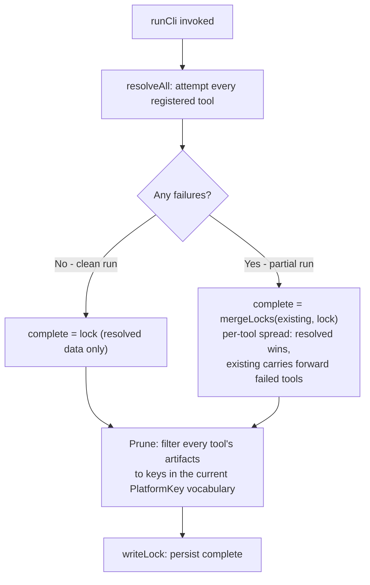
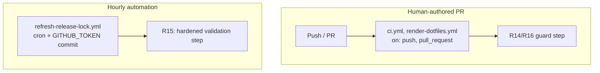

# Windows Release-Lock Purge - Plan

## Goal Capsule

- **Objective:** Purge Windows from the dotfiles release-lock subsystem, its two leftover template gates, README.md, and the omp plugin/MCP catalog - completing the follow-up the 2026-08-05 Windows-drop plan (PR #165) deferred, plus new drift found since.
- **Product authority:** This plan owns the release-lock-subsystem Windows purge described above. CI workflow consolidation, the AppData `.chezmoiignore` regression, and mxm4-haptic's Windows IPC code are not active scope (see How This Work Fits Together).
- **Open blockers:** None.
- **Execution profile:** Source-tree and CI changes (`execution: code`).

---

## Product Contract

### Summary

Purge Windows from the `packages/release-lock` subsystem: `OperatingSystem` collapses to `linux | darwin`, every per-tool Windows asset selector and `emulatedPlatforms` declaration is removed, and a partial-refresh run explicitly prunes retired Windows lock keys instead of merge-preserving them. Two small leftover template gates missed by the original drop, README.md's stale Windows setup instructions, and the omp plugin/MCP catalog's Windows OS-validation get the same treatment. A CI guard stops the structural `.chezmoi.os` conditionals and `PlatformKey` literals from reappearing in the templates, catalog, and code; README stays a manual-review concern (see Scope Boundaries).

### Problem Frame

The 2026-08-05 Windows-drop plan (`docs/plans/2026-08-05-003-refactor-drop-windows-trim-ci-plan.md`, PR #165) removed Windows as a managed chezmoi apply target but explicitly retained the release-lock subsystem's Windows references as a documented follow-up rather than purge them in the same change. Drift has continued since: `run_onchange_after_install-omp-zsh-completion.sh.tmpl` picked up a new `ne .chezmoi.os "windows"` gate in a later, unrelated commit, and README.md still documents a PowerShell bootstrap command and a `30-windows` provisioning script that no longer exists. `.chezmoidata/releases.json` and its resolvers still carry Windows binary keys and branches for every locked tool, none of which chezmoi can apply to any host it manages.

### Key Decisions

- **Full Windows removal from the release-lock type system, not a kept-but-inert union member.** `OperatingSystem` narrows to `linux | darwin` so the compiler enforces completeness against Windows branches reappearing. (session-settled: user-directed - chosen over keeping `OperatingSystem` three-way as a revival hedge: the drop is a permanent commitment, matching the original Windows-drop plan's own framing; a nominal Windows value that always resolves to nothing is worse hygiene than removing it.) Governs R1, R2, R4.
- **This pass covers the release-lock subsystem plus everything else still carrying Windows validation or documentation, not release-lock alone.** Two leftover template gates, the root README, and the omp plugin/MCP catalog's `os:`/`validOS` validation all still assume Windows is reachable; all four ride together since they're small and mechanically similar to the release-lock cleanup. (session-settled: user-directed - chosen over scoping this pass to the release-lock subsystem only: offered as options, the user selected sweeping in the leftover gates, README, and omp-plugin catalog drift.) Governs R9, R10, R11, R12, R13, R14.
- **Retirement pruning ships as an explicit, tested behavior, not an assumed side effect of a clean regeneration.** A clean `release-lock` resolution already prunes retired tools and platforms; a partial resolution (any tool's source fails) does not - `mergeLocks` (`packages/release-lock/src/lock.ts:24`) retains a failed tool's entire prior entry, stale Windows keys included, and nothing today distinguishes "preserve last-good data because the source failed" from "preserve retired-platform data that should never come back." Governs R7, R8.

**Product Contract preservation:** changed - R12 gained a precision fix (no scope change); R14 narrowed to the chezmoi-template/catalog guard it can precisely match; added R15, R16, AE2, and a Scope Boundaries section. `ce-plan` research found the original R14 both under-covered (missed `.chezmoi.toml.tmpl`, and the hourly automation in `.github/workflows/refresh-release-lock.yml` that R7/R8 protect) and over-broadened (a bare `windows-*` match would false-positive against `github-skill-collection.ts`'s unrelated filename-portability guards and against R8's own retirement-pruning test fixtures). R15 hardens that automation's own validation step; R16 is the split-out `PlatformKey`-literal guard, scoped to production code and the generated lock only.

### Requirements

**Release-lock subsystem - type and registry**

- R1. `OperatingSystem` in `packages/release-lock/src/platforms.ts` supports only `linux` and `darwin`. `executableExtension` and `archiveExtension` are deleted (both collapse to one constant value once Windows is gone) and inlined at their call sites; `rustTarget`'s Windows case is removed. `bufArch` and `muslTarget` need no code change: `bufArch`'s existing linux-vs-other ternary already resolves correctly for two OSes, and `muslTarget` delegates to `rustTarget`.
- R2. Every per-tool Windows `asset` branch in `packages/release-lock/src/registry.ts` is removed - including `win32Os` and the Windows-specific asset-name logic for shellcheck, wasm-pack, rust-analyzer, garden, minikube, agent-browser, omp, codegraph, and aoe - along with every `emulatedPlatforms: ["windows-arm64"]` declaration, since the target they emulate no longer exists.
- R3. `registry.test.ts` and `github.test.ts` drop their Windows-specific test cases; remaining coverage exercises only linux/darwin behavior.
- R4. All six `.chezmoiexternals/*.toml` templates that branch on `.chezmoi.os "windows"` today (`ai-agents.toml`, `dev-tools.toml`, `fonts.toml`, `k8s.toml`, `system.toml`, `vcs.toml`) drop their Windows-specific `replace` chains, conditional blocks, and asset-name branches, consistent with R1-R2.
- R5. `packages/release-lock/README.md`'s description of what the subsystem locks (currently "linux, darwin, and windows artifacts") and of the CI entry points that consume the lock (currently describing a PowerShell entry point and Windows jobs in `ci.yml`/`render-dotfiles.yml` that no longer exist) is corrected to describe only Linux/macOS.
- R6. `.chezmoidata/releases.json` is regenerated through the `packages/release-lock` CLI (never hand-edited) after R1-R3 and R7-R8 land, so it carries zero `windows-amd64`/`windows-arm64` keys for any tool.

**Release-lock subsystem - retirement pruning**

- R7. A partial refresh (`runCli` in `packages/release-lock/src/cli.ts`, where one or more tool sources fail) still drops retired Windows platform keys from every tool's `artifacts` map, including a tool whose own source failed this run and whose non-Windows last-good data must otherwise survive unchanged. `mergeLocks` (`lock.ts`) retains a failed tool's entire prior entry verbatim today, so without this, a single transient source failure after R1 lands would leave that tool's stale `windows-*` keys in the committed lock indefinitely.
- R8. Test coverage proves both halves of R7 for a tool whose source fails during a partial refresh: its Linux/macOS artifacts are preserved unchanged, and its stale Windows artifact keys are dropped anyway.

**Leftover template gates**

- R9. `.chezmoi.toml.tmpl`'s `ne .chezmoi.os "windows"` conditional becomes unconditional, and the `$executableExtension`/`$scriptExtension` replace-chains it feeds collapse to their single remaining value.
- R10. `run_onchange_after_install-omp-zsh-completion.sh.tmpl`'s `ne .chezmoi.os "windows"` gate - added after the 2026-08-05 drop - is removed the same way.

**README.md**

- R11. README.md drops Windows from its supported-platform statement (line 4), its bootstrap instructions (the PowerShell `iex` block and the dead `.install-prerequisites.ps1` reference), its OS-native provisioning description (winget, Visual Studio, the deleted `30-windows` VSCodium extensions script, the Task-Scheduler haptic daemon, PowerShell script counterparts), and its prerequisites list (winget, "Windows never sees this prompt"); Linux and macOS coverage stays as-is.

**omp plugin / MCP catalog**

- R12. `.chezmoidata/agents.yaml`'s `h82-dotfiles` marketplace `os:` list narrows from `[linux, darwin, windows]` to `[linux, darwin]`; the `os:` field's documentation comment, the "both provisioners have Windows counterparts" comment, and the comment describing compound-engineering-plugin's Windows special-case in the omp updater are all corrected to match.
- R13. `agent-mcp-servers-json.tmpl`'s and `run_onchange_after_update-omp-plugins.sh.tmpl`'s `$validOS` lists narrow from `list "linux" "darwin" "windows"` to `list "linux" "darwin"` (including the error-message text in the former); the unreachable `(and (eq $os "windows") (eq $market "compound-engineering-plugin"))` branch in the latter is removed.

**Regression guard**

- R14. A CI check fails a pull request if `eq`/`ne .chezmoi.os "windows"` (either token order) reappears in `.chezmoiexternals/*.toml`, `.chezmoiscripts/**`, or `.chezmoi.toml.tmpl`; or if `windows` reappears as an `os:`/`validOS` list value in `.chezmoidata/agents.yaml`, `.chezmoitemplates/agent-mcp-servers-json.tmpl`, or `.chezmoiscripts/70-agents/run_onchange_after_update-omp-plugins.sh.tmpl`.
- R16. A CI check fails a pull request if a `windows-amd64`/`windows-arm64` `PlatformKey` literal reappears in `packages/release-lock/src/` (excluding `github-skill-collection.ts`'s unrelated filename-portability guards) or `.chezmoidata/releases.json`; `packages/release-lock/test/` is exempt, since R8's pruning tests legitimately fixture retired platform keys as input.

**Release-lock subsystem - hourly refresh automation**

- R15. `.github/workflows/refresh-release-lock.yml`'s "Validate lock architecture and sources" step narrows its `supported` `PlatformKey` allow-list from eight entries to the six surviving ones, dropping `windows-amd64`/`windows-arm64`. Its emulation-guard check - which rejects any `emulated: true` entry under a linux/darwin key - and its "emulation is only ever an explicit Windows resolution" comment are removed: `emulatedPlatforms` is a general, OS-agnostic mechanism (`packages/release-lock/README.md`, `github.ts`'s `resolveGitHubRelease`) a future tool may legitimately use for a non-Windows target, so a Windows-specific restriction was never architecturally justified.

### Acceptance Examples

- AE1. **Covers R7, R8.** Given a committed lock where every tool's `artifacts` map has already been purged of `windows-*` keys except tool `foo`, which still carries a stale `windows-amd64` entry. When a scheduled refresh runs and `foo`'s upstream source fails to resolve (e.g., rate-limited) while every other tool succeeds. Then the refreshed lock keeps `foo`'s existing Linux/macOS artifacts unchanged, drops `foo`'s stale `windows-amd64` key, and every other tool reflects its freshly resolved data.
- AE2. **Covers R7, R8.** Given a committed lock where a tool has no Windows keys at all - a version-only tool with no `artifacts` field, or a tool already fully pruned. When that tool's source fails during a refresh. Then its entry survives byte-identical: no `artifacts: {}` is synthesized, and no unrelated field (`version`, `kind`, `source`, `integrity`) changes.

### Scope Boundaries

- `packages/release-lock/src/github-skill-collection.ts`'s `WINDOWS_RESERVED`/`WINDOWS_INVALID` filename-portability guards - used to validate untrusted upstream Git tree paths on any filesystem - are unrelated to `OperatingSystem`/`PlatformKey` targeting. R2 does not touch them and R16 does not scan for them.
- Whole-tool retirement during a partial refresh (a tool removed from the registry entirely, coinciding with another tool's source failure on the same run) is a separate, pre-existing, currently-unexercised gap in `mergeLocks`. R7/R8 fix platform-key pruning within a tool that remains in the registry; no tool leaves the registry in this plan, so that gap stays out of scope here.
- Root `README.md`'s Windows-free state relies on ordinary PR review, not the mechanical CI guard (R14/R16): prose has no literal, low-false-positive pattern to match, unlike the structural `.chezmoi.os` conditionals and `PlatformKey` literals R14/R16 scan for.
- `.chezmoiscripts/30-linux/run_onchange_after_install-vscodium-extensions.sh.tmpl:8-9` has a comment describing "The Windows half is the PowerShell counterpart in 30-windows" - `30-windows` was deleted by the 2026-08-05 drop, so this comment is stale. It is prose-only (no functional gate) and outside every named requirement's file list; left as a follow-up rather than added here, consistent with `ce-plan`'s anti-expansion rule for tangential findings.

---

<!-- ce-section: work-relationships -->
## How This Work Fits Together

This plan owns the Windows purge of the release-lock subsystem, its two leftover template gates, README.md, and the omp plugin/MCP catalog. The broader breakdown below is the current understanding, not a committed roadmap.

- CI workflow consolidation (merging `ci.yml` and `render-dotfiles.yml` into fewer jobs) - `Can proceed independently of` this plan; the other item the 2026-08-05 Windows-drop plan deferred (its Outstanding Question OQ2).
- The `.chezmoiignore` AppData regression (VSCodium settings deploying to the wrong OS) - `Can proceed independently of` this plan; a live bug found during this brainstorm's investigation, fixed directly outside this plan rather than as a requirement here.
- mxm4-haptic's compiled Windows IPC support (`#[cfg(windows)]`, `windows-sys` dependency) - `Can proceed independently of` this plan; real product code on a now-unreachable platform, a separate call if the Rust crate is ever revisited.

---

## Planning Contract

### Key Technical Decisions

- KTD1. **Prune by vocabulary membership, not by matching the literal string "windows".** Filter every tool's `artifacts` map to keys present in `platforms.ts`'s current `ALL_PLATFORMS`/`MUSL_PLATFORMS` (via `platformKey()`), not by pattern-matching a `windows-` prefix. A key can only exist in `artifacts` because some past version of the resolver emitted it, so "outside today's vocabulary" and "retired" are the same predicate for a platform that is gone for good - this generalizes to any future platform retirement without a repeat patch, and treats an `emulated: true` key identically to a non-emulated one. (A platform temporarily removed and later re-added is a different, out-of-scope case this predicate does not need to solve, since Windows is not coming back.) Cites R7, R8.
- KTD2. **Prune as a post-merge filter over `complete`, not inside `mergeLocks`.** Apply the filter to the final merged value in `runCli`, after computing `complete`, rather than changing `mergeLocks`'s signature or behavior. This is a no-op on a clean run (resolved data already excludes retired keys) and leaves `mergeLocks`'s existing, tested per-tool-spread contract - including `lock.test.ts`'s "a tool missing from the resolution keeps its committed entry" - untouched. Cites R7, R8.
- KTD3. **Two independent CI guard mechanisms, not one.** R14/R16's PR-facing grep and R15's hardened `refresh-release-lock.yml` validation step are separate because that workflow's `GITHUB_TOKEN`-authored direct push (`git push origin HEAD:"${GITHUB_REF_NAME}"`, not a pull request) does not trigger `ci.yml`'s or `render-dotfiles.yml`'s `on: push` runs (GitHub suppresses `on: push` events authored by `GITHUB_TOKEN`) - a guard living only in those two workflows would never see the hourly automation's own commits, exactly the channel most likely to reintroduce a stale key if KTD1/KTD2's pruning logic itself regresses. Cites R14, R15, R16.
- KTD4. **`packages/release-lock/test/` is exempt from R16's `PlatformKey`-literal match.** R8's pruning tests must fixture retired keys (e.g. a stale `windows-amd64` entry) as legitimate input proving they get removed; a guard that can't tell "production code producing a windows key" from "a test proving windows keys get deleted" would fail on its own regression tests. Cites R16.
- KTD5. **Land all of U1-U9 in one PR, not staged across the TypeScript and chezmoi-template halves.** A staged split (release-lock code first, templates/CI guard second) is technically safe in isolation: stale Windows branches in unstaged templates stay inert since `.chezmoi.os` is never literally `"windows"` on a real host, and the six-vs-eight-key allowlist tolerates either landing order. The reason to keep one PR is coordination cost, not correctness risk: this repo's established pattern for same-class removals lands source, data, and gate changes together so CI reflects the finished state in one review pass, and R14/R16's own guard needs the fully-cleaned tree to pass (U9's dependency list already requires U1-U8). Within the PR, land R1/R2 and R6's regeneration before R15's narrowed allowlist, so neither validation step ever runs against data its own code can no longer produce.
- KTD6. **Dead code follows the removal, not just Windows branches.** `win32Os` (`registry.ts`) becomes an identity function once no OS needs win32 spelling translation - delete it and inline its two call sites (agent-browser, codegraph), per this repo's established no-orphan-helper convention. `docker-credential-helpers`' asset selector (`registry.ts:133`) has an *implicit* Windows branch via ternary elimination (`os === "linux" ? ... : os === "darwin" ? ... : "wincred"`) with no literal `"windows"` string - collapse it to a plain two-way ternary; a naive grep-based removal pass would miss this one. Cites R2.
- KTD7. **The emulation-guard's Windows-only restriction was incorrect, not merely dead code.** `emulatedPlatforms` is documented (`packages/release-lock/README.md`) and implemented (`github.ts`'s `resolveGitHubRelease`, which iterates every platform including linux/darwin and checks `emulated.has(key)` generically) as an OS-agnostic mechanism: any target upstream doesn't build can borrow its same-OS amd64 artifact. The workflow's check rejecting `emulated: true` on any linux/darwin key encoded a narrower, Windows-specific assumption the mechanism never actually had - removing it corrects that over-restriction, not dead code. No replacement check is added: zero tools currently declare `emulatedPlatforms`, and a speculative future-emulation validator is out of this plan's scope. Cites R15.
- KTD8. **`executableExtension` and `archiveExtension` are deleted, not left as always-return-the-same-value wrappers.** Once `OperatingSystem` narrows, both helpers would ignore their `os` parameter and always return one value (`""` and `".tar.gz"`), which `vp check`'s lint flags as an unused parameter. Delete both exports and inline their literal at each call site (`executableExtension`: docker-credential-helpers, agent-browser, omp - 3 sites; `archiveExtension`: buf, chezmoi, uv, garden, codegraph - 5 sites) rather than keep a same-output wrapper. Cites R1.

### High-Level Technical Design

**Merge and prune flow.** The pruning filter (KTD1, KTD2) applies uniformly after the existing clean/partial branch, not as a third branch:

**CI guard dual-path.** R14/R16 and R15 guard two independently-triggered paths (KTD3):

A `GITHUB_TOKEN`-authored direct push from `refresh-release-lock.yml` does not trigger `ci.yml`'s or `render-dotfiles.yml`'s `on: push` - the two paths never cross, so each needs its own guard.

### Assumptions

- `vp` (Vite-Plus) is the sole toolchain for `packages/` - no Biome, ESLint, or Prettier config exists in the tree.
- Regenerating `.chezmoidata/releases.json` (U4) requires live network access to every resolver source the registry declares - GitHub API via `GITHUB_TOKEN`/`CHEZMOI_GITHUB_ACCESS_TOKEN`, plus GitLab and per-tool vendor endpoints such as winbox's - not GitHub alone, matching how `refresh-release-lock.yml` already operates hourly.

---

## Implementation Units

### U1. Narrow the release-lock type and registry

- **Goal:** Remove Windows from the type system and every per-tool asset selector.
- **Requirements:** R1, R2.
- **Files:** `packages/release-lock/src/platforms.ts`, `packages/release-lock/src/registry.ts`, `packages/release-lock/src/github.ts` (stale comment only), `.chezmoitemplates/release-lock-ref.tmpl` (stale doc-comment example only).
- **Approach:**
  1. In `platforms.ts`, narrow `OPERATING_SYSTEMS` to `["linux", "darwin"]`. Delete `executableExtension` and `archiveExtension` per KTD8, inlining their literal at each call site. Remove the Windows case from `rustTarget`. Correct `bufArch`'s doc comment (drops "and windows"; the code itself needs no change).
  2. In `registry.ts`, delete `win32Os` and inline its two call sites (agent-browser, codegraph) per KTD6.
  3. Remove the Windows case from the `marksman` switch; collapse the `shellcheck`, `rust-analyzer`, and `aoe` ternaries to their single remaining branch.
  4. Collapse `docker-credential-helpers`' implicit ternary-elimination branch (`registry.ts:133`) to a plain linux/darwin ternary per KTD6.
  5. Remove every `emulatedPlatforms: ["windows-arm64"]` declaration (wasm-pack, garden, minikube, agent-browser) and `omp`'s `windows-arm64 -> null` branch.
  6. Fix `github.ts`'s doc comment ("a linux runner can lock darwin and windows entries from the same response" - drop "and windows") and `release-lock-ref.tmpl`'s doc-comment platform-key example (drop the now-invalid `"windows-arm64"` example, e.g. use `"darwin-arm64"`).
- **Patterns to follow:** KTD6 (dead-code and implicit-branch removal).
- **Test scenarios:** `Test expectation: none directly -- covered by U2's updated registry.test.ts/github.test.ts, which exercise every selector this unit changes.`
- **Verification:** `vp run -r typecheck` passes (a stray Windows branch referencing the removed `OperatingSystem` member fails to compile).

### U2. Update release-lock tests for the narrowed platform set

- **Goal:** Bring test coverage in line with the two-platform registry.
- **Requirements:** R3.
- **Dependencies:** U1.
- **Files:** `packages/release-lock/test/registry.test.ts`, `packages/release-lock/test/github.test.ts`.
- **Approach:**
  1. In `registry.test.ts`'s `EXPECTED` table, remove the `windows-amd64`/`windows-arm64` rows (and their explanatory comments) from all 18 tools. The `covers exactly the spec's target platforms` assertion and the per-key test loop need no logic changes - both already derive from `ALL_PLATFORMS`/`MUSL_PLATFORMS`.
  2. In `github.test.ts`, change the "records url and digest for every targeted platform" test's `toHaveLength(6)` to `toHaveLength(4)` and remove its two Windows `asset()` stubs.
  3. Rewrite the "a declared emulated platform borrows the amd64 artifact and is marked" test against a synthetic non-Windows emulated case (it already uses a fake `spec()`, not a real registry entry, so no real tool's behavior is affected).
- **Test scenarios:**
  - Every remaining `registry.test.ts` assertion passes with 4 platforms per tool (6 for `linuxMusl` tools).
  - `github.test.ts`'s emulation test still proves borrowing behavior, now against a non-Windows synthetic platform pair.
  - Zero `"windows"` literal remains in either test file.
- **Verification:** `vp run -r test`.

### U3. Retirement pruning on partial refresh

- **Goal:** Make partial-refresh runs prune retired platform keys instead of carrying them forward forever.
- **Requirements:** R7, R8. Covers AE1, AE2.
- **Dependencies:** U1 (the vocabulary filter reads the narrowed `OPERATING_SYSTEMS`).
- **Files:** `packages/release-lock/src/lock.ts` (new pruning helper, alongside `mergeLocks`), `packages/release-lock/src/cli.ts` (`runCli` calls it), `packages/release-lock/test/lock.test.ts`, `packages/release-lock/test/cli.test.ts`.
- **Approach:** Implement KTD1/KTD2 as a new pruning function in `lock.ts`, invoked from `runCli` (`cli.ts`) after computing `complete`: filter every tool's `artifacts` map to keys present in the canonical `PlatformKey` set (`ALL_PLATFORMS`/`MUSL_PLATFORMS` via `platformKey()`). A tool with no `artifacts` field is left untouched - never synthesize `artifacts: {}`. Do not mutate `version`/`kind`/`source`/`integrity` on any tool.
- **Patterns to follow:** `registry.test.ts`'s own canonical-key-set pattern (`new Map([...ALL_PLATFORMS, ...MUSL_PLATFORMS].map((p) => [platformKey(p), p]))`).
- **Test scenarios (`lock.test.ts`, alongside the existing "a tool missing from the resolution keeps its committed entry"):**
  - Covers AE1. A tool missing from resolution whose committed entry has a stale `windows-amd64` key: the pruned result keeps its Linux/macOS artifacts unchanged and drops the `windows-amd64` key.
  - Covers AE2. A tool missing from resolution with no `artifacts` field at all (a version-only tool): the pruned result is byte-identical to its prior entry.
  - A tool missing from resolution whose stale key carries `emulated: true`: it is dropped identically to a non-emulated key (using synthetic fixture data, since no surviving tool has a non-Windows emulated entry).
  - A tool present in `resolved` this run: pruning is a no-op beyond the normal overwrite.
  - Idempotency: pruning an already-pruned lock a second time produces a byte-identical result.
- **Test scenarios (`cli.test.ts`, alongside the existing "a clean default refresh prunes retired entries"):**
  - Covers AE1, through `runCli`. One tool's fetch stubbed to fail while its committed lock carries a stale `windows-amd64` key and another tool succeeds: the written lock has the failed tool's stale key pruned and its other data intact.
- **Verification:** `vp run -r test`.

### U4. Regenerate the committed lock

- **Goal:** Produce a Windows-free `.chezmoidata/releases.json` through the CLI, never by hand.
- **Requirements:** R6.
- **Dependencies:** U1, U2, U3.
- **Files:** `.chezmoidata/releases.json` (generated).
- **Approach:** Run the release-lock CLI with live network access per `packages/release-lock/README.md`'s documented usage. Require a clean (zero-failure) run - reject and retry rather than accept a partial/merged result, matching this repo's established "a clean resolution is authoritative" precedent. Inspect the resulting diff to confirm it shows only `windows-*` key removal plus ordinary incidental upstream version movement, not an unexplained mass change.
- **Test scenarios:** `Test expectation: none -- generated data; correctness is proved by U1-U3's own tests plus the diff inspection above.`
- **Verification:** CLI exits 0; `grep -i windows .chezmoidata/releases.json` returns nothing.

### U5. Leftover template gates

- **Goal:** Collapse the two stray `.chezmoi.os "windows"` gates the original drop missed.
- **Requirements:** R9, R10.
- **Files:** `.chezmoi.toml.tmpl`, `.chezmoiscripts/70-agents/run_onchange_after_install-omp-zsh-completion.sh.tmpl`.
- **Approach:** In each file, remove the `ne .chezmoi.os "windows"` conditional wrapper so the guarded content is unconditional. In `.chezmoi.toml.tmpl`, collapse the `$executableExtension`/`$scriptExtension` `replace` chains to their single remaining literal value, and correct its "Windows and containers never decrypt" comment (drops "Windows and", since Windows can no longer be a target at all). In `run_onchange_after_install-omp-zsh-completion.sh.tmpl`, drop the "Windows-gated out because..." clause from the after-phase comment, since there is no longer a gate to explain.
- **Patterns to follow:** the original Windows-drop plan's own gate-collapse units.
- **Test scenarios:** `.chezmoi.toml.tmpl` renders identically for linux and darwin hosts before and after, except the two corrected comments (isolated `execute-template` diff); `.ci/test-omp-zsh-completion.sh` passes unchanged.
- **Verification:** `.ci/test-omp-zsh-completion.sh`; isolated scratch stub-op `execute-template` render.

### U6. Purge Windows branches from `.chezmoiexternals`

- **Goal:** Remove every Windows-specific branch across the six externals templates.
- **Requirements:** R4.
- **Files:** `.chezmoiexternals/ai-agents.toml`, `dev-tools.toml`, `fonts.toml`, `k8s.toml`, `system.toml`, `vcs.toml`.
- **Approach:** Per file, remove the Windows-specific `replace` chain arm, conditional block, or asset-name branch: `ai-agents.toml`'s `$codegraphWindowsTarget` block and the `ne .chezmoi.os "windows"` gates around aoe/the glab skill-collection block; `dev-tools.toml`'s buf-zsh-completion/marksman/shellcheck/rust-analyzer/uv Windows branches; `fonts.toml`'s `$userFontDir` Windows arm; `k8s.toml`'s `$executableExtension`/`$archiveExtension` chains; `system.toml`'s `docker-credential-wincred` block, `prezto`'s Windows gate, and WinBox's `else if eq .chezmoi.os "windows"` branch (the `WinBox_Windows[_arm64].zip` asset selection and its Windows-specific archive-file external); `vcs.toml`'s `$archiveExtension`/`stripComponents`/glab Windows branches and `garden`'s `$gardenOperatingSystem` arm.
- **Test scenarios:** isolated `execute-template` render for linux and darwin produces byte-identical output to the pre-change render for both OSes, across all six files; zero `"windows"` string remains in any of them.
- **Verification:** `render-dotfiles.yml`'s render-internals job; local scratch stub-op recipe.

### U7. omp plugin / MCP catalog

- **Goal:** Narrow OS validation and correct stale comments across the catalog.
- **Requirements:** R12, R13.
- **Files:** `.chezmoidata/agents.yaml`, `.chezmoitemplates/agent-mcp-servers-json.tmpl`, `.chezmoitemplates/compound-engineering-ref.tmpl` (stale comment only), `.chezmoiscripts/70-agents/run_onchange_after_update-omp-plugins.sh.tmpl`.
- **Approach:** In `agents.yaml`, narrow the `h82-dotfiles` marketplace `os:` list to `[linux, darwin]` and correct its doc-comment, the "both provisioners have Windows counterparts" comment, and the compound-engineering-plugin Windows-special-case comment. In `agent-mcp-servers-json.tmpl`, narrow `$validOS` and its error-message text. In `run_onchange_after_update-omp-plugins.sh.tmpl`, narrow `$validOS` and simplify the unreachable `(or (has $os $marketOS) (and (eq $os "windows") (eq $market "compound-engineering-plugin")))` condition to `(has $os $marketOS)`. Drop `compound-engineering-ref.tmpl`'s matching "(the omp updater carries a Windows special-case for this marketplace)" parenthetical, which describes the same now-removed branch.
- **Test scenarios:** `.ci/test-omp-agent-reconcile.sh` passes unchanged; isolated `execute-template` render of `agent-mcp-servers-json.tmpl` and `compound-engineering-ref.tmpl` for linux/darwin is unchanged; zero `"windows"` string remains in any of the four files.
- **Verification:** `.ci/test-omp-agent-reconcile.sh`; isolated scratch stub-op render.

### U8. README.md and the release-lock README

- **Goal:** Bring both READMEs' documented platform support in line with reality.
- **Requirements:** R5, R11.
- **Files:** `README.md`, `packages/release-lock/README.md`.
- **Approach:** In root `README.md`, remove Windows from the supported-platform statement, the PowerShell bootstrap block, the dead `.install-prerequisites.ps1` reference, the OS-native provisioning bullet's Windows sub-items, and the prerequisites list's winget/Windows mentions. In `packages/release-lock/README.md`, correct the "linux, darwin, and windows artifacts" line and the description of CI entry points (drop the PowerShell entry point and the Windows `render-dotfiles.yml` job, both already gone).
- **Test scenarios:** `Test expectation: none -- documentation only.` A case-insensitive grep for `windows|powershell|winget` across both files returns nothing.
- **Verification:** grep sweep.

### U9. Regression guard and hourly-automation hardening

- **Goal:** Make the Windows purge self-enforcing on both the PR path and the hourly automation path.
- **Requirements:** R14, R15, R16.
- **Dependencies:** U1, U4, U5, U6, U7, U8 (the guard must pass against the fully-cleaned tree it lands alongside, per KTD5).
- **Files:** `.github/workflows/render-dotfiles.yml` (its existing `shellcheck` job), `.github/workflows/refresh-release-lock.yml`.
- **Approach:**
  1. In `refresh-release-lock.yml`'s "Validate lock architecture and sources" step, narrow `supported` from eight `PlatformKey` entries to six (drop `windows-amd64`, `windows-arm64`); delete the emulation-guard block (lines checking `.emulated == true` against linux/darwin keys) and its "emulation is only ever an explicit Windows resolution" comment, since `emulatedPlatforms` is OS-agnostic and the check was never architecturally correct (R15).
  2. Add a new guard step to `render-dotfiles.yml`'s existing `shellcheck` job that fails if `eq`/`ne .chezmoi.os "windows"` (either token order) reappears in `.chezmoiexternals/*.toml`, `.chezmoiscripts/**`, or `.chezmoi.toml.tmpl`, or if `windows` reappears as an `os:`/`validOS` list value in `.chezmoidata/agents.yaml`, `.chezmoitemplates/agent-mcp-servers-json.tmpl`, or `run_onchange_after_update-omp-plugins.sh.tmpl` (R14); and a step (or the same step) that fails if a `windows-amd64`/`windows-arm64` literal reappears in `packages/release-lock/src/` (excluding `github-skill-collection.ts`) or `.chezmoidata/releases.json`, explicitly skipping `packages/release-lock/test/` per KTD4 (R16).
- **Test scenarios:**
  - The new guard step fails when a synthetic `ne .chezmoi.os "windows"` line is reintroduced into a scratch copy of any R14-scanned file.
  - The new guard step also fails when a synthetic `ne "windows" .chezmoi.os` line (reversed token order, matching `ai-agents.toml`'s existing `aoe` gate style) is reintroduced.
  - The new guard step fails when a synthetic `windows-amd64` literal is reintroduced into a scratch copy of `registry.ts` or `.chezmoidata/releases.json`.
  - The new guard step does **not** fail against `github-skill-collection.ts`'s existing `WINDOWS_RESERVED`/`WINDOWS_INVALID` constants, or against `lock.test.ts`/`cli.test.ts`'s retirement-pruning fixtures.
  - `refresh-release-lock.yml`'s hardened validation step fails a synthetic run whose resolved lock still contains a `windows-*` key.
- **Verification:** synthetic reintroduction per the scenarios above, on a scratch copy; `ci.yml`/`render-dotfiles.yml` YAML stays valid.

---

## Verification Contract

| Gate | Command / method | Applicability |
|---|---|---|
| Build | `vp run -r build` (from `packages/`) | U1-U4 |
| Typecheck | `vp run -r typecheck` (from `packages/`) | U1-U4 |
| Unit tests | `vp run -r test` (from `packages/`) | U1-U4 |
| Full check | `vp check` (from `packages/`) | U1-U4, U9 |
| Chezmoi render (local) | scratch stub-op `execute-template` recipe (AGENTS.md) | U5, U6, U7 |
| Chezmoi render (CI) | `render-dotfiles.yml` apply + render-internals jobs | U5, U6, U7 |
| Leftover-gate scripts | `.ci/test-omp-zsh-completion.sh`, `.ci/test-omp-agent-reconcile.sh` | U5, U7 |
| Documentation sweep | `grep -riE "windows\|powershell\|winget"` across `README.md`, `packages/release-lock/README.md` | U8 |
| Guard self-test | synthetic reintroduction on a scratch copy (see U9 test scenarios) | U9 |
| CI green | `ci.yml`, `render-dotfiles.yml` terminal success after push | All |

---

## Definition of Done

- Zero `windows` references (case-insensitive) remain in `packages/release-lock/src` (excluding `github-skill-collection.ts` entirely, per Scope Boundaries), `.chezmoiexternals/*.toml`, `.chezmoidata/agents.yaml`, `.chezmoitemplates/agent-mcp-servers-json.tmpl`, `.chezmoidata/releases.json`, `README.md`, `packages/release-lock/README.md`, and `.github/workflows/refresh-release-lock.yml`.
- Zero `eq`/`ne .chezmoi.os "windows"` conditionals (R14's pattern) remain in `.chezmoiscripts/**` or `.chezmoi.toml.tmpl`. Unrelated prose mentioning "Windows" elsewhere in `.chezmoiscripts/**` (e.g. explaining why a Linux-only script has no Windows equivalent) is untouched and out of scope - see Scope Boundaries.
- `vp run -r build`, `vp run -r typecheck`, `vp run -r test`, and `vp check` all pass from `packages/`.
- `ci.yml` and `render-dotfiles.yml` reach terminal green after push.
- The R14/R16 guard step and R15's hardened validation are each proven to fail against a synthetic reintroduction (U9), then left in their passing state against the clean tree.
- No abandoned or experimental pruning approach remains in the diff.

| Unit | Done signal |
|---|---|
| U1 | `vp run -r typecheck` passes; zero `"windows"` literal in `platforms.ts`/`registry.ts` |
| U2 | `vp run -r test` passes; both test files assert exactly 4 platforms per tool (6 for `linuxMusl` tools) |
| U3 | AE1, AE2, the emulated-key case, and the idempotency case pass in `lock.test.ts`; the `runCli`-level case passes in `cli.test.ts` |
| U4 | `.chezmoidata/releases.json` has zero `windows-*` keys; regeneration diff reviewed as windows-only plus incidental version bumps |
| U5 | `.ci/test-omp-zsh-completion.sh` passes; `.chezmoi.toml.tmpl` renders identically pre/post |
| U6 | `render-dotfiles.yml`'s render-internals job passes; zero `"windows"` literal in the six externals files |
| U7 | `.ci/test-omp-agent-reconcile.sh` passes; `agent-mcp-servers-json.tmpl` renders identically pre/post |
| U8 | grep sweep of both READMEs returns zero windows/PowerShell/winget hits |
| U9 | guard step fails on synthetic reintroduction, passes on the clean tree; `refresh-release-lock.yml`'s validation step passes with the six-key allowlist |

---

## Sources / Research

- `docs/plans/2026-08-05-003-refactor-drop-windows-trim-ci-plan.md` - the Windows-drop plan (PR #165) this work continues; its Scope Boundaries explicitly retained release-subsystem Windows references as a documented follow-up (KTD1 there: "Purging it is a follow-up").
- `packages/release-lock/src/{platforms,registry,cli,lock,types,resolve-all}.ts` - the subsystem U1-U3 purge and harden.
- `packages/release-lock/test/{registry,github,lock,cli}.test.ts` - existing coverage U2/U3 extend; anchor tests "a tool missing from the resolution keeps its committed entry" (`lock.test.ts`) and "a clean default refresh prunes retired entries" (`cli.test.ts`).
- `.chezmoiexternals/{ai-agents,dev-tools,fonts,k8s,system,vcs}.toml` - the six externals templates U6 covers.
- `.github/workflows/refresh-release-lock.yml` - the hourly production automation U9/R15 hardens.
- `packages/README.md`, `packages/package.json`, `.github/workflows/ci.yml` (`ts-workspace` job) - the `vp`-based build/typecheck/test/check command sequence used throughout the Verification Contract.
- Issues [#103](https://github.com/hyperlapse122/dotfiles/issues/103), [#104](https://github.com/hyperlapse122/dotfiles/issues/104), [#106](https://github.com/hyperlapse122/dotfiles/issues/106) (closed, via PR #107 and PR #111) - prior findings against this exact `cli.ts`/`lock.ts`/`registry.ts` surface: untested dispatch/carry-forward shape, untested selector byte-parity, and procedural (now structural) refresh carry-forward. `registry.test.ts`'s `EXPECTED` table and `lock.ts`'s `mergeLocks` are the landed fixes U2/U3 build on.
- `docs/plans/2026-07-30-008-chore-remove-playwright-cli-skill-plan.md` (KTD3) and `docs/plans/2026-07-30-004-chore-unmanage-legacy-agent-harnesses-plan.md` (A2, U6) - precedent for "a clean resolution is authoritative and prunes retired keys; a partial resolution is not acceptable proof" (U4) and the no-orphan-helper convention (KTD6).
- `docs/residual-review-findings/chore-unmanage-legacy-agent-harnesses.md` - two unlinked residual findings inside `ai-agents.toml`'s Windows branch, resolved as a side effect of U6's deletion.
