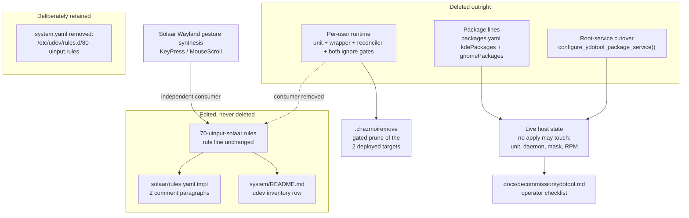

# Remove ydotool provisioning - Plan

## Goal Capsule

- **Objective:** Delete `ydotool` from the chezmoi source state — the Fedora package entries, the root-service cutover in the Fedora installer, and the managed per-user runtime (systemd user unit, active-seat wrapper, reconciler script) together with the two gate files that exist only to serve it: its `.chezmoiignore` block and the now-orphaned nested `dot_local/libexec/.chezmoiignore`. Prune the two already-deployed targets through `.chezmoiremove`, reattribute the shared `/dev/uinput` grant to Solaar (its only remaining consumer), and hand the operator a checklist for the live state no apply may touch: an enabled user unit, a running daemon, a masked system unit, and an installed package.
- **Product authority:** The user's request governs scope. The root `AGENTS.md` governs chezmoi source attributes, the single-source-of-truth data files, the no-teardown-script rule, and the isolated verification harness.
- **Execution profile:** A bounded deletion across four layers, one prune manifest entry pair, and prose reattribution in three files. Verification is isolated rendering under a stub `op` and a repository-wide reference sweep. Never apply the source state to live `$HOME`, and never stop a live service from a script.
- **Stop conditions:** Stop if any deletion would strand a live consumer — in particular, stop if the `/dev/uinput` udev rule turns out to have no consumer left besides ydotoold, because deleting the rule would silently break Solaar's Wayland gesture synthesis. Stop if a proposed prune would delete a path chezmoi never deployed.
- **Tail ownership:** Local proof is the isolated render matrix over the Fedora desktop and headless fact shapes plus the grep sweep. Two legs are not locally renderable and are owned by CI on the pull request: Darwin (`render-dotfiles.yml`'s `apply-macos` job) and the container shape (its containerized `apply` job) — see KTD6. CI also owns final `ci.yml` proof. The host-local steps in `docs/decommission/ydotool.md` are the operator's; this run writes them and never performs them.

---

## Product Contract

### Summary

Remove the `ydotool` capability this repository added on 2026-07-31. Nine source locations lose ydotool content outright — including `dot_local/libexec/`, whose only remaining file after the wrapper goes is a nested `.chezmoiignore` describing launch wrappers that were removed months ago. Three files keep their content and lose only a cross-reference. `system/linux/etc/udev/rules.d/70-uinput-solaar.rules` survives untouched at the rule level because Solaar — not ydotoold — is why it exists. `.chezmoiremove` prunes the two already-deployed targets so every host converges without operator action. What chezmoi must never do — stop a live daemon, unmask a system unit, remove an RPM — is handed to the operator as a checklist under `docs/decommission/`.

### Problem Frame

`ydotool` was provisioned as a four-layer Fedora-only subsystem:

1. **Package** — one `- ydotool` line each in `.chezmoidata/packages.yaml`'s `kdePackages:` and `gnomePackages:` groups.
2. **Root-daemon neutralization** — `configure_ydotool_package_service()` in the Fedora installer, which stops and masks the package's own root `ydotool.service` so it cannot race the per-user runtime for `/dev/uinput`.
3. **Managed per-user runtime** — `dot_config/systemd/user/ydotool.service`, the active-seat wrapper `dot_local/libexec/executable_ydotoold-active-seat`, and the reconciler `.chezmoiscripts/30-linux/run_after_config-ydotool.sh.tmpl`, gated together by one `.chezmoiignore` block.
4. **Access policy** — the active-seat `TAG+="uaccess"` grant on `/dev/uinput`.

Nothing in the repository ever invokes the `ydotool` client binary. The managed runtime only supervises the `ydotoold` daemon, so layers 1–3 have no consumer once they are gone.

Layer 4 is the trap. The grant predates ydotool and belongs to Solaar: under Wayland, Solaar's MX Master gesture rules synthesize `KeyPress` (Super+Left/Right tiling) and `MouseScroll` through evdev uinput, and `logitech_receiver/diversion.py` requires user write access to `/dev/uinput` to do it. The rule, its `system/README.md` inventory row, and two comment paragraphs in `dot_config/solaar/rules.yaml.tmpl` were all rewritten in 2026-07 to describe *two* consumers. Deleting the rule would break Solaar silently; leaving the prose unchanged would leave the repository documenting a daemon that no longer exists.

The second trap is live state. Deleting a source stops chezmoi managing its target but never deletes the target, stops a service, or removes a package. On a provisioned host that leaves an enabled user unit, a running `ydotoold` holding `/dev/uinput`, a masked root `ydotool.service`, and an installed RPM. `.chezmoiremove` reclaims the two deployed files; the rest is operator work by policy, because this repository adds no teardown scripts.

Two removal mechanics are already settled by prior work and must not be re-litigated. First, the CI surface is already gone: `docs/plans/2026-08-05-003-refactor-drop-windows-trim-ci-plan.md` R7 retired the `ydotool-integration` job and `.ci/test-ydotool-integration.sh`, and neither exists in the tree. Second, the Ubuntu half of the original plan (KTD1/KTD4) never landed — `.chezmoiscripts/40-linux-ubuntu/` does not exist — so there is no Ubuntu-side removal to perform.

### Requirements

**Managed per-user runtime**

- R1. `dot_config/systemd/user/ydotool.service` is deleted. The five sibling units in that directory are byte-identical.
- R2. `dot_local/libexec/` is deleted in full — both `executable_ydotoold-active-seat` and the nested `.chezmoiignore`, whose only stated purpose is gating "aoe launch wrappers under libexec" that no longer exist, on a platform the repository no longer manages.
- R3. `.chezmoiscripts/30-linux/run_after_config-ydotool.sh.tmpl` is deleted. The ten sibling scripts in that directory are byte-identical.
- R4. The `.chezmoiignore` ydotool block — its eight-line comment, the `{{- if not (and …) }}` guard, the three ignored paths, and the matching `{{- end }}` — is deleted in full. The kitty/wezterm block above it and the `crates`/`packages` block below it are byte-identical.

**Package set and Fedora installer**

- R5. Neither `kdePackages:` nor `gnomePackages:` in `.chezmoidata/packages.yaml` lists `ydotool`. Each group keeps its four remaining entries and every surrounding gate comment byte-identical; no group is left empty.
- R6. `configure_ydotool_package_service()`, the explanatory comment block above it, and its call site between `install_fedora_packages` and `install_nvidia_support` are deleted from `.chezmoiscripts/20-linux-fedora/run_onchange_before_fedora.sh.tmpl`.
- R7. `HAS_KDE` and `HAS_GNOME` survive in that installer, still seeded from their `fact_gate` calls and still gating the `kdePackages`/`gnomePackages` install blocks. They do not become dead code and must not be removed.

**Shared `/dev/uinput` grant (edit, never delete)**

- R8. `system/linux/etc/udev/rules.d/70-uinput-solaar.rules` keeps its filename and its `KERNEL=="uinput" …` rule line byte-identical. Only its header prose changes, to name Solaar as the sole consumer. The `< 73` ordering rationale, the `static_node=uinput` note, and the `setfacl` first-install note are preserved.
- R9. `dot_config/solaar/rules.yaml.tmpl` keeps every YAML rule document byte-identical. Only the two comment paragraphs that cross-reference ydotoold change: the file header, and the GNOME edge-tiling paragraph.
- R10. The `etc/udev/rules.d/` row in `system/README.md` attributes the active-seat `/dev/uinput` grant to Solaar alone.

**Deliberately retained**

- R11. The `removed:` reclamation entry for `/etc/udev/rules.d/80-uinput.rules` in `.chezmoidata/system.yaml`, with its comment, is retained unchanged. It is one of the two sanctioned surviving occurrences of the string outside documentation — the other is `.chezmoiremove` (R15) — and R14 exempts both by name.

**Deployed-target prune and operator handoff**

- R12. `docs/decommission/ydotool.md` exists and covers what no apply may do: stopping and disabling the user unit, confirming `/dev/uinput` is actually released, removing the RPM, and clearing the leftover mask. It leads with the stop-and-disable-before-apply ordering and why that ordering is load-bearing (KTD1a), warns that the pruned paths are widely hand-authored, has the operator confirm the prune actually fired, gives a fallback for a daemon that does not release the device on stop, and states that a future reinstall will not be re-masked.
- R13. The change adds no teardown or revert script.
- R15. `.chezmoiremove` prunes the two already-deployed targets — `.config/systemd/user/ydotool.service` and `.local/libexec/ydotoold-active-seat` — under the same fact predicate that deployed them (Linux, Fedora, KDE or GNOME, not headless, not a container), each with the comment block the file's existing entries use.

**Zero-reference**

- R14. Outside `docs/plans/**`, `docs/decommission/ydotool.md`, `.chezmoiremove`, and the single retained `.chezmoidata/system.yaml` reclamation entry named in R11, no file contains `ydotool` (case-insensitive).

### Scope Boundaries

**Not touched**

- `docs/plans/**` — three plans reference ydotool as historical record (`2026-07-31-001` provisioning, `2026-08-03-004` parity table rows, `2026-08-05-003` CI retirement). Plans are an archive of why decisions were made; rewriting them destroys that record.
- The udev rule's filename. Renaming `70-uinput-solaar.rules` would churn the system manifest and invalidate the documented `< 73` ordering rationale for no benefit.
- `HAS_KDE`/`HAS_GNOME` and every fcitx5, pinentry, kitty, and `xdg-terminal-exec` comment adjacent to the deleted package lines.
- `.ci/` and `.github/workflows/**` — the ydotool CI surface was already retired and is confirmed absent.

**Deliberate non-goals**

- No new CI regression guard (KTD5).
- No Ubuntu-side removal — that surface never existed in this tree.

### Acceptance Examples

- AE1. **Covers R1–R7, R15.** Given the edited source, when the isolated harness renders the Fedora KDE, Fedora GNOME, and headless Fedora fact shapes, then no rendered target or script contains `ydotool`, the two prune entries appear only under the eligible shapes, and every unrelated rendered target is byte-identical to its pre-change rendering. The container shape is delegated to CI (KTD6).
- AE2. **Covers R6, R7.** Given the rendered Fedora installer on a KDE fact shape, then it defines no `configure_ydotool_package_service`, calls no such function, and still appends `fcitx5`, `fcitx5-hangul`, `pinentry-qt`, and `xdg-terminal-exec` under the `HAS_KDE` block.
- AE3. **Covers R8.** Given the edited udev rule, then its `KERNEL=="uinput", SUBSYSTEM=="misc", OPTIONS+="static_node=uinput", TAG+="uaccess"` line is byte-identical to `HEAD`, and its header names exactly one consumer.
- AE4. **Covers R14.** Given a case-insensitive repository-wide search for `ydotool`, then every hit lies inside `docs/plans/**`, `docs/decommission/ydotool.md`, `.chezmoiremove`, or the single `.chezmoidata/system.yaml` reclamation entry that R11 retains.
- AE5. **Covers R12, R13, R15.** Given the branch diff, then it adds no `run_*` script, adds exactly the two gated `.chezmoiremove` entries, and `docs/decommission/ydotool.md` puts stop-and-disable before the apply and package removal before unmask.
- AE6. **Covers R9.** Given the rendered `~/.config/solaar/rules.yaml` on a GNOME fact shape, then its YAML documents are byte-identical to the pre-change rendering and no comment mentions ydotoold.

---

## Assumptions

- A1. The managed runtime only ever reached Fedora KDE/GNOME non-headless non-container desktops — the `.chezmoiignore` gate confined it — so both the `.chezmoiremove` predicate and the decommission checklist are scoped to those hosts.
- A2. `$XDG_RUNTIME_DIR/.ydotool_socket` needs no checklist step of its own. `systemctl --user stop ydotool.service` signals the wrapper, which is the unit's own `ExecStart` process, and the wrapper's `EXIT`/`INT`/`TERM` trap unlinks the socket before terminating its `ydotoold` child. A running wrapper keeps its open inode even after `.chezmoiremove` deletes the file, so the prune does not defeat this.
- A3. The operator's hosts are the only consumers of this repository, so a checklist under `docs/decommission/` is a sufficient handoff for the live state `.chezmoiremove` cannot reach.

---

## Planning Contract

### Key Technical Decisions

- **KTD1. Prune the two deployed targets through `.chezmoiremove`; give the operator only what chezmoi must not do.** Rejected alternative: source-deletion only, with every deployed file left to a manual checklist — the shape `docs/plans/2026-08-03-004` chose for Open Design's per-user unit and libexec launcher. Reason: that plan bundled its unit and launchers with a checkout and an application data root, where automatic deletion is genuinely wrong; ydotool has no such state, so the only thing checklist-only buys here is permanent residue on any host whose operator never reads the document. `.chezmoiremove` is this repository's purpose-built mechanism for exactly "the source is gone but the deployed target remains" — `.local/bin/claude-glm` and `.local/bin/chezmoi-secrets-sync` are the precedent — and gating it to the deployment predicate follows the `src/garden.yaml` entry's rule that a prune must never delete a same-named file chezmoi did not put there. Governs R15, R12, R13.
- **KTD1a. Stop and disable before the apply; the ordering is load-bearing, but not for the reason an earlier draft gave.** That draft justified the order by claiming a deleted unit file leaves a `graphical-session.target.wants` symlink `systemctl --user disable` can no longer resolve. **That claim is false**, disproven directly: `systemctl --root=<scratch> disable` against a unit whose file had been deleted printed `Unit ce-probe.service does not exist`, **still removed the dangling symlink**, and exited non-zero. Review then found the real hazard, which the symlink theory had masked: the prune deletes `~/.local/libexec/ydotoold-active-seat`, and that path is the unit's own `ExecStart`. The wrapper exits non-zero whenever its supervised `ydotoold` child dies while `/dev/uinput` is still writable — a screen unlock or fast user switch suffices — so `Restart=on-failure` (with `RestartSec=2` and no `StartLimitBurst` override) re-execs a path that no longer exists and the unit reaches `failed` / `Result: start-limit-hit` within seconds. Stop and disable first and the window never opens. This is the one place this plan deliberately diverges from `cli-proxy-api.md` and `open-design.md`, whose apply-first order is safe only because neither prunes a live unit's `ExecStart`; the checklist states the divergence and its reason rather than leaving a reader to assume an oversight. Governs R12.
- **KTD1b. Remove the package before unmasking, and keep the prune gate tight at the cost of completeness.** Two review findings pull in opposite directions and are resolved here. Unmasking before `dnf remove` would leave the root `ydotool.service` startable for the gap between the two commands — masking never cleared any enablement the RPM's install-time preset may have created — reopening exactly the root-daemon-races-`/dev/uinput` condition the mask existed to prevent; removing the package first closes that window entirely and leaves the mask symlink as a harmless orphan to clear afterwards. Separately, `(not $f.headless)` makes the prune fail *closed* whenever the `headless` hook fact is unknown (its `absentDefault` is true, so a first apply or a corrupt fact cache silently prunes nothing) or has genuinely flipped since deployment. Rejected alternative: drop that conjunct so the prune fires more widely. Reason: `~/.config/systemd/user/ydotool.service` is the exact path third-party ydotool guides tell users to hand-author, and `.chezmoiremove` cannot check provenance — widening a provenance-blind delete onto hosts that never received the files is the worse trade than leaving two inert files behind. The checklist closes the gap instead, with a pre-apply "is this file yours?" check and a post-apply confirmation step. Governs R12, R15.
- **KTD2. Retain the `80-uinput.rules` reclamation entry, and exempt it explicitly.** Rejected alternative: delete it with the rest of the ydotool surface. Reason: that entry is not ydotool *usage* — it is the mechanism that **deletes** a leftover ydotool artifact from `/etc` on any host that still carries one. Removing it would strand the orphan it exists to reclaim. `.chezmoidata/system.yaml`'s own header sanctions leaving `removed:` entries "for a release cycle or two after the deletion". Because its comment contains the literal string, R14 and AE4 name it as a permitted occurrence rather than leaving the zero-reference gate self-contradictory. Governs R11, R14.
- **KTD3. Delete `dot_local/libexec/` wholesale rather than only the wrapper.** Rejected alternative: delete `executable_ydotoold-active-seat` and keep the nested `.chezmoiignore`. Reason: that ignore file's comment describes aoe launch wrappers that were removed by `docs/plans/2026-07-30-004`, and its only rule gates Windows, which is no longer a managed target. With the wrapper gone it is a source directory that renders nothing, gated on a platform that does not exist. Recreating it costs six lines if a future consumer wants one. Governs R2.
- **KTD4. Edit the `/dev/uinput` grant's prose; never delete the rule.** Solaar's Wayland `KeyPress`/`MouseScroll` synthesis is an independent consumer that predates ydotool and would break silently. The rule line, the filename, and the ordering rationale are load-bearing for Solaar. The byte-identity assertions in R8/R9 and the explicit "still forbids `GROUP`/`OWNER`/`MODE`" test scenario in U3 are anti-widening guards: they catch a privilege widening disguised as a comment-only edit while the two-consumer framing is removed. Governs R8, R9, R10.
- **KTD5. Add no CI regression guard for the removal, accepting the coverage loss.** Rejected alternative: a `.ci/test-ydotool-removed.sh` zero-reference guard wired into `ci.yml`. Reason — stated honestly rather than by borrowed authority: `docs/plans/2026-08-05-003` retired four guards of exactly this shape, including the previous `ydotool-integration` one, as a deliberate coverage-loss tradeoff for a smaller CI surface, not as a verdict that such guards never work. Adding one back here would reverse that direction for a one-shot deletion whose only reintroduction path is a deliberate future edit. The accepted cost is that nothing automated detects accidental reintroduction after this branch lands; the sweep in U5 is a one-time gate, not a standing one. Governs the non-goal in Scope Boundaries.
- **KTD6. The local render matrix covers the Fedora desktop and headless shapes only; Darwin and container coverage come from CI.** Rejected alternative: force macOS and container fact shapes in the isolated `chezmoi execute-template` harness. Reason: neither fact is forcible from an unprivileged render. `.chezmoitemplates/facts.tmpl` binds `os` to chezmoi's own `.chezmoi.os` builtin, which resolves from the running binary's platform and takes no template or CLI override; `container` is template-probed from `stat` on `/run/.containerenv` and `/.dockerenv`, which an unprivileged process cannot create. `headless` *is* forcible, because it is a hook fact read from `${XDG_CACHE_HOME:-~/.cache}/chezmoi/facts.yaml` by absolute path — redirect `XDG_CACHE_HOME` and the harness reads a doctored or absent cache. The repository already accepts the other two delegations: `render-dotfiles.yml` dedicates a real `macos-26` runner and runs its `apply` job inside a container. Claiming either leg locally would make the Verification Contract unrunnable as written. Governs the Verification Contract and U5.

### High-Level Technical Design

**Removal layers and their disposition.** Three layers are deleted outright; the fourth is reattributed, one entry is deliberately kept, and the two deployed files are pruned.



**Operator decommission sequence.** Apply-first, matching the two existing checklists. Ordering is safe in either direction (KTD1a); this order is chosen for consistency, not necessity.

```mermaid
sequenceDiagram
  participant Op as Operator
  participant CZ as chezmoi apply
  participant SD as systemd --user
  participant Sys as system units + dnf
  Op->>CZ: apply the updated source
  Note over CZ: sources deleted; .chezmoiremove prunes<br/>the deployed unit and wrapper.<br/>The running daemon is untouched.
  Op->>SD: stop ydotool.service
  Note over SD: the wrapper's trap unlinks the socket<br/>and terminates its ydotoold child
  Op->>SD: disable ydotool.service
  Note over SD: removes the dangling wants-symlink;<br/>exits non-zero, which is expected
  Op->>Op: confirm /dev/uinput is released
  Op->>Sys: unmask root ydotool.service
  Op->>Sys: dnf remove ydotool
```

### Implementation Units

#### U1. Delete the managed per-user runtime, its gates, and prune its deployed targets

- **Goal:** Remove layer 3 in one atomic change so no apply can render a unit whose wrapper is gone, and so every host that received the runtime reclaims it without operator action.
- **Requirements:** R1, R2, R3, R4, R15.
- **Dependencies:** None.
- **Files:**
  - `dot_config/systemd/user/ydotool.service` (delete)
  - `dot_local/libexec/executable_ydotoold-active-seat` (delete)
  - `dot_local/libexec/.chezmoiignore` (delete — leaves `dot_local/libexec/` empty and therefore gone)
  - `.chezmoiscripts/30-linux/run_after_config-ydotool.sh.tmpl` (delete)
  - `.chezmoiignore` (edit — remove the ydotool block only)
  - `.chezmoiremove` (edit — add the two gated prune entries)
- **Approach:**
  1. Delete the four source files. Deleting both entries under `dot_local/libexec/` removes the directory (KTD3).
  2. In `.chezmoiignore`, delete the contiguous ydotool region: the `# ydotool (KTD2, KTD5, KTD7): …` comment, the `{{- if not (and …) }}` guard, the three ignored paths, the `{{- end }}`, and exactly one of the surrounding blank lines so the kitty/wezterm block and the `crates`/`packages` block stay separated by a single blank line. Change nothing else — the `$f` binding at the top and every other gate stay as they are.
  3. In `.chezmoiremove`, append one comment block and two paths — `.config/systemd/user/ydotool.service` and `.local/libexec/ydotoold-active-seat` — inside a `{{- if and (eq .chezmoi.os "linux") (eq $f.distro "fedora") (or (eq $f.desktop "kde") (eq $f.desktop "gnome")) (not $f.headless) (not $f.container) }}` guard mirroring the `.chezmoiignore` predicate that deployed them. The comment states, in the shape the file's existing entries use, that the sources were deleted, that the deployed copies remain, and why the gate is present.
- **Patterns to follow:** `.chezmoiremove`'s `src/garden.yaml` entry for a fact-gated prune with a rationale comment; its `.local/bin/claude-glm` entry for the delete-source-then-prune-target narrative.
- **Test scenarios:**
  - Render the Fedora KDE fact shape; assert `.chezmoiignore` renders without error and lists no ydotool path, and `.chezmoiremove` emits both prune paths.
  - Render the headless Fedora fact shape; assert `.chezmoiremove` emits neither prune path. Force it by pointing `XDG_CACHE_HOME` at a scratch directory holding a doctored `chezmoi/facts.yaml`, and separately at an empty one to exercise the `absentDefault` path — `facts.tmpl` reads that cache by absolute path, independent of `--config`. Include a `headless: false` control run so a silent render failure cannot masquerade as a closed gate.
  - Container shape: **not locally forcible.** `container` is a template-probed fact reading `/run/.containerenv` and `/.dockerenv`, which an unprivileged render cannot create. The conjunct is exercised end-to-end by `render-dotfiles.yml`'s containerized `apply` job; record that delegation rather than claiming a local run.
  - Render the Fedora GNOME fact shape; assert both prune paths appear (the gate is desktop-agnostic across KDE and GNOME).
  - Assert `dot_local/libexec/` no longer exists in the source tree and no other source file references `.local/libexec/`.
  - Assert `.chezmoiscripts/30-linux/` still contains its ten other scripts, unmodified.
- **Verification:** All four fact shapes render cleanly; the unit, wrapper, and reconciler produce no target on any shape; the prune fires only on shapes that previously deployed them.

#### U2. Drop ydotool from the Fedora package set and delete the root-service cutover

- **Goal:** Remove layers 1 and 2 without disturbing the desktop gating that four unrelated packages depend on.
- **Requirements:** R5, R6, R7.
- **Dependencies:** None.
- **Files:**
  - `.chezmoidata/packages.yaml` (edit — delete the two `- ydotool` list items)
  - `.chezmoiscripts/20-linux-fedora/run_onchange_before_fedora.sh.tmpl` (edit — delete the comment, the function, and the call site)
- **Approach:**
  1. Delete the single `- ydotool …` line from `kdePackages:` and the identical line from `gnomePackages:`. Touch no adjacent comment — the kitty-exclusion note, the fcitx5/ibus policy note, and the pinentry note all describe unrelated machinery.
  2. Delete the `configure_ydotool_package_service` comment block and function body, and remove the bare `configure_ydotool_package_service` call from the invocation sequence, leaving `install_fedora_packages` followed directly by `install_nvidia_support`.
  3. Leave the `HAS_KDE=0; fact_gate …` / `HAS_GNOME=0; fact_gate …` seeds and both `if [[ "${HAS_*}" -eq 1 ]]` install blocks untouched (R7).
- **Patterns to follow:** The kitty note already in `kdePackages:` is the repository's precedent that package *removal* from a host is a documented manual step, not a manifest key — the checklist in U4 carries it.
- **Test scenarios:**
  - Render the installer on a KDE fact shape; assert the emitted package array contains `fcitx5`, `fcitx5-hangul`, `pinentry-qt`, `xdg-terminal-exec` and not `ydotool`.
  - Render the installer on a GNOME fact shape; assert the same for `pinentry-gnome3`.
  - Assert the rendered script contains neither the string `configure_ydotool_package_service` nor `systemctl mask`.
  - Assert `HAS_KDE` and `HAS_GNOME` are still assigned and still referenced by the two install blocks.
  - Render the installer on a headless Fedora fact shape; assert neither desktop block fires and the script is valid bash.
- **Verification:** Rendered installer passes `shellcheck` in the same shape CI runs it, and the desktop package blocks are unchanged apart from the two removed entries.

#### U3. Reattribute the shared `/dev/uinput` grant to Solaar

- **Goal:** Leave the repository describing exactly one consumer of the active-seat grant, without altering a byte of enforcement.
- **Requirements:** R8, R9, R10.
- **Dependencies:** U1 (the referenced unit and wrapper must already be gone, so no comment points at a live path).
- **Files:**
  - `system/linux/etc/udev/rules.d/70-uinput-solaar.rules` (edit — header comment only)
  - `dot_config/solaar/rules.yaml.tmpl` (edit — two comment paragraphs)
  - `system/README.md` (edit — one table row)
- **Approach:**
  1. In the udev rule, drop the `ydotoold, the managed ~/.config/systemd/user/ydotool.service daemon …` bullet and restate the lead-in for a single consumer. Keep the Solaar bullet, the Fedora-grants-nothing-by-default paragraph, the `ORDERING` paragraph, the `NOTE` paragraph, and the rule line verbatim.
  2. In `dot_config/solaar/rules.yaml.tmpl`, rewrite the header paragraph so the "do not add GROUP/OWNER/MODE or `input`-group membership" warning survives but no longer frames the ACL as shared with ydotoold, and drop the `(shared with ydotoold; see the header above)` aside from the GNOME edge-tiling paragraph. The paragraph near the thumb-wheel rule already names only the udev rule file and needs no change.
  3. In `system/README.md`, change the `etc/udev/rules.d/` row's trailing clause so the grant is attributed to Solaar alone.
- **Patterns to follow:** `docs/plans/2026-07-15-002` established that when a gating comment describes something being deleted, the comment is rewritten rather than left dangling.
- **Test scenarios:**
  - Diff the udev rule against `HEAD`; assert the only changed lines are inside the leading comment block and that the `KERNEL==` line is untouched.
  - Render `dot_config/solaar/rules.yaml.tmpl` on KDE and GNOME fact shapes; assert every YAML document is byte-identical to the pre-change rendering and no comment mentions ydotoold.
  - Assert the surviving access-policy warning still forbids `GROUP`/`OWNER`/`MODE` and `input`-group membership — this is the anti-widening guard, not documentation hygiene.
  - Assert `system/README.md` still lists all five udev rule purposes and only the attribution clause changed.
- **Verification:** The rendered Solaar rules are semantically identical; the udev rule's enforcement line is unchanged; no surviving comment names a deleted path.

#### U4. Write the operator decommission checklist

- **Goal:** Give the operator the steps that no script may perform, in the shape the two existing checklists already use.
- **Requirements:** R12, R13.
- **Dependencies:** U1, U2 (the checklist describes the post-removal source state, including what `.chezmoiremove` already reclaimed).
- **Files:** `docs/decommission/ydotool.md` (new)
- **Approach:** Mirror `docs/decommission/cli-proxy-api.md`'s shape — a label blockquote stating the document is manual operator guidance that chezmoi never executes, then numbered sections — but **not** its apply-first ordering, and say so at the top with the KTD1a reason. Cover, in order: a pre-apply check for a hand-authored unit at the same path, with this repository's identifying markers; stop the user unit, which is what lets the wrapper's own trap unlink the socket and terminate `ydotoold`, then disable it and reload; confirm `/dev/uinput` is released, with a fallback for a daemon that does not exit — identify the surviving process, terminate it directly, and never kill a process that cannot be attributed to this stack; apply, then confirm the prune actually fired and delete by hand if it did not (KTD1b); remove the RPM; clear the leftover mask. Note that `/etc/udev/rules.d/80-uinput.rules` is reclaimed automatically by the system installer manifest. State that the Solaar grant stays and must not be removed, that a future reinstall will not be re-masked, and — matching both sibling checklists' closing section — that no credential surface ever existed.
- **Patterns to follow:** `docs/decommission/cli-proxy-api.md` structure, its "a missing path is fine" idempotence framing, its "never kill a process you cannot attribute to this stack" caution, and its closing credential-boundary section; `docs/decommission/open-design.md` for the deployed-file enumeration style.
- **Test scenarios:** `Test expectation: none — operator documentation, no behavior.` Reviewed against these checks instead: every command names only paths this repository deployed; the expected non-zero exit from `disable` is stated so the operator does not treat it as failure; the stuck-daemon fallback is present; the file adds no automation; and the Solaar retain-this warning is present.
- **Verification:** A reader following the document top to bottom releases `/dev/uinput`, clears the symlink and the mask, removes the package, and never removes the udev rule.

#### U5. Zero-reference sweep and render matrix

- **Goal:** Prove the removal is complete and that nothing unrelated moved.
- **Requirements:** R14, and confirmation of R1–R13 and R15.
- **Dependencies:** U1, U2, U3, U4.
- **Files:** No production files. This unit produces evidence only.
- **Approach:**
  1. Run a case-insensitive repository-wide search for `ydotool`; classify every hit. Only `docs/plans/**`, `docs/decommission/ydotool.md`, `.chezmoiremove`, and the retained `.chezmoidata/system.yaml` reclamation entry are permitted (R11, R14).
  2. Search for the secondary identifiers — `ydotoold`, `ydotool_socket`, `ydotoold-active-seat`, `configure_ydotool_package_service` — and apply the same rule.
  3. Render every changed template and script through the isolated `chezmoi execute-template` harness described in the root `AGENTS.md` (per-user scratch directory, stub `op`, empty config, throwaway destination, `--source "$PWD"`), across the Fedora KDE, Fedora GNOME, and headless Fedora fact shapes. Drive the desktop fact with stub `plasmashell`/`gnome-shell` binaries on an otherwise minimal `PATH`, and the headless fact through a redirected `XDG_CACHE_HOME`. Scripts are not targets, so compare them as rendered text on both sides of the change. Do not attempt macOS or container shapes locally (KTD6) — record that both are delegated to `render-dotfiles.yml`.
  4. Confirm `.chezmoidata/system.yaml`'s `80-uinput.rules` entry is present and unchanged (R11), and that the diff contains no new `run_*` script (R13) and exactly the two gated `.chezmoiremove` entries (R15).
  5. Run `git diff --check` and confirm the diff touches only the files this plan names.
- **Test scenarios:**
  - Covers AE4. The `ydotool` search returns hits only in the four permitted locations.
  - Covers AE1. Every locally renderable fact shape renders without error, and every unrelated rendered target is byte-identical across the change.
  - Covers AE5. The diff adds no `run_*` script and exactly two prune entries.
  - The `removed:` stanza in `.chezmoidata/system.yaml` still carries `/etc/udev/rules.d/80-uinput.rules` with its comment.
  - `git diff --check` is clean and no file outside this plan's file lists is modified.
- **Verification:** Sweep clean, render matrix clean, diff scoped. Disclose two blind spots explicitly: rendered scripts were compared as text rather than through `chezmoi archive` (which omits scripts), and the Darwin leg was not rendered locally.

---

## Verification Contract

| Gate | How | Covers |
|---|---|---|
| Render matrix (Linux + container) | Isolated `chezmoi execute-template` under a stub `op`, `--source "$PWD"`, throwaway destination; Fedora KDE, Fedora GNOME, headless Fedora, container | AE1, AE2, AE6 / U1, U2, U3 |
| Darwin render | `render-dotfiles.yml` `apply-macos` job on the pull request — not locally renderable (KTD6) | AE1 / U5 |
| Prune gating | Both `.chezmoiremove` paths render on eligible shapes and on no other | AE1, R15 / U1 |
| Installer shape | Rendered Fedora installer contains no `configure_ydotool_package_service` and still gates the four desktop packages on `HAS_KDE`/`HAS_GNOME` | AE2 / U2 |
| Enforcement untouched | `70-uinput-solaar.rules` diff limited to its comment block; rule line byte-identical to `HEAD`; the `GROUP`/`OWNER`/`MODE` prohibition survives | AE3 / U3 |
| Solaar render parity | Rendered `rules.yaml` YAML documents byte-identical pre/post | AE6 / U3 |
| Zero-reference sweep | Case-insensitive search for `ydotool`, `ydotoold`, `ydotool_socket`, `configure_ydotool_package_service`; hits only in `docs/plans/**`, `docs/decommission/ydotool.md`, `.chezmoiremove`, and the retained `.chezmoidata/system.yaml` entry | AE4 / U5 |
| No-teardown discipline | Diff adds no `run_*` script; `system.yaml` `removed:` entry retained | AE5, R11, R13 / U4, U5 |
| Shell lint | `shellcheck` job in `render-dotfiles.yml` | U2 |
| Repository delivery | `git diff --check` clean; `render-dotfiles.yml` and `ci.yml` green on the pull request | All |

Never apply the source state to live `$HOME`. No gate in this table starts, stops, masks, or unmasks a service, and none removes a package.

---

## Definition of Done

- `dot_config/systemd/user/ydotool.service`, `dot_local/libexec/` (both entries), and `.chezmoiscripts/30-linux/run_after_config-ydotool.sh.tmpl` are deleted (R1–R3).
- The `.chezmoiignore` ydotool block is gone and its neighbours are byte-identical (R4).
- Neither Fedora desktop package group lists `ydotool`, and both keep their other entries and comments (R5).
- `configure_ydotool_package_service` and its call site are gone; `HAS_KDE`/`HAS_GNOME` still gate the desktop package blocks (R6, R7).
- `70-uinput-solaar.rules` keeps its filename and rule line and names Solaar as the sole consumer; `dot_config/solaar/rules.yaml.tmpl` and `system/README.md` match (R8–R10).
- The `80-uinput.rules` reclamation entry is retained (R11).
- `.chezmoiremove` prunes the deployed unit and wrapper under the deployment predicate and on no other shape (R15).
- `docs/decommission/ydotool.md` exists, puts stop-and-disable before the apply and package removal before unmask, carries the hand-authored-unit and prune-confirmation steps, the stuck-daemon fallback, the no-re-mask note, and a closing credential-boundary section (R12).
- The diff adds no teardown script (R13).
- A case-insensitive `ydotool` search hits only `docs/plans/**`, `docs/decommission/ydotool.md`, `.chezmoiremove`, and the retained `.chezmoidata/system.yaml` entry (R14).
- The local render matrix, `git diff --check`, `render-dotfiles.yml` (including `apply-macos` and the containerized `apply`), and `ci.yml` are all green.
- No abandoned, commented-out, or placeholder code remains in the diff.

---

## Sources & Research

- `docs/plans/2026-07-31-001-feat-ydotool-linux-provisioning-plan.md` — the provisioning plan being reversed; source of KTD2/KTD3/KTD5/KTD7 as originally implemented. Retained as historical record.
- `docs/plans/2026-08-05-003-refactor-drop-windows-trim-ci-plan.md` — R7 already retired the `ydotool-integration` CI job and `.ci/test-ydotool-integration.sh`; confirmed absent from the tree. Its framing of that retirement as an accepted coverage-loss tradeoff is what KTD5 inherits.
- `docs/plans/2026-08-03-004-feat-cross-platform-workstation-parity-plan.md` — its Open Design removal unit declined `.chezmoiremove` for a per-user unit and libexec launcher; KTD1 states why that case does not bind here.
- `docs/plans/2026-07-30-004-chore-unmanage-legacy-agent-harnesses-plan.md` — removed the aoe libexec wrappers that `dot_local/libexec/.chezmoiignore` still describes, which is what makes that file an orphan (KTD3).
- `docs/decommission/cli-proxy-api.md` and `docs/decommission/open-design.md` — shape, cautions, and the closing credential-boundary section for U4. Their apply-first ordering is deliberately *not* followed; see KTD1a.
- `.chezmoiremove` — the repository's prune manifest; the `src/garden.yaml` entry supplies the fact-gating precedent and the `.local/bin/claude-glm` entry the comment shape (KTD1, R15).
- `.chezmoidata/system.yaml` `removed:` header — sanctions retaining reclamation entries after deletion (KTD2).
- `.chezmoitemplates/facts.tmpl` and `.github/workflows/render-dotfiles.yml` — the `os` fact binds to `.chezmoi.os` and CI uses a real `macos-26` runner, which is why the local matrix has no Darwin leg (KTD6).
- Direct probe of `systemctl disable` against an offline root whose unit file had been deleted: it reported `Unit ce-probe.service does not exist`, removed the dangling `graphical-session.target.wants` symlink, and exited non-zero. This disproved the ordering hazard an earlier draft asserted (KTD1a).
- Root `AGENTS.md` — no-teardown rule, single-source-of-truth data files, and the isolated verification harness used by every gate in the Verification Contract.
