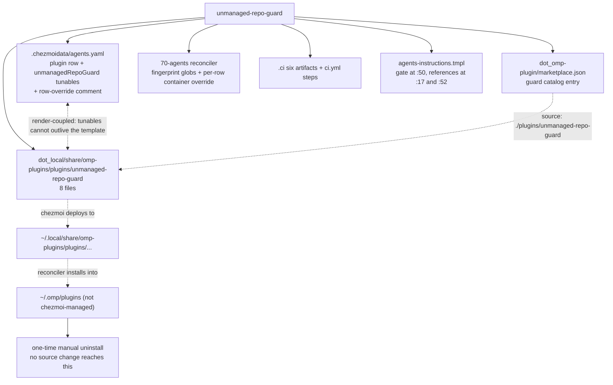
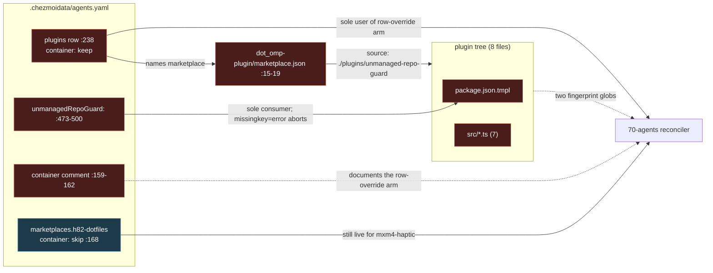
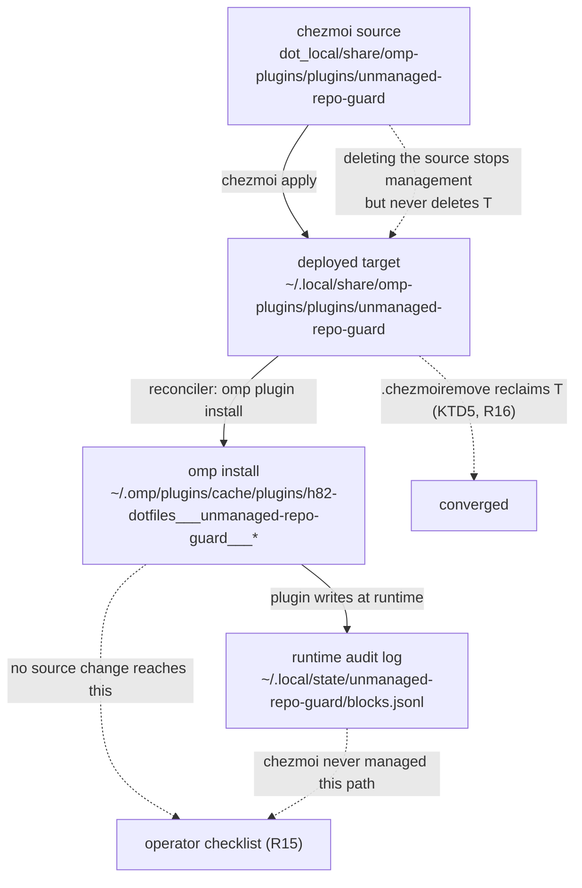

# Remove the unmanaged-repo-guard - Plan

## Goal Capsule

- **Objective:** Delete the `unmanaged-repo-guard` omp plugin and the mechanical repository-management gate it enforces. The plugin goes in full — source tree, marketplace entry, tunables, reconciler override machinery, and six CI artifacts. The gate in `.chezmoitemplates/agents-instructions.tmpl` collapses to one plain-language ask-first rule. No access probe, no fail-closed test, no override.
- **Product authority:** The user's request governs scope, including the decision to remove rather than repair. Root `AGENTS.md` governs chezmoi source attributes, single-source-of-truth data files, the no-teardown-script rule, and isolated verification. This reverses the prior decision recorded at `docs/plans/feedback-sweep-plan.md:40`.
- **Execution profile:** A bounded deletion across five source layers plus one instruction-core rewrite, one `.chezmoiremove` prune entry, and a record reconciliation. Verification is isolated rendering under a stub `op`, the surviving CI suite, and a repository-wide reference sweep. Never apply the source state to live `$HOME`.
- **Tail ownership:** Local proof is the isolated render harness, the surviving `.ci` suite, and the repository-wide reference sweep. The container apply path is not locally forceable by any facts-cache trick (KTD10) and is owned by `render-dotfiles.yml`'s containerized `apply` job; `ci.yml` owns the surviving `omp-agent-integration` proof. The host-local steps in `docs/decommission/unmanaged-repo-guard.md` are the operator's; this run writes them and never performs them.
- **Stop conditions:** Stop if the surviving `.ci/test-mxm4-haptic-gates.sh` cannot be made to pass. Stop if a proposed prune would delete a path chezmoi never deployed. Stop if any neighbouring issue rule named in R14 would change meaning.
- **Open blockers:** None. All four mechanism questions the Product Contract deferred are resolved in Key Technical Decisions. One product decision was amended against the originating issue's written record and is flagged for the user in KTD9.

---

## Product Contract preservation

Enrichment restructured five requirements. R6 widens the deletion set; R12, R13, and AE3 are amended against the originating issue's own written record; R17 and R19 are restated against verified tracker state. No requirement was narrowed or reversed except where the table says so.

| ID | Disposition | Why |
|---|---|---|
| R6 | widened, AE5-forced | From four CI artifacts to six. `.ci/lib/stub-model-server.ts` and `.ci/lib/stub-mcp-issue-server.ts` have exactly one caller each — `.ci/test-unmanaged-repo-guard-real.sh` — so deleting the four named artifacts strands 400 lines. Including them serves AE5's own zero-orphan assertion; excluding them would violate it. |
| R8 | restructured -> R8 + R8a | R8's clause "Its comment naming the guard as a container-eligible plugin is corrected" attaches to the wrong file. That comment is `.ci/test-mxm4-haptic-gates.sh:66-70`. `.ci/lib/render-gate-helpers.sh:2-3` carries a *different* stale comment (it names the deleted gate test as one of its two sourcing callers). Both are corrected; the split makes each owner explicit. |
| R12, R13, AE3 | **changed — flagged for the user** | The Product Contract's KD3 had unattended runs file into any repository with no gate. Issue #184's own body lists, under **Must survive verbatim in meaning**, "The unattended `lfg` prohibition on filing into a repository the user does not manage. An autopilot run has no user to direct it and gains nothing from this change." The follow-up comment that authorizes this plan says only "remove `unmanaged-repo-guard` as well". KD3's stated basis — "the user chose filing over declining" — is not corroborated anywhere in the issue thread. R12 and R13 now **reword** the unattended route onto ownership judgment instead of deleting it. See KTD9; one edit reverts this if the user rules otherwise. |
| R17 | changed | All six issues were already closed at the tracker by PR #191 (merge `f5f0235b052e9efe6da30524767f41eac9469002`, 2026-08-07). #186-#189 were **fixed**, not left open, so the Problem Frame's "four open defects" is superseded — see A1. What remains is that `docs/feedback-sweep/state.yml` still records all six as `acknowledged`. R17 reduces to reconciling that file, and covers #168 rather than carving it out. |
| R19 | changed | The seven findings in `docs/residual-review-findings/feature-unmanaged-repo-issue-guard.md` (#171-#177) are already closed via PR #190, so none is "left open against deleted code". The record needs a superseded header, not a won't-do resolution. `docs/plans/feedback-sweep-plan-2026-08-07.md` and `docs/plans/feedback-sweep-plan.md` are both fully-shipped records; neither carries open guard work. |

---

## Product Contract

### Summary

Remove the mechanical unmanaged-repository enforcement this repository added on 2026-08-05. The plugin is deleted outright, source through CI; the instruction core keeps one soft ask-first sentence and loses the access probe, the fail-closed test, and the clause that outranked skill-level fallback chains. Because the phase-70 reconciler installs but never uninstalls, the change ships with a one-time manual uninstall the operator runs.

### Problem Frame

The gate blocks the user from filing issues in their own GitLab projects, and offers no way out.

The GitLab probe is the immediate failure. `dot_local/share/omp-plugins/plugins/unmanaged-repo-guard/src/probe.ts:262-268` sets `sawKey` for a `permissions` key that is present but `null`, then skips the null scope, leaving `best` at `-1`; `:271` converts that to `0`, and `:164` compares `0 >= 30` and returns `unmanaged`. GitLab reports exactly that shape — `project_access: null`, `group_access: null` — for a project owned through a personal namespace, where ownership is implicit rather than a membership row. The verdict is `unmanaged`, not `indeterminate`, so the call is blocked rather than escalated. `.ci/test-unmanaged-repo-guard.ts:733` asserts this as intended behavior.

There is no escape hatch by design. KTD7 of the origin plan reads "the guard blocks and explains; it never files, never writes, and never asks." A false block is therefore terminal for the run.

The classifier carried four further defects — issues #186 and #187 (P1 bypasses: prefix-option parsing, unscanned `-c` bodies) and #188 and #189 (P2: argv-forwarding wrappers, flag-stripped positionals). PR #191 closed all four on 2026-08-07, so they are no longer open; see A1. The surviving cost argument rests on the false block and the size asymmetry, neither of which those fixes touch.

The cost shape is asymmetric. The guard is 1,838 lines of plugin plus 2,533 lines of CI riding every apply and every pipeline. Against that it has produced at least one hard false block and, on the user's account, no prevented harm.

### Key Decisions

- KD1. **Remove rather than repair.** The GitLab miss is one function and the escape hatch is a small feature, but the objection is to the policy, not the defect — a repaired guard still enforces a rule the user does not want. Governs R1, R9.
- KD2. **A plain-language rule survives; nothing mechanical does.** The replacement is ordinary judgment about whose repository it is, not a cheaper permission test. Governs R10.
- KD3. **Unattended runs stop asking, and route by ownership judgment instead of by a probe.** *(Amended during enrichment — see the preservation table and KTD9. As authored it read "Unattended runs file without a gate", removing the autopilot carve-out and the review-findings exception outright.)* An `lfg` run cannot honor an ask-first rule, so the ask is not what survives for it. What survives is the destination rule: a finding whose target repository is not the user's goes to the committed-record fallback and is reported, exactly as issue #184 requires. Governs R12, R13.
- KD4. **The target-resolution rule outlives the gate.** Filing against the fork you pushed from instead of the upstream parent is a correctness mistake independent of permissions; it currently survives only inside the deleted passage. Governs R11.
- KD5. **The per-row `container` override goes with its only consumer.** `unmanaged-repo-guard` is the only plugin row carrying `container:`; with it gone the row-shape branch is unreachable. The marketplace-level `container` key is separate and stays. Governs R4.
- KD6. **Live-state reversal is documented, never scripted.** Root `AGENTS.md:22` forbids teardown scripts, and the omp-installed copy is outside chezmoi's control. Governs R15.
- KD7. **This reverses `docs/plans/feedback-sweep-plan.md:40`.** That decision kept the guard because it was the only mechanical enforcement of the boundary at a moment its classifier had open P1 bypasses. The user's verdict removes the premise: the enforcement itself is unwanted. Governs R18.

### Removal surface



### Requirements

**Plugin and data**

- R1. `dot_local/share/omp-plugins/plugins/unmanaged-repo-guard/` is deleted in full, all eight files.
- R2. `dot_local/share/omp-plugins/dot_omp-plugin/marketplace.json` drops the guard entry and keeps `mxm4-haptic`, leaving a valid one-member catalog.
- R3. The `unmanaged-repo-guard` plugin row, the `unmanagedRepoGuard:` tunables block, and the per-row `container` comment that documents them leave `.chezmoidata/agents.yaml` in the same change. The row and the tunables are render-coupled: the manifest template fails on a missing tunable, and the tunables have no other consumer.
- R4. The reconciler's per-row `container` override is removed from `.chezmoiscripts/70-agents/run_onchange_after_update-omp-plugins.sh.tmpl`, so a plugin row is `{name, marketplace}` again. The marketplace-level `container` key keeps its current validation and behavior.
- R5. The reconciler's fingerprint input list drops both guard globs and keeps every other member.

**CI**

- R6. `.ci/test-unmanaged-repo-guard.ts`, `.ci/test-unmanaged-repo-guard-gates.sh`, `.ci/test-unmanaged-repo-guard-real.sh`, `.ci/tsconfig.unmanaged-repo-guard.json`, `.ci/lib/stub-model-server.ts`, and `.ci/lib/stub-mcp-issue-server.ts` are deleted. The last two have no caller once the guard tests are gone.
- R7. `.github/workflows/ci.yml` loses the guard render-and-typecheck step and the three guard test invocations. No other step changes.
- R8. `.ci/lib/render-gate-helpers.sh` survives with every helper still exercised, and `.ci/test-mxm4-haptic-gates.sh` still passes.
- R8a. Two comments that describe the guard as a live neighbour are corrected: `.ci/lib/render-gate-helpers.sh:2-3` (names the deleted gate test as a sourcing caller) and `.ci/test-mxm4-haptic-gates.sh:66-70` (names the guard as the container-eligible plugin that justifies the narrowed ignore rule).

**Instruction core**

- R9. The mechanical gate leaves `.chezmoitemplates/agents-instructions.tmpl`: the `gh viewerPermission` and `glab access_level` tests, the fail-closed rule that treats an ambiguous result as external, the re-apply-before-any-filing-step sentence, and the clause outranking skill-level fallback chains.
- R10. One plain-language rule replaces it: before filing an issue in, or commenting on, a repository that is not the user's, ask and wait for an answer, stating the target repository, the proposed title, and the proposed body or comment. It is judgment about ownership, not a permission check, and it names no CLI, API field, or access level. The request-content obligation is carried forward verbatim in meaning from the deleted passage — an ask the user cannot evaluate is not a control.
- R11. The target-resolution rule survives as a free-standing rule — resolve the target once (the repository hosting the MR/PR under review, or the work's target repository when none exists), file against the upstream parent, never the fork the agent pushed from, never a CLI remote-derived default — with its access-check clause removed.
- R12. The `lfg` autopilot paragraph drops the gate from its list of surviving prohibitions, and its unattended sentence is **reworded, not deleted**: the route now turns on ownership judgment rather than on a permission probe. The paragraph states affirmatively what an unattended run does, so nothing is left to inference.
- R13. The two-state review-findings rule's second exception is **reworded, not deleted**: it no longer names the gate, and reads as the unattended-ownership case. The no-approved-tracker case is unchanged. Any ordinal wording that no longer matches is corrected.
- R14. Every neighbouring issue rule survives verbatim in meaning: duplicate search before filing, the prohibition on managing labels, milestones, and other people's assignees, `Closes #N` / `Refs #N` placement including the per-issue-keyword rule, the prohibition on a direct issue close or reopen, the cross-platform validity of `Closes #N` / `Refs #N`, self-assignment, the task-list ticking rule, and commenting only at key events.

**Live state**

- R15. The already-installed omp plugin under `~/.omp/plugins` is handed to the operator as a one-time manual uninstall with the exact commands. No script performs it.
- R16. The deployed chezmoi target `~/.local/share/omp-plugins/plugins/unmanaged-repo-guard` is pruned so provisioned hosts converge without operator action.

**Record**

- R17. `docs/feedback-sweep/state.yml` reflects the closure of issues #168, #184, #186, #187, #188, and #189 — every entry the file still records as `acknowledged`.
- R18. The reversal of `docs/plans/feedback-sweep-plan.md:40` is recorded where a reader of that decision will find it.
- R19. `docs/residual-review-findings/feature-unmanaged-repo-issue-guard.md` and the guard units in `docs/plans/feedback-sweep-plan-2026-08-07.md` are marked superseded rather than left reading as live guidance about existing code.

### Acceptance Examples

- AE1. **Covers R9, R10.** Given a GitLab project in the user's personal namespace, when an attended run creates an issue there, then it files with no permission probe, no block, and no confirmation prompt.
- AE2. **Covers R10.** Given a repository that plainly is not the user's, such as an upstream dependency's tracker, when an attended run wants to file there, then it asks first — stating the target, the title, and the body — reaching the ownership judgment from context, not from an access-level lookup.
- AE3. **Covers R12, R13.** Given an unattended `lfg` run with an actionable finding, when it reaches the filing step: for a repository that is the user's it files without asking; for one that is not, it routes the finding to the committed-record fallback and reports it. No permission probe runs in either branch.
- AE4. **Covers R3.** Given the tunables removed while the manifest template survives, when the source state renders, then it aborts. The reverse direction renders clean and leaves dead data, so it is caught by the data-key sweep rather than by rendering — U1 carries both gates.
- AE5. **Covers R6, R8.** Given the six guard CI artifacts deleted, when CI runs, then `.ci/test-mxm4-haptic-gates.sh` still passes and no shared helper or stub server is orphaned.
- AE6. **Covers R15, R16.** Given a provisioned host after this change is applied, when the operator has not yet run the manual uninstall, then the deployed source tree is gone but the installed plugin still blocks — and the handover says so plainly.

### Scope Boundaries

- Repairing `readGitlabAccessLevel`, adding an escape hatch, or downgrading the block to a warning. All three keep the policy under objection.
- The secrets guards, the CI-weakening guards, and the two-state review-findings rule itself. Only the wording of its gate-derived exception is touched.
- `mxm4-haptic` and the `h82-dotfiles` marketplace. Both stay; the marketplace keeps one member.
- `docs/plans/2026-08-05-005-docs-external-repo-issue-confirmation-plan.md` and `docs/plans/2026-08-05-006-feat-unmanaged-repo-issue-guard-plan.md`. They stay as the historical record of what was built and why, unedited.
- Any teardown or revert script. Forbidden by root `AGENTS.md:22`.
- Widening the container ignore rule for `.local/share/omp-plugins`. See KTD6 — it would break a surviving test for no gain.
- Applying `feedback:resolved` labels at the source. That is `ce-sweep`'s `closeout_action`, run under its own lease; see KTD8.
- A new rule bounding what content may cross into a repository that is not the user's. The reworded R12/R13 keep unattended runs out of those trackers entirely, so the exposure that would motivate such a rule does not arise; adding one is a separate policy decision.

### Dependencies / Assumptions

- GitLab reports `project_access: null` and `group_access: null` for a project owned through a personal namespace. The user observed the resulting block directly; the code path that turns that shape into `unmanaged` is confirmed at `probe.ts:262-271`.
- With the guard gone, no plugin row carries `container:`, so the reconciler's row-shape branch is unreachable rather than merely unused. Verified: `.chezmoidata/agents.yaml:238` is the only such row repo-wide.
- Applying the source state to a live `$HOME` is not part of this change unless the user asks. Until an apply plus the manual uninstall both happen, the block persists on this host.

### Outstanding Questions

None. All four questions the Product Contract deferred to planning are resolved as KTD5 (`.chezmoiremove`), KTD6 (keep the narrowed ignore rule), KTD3/KTD4 (the surviving instruction wording), and KTD2 (the `container` comment split). One decision is resolved but flagged for the user: KTD9.

---

## Assumptions

Recorded because this plan was enriched headlessly; each is a bet a reviewer may overturn.

- A1. **#186-#189 are closed and fixed, not open.** PR #191 merged their classifier fixes on 2026-08-07. The Product Contract's Problem Frame described them as open because it predates verification against the tracker. This changes no requirement — the code they fixed is deleted either way — but it does mean R17 is a record-reconciliation task, not a closure task.
- A2. **`fix_ref` for all six state entries is PR #191**, the pull request that actually closed them at the tracker. #184's follow-up comment (delete the plugin) is fulfilled by *this* change, but its tracker closure was #191's; that nuance is recorded in the R18 reversal note rather than by inventing a second `fix_ref`.
- A3. **The operator handover lives at `docs/decommission/unmanaged-repo-guard.md`.** The directory already holds three such checklists (`open-design`, `ydotool`, `cli-proxy-api`) and root `AGENTS.md` treats a committed checklist as the sanctioned substitute for a teardown script.
- A4. **`~/.local/state/unmanaged-repo-guard/` is operator cleanup, not chezmoi's.** The audit log is written at runtime by the plugin to a path chezmoi never managed, so no prune can reach it; it belongs in the checklist — read before deleting, per U5.
- A5. **`omp plugin uninstall` resolves from the installed registry, not from the catalog.** Verified on this host, 2026-08-10: the uninstall succeeded against `unmanaged-repo-guard@h82-dotfiles`, and `~/.omp/plugins/installed_plugins.json` is keyed by that id. This is why U5 can state that apply-then-uninstall and uninstall-then-apply are equivalent. The same probe established that `omp plugin uninstall --dry-run` **is not honored** — it performs the uninstall — which the checklist must warn about.

---

## Key Technical Decisions

- **KTD1. Delete the tunables and the plugin tree in one unit; tunables-last is impossible.** The coupling is asymmetric and only one direction is fatal. `dot_local/share/omp-plugins/plugins/unmanaged-repo-guard/package.json.tmpl` is the sole consumer of `agents.unmanagedRepoGuard`, and it dereferences that key on its first line; chezmoi v2.71.0 renders with `missingkey=error`, so deleting the tunables aborts the render there with `map has no entry for key "unmanagedRepoGuard"` — the template's own `fail` calls are never reached. Deleting the template while the tunables survive renders fine and leaves dead data, which is why U1 carries a separate data-key sweep. Chosen over splitting them across units: a mid-unit tree state that cannot render is worse than a slightly larger unit. Cites R3, AE4.
- **KTD2. Keep the marketplace-level `container` documentation; delete only the row-override half.** `.chezmoidata/agents.yaml:157-158` explains the marketplace default, which stays live for `h82-dotfiles: container: skip`; `:159-162` explains the per-row override and names the guard as its reason. Rejected alternative: rewriting the whole bullet. Reason: `:157-158` is still exactly true, and the first sentence of `:159` — `This is the DEFAULT for every plugin filed under the marketplace.` — is the one clause worth keeping. Line 158 is already 79 characters, so the retained sentence becomes a new continuation line at the file's comment indent rather than a literal fold; keep the file's capitalised `DEFAULT` emphasis. Cites R3, R4.
- **KTD3. The replacement rule is one sentence naming judgment plus disclosure, not a lookup.** R10 forbids naming a CLI, an API field, or an access level, so the surviving sentence must not read as a cheaper probe. It must still say what the ask contains: the deleted passage's `The request MUST state the target repository, the proposed title, and the proposed body or comment.` is disclosure, not a permission test, and without it a bare "shall I file this?" satisfies the rule. Rejected alternative: "ask when you cannot verify write access" — that is the same gate with a softer verb, and it re-invites a probe. Cites R10, AE2.
- **KTD4. Re-anchor the self-assignment sentence rather than move it.** `Self-assignment of the authenticated user is the sole exception:` is line 50's twenty-third sentence; the assignee prohibition it excepts is the first. The deletion does not make them adjacent — five sentences still separate them afterwards — so the bare ordinal stays ambiguous either way. Chosen fix: `the sole exception to the assignee rule`. Rejected alternative: relocating the sentence next to the assignee prohibition. Reason is R14's verbatim-in-meaning constraint alone, not proximity: reordering the paragraph is exactly the change R14 forbids, and the two-word re-anchor buys the same clarity without it. Cites R14.
- **KTD5. Prune the deployed tree through `.chezmoiremove`, not a `remove_` source attribute.** Chosen over `remove_`: `.chezmoiremove` is this repository's dominant convention (nine commented blocks, two of them fact-gated) and is the only mechanism that can carry the rationale comment the file's house style requires; the single live `remove_` precedent is a bare 0-byte `remove_dot_gitconfig` with no comment and no conditional. A `remove_` equivalent would also need a source path shaped `dot_local/share/omp-plugins/plugins/remove_unmanaged-repo-guard`, colliding conceptually with the tree being deleted. This resolves the precedent conflict the Product Contract flagged: `docs/plans/2026-07-29-001` KTD-2 reserves `.chezmoiremove` for unmanaged paths, but that plan was pruning a single managed *file* with a live `remove_` sibling; this is a managed *directory tree* with no sibling. Verified mechanically: a scratch `chezmoi apply` (v2.71.0) with a lone directory path in `.chezmoiremove` removed the tree recursively and left its siblings untouched. Cites R16, AE6.
- **KTD6. Keep `.chezmoiignore`'s narrowed container exclusion; do not revert to a wholesale `.local/share/omp-plugins` skip.** `.ci/test-mxm4-haptic-gates.sh:71` asserts the shared catalog — spelled `.local/share/omp-plugins/dot_omp-plugin/marketplace.json` in that test's source-path form — is *eligible* inside a container; a wholesale exclusion fails that assertion. Rejected alternative: widen the ignore and flip the assertion. Reason: the only thing widening buys is not deploying a 668-byte inert JSON file into containers, and it costs a broken test plus a second, container-gated prune whose interaction with an ignore rule covering the same path is unverified. The narrowing's original rationale (keep the catalog reachable so a container-eligible guard can install) does expire with the guard — that is a comment correction (R8a), not a behavior change. Cites R8, R8a.
- **KTD7. `.chezmoiremove` prunes the tree ungated.** Every other precedent block that carries a fact gate does so for provenance safety — never prune a path on a host class that never received it. The guard deployed on every managed OS *and* inside containers (`.chezmoiignore` excluded only the haptic subtree), so no host class is exempt and a gate would only create a class that never converges. A host that never applied between 2026-08-05 and this change simply takes the prune as a no-op. Cites R16.
- **KTD8. Reconcile `docs/feedback-sweep/state.yml` in-repo only; touch no labels and no `last_run` block.** Chosen over also applying the `feedback:resolved` closeout label: that label is `ce-sweep`'s `closeout_action`, applied under its single-writer lease, and the instruction core prohibits managing labels. `existing_ack` / `existing_closeout` are historical facts about what the sweep found *before* it acted, so they are not flipped; `last_run` describes one specific run and editing its counts would falsify a run record. Cites R17.
- **KTD9. Preserve the unattended-ownership route; reword it instead of deleting it. FLAGGED FOR THE USER.** The Product Contract's KD3 deleted the `lfg` carve-out outright, so an unattended run would file into any repository. Issue #184 — the origin this plan cites — says the opposite in its own **Must survive verbatim in meaning** list: "The unattended `lfg` prohibition on filing into a repository the user does not manage. An autopilot run has no user to direct it and gains nothing from this change." The follow-up comment authorizing this plan reads, in full, "remove `unmanaged-repo-guard` as well" — it is about the plugin. KD3's stated basis, that the user chose filing over declining, appears nowhere in the thread. Between a verbatim written requirement and an uncorroborated summary, the written requirement wins, and it is also the conservative side of an irreversible public write into a stranger's tracker. So R12 and R13 reword rather than delete: the *probe* goes, the *destination rule* stays, restated as ownership judgment. Rejected alternative: implement KD3 as authored. Reason: it contradicts the origin document and serves none of the stated pain, which is a false block on the user's own projects. **If the user confirms KD3 as authored, the reversal is one edit** — delete the reworded sentence in U4 step 2 and the reworded exception in U4 step 3 instead of rewriting them, and restore AE3's original one-branch form. Cites R12, R13, AE3.
- **KTD10. Force the container fact by substituting the facts provider, never by doctoring the facts cache.** `container` is `probe: template` (`.chezmoidata/facts.yaml:251-253`); `facts.tmpl` merges the `XDG_CACHE_HOME` cache only into `probe: hook` facts and then overwrites `container` from an in-process `stat` of `/run/.containerenv` and `/.dockerenv`. A doctored cache is therefore inert for this fact — two renders come out byte-identical on any non-container host, so a gate built on it passes whether or not the block under test is gated. `distro` is `probe: builtin` and is equally unforcible that way. The repository already ships the working mechanism: `.ci/lib/render-gate-helpers.sh`'s `render_ignore` and `render_reconciler` rewrite the single facts-provider anchor to a literal `dict "container" <bool>` in a scratch copy before rendering. `.chezmoiremove:1` carries the byte-identical `{{- $f := includeTemplate "facts.tmpl" . | fromYaml }}` anchor, and the reconciler carries `render_reconciler`'s `includeTemplate "facts.tmpl" . | fromYaml` needle, so both units drive the same substitution. Do it inline in the test scenario rather than adding a helper — U3 keeps `render-gate-helpers.sh` comment-only. Cache doctoring stays valid only for the hook facts it actually reaches. Cites R16, and the Verification Contract.

---

## High-Level Technical Design

Two shapes matter here. The first is the render-coupling and eligibility graph, which decides what must move together. The second is the live-state boundary, which decides what the source state can and cannot reach.

### What is coupled to what



The one fatal ordering is `TUN -> PKG`: the tunables cannot outlive the template, because the render aborts on the missing key. Every other edge is order-free at render time — the reconciler never stats a plugin source, so a stale row or a stale glob renders cleanly and only misbehaves at apply time. CI adds one ordering constraint the render graph does not show: `ci.yml` still renders and typechecks the plugin until U3 lands, so U3 must land with or before U1.

### What the source state can reach



The reconciler at `.chezmoiscripts/70-agents/run_onchange_after_update-omp-plugins.sh.tmpl:129-137` only ever runs `marketplace add`, `plugin install`, and `plugin enable`. It has no uninstall arm and, per root `AGENTS.md:22`, must not gain one. That asymmetry is the whole reason R15 exists.

---

## Implementation Units

### U1. Delete the plugin, its catalog entry, and its data

- **Goal:** Remove every source artifact of the guard plugin and the data that renders into it, in one atomic change so the tree never sits in a state that cannot render.
- **Requirements:** R1, R2, R3; KTD1, KTD2; AE4.
- **Dependencies:** none, but U3 must land with or before this unit — U1 alone leaves `ci.yml:73-85` rendering a deleted template and `.ci/test-unmanaged-repo-guard.ts` importing deleted modules.
- **Files:**
  - `dot_local/share/omp-plugins/plugins/unmanaged-repo-guard/package.json.tmpl` (delete)
  - `dot_local/share/omp-plugins/plugins/unmanaged-repo-guard/src/index.ts` (delete)
  - `dot_local/share/omp-plugins/plugins/unmanaged-repo-guard/src/triggers.ts` (delete)
  - `dot_local/share/omp-plugins/plugins/unmanaged-repo-guard/src/probe.ts` (delete)
  - `dot_local/share/omp-plugins/plugins/unmanaged-repo-guard/src/target.ts` (delete)
  - `dot_local/share/omp-plugins/plugins/unmanaged-repo-guard/src/audit.ts` (delete)
  - `dot_local/share/omp-plugins/plugins/unmanaged-repo-guard/src/exec.ts` (delete)
  - `dot_local/share/omp-plugins/plugins/unmanaged-repo-guard/src/reason.ts` (delete)
  - `dot_local/share/omp-plugins/dot_omp-plugin/marketplace.json` (modify)
  - `.chezmoidata/agents.yaml` (modify)
- **Approach:**
  1. Delete the whole `unmanaged-repo-guard/` directory — all eight files. Deleting `package.json.tmpl` and the seven `src/*.ts` files removes the directory; `plugins/mxm4-haptic/` is the sibling that keeps `plugins/` alive.
  2. In `marketplace.json`, delete the guard object at lines 15-19 **and** strip the trailing comma from line 14 so `    },` becomes `    }`. A pure range delete leaves `"plugins": [ { … }, ]`, which is invalid JSON that nothing in the render path catches — this is the highest-risk mechanical step in the change.
  3. In `.chezmoidata/agents.yaml`, delete the plugin row at line 238. It is the last of three block-sequence items, so no comma or continuation fixup is needed and the two survivors are both two-key rows.
  4. In the same file, delete the `unmanagedRepoGuard:` block at lines 473-500 in full: the twelve leading comment lines (473-484), the mapping (485-487, 498-500), and the two nested comment blocks inside it (488-495 for `auditLog`, 496-497 for `maxBytes`). Nothing between 473 and 500 survives. It is the file tail, so the file truncates to end on the `agents.omp.auth.env` entry at line 472.
  5. In the same file, delete the row-override comment at lines 159-162 and keep its still-true first clause as a new comment line at the same indent, so the bullet ends: `…(mxm4-haptic has nothing to pulse in a container); `keep` leaves it in.` / `#     This is the DEFAULT for every plugin filed under the marketplace.` Leave `:157-158`'s marketplace-level explanation and `marketplaces.h82-dotfiles.container: skip` at `:168` untouched (KTD2).
- **Patterns to follow:** the surviving `mxm4-haptic` catalog object and plugin row define the exact JSON and YAML shapes; a plugin row is a one-line flow mapping at indent 4 with the `- ` marker unindented past its parent key.
- **Test scenarios:**
  - Covers AE4, fatal direction. Render `dot_local/share/omp-plugins/plugins/unmanaged-repo-guard/package.json.tmpl` from `HEAD` against the post-change `.chezmoidata/agents.yaml`: the render exits non-zero with an error naming `unmanagedRepoGuard`. Assert the non-zero exit and the key name, not a specific message — `missingkey=error` fires before the template's own `fail` calls (KTD1).
  - Covers AE4, silent direction. `.chezmoidata/agents.yaml` contains no `unmanagedRepoGuard`, no `probeTimeoutMs`, no `cacheTtlMs`, and no `auditLog`. None of the last three is covered by the repository-wide guard-name sweep, so this is the only gate that catches an orphaned tunables residue.
  - `jq -e '.plugins | length == 1 and .[0].name == "mxm4-haptic"' dot_local/share/omp-plugins/dot_omp-plugin/marketplace.json` exits 0 — the only check that catches the trailing-comma trap.
  - `chezmoi execute-template` over the surviving `.chezmoidata/agents.yaml` consumers (the reconciler and `run_after_config-omp-settings.sh.tmpl`) succeeds under the isolated harness, proving no other template read the deleted keys.
  - The source tree contains no path under `dot_local/share/omp-plugins/plugins/unmanaged-repo-guard`.
- **Verification:** the isolated render harness completes, the catalog has one member, and no deleted data key survives anywhere in `.chezmoidata/`.

### U2. Strip the reconciler's row-override machinery and guard fingerprint globs

- **Goal:** Return a plugin row to `{name, marketplace}` and stop fingerprinting deleted paths, without touching the marketplace-level container gate that `mxm4-haptic` still needs.
- **Requirements:** R4, R5; KD5, KTD10.
- **Dependencies:** U1 (the row whose absence makes the branch unreachable).
- **Files:**
  - `.chezmoiscripts/70-agents/run_onchange_after_update-omp-plugins.sh.tmpl` (modify)
- **Approach:**
  1. On line 5, delete the two guard entries from `$fingerprintInputs` — `"dot_local/share/omp-plugins/plugins/unmanaged-repo-guard/package.json.tmpl"` and `"dot_local/share/omp-plugins/plugins/unmanaged-repo-guard/src/**"` — with their single leading spaces. Twelve entries remain, all resolving to real files.
  2. Delete the row-override block at lines 23-27 (`$rowContainer` declaration, the `hasKey` branch, and its value validation) and line 68 (`if ne $rowContainer ""`).
  3. Delete the three-key well-formedness check at line 22 entirely, and narrow line 20's arity check from `(list 2 3)` to `(list 2)`. Both halves are required: narrowing line 20 alone leaves line 22 unreachable rather than removed.
  4. Rewrite the two surviving error strings on lines 20 and 21 to drop `or {name, marketplace, container}`, so both read `must contain exactly {name, marketplace}`.
  5. Fold line 67 away: substitute `$container` directly for `$effectiveContainer` in the eligibility predicate at line 69, then delete line 67.
  6. Keep `$os` (line 2), `$facts` (line 7), `$validContainers` (line 13), and the marketplace-level `container` validation at lines 40-42. All four stay live for `h82-dotfiles: container: skip`.
- **Patterns to follow:** the surrounding `{{- … -}}` whitespace-chomping style; every validation line is a single self-contained template action with an inline `fail`.
- **Test scenarios:**
  - Render the script under the isolated harness on this host: it succeeds and the emitted `PLUGINS` array has exactly two rows, `mxm4-haptic@h82-dotfiles` and `compound-engineering@compound-engineering-plugin`.
  - Add a throwaway third key to a plugin row in a scratch copy of `.chezmoidata/agents.yaml` and render: the script `fail`s with `must contain exactly {name, marketplace}`, proving the narrowed arity check is live rather than merely edited.
  - Force the container fact by the needle substitution of KTD10 — rewrite `includeTemplate "facts.tmpl" . | fromYaml` to `dict "container" true` in a scratch copy of the template, then render it. The emitted array has exactly one row (`compound-engineering`), proving the marketplace-level `skip` still filters `mxm4-haptic` and the empty-array early exit at line 103 is not newly reachable. Run the same substitution with `false` as the control.
  - The rendered fingerprint comment block contains no `unmanaged-repo-guard` line and still carries the twelve surviving inputs.
  - The edited template source contains no `$rowContainer`, no `$effectiveContainer`, and exactly two occurrences of `must contain exactly {name, marketplace}`.
- **Verification:** `.ci/test-mxm4-haptic-gates.sh` passes locally; `.ci/test-omp-agent-reconcile.sh` and `.ci/test-omp-real-plugin.sh` are delegated to CI, which supplies their pre-rendered arguments and version-locked `omp`.
- **Execution note:** three of the five edits fail *silently* if skipped, and none is reachable by the guard-name sweep. The fingerprint globs degrade to nothing because `.chezmoitemplates/fingerprint.tmpl` iterates `glob` results; a surviving line 22 becomes unreachable rather than wrong; a surviving `$effectiveContainer` is byte-identical in behavior. The last test scenario above is the gate for all three — assert the rendered source text, do not expect an error. The rendered script hash changes either way, so the reconciler correctly re-runs once on the next apply.

### U3. Delete the guard CI surface and correct two stale comments

- **Goal:** Remove the six CI artifacts that exist only for the guard and the two `ci.yml` touchpoints that drive them, leaving the surviving suite green and no shared file orphaned or misdescribed.
- **Requirements:** R6, R7, R8, R8a; AE5.
- **Dependencies:** none. This unit must land **with or before U1** — the ordering runs the opposite way from the source deletion, because `ci.yml:73-85` renders the guard template and `.ci/test-unmanaged-repo-guard.ts` imports the guard modules on every push.
- **Files:**
  - `.ci/test-unmanaged-repo-guard.ts` (delete)
  - `.ci/test-unmanaged-repo-guard-gates.sh` (delete)
  - `.ci/test-unmanaged-repo-guard-real.sh` (delete)
  - `.ci/tsconfig.unmanaged-repo-guard.json` (delete)
  - `.ci/lib/stub-model-server.ts` (delete)
  - `.ci/lib/stub-mcp-issue-server.ts` (delete)
  - `.github/workflows/ci.yml` (modify)
  - `.ci/lib/render-gate-helpers.sh` (modify — comment only)
  - `.ci/test-mxm4-haptic-gates.sh` (modify — comment only)
- **Approach:**
  1. Delete the four guard artifacts plus the two `.ci/lib/` stub servers. `stub-model-server.ts` is invoked only from `test-unmanaged-repo-guard-real.sh:243,379,476` and `stub-mcp-issue-server.ts` only from its `:332-333` MCP registration; both are unreachable afterwards.
  2. In `ci.yml`, delete lines 73-85 — the entire `Render and typecheck unmanaged-repo-guard package` step. It is the sole producer of `$RUNNER_TEMP/unmanaged-repo-guard-package`.
  3. In `ci.yml`, delete lines 107-109, the three guard invocations that close the `Test OMP reconciliation, haptics, and real plugin` step. They are the sole consumer of that temp directory, so steps 2 and 3 must land together.
  4. Leave the `oven-sh/setup-bun@v2` step at line 13. `test-omp-agent-reconcile.sh:207` still runs `bun .ci/test-omp-haptic-plugin.ts` from the same job.
  5. Rewrite `.ci/lib/render-gate-helpers.sh:2-3` so it names its one surviving caller, `.ci/test-mxm4-haptic-gates.sh`, and keeps the sourced-never-executed note. Change nothing else in that file — U5's needle substitution is done inline in its own scratch copy, not by adding a helper here.
  6. Rewrite `.ci/test-mxm4-haptic-gates.sh:66-70` so the shared-catalog assertion's rationale no longer cites the guard as the container-eligible example. State the surviving reason: the container skip is narrowed to the hardware-bound haptic subtree, so the catalog root stays eligible. Keep the assertion at line 71 unchanged.
- **Patterns to follow:** `ci.yml`'s existing step boundaries — each step is `      - name:` at six spaces with its `run: |` block indented under it; the neighbours at lines 28-72 and 86 need no adjustment.
- **Test scenarios:**
  - Covers AE5. Run `.ci/test-mxm4-haptic-gates.sh` from the post-change tree: it passes, including the line-71 assertion that the shared catalog is container-eligible.
  - Every function defined in `.ci/lib/render-gate-helpers.sh` — `require_file`, `render`, `render_ignore`, `is_ignored`, `assert_gate`, `render_reconciler` — still has at least one call site; `is_ignored`'s is internal, the rest are in the haptic gate test.
  - `shellcheck` over the surviving `.ci/**/*.sh` set is clean. Both workflows discover targets with `find`, so no lint list needs editing.
  - `ci.yml` parses as YAML and the `omp-agent-integration` job retains seven steps; the `delivery` job's `needs:` list is unchanged because it names jobs, not steps.
  - Grepping `.ci/` for `unmanaged` returns only `test-mxm4-haptic-provision.sh:507`'s unrelated `mac-unmanaged-tmp` fixture name.
- **Verification:** the surviving `omp-agent-integration` job passes end to end in CI.

### U4. Replace the mechanical gate with one plain-language rule

- **Goal:** Delete the access probe and the machinery that depended on it, keep the target-resolution correctness rule and the disclosure obligation, reword the unattended route onto ownership judgment, and leave every neighbouring issue rule intact.
- **Requirements:** R9, R10, R11, R12, R13, R14; KD2, KD3, KD4, KTD3, KTD4, KTD9; AE1, AE2, AE3.
- **Dependencies:** none. This unit is independent of U1-U3 and could land first.
- **Files:**
  - `.chezmoitemplates/agents-instructions.tmpl` (modify)
- **Approach:** three paragraphs change. Each is one long unwrapped line; edit sentences, never reflow.
  1. **Line 50 — the gate.** Keep the two opening sentences verbatim (issue-in-play link/track plus the label, milestone, and other-people's-assignee prohibition; duplicate search before filing). Then delete the gate run from `A repository the user does not manage is gated further.` through `…the finding falls to the committed-record fallback below, and the run reports it.` In its place put, in order:
     - the R10 rule, carrying the disclosure obligation the deleted run held and naming no CLI, API field, or access level: `Before filing an issue in, or commenting on, a repository that is not the user's, ask the user first and wait for an answer; no answer is not consent. The request MUST state the target repository, the proposed title, and the proposed body or comment. Judge whose repository it is from the work's own context, not from a permission check.`
     - the R11 target-resolution rule, rebuilt from the sentences that currently sit mid-gate with the access-check clause dropped: `Resolve the target repository once, explicitly and authoritatively: it is the repository hosting the MR/PR under review, or the work's target repository when none exists. In a fork that is the upstream parent, never the fork the agent pushed from, and never a CLI remote-derived default. Reuse that one resolved value for the confirmation and the filing call (`gh issue create --repo <owner>/<repo>`).`
     Then keep the rest of the paragraph verbatim from `Self-assignment of the authenticated user is the sole exception…` to the end, with the single re-anchoring edit from KTD4: `the sole exception` becomes `the sole exception to the assignee rule`.
  2. **Line 17 — the `lfg` autopilot paragraph.** In its third sentence, drop the gate from the list of surviving prohibitions so it reads `…the secrets guards and the CI-weakening guards are separate prohibitions, not confirmations, and still hold.` Then **reword** the fourth sentence rather than deleting it, so the paragraph states the unattended behavior affirmatively instead of leaving it to be inferred from the override: `An unattended run does not resume prompting: in the user's own repositories it files without asking, and for a repository that is not the user's it declines to file and routes the finding to the committed-record fallback.` (KTD9.)
  3. **Line 52 — the two-state rule.** **Reword** the second-exception sentence rather than deleting it, dropping the gate reference and keeping the unattended-ownership case: `A run that cannot file because the target repository is not the user's is the other exception, on the same fallback.` Leave the no-approved-tracker exception's wording as it stands — with a second exception still present, no ordinal correction is needed.
- **Patterns to follow:** the file's one-line-per-paragraph convention and its `MUST` / `SHOULD` / `MUST NOT` register. The only harness conditional is the omp-only block at lines 67-69 and is unrelated.
- **Test scenarios:**
  - **Sentence-multiset gate (the load-bearing one).** Render `dot_omp/private_agent/private_readonly_AGENTS.md.tmpl` from `HEAD` and from the post-change tree, split each rendering's lines 17, 50, and 52 on sentence boundaries, and assert the post-change multiset equals the `HEAD` multiset minus exactly the sentences this unit deletes, plus exactly the sentences it inserts or rewords. A unified diff cannot do this job: line 50 is a single 4,882-character line, so any edit to it reports as one changed line and a silently dropped neighbouring rule looks identical to a correct edit.
  - Covers R9. The rendered output contains no `viewerPermission`, no `access_level`, no `project_access`, and no `group_access`, and no sentence re-applying a check before a tracker, Defer, or residual-handoff filing step.
  - Covers R14. Each of the eight neighbouring rules is present and unchanged in meaning: duplicate search, the label/milestone/other-assignee prohibition, `Closes #N` / `Refs #N` placement including the per-issue-keyword rule, the direct-close/reopen prohibition, the cross-platform validity sentence, self-assignment, key-event-only commenting, and the task-list ticking rule. The multiset gate above is what proves this mechanically; this enumeration is the human-readable restatement.
  - Covers R12, R13. The rendered line 17 carries the affirmative unattended sentence, and the rendered line 52 carries a second exception that names ownership rather than a gate.
  - No dangling cross-reference survives: nothing says `the gate above` or refers to a permission probe; line 64's slashes-intact rule is still stated in its own right now that line 50's forward reference to it is gone.
  - The template still renders for `harness: omp` — the only live consumer — and the file's heading structure is unchanged.
- **Verification:** the sentence-multiset gate passes, and the rendered `~/.omp/agent/AGENTS.md` differs from `HEAD` only in the three intended paragraphs.
- **Execution note:** this is prose surgery on three unwrapped multi-thousand-character lines, and no line-granular diff can protect it. Build the sentence-multiset gate first, then edit. AE1 and AE2 describe runtime agent behavior that no automated gate in this repository can prove — the only harness that could have driven a real `omp` through scripted tool calls is deleted by U3 — so they are covered by the operator spot-check in the Verification Contract, not by this unit.

### U5. Prune the deployed target and hand the live state to the operator

- **Goal:** Make provisioned hosts converge without operator action for everything chezmoi owns, and give the operator an exact, ordered checklist for the two things it does not.
- **Requirements:** R15, R16; KD6, KTD5, KTD7, KTD10; AE6.
- **Dependencies:** U1 (the source must be gone before its target is pruned).
- **Files:**
  - `.chezmoiremove` (modify)
  - `docs/decommission/unmanaged-repo-guard.md` (create)
- **Approach:**
  1. Append one ungated block to `.chezmoiremove` (KTD7): a comment in the file's house style stating that the source tree was deleted, that deleting a source stops management but never prunes the deployed copy, and that no gate applies because the guard deployed on every managed OS and inside containers alike — followed by the single path `.local/share/omp-plugins/plugins/unmanaged-repo-guard`. A directory entry removes the tree recursively and leaves `plugins/mxm4-haptic` and the catalog root untouched.
  2. Write the decommission checklist with these ordered steps: read the audit trail before destroying it — summarize `${XDG_STATE_HOME:-$HOME/.local/state}/unmanaged-repo-guard/blocks.jsonl` by outcome and by target repository, and record the counts in the R18 reversal note, because that log is the only evidence for or against the Problem Frame's "no prevented harm" claim and `src/audit.ts` deliberately excludes command text so it is safe to read; then disable the plugin (`omp plugin disable --scope user unmanaged-repo-guard@h82-dotfiles`); uninstall it (`omp plugin uninstall --scope user unmanaged-repo-guard@h82-dotfiles`); confirm with `omp plugin list --json` that only `mxm4-haptic@h82-dotfiles` and `compound-engineering@compound-engineering-plugin` remain; then delete the state directory.
  3. Warn, in the uninstall step, that `omp plugin uninstall --dry-run` is **not** honored — it performs the uninstall (A5). Never offer `--dry-run` as a rehearsal.
  4. State explicitly that the `h82-dotfiles` marketplace itself must **not** be removed — `mxm4-haptic` still lives in it, and the reconciler re-adds it on every apply.
  5. State the AE6 window plainly: after the apply the deployed source tree is gone, but until the uninstall runs the installed plugin is still loaded and still blocks. Add the acceptance the operator checks last: filing an issue in a personal-namespace GitLab project succeeds with no block.
  6. State that ordering is **not** load-bearing, and why: `omp plugin uninstall` resolves from `~/.omp/plugins/installed_plugins.json`, which is keyed by the plugin id independently of the catalog, so an apply that has already dropped the guard from `h82-dotfiles` does not strand the uninstall (A5). Note that the uninstall is durable only once U1 has landed — until then the next apply reinstalls from the surviving plugin row.
- **Patterns to follow:** `docs/decommission/ydotool.md` for the checklist's shape — a labelled blockquote establishing that this is manual operator guidance, a statement of whether ordering is load-bearing, then numbered steps. Unlike ydotool, ordering here is not load-bearing; say so rather than copying its warning. For `.chezmoiremove`, follow the `.local/bin/claude-glm` block's delete-source-then-prune-target narrative.
- **Test scenarios:**
  - Covers R16, and this is the gate that must not be faked. Render `.chezmoiremove` twice using KTD10's needle substitution — rewrite line 1's `{{- $f := includeTemplate "facts.tmpl" . | fromYaml }}` to a literal `dict "container" true` and to `dict "container" false` in two scratch copies — and assert both renderings emit the guard path. A doctored `XDG_CACHE_HOME` cache cannot force this fact and would make the gate vacuous.
  - In a throwaway destination, pre-create `.local/share/omp-plugins/plugins/unmanaged-repo-guard/{package.json,src/index.ts}` alongside a sibling file, run `chezmoi apply` against a scratch source carrying only the new block, and assert the tree is gone and the sibling survives.
  - Covers AE6. The checklist names the exact plugin id `unmanaged-repo-guard@h82-dotfiles`, warns that `--dry-run` is not honored, and a reader following it end to end never removes the `h82-dotfiles` marketplace.
  - The audit-log read precedes the delete in the checklist's step order.
  - The change adds no `run_*` script anywhere.
- **Verification:** a scratch apply prunes the tree recursively and touches nothing else; both container renderings emit the path.

### U6. Reconcile the record

- **Goal:** Leave no committed document reading as live guidance about deleted code, and no `docs/feedback-sweep/state.yml` entry still reading `acknowledged` for an issue the tracker reports closed.
- **Requirements:** R17, R18, R19; KD7, KTD8.
- **Dependencies:** the R18 reversal note and the R19 superseded headers depend on U1-U5, because they describe the completed change. The R17 `state.yml` reconciliation is independent — PR #191 closed those issues on 2026-08-07 (A1) — and may land in any order.
- **Files:**
  - `docs/feedback-sweep/state.yml` (modify)
  - `docs/plans/feedback-sweep-plan.md` (modify)
  - `docs/residual-review-findings/feature-unmanaged-repo-issue-guard.md` (modify)
  - `docs/plans/feedback-sweep-plan-2026-08-07.md` (modify)
- **Approach:**
  1. In `state.yml`, for each of the six `acknowledged` entries — `#168`, `#184`, `#186`, `#187`, `#188`, `#189` — set `status` to `"closed"` and insert `fix_ref: "https://github.com/hyperlapse122/dotfiles/pull/191"`, `verified_merge_sha: "f5f0235b052e9efe6da30524767f41eac9469002"`, and `verified_at: "2026-08-07T06:55:30Z"` immediately after `body`, matching the field order of the ten existing closed entries. Leave `existing_ack`, `existing_closeout`, `severity`, `updated_at`, and the whole `last_run` block untouched (KTD8).
  2. At `docs/plans/feedback-sweep-plan.md:40`, append a reversal note to the "delete the prose, keep the guard" decision. State the causal chain accurately: PR #191 closed the four classifier bypasses, which retired that decision's stated premise, and the user's follow-up verdict then removed the enforcement itself; #184's follow-up request — the one that decision declined — is fulfilled here. Include the audit-log counts from U5 step 2 if the operator has run it. Link this plan by path.
  3. Add a superseded header to `docs/residual-review-findings/feature-unmanaged-repo-issue-guard.md` stating that the code every finding cites is deleted, that all seven findings (#171-#177) were already closed via PR #190, and that the file is retained as history. Do not rewrite the findings.
  4. Add a one-line superseded marker to the guard phases of `docs/plans/feedback-sweep-plan-2026-08-07.md` — that plan's Phase 1-3 guard units U1-U8 and U11 — noting the code they hardened is deleted. Leave that plan's U9 and U10 alone: U9 authored surviving instruction-core text and U10 is unrelated.
- **Patterns to follow:** the ten existing closed entries in `state.yml` define the field order exactly; `docs/decommission/` headers show the repository's superseded-notice register.
- **Test scenarios:**
  - `state.yml` parses as YAML and contains no `status: "acknowledged"` entry for any issue `gh issue view` reports as `CLOSED`.
  - The six edited entries carry all three closure fields in the precedent order, and no `existing_ack`, `existing_closeout`, `severity`, `updated_at`, or `last_run` value differs from `HEAD`.
  - A reader arriving at `docs/plans/feedback-sweep-plan.md:40` from KD7's citation finds the reversal without following another link, and its causal account matches the tracker.
  - No superseded marker changes a finding's text, severity, or `file:line` evidence.
- **Verification:** every document that describes the guard reads as history, and the sweep state matches the tracker.
- **Execution note:** `state.yml` is `ce-sweep`'s committed state, not free-form prose. Edit only the six entries' `status` and their three inserted fields; anything else risks desynchronizing the next sweep run.

---

## Verification Contract

All rendering is isolated per root `AGENTS.md`: a per-user scratch directory, a stub `op`, an empty config, a throwaway destination, and `--source "$PWD"`. Never apply to live `$HOME`.

```sh
scratch="$HOME/.cache/agent-scratch/chezmoi-op-stub"
mkdir -p "$scratch/bin" "$scratch/target"
: > "$scratch/empty.toml"
printf '#!/usr/bin/env bash\ncase "${1-}" in whoami) printf dummy@example.invalid;; *) printf dummy-secret;; esac\n' > "$scratch/bin/op"
chmod 700 "$scratch/bin/op"
```

| Gate | What it proves | Owning units |
|---|---|---|
| Render every changed template and script through `chezmoi execute-template` under the harness above | No deleted data key is still read; scripts are compared as rendered text on both sides, because scripts are not targets | U1, U2, U4, U5 |
| Sentence-multiset comparison of rendered lines 17, 50, 52 against the `HEAD` rendering | The instruction-core edit added and removed exactly the intended sentences. A line-granular diff cannot prove this — line 50 is one 4,882-character line (R14, KTD9) | U4 |
| `.chezmoidata/agents.yaml` contains no `unmanagedRepoGuard`, `probeTimeoutMs`, `cacheTtlMs`, or `auditLog` | The silent half of AE4 — three of those four strings are invisible to the guard-name sweep | U1 |
| `jq -e '.plugins \| length == 1'` over `marketplace.json` | The catalog is valid JSON with one member — the only check that catches the trailing-comma trap | U1 |
| Needle-substituted container renders of `.chezmoiremove` and the reconciler (KTD10) | The prune block is genuinely ungated and the marketplace-level `skip` still filters `mxm4-haptic` (R16, R4) | U2, U5 |
| `.ci/test-mxm4-haptic-gates.sh` locally; `.ci/test-omp-agent-reconcile.sh` and `.ci/test-omp-real-plugin.sh` in CI | The surviving suite is green and no helper is orphaned (AE5) | U2, U3 |
| `shellcheck` over the surviving `.ci/**/*.sh` | No lint regression; both workflows discover targets with `find`, so no list needs editing | U3 |
| Scratch `chezmoi apply` with only the new `.chezmoiremove` block | The directory entry prunes recursively and leaves siblings intact (R16, AE6) | U5 |
| `state.yml` parses, the six entries carry their three closure fields, and `existing_ack`, `existing_closeout`, and `last_run` are byte-identical to `HEAD` | The record matches the tracker and KTD8's confinement held (R17) | U6 |
| Repository-wide case-insensitive sweep for `unmanaged-repo-guard` and `unmanagedRepoGuard` | Every surviving hit lies in `docs/**` or `.chezmoiremove`; no source, data, script, CI, or workflow file mentions the guard | all |
| `git diff --check`, `git status`, and a diff limited to the requested scope | No stray artifacts, no out-of-scope edits | all |
| `render-dotfiles.yml` and `ci.yml` watched to terminal success after the push | The container apply path, which no local render can force, is exercised | all |
| **Operator spot-check, after the apply and the checklist** — one attended run files into a personal-namespace GitLab project with no prompt and no block; one attended run targeting an upstream tracker raises the ask, states target/title/body, and honors "no" | AE1 and AE2. No automated gate covers them: they assert runtime agent behavior, and U3 deletes the only harness that drove a real `omp` through scripted tool calls | U4, U5 |

Forcing a fact shape locally is done by substituting the facts provider, never by doctoring the `XDG_CACHE_HOME` cache — see KTD10. Cache doctoring reaches only `probe: hook` facts (`nvidia`, `vm`, `virt`, `headless`); `container` is `probe: template` and `distro` is `probe: builtin`, and both are recomputed in process. Always run the inverted control so a silent render failure cannot masquerade as a closed gate.

---

## Definition of Done

- The `unmanaged-repo-guard` plugin tree, its catalog entry, its plugin row, its tunables block, and its row-override comment are gone, and the source state renders clean.
- The reconciler validates a two-key plugin row, fingerprints twelve inputs, and still filters `mxm4-haptic` out of containers through the marketplace-level `container: skip`.
- Six CI artifacts and two `ci.yml` touchpoints are gone; the `omp-agent-integration` job is green with seven steps; `.ci/lib/render-gate-helpers.sh` keeps every helper exercised.
- `.chezmoitemplates/agents-instructions.tmpl` carries one plain-language ask-first rule with its disclosure obligation, a free-standing target-resolution rule, an affirmative unattended-run sentence, and no permission probe, fail-closed clause, or fallback-chain precedence clause. The sentence-multiset gate passes and all eight neighbouring rules are unchanged in meaning.
- `.chezmoiremove` prunes the deployed tree ungated, proven by needle-substituted renders on both container values, and `docs/decommission/unmanaged-repo-guard.md` gives the operator the exact uninstall commands, the `--dry-run` warning, and the read-before-delete audit step.
- No `run_*` script was added; nothing in the change stops a service, uninstalls a package, or writes to live `$HOME`.
- `docs/feedback-sweep/state.yml` records all six issues as closed; the reversed decision at `docs/plans/feedback-sweep-plan.md:40` says so; the guard's residual and plan records read as history.
- Both workflows reach terminal success.
- Out of this change's scope and owned by the operator: running `docs/decommission/unmanaged-repo-guard.md` on each provisioned host, and the AE1/AE2 spot-check that follows it.

---

## Risks

| Risk | Mitigation |
|---|---|
| A naive line-range delete in `marketplace.json` leaves a trailing comma. Nothing in the render path validates it — the file is plain JSON, and the only CI check that touched it is itself being deleted. `omp plugin marketplace add` would fail on every host apply. | U1 step 2 calls out the line-14 comma explicitly; the `jq -e` gate is the backstop. |
| Three of U2's five edits are silent no-ops if skipped, and none is reachable by the guard-name sweep: the fingerprint globs, an unreachable line 22, and a surviving `$effectiveContainer`. | U2's execution note plus its final test scenario, which asserts the rendered source text rather than expecting a failure. |
| Deleting the tunables' interior comment lines is easy to miss — only three of the twenty-eight lines carry a guard-name string, so the sweep would surface three of eight orphans and the file would still parse and render. | U1 step 4 enumerates all four sub-ranges; U1's data-key sweep scenario catches `probeTimeoutMs`, `cacheTtlMs`, and `auditLog`, which the guard-name sweep cannot see. |
| Deleting `.ci/test-unmanaged-repo-guard-real.sh` orphans 400 lines in `.ci/lib/` that the Product Contract did not name, and retires the repository's only end-to-end agent-behavior harness. | R6 widened to six artifacts; the loss of runtime coverage is why AE1/AE2 move to an operator spot-check rather than claiming automated proof. |
| Landing U1 before U3 pushes a commit whose CI cannot go green, and root `AGENTS.md` binds the implementer to watch every push to terminal success. | U3 declares no dependency and must land with or before U1; both units state the constraint. |
| Reverting the `.chezmoiignore` container narrowing looks like tidy-up but breaks `.ci/test-mxm4-haptic-gates.sh:71`. | KTD6 decides against it and the Scope Boundaries name it; the R8a comment correction removes the stale rationale that invites the change. |
| Prose surgery on three unwrapped multi-thousand-character lines silently drops a neighbouring rule, and a unified diff reports the same "three changed lines" for a correct edit and a lossy one. | The sentence-multiset gate turns "unchanged in meaning" into a mechanical comparison; R14's enumeration grew to eight rules so the human restatement matches. |
| A gate built on a doctored facts cache passes whether or not the block under test is gated, because `container` is recomputed in process. | KTD10 replaces the technique repository-wide with the needle substitution the repo's own CI helpers already use, and every fact-shaped scenario runs its inverted control. |
| KD3 as authored would have had unattended runs publish into third-party trackers, contradicting issue #184's written "must survive" list. | KTD9 rewords rather than deletes, records the conflict verbatim, and states the one-edit reversal if the user rules the other way. |
| The block persists on this host between the apply and the manual uninstall, and no source change can shorten that window. | AE6 makes the window explicit; the checklist states it in the operator's own terms and ends with the spot-check that proves the pain is gone. |
| Hand-editing `ce-sweep`'s committed state desynchronizes its next run. | KTD8 confines the edit to six `status` values plus three inserted fields, and leaves `existing_*` and `last_run` — the fields the tool reasons about — untouched. |

---

## Sources & Research

- `dot_local/share/omp-plugins/plugins/unmanaged-repo-guard/src/probe.ts:162-164,257-272` — the GitLab verdict path and the null-permissions conversion that produces the false block.
- `.ci/test-unmanaged-repo-guard.ts:733` — asserts null permissions as `unmanaged`, confirming the block is designed, not accidental.
- `.chezmoiscripts/70-agents/run_onchange_after_update-omp-plugins.sh.tmpl:5,20-27,40-42,67-69,128-137` — the fingerprint glob list, the per-row `container` machinery, the marketplace-level gate that stays, and the install/enable-only apply loop with no uninstall path.
- `.chezmoidata/agents.yaml:157-162,163-175,234-239,465-472,473-500` — the container comment split point, the marketplace registry, the only plugin row carrying `container:`, the `agents.omp.auth.env` entry that becomes the file tail, and the tunables block with its twelve leading and ten interior comment lines.
- `dot_local/share/omp-plugins/plugins/unmanaged-repo-guard/package.json.tmpl:1-35` — nine `fail` calls over exactly four data leaves; the sole consumer of `agents.unmanagedRepoGuard`. Its line-1 dereference is what `missingkey=error` aborts on (KTD1).
- `.chezmoitemplates/fingerprint.tmpl:23-27` — `range glob`, which is why an unmatched pattern degrades silently instead of erroring.
- `.chezmoidata/facts.yaml:251-253` and `.chezmoitemplates/facts.tmpl:134-150,234-240` — `container` is `probe: template`, recomputed in process after the hook-fact cache merge. The basis for KTD10.
- `.ci/lib/render-gate-helpers.sh:29-42,66-79` — `render_ignore` and `render_reconciler`, the repository's working fact-substitution mechanism, and the needle each matches.
- `.chezmoitemplates/agents-instructions.tmpl:17,50,52` — the gate definition and its only two cross-references; line 50 is a single 4,882-character line. Sole live consumer is `dot_omp/private_agent/private_readonly_AGENTS.md.tmpl:1`.
- `.github/workflows/ci.yml:73-85,107-109` — every guard mention in CI; no `if:`, path filter, matrix entry, or `needs:` reference is involved.
- `.ci/lib/render-gate-helpers.sh:2-3` and `.ci/test-mxm4-haptic-gates.sh:66-71` — the two stale comments, and the container-eligibility assertion that KTD6 protects.
- `.ci/lib/stub-model-server.ts` (270 lines), `.ci/lib/stub-mcp-issue-server.ts` (130 lines) — 400 lines whose only caller is `.ci/test-unmanaged-repo-guard-real.sh:243,332-333,379,476`.
- `.chezmoiremove:42-55,83-112` — the two fact-gated precedent blocks among nine commented blocks, and the house comment style; `remove_dot_gitconfig` is the sole live `remove_` precedent, a 0-byte uncommented file.
- Scratch `chezmoi apply` (v2.71.0), 2026-08-10 — a lone directory path in `.chezmoiremove` removed the tree recursively and left its siblings intact. The mechanical basis for KTD5.
- `omp plugin list --json` and an `omp plugin uninstall` round trip on this host, 2026-08-10 — the guard was installed and enabled at user scope with a live `~/.local/state/unmanaged-repo-guard/`; the uninstall resolved from `installed_plugins.json` by plugin id, and `--dry-run` was not honored. The basis for R15, A4, and A5. State was restored afterwards.
- GitHub issue #184 body and its 2026-08-07 follow-up comment — the **Must survive verbatim in meaning** list, including the unattended `lfg` prohibition, and the one-line plugin-removal request. The basis for KTD9.
- `docs/plans/2026-08-05-006-feat-unmanaged-repo-issue-guard-plan.md` — the origin plan, including its KTD7 (blocks and explains, never asks) and KTD9 (correctness control, not a security boundary).
- `docs/plans/feedback-sweep-plan.md:40` — the "delete the prose, keep the guard" decision this plan reverses.
- `docs/feedback-sweep/state.yml:19-34,163-247,248-263` — the closed-entry field order, the six stale `acknowledged` entries, and the `last_run` block KTD8 leaves alone.
- PR #191 (merge `f5f0235b052e9efe6da30524767f41eac9469002`, 2026-08-07) — closed #168, #184, #186, #187, #188, and #189; the basis for A1 and A2.
- Root `AGENTS.md:22,62` — the no-teardown rule and the statement that deleting a managed source does not prune a deployed target.
