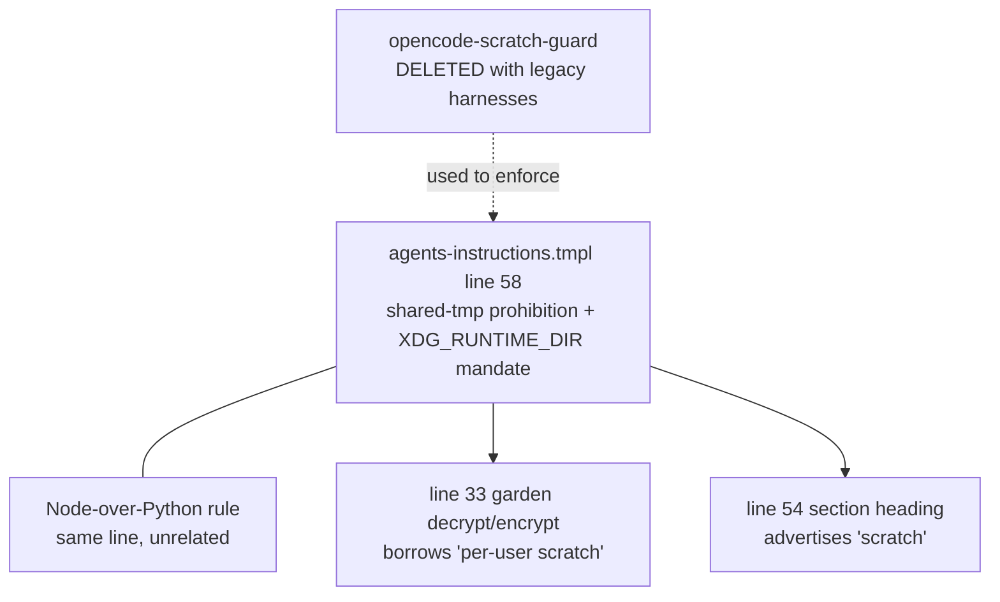

# Remove the Shared Temp Directory Prohibition - Plan

## Goal Capsule
- **Objective:** Delete the shared-temp-directory prohibition from the common agent instruction core. Preserve the independent Node/Deno/Bun-over-Python rule. Remove the undefined scratch qualifier from the garden instruction and narrow the section heading to its surviving content.
- **Product authority:** The user's request governs scope, including the decision to delete rather than relocate or soften. Root `AGENTS.md` governs chezmoi source attributes, single-source-of-truth data files, and isolated verification. `.chezmoitemplates/agents-instructions.tmpl` is the single source for the deployed instruction target.
- **Execution profile:** One localized template edit. Verification renders the omp target under the existing isolated stub-`op` harness and runs the unchanged instruction-gate test. Never apply the source state to live `$HOME`.
- **Stop conditions:** Stop if removal would alter the Node/Deno/Bun-over-Python rule, retain any scratch-location policy, or require a change to `.ci/test-agent-instructions.sh`'s `NEEDLES` or `BANNED` lists.

---

## Product Contract

### Summary

Remove the sentence in `.chezmoitemplates/agents-instructions.tmpl` that denies shared `/tmp`, `/var/tmp`, and `/dev/shm` and mandates a task-scoped `$XDG_RUNTIME_DIR` or `$TMPDIR` scratch directory. Keep the Node-over-Python rule that currently shares that line, and repair the one sentence that borrows the deleted definition. Nothing outside the instruction core changes.

### Problem Frame

The prohibition is a rule without an enforcer. `packages/opencode-scratch-guard/` was the plugin that enforced it mechanically; unmanaging the legacy harnesses deleted that package, and the sentence stayed behind. This repeats the pattern that produced the dangling `.chezmoiignore` narrowing after the `unmanaged-repo-guard` removal — a control is removed and its prose survives, describing a boundary nothing holds.

The cost is now paid on every run. Skills shipped by the compound-engineering plugin write their scratch to `/tmp/compound-engineering-$(id -u)`, which the instruction core forbids. The agent must reconcile a skill instruction against a repository rule on each invocation, and the reconciliation is a judgement call with no correct answer written anywhere. Under the previous harness pairing no shipped skill used `/tmp`, so the conflict never surfaced and the rule cost nothing.

The sentence also does a second job nobody notices until it is deleted. The garden decrypt/encrypt instruction says to use "per-user scratch," and the deleted sentence is the only place that phrase is defined.

### Key Decisions

- KD1. Delete the scratch rule outright rather than relocate its secrets half or demote it to a preference. (session-settled: user-directed — chosen over moving a narrow "no decrypted plaintext in shared directories" clause into the Secrets paragraph and over rewording the prohibition as a preference: both keep a conditional the agent must evaluate, and removing every conditional is the point.) Governs R1, R3.
- KD2. This closes a dangling rule, not a live control. The enforcement it was written for no longer exists, so no protection is being switched off — only prose is. Governs R1.
- KD3. Line 58 carries two unrelated rules and only the scratch half is deleted. The Node/Deno/Bun-over-Python rule has no relationship to scratch location and no other home in the document. Governs R2.
- KD4. `/tmp` in the haptic subsystem is a socket-security property, not scratch policy, and is untouched. Its behavior derives from the socket's owner-only access requirement, not from any agent instruction. Governs R5.
- KD5. The garden sentence drops its scratch qualifier rather than naming a replacement location. (session-settled: user-directed — chosen over naming a concrete path inline and over substituting a vaguer "outside the worktree": either replacement reintroduces a location condition, which is what KD1 set out to remove.) Governs R3.
- KD6. No reintroduction guard is added to the instruction test. (session-settled: user-directed — chosen over the banned-string assertion the `unmanaged-repo-guard` removal used: a change whose purpose is to reduce rules should not grow the checked set, and git records the deletion.) Governs R9.

The deleted sentence is a definition with three dependents and no enforcer:

### Requirements

**Instruction core**

- R1. `.chezmoitemplates/agents-instructions.tmpl` states no prohibition, preference, or mandate about `/tmp`, `/var/tmp`, `/dev/shm`, `$XDG_RUNTIME_DIR`, or `$TMPDIR` as agent scratch locations.
- R2. The rule preferring Node/Deno/Bun or shell over Python for new scripting, tooling, and codegen survives with its meaning unchanged, including the established-Python-tooling exception.
- R3. The garden decrypt/encrypt instruction carries no scratch-location qualifier and names no term the document no longer defines.
- R4. The section heading covering that passage does not advertise guidance the section no longer carries.

**Surfaces that do not change**

- R5. The haptic subsystem's `/tmp` handling is unchanged in both directions: the crate's last-resort socket fallback and the macOS preflight rejection of a literal `/tmp` `TMPDIR` both remain.
- R6. No scratch root moves in `.ci/**`. The `${XDG_RUNTIME_DIR:-$HOME/.cache}` convention those scripts share is theirs, not the instruction core's.
- R7. Root `AGENTS.md` is not edited. It defines its own verification scratch path concretely and states no prohibition.
- R8. Historical records under `docs/plans/**`, `docs/feedback-sweep/**`, and `docs/residual-review-findings/**` are not rewritten.

**Verification**

- R9. `.ci/test-agent-instructions.sh` passes with its `NEEDLES` and `BANNED` lists unmodified.
- R10. The rendered instruction target is proved by isolated `chezmoi execute-template` with a stub `op`, an empty config, and a throwaway destination, never by a live apply.

### Acceptance Examples

- AE1. Rendered target carries the deletion and keeps the survivor.
  - **Covers R1, R2.**
  - **Given:** `dot_omp/private_agent/private_readonly_AGENTS.md.tmpl` rendered in isolation.
  - **When:** the removed scratch-policy clauses are checked and the rendered target is inspected for a remaining scratch-location policy.
  - **Then:** no scratch-location policy remains. The pre-existing rootless Podman socket reference to `$XDG_RUNTIME_DIR/podman/podman.sock` is not scratch guidance. The Python rule remains intact.
- AE2. A skill-directed scratch path meets no contradiction.
  - **Covers R1.**
  - **Given:** a skill instructing the agent to create `/tmp/<tool>-$(id -u)`.
  - **When:** the agent reads the rendered instruction target before acting.
  - **Then:** nothing in it addresses the choice, so the agent follows the skill with no judgement call to make.
- AE3. The garden sentence survives the loss of its neighbour.
  - **Covers R3.**
  - **Given:** the rendered instruction target.
  - **When:** the garden decrypt/encrypt sentence is read on its own.
  - **Then:** every term it uses is either self-evident or defined in the same document.
- AE4. Socket policy is unaffected.
  - **Covers R5.**
  - **Given:** the rendered macOS haptic provisioner run with `TMPDIR=/tmp` and `XDG_RUNTIME_DIR` empty.
  - **When:** preflight runs.
  - **Then:** it still fails before any launchd mutation, exactly as `.ci/test-mxm4-haptic-provision.sh:506-515` asserts today.

### Scope Boundaries

- Patching compound-engineering skill text through `dot_local/share/compound-engineering-overlays/`. The provisioner targets one hardcoded relative path and its stated design never changes archive-owned files; patching upstream skill bodies would have to be redone at every version bump.
- Introducing a replacement enforcement mechanism for the deleted rule, in any form — plugin, CI grep, or asserted string.
- Every surface listed under R5-R8 stays as it is; those requirements own the exclusion and this section does not restate it.

### Dependencies / Assumptions

- A1. The reported symptom is per-run friction — the agent reconciling skill against rule — rather than a hard stop that prevents a skill from running. The diagnostic probe went unanswered. No requirement here depends on which it was; only the Problem Frame's wording would sharpen.
- A2. Deleting the sentence removes the only written protection against decrypted garden plaintext landing in a world-readable directory. Accepted under KD1. The instruction core still forbids committing plaintext and still requires the decrypt round-trip check.
- A3. The deletion breaks no test. `.ci/test-agent-instructions.sh:44-71` lists neither a required needle nor a banned string touching scratch paths.

### Outstanding Questions

None.

### Sources / Research

- `.chezmoitemplates/agents-instructions.tmpl:58` — the sentence to delete, carrying both the scratch rule and the Node-over-Python rule.
- `.chezmoitemplates/agents-instructions.tmpl:33` — the garden instruction that borrows "per-user scratch"; the template defines that phrase nowhere else.
- `.chezmoitemplates/agents-instructions.tmpl:54` — the section heading listing `scratch`.
- `.ci/test-agent-instructions.sh:44-71` — the `NEEDLES` and `BANNED` lists; neither mentions a scratch path.
- `dot_local/share/omp-plugins/plugins/` — contains only `mxm4-haptic`; no plugin enforces a scratch policy.
- `docs/plans/2026-08-10-001-refactor-remove-unmanaged-repo-guard-plan.md` — the precedent for removing a rule together with its enforcement, and a contrast for the rejected banned-string assertion.
- `crates/mxm4-haptic/src/lib.rs:98-116` and `.chezmoiscripts/60-build/run_after_build-mxm4-haptic.sh.tmpl:278` — the socket-path `/tmp` handling that stays.
- `AGENTS.md:72,77` — the root supplement's own verification scratch path, self-defined and unaffected.

---

## Planning Contract

### Key Technical Decisions

- KTD1. **Rename the section to `Figma, processes, and browser`.** The heading must not advertise scratch guidance after its only scratch-policy sentence is removed. Rejected alternative: retain `scratch` as a historical category. Reason: R4 requires the heading to describe only the surviving content. Cites R4.
- KTD2. **Keep the Node/Deno/Bun-over-Python rule in its current sentence.** Delete only the preceding scratch-policy clauses and leave the survivor's wording and established-tooling exception byte-for-byte unchanged. Rejected alternative: move the survivor to the JavaScript section. Reason: the relocation adds unrelated churn and gives no requirement benefit. Cites R2.

### Implementation Constraints

- The common template uses long, unwrapped prose lines. Edit the smallest sentence spans. Do not reflow adjacent policy text.
- The omp target wrapper is the only consumer. Its `includeTemplate "agents-instructions.tmpl"` call means rendering the wrapper is the production-equivalent proof.
- The `.ci/test-agent-instructions.sh` scratch directory is test infrastructure. It is not part of the removed agent instruction policy and its `NEEDLES` and `BANNED` blocks stay unchanged.

### Sequencing

Implement U1 as one atomic template edit. Run the isolated render and the existing instruction-gate test immediately after it. Finish with the repository-required whitespace and scope checks.

---

## Implementation Units

### U1. Remove the stale scratch policy from the common instruction core

- **Goal:** Remove all shared-temporary-directory and task-scratch guidance from the rendered omp instruction target without changing neighbouring policy.
- **Requirements:** R1-R10; KD1-KD6; KTD1, KTD2; AE1-AE4.
- **Dependencies:** none.
- **Files:**
  - `.chezmoitemplates/agents-instructions.tmpl` (modify)
  - `.ci/test-agent-instructions.sh` (verify only; do not modify)
  - `dot_omp/private_agent/private_readonly_AGENTS.md.tmpl` (render only; do not modify)
- **Approach:**
  1. Change `## Figma, processes, scratch, and browser` to `## Figma, processes, and browser`.
  2. In the garden instruction, delete ` using per-user scratch` including the leading space, so the decrypt/encrypt route reads `non-interactively, then apply` without a replacement scratch-location condition.
  3. On the combined scratch/Python line, delete the two scratch-policy sentences through `clean scratch.` and leave `New scripting/tooling/codegen uses Node/Deno/Bun or shell for OS glue, not Python (except established Python tooling).` unchanged and in place.
  4. Do not edit the haptic `/tmp` policy, `.ci/**` scratch handling, root `AGENTS.md`, historical records, or the instruction-gate lists.
- **Patterns to follow:** Keep the template's current one-line-per-paragraph style and RFC 2119 vocabulary. Use the wrapper's existing direct inclusion path for rendering rather than copying the common template into a test fixture.
- **Test scenarios:**
  - Render the wrapper with the isolated stub-`op` harness. The removed scratch-policy clauses are absent, no remaining instruction directs an agent to choose a scratch location, and the independent `$XDG_RUNTIME_DIR/podman/podman.sock` socket reference remains allowed.
  - The rendered output still contains the complete Node/Deno/Bun-or-shell rule, including `except established Python tooling`.
  - The rendered garden sentence contains neither `per-user scratch` nor a replacement scratch location.
  - `.ci/test-agent-instructions.sh` passes without edits to its `NEEDLES` or `BANNED` lists.
- **Verification:** Run `bash .ci/test-agent-instructions.sh`. Independently render `dot_omp/private_agent/private_readonly_AGENTS.md.tmpl` with a stub `op`, empty config, throwaway destination, `--source "$PWD"`, and `chezmoi execute-template`; inspect the rendered target for the deletion and surviving rule. Run `git diff --check`, `git status`, and a requested-scope diff. Never run `chezmoi apply`.

---

## Verification Contract

| Gate | What it proves | Owning unit |
|---|---|---|
| Isolated `chezmoi execute-template` render of `dot_omp/private_agent/private_readonly_AGENTS.md.tmpl` with stub `op`, empty config, throwaway destination, and `--source "$PWD"` | The deployed omp instruction target has no scratch-location policy, retains the Python-rule survivor, and has no dangling garden qualifier. | U1 |
| `bash .ci/test-agent-instructions.sh` | The unchanged rendered-instruction gate still preserves its existing positive and retired-gate assertions. | U1 |
| `git diff --check`, `git status`, and a diff limited to `.chezmoitemplates/agents-instructions.tmpl` | The edit is whitespace-clean and restricted to the common instruction core. | U1 |

---

## Definition of Done

- U1 is complete and every changed instruction sentence maps to R1-R4.
- The rendered omp target contains no policy about `/tmp`, `/var/tmp`, `/dev/shm`, `$XDG_RUNTIME_DIR`, or `$TMPDIR` as scratch locations.
- The Node/Deno/Bun-over-Python rule survives with its established-Python-tooling exception.
- The garden instruction needs no deleted definition and names no new scratch location.
- The isolated render and `.ci/test-agent-instructions.sh` pass.
- No live `$HOME` deployment, test-list edit, haptic change, `.ci/**` scratch-root change, or historical-record rewrite is present.
