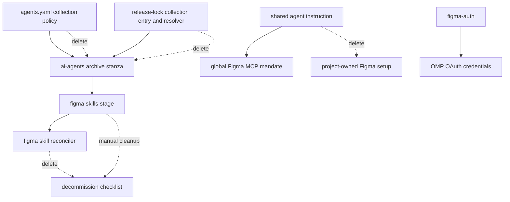

# Remove Global Figma Management - Plan

## Goal Capsule

- **Objective:** Retire global Figma skills and Figma-MCP guidance from this dotfiles source while retaining the `figma-auth` OAuth utility and existing OMP credentials.
- **Authority:** The Product Contract defines the ownership boundary. `AGENTS.md` defines source-state, release-lock, and manual-decommission rules.
- **Execution profile:** Delete the single-purpose collection lifecycle, then prove remaining templates, release-lock behavior, and agent instructions do not recreate it.
- **Stop conditions:** Stop if removal requires deleting or rewriting `packages/figma-auth/`, existing Figma OAuth rows, unrelated external skills, or any project-owned Figma configuration.
- **Tail ownership:** LFG owns implementation, review, commit, push, pull request, and CI monitoring.

---

## Product Contract

### Summary

This repository stops providing global Figma skills and Figma MCP guidance.
Projects that need Figma own their MCP configuration and skills.
`figma-auth` remains available for on-demand OAuth into OMP's native credential store.

### Problem Frame

The source currently resolves and installs the official Figma skill collection on every managed host.
Figma is optional and should be configured only by projects that use it.
The global collection leaves unused skills and policy on hosts where no project needs them.

### Key Decisions

- **Project-owned Figma support.** Global Figma skills and MCP policy are removed so each project can declare its needed integration. Governs R1-R3. (session-settled: user-directed — chosen over retaining global provisioning: Figma skills and MCPs are managed by the project that requires them.)
- **Complete collection cutover.** Remove the Figma-specific release-lock, staging, reconciliation, and verification surface instead of leaving dormant collection machinery. Governs R2-R3. (session-settled: user-directed — chosen over stopping only installation: obsolete global-management code must not remain.)
- **Broad manual skill cleanup.** The migration removes every globally installed Figma-named skill, not only ledger-recorded collection entries. Governs R4-R5. (session-settled: user-directed — chosen over ledger-only cleanup: no `figma-*` global skills may remain.)
- **Retain authentication.** Keep `figma-auth` and existing OAuth credentials independent of the removed global integration policy. Governs R6-R7. (session-settled: user-directed — chosen over removing all Figma-related assets: the utility is required to authenticate Figma.)

### Requirements

**Global ownership retirement**

- R1. The dotfiles source MUST not declare, render, or instruct use of a global Figma MCP integration.
- R2. The dotfiles source MUST not resolve, lock, fetch, stage, or reconcile Figma skills into the shared agent-skills directory.
- R3. Removing the Figma collection path MUST preserve unrelated managed skills and release-lock behavior.

**Live-state cleanup**

- R4. The migration MUST document a one-time manual cleanup that removes every direct child matching `figma-*` from `~/.agents/skills`.
- R5. The same cleanup MUST remove the Figma-specific staging and ownership state without adding a chezmoi teardown or revert script.

**Authentication preservation**

- R6. The `figma-auth` package and its on-demand build provisioner MUST remain available.
- R7. The migration MUST not delete, rewrite, or require reauthorization of existing Figma OAuth credentials.

### Actors

- A1. **Dotfiles maintainer:** Removes the global integration policy and follows the one-time cleanup on existing hosts.
- A2. **Chezmoi:** Applies retained agent configuration without a Figma skill lifecycle.
- A3. **Project maintainer:** Adds Figma MCP configuration and skills only where the project requires them.
- A4. **figma-auth:** Stores Figma OAuth credentials in OMP when the user invokes it.

### Key Flows

- F1. **Future host convergence**
  - **Trigger:** A host applies the revised dotfiles source.
  - **Actors:** A1, A2.
  - **Steps:** Chezmoi renders the retained agent configuration without fetching or reconciling Figma skills.
  - **Outcome:** The shared agent-skills directory receives no Figma skills from this repository.
  - **Covered by:** R1-R3.
- F2. **One-time existing-host cleanup**
  - **Trigger:** A maintainer removes an obsolete global Figma installation.
  - **Actors:** A1.
  - **Steps:** The maintainer follows the decommission document to remove every global `figma-*` skill and the Figma-specific stage and ownership state.
  - **Outcome:** No global Figma skills remain. Unrelated skills and OAuth credentials remain intact.
  - **Covered by:** R4-R5, R7.
- F3. **Project-scoped authentication**
  - **Trigger:** A project needs Figma access and the user invokes `figma-auth`.
  - **Actors:** A1, A4.
  - **Steps:** The utility completes OAuth and saves a refreshable credential in OMP's native store.
  - **Outcome:** Project-owned Figma configuration can authenticate without restoring global skill management.
  - **Covered by:** R6-R7.

### Acceptance Examples

- AE1. **No global Figma lifecycle on a new host**
  - **Given:** A host applies the revised source.
  - **When:** Chezmoi renders agent externals, scripts, and agent instructions.
  - **Then:** No Figma collection archive, staging target, reconciliation script, or global Figma-MCP instruction is produced.
  - **Covers:** R1-R3.
- AE2. **Complete cleanup of an existing host**
  - **Given:** `~/.agents/skills` contains Figma-named skill directories, including directories absent from the old ownership ledger.
  - **When:** The maintainer follows the one-time cleanup.
  - **Then:** Every direct `figma-*` child and the Figma-specific stage and ownership state are removed. Unrelated skills and OAuth credentials are unchanged.
  - **Covers:** R4-R5, R7.
- AE3. **Authentication remains available**
  - **Given:** The global Figma collection has been removed.
  - **When:** A user invokes `figma-auth` for OMP.
  - **Then:** The utility can complete its normal OAuth credential flow without global Figma skills or MCP policy.
  - **Covers:** R6-R7.

### Scope Boundaries

- Project repositories own Figma MCP configuration, skills, and project-specific instructions after this cutover.
- `packages/figma-auth/`, its build provisioner, and OAuth tests remain unchanged.
- The migration does not delete existing OAuth credentials.
- The live-state cleanup is a documented maintainer action. It is not an automatic chezmoi teardown or revert script.
- Historical plans remain historical records. They are not rewritten to remove Figma references.

---

## Planning Contract

### Key Technical Decisions

- KTD1. **Delete the collection resolver capability.** Remove `githubSkillCollection` from the release-lock type system, dispatch table, registry, implementation, tests, generated lock, and documentation because the Figma collection is its only consumer. This implements the complete collection cutover decision for R2-R3. (session-settled: user-directed — chosen over retaining dormant generic collection support: obsolete global-management code must not remain.)
- KTD2. **Use a manual decommission checklist for live-state residue.** Add a `docs/decommission/` checklist that removes all direct `figma-*` skill children plus the known stage and ownership paths after source removal. Do not add a chezmoi teardown, revert script, or automatic broad deletion. This implements R4-R5. (session-settled: user-directed — chosen over ledger-only cleanup: no `figma-*` global skills may remain.)
- KTD3. **Replace positive collection checks with negative rendered-boundary checks.** Delete the native Figma staging/reconciliation job and test fixtures. Make the remaining render and instruction tests assert the absent source and generated surfaces while preserving unrelated skills and workflow gates. This proves R1-R3 without retaining the retired behavior.
- KTD4. **Keep authentication outside the cutover.** Do not modify `packages/figma-auth/`, its build script, or `~/.omp/agent/agent.db` handling. The cleanup document names credentials as protected state. This implements R6-R7. (session-settled: user-directed — chosen over removing all Figma-related assets: the utility is required to authenticate Figma.)

### High-Level Technical Design

The deleted path ends at the shared skill root.
The retained `figma-auth` path continues to the OMP credential store and is not part of cleanup.

### Sequencing

1. Remove the source declarations and global instruction before deleting collection-specific consumers.
2. Remove the typed release-lock capability and regenerate the lock through its own CLI.
3. Delete the reconciler and its focused fixtures. Add the manual decommission document.
4. Remove obsolete workflow gates and convert render/instruction checks to absence checks.
5. Run the package, render, and hygiene verification gates without applying to the live home directory.

### Risks and Mitigations

- **A stale collection type or registry entry can make an unused resolver look supported.** U2 removes the full type-to-test path and proves the registry has no collection entry.
- **A positive CI assertion can leave a retired dependency or an orphaned aggregate variable.** U4 updates the job, aggregate `needs`, result environment, and result loop together.
- **Existing hosts retain files because source deletion does not prune externally staged state.** U3 provides a direct-child cleanup checklist and names protected credential state.
- **A broad source sweep could remove `figma-auth` or historical evidence.** U1-U4 target only global-management names. Historical plans and `packages/figma-auth/` are explicit non-goals.

### Sources and Research

- `.chezmoidata/agents.yaml:101-139` owns the Figma collection policy and unrelated external skill list.
- `.chezmoiexternals/ai-agents.toml:75-99` renders the exact archive and staging target from that policy and the lock.
- `.chezmoiscripts/70-agents/run_after_install-figma-skills.sh.tmpl` is the collection-only transactional reconciler.
- `packages/release-lock/src/github-skill-collection.ts`, `src/types.ts:38-66`, `src/resolve-all.ts:1-40`, and `src/registry.ts:196-201` form the collection resolver capability.
- `packages/release-lock/test/github-skill-collection.test.ts` and `test/cli.test.ts` cover the retired resolver and dispatcher.
- `.github/workflows/ci.yml:115-131,223-263` and `.github/workflows/render-dotfiles.yml:435-454,745-764` contain the positive Figma CI gates.
- `.ci/test-agent-instructions.sh:32-73` already renders the OMP instruction wrapper and supports banned-rule assertions.
- `docs/decommission/ydotool.md` is the manual operator-checklist precedent.
- `packages/figma-auth/src/storage/omp.ts:24-118` writes the independent OMP credential row and remains unchanged.

---

## Implementation Units

### U1. Remove global policy, external staging, and instruction guidance

- **Goal:** Remove all source declarations that cause a global Figma archive, stage, or MCP mandate to render.
- **Requirements:** R1-R3.
- **Dependencies:** None.
- **Files:** `.chezmoidata/agents.yaml`, `.chezmoiexternals/ai-agents.toml`, `.chezmoitemplates/agents-instructions.tmpl`.
- **Approach:** Delete the `agents.skills.collections.figma` data and its explanatory collection-only comments. Delete the paired Figma archive stanza from `ai-agents.toml`. Remove the Figma heading and global `figma` MCP mandate from the shared instruction template while preserving the neighboring process, browser, and scripting guidance.
- **Patterns:** Retain the generic `agents.skills.external` loop and the data-first ownership model. Use `docs/plans/2026-07-15-002-chore-remove-meridian-proxy-plan.md` as the removal-and-render-boundary precedent.
- **Test scenarios:**
  - Rendered `ai-agents.toml` contains the unrelated external skills but no Figma archive URL, stage path, or lock-derived collection data. Covers AE1.
  - The rendered OMP `AGENTS.md` has no global Figma MCP instruction while all existing protected instruction needles remain. Covers AE1.
- **Verification:** U4's isolated render and instruction checks.

### U2. Remove the Figma release-lock capability and generated entry

- **Goal:** Remove the single-consumer collection resolver from the release-lock package without affecting supported release kinds.
- **Requirements:** R2-R3.
- **Dependencies:** U1.
- **Files:** `.chezmoidata/releases.json`, `packages/release-lock/src/github-skill-collection.ts`, `packages/release-lock/src/types.ts`, `packages/release-lock/src/resolve-all.ts`, `packages/release-lock/src/registry.ts`, `packages/release-lock/test/github-skill-collection.test.ts`, `packages/release-lock/test/cli.test.ts`, `packages/release-lock/README.md`.
- **Approach:** Delete the collection resolver module and its dedicated tests. Remove `LockedSkillCollection` and `githubSkillCollection`, the resolver import/dispatch row, the Figma registry entry, and CLI fixtures/assertions that model the retired kind. Update the package README's supported-kind count, collection-specific explanation, and focused fixture commands. Regenerate `.chezmoidata/releases.json` through `packages/release-lock` after the registry change; inspect the generated diff so the Figma entry is the only intentional lock removal.
- **Patterns:** Preserve the `ResolverKind` exhaustiveness test in `test/cli.test.ts` for all retained kinds and retain the partial-resolution overlay contract.
- **Test scenarios:**
  - `RESOLVERS` lists every retained kind and no collection resolver. Covers R2-R3.
  - The generated lock has no `figma/mcp-server-guide` key while other registered entries keep their typed records. Covers AE1.
  - Package type checking and tests pass after the deleted union member and fixture types are removed. Covers R3.
- **Verification:** `vp run -r typecheck` and `vp run -r test` from `packages/`, plus the lock-diff inspection required by `AGENTS.md`.

### U3. Delete collection reconciliation and document existing-host cleanup

- **Goal:** Remove the automatic collection reconciler and give maintainers a safe, complete manual cleanup path.
- **Requirements:** R2, R4-R7.
- **Dependencies:** U1, U2.
- **Files:** `.chezmoiscripts/70-agents/run_after_install-figma-skills.sh.tmpl`, `.ci/test-figma-skills-stage.sh`, `.ci/test-figma-skills-reconcile.sh`, `docs/decommission/figma-global-skills.md`.
- **Approach:** Delete the collection-only reconciliation script and both network-free fixtures. Add a decommission checklist that runs after the revised source is available. It must remove every direct `~/.agents/skills/figma-*` child, including unledgered directories, then remove `~/.local/share/figma-skills-stage` and `~/.local/state/figma-skills`. State that the steps are manual and are not run by chezmoi. Explicitly protect unrelated skill children and `~/.omp/agent/agent.db` or any existing OAuth credential.
- **Patterns:** Follow `docs/decommission/ydotool.md`: state scope, ordering, operator commands, verification, and what must remain. Do not add teardown or revert automation.
- **Test scenarios:**
  - The source tree contains no Figma reconciler or staging fixture. Covers AE1.
  - The decommission document directs a glob over direct `figma-*` children, not an ownership-ledger list. Covers AE2.
  - The document names all retained credential boundaries and does not instruct a reauthorization. Covers AE2-AE3.
- **Verification:** U4's source/render absence assertions and manual review of the decommission commands against the documented paths.

### U4. Reconcile CI and rendered-boundary tests

- **Goal:** Replace checks for the retired lifecycle with checks that it cannot render or reappear.
- **Requirements:** R1-R3, R6-R7.
- **Dependencies:** U1-U3.
- **Files:** `.ci/test-agent-instructions.sh`, `.github/workflows/ci.yml`, `.github/workflows/render-dotfiles.yml`.
- **Approach:** Add the retired global Figma mandate to `test-agent-instructions.sh`'s banned needles while preserving all positive guardrail needles. Remove `figma-skills-native` from `ci.yml` and delete its aggregate `needs`, environment variable, and result-loop entry. Replace each positive rendered-Figma assertion in `render-dotfiles.yml` with absence assertions for the Figma archive/stage and the deleted reconciler, while keeping the rendered-internals artifact workflow and its other checks intact.
- **Patterns:** Keep tests scoped to the old global-management identifiers. Do not treat legitimate `figma-auth` references as failures.
- **Test scenarios:**
  - The isolated instruction render fails if the global Figma MCP mandate returns. Covers AE1.
  - Linux and macOS rendered-internals checks fail if a Figma archive, stage reference, or reconciler file returns. Covers AE1.
  - The final-delivery aggregate references only jobs that still exist. Covers R3.
  - Existing OMP instruction, TypeScript, Rust, tmux, and compound-engineering gates remain in the final aggregate. Covers R3.
- **Verification:** Run `.ci/test-agent-instructions.sh`; validate both workflow files with the repository's available workflow linter; rely on CI to execute Linux/macOS renders and the final aggregate.

### U5. Confirm the retained authentication boundary and documentation

- **Goal:** Leave durable operator documentation and package documentation consistent with source behavior.
- **Requirements:** R4-R7.
- **Dependencies:** U2-U4.
- **Files:** `docs/decommission/figma-global-skills.md`, `packages/release-lock/README.md`.
- **Approach:** Review the finished decommission document and release-lock README against the final source. The decommission guide is the sole live document for removing obsolete global residue. The release-lock README names only supported resolver kinds and no longer claims Figma consumer fixtures. Leave `packages/figma-auth/`, its build script, and existing OAuth tests untouched.
- **Patterns:** Treat `figma-auth` as an on-demand utility, not global integration policy.
- **Test scenarios:**
  - A source sweep for `figma/mcp-server-guide`, `figma-skills-stage`, and the deleted reconciler name has no live code/config/workflow hits outside historical plans and the decommission document where appropriate. Covers R1-R3.
  - `packages/figma-auth/` has no changed files. Covers R6-R7.
- **Verification:** Scoped diff review, `git diff --check`, and `git status`.

---

## Verification Contract

| Gate | Command or inspection | Covers | Pass condition |
|---|---|---|---|
| Release-lock package | `vp run -r typecheck` and `vp run -r test` from `packages/` | U2 | Retained resolver types, dispatch tests, and lock behavior pass. |
| Workspace quality | `vp check` from `packages/` | U2 | Formatting, linting, and staged TypeScript checks pass. |
| Shared instruction render | `.ci/test-agent-instructions.sh` | U1, U4 | The OMP wrapper renders, protected guardrails remain, and the retired Figma mandate is absent. |
| Isolated template render | The `AGENTS.md` stub-`op` plus throwaway-destination recipe against `.chezmoiexternals/ai-agents.toml` | U1, U3, U4 | The external template renders without Figma archive/stage content. No live `$HOME` target changes. |
| Rendered-internals workflow | CI `render-dotfiles.yml` on Linux and macOS | U1, U3, U4 | Neither platform emits the Figma collection archive or reconciler. |
| Workflow validity | Available repository workflow linter over `.github/workflows/ci.yml` and `.github/workflows/render-dotfiles.yml` | U4 | No invalid `needs`, undefined result variable, or YAML syntax error remains. |
| Source/decommission audit | Scoped review and term sweep excluding historical plans | U3, U5 | Retired global-management identifiers are absent from active code/config/workflow files. The manual cleanup lists direct-child deletion, stage/state deletion, and protected credentials. |
| Diff hygiene | `git diff --check`, `git status`, and requested-scope diff | All | No whitespace errors, unrelated changes, or plaintext credentials. |

No verification step runs `chezmoi apply`, deletes live files, or invokes the interactive OAuth flow.

---

## Definition of Done

- U1 is done when no source data, external template, or shared instruction produces global Figma skills or a global Figma MCP mandate.
- U2 is done when `githubSkillCollection`, its resolver, its tests, its registry entry, and the generated Figma lock entry are absent while retained release-lock tests pass.
- U3 is done when no Figma reconciliation or staging fixture remains and `docs/decommission/figma-global-skills.md` gives an explicit manual cleanup that preserves unrelated skills and OMP OAuth credentials.
- U4 is done when the obsolete native job and positive Figma checks are gone, negative rendered-boundary checks cover Linux/macOS and the OMP instruction wrapper, and the final CI aggregate has no stale Figma job wiring.
- U5 is done when current source documentation describes only retained release-lock capabilities and the protected `figma-auth` boundary.
- All R1-R7 and AE1-AE3 are traced to an implemented unit and verification gate.
- No `packages/figma-auth/` source, tests, build provisioner, or OAuth credential handling changes.
- No teardown or revert script is added. No live `$HOME` state is applied or deleted during verification.
- The final diff contains no abandoned code, stale Figma lifecycle references, unrelated generated-lock churn, or secrets.
